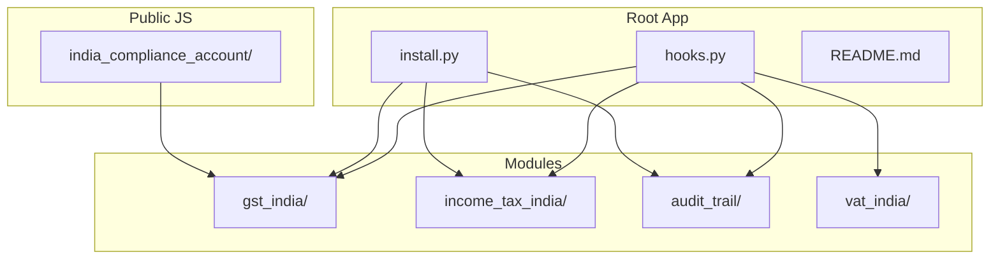
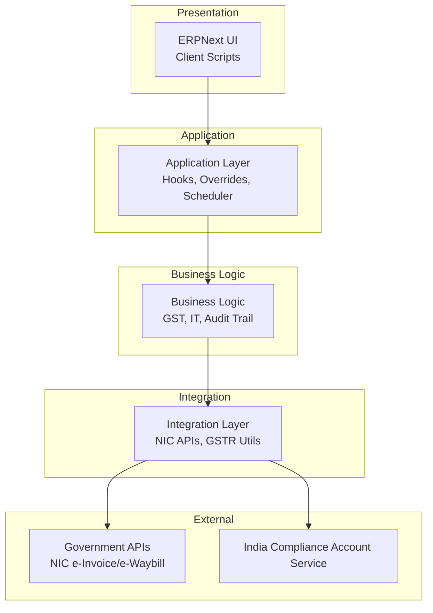
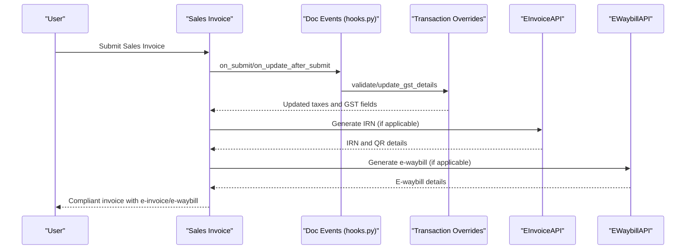
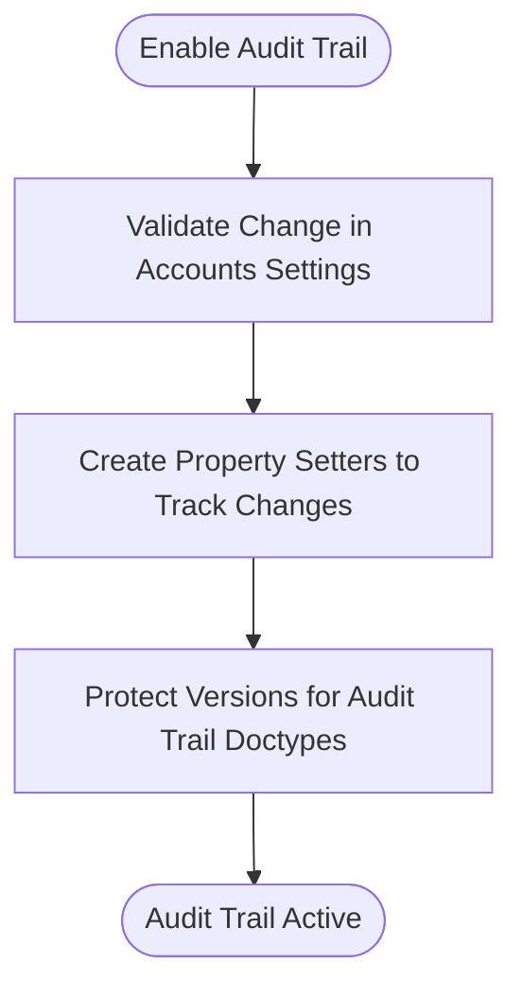
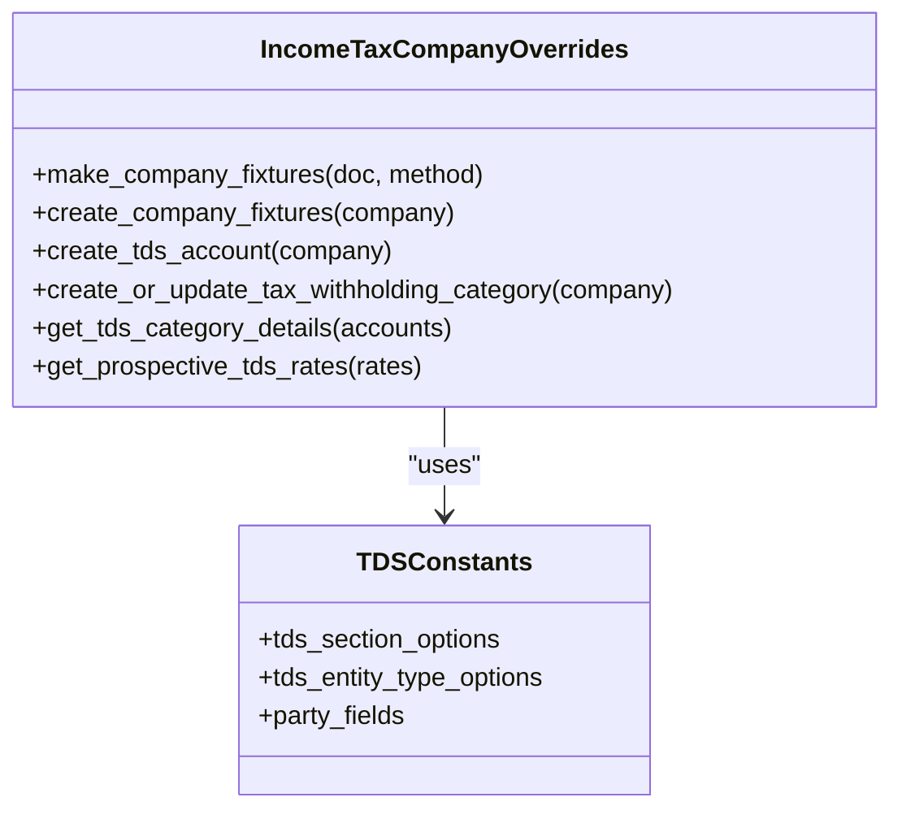
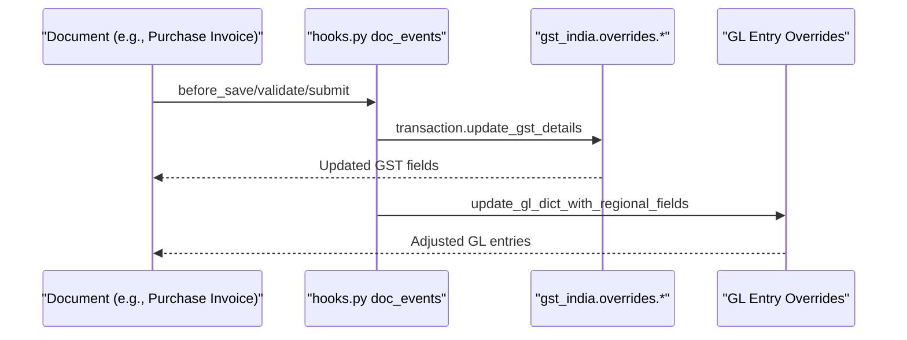
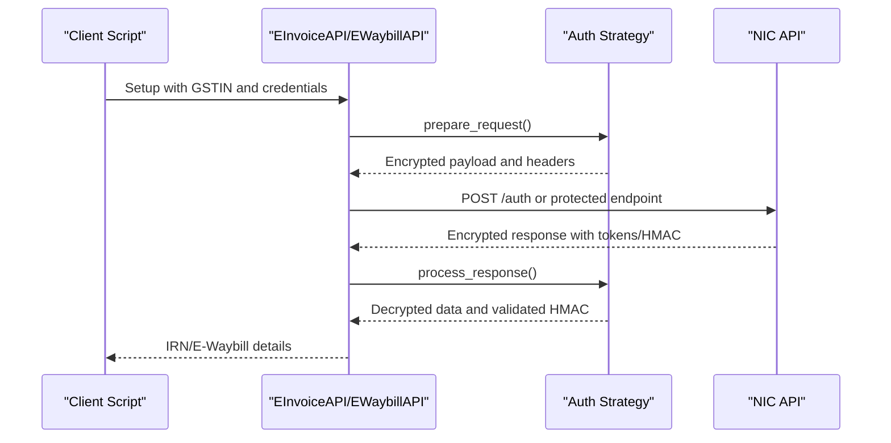
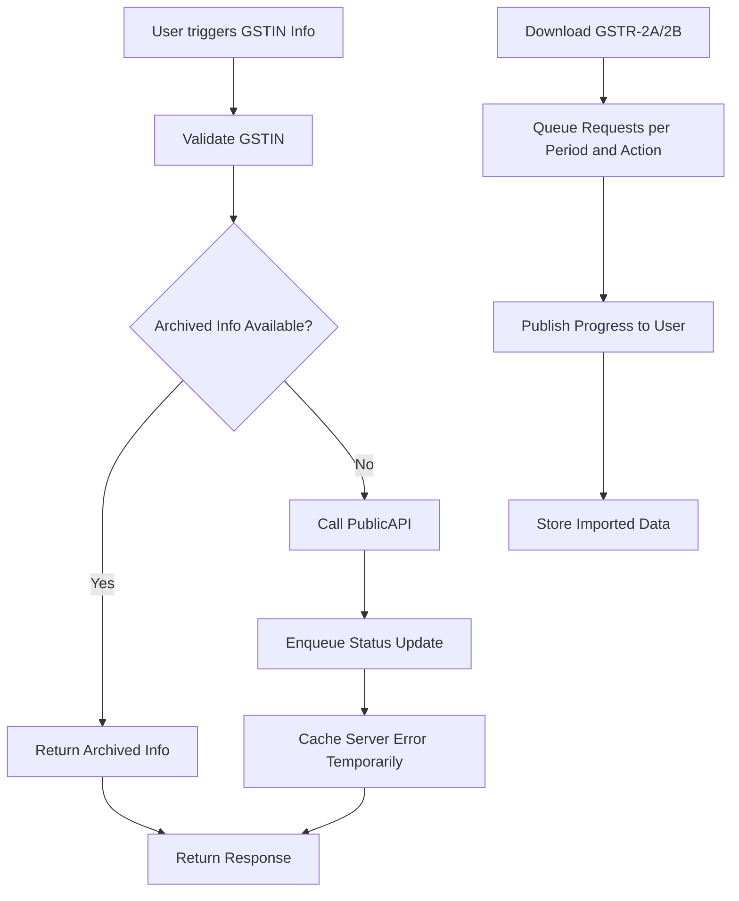
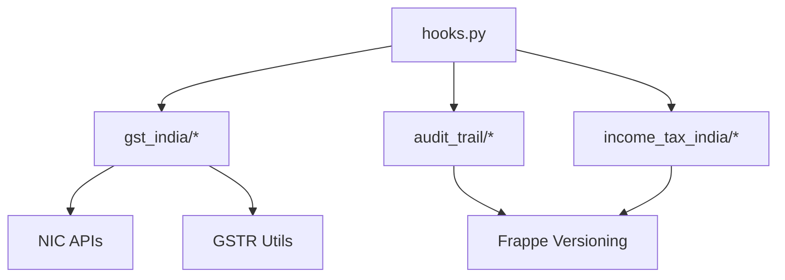
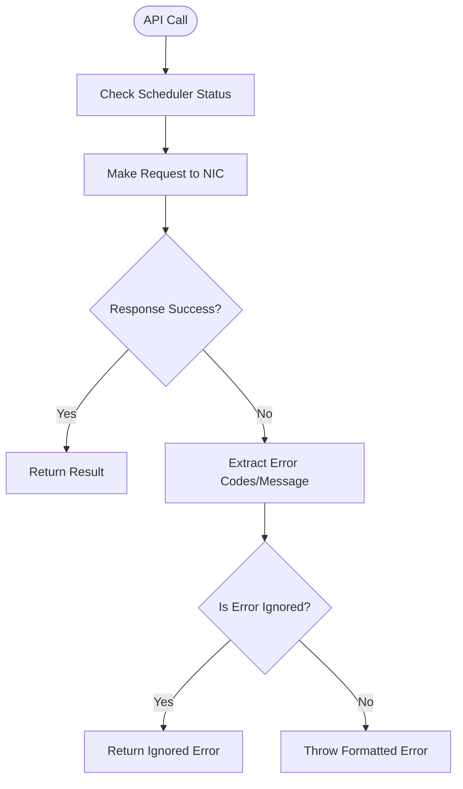

# Architecture & Design

<cite>
**Referenced Files in This Document**
- [README.md](file://README.md)
- [hooks.py](file://india_compliance/hooks.py)
- [install.py](file://india_compliance/install.py)
- [gst_india/api_classes/nic/auth.py](file://india_compliance/gst_india/api_classes/nic/auth.py)
- [gst_india/api_classes/nic/e_invoice.py](file://india_compliance/gst_india/api_classes/nic/e_invoice.py)
- [gst_india/api_classes/nic/e_waybill.py](file://india_compliance/gst_india/api_classes/nic/e_waybill.py)
- [gst_india/utils/gstin_info.py](file://india_compliance/gst_india/utils/gstin_info.py)
- [gst_india/utils/gstr_2/__init__.py](file://india_compliance/gst_india/utils/gstr_2/__init__.py)
- [audit_trail/setup.py](file://india_compliance/audit_trail/setup.py)
- [audit_trail/overrides/accounts_settings.py](file://india_compliance/audit_trail/overrides/accounts_settings.py)
- [audit_trail/overrides/version.py](file://india_compliance/audit_trail/overrides/version.py)
- [audit_trail/utils.py](file://india_compliance/audit_trail/utils.py)
- [income_tax_india/overrides/company.py](file://india_compliance/income_tax_india/overrides/company.py)
- [income_tax_india/constants/custom_fields.py](file://india_compliance/income_tax_india/constants/custom_fields.py)
- [vat_india/doctype/c_form/c_form.py](file://india_compliance/vat_india/doctype/c_form/c_form.py)
- [india_compliance_account/services/AuthService.js](file://india_compliance/public/js/india_compliance_account/services/AuthService.js)
- [india_compliance_account/india_compliance_account.bundle.js](file://india_compliance/public/js/india_compliance_account/india_compliance_account.bundle.js)
</cite>

## Table of Contents
1. [Introduction](#introduction)
2. [Project Structure](#project-structure)
3. [Core Components](#core-components)
4. [Architecture Overview](#architecture-overview)
5. [Detailed Component Analysis](#detailed-component-analysis)
6. [Dependency Analysis](#dependency-analysis)
7. [Performance Considerations](#performance-considerations)
8. [Troubleshooting Guide](#troubleshooting-guide)
9. [Conclusion](#conclusion)
10. [Appendices](#appendices)

## Introduction
This document describes the architecture and design of the India Compliance system, a compliance-focused application built on the Frappe Framework and integrated with ERPNext. It focuses on the modular plugin design, layered architecture, event-driven mechanisms, and integration patterns with government APIs via the NIC portal and taxpayer services. The system encompasses three primary modules:
- GST India: e-invoice/e-waybill, GSTR downloads, audit trail integration, and transaction overrides
- Income Tax India: TDS/TCS automation and related company fixtures
- VAT India: Legacy C-Form support (deprecated)

The document also covers system boundaries, data flows for GST compliance processes, security considerations, scalability patterns, caching strategies, and performance optimizations.

**Section sources**
- [README.md](file://README.md#L26-L64)

## Project Structure
The repository is organized into distinct modules under a single Frappe app:
- Root app metadata and hooks define installation, migrations, document events, regional overrides, and scheduled tasks
- gst_india: Core GST compliance logic, client scripts, doctypes, reports, utilities, and API integrations
- income_tax_india: Income tax automation and company fixtures
- audit_trail: Audit trail setup, validation, and version protection
- vat_india: Legacy VAT module (C-Form)
- public/js: Frontend integration with the India Compliance Account service and GST APIs
- patches: Post-install and version migration scripts

**Diagram sources**
- [hooks.py](file://india_compliance/hooks.py#L1-L684)
- [install.py](file://india_compliance/install.py#L1-L119)

**Section sources**
- [hooks.py](file://india_compliance/hooks.py#L1-L684)
- [install.py](file://india_compliance/install.py#L1-L119)

## Core Components
- Event-driven document lifecycle hooks orchestrated via hooks.py to enforce GST and audit trail validations and to trigger regional overrides
- Regional overrides for taxes and accounting to align with Indian regulations
- API clients for NIC e-Invoice/e-Waybill with dual authentication strategies (Standard vs Enriched)
- Audit trail setup and enforcement for critical doctypes
- Income tax automation for TDS/TCS categories and company fixtures
- Scheduler-based jobs for retries, GSTR downloads, and reconciliation
- Frontend integration for India Compliance Account and GST API communication

**Section sources**
- [hooks.py](file://india_compliance/hooks.py#L118-L388)
- [gst_india/api_classes/nic/auth.py](file://india_compliance/gst_india/api_classes/nic/auth.py#L27-L195)
- [gst_india/api_classes/nic/e_invoice.py](file://india_compliance/gst_india/api_classes/nic/e_invoice.py#L12-L271)
- [gst_india/api_classes/nic/e_waybill.py](file://india_compliance/gst_india/api_classes/nic/e_waybill.py#L17-L259)
- [audit_trail/setup.py](file://india_compliance/audit_trail/setup.py#L16-L47)
- [income_tax_india/overrides/company.py](file://india_compliance/income_tax_india/overrides/company.py#L7-L147)

## Architecture Overview
The system follows a layered architecture:
- Presentation Layer: ERPNext UI and custom client scripts for GST and audit trail
- Application Layer: Frappe hooks, regional overrides, and scheduler events
- Business Logic Layer: Transaction validation, ITC computation, reconciliation, and reporting utilities
- Integration Layer: NIC e-Invoice/e-Waybill APIs, GSTR downloads, and India Compliance Account service

**Diagram sources**
- [hooks.py](file://india_compliance/hooks.py#L118-L388)
- [gst_india/api_classes/nic/e_invoice.py](file://india_compliance/gst_india/api_classes/nic/e_invoice.py#L44-L54)
- [gst_india/api_classes/nic/e_waybill.py](file://india_compliance/gst_india/api_classes/nic/e_waybill.py#L40-L50)
- [india_compliance_account/india_compliance_account.bundle.js](file://india_compliance/public/js/india_compliance_account/india_compliance_account.bundle.js#L58-L86)

## Detailed Component Analysis

### GST India Module
The GST India module implements:
- Document event hooks for Sales/Purchase/Stock transactions to compute taxes, validate GST details, and manage e-waybill/e-invoice lifecycle
- Regional overrides for taxes and accounting entries to align with Indian standards
- API clients for NIC e-Invoice and e-Waybill supporting sandbox and fallback modes
- Utilities for GSTR downloads, GSTIN info, and reconciliation

**Diagram sources**
- [hooks.py](file://india_compliance/hooks.py#L224-L241)
- [gst_india/api_classes/nic/e_invoice.py](file://india_compliance/gst_india/api_classes/nic/e_invoice.py#L102-L117)
- [gst_india/api_classes/nic/e_waybill.py](file://india_compliance/gst_india/api_classes/nic/e_waybill.py#L104-L117)

**Section sources**
- [hooks.py](file://india_compliance/hooks.py#L118-L388)
- [gst_india/api_classes/nic/e_invoice.py](file://india_compliance/gst_india/api_classes/nic/e_invoice.py#L12-L271)
- [gst_india/api_classes/nic/e_waybill.py](file://india_compliance/gst_india/api_classes/nic/e_waybill.py#L17-L259)

### Audit Trail System
The audit trail enforces immutable versioning for selected doctypes and prevents alteration of protected versions. It integrates with Accounts Settings to enable audit trail and sets property setters to track changes.

**Diagram sources**
- [audit_trail/overrides/accounts_settings.py](file://india_compliance/audit_trail/overrides/accounts_settings.py#L12-L30)
- [audit_trail/setup.py](file://india_compliance/audit_trail/setup.py#L25-L42)
- [audit_trail/overrides/version.py](file://india_compliance/audit_trail/overrides/version.py#L26-L32)

**Section sources**
- [audit_trail/setup.py](file://india_compliance/audit_trail/setup.py#L16-L47)
- [audit_trail/overrides/accounts_settings.py](file://india_compliance/audit_trail/overrides/accounts_settings.py#L1-L30)
- [audit_trail/overrides/version.py](file://india_compliance/audit_trail/overrides/version.py#L1-L32)
- [audit_trail/utils.py](file://india_compliance/audit_trail/utils.py#L9-L30)

### Income Tax Management
Income Tax India automates TDS/TCS by creating company fixtures and TDS categories aligned with current rules. It integrates with Asset Depreciation Schedules for tax computations.

**Diagram sources**
- [income_tax_india/overrides/company.py](file://india_compliance/income_tax_india/overrides/company.py#L7-L147)
- [income_tax_india/constants/custom_fields.py](file://india_compliance/income_tax_india/constants/custom_fields.py#L1-L53)

**Section sources**
- [income_tax_india/overrides/company.py](file://india_compliance/income_tax_india/overrides/company.py#L1-L147)
- [income_tax_india/constants/custom_fields.py](file://india_compliance/income_tax_india/constants/custom_fields.py#L1-L53)

### VAT Operations (Legacy)
The VAT module provides legacy C-Form support for VAT-specific reporting and invoicing. It is marked as deprecated and intended for backward compatibility.

**Section sources**
- [vat_india/doctype/c_form/c_form.py](file://india_compliance/vat_india/doctype/c_form/c_form.py#L1-L40)

### Event-Driven Architecture and Custom Overrides
The system leverages Frappe’s event hooks and regional overrides to intercept document lifecycles and enforce compliance rules. Examples include:
- Transaction validation and updates for Sales/Purchase/Stock documents
- Party validation and address creation
- Journal Entry and Payment Entry validations
- Regional adjustments for round-off accounts, valuation rates, and GST reversals

**Diagram sources**
- [hooks.py](file://india_compliance/hooks.py#L174-L191)
- [hooks.py](file://india_compliance/hooks.py#L353-L388)

**Section sources**
- [hooks.py](file://india_compliance/hooks.py#L118-L388)

### Integration Patterns with Government APIs (NIC Portal)
The system integrates with NIC APIs for e-invoice and e-waybill generation. It supports two authentication strategies:
- StandardAuth: RSA public key encryption for initial auth and AES encryption for subsequent requests, with HMAC validation
- EnrichedAuth: GSP-managed encryption and token handling

**Diagram sources**
- [gst_india/api_classes/nic/auth.py](file://india_compliance/gst_india/api_classes/nic/auth.py#L53-L195)
- [gst_india/api_classes/nic/e_invoice.py](file://india_compliance/gst_india/api_classes/nic/e_invoice.py#L178-L214)
- [gst_india/api_classes/nic/e_waybill.py](file://india_compliance/gst_india/api_classes/nic/e_waybill.py#L152-L191)

**Section sources**
- [gst_india/api_classes/nic/auth.py](file://india_compliance/gst_india/api_classes/nic/auth.py#L27-L195)
- [gst_india/api_classes/nic/e_invoice.py](file://india_compliance/gst_india/api_classes/nic/e_invoice.py#L12-L271)
- [gst_india/api_classes/nic/e_waybill.py](file://india_compliance/gst_india/api_classes/nic/e_waybill.py#L17-L259)

### Data Flows for GST Compliance Processes
- Real-time GSTIN validation and archival via PublicAPI and caching
- GSTR-2A/2B downloads with progress notifications and queued requests
- IMS and reconciliation workflows for ITC maximization

**Diagram sources**
- [gst_india/utils/gstin_info.py](file://india_compliance/gst_india/utils/gstin_info.py#L43-L74)
- [gst_india/utils/gstr_2/__init__.py](file://india_compliance/gst_india/utils/gstr_2/__init__.py#L71-L99)

**Section sources**
- [gst_india/utils/gstin_info.py](file://india_compliance/gst_india/utils/gstin_info.py#L43-L74)
- [gst_india/utils/gstr_2/__init__.py](file://india_compliance/gst_india/utils/gstr_2/__init__.py#L62-L99)

### Security Considerations
- Encryption and HMAC validation for NIC API communications
- Session-based tokens with expiry and refresh handling
- API secret handling via India Compliance Account service
- Protected versions for audit trail doctypes

**Section sources**
- [gst_india/api_classes/nic/auth.py](file://india_compliance/gst_india/api_classes/nic/auth.py#L107-L184)
- [india_compliance_account/services/AuthService.js](file://india_compliance/public/js/india_compliance_account/services/AuthService.js#L1-L60)
- [audit_trail/overrides/version.py](file://india_compliance/audit_trail/overrides/version.py#L26-L32)

## Dependency Analysis
The system exhibits low coupling and high cohesion across modules:
- hooks.py orchestrates inter-module interactions and regional overrides
- gst_india depends on audit_trail for versioning and income_tax_india for company fixtures
- Scheduler events coordinate retries and downloads without tight coupling to UI

**Diagram sources**
- [hooks.py](file://india_compliance/hooks.py#L353-L388)
- [gst_india/api_classes/nic/e_invoice.py](file://india_compliance/gst_india/api_classes/nic/e_invoice.py#L44-L54)
- [gst_india/api_classes/nic/e_waybill.py](file://india_compliance/gst_india/api_classes/nic/e_waybill.py#L40-L50)

**Section sources**
- [hooks.py](file://india_compliance/hooks.py#L353-L388)

## Performance Considerations
- Caching: GST server error cache to avoid repeated failures during outages
- Queuing: Long/Short queues for background tasks and retries
- Scheduler: Cron-based periodic tasks for retries, GSTR downloads, and reconciliation
- Grouping similar items: Aggregation fields for efficient reporting

**Section sources**
- [gst_india/utils/gstin_info.py](file://india_compliance/gst_india/utils/gstin_info.py#L62-L74)
- [hooks.py](file://india_compliance/hooks.py#L473-L492)
- [hooks.py](file://india_compliance/hooks.py#L494-L501)

## Troubleshooting Guide
- API errors: Both e-Invoice and e-Waybill APIs implement error extraction and ignore lists for known benign errors
- Scheduler status checks: API clients validate scheduler health before making requests
- India Compliance Account service: Handles session and API secret management for premium features

**Diagram sources**
- [gst_india/api_classes/nic/e_invoice.py](file://india_compliance/gst_india/api_classes/nic/e_invoice.py#L215-L242)
- [gst_india/api_classes/nic/e_waybill.py](file://india_compliance/gst_india/api_classes/nic/e_waybill.py#L211-L241)

**Section sources**
- [gst_india/api_classes/nic/e_invoice.py](file://india_compliance/gst_india/api_classes/nic/e_invoice.py#L215-L242)
- [gst_india/api_classes/nic/e_waybill.py](file://india_compliance/gst_india/api_classes/nic/e_waybill.py#L211-L241)

## Conclusion
India Compliance provides a robust, modular, and event-driven architecture built on ERPNext and Frappe. Its layered design separates concerns across presentation, application, business logic, and integration layers. The system integrates seamlessly with NIC APIs for e-invoice/e-waybill, enforces audit trail integrity, automates income tax processes, and maintains scalability through queuing, caching, and scheduler-based operations.

## Appendices

### System Boundaries
- Internal: ERPNext database, Frappe hooks, Python modules
- External: NIC APIs, Government GSTR services, India Compliance Account service

### Key Integration Endpoints
- E-Invoice: Generate IRN, Cancel IRN, Fetch by IRN
- E-Waybill: Generate, Cancel, Update Vehicle/Transporter, Extend Validity
- GSTIN Info: Public API and archived retrieval
- GSTR Downloads: GSTR-2A/2B and IMS

**Section sources**
- [gst_india/api_classes/nic/e_invoice.py](file://india_compliance/gst_india/api_classes/nic/e_invoice.py#L96-L144)
- [gst_india/api_classes/nic/e_waybill.py](file://india_compliance/gst_india/api_classes/nic/e_waybill.py#L97-L120)
- [gst_india/utils/gstin_info.py](file://india_compliance/gst_india/utils/gstin_info.py#L43-L74)
- [gst_india/utils/gstr_2/__init__.py](file://india_compliance/gst_india/utils/gstr_2/__init__.py#L71-L99)