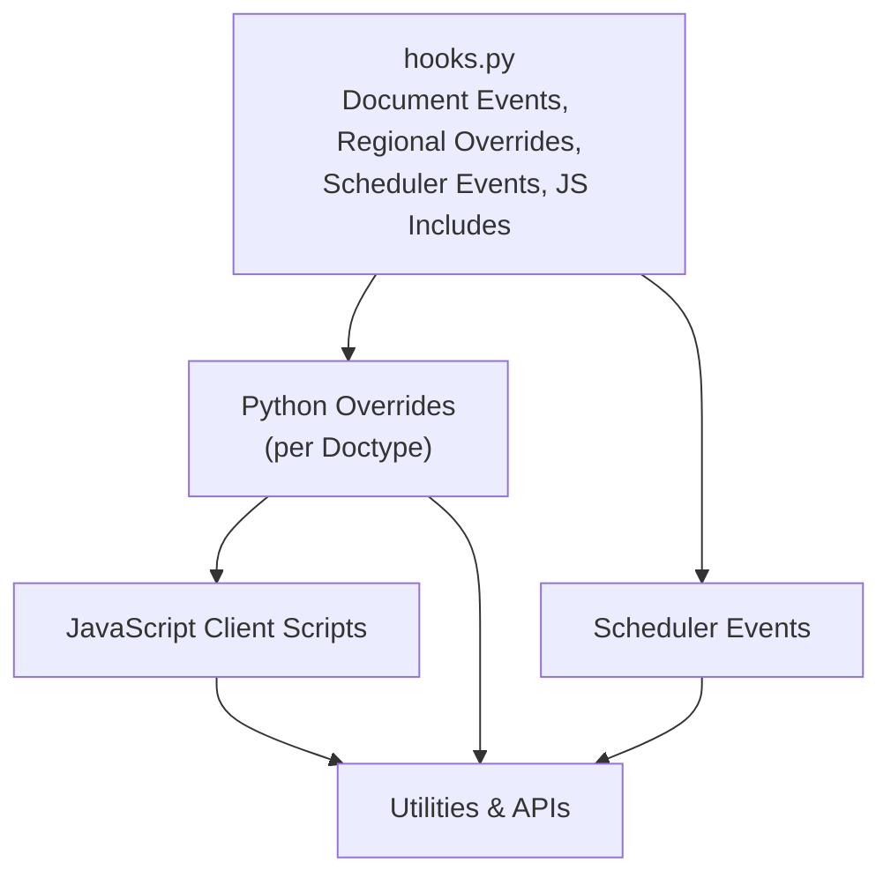
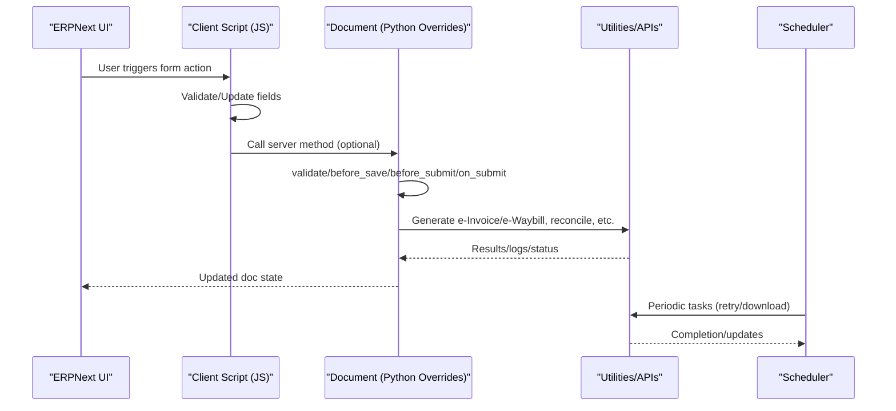
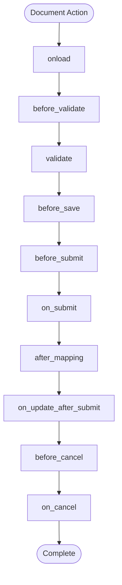
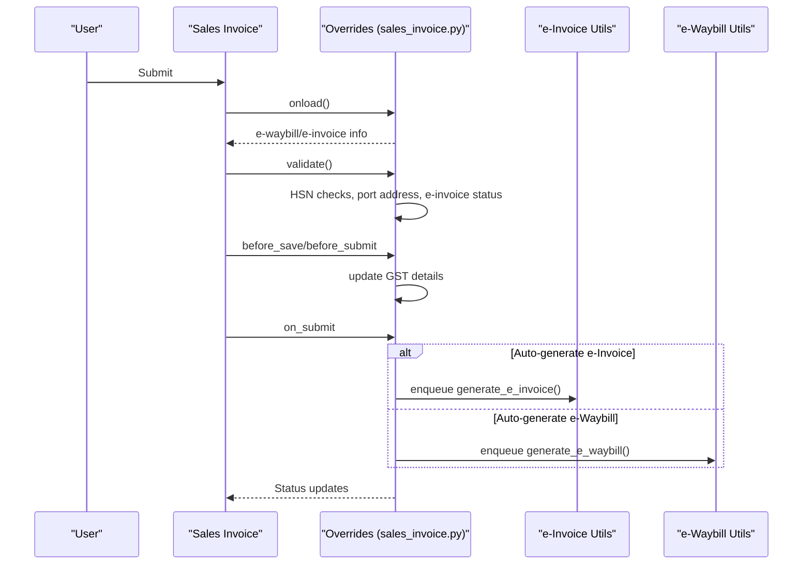
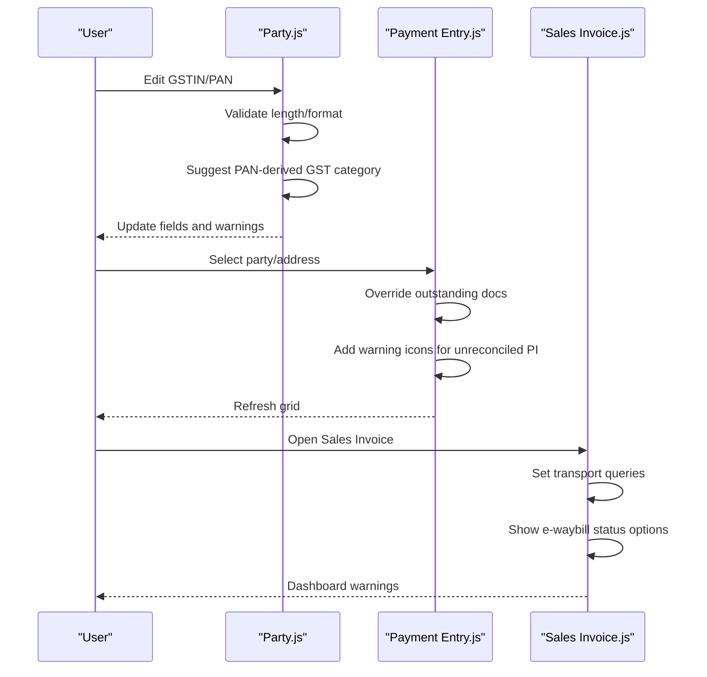
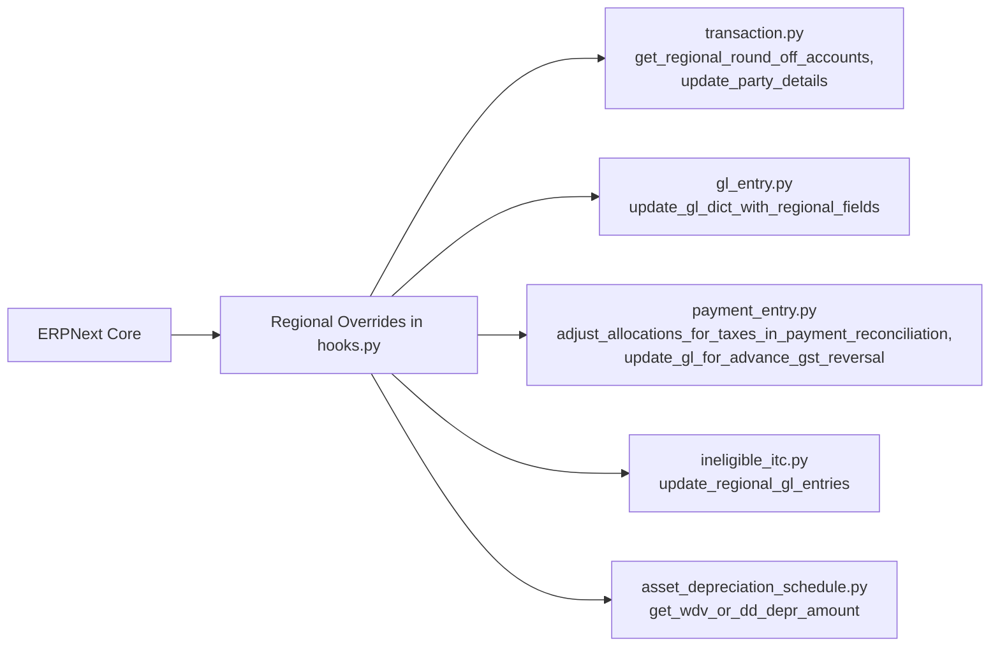
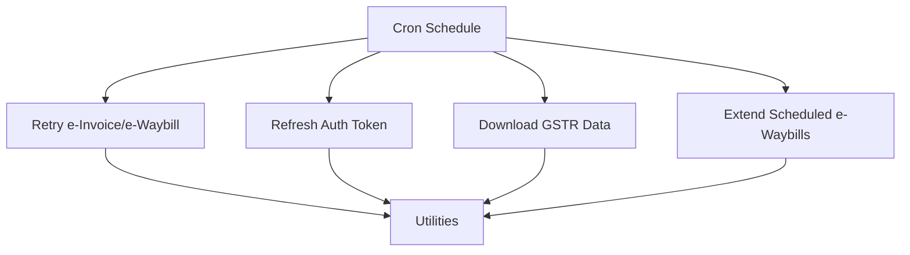
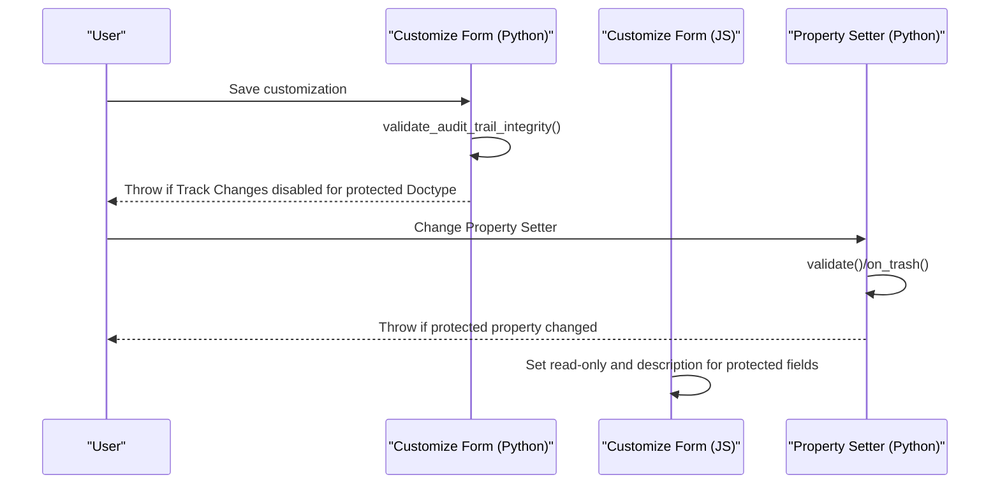
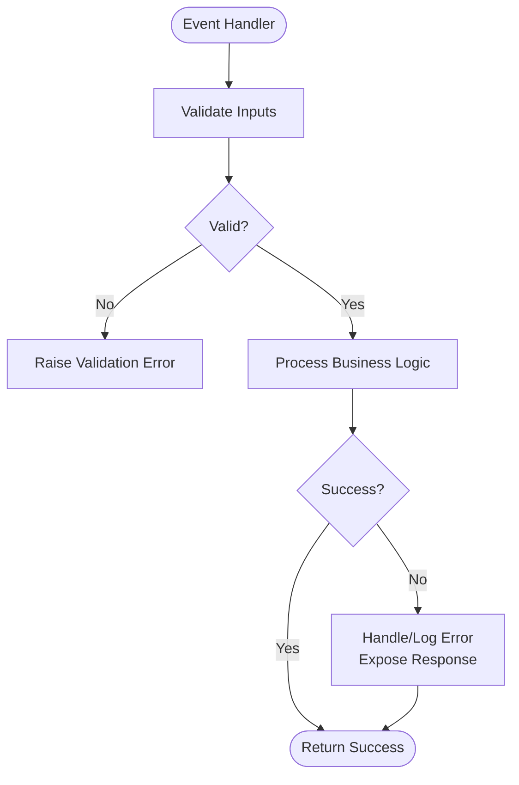
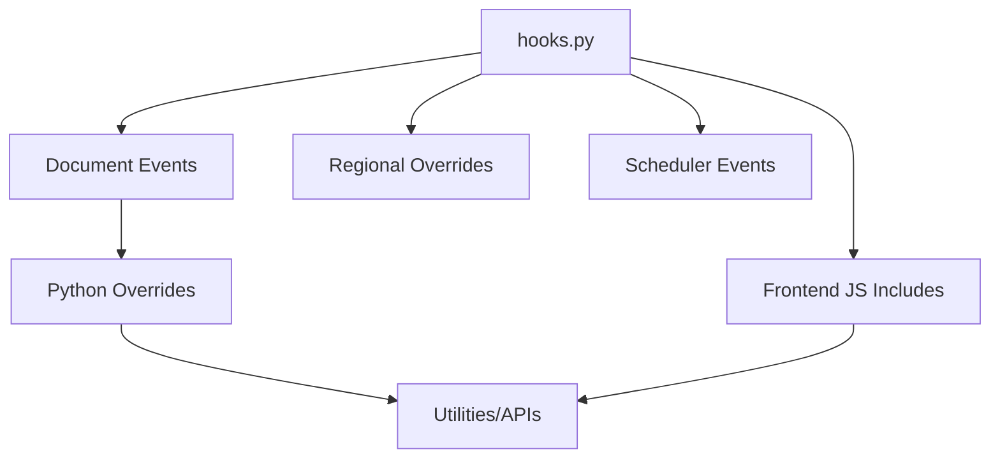

# Event-Driven Architecture

<cite>
**Referenced Files in This Document**
- [hooks.py](file://india_compliance/hooks.py)
- [transaction.py](file://india_compliance/gst_india/overrides/transaction.py)
- [sales_invoice.py](file://india_compliance/gst_india/overrides/sales_invoice.py)
- [party.js](file://india_compliance/gst_india/client_scripts/party.js)
- [payment_entry.js](file://india_compliance/gst_india/client_scripts/payment_entry.js)
- [sales_invoice.js](file://india_compliance/gst_india/client_scripts/sales_invoice.js)
- [company.py](file://india_compliance/gst_india/overrides/company.py)
- [e_invoice.py](file://india_compliance/gst_india/utils/e_invoice.py)
- [customize_form.py](file://india_compliance/audit_trail/overrides/customize_form.py)
- [property_setter.py](file://india_compliance/audit_trail/overrides/property_setter.py)
- [customize_form.js](file://india_compliance/audit_trail/client_scripts/customize_form.js)
- [gstr_import_log.py](file://india_compliance/gst_india/doctype/gstr_import_log/gstr_import_log.py)
- [base.py](file://india_compliance/gst_india/api_classes/base.py)
</cite>

## Table of Contents
1. [Introduction](#introduction)
2. [Project Structure](#project-structure)
3. [Core Components](#core-components)
4. [Architecture Overview](#architecture-overview)
5. [Detailed Component Analysis](#detailed-component-analysis)
6. [Dependency Analysis](#dependency-analysis)
7. [Performance Considerations](#performance-considerations)
8. [Troubleshooting Guide](#troubleshooting-guide)
9. [Conclusion](#conclusion)

## Introduction
This document explains the event-driven architecture used in India Compliance within ERPNext. It covers:
- How document lifecycle events (validate, before_save, before_submit, on_submit, on_update_after_submit, before_cancel, onload, etc.) are mapped via hooks.py and executed through Python overrides.
- How hooks.py defines document event mappings and regional overrides that alter ERPNext’s default behavior.
- Transaction processing workflows triggered by these events, including e-invoice and e-waybill generation.
- Frontend automation via JavaScript client scripts for dynamic UI updates and validations.
- Event propagation and error handling across the event chain.
- Regional overrides for accounting and taxation.
- Patterns for extending event handling for custom business requirements.
- Scheduler events for background processing and best practices for performance.

## Project Structure
India Compliance organizes event-driven logic across:
- hooks.py: Central registry for document events, regional overrides, whitelisted method overrides, scheduler events, and frontend JS inclusion.
- Python overrides: Per-Doctype event handlers that implement business logic and integrations.
- Client scripts: JavaScript handlers that automate UI and pre-submit validations.
- Scheduler utilities: Background jobs for retries and periodic tasks.

**Diagram sources**
- [hooks.py](file://india_compliance/hooks.py#L118-L389)
- [transaction.py](file://india_compliance/gst_india/overrides/transaction.py#L1-L200)

**Section sources**
- [hooks.py](file://india_compliance/hooks.py#L118-L389)

## Core Components
- Document Event Mappings: hooks.py maps ERPNext document events to specific Python handlers for dozens of Doctypes (Sales Invoice, Purchase Invoice, Payment Entry, etc.).
- Regional Overrides: hooks.py registers overrides for ERPNext’s regional accounting and tax calculation methods.
- Scheduler Events: hooks.py schedules periodic tasks for background processing (e.g., retrying e-invoice/e-waybill generation, downloading GSTR data).
- Client Scripts: hooks.py includes JS files per Doctype to automate UI behaviors and pre-submit validations.
- Audit Trail Overrides: hooks.py and Python/JS enforce integrity for protected settings.

**Section sources**
- [hooks.py](file://india_compliance/hooks.py#L118-L389)
- [hooks.py](file://india_compliance/hooks.py#L473-L492)
- [customize_form.py](file://india_compliance/audit_trail/overrides/customize_form.py#L13-L44)
- [customize_form.js](file://india_compliance/audit_trail/client_scripts/customize_form.js#L1-L20)

## Architecture Overview
The event-driven flow connects UI interactions, client scripts, document events, and backend utilities.

**Diagram sources**
- [sales_invoice.js](file://india_compliance/gst_india/client_scripts/sales_invoice.js#L1-L97)
- [sales_invoice.py](file://india_compliance/gst_india/overrides/sales_invoice.py#L160-L201)
- [e_invoice.py](file://india_compliance/gst_india/utils/e_invoice.py#L119-L200)
- [hooks.py](file://india_compliance/hooks.py#L473-L492)

## Detailed Component Analysis

### Document Event Mappings and Propagation
- hooks.py defines per-Doctype event lists for events such as onload, before_validate, validate, before_save, before_submit, on_submit, on_update_after_submit, before_cancel, after_mapping, on_cancel, and more.
- Handlers are ordered; earlier entries run first. For example, transaction-level before_save runs before Doctype-specific validate.
- Example mappings:
  - Sales Invoice: onload, before_print, validate, before_save, before_submit, on_submit, on_update_after_submit, before_cancel, after_mapping.
  - Purchase Invoice: similar lifecycle with additional pre-submit updates.
  - Payment Entry: onload, validate, on_submit, on_update_after_submit, before_cancel.
  - Company: on_update, on_trash.
  - Journal Entry, Item, Item Tax Template, Supplier, Customer, Address, Tax Category, etc.

**Diagram sources**
- [hooks.py](file://india_compliance/hooks.py#L174-L241)
- [hooks.py](file://india_compliance/hooks.py#L142-L152)
- [hooks.py](file://india_compliance/hooks.py#L167-L173)

**Section sources**
- [hooks.py](file://india_compliance/hooks.py#L118-L350)

### Transaction Processing Workflow (Sales Invoice)
- Lifecycle:
  - onload: Load e-waybill/e-invoice info if available.
  - validate: Run transaction validation, HSN checks, port address checks, and e-invoice applicability.
  - before_save/before_submit: Update GST details.
  - on_submit: Enqueue e-invoice or e-waybill generation based on settings and thresholds.
  - on_update_after_submit: Warn if grouping changes conflict with existing logs.
  - before_cancel: Load logs, validate cancellation rules, auto-cancel dependent e-invoice/e-waybill, and reverse adjustments if applicable.

**Diagram sources**
- [sales_invoice.py](file://india_compliance/gst_india/overrides/sales_invoice.py#L40-L83)
- [sales_invoice.py](file://india_compliance/gst_india/overrides/sales_invoice.py#L160-L201)
- [sales_invoice.js](file://india_compliance/gst_india/client_scripts/sales_invoice.js#L27-L56)
- [e_invoice.py](file://india_compliance/gst_india/utils/e_invoice.py#L119-L200)

**Section sources**
- [sales_invoice.py](file://india_compliance/gst_india/overrides/sales_invoice.py#L40-L201)

### Client-Side Event Handling (JavaScript)
- Party.js: Validates GSTIN/PAN, suggests party type, warns on category changes, and updates related documents after save.
- Payment Entry.js: Overrides outstanding document retrieval, adds reconciliation status indicators, and updates GST details on party/address changes.
- Sales Invoice.js: Adds transport queries, sets e-waybill status options, shows warnings for GST applicability, and alerts when e-waybill threshold is not met.

**Diagram sources**
- [party.js](file://india_compliance/gst_india/client_scripts/party.js#L48-L118)
- [payment_entry.js](file://india_compliance/gst_india/client_scripts/payment_entry.js#L11-L57)
- [payment_entry.js](file://india_compliance/gst_india/client_scripts/payment_entry.js#L59-L86)
- [sales_invoice.js](file://india_compliance/gst_india/client_scripts/sales_invoice.js#L4-L57)

**Section sources**
- [party.js](file://india_compliance/gst_india/client_scripts/party.js#L1-L173)
- [payment_entry.js](file://india_compliance/gst_india/client_scripts/payment_entry.js#L1-L169)
- [sales_invoice.js](file://india_compliance/gst_india/client_scripts/sales_invoice.js#L1-L97)

### Regional Overrides System
- hooks.py registers overrides for ERPNext’s regional methods (round-off accounts, GL entries, payment reconciliations, party address details, asset depreciation).
- These overrides ensure Indian tax and accounting rules are applied consistently across transactions.

**Diagram sources**
- [hooks.py](file://india_compliance/hooks.py#L353-L389)
- [transaction.py](file://india_compliance/gst_india/overrides/transaction.py#L768-L787)

**Section sources**
- [hooks.py](file://india_compliance/hooks.py#L353-L389)
- [transaction.py](file://india_compliance/gst_india/overrides/transaction.py#L768-L787)

### Scheduler Events and Background Processing
- hooks.py schedules cron jobs for:
  - Retrying e-invoice/e-waybill generation.
  - Refreshing auth tokens.
  - Downloading GSTR data.
  - Extending scheduled e-waybills.
- Utilities enqueue work after commit to avoid blocking user actions.

**Diagram sources**
- [hooks.py](file://india_compliance/hooks.py#L473-L492)
- [e_invoice.py](file://india_compliance/gst_india/utils/e_invoice.py#L65-L86)

**Section sources**
- [hooks.py](file://india_compliance/hooks.py#L473-L492)
- [e_invoice.py](file://india_compliance/gst_india/utils/e_invoice.py#L65-L86)

### Audit Trail Integrity (Protected Settings)
- hooks.py and overrides ensure protected settings cannot be changed when audit trail is enabled.
- Customize Form override enforces that Track Changes cannot be disabled for audit-trail-enabled Doctypes.
- Client script prevents editing of protected fields and displays explanatory messages.

**Diagram sources**
- [customize_form.py](file://india_compliance/audit_trail/overrides/customize_form.py#L25-L44)
- [customize_form.js](file://india_compliance/audit_trail/client_scripts/customize_form.js#L1-L20)
- [property_setter.py](file://india_compliance/audit_trail/overrides/property_setter.py#L11-L41)

**Section sources**
- [customize_form.py](file://india_compliance/audit_trail/overrides/customize_form.py#L13-L44)
- [customize_form.js](file://india_compliance/audit_trail/client_scripts/customize_form.js#L1-L20)
- [property_setter.py](file://india_compliance/audit_trail/overrides/property_setter.py#L11-L57)

### Error Handling in the Event Chain
- Validation errors are raised with clear messages and titles.
- Utilities wrap server errors and expose actionable responses (e.g., invalid token detection).
- Scheduler jobs toggle themselves off when external systems signal backoff.

**Diagram sources**
- [sales_invoice.py](file://india_compliance/gst_india/overrides/sales_invoice.py#L118-L130)
- [e_invoice.py](file://india_compliance/gst_india/utils/e_invoice.py#L193-L200)
- [gstr_import_log.py](file://india_compliance/gst_india/doctype/gstr_import_log/gstr_import_log.py#L75-L84)

**Section sources**
- [sales_invoice.py](file://india_compliance/gst_india/overrides/sales_invoice.py#L118-L130)
- [e_invoice.py](file://india_compliance/gst_india/utils/e_invoice.py#L193-L200)
- [gstr_import_log.py](file://india_compliance/gst_india/doctype/gstr_import_log/gstr_import_log.py#L75-L84)

### Patterns for Extending Event Handling
- Define a new handler in a Python override module for the target Doctype.
- Register the handler in hooks.py under the appropriate event and Doctype.
- For UI automation, add or extend a client script in gst_india/client_scripts.
- For background tasks, enqueue work via frappe.enqueue and schedule periodic jobs in hooks.py.
- Respect event ordering: transaction-level hooks run before Doctype-specific ones.

**Section sources**
- [hooks.py](file://india_compliance/hooks.py#L118-L350)
- [company.py](file://india_compliance/gst_india/overrides/company.py#L24-L38)

## Dependency Analysis
- hooks.py is the central dependency for:
  - Document event mappings.
  - Regional overrides.
  - Scheduler events.
  - Frontend JS includes.
- Overrides depend on shared utilities (e.g., transaction.py for GST logic, e_invoice.py for API integrations).
- Client scripts depend on shared JS utilities exposed via the app bundle.

**Diagram sources**
- [hooks.py](file://india_compliance/hooks.py#L118-L389)

**Section sources**
- [hooks.py](file://india_compliance/hooks.py#L118-L389)

## Performance Considerations
- Use enqueue_after_commit for background tasks to avoid blocking user actions.
- Prefer lightweight client-side validations to reduce server round trips.
- Batch operations (e.g., bulk e-invoice generation) adjust queue and timeouts based on volume.
- Toggle scheduler jobs when external systems indicate backoff to prevent throttling.
- Keep event handlers deterministic and free of heavy synchronous operations.

**Section sources**
- [sales_invoice.py](file://india_compliance/gst_india/overrides/sales_invoice.py#L179-L200)
- [e_invoice.py](file://india_compliance/gst_india/utils/e_invoice.py#L65-L86)
- [gstr_import_log.py](file://india_compliance/gst_india/doctype/gstr_import_log/gstr_import_log.py#L75-L84)
- [base.py](file://india_compliance/gst_india/api_classes/base.py#L372-L381)

## Troubleshooting Guide
- If e-invoice/e-waybill generation fails:
  - Check scheduler status and retry jobs.
  - Review logs and error messages returned by utilities.
  - Verify GST settings and thresholds.
- If audit trail protections are triggered:
  - Ensure Track Changes remains enabled for protected Doctypes.
  - Confirm Customize Form override is active.
- If client script warnings appear:
  - Validate GST applicability conditions and required fields.
  - Confirm party GSTIN/PAN formatting and category alignment.

**Section sources**
- [e_invoice.py](file://india_compliance/gst_india/utils/e_invoice.py#L193-L200)
- [customize_form.py](file://india_compliance/audit_trail/overrides/customize_form.py#L25-L44)
- [sales_invoice.js](file://india_compliance/gst_india/client_scripts/sales_invoice.js#L59-L72)

## Conclusion
India Compliance leverages ERPNext’s event-driven model extensively:
- hooks.py orchestrates document events, regional overrides, scheduler tasks, and frontend includes.
- Python overrides implement GST-specific validations and integrations.
- Client scripts automate UI behaviors and pre-submit checks.
- Scheduler events manage background processing reliably.
Adhering to the documented patterns ensures robust, extensible, and regionally compliant workflows.