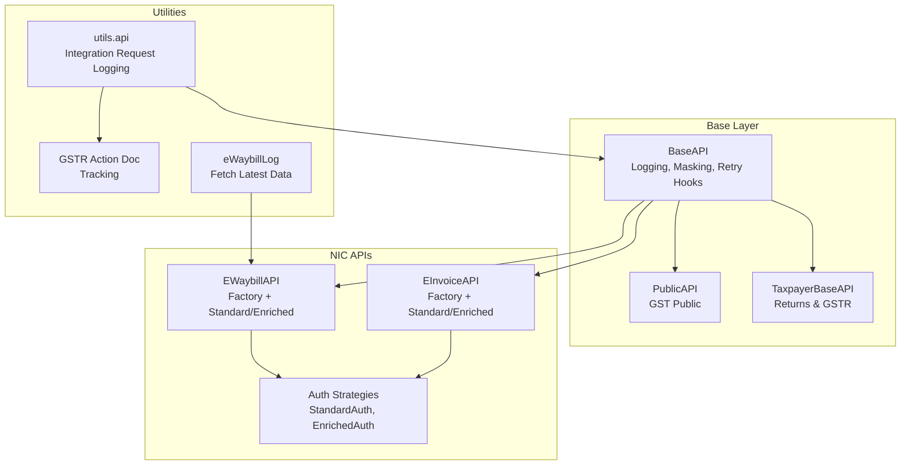
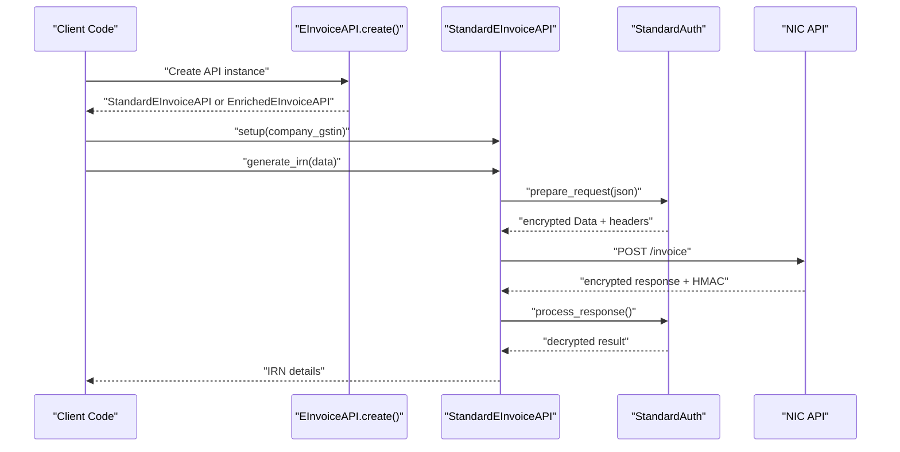
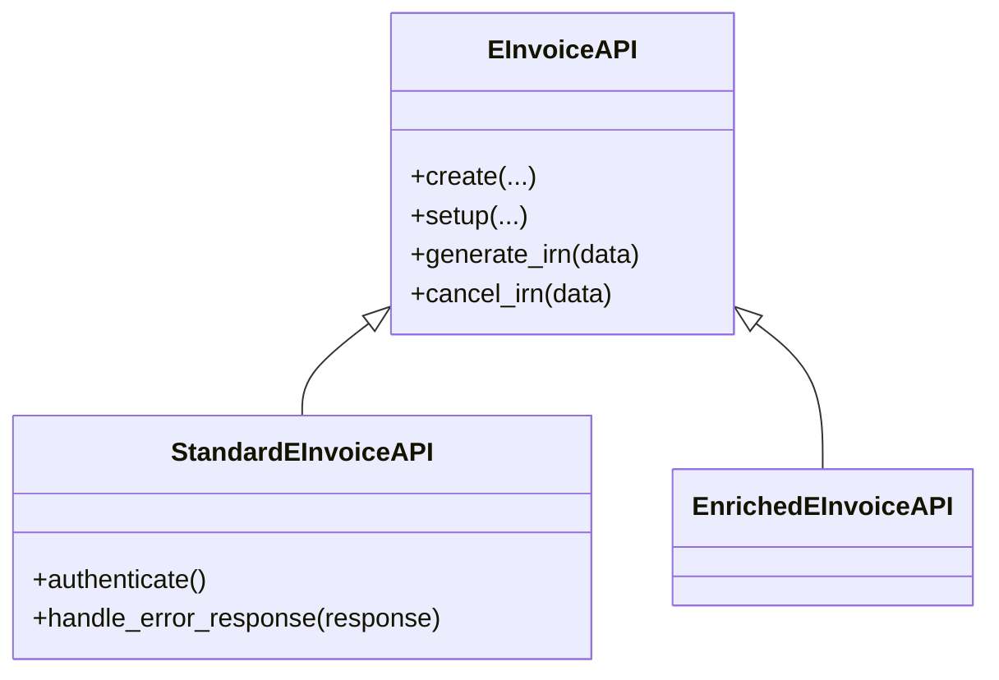
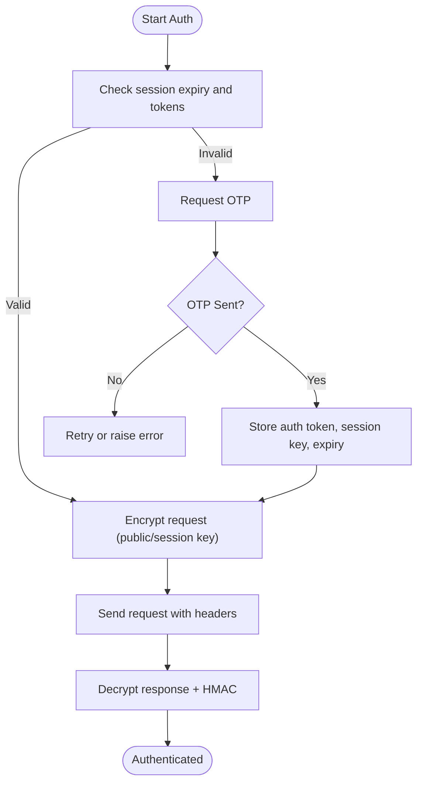
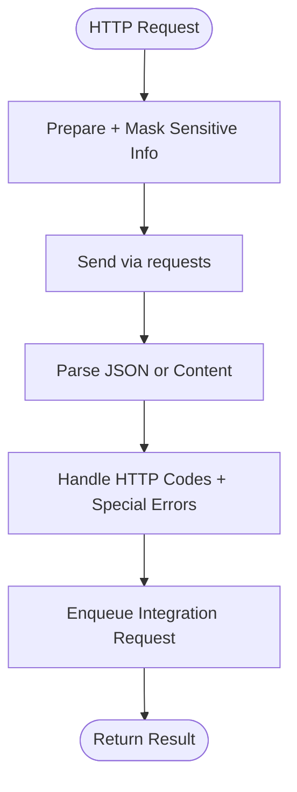
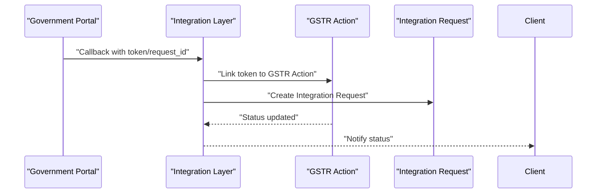
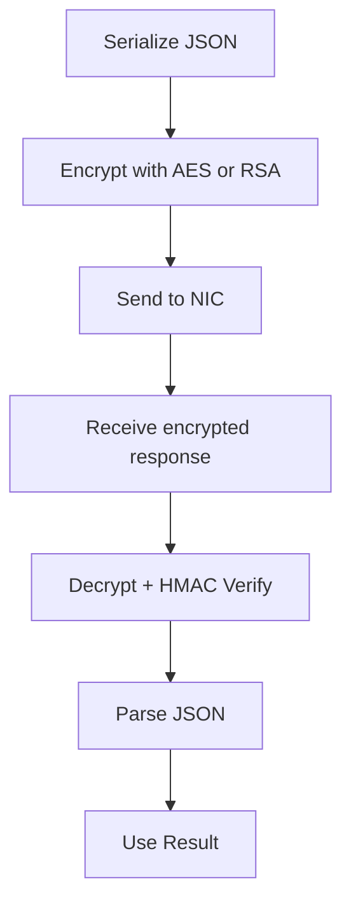
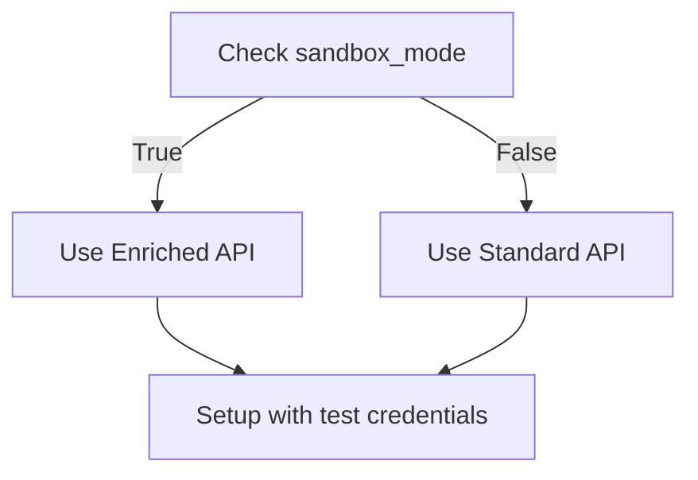
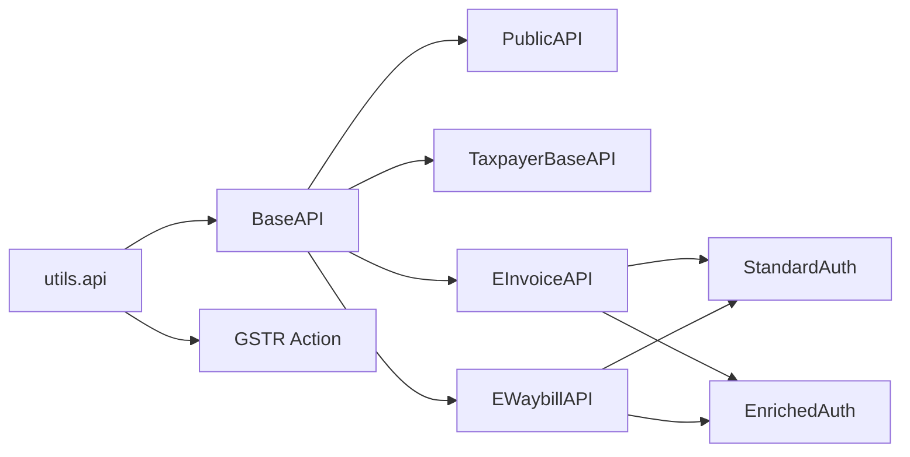

# Integration Patterns

<cite>
**Referenced Files in This Document**
- [base.py](file://india_compliance/gst_india/api_classes/base.py)
- [public.py](file://india_compliance/gst_india/api_classes/public.py)
- [taxpayer_base.py](file://india_compliance/gst_india/api_classes/taxpayer_base.py)
- [auth.py](file://india_compliance/gst_india/api_classes/nic/auth.py)
- [e_invoice.py](file://india_compliance/gst_india/api_classes/nic/e_invoice.py)
- [e_waybill.py](file://india_compliance/gst_india/api_classes/nic/e_waybill.py)
- [e_waybill_errors.py](file://india_compliance/gst_india/api_classes/nic/e_waybill_errors.py)
- [api.py](file://india_compliance/gst_india/utils/api.py)
- [gstr_action.py](file://india_compliance/gst_india/doctype/gstr_action/gstr_action.py)
- [e_waybill_log.py](file://india_compliance/gst_india/doctype/e_waybill_log/e_waybill_log.py)
- [gstr_1.py](file://india_compliance/gst_india/doctype/gst_return_log/generate_gstr_1.py)
- [gstr_2b.js](file://india_compliance/public/js/gstr_2b.js)
- [set_sandbox_mode_in_gst_settings.py](file://india_compliance/patches/v14/set_sandbox_mode_in_gst_settings.py)
- [test_auth.py](file://india_compliance/gst_india/api_classes/nic/test_auth.py)
</cite>

## Table of Contents
1. [Introduction](#introduction)
2. [Project Structure](#project-structure)
3. [Core Components](#core-components)
4. [Architecture Overview](#architecture-overview)
5. [Detailed Component Analysis](#detailed-component-analysis)
6. [Dependency Analysis](#dependency-analysis)
7. [Performance Considerations](#performance-considerations)
8. [Troubleshooting Guide](#troubleshooting-guide)
9. [Conclusion](#conclusion)
10. [Appendices](#appendices)

## Introduction
This document explains the integration patterns used by the India Compliance system for connecting to government portals via NIC (National Informatics Centre) APIs and taxpayer portal services. It covers the API class factory pattern for dynamic API instantiation, authentication and authorization mechanisms, retry logic and error handling, status monitoring, serialization and deserialization for government API communication, sandbox mode for testing, and practical integration scenarios with security considerations.

## Project Structure
The integration layer is organized around reusable API base classes and service-specific implementations:
- Base API and logging utilities
- Public APIs for GST Public services
- Taxpayer APIs for Returns and GSTR services
- NIC e-Invoice and e-Waybill APIs with two modes: Standard (encrypted) and Enriched (fallback)
- Authentication strategies for NIC encryption and token management
- Utilities for integration request logging and status monitoring
- Sandbox mode configuration and tests

**Diagram sources**
- [base.py](file://india_compliance/gst_india/api_classes/base.py#L23-L413)
- [public.py](file://india_compliance/gst_india/api_classes/public.py#L7-L65)
- [taxpayer_base.py](file://india_compliance/gst_india/api_classes/taxpayer_base.py#L321-L527)
- [e_invoice.py](file://india_compliance/gst_india/api_classes/nic/e_invoice.py#L12-L271)
- [e_waybill.py](file://india_compliance/gst_india/api_classes/nic/e_waybill.py#L17-L259)
- [auth.py](file://india_compliance/gst_india/api_classes/nic/auth.py#L27-L195)
- [api.py](file://india_compliance/gst_india/utils/api.py#L4-L57)
- [gstr_action.py](file://india_compliance/gst_india/doctype/gstr_action/gstr_action.py#L12-L29)
- [e_waybill_log.py](file://india_compliance/gst_india/doctype/e_waybill_log/e_waybill_log.py#L12-L23)

**Section sources**
- [base.py](file://india_compliance/gst_india/api_classes/base.py#L23-L413)
- [public.py](file://india_compliance/gst_india/api_classes/public.py#L7-L65)
- [taxpayer_base.py](file://india_compliance/gst_india/api_classes/taxpayer_base.py#L321-L527)
- [e_invoice.py](file://india_compliance/gst_india/api_classes/nic/e_invoice.py#L12-L271)
- [e_waybill.py](file://india_compliance/gst_india/api_classes/nic/e_waybill.py#L17-L259)
- [auth.py](file://india_compliance/gst_india/api_classes/nic/auth.py#L27-L195)
- [api.py](file://india_compliance/gst_india/utils/api.py#L4-L57)
- [gstr_action.py](file://india_compliance/gst_india/doctype/gstr_action/gstr_action.py#L12-L29)
- [e_waybill_log.py](file://india_compliance/gst_india/doctype/e_waybill_log/e_waybill_log.py#L12-L23)

## Core Components
- BaseAPI: Centralized HTTP client with request/response lifecycle, error handling, masking, and logging.
- PublicAPI: Stateless, sandbox-restricted access to GST Public endpoints.
- TaxpayerBaseAPI: Encrypted, authenticated requests for Returns/GSTR with OTP handling and session management.
- EInvoiceAPI and EWaybillAPI: Factory-based selection between Standard (encrypted) and Enriched (fallback) modes.
- Auth strategies: StandardAuth (encryption/decryption, HMAC validation) and EnrichedAuth (no encryption).
- Integration logging: Asynchronous creation of Integration Request records for audit and monitoring.
- GSTR Action tracking: Linking integration requests to queued actions for status updates.

**Section sources**
- [base.py](file://india_compliance/gst_india/api_classes/base.py#L23-L413)
- [public.py](file://india_compliance/gst_india/api_classes/public.py#L7-L65)
- [taxpayer_base.py](file://india_compliance/gst_india/api_classes/taxpayer_base.py#L321-L527)
- [e_invoice.py](file://india_compliance/gst_india/api_classes/nic/e_invoice.py#L12-L271)
- [e_waybill.py](file://india_compliance/gst_india/api_classes/nic/e_waybill.py#L17-L259)
- [auth.py](file://india_compliance/gst_india/api_classes/nic/auth.py#L27-L195)
- [api.py](file://india_compliance/gst_india/utils/api.py#L4-L57)
- [gstr_action.py](file://india_compliance/gst_india/doctype/gstr_action/gstr_action.py#L12-L29)

## Architecture Overview
The system integrates with NIC APIs using a layered approach:
- Factory classes select between Standard and Enriched implementations based on settings and sandbox mode.
- Authentication strategies encrypt payloads and validate HMACs for secure communication.
- BaseAPI centralizes request preparation, execution, error handling, and logging.
- Integration Request logging captures all outbound calls for monitoring and debugging.
- GSTR Action documents track asynchronous return filing tasks and link to integration requests.

**Diagram sources**
- [e_invoice.py](file://india_compliance/gst_india/api_classes/nic/e_invoice.py#L44-L54)
- [e_invoice.py](file://india_compliance/gst_india/api_classes/nic/e_invoice.py#L178-L271)
- [auth.py](file://india_compliance/gst_india/api_classes/nic/auth.py#L53-L195)
- [base.py](file://india_compliance/gst_india/api_classes/base.py#L124-L220)

## Detailed Component Analysis

### API Class Factory Pattern
- EInvoiceAPI and EWaybillAPI expose a classmethod factory that chooses Standard vs Enriched implementations based on sandbox mode and fallback settings.
- Standard implementations use encryption/decryption and HMAC validation; Enriched implementations bypass encryption and rely on GSP-managed encryption.

**Diagram sources**
- [e_invoice.py](file://india_compliance/gst_india/api_classes/nic/e_invoice.py#L44-L54)
- [e_invoice.py](file://india_compliance/gst_india/api_classes/nic/e_invoice.py#L149-L271)

**Section sources**
- [e_invoice.py](file://india_compliance/gst_india/api_classes/nic/e_invoice.py#L44-L54)
- [e_invoice.py](file://india_compliance/gst_india/api_classes/nic/e_invoice.py#L149-L271)

### Authentication and Authorization Mechanisms
- StandardAuth:
  - Encrypts request bodies using public key for auth and session key for subsequent requests.
  - Decrypts responses, validates HMAC, and stores session tokens.
  - Adds auth-token header for non-auth endpoints.
- EnrichedAuth: No encryption/decryption; relies on GSP-managed encryption.
- TaxpayerBaseAPI:
  - Manages OTP requests and sessions for Returns/GSTR APIs.
  - Includes ip-usr header for IP binding and validates auth tokens before requests.

**Diagram sources**
- [auth.py](file://india_compliance/gst_india/api_classes/nic/auth.py#L53-L195)
- [taxpayer_base.py](file://india_compliance/gst_india/api_classes/taxpayer_base.py#L110-L320)

**Section sources**
- [auth.py](file://india_compliance/gst_india/api_classes/nic/auth.py#L53-L195)
- [taxpayer_base.py](file://india_compliance/gst_india/api_classes/taxpayer_base.py#L110-L320)

### Retry Logic, Error Handling, and Status Monitoring
- BaseAPI:
  - Raises specialized errors for server and gateway timeouts.
  - Masks sensitive headers/data in logs.
  - Enqueues Integration Request records for audit.
- PublicAPI:
  - Ignores specific error codes and returns sanitized responses in sandbox mode.
- EWaybillAPI:
  - Extracts and maps error codes to human-readable messages.
- Integration logging:
  - Asynchronous creation of Integration Request entries with pretty-printed JSON.
  - Links to GSTR Action records for queued return tasks.

**Diagram sources**
- [base.py](file://india_compliance/gst_india/api_classes/base.py#L124-L220)
- [api.py](file://india_compliance/gst_india/utils/api.py#L4-L57)
- [public.py](file://india_compliance/gst_india/api_classes/public.py#L49-L65)
- [e_waybill.py](file://india_compliance/gst_india/api_classes/nic/e_waybill.py#L197-L259)

**Section sources**
- [base.py](file://india_compliance/gst_india/api_classes/base.py#L124-L220)
- [api.py](file://india_compliance/gst_india/utils/api.py#L4-L57)
- [public.py](file://india_compliance/gst_india/api_classes/public.py#L49-L65)
- [e_waybill.py](file://india_compliance/gst_india/api_classes/nic/e_waybill.py#L197-L259)

### Webhook Architecture for Callbacks and Status Updates
- GSTR Action tracking:
  - Records request_type, token, and request_id for queued actions.
  - Integration Request linkage enables tracing callbacks.
- eWaybillLog:
  - Refreshes latest e-Waybill data and triggers document updates.
- Frontend polling for regeneration status:
  - Client-side retry loop checks regeneration status with exponential/backoff-like intervals.

**Diagram sources**
- [gstr_action.py](file://india_compliance/gst_india/doctype/gstr_action/gstr_action.py#L12-L29)
- [api.py](file://india_compliance/gst_india/utils/api.py#L43-L46)
- [e_waybill_log.py](file://india_compliance/gst_india/doctype/e_waybill_log/e_waybill_log.py#L12-L23)
- [gstr_2b.js](file://india_compliance/public/js/gstr_2b.js#L38-L82)

**Section sources**
- [gstr_action.py](file://india_compliance/gst_india/doctype/gstr_action/gstr_action.py#L12-L29)
- [api.py](file://india_compliance/gst_india/utils/api.py#L43-L46)
- [e_waybill_log.py](file://india_compliance/gst_india/doctype/e_waybill_log/e_waybill_log.py#L12-L23)
- [gstr_2b.js](file://india_compliance/public/js/gstr_2b.js#L38-L82)

### Data Serialization and Deserialization Patterns
- Encryption/Decryption:
  - StandardAuth encrypts request JSON using public key for auth and session key for data; decrypts and validates HMAC for responses.
  - TaxpayerBaseAPI handles Rek-based decryption and HMAC verification for Returns/GSTR.
- FilesAPI:
  - Downloads encrypted archives, verifies hashes, decrypts, and parses JSON.
- PublicAPI:
  - Returns sanitized responses in sandbox mode.

**Diagram sources**
- [auth.py](file://india_compliance/gst_india/api_classes/nic/auth.py#L80-L184)
- [taxpayer_base.py](file://india_compliance/gst_india/api_classes/taxpayer_base.py#L405-L424)
- [e_waybill.py](file://india_compliance/gst_india/api_classes/nic/e_waybill.py#L197-L259)

**Section sources**
- [auth.py](file://india_compliance/gst_india/api_classes/nic/auth.py#L80-L184)
- [taxpayer_base.py](file://india_compliance/gst_india/api_classes/taxpayer_base.py#L405-L424)
- [e_waybill.py](file://india_compliance/gst_india/api_classes/nic/e_waybill.py#L197-L259)

### Sandbox Mode Implementation
- Factory selection:
  - EInvoiceAPI.create and EWaybillAPI.create choose Enriched mode when sandbox_mode is enabled.
- PublicAPI:
  - Explicitly disallows certain operations in sandbox mode.
- Patch:
  - Sets sandbox_mode based on environment configuration.

**Diagram sources**
- [e_invoice.py](file://india_compliance/gst_india/api_classes/nic/e_invoice.py#L44-L54)
- [e_waybill.py](file://india_compliance/gst_india/api_classes/nic/e_waybill.py#L40-L50)
- [public.py](file://india_compliance/gst_india/api_classes/public.py#L15-L22)
- [set_sandbox_mode_in_gst_settings.py](file://india_compliance/patches/v14/set_sandbox_mode_in_gst_settings.py#L4-L6)

**Section sources**
- [e_invoice.py](file://india_compliance/gst_india/api_classes/nic/e_invoice.py#L44-L54)
- [e_waybill.py](file://india_compliance/gst_india/api_classes/nic/e_waybill.py#L40-L50)
- [public.py](file://india_compliance/gst_india/api_classes/public.py#L15-L22)
- [set_sandbox_mode_in_gst_settings.py](file://india_compliance/patches/v14/set_sandbox_mode_in_gst_settings.py#L4-L6)

### Examples of Successful Integration Scenarios
- e-Invoice generation:
  - Factory selects StandardEInvoiceAPI, authenticates, encrypts payload, sends request, decrypts response, and extracts IRN details.
- e-Waybill generation:
  - Factory selects StandardEWaybillAPI, authenticates, encrypts payload, sends request, decrypts response, and updates distance metadata.
- Public GSTIN autofill:
  - PublicAPI retrieves party information; in sandbox mode, returns predefined values.

**Section sources**
- [e_invoice.py](file://india_compliance/gst_india/api_classes/nic/e_invoice.py#L102-L117)
- [e_waybill.py](file://india_compliance/gst_india/api_classes/nic/e_waybill.py#L104-L111)
- [public.py](file://india_compliance/gst_india/api_classes/public.py#L31-L42)
- [test_auth.py](file://india_compliance/gst_india/api_classes/nic/test_auth.py#L524-L724)

### Common Integration Challenges
- Invalid or expired tokens:
  - StandardEInvoiceAPI and StandardEWaybillAPI reset auth_token and re-authenticate automatically.
- HMAC mismatch:
  - Indicates tampering or decryption errors; requires re-fetching public keys and re-encryption.
- OTP-based authentication:
  - TaxpayerBaseAPI handles OTP requests and resets auth tokens when needed.
- Error code mapping:
  - EWaybillAPI maps error codes to user-friendly messages using ERRORS_MAP.

**Section sources**
- [e_invoice.py](file://india_compliance/gst_india/api_classes/nic/e_invoice.py#L194-L203)
- [e_waybill.py](file://india_compliance/gst_india/api_classes/nic/e_waybill.py#L168-L180)
- [auth.py](file://india_compliance/gst_india/api_classes/nic/auth.py#L174-L184)
- [taxpayer_base.py](file://india_compliance/gst_india/api_classes/taxpayer_base.py#L443-L477)
- [e_waybill_errors.py](file://india_compliance/gst_india/api_classes/nic/e_waybill_errors.py#L1-L337)

### Security Considerations
- Sensitive data masking:
  - BaseAPI masks headers, output, data, and body fields containing tokens and passwords.
- Encryption standards:
  - RSA-PKCS1v15 for initial auth payloads; AES-CBC for session-bound data.
- HMAC validation:
  - Ensures response integrity and prevents tampering.
- Session management:
  - Secure storage of session keys and tokens; IP binding via ip-usr header for Returns API.
- Environment isolation:
  - Sandbox mode for testing without affecting production endpoints.

**Section sources**
- [base.py](file://india_compliance/gst_india/api_classes/base.py#L27-L47)
- [base.py](file://india_compliance/gst_india/api_classes/base.py#L316-L355)
- [auth.py](file://india_compliance/gst_india/api_classes/nic/auth.py#L18-L24)
- [auth.py](file://india_compliance/gst_india/api_classes/nic/auth.py#L174-L184)
- [taxpayer_base.py](file://india_compliance/gst_india/api_classes/taxpayer_base.py#L306-L318)

## Dependency Analysis
The integration layer exhibits low coupling and high cohesion:
- BaseAPI encapsulates shared concerns (logging, masking, error handling).
- Factory classes decouple consumers from implementation details.
- Auth strategies are pluggable and reusable across APIs.
- Integration logging is centralized and decoupled from business logic.

**Diagram sources**
- [base.py](file://india_compliance/gst_india/api_classes/base.py#L23-L413)
- [public.py](file://india_compliance/gst_india/api_classes/public.py#L7-L65)
- [taxpayer_base.py](file://india_compliance/gst_india/api_classes/taxpayer_base.py#L321-L527)
- [e_invoice.py](file://india_compliance/gst_india/api_classes/nic/e_invoice.py#L12-L271)
- [e_waybill.py](file://india_compliance/gst_india/api_classes/nic/e_waybill.py#L17-L259)
- [auth.py](file://india_compliance/gst_india/api_classes/nic/auth.py#L27-L195)
- [api.py](file://india_compliance/gst_india/utils/api.py#L4-L57)
- [gstr_action.py](file://india_compliance/gst_india/doctype/gstr_action/gstr_action.py#L12-L29)

**Section sources**
- [base.py](file://india_compliance/gst_india/api_classes/base.py#L23-L413)
- [e_invoice.py](file://india_compliance/gst_india/api_classes/nic/e_invoice.py#L12-L271)
- [e_waybill.py](file://india_compliance/gst_india/api_classes/nic/e_waybill.py#L17-L259)
- [auth.py](file://india_compliance/gst_india/api_classes/nic/auth.py#L27-L195)
- [api.py](file://india_compliance/gst_india/utils/api.py#L4-L57)
- [gstr_action.py](file://india_compliance/gst_india/doctype/gstr_action/gstr_action.py#L12-L29)

## Performance Considerations
- Asynchronous logging:
  - Integration Request creation is enqueued to avoid blocking API calls.
- Scheduler dependency:
  - Certain features require the scheduler to be enabled; otherwise, errors are raised early.
- Retry strategies:
  - Automatic re-authentication on invalid tokens; client-side polling for queued tasks (e.g., GSTR-2B regeneration).

[No sources needed since this section provides general guidance]

## Troubleshooting Guide
- Gateway timeout and rate limits:
  - BaseAPI raises specific exceptions for 504 and 429 responses.
- API key and access issues:
  - 401/403 handling triggers user-facing guidance.
- HMAC mismatch:
  - Indicates decryption or integrity failure; re-fetch public keys and re-encrypt.
- OTP failures:
  - TaxpayerBaseAPI handles OTP requests and invalid OTP scenarios gracefully.

**Section sources**
- [base.py](file://india_compliance/gst_india/api_classes/base.py#L282-L312)
- [auth.py](file://india_compliance/gst_india/api_classes/nic/auth.py#L174-L184)
- [taxpayer_base.py](file://india_compliance/gst_india/api_classes/taxpayer_base.py#L443-L477)

## Conclusion
The India Compliance integration layer leverages a robust factory pattern, standardized authentication strategies, and comprehensive error handling/logging to reliably connect with NIC APIs. The separation of concerns, encryption/HMAC validation, and sandbox mode support enable secure, testable, and maintainable integrations with government portals.

[No sources needed since this section summarizes without analyzing specific files]

## Appendices
- Error code mapping for e-Waybill:
  - ERRORS_MAP provides human-readable descriptions for common error codes returned by the e-Waybill API.

**Section sources**
- [e_waybill_errors.py](file://india_compliance/gst_india/api_classes/nic/e_waybill_errors.py#L1-L337)