# Layered Architecture

<cite>
**Referenced Files in This Document**
- [hooks.py](file://india_compliance/hooks.py)
- [boot.py](file://india_compliance/boot.py)
- [utils/__init__.py](file://india_compliance/gst_india/utils/__init__.py)
- [overrides/transaction.py](file://india_compliance/gst_india/overrides/transaction.py)
- [api_classes/base.py](file://india_compliance/gst_india/api_classes/base.py)
- [api.py](file://india_compliance/gst_india/utils/api.py)
- [client_scripts/sales_invoice.js](file://india_compliance/gst_india/client_scripts/sales_invoice.js)
- [public/js/india_compliance.bundle.js](file://india_compliance/public/js/india_compliance.bundle.js)
- [audit_trail/overrides/version.py](file://india_compliance/audit_trail/overrides/version.py)
- [income_tax_india/overrides/company.py](file://india_compliance/income_tax_india/overrides/company.py)
- [constants/__init__.py](file://india_compliance/gst_india/constants/__init__.py)
</cite>

## Table of Contents
1. [Introduction](#introduction)
2. [Project Structure](#project-structure)
3. [Core Components](#core-components)
4. [Architecture Overview](#architecture-overview)
5. [Detailed Component Analysis](#detailed-component-analysis)
6. [Dependency Analysis](#dependency-analysis)
7. [Performance Considerations](#performance-considerations)
8. [Troubleshooting Guide](#troubleshooting-guide)
9. [Conclusion](#conclusion)
10. [Appendices](#appendices)

## Introduction
This document describes the layered architecture of the India Compliance system, focusing on how the application layer, business logic layer, integration layer, and presentation layer collaborate with ERPNext’s framework. It explains event-driven behavior via ERPNext document events and custom overrides, the plugin-style separation enabling independent development of compliance modules, and data flow patterns during GST compliance processes. Security boundaries and access control mechanisms are addressed alongside component interaction diagrams among the GST India module, audit trail system, income tax management, and VAT operations.

## Project Structure
The India Compliance app organizes functionality into four primary layers:

- Application layer: hooks and boot scripts define app lifecycle, permissions, and runtime boot info.
- Business logic layer: centralized utilities and transaction/business rule overrides encapsulate GST-specific validations and calculations.
- Integration layer: API classes manage external integrations with government services and handle request/response logging.
- Presentation layer: client-side scripts and bundles provide UI behaviors and notifications for GST workflows.

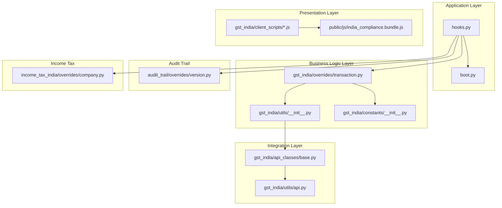

**Diagram sources**
- [hooks.py](file://india_compliance/hooks.py#L1-L684)
- [boot.py](file://india_compliance/boot.py#L1-L76)
- [utils/__init__.py](file://india_compliance/gst_india/utils/__init__.py#L1-L800)
- [overrides/transaction.py](file://india_compliance/gst_india/overrides/transaction.py#L1-L200)
- [api_classes/base.py](file://india_compliance/gst_india/api_classes/base.py#L1-L200)
- [api.py](file://india_compliance/gst_india/utils/api.py#L1-L57)
- [client_scripts/sales_invoice.js](file://india_compliance/gst_india/client_scripts/sales_invoice.js#L1-L97)
- [public/js/india_compliance.bundle.js](file://india_compliance/public/js/india_compliance.bundle.js#L1-L14)
- [audit_trail/overrides/version.py](file://india_compliance/audit_trail/overrides/version.py#L1-L33)
- [income_tax_india/overrides/company.py](file://india_compliance/income_tax_india/overrides/company.py#L1-L148)
- [constants/__init__.py](file://india_compliance/gst_india/constants/__init__.py#L1-L200)

**Section sources**
- [hooks.py](file://india_compliance/hooks.py#L1-L684)
- [boot.py](file://india_compliance/boot.py#L1-L76)

## Core Components
- Application layer
  - hooks.py orchestrates app lifecycle, document events, regional overrides, whitelisted methods, scheduler events, and audit trail doctypes.
  - boot.py prepares runtime boot info, including GST settings, party types, and triggers for notifications.
- Business logic layer
  - utils/__init__.py centralizes GST-related helpers: validations, place-of-supply computation, account mapping, and API toggles.
  - overrides/transaction.py defines transaction-level validations, tax computations, and GST detail updates across ERPNext doctypes.
  - constants/__init__.py defines GST taxonomy, mappings, and enumerations used across layers.
- Integration layer
  - api_classes/base.py implements a reusable BaseAPI class for external integrations, credential fetching, URL construction, and request logging.
  - utils/api.py enqueues and persists integration requests for asynchronous processing and linking with downstream actions.
- Presentation layer
  - client_scripts/*.js attach UI behaviors for GST workflows (e.g., e-waybill applicability, warnings).
  - public/js/india_compliance.bundle.js aggregates client modules for unified loading.

**Section sources**
- [hooks.py](file://india_compliance/hooks.py#L118-L492)
- [boot.py](file://india_compliance/boot.py#L13-L76)
- [utils/__init__.py](file://india_compliance/gst_india/utils/__init__.py#L50-L800)
- [overrides/transaction.py](file://india_compliance/gst_india/overrides/transaction.py#L44-L200)
- [constants/__init__.py](file://india_compliance/gst_india/constants/__init__.py#L1-L200)
- [api_classes/base.py](file://india_compliance/gst_india/api_classes/base.py#L23-L200)
- [api.py](file://india_compliance/gst_india/utils/api.py#L4-L57)
- [client_scripts/sales_invoice.js](file://india_compliance/gst_india/client_scripts/sales_invoice.js#L1-L97)
- [public/js/india_compliance.bundle.js](file://india_compliance/public/js/india_compliance.bundle.js#L1-L14)

## Architecture Overview
The system follows a layered architecture aligned with ERPNext’s extensibility model:

- Application layer registers hooks and boot logic, wiring the app into ERPNext’s lifecycle and document events.
- Business logic layer encapsulates GST-specific rules and calculations, invoked by overrides and utilities.
- Integration layer abstracts external API interactions and logs them for auditability.
- Presentation layer augments UI behaviors and notifications for GST workflows.

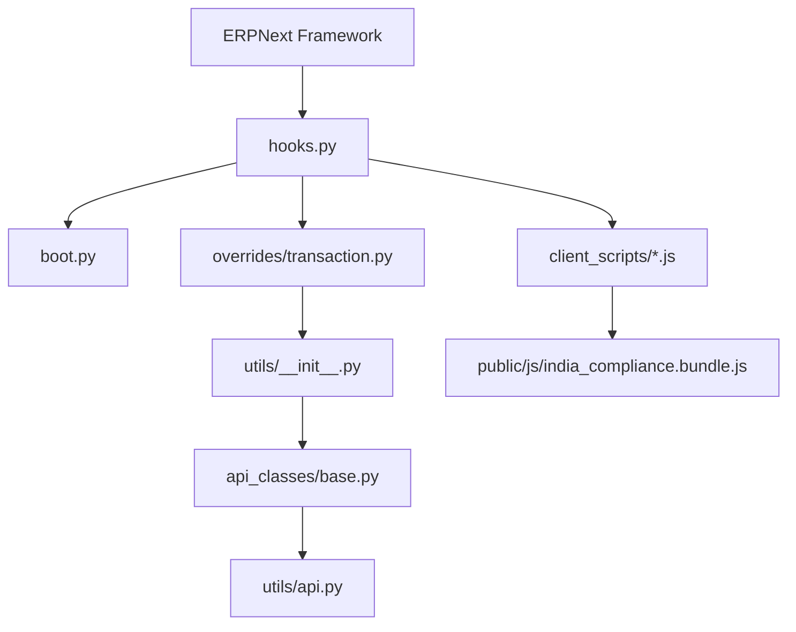

**Diagram sources**
- [hooks.py](file://india_compliance/hooks.py#L118-L492)
- [boot.py](file://india_compliance/boot.py#L13-L76)
- [overrides/transaction.py](file://india_compliance/gst_india/overrides/transaction.py#L44-L200)
- [utils/__init__.py](file://india_compliance/gst_india/utils/__init__.py#L50-L800)
- [api_classes/base.py](file://india_compliance/gst_india/api_classes/base.py#L23-L200)
- [api.py](file://india_compliance/gst_india/utils/api.py#L4-L57)
- [client_scripts/sales_invoice.js](file://india_compliance/gst_india/client_scripts/sales_invoice.js#L1-L97)
- [public/js/india_compliance.bundle.js](file://india_compliance/public/js/india_compliance.bundle.js#L1-L14)

## Detailed Component Analysis

### Application Layer: Hooks and Boot
- hooks.py
  - Registers document events for multiple doctypes, invoking overrides for validation, onload, before_save/before_submit, and cancel flows.
  - Defines regional overrides for taxes and accounting controllers, ensuring GST-specific behavior in ERPNext’s core.
  - Exposes whitelisted methods and scheduler events for retry and download tasks.
  - Declares audit trail doctypes and notification triggers.
- boot.py
  - Loads boot info including GST settings, party types, and state options.
  - Sets triggers for audit trail and notification banners based on system defaults and settings.

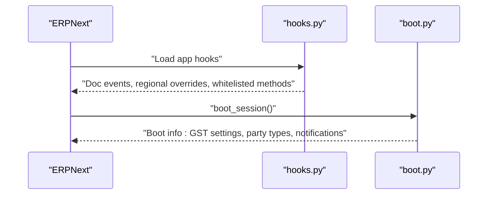

**Diagram sources**
- [hooks.py](file://india_compliance/hooks.py#L118-L492)
- [boot.py](file://india_compliance/boot.py#L13-L76)

**Section sources**
- [hooks.py](file://india_compliance/hooks.py#L118-L492)
- [boot.py](file://india_compliance/boot.py#L13-L76)

### Business Logic Layer: Utilities and Overrides
- utils/__init__.py
  - Provides GST validations, place-of-supply computation, account mapping, and API toggles.
  - Centralizes shared helpers used across overrides and client scripts.
- overrides/transaction.py
  - Implements transaction-level validations and updates for GST details across Sales/Purchase/Stock documents.
  - Handles taxable value computation, charge apportionment, and mandatory field validations.
- constants/__init__.py
  - Supplies GST tax types, state mappings, UOM conversions, and action/status codes.

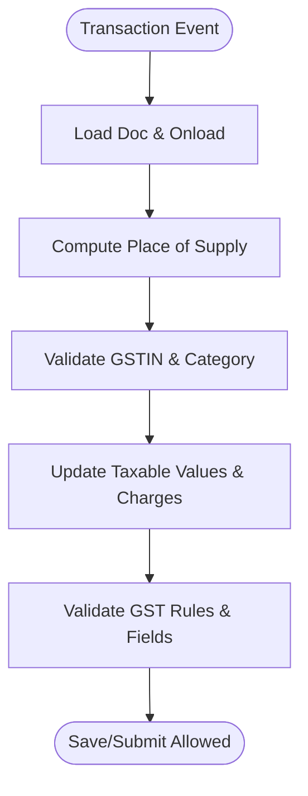

**Diagram sources**
- [overrides/transaction.py](file://india_compliance/gst_india/overrides/transaction.py#L44-L200)
- [utils/__init__.py](file://india_compliance/gst_india/utils/__init__.py#L402-L484)
- [constants/__init__.py](file://india_compliance/gst_india/constants/__init__.py#L1-L200)

**Section sources**
- [utils/__init__.py](file://india_compliance/gst_india/utils/__init__.py#L50-L800)
- [overrides/transaction.py](file://india_compliance/gst_india/overrides/transaction.py#L44-L200)
- [constants/__init__.py](file://india_compliance/gst_india/constants/__init__.py#L1-L200)

### Integration Layer: API Classes and Logging
- api_classes/base.py
  - BaseAPI manages credentials, sandbox mode, URL construction, and request/response handling.
  - Masks sensitive headers/body fields and logs requests for auditability.
- utils/api.py
  - Enqueues creation of Integration Request records for async processing and links to downstream actions.

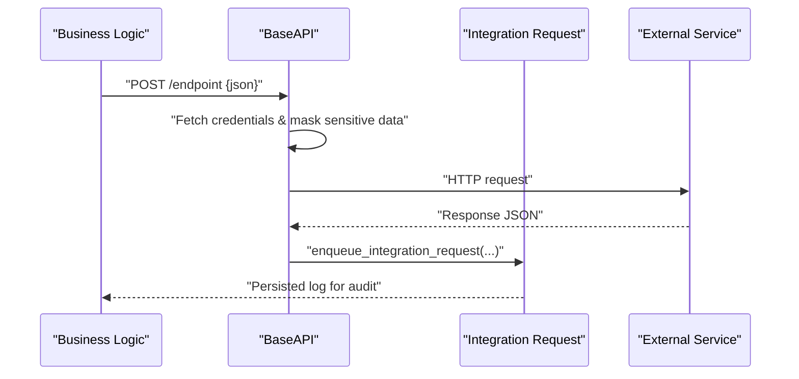

**Diagram sources**
- [api_classes/base.py](file://india_compliance/gst_india/api_classes/base.py#L23-L200)
- [api.py](file://india_compliance/gst_india/utils/api.py#L4-L57)

**Section sources**
- [api_classes/base.py](file://india_compliance/gst_india/api_classes/base.py#L23-L200)
- [api.py](file://india_compliance/gst_india/utils/api.py#L4-L57)

### Presentation Layer: Client Scripts and Bundles
- client_scripts/sales_invoice.js
  - Adds e-waybill applicability checks, driver/transporter queries, and UI warnings for GST invoices.
- public/js/india_compliance.bundle.js
  - Aggregates client modules for unified loading and initialization.

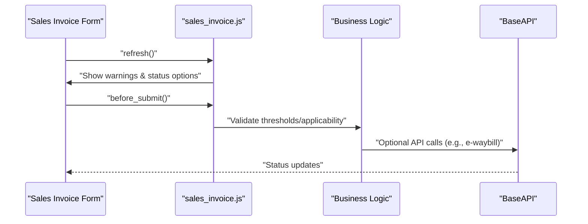

**Diagram sources**
- [client_scripts/sales_invoice.js](file://india_compliance/gst_india/client_scripts/sales_invoice.js#L1-L97)
- [public/js/india_compliance.bundle.js](file://india_compliance/public/js/india_compliance.bundle.js#L1-L14)
- [overrides/transaction.py](file://india_compliance/gst_india/overrides/transaction.py#L44-L200)
- [api_classes/base.py](file://india_compliance/gst_india/api_classes/base.py#L23-L200)

**Section sources**
- [client_scripts/sales_invoice.js](file://india_compliance/gst_india/client_scripts/sales_invoice.js#L1-L97)
- [public/js/india_compliance.bundle.js](file://india_compliance/public/js/india_compliance.bundle.js#L1-L14)

### Event-Driven Architecture and Custom Overrides
- Document events in hooks.py trigger overrides for each major transaction type, ensuring GST rules are enforced consistently across submit/cancel/update flows.
- Regional overrides integrate with ERPNext’s controllers for taxes and accounting entries.
- Scheduler events automate retries and downloads for GST operations.

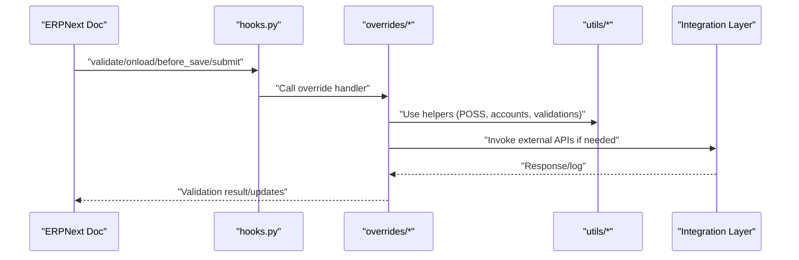

**Diagram sources**
- [hooks.py](file://india_compliance/hooks.py#L118-L492)
- [overrides/transaction.py](file://india_compliance/gst_india/overrides/transaction.py#L44-L200)
- [utils/__init__.py](file://india_compliance/gst_india/utils/__init__.py#L50-L800)
- [api_classes/base.py](file://india_compliance/gst_india/api_classes/base.py#L23-L200)

**Section sources**
- [hooks.py](file://india_compliance/hooks.py#L118-L492)

### Plugin Architecture and Separation of Concerns
- The app is structured as a plugin with independent modules:
  - gst_india: GST-specific logic, client scripts, reports, and doctypes.
  - audit_trail: audit trail enforcement and overrides.
  - income_tax_india: income tax fixtures and overrides.
  - vat_india: VAT-related doctypes.
- hooks.py wires these modules into ERPNext without tight coupling, enabling independent development and deployment.

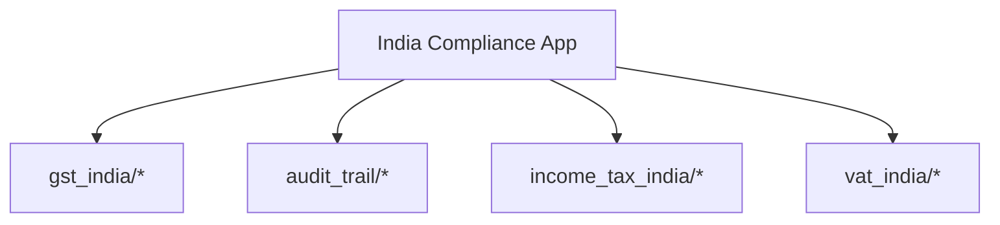

**Diagram sources**
- [hooks.py](file://india_compliance/hooks.py#L1-L684)

**Section sources**
- [hooks.py](file://india_compliance/hooks.py#L1-L684)

### Data Flow Patterns During GST Compliance Processes
- Validation pipeline: client script triggers UI checks; server-side overrides validate GST details; utils provide supporting validations.
- Integration pipeline: overrides call BaseAPI; utils/api persist logs; scheduler events retry failures.
- Audit trail: version override prevents altering protected versions when audit trail is enabled.

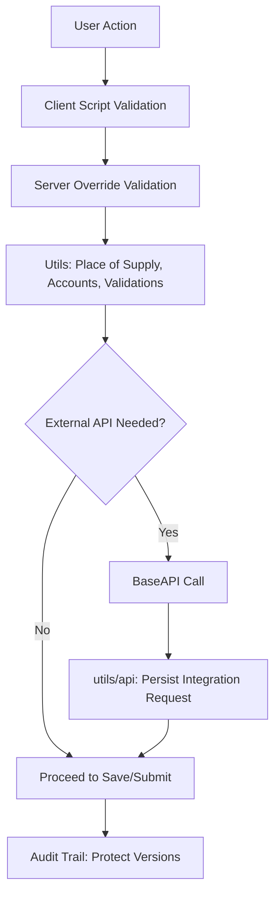

**Diagram sources**
- [client_scripts/sales_invoice.js](file://india_compliance/gst_india/client_scripts/sales_invoice.js#L1-L97)
- [overrides/transaction.py](file://india_compliance/gst_india/overrides/transaction.py#L44-L200)
- [utils/__init__.py](file://india_compliance/gst_india/utils/__init__.py#L50-L800)
- [api_classes/base.py](file://india_compliance/gst_india/api_classes/base.py#L23-L200)
- [api.py](file://india_compliance/gst_india/utils/api.py#L4-L57)
- [audit_trail/overrides/version.py](file://india_compliance/audit_trail/overrides/version.py#L1-L33)

**Section sources**
- [audit_trail/overrides/version.py](file://india_compliance/audit_trail/overrides/version.py#L1-L33)

### Security Boundaries and Access Control
- API credentials are fetched from GST Settings and masked in logs.
- Whitelisted methods and scheduler events are scoped to specific tasks.
- Audit trail protects versions of critical doctypes when enabled.
- Income tax fixtures are created conditionally based on country and company settings.

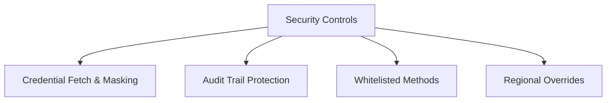

**Diagram sources**
- [api_classes/base.py](file://india_compliance/gst_india/api_classes/base.py#L23-L200)
- [audit_trail/overrides/version.py](file://india_compliance/audit_trail/overrides/version.py#L1-L33)
- [hooks.py](file://india_compliance/hooks.py#L636-L640)

**Section sources**
- [api_classes/base.py](file://india_compliance/gst_india/api_classes/base.py#L23-L200)
- [audit_trail/overrides/version.py](file://india_compliance/audit_trail/overrides/version.py#L1-L33)
- [hooks.py](file://india_compliance/hooks.py#L636-L640)

### Component Interaction Diagrams
- GST India module, audit trail system, income tax management, and VAT operations:
  - GST India module coordinates validations, e-waybill/e-invoice flows, and integration logging.
  - Audit trail system enforces protection of versions for specified doctypes.
  - Income tax management creates TDS-related fixtures and updates categories.
  - VAT operations are represented by dedicated doctypes under vat_india.

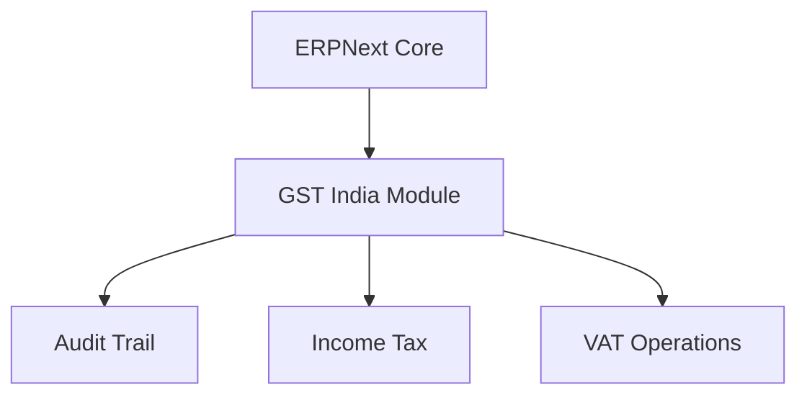

**Diagram sources**
- [hooks.py](file://india_compliance/hooks.py#L446-L471)
- [audit_trail/overrides/version.py](file://india_compliance/audit_trail/overrides/version.py#L1-L33)
- [income_tax_india/overrides/company.py](file://india_compliance/income_tax_india/overrides/company.py#L1-L148)

**Section sources**
- [hooks.py](file://india_compliance/hooks.py#L446-L471)
- [income_tax_india/overrides/company.py](file://india_compliance/income_tax_india/overrides/company.py#L1-L148)

## Dependency Analysis
- Coupling
  - hooks.py depends on overrides and audit trail modules for event wiring.
  - overrides/transaction.py depends on utils and constants for validations and mappings.
  - api_classes/base.py depends on utils for API toggles and on utils/api for logging.
- Cohesion
  - Each layer encapsulates a single responsibility: lifecycle (hooks/boot), business rules (overrides/utils), integration (api classes), and UI (client scripts).
- External dependencies
  - ERPNext controllers and doctypes are extended via overrides and regional overrides.
  - Scheduler events coordinate periodic tasks for retries and downloads.

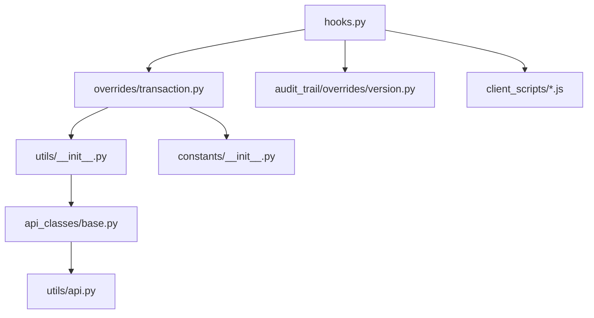

**Diagram sources**
- [hooks.py](file://india_compliance/hooks.py#L118-L492)
- [overrides/transaction.py](file://india_compliance/gst_india/overrides/transaction.py#L44-L200)
- [utils/__init__.py](file://india_compliance/gst_india/utils/__init__.py#L50-L800)
- [constants/__init__.py](file://india_compliance/gst_india/constants/__init__.py#L1-L200)
- [api_classes/base.py](file://india_compliance/gst_india/api_classes/base.py#L23-L200)
- [api.py](file://india_compliance/gst_india/utils/api.py#L4-L57)
- [audit_trail/overrides/version.py](file://india_compliance/audit_trail/overrides/version.py#L1-L33)

**Section sources**
- [hooks.py](file://india_compliance/hooks.py#L118-L492)

## Performance Considerations
- Use cached settings and request caching for repeated operations (e.g., GST settings retrieval).
- Batch scheduler tasks to avoid frequent external API calls.
- Minimize redundant validations by leveraging computed place-of-supply and cached constants.

## Troubleshooting Guide
- API errors: Inspect persisted Integration Request logs and ensure credentials are configured.
- Audit trail conflicts: Protected versions cannot be altered when audit trail is enabled.
- Notification banners: Triggers are set based on system defaults; verify boot info for notifications.

**Section sources**
- [api.py](file://india_compliance/gst_india/utils/api.py#L4-L57)
- [audit_trail/overrides/version.py](file://india_compliance/audit_trail/overrides/version.py#L1-L33)
- [boot.py](file://india_compliance/boot.py#L47-L75)

## Conclusion
The India Compliance system employs a clean layered architecture that integrates tightly with ERPNext through hooks, overrides, and regional extensions. The separation of concerns across application, business logic, integration, and presentation layers enables modular development and robust compliance workflows. Event-driven behavior, plugin-style modularity, and strong security controls support scalable and maintainable GST, audit trail, income tax, and VAT operations.

## Appendices
- Glossary
  - GST: Goods and Services Tax compliance workflows.
  - Audit Trail: Requirement to protect versions of specified doctypes.
  - Regional Overrides: ERPNext controller extensions for Indian accounting standards.
  - Integration Request: Persistent log of external API calls for auditing.