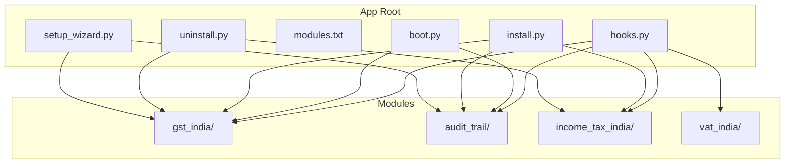
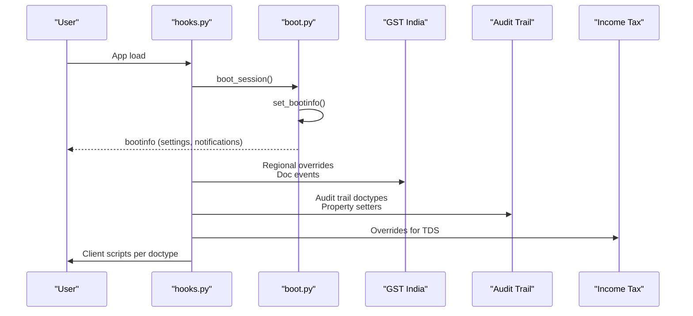
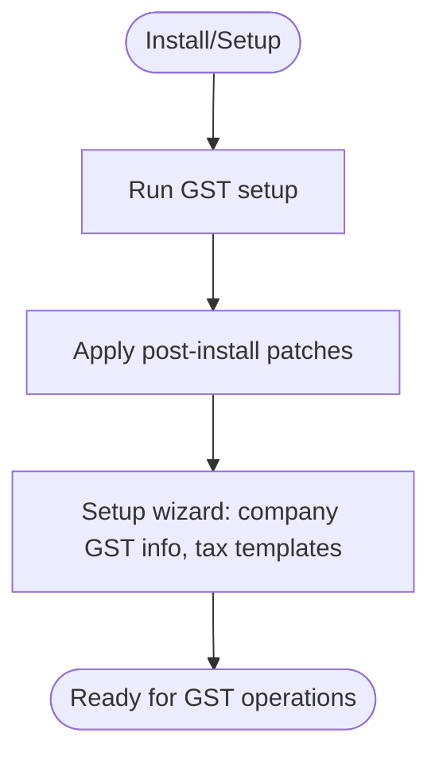
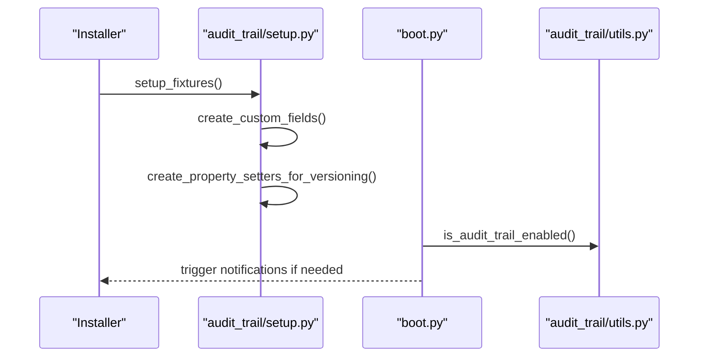
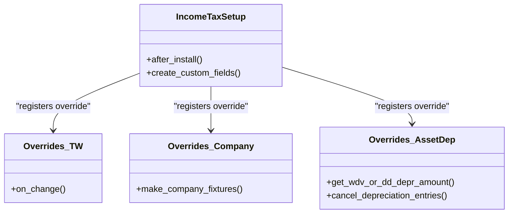
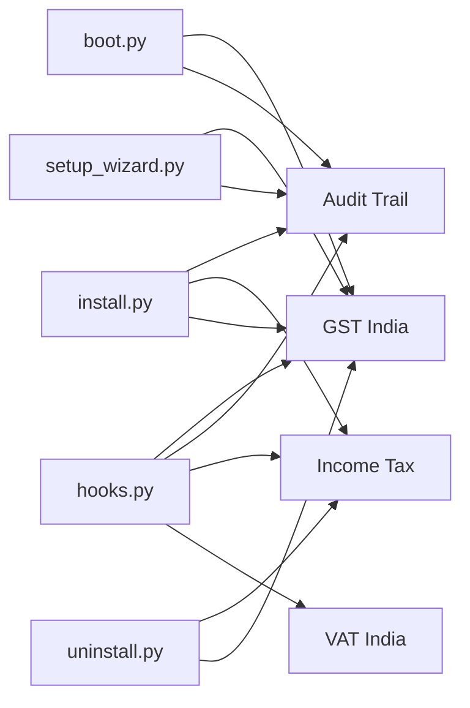

# Module System

<cite>
**Referenced Files in This Document**
- [hooks.py](file://india_compliance/hooks.py)
- [boot.py](file://india_compliance/boot.py)
- [modules.txt](file://india_compliance/modules.txt)
- [install.py](file://india_compliance/install.py)
- [uninstall.py](file://india_compliance/uninstall.py)
- [setup_wizard.py](file://india_compliance/setup_wizard.py)
- [audit_trail/setup.py](file://india_compliance/audit_trail/setup.py)
- [income_tax_india/setup.py](file://india_compliance/income_tax_india/setup.py)
- [gst_india/__init__.py](file://india_compliance/gst_india/__init__.py)
- [audit_trail/__init__.py](file://india_compliance/audit_trail/__init__.py)
- [income_tax_india/__init__.py](file://india_compliance/income_tax_india/__init__.py)
- [vat_india/__init__.py](file://india_compliance/vat_india/__init__.py)
- [gst_india/constants/__init__.py](file://india_compliance/gst_india/constants/__init__.py)
- [gst_india/constants/custom_fields.py](file://india_compliance/gst_india/constants/custom_fields.py)
- [gst_india/constants/e_invoice.py](file://india_compliance/gst_india/constants/e_invoice.py)
- [gst_india/constants/e_waybill.py](file://india_compliance/gst_india/constants/e_waybill.py)
- [gst_india/overrides/company.py](file://india_compliance/gst_india/overrides/company.py)
- [gst_india/overrides/party.py](file://india_compliance/gst_india/overrides/party.py)
- [gst_india/utils/gstin_info.py](file://india_compliance/gst_india/utils/gstin_info.py)
- [gst_india/utils/__init__.py](file://india_compliance/gst_india/utils/__init__.py)
- [audit_trail/constants/custom_fields.py](file://india_compliance/audit_trail/constants/custom_fields.py)
- [audit_trail/utils.py](file://india_compliance/audit_trail/utils.py)
- [income_tax_india/constants/custom_fields.py](file://india_compliance/income_tax_india/constants/custom_fields.py)
- [income_tax_india/overrides/tax_withholding_category.py](file://india_compliance/income_tax_india/overrides/tax_withholding_category.py)
- [income_tax_india/overrides/company.py](file://india_compliance/income_tax_india/overrides/company.py)
- [income_tax_india/overrides/asset_depreciation_schedule.py](file://india_compliance/income_tax_india/overrides/asset_depreciation_schedule.py)
- [patches/post_install/__init__.py](file://india_compliance/patches/post_install/__init__.py)
- [patches/check_version_compatibility.py](file://india_compliance/patches/check_version_compatibility.py)
- [utils/custom_fields.py](file://india_compliance/utils/custom_fields.py)
</cite>

## Table of Contents
1. [Introduction](#introduction)
2. [Project Structure](#project-structure)
3. [Core Components](#core-components)
4. [Architecture Overview](#architecture-overview)
5. [Detailed Component Analysis](#detailed-component-analysis)
6. [Dependency Analysis](#dependency-analysis)
7. [Performance Considerations](#performance-considerations)
8. [Troubleshooting Guide](#troubleshooting-guide)
9. [Conclusion](#conclusion)
10. [Appendices](#appendices)

## Introduction
This document explains the module system architecture of India Compliance, focusing on the four primary modules:
- GST India (primary compliance module)
- Audit Trail (compliance monitoring)
- Income Tax India (TDS management)
- VAT India (legacy VAT compliance)

It details module initialization, dependency management, registration via hooks and boot, configuration and activation, inter-module communication, and how modules extend ERPNext through overrides and customizations. It also documents the plugin-style activation model that allows selective enablement based on business requirements.

## Project Structure
India Compliance organizes compliance capabilities into cohesive modules under the india_compliance app. Each module encapsulates domain-specific functionality, overrides, constants, reports, and utilities. Registration and lifecycle hooks are centralized in hooks.py and boot.py, while module-specific setup routines live in each module’s setup.py.

**Diagram sources**
- [hooks.py](file://india_compliance/hooks.py#L1-L684)
- [boot.py](file://india_compliance/boot.py#L1-L76)
- [modules.txt](file://india_compliance/modules.txt#L1-L4)
- [install.py](file://india_compliance/install.py#L1-L119)
- [uninstall.py](file://india_compliance/uninstall.py#L1-L44)
- [setup_wizard.py](file://india_compliance/setup_wizard.py#L1-L135)

**Section sources**
- [hooks.py](file://india_compliance/hooks.py#L1-L684)
- [boot.py](file://india_compliance/boot.py#L1-L76)
- [modules.txt](file://india_compliance/modules.txt#L1-L4)

## Core Components
- GST India: Core compliance module handling GST-related validations, e-invoice/e-waybill integrations, HSN codes, returns, and regional accounting adjustments.
- Audit Trail: Compliance monitoring module that tracks changes to auditable documents and maintains versioning.
- Income Tax India: TDS/TCS management module adding custom fields and overrides for tax withholding categories and asset depreciation schedules.
- VAT India: Legacy VAT compliance module for historical VAT processes.

Each module contributes to the compliance ecosystem while remaining independently configurable and activatable.

**Section sources**
- [modules.txt](file://india_compliance/modules.txt#L1-L4)
- [hooks.py](file://india_compliance/hooks.py#L446-L471)

## Architecture Overview
The module system is driven by Frappe hooks and a boot-time initialization pipeline. Centralized hooks define:
- Document event overrides across ERPNext doctypes
- Regional overrides for accounting behavior
- Client script inclusion per doctype
- Audit trail configuration and doctypes to track
- Scheduler tasks for background jobs
- Setup wizard stages and post-install patches

Boot-time boot.py enriches session bootinfo with GST settings, state options, and triggers for notifications.

**Diagram sources**
- [hooks.py](file://india_compliance/hooks.py#L35-L407)
- [boot.py](file://india_compliance/boot.py#L13-L76)

**Section sources**
- [hooks.py](file://india_compliance/hooks.py#L35-L407)
- [boot.py](file://india_compliance/boot.py#L13-L76)

## Detailed Component Analysis

### GST India (Primary Compliance Module)
Responsibilities:
- Validates party and item details, updates GST details during transactions
- Integrates e-invoice and e-waybill generation, cancellation, and retries
- Manages HSN codes, GST settings, and regional accounting adjustments
- Provides print formats, reports, and workspace for GST operations

Key integration points:
- Document events for Sales/Purchase/Stock transactions
- Regional overrides for taxes and valuation rates
- Overrides for Journal Entry, Payment Entry, and GL Entry
- Client scripts for UI enhancements and applicability checks

Initialization and activation:
- Installed via install.py, which calls module-specific setup routines
- Post-install patches applied to align existing data with new structures
- Setup wizard configures company GST info and default tax templates

Inter-module communication:
- Shares GST settings and state options via bootinfo
- Uses Audit Trail utilities for notifications and state transitions

**Diagram sources**
- [install.py](file://india_compliance/install.py#L55-L81)
- [setup_wizard.py](file://india_compliance/setup_wizard.py#L32-L135)

**Section sources**
- [hooks.py](file://india_compliance/hooks.py#L118-L350)
- [hooks.py](file://india_compliance/hooks.py#L353-L389)
- [install.py](file://india_compliance/install.py#L55-L81)
- [setup_wizard.py](file://india_compliance/setup_wizard.py#L32-L135)

### Audit Trail (Compliance Monitoring)
Responsibilities:
- Tracks changes to configured doctypes by enabling versioning
- Creates custom fields and property setters for auditability
- Provides utilities to enable/disable audit trail and manage notifications

Activation and configuration:
- Setup fixtures during install and migration
- Doctypes to track are defined centrally; property setters enable versioning

**Diagram sources**
- [audit_trail/setup.py](file://india_compliance/audit_trail/setup.py#L16-L48)
- [boot.py](file://india_compliance/boot.py#L47-L58)

**Section sources**
- [audit_trail/setup.py](file://india_compliance/audit_trail/setup.py#L16-L48)
- [hooks.py](file://india_compliance/hooks.py#L446-L471)
- [boot.py](file://india_compliance/boot.py#L47-L58)

### Income Tax India (TDS Management)
Responsibilities:
- Adds custom fields for TDS/TCS categories and asset depreciation schedules
- Overrides tax withholding category behavior and company fixtures creation
- Aligns with ERPNext asset and tax systems for compliance reporting

Activation:
- After install, creates custom fields and applies module-specific configurations

**Diagram sources**
- [income_tax_india/setup.py](file://india_compliance/income_tax_india/setup.py#L7-L13)
- [hooks.py](file://india_compliance/hooks.py#L290-L292)
- [hooks.py](file://india_compliance/hooks.py#L130-L134)
- [hooks.py](file://india_compliance/hooks.py#L382-L387)

**Section sources**
- [income_tax_india/setup.py](file://india_compliance/income_tax_india/setup.py#L7-L13)
- [hooks.py](file://india_compliance/hooks.py#L290-L292)
- [hooks.py](file://india_compliance/hooks.py#L130-L134)
- [hooks.py](file://india_compliance/hooks.py#L382-L387)

### VAT India (Legacy VAT Compliance)
Responsibilities:
- Supports legacy VAT processes and related doctypes
- Maintains backward compatibility for organizations still using VAT workflows

Activation:
- Listed as a module and can be selectively enabled/disabled alongside others

**Section sources**
- [modules.txt](file://india_compliance/modules.txt#L3-L3)
- [vat_india/__init__.py](file://india_compliance/vat_india/__init__.py#L1-L1)

## Dependency Analysis
Module dependencies and coupling:
- Centralized registration via hooks.py ties all modules to ERPNext doctypes and regional behaviors
- Boot-time boot.py depends on GST constants and Audit Trail utilities
- Install/uninstall orchestration ensures consistent setup across modules
- Inter-module communication is minimalistic: shared constants and utilities are referenced directly

**Diagram sources**
- [hooks.py](file://india_compliance/hooks.py#L1-L684)
- [boot.py](file://india_compliance/boot.py#L1-L76)
- [install.py](file://india_compliance/install.py#L1-L119)
- [uninstall.py](file://india_compliance/uninstall.py#L1-L44)
- [setup_wizard.py](file://india_compliance/setup_wizard.py#L1-L135)

**Section sources**
- [hooks.py](file://india_compliance/hooks.py#L1-L684)
- [boot.py](file://india_compliance/boot.py#L1-L76)
- [install.py](file://india_compliance/install.py#L1-L119)
- [uninstall.py](file://india_compliance/uninstall.py#L1-L44)
- [setup_wizard.py](file://india_compliance/setup_wizard.py#L1-L135)

## Performance Considerations
- Centralized hooks reduce duplication and ensure consistent behavior across modules
- Boot-time enrichment avoids repeated database queries for GST settings and state options
- Scheduler tasks are scoped to module-specific utilities to minimize overhead
- Overrides target specific doctypes and events to limit performance impact

[No sources needed since this section provides general guidance]

## Troubleshooting Guide
Common areas to verify:
- Module registration: Confirm entries in modules.txt and hooks.py registration
- Installation/Uninstallation: Review install.py and uninstall.py for expected setup steps
- Audit Trail: Ensure property setters are created and doctypes are included
- GST settings: Verify bootinfo population and sandbox mode/API secret configuration
- Setup wizard: Validate company GST info and default tax template creation

**Section sources**
- [modules.txt](file://india_compliance/modules.txt#L1-L4)
- [install.py](file://india_compliance/install.py#L55-L81)
- [uninstall.py](file://india_compliance/uninstall.py#L15-L32)
- [audit_trail/setup.py](file://india_compliance/audit_trail/setup.py#L16-L48)
- [boot.py](file://india_compliance/boot.py#L18-L26)
- [setup_wizard.py](file://india_compliance/setup_wizard.py#L65-L135)

## Conclusion
India Compliance employs a modular architecture where GST India is the primary compliance engine, supported by Audit Trail for monitoring, Income Tax for TDS/TCS, and VAT for legacy support. The system leverages Frappe hooks and boot for registration and initialization, ensuring each module remains independent yet interoperable. Activation follows a plugin-style model, allowing selective enablement based on organizational needs.

[No sources needed since this section summarizes without analyzing specific files]

## Appendices

### Module Registration and Activation Procedures
- Registration: modules.txt lists module names; hooks.py registers doctypes, overrides, and scheduler events
- Activation: install.py orchestrates setup across modules; uninstall.py removes module-specific customizations
- Boot: boot.py enriches session data and triggers notifications based on module state

**Section sources**
- [modules.txt](file://india_compliance/modules.txt#L1-L4)
- [hooks.py](file://india_compliance/hooks.py#L1-L684)
- [install.py](file://india_compliance/install.py#L55-L81)
- [uninstall.py](file://india_compliance/uninstall.py#L15-L32)
- [boot.py](file://india_compliance/boot.py#L13-L76)

### Inter-Module Communication Patterns
- Shared constants and utilities are imported directly (e.g., GST constants, Audit Trail utilities)
- No central dispatcher; modules communicate via ERPNext APIs and shared hooks
- Boot-time bootinfo provides runtime context to dependent modules

**Section sources**
- [boot.py](file://india_compliance/boot.py#L10-L26)
- [audit_trail/utils.py](file://india_compliance/audit_trail/utils.py#L1-L200)
- [gst_india/constants/__init__.py](file://india_compliance/gst_india/constants/__init__.py#L1-L200)

### Examples of Overrides and Customizations
- GST India overrides:
  - Party validation and address updates
  - Transaction updates for GST details and e-waybill/e-invoice flows
  - Regional accounting adjustments for taxes and valuation
- Audit Trail overrides:
  - Property setter validation and versioning for tracked doctypes
- Income Tax overrides:
  - Tax Withholding Category behavior and company fixtures
  - Asset depreciation schedule methods

**Section sources**
- [hooks.py](file://india_compliance/hooks.py#L118-L350)
- [hooks.py](file://india_compliance/hooks.py#L326-L336)
- [hooks.py](file://india_compliance/hooks.py#L290-L292)
- [hooks.py](file://india_compliance/hooks.py#L382-L387)

### Configuration Requirements
- GST Settings: Loaded at boot and masked for security
- Audit Trail: Enabled via setup wizard stage and property setters
- Company fixtures: Created during install and setup wizard
- Custom fields: Generated per module during setup

**Section sources**
- [boot.py](file://india_compliance/boot.py#L18-L26)
- [setup_wizard.py](file://india_compliance/setup_wizard.py#L65-L135)
- [audit_trail/setup.py](file://india_compliance/audit_trail/setup.py#L21-L42)
- [income_tax_india/setup.py](file://india_compliance/income_tax_india/setup.py#L11-L13)