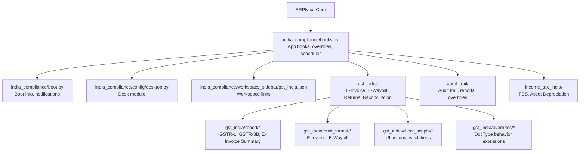
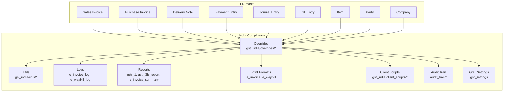
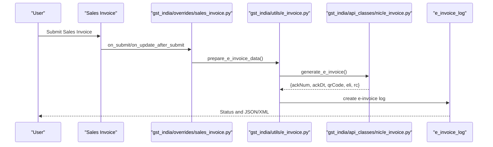
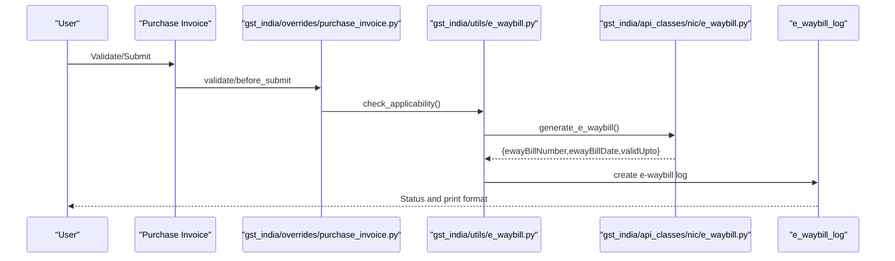
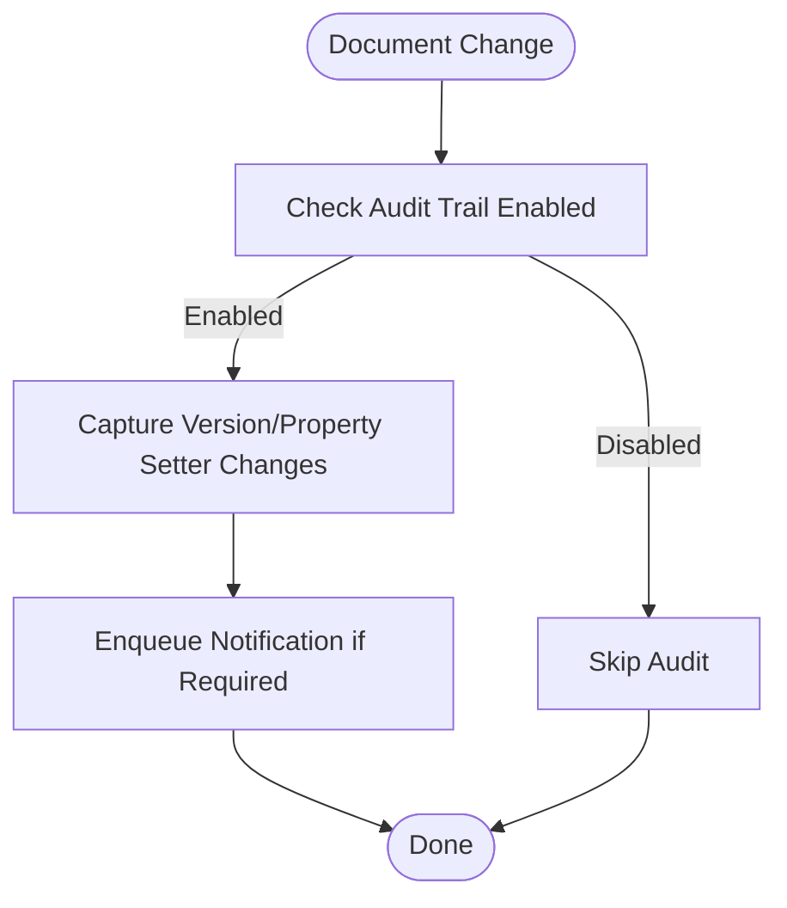
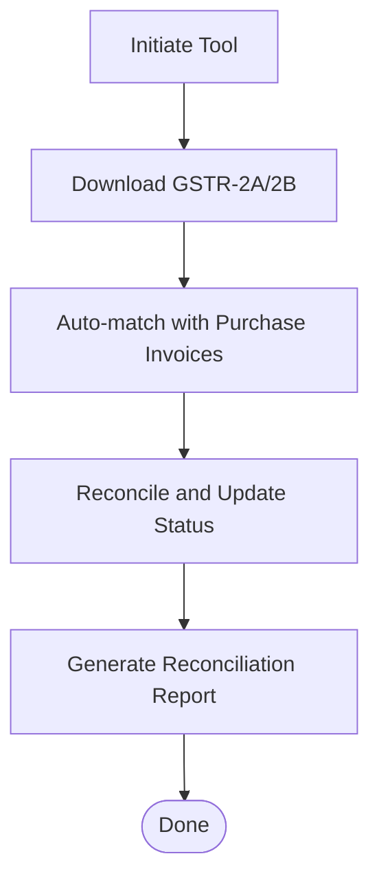
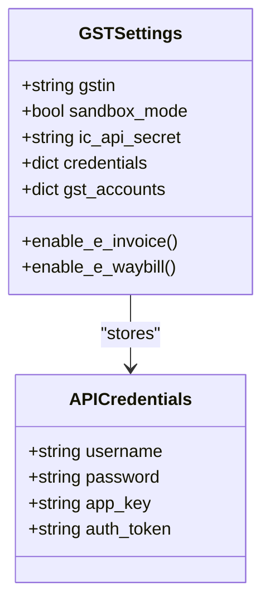
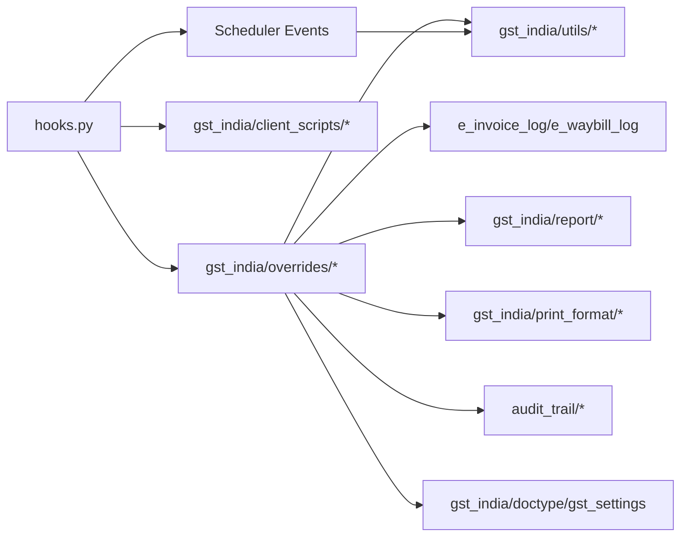

# System Overview

<cite>
**Referenced Files in This Document**
- [README.md](file://README.md)
- [hooks.py](file://india_compliance/hooks.py)
- [boot.py](file://india_compliance/boot.py)
- [desktop.py](file://india_compliance/config/desktop.py)
- [gst_india.json](file://india_compliance/workspace_sidebar/gst_india.json)
- [constants/__init__.py](file://india_compliance/gst_india/constants/__init__.py)
- [audit_trail/overrides/version.py](file://india_compliance/audit_trail/overrides/version.py)
- [audit_trail/report/audit_trail/audit_trail.py](file://india_compliance/audit_trail/report/audit_trail/audit_trail.py)
- [gst_india/api_classes/nic/auth.py](file://india_compliance/gst_india/api_classes/nic/auth.py)
- [gst_india/api_classes/nic/e_invoice.py](file://india_compliance/gst_india/api_classes/nic/e_invoice.py)
- [gst_india/api_classes/nic/e_waybill.py](file://india_compliance/gst_india/api_classes/nic/e_waybill.py)
- [gst_india/utils/e_invoice.py](file://india_compliance/gst_india/utils/e_invoice.py)
- [gst_india/utils/e_waybill.py](file://india_compliance/gst_india/utils/e_waybill.py)
- [gst_india/doctype/e_invoice_log/e_invoice_log.py](file://india_compliance/gst_india/doctype/e_invoice_log/e_invoice_log.py)
- [gst_india/doctype/e_waybill_log/e_waybill_log.py](file://india_compliance/gst_india/doctype/e_waybill_log/e_waybill_log.py)
- [gst_india/doctype/gst_settings/gst_settings.py](file://india_compliance/gst_india/doctype/gst_settings/gst_settings.py)
- [gst_india/doctype/purchase_reconciliation_tool/purchase_reconciliation_tool.py](file://india_compliance/gst_india/doctype/purchase_reconciliation_tool/purchase_reconciliation_tool.py)
- [gst_india/report/gstr_1/gstr_1.py](file://india_compliance/gst_india/report/gstr_1/gstr_1.py)
- [gst_india/report/gstr_3b_report/gstr_3b_report.py](file://india_compliance/gst_india/report/gstr_3b_report/gstr_3b_report.py)
- [gst_india/report/e_invoice_summary/e_invoice_summary.py](file://india_compliance/gst_india/report/e_invoice_summary/e_invoice_summary.py)
- [gst_india/print_format/e_invoice/e_invoice.py](file://india_compliance/gst_india/print_format/e_invoice/e_invoice.py)
- [gst_india/print_format/e_waybill/e_waybill.py](file://india_compliance/gst_india/print_format/e_waybill/e_waybill.py)
- [gst_india/client_scripts/sales_invoice.js](file://india_compliance/gst_india/client_scripts/sales_invoice.js)
- [gst_india/client_scripts/purchase_invoice.js](file://india_compliance/gst_india/client_scripts/purchase_invoice.js)
- [gst_india/client_scripts/e_waybill_actions.js](file://india_compliance/gst_india/client_scripts/e_waybill_actions.js)
- [gst_india/client_scripts/e_invoice_actions.js](file://india_compliance/gst_india/client_scripts/e_invoice_actions.js)
- [gst_india/overrides/sales_invoice.py](file://india_compliance/gst_india/overrides/sales_invoice.py)
- [gst_india/overrides/purchase_invoice.py](file://india_compliance/gst_india/overrides/purchase_invoice.py)
- [gst_india/overrides/company.py](file://india_compliance/gst_india/overrides/company.py)
- [gst_india/overrides/party.py](file://india_compliance/gst_india/overrides/party.py)
- [gst_india/overrides/transaction.py](file://india_compliance/gst_india/overrides/transaction.py)
- [gst_india/overrides/delivery_note.py](file://india_compliance/gst_india/overrides/delivery_note.py)
- [gst_india/overrides/item.py](file://india_compliance/gst_india/overrides/item.py)
- [gst_india/overrides/item_tax_template.py](file://india_compliance/gst_india/overrides/item_tax_template.py)
- [gst_india/overrides/payment_entry.py](file://india_compliance/gst_india/overrides/payment_entry.py)
- [gst_india/overrides/journal_entry.py](file://india_compliance/gst_india/overrides/journal_entry.py)
- [gst_india/overrides/gl_entry.py](file://india_compliance/gst_india/overrides/gl_entry.py)
- [gst_india/overrides/tax_category.py](file://india_compliance/gst_india/overrides/tax_category.py)
- [gst_india/overrides/subcontracting_transaction.py](file://india_compliance/gst_india/overrides/subcontracting_transaction.py)
- [gst_india/overrides/unreconcile_payment.py](file://india_compliance/gst_india/overrides/unreconcile_payment.py)
- [income_tax_india/overrides/company.py](file://india_compliance/income_tax_india/overrides/company.py)
- [income_tax_india/overrides/tax_withholding_category.py](file://india_compliance/income_tax_india/overrides/tax_withholding_category.py)
</cite>

## Table of Contents
1. [Introduction](#introduction)
2. [Project Structure](#project-structure)
3. [Core Components](#core-components)
4. [Architecture Overview](#architecture-overview)
5. [Detailed Component Analysis](#detailed-component-analysis)
6. [Dependency Analysis](#dependency-analysis)
7. [Performance Considerations](#performance-considerations)
8. [Troubleshooting Guide](#troubleshooting-guide)
9. [Conclusion](#conclusion)

## Introduction
India Compliance is an ERPNext extension designed to simplify compliance with Indian Rules and Regulations. It integrates tightly with ERPNext and the Frappe Framework to automate recurring compliance tasks, particularly around Goods and Services Tax (GST). The system focuses on:
- E-invoice generation aligned with IRP (Invoice Registration Portal)
- E-waybill management for inter-state and intra-state movement
- Audit trail maintenance for regulatory transparency
- Comprehensive reporting for GSTR-1, GSTR-3B, and reconciliation
- Real-time validation via GST APIs and intelligent data mapping

Target audience includes businesses in India that require GST compliance automation, streamlined invoice actions, and robust reporting capabilities without replacing ERPNext’s core functionality.

**Section sources**
- [README.md](file://README.md#L26-L64)

## Project Structure
The application is organized as a Frappe app layered under ERPNext. Key areas:
- Core app metadata and hooks for ERPNext integration
- Boot-time initialization for client-side context
- GST-specific domain modules (e-invoice, e-waybill, returns, reconciliation)
- Audit trail subsystem for maintaining compliance logs
- Income Tax module for TDS-related integrations
- Workspace and desktop navigation tailored for GST India
- Extensive client scripts and overrides to extend ERPNext behavior

**Diagram sources**
- [hooks.py](file://india_compliance/hooks.py#L1-L120)
- [boot.py](file://india_compliance/boot.py#L1-L76)
- [desktop.py](file://india_compliance/config/desktop.py#L1-L14)
- [gst_india.json](file://india_compliance/workspace_sidebar/gst_india.json#L1-L131)

**Section sources**
- [hooks.py](file://india_compliance/hooks.py#L1-L120)
- [boot.py](file://india_compliance/boot.py#L1-L76)
- [desktop.py](file://india_compliance/config/desktop.py#L1-L14)
- [gst_india.json](file://india_compliance/workspace_sidebar/gst_india.json#L1-L131)

## Core Components
- E-Invoice Module
  - Generation, cancellation, and retry workflows
  - IRP integration and logging
  - Print formats and QR code generation
- E-Waybill Module
  - Auto-applicability detection and actions
  - Scheduling and extension utilities
  - Logging and print formats
- GST Settings and Credentials
  - Centralized configuration for GST operations
  - API credentials and sandbox mode support
- Audit Trail
  - Maintains logs for key documents and settings
  - Notifications and triggers for compliance visibility
- Returns and Reconciliation
  - GSTR-1 and GSTR-3B reporting utilities
  - Purchase Reconciliation Tool for GSTR-2A/2B matching
- Income Tax (TDS)
  - Overrides for company fixtures and tax withholding categories
- Workspace and Navigation
  - GST India workspace with shortcuts to tools and reports

Key value propositions:
- E-invoice generation aligned with IRP
- E-waybill management with scheduling and extension
- Audit trail maintenance for compliance transparency
- Intelligent reporting for GSTR-1, GSTR-3B, and reconciliation
- Real-time validation via GST APIs

**Section sources**
- [README.md](file://README.md#L37-L64)
- [gst_india/doctype/gst_settings/gst_settings.py](file://india_compliance/gst_india/doctype/gst_settings/gst_settings.py)
- [gst_india/doctype/e_invoice_log/e_invoice_log.py](file://india_compliance/gst_india/doctype/e_invoice_log/e_invoice_log.py)
- [gst_india/doctype/e_waybill_log/e_waybill_log.py](file://india_compliance/gst_india/doctype/e_waybill_log/e_waybill_log.py)
- [audit_trail/overrides/version.py](file://india_compliance/audit_trail/overrides/version.py)
- [gst_india/report/gstr_1/gstr_1.py](file://india_compliance/gst_india/report/gstr_1/gstr_1.py)
- [gst_india/report/gstr_3b_report/gstr_3b_report.py](file://india_compliance/gst_india/report/gstr_3b_report/gstr_3b_report.py)
- [gst_india/report/e_invoice_summary/e_invoice_summary.py](file://india_compliance/gst_india/report/e_invoice_summary/e_invoice_summary.py)
- [gst_india/print_format/e_invoice/e_invoice.py](file://india_compliance/gst_india/print_format/e_invoice/e_invoice.py)
- [gst_india/print_format/e_waybill/e_waybill.py](file://india_compliance/gst_india/print_format/e_waybill/e_waybill.py)

## Architecture Overview
India Compliance extends ERPNext by:
- Installing as an app with required dependencies on ERPNext
- Registering hooks for document events, regional overrides, and scheduler tasks
- Injecting client scripts and UI actions for GST-specific workflows
- Providing backend utilities for API communication and data processing
- Maintaining audit trail and generating compliance-ready reports

**Diagram sources**
- [hooks.py](file://india_compliance/hooks.py#L118-L388)
- [gst_india/overrides/transaction.py](file://india_compliance/gst_india/overrides/transaction.py)
- [gst_india/utils/e_invoice.py](file://india_compliance/gst_india/utils/e_invoice.py)
- [gst_india/utils/e_waybill.py](file://india_compliance/gst_india/utils/e_waybill.py)
- [gst_india/doctype/e_invoice_log/e_invoice_log.py](file://india_compliance/gst_india/doctype/e_invoice_log/e_invoice_log.py)
- [gst_india/doctype/e_waybill_log/e_waybill_log.py](file://india_compliance/gst_india/doctype/e_waybill_log/e_waybill_log.py)
- [gst_india/report/gstr_1/gstr_1.py](file://india_compliance/gst_india/report/gstr_1/gstr_1.py)
- [gst_india/report/gstr_3b_report/gstr_3b_report.py](file://india_compliance/gst_india/report/gstr_3b_report/gstr_3b_report.py)
- [gst_india/report/e_invoice_summary/e_invoice_summary.py](file://india_compliance/gst_india/report/e_invoice_summary/e_invoice_summary.py)
- [gst_india/print_format/e_invoice/e_invoice.py](file://india_compliance/gst_india/print_format/e_invoice/e_invoice.py)
- [gst_india/print_format/e_waybill/e_waybill.py](file://india_compliance/gst_india/print_format/e_waybill/e_waybill.py)
- [gst_india/client_scripts/sales_invoice.js](file://india_compliance/gst_india/client_scripts/sales_invoice.js)
- [gst_india/client_scripts/purchase_invoice.js](file://india_compliance/gst_india/client_scripts/purchase_invoice.js)
- [audit_trail/overrides/version.py](file://india_compliance/audit_trail/overrides/version.py)
- [gst_india/doctype/gst_settings/gst_settings.py](file://india_compliance/gst_india/doctype/gst_settings/gst_settings.py)

## Detailed Component Analysis

### E-Invoice Workflow
End-to-end flow from invoice submission to IRP integration and logging.

**Diagram sources**
- [gst_india/overrides/sales_invoice.py](file://india_compliance/gst_india/overrides/sales_invoice.py)
- [gst_india/utils/e_invoice.py](file://india_compliance/gst_india/utils/e_invoice.py)
- [gst_india/api_classes/nic/e_invoice.py](file://india_compliance/gst_india/api_classes/nic/e_invoice.py)
- [gst_india/doctype/e_invoice_log/e_invoice_log.py](file://india_compliance/gst_india/doctype/e_invoice_log/e_invoice_log.py)

**Section sources**
- [gst_india/overrides/sales_invoice.py](file://india_compliance/gst_india/overrides/sales_invoice.py)
- [gst_india/utils/e_invoice.py](file://india_compliance/gst_india/utils/e_invoice.py)
- [gst_india/api_classes/nic/e_invoice.py](file://india_compliance/gst_india/api_classes/nic/e_invoice.py)
- [gst_india/doctype/e_invoice_log/e_invoice_log.py](file://india_compliance/gst_india/doctype/e_invoice_log/e_invoice_log.py)

### E-Waybill Workflow
Auto-applicability detection, generation, and scheduling.

**Diagram sources**
- [gst_india/overrides/purchase_invoice.py](file://india_compliance/gst_india/overrides/purchase_invoice.py)
- [gst_india/utils/e_waybill.py](file://india_compliance/gst_india/utils/e_waybill.py)
- [gst_india/api_classes/nic/e_waybill.py](file://india_compliance/gst_india/api_classes/nic/e_waybill.py)
- [gst_india/doctype/e_waybill_log/e_waybill_log.py](file://india_compliance/gst_india/doctype/e_waybill_log/e_waybill_log.py)

**Section sources**
- [gst_india/overrides/purchase_invoice.py](file://india_compliance/gst_india/overrides/purchase_invoice.py)
- [gst_india/utils/e_waybill.py](file://india_compliance/gst_india/utils/e_waybill.py)
- [gst_india/api_classes/nic/e_waybill.py](file://india_compliance/gst_india/api_classes/nic/e_waybill.py)
- [gst_india/doctype/e_waybill_log/e_waybill_log.py](file://india_compliance/gst_india/doctype/e_waybill_log/e_waybill_log.py)

### Audit Trail Maintenance
Tracks changes to key documents and settings, with notifications and triggers.

**Diagram sources**
- [audit_trail/overrides/version.py](file://india_compliance/audit_trail/overrides/version.py)
- [boot.py](file://india_compliance/boot.py#L47-L57)

**Section sources**
- [audit_trail/overrides/version.py](file://india_compliance/audit_trail/overrides/version.py)
- [boot.py](file://india_compliance/boot.py#L47-L57)

### Purchase Reconciliation Tool
Automates matching of GSTR-2A/2B with purchase invoices.

**Diagram sources**
- [gst_india/doctype/purchase_reconciliation_tool/purchase_reconciliation_tool.py](file://india_compliance/gst_india/doctype/purchase_reconciliation_tool/purchase_reconciliation_tool.py)

**Section sources**
- [gst_india/doctype/purchase_reconciliation_tool/purchase_reconciliation_tool.py](file://india_compliance/gst_india/doctype/purchase_reconciliation_tool/purchase_reconciliation_tool.py)

### GST Settings and API Credentials
Centralized configuration for GST operations and API access.

**Diagram sources**
- [gst_india/doctype/gst_settings/gst_settings.py](file://india_compliance/gst_india/doctype/gst_settings/gst_settings.py)
- [gst_india/api_classes/nic/auth.py](file://india_compliance/gst_india/api_classes/nic/auth.py)

**Section sources**
- [gst_india/doctype/gst_settings/gst_settings.py](file://india_compliance/gst_india/doctype/gst_settings/gst_settings.py)
- [gst_india/api_classes/nic/auth.py](file://india_compliance/gst_india/api_classes/nic/auth.py)

## Dependency Analysis
- App-level dependencies
  - Required app: frappe/erpnext
  - Boot-time and runtime dependencies for GST operations
- Regional overrides
  - Extends ERPNext’s regional accounting behavior for GST and TDS
- Scheduler-driven tasks
  - Retry e-invoice/e-waybill generation
  - Auto-download and reconcile GSTR-2A/2B
  - Extend scheduled e-waybills
- Client-side integration
  - Client scripts for UI actions and validations across Sales/Purchase/Stock documents

**Diagram sources**
- [hooks.py](file://india_compliance/hooks.py#L353-L492)
- [gst_india/overrides/transaction.py](file://india_compliance/gst_india/overrides/transaction.py)
- [gst_india/utils/e_invoice.py](file://india_compliance/gst_india/utils/e_invoice.py)
- [gst_india/utils/e_waybill.py](file://india_compliance/gst_india/utils/e_waybill.py)
- [gst_india/doctype/e_invoice_log/e_invoice_log.py](file://india_compliance/gst_india/doctype/e_invoice_log/e_invoice_log.py)
- [gst_india/doctype/e_waybill_log/e_waybill_log.py](file://india_compliance/gst_india/doctype/e_waybill_log/e_waybill_log.py)
- [gst_india/report/gstr_1/gstr_1.py](file://india_compliance/gst_india/report/gstr_1/gstr_1.py)
- [gst_india/report/gstr_3b_report/gstr_3b_report.py](file://india_compliance/gst_india/report/gstr_3b_report/gstr_3b_report.py)
- [gst_india/print_format/e_invoice/e_invoice.py](file://india_compliance/gst_india/print_format/e_invoice/e_invoice.py)
- [gst_india/print_format/e_waybill/e_waybill.py](file://india_compliance/gst_india/print_format/e_waybill/e_waybill.py)
- [audit_trail/overrides/version.py](file://india_compliance/audit_trail/overrides/version.py)
- [gst_india/doctype/gst_settings/gst_settings.py](file://india_compliance/gst_india/doctype/gst_settings/gst_settings.py)

**Section sources**
- [hooks.py](file://india_compliance/hooks.py#L353-L492)

## Performance Considerations
- Batch retries and scheduled jobs reduce manual intervention for failed e-invoice/e-waybill generations.
- Centralized GST settings minimize repeated credential lookups and improve reliability.
- Client scripts optimize UI responsiveness by deferring heavy computations to server-side utilities.
- Reports leverage pre-built mappings to GSTR formats, reducing real-time computation overhead.

[No sources needed since this section provides general guidance]

## Troubleshooting Guide
Common areas to check:
- E-invoice/e-waybill generation failures
  - Verify GST Settings and API credentials
  - Review logs and retry mechanisms
- Audit trail not capturing changes
  - Confirm audit trail is enabled and notifications are configured
- Purchase reconciliation mismatches
  - Refresh GSTR downloads and review match criteria
- Scheduler tasks not running
  - Confirm scheduler configuration and job intervals

**Section sources**
- [gst_india/doctype/gst_settings/gst_settings.py](file://india_compliance/gst_india/doctype/gst_settings/gst_settings.py)
- [gst_india/doctype/e_invoice_log/e_invoice_log.py](file://india_compliance/gst_india/doctype/e_invoice_log/e_invoice_log.py)
- [gst_india/doctype/e_waybill_log/e_waybill_log.py](file://india_compliance/gst_india/doctype/e_waybill_log/e_waybill_log.py)
- [audit_trail/overrides/version.py](file://india_compliance/audit_trail/overrides/version.py)
- [gst_india/doctype/purchase_reconciliation_tool/purchase_reconciliation_tool.py](file://india_compliance/gst_india/doctype/purchase_reconciliation_tool/purchase_reconciliation_tool.py)
- [hooks.py](file://india_compliance/hooks.py#L473-L492)

## Conclusion
India Compliance is a modular, ERPNext-native extension that automates GST compliance workflows. By integrating with NIC APIs, extending ERPNext document behaviors, and providing audit trail and reporting capabilities, it enables businesses to meet regulatory requirements efficiently. The modular design allows selective activation of features per company needs, ensuring flexibility and scalability across diverse compliance scenarios.

[No sources needed since this section summarizes without analyzing specific files]