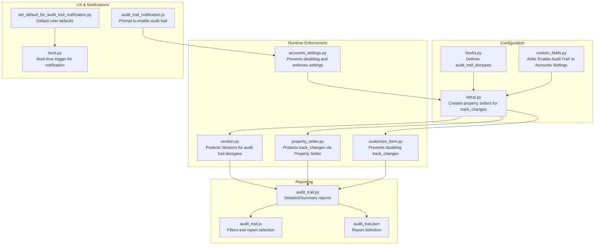
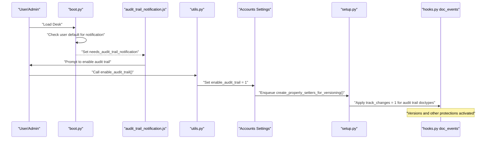
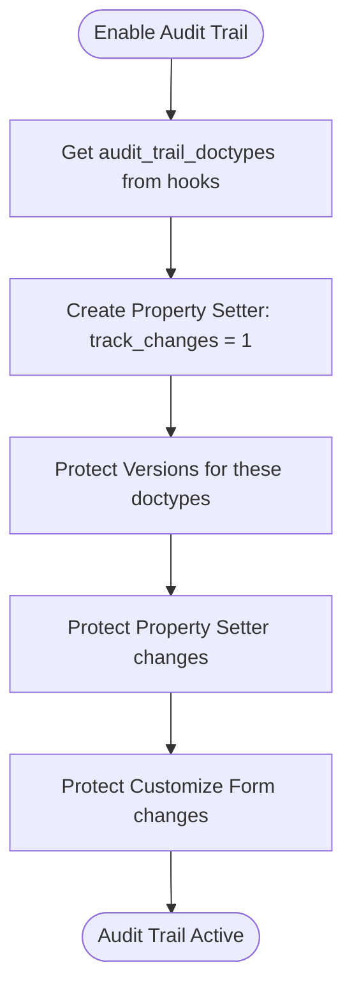
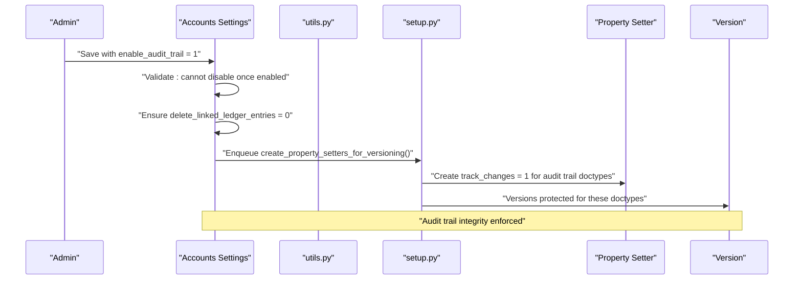
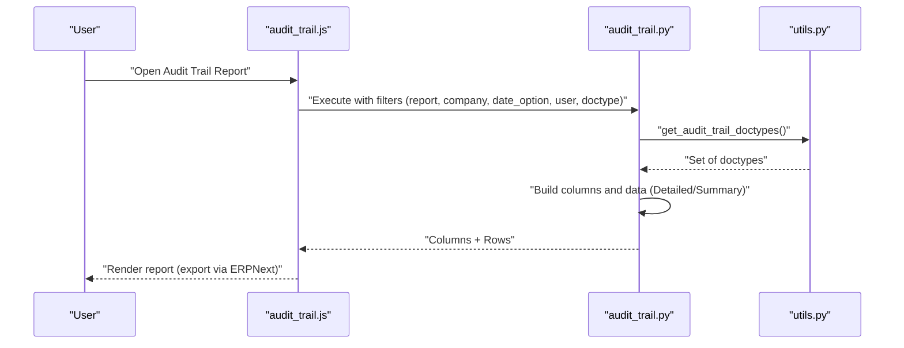
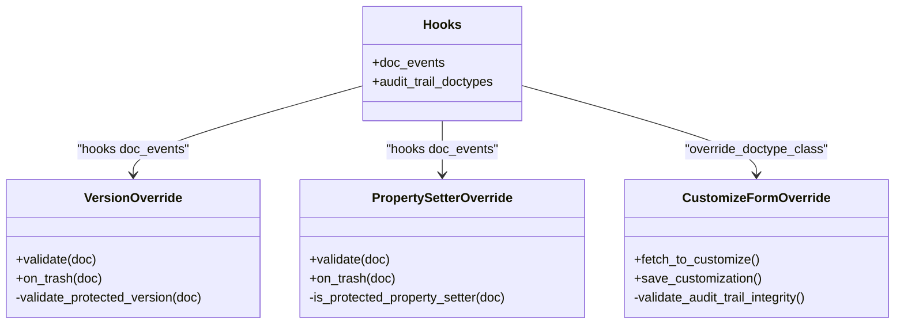
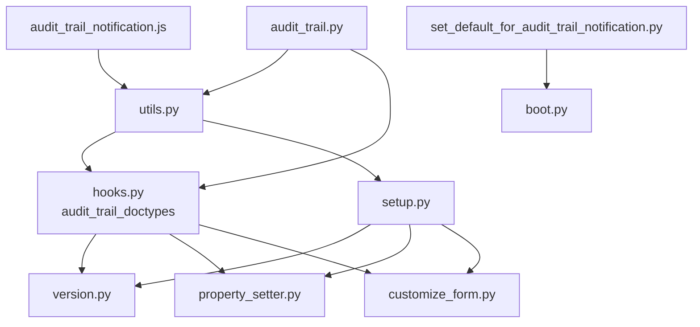

# Audit Trail System

<cite>
**Referenced Files in This Document**
- [hooks.py](file://india_compliance/hooks.py)
- [setup.py](file://india_compliance/audit_trail/setup.py)
- [utils.py](file://india_compliance/audit_trail/utils.py)
- [custom_fields.py](file://india_compliance/audit_trail/constants/custom_fields.py)
- [accounts_settings.py](file://india_compliance/audit_trail/overrides/accounts_settings.py)
- [version.py](file://india_compliance/audit_trail/overrides/version.py)
- [customize_form.py](file://india_compliance/audit_trail/overrides/customize_form.py)
- [property_setter.py](file://india_compliance/audit_trail/overrides/property_setter.py)
- [audit_trail.py](file://india_compliance/audit_trail/report/audit_trail/audit_trail.py)
- [audit_trail.json](file://india_compliance/audit_trail/report/audit_trail/audit_trail.json)
- [audit_trail.js](file://india_compliance/audit_trail/report/audit_trail/audit_trail.js)
- [audit_trail_notification.js](file://india_compliance/public/js/audit_trail_notification.js)
- [set_default_for_audit_trail_notification.py](file://india_compliance/patches/v14/set_default_for_audit_trail_notification.py)
- [test_version.py](file://india_compliance/audit_trail/overrides/test_version.py)
- [boot.py](file://india_compliance/boot.py)
</cite>

## Table of Contents
1. [Introduction](#introduction)
2. [Project Structure](#project-structure)
3. [Core Components](#core-components)
4. [Architecture Overview](#architecture-overview)
5. [Detailed Component Analysis](#detailed-component-analysis)
6. [Dependency Analysis](#dependency-analysis)
7. [Performance Considerations](#performance-considerations)
8. [Troubleshooting Guide](#troubleshooting-guide)
9. [Conclusion](#conclusion)
10. [Appendices](#appendices)

## Introduction
This document explains the Audit Trail Compliance System designed to maintain comprehensive transaction logs for regulatory compliance under the Ministry of Corporate Affairs (MCA) and related authorities. It covers configuration, enabling and protecting audit trail features, version tracking for documents, audit trail reports with filtering and exporting, integration with ERPNext document events, and alignment with GST and other regulatory frameworks. It also addresses data retention, security, and access controls.

## Project Structure
The Audit Trail System spans configuration, runtime enforcement, reporting, and notifications across the application:

- Configuration and hooks define which DocTypes participate in audit trail and how they are protected.
- Overrides enforce integrity for Versions, Property Setters, and Customize Form operations.
- Reports provide detailed and summarized views of audit trail activity.
- Notifications guide administrators to enable audit trail per MCA requirements.

**Diagram sources**
- [hooks.py](file://india_compliance/hooks.py#L445-L471)
- [custom_fields.py](file://india_compliance/audit_trail/constants/custom_fields.py#L1-L26)
- [setup.py](file://india_compliance/audit_trail/setup.py#L25-L42)
- [accounts_settings.py](file://india_compliance/audit_trail/overrides/accounts_settings.py#L12-L21)
- [version.py](file://india_compliance/audit_trail/overrides/version.py#L26-L32)
- [property_setter.py](file://india_compliance/audit_trail/overrides/property_setter.py#L52-L57)
- [customize_form.py](file://india_compliance/audit_trail/overrides/customize_form.py#L30-L44)
- [audit_trail.py](file://india_compliance/audit_trail/report/audit_trail/audit_trail.py#L68-L80)
- [audit_trail.js](file://india_compliance/audit_trail/report/audit_trail/audit_trail.js#L20-L79)
- [audit_trail.json](file://india_compliance/audit_trail/report/audit_trail/audit_trail.json#L1-L28)
- [audit_trail_notification.js](file://india_compliance/public/js/audit_trail_notification.js#L1-L67)
- [set_default_for_audit_trail_notification.py](file://india_compliance/patches/v14/set_default_for_audit_trail_notification.py#L6-L22)
- [boot.py](file://india_compliance/boot.py#L47-L57)

**Section sources**
- [hooks.py](file://india_compliance/hooks.py#L445-L471)
- [custom_fields.py](file://india_compliance/audit_trail/constants/custom_fields.py#L1-L26)
- [setup.py](file://india_compliance/audit_trail/setup.py#L25-L42)
- [audit_trail.py](file://india_compliance/audit_trail/report/audit_trail/audit_trail.py#L68-L80)
- [audit_trail.js](file://india_compliance/audit_trail/report/audit_trail/audit_trail.js#L20-L79)
- [audit_trail.json](file://india_compliance/audit_trail/report/audit_trail/audit_trail.json#L1-L28)
- [audit_trail_notification.js](file://india_compliance/public/js/audit_trail_notification.js#L1-L67)
- [boot.py](file://india_compliance/boot.py#L47-L57)

## Core Components
- Audit Trail doctypes: Defined centrally and enforced via property setters and validations.
- Enabling audit trail: Controlled via Accounts Settings with irreversible enablement and protective settings.
- Version protection: Prevents tampering with Versions for audit trail doctypes.
- Reporting: Script reports for detailed and summarized audit trail views with filters and export-ready structure.
- Notifications: Boot-time prompts and user defaults to guide enabling.

**Section sources**
- [hooks.py](file://india_compliance/hooks.py#L445-L471)
- [utils.py](file://india_compliance/audit_trail/utils.py#L5-L11)
- [accounts_settings.py](file://india_compliance/audit_trail/overrides/accounts_settings.py#L12-L21)
- [version.py](file://india_compliance/audit_trail/overrides/version.py#L26-L32)
- [audit_trail.py](file://india_compliance/audit_trail/report/audit_trail/audit_trail.py#L144-L296)
- [audit_trail.js](file://india_compliance/audit_trail/report/audit_trail/audit_trail.js#L20-L79)
- [audit_trail_notification.js](file://india_compliance/public/js/audit_trail_notification.js#L1-L67)

## Architecture Overview
The system integrates tightly with ERPNext’s lifecycle hooks and document model to capture changes automatically and protect audit evidence.

**Diagram sources**
- [boot.py](file://india_compliance/boot.py#L47-L57)
- [audit_trail_notification.js](file://india_compliance/public/js/audit_trail_notification.js#L1-L67)
- [utils.py](file://india_compliance/audit_trail/utils.py#L26-L30)
- [accounts_settings.py](file://india_compliance/audit_trail/overrides/accounts_settings.py#L19-L21)
- [setup.py](file://india_compliance/audit_trail/setup.py#L25-L42)
- [hooks.py](file://india_compliance/hooks.py#L326-L336)

## Detailed Component Analysis

### Audit Trail Doctypes and Version Tracking
- Centralized list defines which DocTypes are part of audit trail.
- On enabling, property setters are created to ensure change tracking is active for these DocTypes.
- Version protection prevents altering Versions for these DocTypes to preserve audit evidence.

**Diagram sources**
- [hooks.py](file://india_compliance/hooks.py#L445-L471)
- [setup.py](file://india_compliance/audit_trail/setup.py#L25-L42)
- [version.py](file://india_compliance/audit_trail/overrides/version.py#L26-L32)
- [property_setter.py](file://india_compliance/audit_trail/overrides/property_setter.py#L52-L57)
- [customize_form.py](file://india_compliance/audit_trail/overrides/customize_form.py#L30-L44)

**Section sources**
- [hooks.py](file://india_compliance/hooks.py#L445-L471)
- [setup.py](file://india_compliance/audit_trail/setup.py#L25-L42)
- [version.py](file://india_compliance/audit_trail/overrides/version.py#L26-L32)
- [property_setter.py](file://india_compliance/audit_trail/overrides/property_setter.py#L52-L57)
- [customize_form.py](file://india_compliance/audit_trail/overrides/customize_form.py#L30-L44)

### Enabling Audit Trail and Integrity Controls
- Enabling is initiated from Accounts Settings and cannot be disabled once enabled.
- Certain destructive settings are prevented to maintain audit integrity.
- A notification mechanism guides administrators to enable the feature.

**Diagram sources**
- [accounts_settings.py](file://india_compliance/audit_trail/overrides/accounts_settings.py#L12-L21)
- [utils.py](file://india_compliance/audit_trail/utils.py#L26-L30)
- [setup.py](file://india_compliance/audit_trail/setup.py#L25-L42)
- [version.py](file://india_compliance/audit_trail/overrides/version.py#L26-L32)

**Section sources**
- [accounts_settings.py](file://india_compliance/audit_trail/overrides/accounts_settings.py#L12-L21)
- [utils.py](file://india_compliance/audit_trail/utils.py#L26-L30)
- [audit_trail_notification.js](file://india_compliance/public/js/audit_trail_notification.js#L1-L67)
- [boot.py](file://india_compliance/boot.py#L47-L57)

### Audit Trail Reports: Filtering, Searching, and Export
- Report types: Detailed, Summary by DocType, Summary by User.
- Filters: Company, Report type, Date range (including “Custom”), User, DocType.
- Data retrieval aggregates counts and details across relevant doctypes.
- Export: Reports are script reports; export is supported via ERPNext report framework.

**Diagram sources**
- [audit_trail.js](file://india_compliance/audit_trail/report/audit_trail/audit_trail.js#L20-L79)
- [audit_trail.py](file://india_compliance/audit_trail/report/audit_trail/audit_trail.py#L63-L65)
- [audit_trail.py](file://india_compliance/audit_trail/report/audit_trail/audit_trail.py#L144-L296)
- [audit_trail.py](file://india_compliance/audit_trail/report/audit_trail/audit_trail.py#L298-L404)
- [audit_trail.py](file://india_compliance/audit_trail/report/audit_trail/audit_trail.py#L406-L418)
- [utils.py](file://india_compliance/audit_trail/utils.py#L9-L11)
- [audit_trail.json](file://india_compliance/audit_trail/report/audit_trail/audit_trail.json#L1-L28)

**Section sources**
- [audit_trail.js](file://india_compliance/audit_trail/report/audit_trail/audit_trail.js#L20-L79)
- [audit_trail.py](file://india_compliance/audit_trail/report/audit_trail/audit_trail.py#L63-L65)
- [audit_trail.py](file://india_compliance/audit_trail/report/audit_trail/audit_trail.py#L144-L296)
- [audit_trail.py](file://india_compliance/audit_trail/report/audit_trail/audit_trail.py#L298-L404)
- [audit_trail.py](file://india_compliance/audit_trail/report/audit_trail/audit_trail.py#L406-L418)
- [audit_trail.json](file://india_compliance/audit_trail/report/audit_trail/audit_trail.json#L1-L28)

### Integration with ERPNext Document Events
- DocEvents hook triggers audit trail overrides during save, validate, and delete operations.
- Version protection and property setter protections are enforced consistently.

**Diagram sources**
- [hooks.py](file://india_compliance/hooks.py#L326-L336)
- [hooks.py](file://india_compliance/hooks.py#L445-L471)
- [version.py](file://india_compliance/audit_trail/overrides/version.py#L10-L23)
- [property_setter.py](file://india_compliance/audit_trail/overrides/property_setter.py#L11-L27)
- [customize_form.py](file://india_compliance/audit_trail/overrides/customize_form.py#L13-L28)

**Section sources**
- [hooks.py](file://india_compliance/hooks.py#L326-L336)
- [hooks.py](file://india_compliance/hooks.py#L445-L471)
- [version.py](file://india_compliance/audit_trail/overrides/version.py#L10-L23)
- [property_setter.py](file://india_compliance/audit_trail/overrides/property_setter.py#L11-L27)
- [customize_form.py](file://india_compliance/audit_trail/overrides/customize_form.py#L13-L28)

### Relationship with GST and Regulatory Frameworks
- Audit trail aligns with MCA requirements for maintaining an audit trail of every transaction and edit log of changes in books of account.
- The system ensures Versions and related metadata are preserved for audit trail doctypes, supporting compliance with accounting regulations.
- While not a GST-specific module, the audit trail supports broader financial compliance needs.

**Section sources**
- [custom_fields.py](file://india_compliance/audit_trail/constants/custom_fields.py#L15-L21)
- [audit_trail_notification.js](file://india_compliance/public/js/audit_trail_notification.js#L13-L20)
- [hooks.py](file://india_compliance/hooks.py#L445-L471)

## Dependency Analysis
The system exhibits strong cohesion around audit trail enforcement and loose coupling with reporting and UX:

**Diagram sources**
- [utils.py](file://india_compliance/audit_trail/utils.py#L5-L11)
- [hooks.py](file://india_compliance/hooks.py#L445-L471)
- [setup.py](file://india_compliance/audit_trail/setup.py#L25-L42)
- [version.py](file://india_compliance/audit_trail/overrides/version.py#L26-L32)
- [property_setter.py](file://india_compliance/audit_trail/overrides/property_setter.py#L52-L57)
- [customize_form.py](file://india_compliance/audit_trail/overrides/customize_form.py#L30-L44)
- [audit_trail.py](file://india_compliance/audit_trail/report/audit_trail/audit_trail.py#L144-L296)
- [audit_trail_notification.js](file://india_compliance/public/js/audit_trail_notification.js#L1-L67)
- [set_default_for_audit_trail_notification.py](file://india_compliance/patches/v14/set_default_for_audit_trail_notification.py#L6-L22)
- [boot.py](file://india_compliance/boot.py#L47-L57)

**Section sources**
- [utils.py](file://india_compliance/audit_trail/utils.py#L5-L11)
- [hooks.py](file://india_compliance/hooks.py#L445-L471)
- [setup.py](file://india_compliance/audit_trail/setup.py#L25-L42)
- [audit_trail.py](file://india_compliance/audit_trail/report/audit_trail/audit_trail.py#L144-L296)
- [audit_trail_notification.js](file://india_compliance/public/js/audit_trail_notification.js#L1-L67)
- [set_default_for_audit_trail_notification.py](file://india_compliance/patches/v14/set_default_for_audit_trail_notification.py#L6-L22)
- [boot.py](file://india_compliance/boot.py#L47-L57)

## Performance Considerations
- Version tracking increases storage and indexing overhead for audit trail doctypes; ensure appropriate hardware and database maintenance.
- Report queries aggregate counts and data across many doctypes; use filters (date range, user, doctype) to reduce load.
- Property setters are applied once per migration/install; avoid frequent toggling of audit trail settings to minimize repeated operations.

[No sources needed since this section provides general guidance]

## Troubleshooting Guide
Common issues and resolutions:
- Attempting to disable audit trail: Not permitted once enabled; the system enforces this constraint.
- Attempting to modify Versions for audit trail doctypes: Blocked by validation; Versions are protected.
- Attempting to disable track_changes via Customize Form or Property Setter: Blocked if the DocType is in audit trail doctypes.
- Notification not appearing: Check user defaults and boot-time triggers; patch sets default user defaults for specific roles.

**Section sources**
- [accounts_settings.py](file://india_compliance/audit_trail/overrides/accounts_settings.py#L16-L17)
- [version.py](file://india_compliance/audit_trail/overrides/version.py#L26-L32)
- [customize_form.py](file://india_compliance/audit_trail/overrides/customize_form.py#L30-L44)
- [property_setter.py](file://india_compliance/audit_trail/overrides/property_setter.py#L43-L49)
- [set_default_for_audit_trail_notification.py](file://india_compliance/patches/v14/set_default_for_audit_trail_notification.py#L6-L22)
- [boot.py](file://india_compliance/boot.py#L47-L57)

## Conclusion
The Audit Trail System provides a robust, MCA-aligned solution for maintaining comprehensive transaction logs. It enforces integrity via property setters, protects Versions and related configurations, and offers flexible reporting with filtering and export support. Integrations with ERPNext document events ensure automatic capture of changes, while notifications and setup guidance streamline adoption.

[No sources needed since this section summarizes without analyzing specific files]

## Appendices

### Compliance and Security Considerations
- Compliance: Aligns with MCA requirements for maintaining audit trails of transactions and edit logs.
- Data retention: Configure retention policies at the organization level; ensure backups and archival procedures meet statutory timelines.
- Access controls: Restrict report access to authorized roles (e.g., System Manager, Administrator) as defined in the report roles.
- Security: Audit trail data is stored in ERPNext’s standard tables; apply ERPNext security best practices (roles, permissions, encryption at rest and in transit).

**Section sources**
- [audit_trail.json](file://india_compliance/audit_trail/report/audit_trail/audit_trail.json#L20-L27)