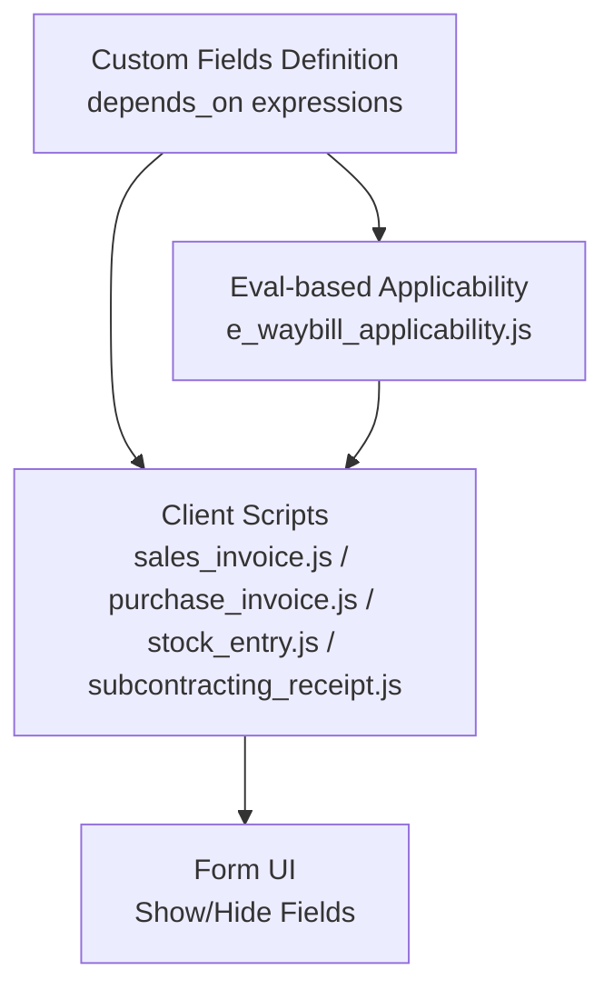
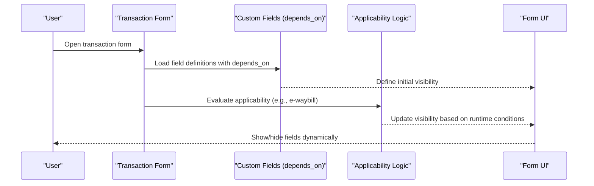
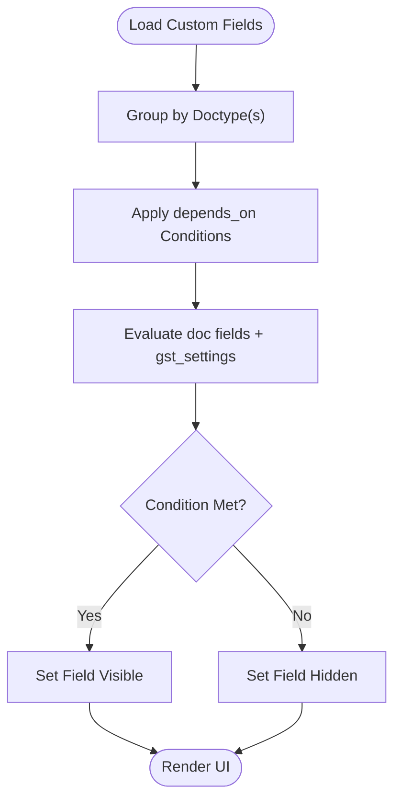
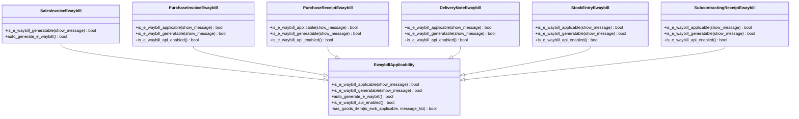
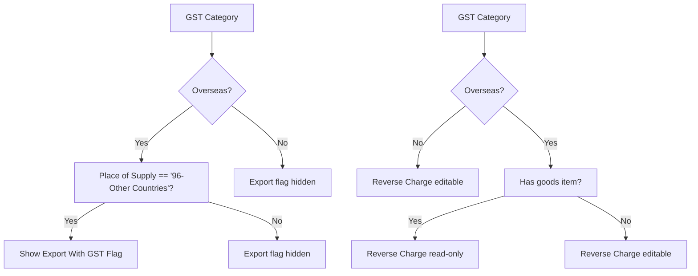
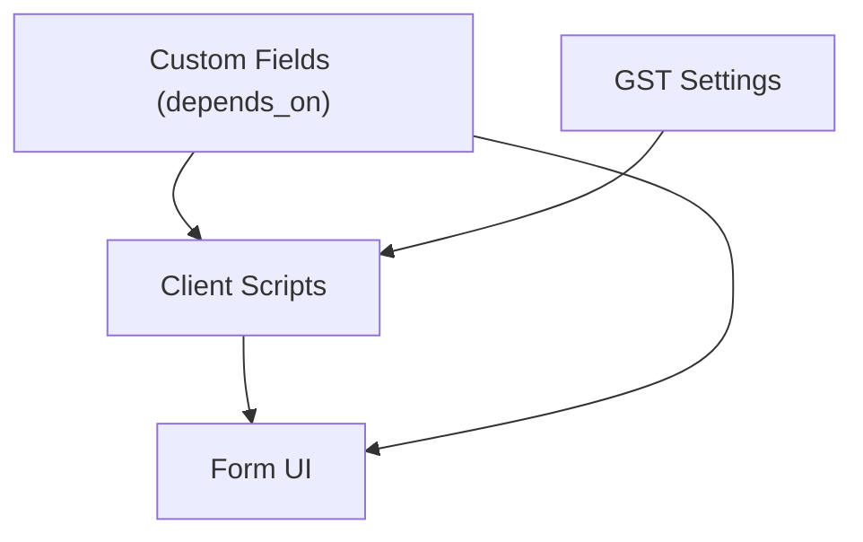

# Conditional Field Visibility

<cite>
**Referenced Files in This Document**
- [custom_fields.py](file://india_compliance/gst_india/constants/custom_fields.py)
- [e_waybill_applicability.js](file://india_compliance/gst_india/client_scripts/e_waybill_applicability.js)
- [sales_invoice.js](file://india_compliance/gst_india/client_scripts/sales_invoice.js)
- [purchase_invoice.js](file://india_compliance/gst_india/client_scripts/purchase_invoice.js)
- [stock_entry.js](file://india_compliance/gst_india/client_scripts/stock_entry.js)
- [subcontracting_receipt.js](file://india_compliance/gst_india/client_scripts/subcontracting_receipt.js)
- [custom_fields.py](file://india_compliance/utils/custom_fields.py)
</cite>

## Table of Contents
1. [Introduction](#introduction)
2. [Project Structure](#project-structure)
3. [Core Components](#core-components)
4. [Architecture Overview](#architecture-overview)
5. [Detailed Component Analysis](#detailed-component-analysis)
6. [Dependency Analysis](#dependency-analysis)
7. [Performance Considerations](#performance-considerations)
8. [Troubleshooting Guide](#troubleshooting-guide)
9. [Conclusion](#conclusion)

## Introduction
This document explains how conditional field visibility is implemented across the custom fields system using depends_on expressions. It focuses on:
- Eval-based conditional logic for e-waybill applicability checks
- Export transaction handling and reverse charge scenarios
- Integration with GST settings and dynamic show/hide behavior
- Field inheritance patterns that apply conditions to multiple doctypes
- Examples of complex conditional expressions
- Performance implications and best practices for responsive UIs

## Project Structure
The conditional field visibility system spans two primary areas:
- Centralized custom field definitions with depends_on expressions
- Client-side logic that evaluates applicability and toggles UI behavior

**Diagram sources**
- [custom_fields.py](file://india_compliance/gst_india/constants/custom_fields.py#L50-L135)
- [e_waybill_applicability.js](file://india_compliance/gst_india/client_scripts/e_waybill_applicability.js#L1-L364)
- [sales_invoice.js](file://india_compliance/gst_india/client_scripts/sales_invoice.js#L1-L97)
- [purchase_invoice.js](file://india_compliance/gst_india/client_scripts/purchase_invoice.js#L1-L131)
- [stock_entry.js](file://india_compliance/gst_india/client_scripts/stock_entry.js#L1-L235)
- [subcontracting_receipt.js](file://india_compliance/gst_india/client_scripts/subcontracting_receipt.js#L1-L144)

**Section sources**
- [custom_fields.py](file://india_compliance/gst_india/constants/custom_fields.py#L50-L135)
- [e_waybill_applicability.js](file://india_compliance/gst_india/client_scripts/e_waybill_applicability.js#L1-L364)

## Core Components
- Custom field definitions with depends_on expressions define which fields appear under which business conditions.
- Client scripts evaluate runtime conditions (e.g., e-waybill applicability) and adjust UI behavior accordingly.
- Utility functions manage dynamic show/hide of fields at scale.

Key capabilities:
- depends_on expressions referencing doc fields and global settings
- Eval-based applicability logic for e-waybill generation
- Reverse charge and export-specific field visibility
- Multi-doctype inheritance via grouped field definitions

**Section sources**
- [custom_fields.py](file://india_compliance/gst_india/constants/custom_fields.py#L50-L135)
- [custom_fields.py](file://india_compliance/utils/custom_fields.py#L7-L36)
- [e_waybill_applicability.js](file://india_compliance/gst_india/client_scripts/e_waybill_applicability.js#L1-L364)

## Architecture Overview
The conditional field system integrates custom field definitions with client-side evaluation:

**Diagram sources**
- [custom_fields.py](file://india_compliance/gst_india/constants/custom_fields.py#L50-L135)
- [e_waybill_applicability.js](file://india_compliance/gst_india/client_scripts/e_waybill_applicability.js#L6-L89)
- [sales_invoice.js](file://india_compliance/gst_india/client_scripts/sales_invoice.js#L31-L57)
- [purchase_invoice.js](file://india_compliance/gst_india/client_scripts/purchase_invoice.js#L21-L26)
- [stock_entry.js](file://india_compliance/gst_india/client_scripts/stock_entry.js#L61-L73)
- [subcontracting_receipt.js](file://india_compliance/gst_india/client_scripts/subcontracting_receipt.js#L62-L67)

## Detailed Component Analysis

### Custom Field Definitions and depends_on Expressions
- Centralized in custom field constants, grouping fields by doctype and applying depends_on expressions.
- Supports multi-doctype inheritance (e.g., multiple doctypes share identical fields with the same condition).
- Uses eval-based expressions referencing doc fields and global settings.

Examples of conditions present:
- E-waybill applicability for subcontracting-related transactions
- Export with GST flag dependent on GST category and place of supply
- e-commerce fields gated by GST settings
- Reverse charge availability based on transaction type and item nature
- Port code, shipping bill fields gated by GST category and settings

**Diagram sources**
- [custom_fields.py](file://india_compliance/gst_india/constants/custom_fields.py#L50-L135)

**Section sources**
- [custom_fields.py](file://india_compliance/gst_india/constants/custom_fields.py#L50-L135)

### Eval-Based E-Waybill Applicability
- A dedicated class evaluates whether e-waybill is applicable/generatable based on:
  - Global settings (enable flags)
  - Company and party GSTIN presence
  - Item composition (goods vs services)
  - Transaction-specific constraints (e.g., opening entries, return types)
- Specialized subclasses tailor logic per doctype (e.g., Purchase Invoice, Stock Entry).

**Diagram sources**
- [e_waybill_applicability.js](file://india_compliance/gst_india/client_scripts/e_waybill_applicability.js#L1-L364)

**Section sources**
- [e_waybill_applicability.js](file://india_compliance/gst_india/client_scripts/e_waybill_applicability.js#L6-L89)
- [e_waybill_applicability.js](file://india_compliance/gst_india/client_scripts/e_waybill_applicability.js#L91-L130)
- [e_waybill_applicability.js](file://india_compliance/gst_india/client_scripts/e_waybill_applicability.js#L132-L168)
- [e_waybill_applicability.js](file://india_compliance/gst_india/client_scripts/e_waybill_applicability.js#L170-L206)
- [e_waybill_applicability.js](file://india_compliance/gst_india/client_scripts/e_waybill_applicability.js#L208-L239)
- [e_waybill_applicability.js](file://india_compliance/gst_india/client_scripts/e_waybill_applicability.js#L241-L329)
- [e_waybill_applicability.js](file://india_compliance/gst_india/client_scripts/e_waybill_applicability.js#L331-L363)

### Export Transactions and Reverse Charge Scenarios
- Export with GST flag depends on GST category and place of supply.
- Reverse charge availability toggled based on GST category and presence of goods items.
- Overseas purchase invoices require HSN/SAC codes; validation enforces this.

**Diagram sources**
- [custom_fields.py](file://india_compliance/gst_india/constants/custom_fields.py#L509-L519)
- [purchase_invoice.js](file://india_compliance/gst_india/client_scripts/purchase_invoice.js#L105-L118)
- [purchase_invoice.js](file://india_compliance/gst_india/client_scripts/purchase_invoice.js#L120-L130)

**Section sources**
- [custom_fields.py](file://india_compliance/gst_india/constants/custom_fields.py#L509-L519)
- [purchase_invoice.js](file://india_compliance/gst_india/client_scripts/purchase_invoice.js#L105-L118)
- [purchase_invoice.js](file://india_compliance/gst_india/client_scripts/purchase_invoice.js#L120-L130)

### Integration with GST Settings
- Many depends_on expressions reference gst_settings flags to gate UI elements.
- Client scripts also read gst_settings to decide sandbox indicators and feature availability.

Examples:
- E-commerce GSTIN and supply type fields depend on enabling sales through e-commerce operators.
- Port address, port code, shipping bill fields depend on enable flags and GST category/place of supply.
- E-waybill sections depend on enable flags for various doctypes.

**Section sources**
- [custom_fields.py](file://india_compliance/gst_india/constants/custom_fields.py#L535-L551)
- [custom_fields.py](file://india_compliance/gst_india/constants/custom_fields.py#L639-L642)
- [custom_fields.py](file://india_compliance/gst_india/constants/custom_fields.py#L649-L654)
- [custom_fields.py](file://india_compliance/gst_india/constants/custom_fields.py#L655-L672)
- [sales_invoice.js](file://india_compliance/gst_india/client_scripts/sales_invoice.js#L35-L37)
- [purchase_invoice.js](file://india_compliance/gst_india/client_scripts/purchase_invoice.js#L48-L49)
- [stock_entry.js](file://india_compliance/gst_india/client_scripts/stock_entry.js#L69-L73)
- [subcontracting_receipt.js](file://india_compliance/gst_india/client_scripts/subcontracting_receipt.js#L62-L67)

### Field Inheritance Patterns Across Doctypes
- Single definition applied to multiple doctypes using tuple keys in CUSTOM_FIELDS.
- Ensures consistent conditional behavior across Sales Invoice, Delivery Note, Quotation, and others for export flag.
- Same pattern applies to subcontracting-related fields across Subcontracting Order, Subcontracting Receipt, and Stock Entry.

**Section sources**
- [custom_fields.py](file://india_compliance/gst_india/constants/custom_fields.py#L92-L135)
- [custom_fields.py](file://india_compliance/gst_india/constants/custom_fields.py#L50-L91)

### Dynamic Show/Hide Utilities
- Utility functions toggle visibility of custom fields programmatically.
- Useful for bulk updates or migrations without modifying field definitions.

**Section sources**
- [custom_fields.py](file://india_compliance/utils/custom_fields.py#L7-L36)

## Dependency Analysis
The conditional field system relies on:
- Custom field definitions for baseline visibility rules
- Client-side applicability logic for runtime decisions
- GST settings for feature gating
- Multi-doctype inheritance to reduce duplication

**Diagram sources**
- [custom_fields.py](file://india_compliance/gst_india/constants/custom_fields.py#L50-L135)
- [e_waybill_applicability.js](file://india_compliance/gst_india/client_scripts/e_waybill_applicability.js#L1-L364)
- [sales_invoice.js](file://india_compliance/gst_india/client_scripts/sales_invoice.js#L35-L37)
- [purchase_invoice.js](file://india_compliance/gst_india/client_scripts/purchase_invoice.js#L48-L49)
- [stock_entry.js](file://india_compliance/gst_india/client_scripts/stock_entry.js#L69-L73)
- [subcontracting_receipt.js](file://india_compliance/gst_india/client_scripts/subcontracting_receipt.js#L62-L67)

**Section sources**
- [custom_fields.py](file://india_compliance/gst_india/constants/custom_fields.py#L50-L135)
- [e_waybill_applicability.js](file://india_compliance/gst_india/client_scripts/e_waybill_applicability.js#L1-L364)

## Performance Considerations
- depends_on expressions are evaluated on load and on field changes; keep expressions minimal and avoid heavy computations.
- Prefer referencing doc fields and gst_settings directly rather than complex nested logic.
- For large forms, limit the number of eval-based conditions to maintain responsiveness.
- Use multi-doctype inheritance to avoid duplicating conditions across similar doctypes.
- Batch UI updates when toggling many fields at once.

[No sources needed since this section provides general guidance]

## Troubleshooting Guide
Common issues and resolutions:
- Fields not appearing as expected:
  - Verify depends_on expression correctness and referenced field names.
  - Confirm gst_settings flags align with business needs.
- E-waybill section not visible:
  - Ensure gst_settings.enable_e_waybill is enabled.
  - Check applicability logic for the specific doctype.
- Export flag not visible:
  - Confirm GST category and place of supply meet the condition.
- Reverse charge not editable:
  - Validate GST category and presence of goods items.

**Section sources**
- [custom_fields.py](file://india_compliance/gst_india/constants/custom_fields.py#L509-L519)
- [purchase_invoice.js](file://india_compliance/gst_india/client_scripts/purchase_invoice.js#L105-L118)
- [e_waybill_applicability.js](file://india_compliance/gst_india/client_scripts/e_waybill_applicability.js#L6-L89)

## Conclusion
The conditional field visibility system leverages centralized depends_on expressions and robust client-side applicability logic to deliver a responsive, rule-driven UI. By integrating with GST settings and employing multi-doctype inheritance, it ensures consistent behavior across related transactions while keeping maintenance overhead low. Following best practices around expression simplicity and batched UI updates helps preserve performance and user experience.