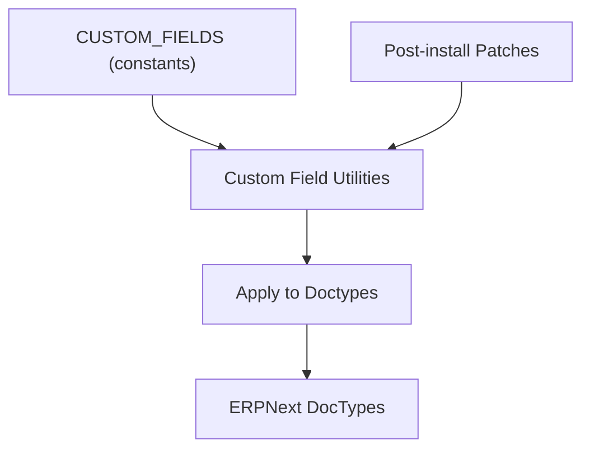
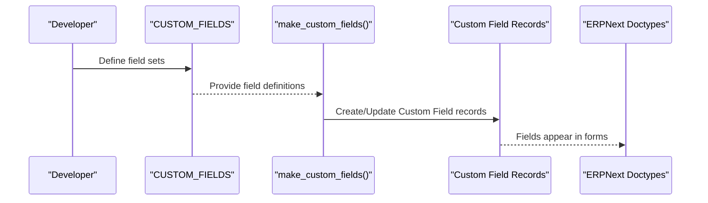
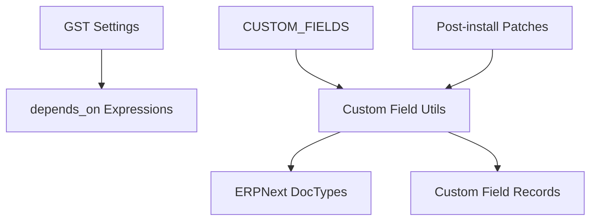

# Custom Fields Management System

<cite>
**Referenced Files in This Document**
- [custom_fields.py](file://india_compliance/gst_india/constants/custom_fields.py)
- [custom_fields.py](file://india_compliance/utils/custom_fields.py)
- [setup_custom_fields_for_gst.py](file://india_compliance/patches/post_install/setup_custom_fields_for_gst.py)
- [custom_fields.py](file://india_compliance/audit_trail/constants/custom_fields.py)
- [custom_fields.py](file://india_compliance/income_tax_india/constants/custom_fields.py)
</cite>

## Table of Contents
1. [Introduction](#introduction)
2. [Project Structure](#project-structure)
3. [Core Components](#core-components)
4. [Architecture Overview](#architecture-overview)
5. [Detailed Component Analysis](#detailed-component-analysis)
6. [Dependency Analysis](#dependency-analysis)
7. [Performance Considerations](#performance-considerations)
8. [Troubleshooting Guide](#troubleshooting-guide)
9. [Conclusion](#conclusion)

## Introduction
This document explains the custom fields management system that extends ERPNext document structures to meet India’s Goods and Services Tax (GST) compliance requirements. It focuses on:
- The CUSTOM_FIELDS dictionary structure and how it maps to ERPNext doctypes
- Field definitions: fieldname, label, fieldtype, insert_after positioning, and dependency conditions
- Party fields system for customer/supplier GSTIN and category management
- Transaction item fields for HSN codes, taxable values, and tax calculations
- Conditional field visibility using depends_on expressions and evaluation logic
- Examples of field inheritance across related doctypes and integration with GST settings
- Field validation rules, fetch_from mechanisms, and read-only configurations
- The relationship between custom fields and government compliance requirements

## Project Structure
The custom fields are centrally defined in a constants module and applied via utilities and migration scripts:
- Central definition: GST-specific custom fields are defined in a single constants file
- Utilities: Helper functions manage creation, toggling, and deletion of custom fields
- Migration: Post-install patches clean up legacy fields and enforce state number formatting

**Diagram sources**
- [custom_fields.py](file://india_compliance/gst_india/constants/custom_fields.py#L50-L1304)
- [custom_fields.py](file://india_compliance/utils/custom_fields.py#L80-L93)
- [setup_custom_fields_for_gst.py](file://india_compliance/patches/post_install/setup_custom_fields_for_gst.py#L6-L30)

**Section sources**
- [custom_fields.py](file://india_compliance/gst_india/constants/custom_fields.py#L50-L1304)
- [custom_fields.py](file://india_compliance/utils/custom_fields.py#L1-L93)
- [setup_custom_fields_for_gst.py](file://india_compliance/patches/post_install/setup_custom_fields_for_gst.py#L1-L30)

## Core Components
- CUSTOM_FIELDS: A centralized dictionary mapping ERPNext doctypes to lists or dictionaries of field definitions. Keys can be:
  - A single doctype string
  - A tuple of doctypes (applies the same fields to multiple doctypes)
  - A dictionary (single field definition)
- Field definition keys:
  - fieldname: Unique identifier for the field
  - label: Display label
  - fieldtype: Control type (Section Break, Column Break, Data, Select, Link, Table, etc.)
  - insert_after: Positioning relative to another field
  - depends_on: Expression controlling visibility
  - mandatory_depends_on: Expression controlling mandatory state
  - read_only/read_only_depends_on: Read-only behavior
  - fetch_from/fetch_if_empty: Auto-populate from linked records
  - options/default/print_hide/collapsible/translatable/no_copy/allow_on_submit: Additional metadata
- Utilities:
  - make_custom_fields: Applies CUSTOM_FIELDS to ERPNext via the standard framework
  - toggle_custom_fields: Shows or hides fields by updating the Custom Field record
  - delete_custom_fields/delete_old_fields: Removes obsolete fields
- Patches:
  - Post-install cleanup of legacy fields and normalization of state numbers

**Section sources**
- [custom_fields.py](file://india_compliance/gst_india/constants/custom_fields.py#L50-L1304)
- [custom_fields.py](file://india_compliance/utils/custom_fields.py#L1-L93)
- [setup_custom_fields_for_gst.py](file://india_compliance/patches/post_install/setup_custom_fields_for_gst.py#L12-L30)

## Architecture Overview
The system applies GST-related custom fields to ERPNext doctypes using a layered approach:
- Define: CUSTOM_FIELDS enumerates all required fields and their attributes
- Transform: Utilities convert the dictionary into ERPNext Custom Field records
- Enforce: Patches ensure backward compatibility and data correctness
- Govern: depends_on and read-only rules align UI behavior with GST regulations

**Diagram sources**
- [custom_fields.py](file://india_compliance/gst_india/constants/custom_fields.py#L50-L1304)
- [custom_fields.py](file://india_compliance/utils/custom_fields.py#L80-L93)

## Detailed Component Analysis

### Party Fields System (Customer/Supplier/Company/Address)
Purpose: Capture GSTIN and GST category consistently across parties and addresses.

Key behaviors:
- Party fields are defined once and reused across multiple doctypes
- Address-level fields capture GSTIN, GST state, and GST category
- Company-level fields include default GST rate and print options
- Validation and defaults ensure compliance-ready data entry

Field highlights:
- GSTIN and category at Address level
- GSTIN and category at Customer/Supplier level (fetched from address)
- Company default GST rate and print options

Integration with GST settings:
- Some fields depend on global settings (e.g., e-commerce operator flags)

Examples of reuse:
- Same party_fields are applied to Company, Customer, and Supplier
- Address-level GSTIN/category are fetched into transaction documents

**Section sources**
- [custom_fields.py](file://india_compliance/gst_india/constants/custom_fields.py#L19-L48)
- [custom_fields.py](file://india_compliance/gst_india/constants/custom_fields.py#L1054-L1121)
- [custom_fields.py](file://india_compliance/gst_india/constants/custom_fields.py#L369-L433)
- [custom_fields.py](file://india_compliance/gst_india/constants/custom_fields.py#L559-L625)
- [custom_fields.py](file://india_compliance/gst_india/constants/custom_fields.py#L436-L507)

### Transaction Item Fields (HSN, Taxable Value, Tax Rates)
Purpose: Support GST reporting and tax calculation at line items.

Highlights:
- HSN/SAC code at item level and inherited by transaction items
- Taxable value computed and shown at line items
- GST rates and amounts (IGST, CGST, SGST, CESS) surfaced for transparency
- GST treatment derived from item tax template

Field inheritance examples:
- Transaction item fields apply across multiple doctypes (e.g., Sales Invoice Item, Purchase Invoice Item, Delivery Note Item)
- Some items derive item tax template and GST treatment automatically

Validation and fetch:
- HSN/SAC fetched from item or item group
- Taxable value is read-only and often no-copy to prevent manual tampering
- GST rates and amounts are read-only and recalculated based on context

**Section sources**
- [custom_fields.py](file://india_compliance/gst_india/constants/custom_fields.py#L691-L728)
- [custom_fields.py](file://india_compliance/gst_india/constants/custom_fields.py#L705-L784)
- [custom_fields.py](file://india_compliance/gst_india/constants/custom_fields.py#L800-L931)
- [custom_fields.py](file://india_compliance/gst_india/constants/custom_fields.py#L1249-L1268)
- [custom_fields.py](file://india_compliance/gst_india/constants/custom_fields.py#L1269-L1277)

### Conditional Field Visibility and Evaluation Logic
Purpose: Align UI visibility with GST applicability and transaction type.

Common patterns:
- depends_on: Controls visibility based on values like GST category, place of supply, and settings flags
- mandatory_depends_on: Makes fields mandatory conditionally
- read_only_depends_on: Prevents editing under certain conditions
- Collapsible sections: Improve form readability for optional GST details

Examples:
- Export-related fields visible only for specific GST categories and places of supply
- e-waybill fields appear based on applicable thresholds and settings
- Reverse charge flag appears for specific categories and doctypes

**Section sources**
- [custom_fields.py](file://india_compliance/gst_india/constants/custom_fields.py#L510-L519)
- [custom_fields.py](file://india_compliance/gst_india/constants/custom_fields.py#L627-L673)
- [custom_fields.py](file://india_compliance/gst_india/constants/custom_fields.py#L1729-L1753)
- [custom_fields.py](file://india_compliance/gst_india/constants/custom_fields.py#L1760-L1768)
- [custom_fields.py](file://india_compliance/gst_india/constants/custom_fields.py#L1374-L1388)

### Field Inheritance Across Related Doctypes
Purpose: Ensure consistent GST data across related documents (e.g., Sales Order -> Delivery Note -> Sales Invoice).

Patterns:
- Address-level GSTIN/category are fetched into Customer/Supplier and transaction documents
- Place of supply is derived from address options and can be edited where appropriate
- Tax category and tax templates propagate to transaction items

Examples:
- Supplier GSTIN and GST category are fetched from supplier address into Purchase documents
- Billing address GSTIN and GST category are fetched into Sales documents
- Place of supply is auto-suggested based on configured options

**Section sources**
- [custom_fields.py](file://india_compliance/gst_india/constants/custom_fields.py#L436-L507)
- [custom_fields.py](file://india_compliance/gst_india/constants/custom_fields.py#L559-L625)
- [custom_fields.py](file://india_compliance/gst_india/constants/custom_fields.py#L1054-L1121)

### Integration with GST Settings
Purpose: Tie UI behavior to configurable GST settings.

Mechanisms:
- depends_on expressions reference gst_settings to enable/disable or display fields
- Defaults and validations can be driven by settings (e.g., default GST rate at Company)

Examples:
- E-commerce fields depend on a setting flag
- HSN validation depends on a setting flag for sales items
- e-waybill fields depend on enable flags and thresholds

**Section sources**
- [custom_fields.py](file://india_compliance/gst_india/constants/custom_fields.py#L535-L550)
- [custom_fields.py](file://india_compliance/gst_india/constants/custom_fields.py#L1259-L1260)
- [custom_fields.py](file://india_compliance/gst_india/constants/custom_fields.py#L639-L642)

### Field Validation Rules, Fetch Mechanisms, and Read-only Configurations
Validation and fetch:
- fetch_from links fields to address/item master data (e.g., GSTIN, GST category, HSN)
- fetch_if_empty controls whether to populate missing values
- allow_on_submit enables editing post-submission for specific fields (e.g., HSN, taxable value)

Read-only and no-copy:
- Many GST fields are read-only to maintain audit trails
- no_copy prevents copying sensitive GST values across documents
- hidden and print_hide control visibility in reports and printed forms

Mandatory conditions:
- mandatory_depends_on enforces required fields based on context (e.g., HSN for sales items when validation is enabled)

**Section sources**
- [custom_fields.py](file://india_compliance/gst_india/constants/custom_fields.py#L696-L701)
- [custom_fields.py](file://india_compliance/gst_india/constants/custom_fields.py#L716-L727)
- [custom_fields.py](file://india_compliance/gst_india/constants/custom_fields.py#L816-L823)
- [custom_fields.py](file://india_compliance/gst_india/constants/custom_fields.py#L1259-L1260)

### Relationship Between Custom Fields and Government Compliance Requirements
Purpose: Ensure ERPNext data structures support statutory reporting and auditability.

Evidence in fields:
- IRN and e-invoice status for Sales Invoice
- e-waybill number/status and transporter/driver info for applicable documents
- ITC classification and eligibility reasons for Purchase Invoice
- GST breakups and tax rates/amounts for transparency
- Place of supply and shipping bill details for exports

These fields directly map to:
- e-Invoice thresholds and statuses
- e-waybill generation triggers and transport details
- GSTR-1, GSTR-3B, and other returns reporting
- Input Tax Credit eligibility and classification

**Section sources**
- [custom_fields.py](file://india_compliance/gst_india/constants/custom_fields.py#L1390-L1417)
- [custom_fields.py](file://india_compliance/gst_india/constants/custom_fields.py#L1729-L1753)
- [custom_fields.py](file://india_compliance/gst_india/constants/custom_fields.py#L978-L1024)
- [custom_fields.py](file://india_compliance/gst_india/constants/custom_fields.py#L825-L931)

### Supporting Modules and Cross-domain Fields
- Audit Trail: Adds a dedicated section in Accounts Settings for audit trail configuration
- Income Tax (India): Adds PAN fields for parties and TDS-related fields with dependencies

These demonstrate how custom fields are extended across domains while maintaining consistent patterns.

**Section sources**
- [custom_fields.py](file://india_compliance/audit_trail/constants/custom_fields.py#L1-L26)
- [custom_fields.py](file://india_compliance/income_tax_india/constants/custom_fields.py#L6-L20)
- [custom_fields.py](file://india_compliance/income_tax_india/constants/custom_fields.py#L33-L52)

## Dependency Analysis
The system relies on:
- ERPNext’s Custom Field framework to persist and render fields
- Utility functions to apply, toggle, and delete fields
- Patch scripts to maintain backward compatibility and data quality
- Global GST settings to drive conditional logic

**Diagram sources**
- [custom_fields.py](file://india_compliance/gst_india/constants/custom_fields.py#L50-L1304)
- [custom_fields.py](file://india_compliance/utils/custom_fields.py#L1-L93)
- [setup_custom_fields_for_gst.py](file://india_compliance/patches/post_install/setup_custom_fields_for_gst.py#L1-L30)

**Section sources**
- [custom_fields.py](file://india_compliance/gst_india/constants/custom_fields.py#L50-L1304)
- [custom_fields.py](file://india_compliance/utils/custom_fields.py#L1-L93)
- [setup_custom_fields_for_gst.py](file://india_compliance/patches/post_install/setup_custom_fields_for_gst.py#L1-L30)

## Performance Considerations
- Use fetch_from judiciously to avoid heavy queries on form load; leverage caching and indexed fields
- Keep depends_on expressions minimal and efficient to reduce client-side evaluation overhead
- Prefer read-only fields for calculated values to avoid unnecessary re-computation
- Batch updates via utilities when applying large sets of fields to minimize database writes

## Troubleshooting Guide
Common issues and resolutions:
- Fields not appearing:
  - Verify CUSTOM_FIELDS entries and ensure make_custom_fields ran
  - Confirm doctype names match ERPNext exactly
- Fields visible unexpectedly:
  - Review depends_on expressions and ensure gst_settings flags are set correctly
- Values not populating:
  - Check fetch_from targets and permissions
  - Confirm linked records (Address, Item) have required data
- Read-only fields editable:
  - Review read_only/read_only_depends_on and ensure correct expressions
- Legacy fields causing conflicts:
  - Run post-install patches to remove obsolete fields

**Section sources**
- [custom_fields.py](file://india_compliance/utils/custom_fields.py#L1-L93)
- [setup_custom_fields_for_gst.py](file://india_compliance/patches/post_install/setup_custom_fields_for_gst.py#L12-L30)

## Conclusion
The custom fields management system provides a structured, configurable, and compliant extension of ERPNext document structures for GST. By centralizing field definitions, enforcing conditional visibility and validation, and integrating with GST settings, it ensures accurate, auditable, and report-ready data across the entire accounting and invoicing lifecycle.