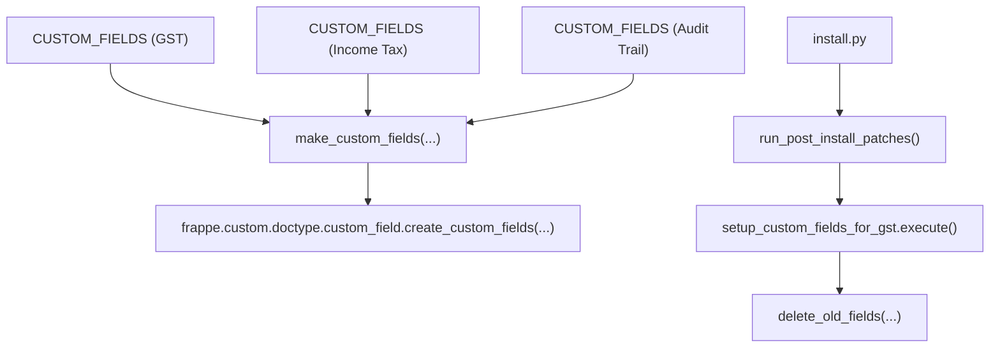
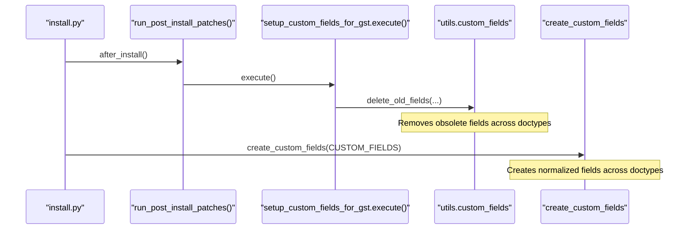
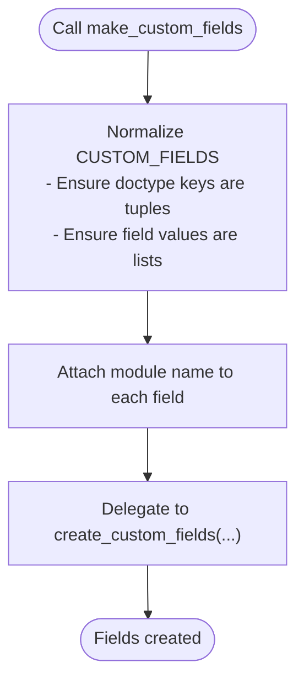
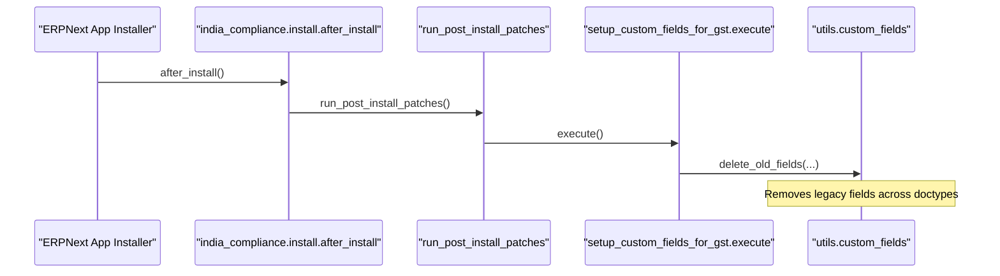
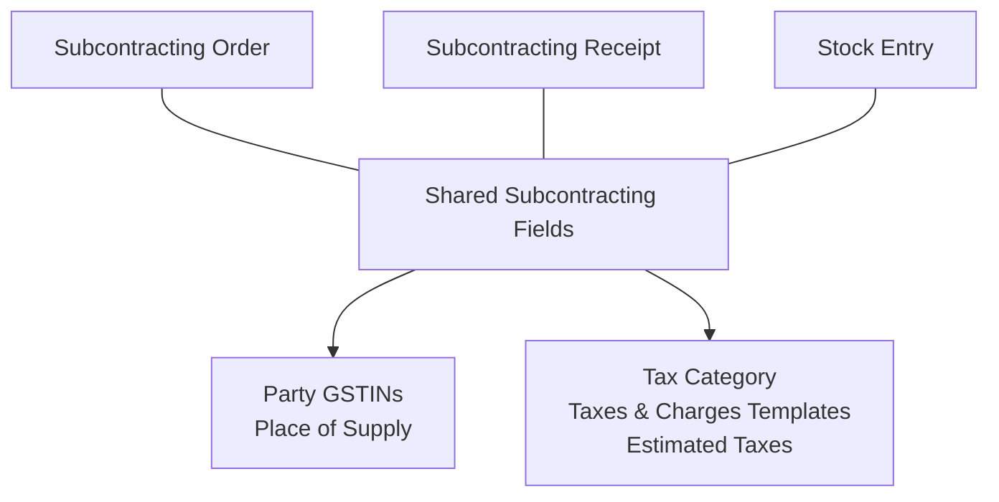
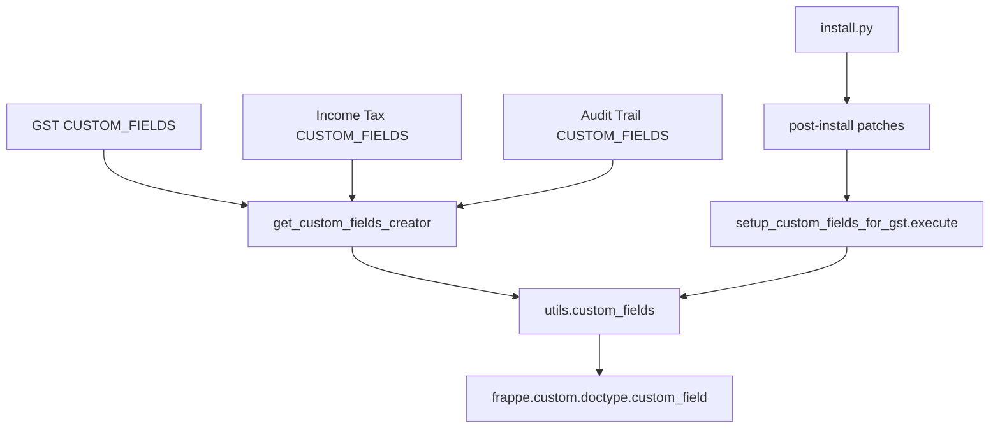

# Field Inheritance Patterns

<cite>
**Referenced Files in This Document**
- [custom_fields.py](file://india_compliance/gst_india/constants/custom_fields.py)
- [custom_fields.py](file://india_compliance/utils/custom_fields.py)
- [setup.py](file://india_compliance/income_tax_india/setup.py)
- [setup.py](file://india_compliance/audit_trail/setup.py)
- [install.py](file://india_compliance/install.py)
- [setup_custom_fields_for_gst.py](file://india_compliance/patches/post_install/setup_custom_fields_for_gst.py)
- [custom_fields.py](file://india_compliance/audit_trail/constants/custom_fields.py)
- [custom_fields.py](file://india_compliance/income_tax_india/constants/custom_fields.py)
</cite>

## Table of Contents
1. [Introduction](#introduction)
2. [Project Structure](#project-structure)
3. [Core Components](#core-components)
4. [Architecture Overview](#architecture-overview)
5. [Detailed Component Analysis](#detailed-component-analysis)
6. [Dependency Analysis](#dependency-analysis)
7. [Performance Considerations](#performance-considerations)
8. [Troubleshooting Guide](#troubleshooting-guide)
9. [Conclusion](#conclusion)

## Introduction
This document explains how field inheritance works across multiple ERPNext doctypes in the India Compliance app. It focuses on:
- Tuple-based field definitions that apply the same fields to multiple doctypes simultaneously
- The CUSTOM_FIELDS dictionary structure and how field groups are applied consistently
- The inheritance hierarchy and field positioning via insert_after
- Utility functions that create, update, show/hide, and delete fields during installation and upgrades
- Strategies for maintaining consistency and resolving conflicts when fields overlap across doctypes

## Project Structure
The field inheritance mechanism is implemented primarily through:
- A centralized CUSTOM_FIELDS dictionary per domain (GST, Income Tax, Audit Trail)
- A shared utility module that wraps ERPNext’s custom field creation and management
- Setup scripts that invoke the creation process during install and upgrade flows

**Diagram sources**
- [custom_fields.py](file://india_compliance/gst_india/constants/custom_fields.py#L50-L185)
- [custom_fields.py](file://india_compliance/utils/custom_fields.py#L80-L88)
- [install.py](file://india_compliance/install.py#L83-L94)
- [setup_custom_fields_for_gst.py](file://india_compliance/patches/post_install/setup_custom_fields_for_gst.py#L6-L29)

**Section sources**
- [custom_fields.py](file://india_compliance/gst_india/constants/custom_fields.py#L50-L185)
- [custom_fields.py](file://india_compliance/utils/custom_fields.py#L1-L93)
- [install.py](file://india_compliance/install.py#L55-L94)

## Core Components
- CUSTOM_FIELDS dictionaries define field groups and their placement across doctypes. They support:
  - Single doctype keys (string)
  - Multiple doctype keys (tuple of strings)
- A shared utility module provides helpers to:
  - Create custom fields
  - Toggle visibility
  - Delete fields
  - Delete old fields by name across doctypes

Key behaviors:
- Field groups are applied to all doctypes listed in a tuple key
- Field ordering is controlled via insert_after, ensuring consistent layout across inherited doctypes
- Utility functions normalize inputs (single doctype or dict vs list) to ensure uniform processing

**Section sources**
- [custom_fields.py](file://india_compliance/gst_india/constants/custom_fields.py#L19-L48)
- [custom_fields.py](file://india_compliance/gst_india/constants/custom_fields.py#L50-L185)
- [custom_fields.py](file://india_compliance/utils/custom_fields.py#L7-L88)

## Architecture Overview
The inheritance pipeline follows a predictable flow:
- Domain-specific setup scripts load CUSTOM_FIELDS
- A factory function binds a module name to the creation utility
- The creation utility normalizes the CUSTOM_FIELDS structure and delegates to ERPNext’s create_custom_fields
- During upgrades, old fields are removed and toggles adjust visibility

**Diagram sources**
- [install.py](file://india_compliance/install.py#L55-L94)
- [setup_custom_fields_for_gst.py](file://india_compliance/patches/post_install/setup_custom_fields_for_gst.py#L6-L29)
- [custom_fields.py](file://india_compliance/utils/custom_fields.py#L80-L88)

## Detailed Component Analysis

### Tuple-Based Field Definitions
- Tuples of doctype names (e.g., ("Customer", "Supplier")) indicate that the same field group applies to both doctypes.
- This pattern ensures consistent field presence and layout across related doctypes.
- Example patterns include:
  - Party fields applied to Company, Customer, Supplier
  - Subcontracting-related fields applied to Subcontracting Order, Subcontracting Receipt, and Stock Entry
  - Item-level tax fields applied across multiple transaction item doctypes

Consistency mechanisms:
- insert_after controls field order, ensuring identical positions across doctypes
- Shared field definitions reduce duplication and risk of divergence

**Section sources**
- [custom_fields.py](file://india_compliance/gst_india/constants/custom_fields.py#L434-L434)
- [custom_fields.py](file://india_compliance/gst_india/constants/custom_fields.py#L92-L135)
- [custom_fields.py](file://india_compliance/gst_india/constants/custom_fields.py#L136-L185)

### CUSTOM_FIELDS Dictionary Structure
- Keys are either:
  - A single doctype string
  - A tuple of doctype strings for inheritance
- Values are lists of field definitions or a single field definition (converted to a list internally)
- Each field definition is a dict containing metadata like fieldname, label, fieldtype, insert_after, fetch_from, etc.

Normalization:
- The utility converts single doctype keys to tuples and single-field dicts to lists to simplify downstream processing.

**Section sources**
- [custom_fields.py](file://india_compliance/gst_india/constants/custom_fields.py#L50-L185)
- [custom_fields.py](file://india_compliance/utils/custom_fields.py#L15-L33)

### Inheritance Hierarchy and Field Positioning
- The inheritance hierarchy is explicit via tuple keys in CUSTOM_FIELDS.
- Field positioning is enforced by insert_after, ensuring that:
  - Related fields appear in the same relative order across doctypes
  - New fields can be appended after existing ones without manual per-doctype updates

Examples:
- Party fields applied to Company, Customer, Supplier maintain consistent positions
- Subcontracting-related fields are positioned similarly across Subcontracting Order, Subcontracting Receipt, and Stock Entry

**Section sources**
- [custom_fields.py](file://india_compliance/gst_india/constants/custom_fields.py#L19-L48)
- [custom_fields.py](file://india_compliance/gst_india/constants/custom_fields.py#L369-L433)
- [custom_fields.py](file://india_compliance/gst_india/constants/custom_fields.py#L92-L185)

### Utility Functions for Field Creation and Updates
- make_custom_fields: Adds module metadata and delegates to ERPNext’s create_custom_fields
- toggle_custom_fields: Sets hidden flag for existing fields across doctypes
- delete_custom_fields: Removes fields by name for given doctypes
- delete_old_fields: Convenience wrapper to delete named fields across multiple doctypes

Processing logic:
- Normalizes inputs (single doctype/tuple, single field/dict/list)
- Iterates over doctypes and fieldnames to perform database updates
- Clears caches per doctype after updates

**Diagram sources**
- [custom_fields.py](file://india_compliance/utils/custom_fields.py#L80-L88)

**Section sources**
- [custom_fields.py](file://india_compliance/utils/custom_fields.py#L7-L88)

### Installation and Upgrade Integration
- after_install in install.py orchestrates setup for Audit Trail, Income Tax, and GST, then runs post-install patches
- run_post_install_patches executes a predefined sequence of patches
- setup_custom_fields_for_gst.execute removes obsolete fields and performs cleanup tasks

**Diagram sources**
- [install.py](file://india_compliance/install.py#L55-L94)
- [setup_custom_fields_for_gst.py](file://india_compliance/patches/post_install/setup_custom_fields_for_gst.py#L6-L29)

**Section sources**
- [install.py](file://india_compliance/install.py#L55-L94)
- [setup_custom_fields_for_gst.py](file://india_compliance/patches/post_install/setup_custom_fields_for_gst.py#L6-L29)

### Complex Inheritance Patterns: Subcontracting-Related Fields
- Fields for subcontracting are grouped and applied to:
  - Subcontracting Order
  - Subcontracting Receipt
  - Stock Entry
- These fields include GSTINs, place of supply, tax category, taxes and charges templates, estimated taxes, and section/column breaks
- The tuple-based approach ensures consistent UX and data capture across all three doctypes

**Diagram sources**
- [custom_fields.py](file://india_compliance/gst_india/constants/custom_fields.py#L92-L185)

**Section sources**
- [custom_fields.py](file://india_compliance/gst_india/constants/custom_fields.py#L92-L185)

### Maintaining Field Consistency and Resolving Conflicts
Strategies used:
- Centralized CUSTOM_FIELDS definitions prevent drift across doctypes
- insert_after enforces consistent ordering
- delete_old_fields removes legacy fields prior to applying new structures
- toggle_custom_fields adjusts visibility without deleting data
- delete_custom_fields removes entire field groups when upgrading schemas

Conflict resolution:
- When two doctypes require different defaults or options for the same fieldname, define separate entries in CUSTOM_FIELDS keyed to each doctype
- For shared fields across multiple doctypes, keep a single tuple-key entry to avoid divergent definitions

**Section sources**
- [custom_fields.py](file://india_compliance/utils/custom_fields.py#L38-L78)
- [setup_custom_fields_for_gst.py](file://india_compliance/patches/post_install/setup_custom_fields_for_gst.py#L12-L29)

## Dependency Analysis
- Domain setup scripts depend on CUSTOM_FIELDS and the custom field utility factory
- The utility depends on ERPNext’s create_custom_fields
- Install and patch flows orchestrate cleanup and creation

**Diagram sources**
- [custom_fields.py](file://india_compliance/income_tax_india/constants/custom_fields.py#L17-L53)
- [custom_fields.py](file://india_compliance/audit_trail/constants/custom_fields.py#L1-L25)
- [custom_fields.py](file://india_compliance/utils/custom_fields.py#L91-L92)
- [install.py](file://india_compliance/install.py#L55-L94)
- [setup_custom_fields_for_gst.py](file://india_compliance/patches/post_install/setup_custom_fields_for_gst.py#L6-L29)

**Section sources**
- [custom_fields.py](file://india_compliance/income_tax_india/constants/custom_fields.py#L1-L54)
- [custom_fields.py](file://india_compliance/audit_trail/constants/custom_fields.py#L1-L25)
- [custom_fields.py](file://india_compliance/utils/custom_fields.py#L1-L93)
- [install.py](file://india_compliance/install.py#L55-L94)
- [setup_custom_fields_for_gst.py](file://india_compliance/patches/post_install/setup_custom_fields_for_gst.py#L6-L29)

## Performance Considerations
- Batch operations: The utility functions operate per doctype and per fieldname, minimizing repeated lookups
- Caching: After updates, caches are cleared per doctype to ensure UI reflects changes immediately
- Idempotency: Many operations check for existence before inserting Property Setters or skipping redundant updates

## Troubleshooting Guide
Common issues and resolutions:
- Fields missing on specific doctypes:
  - Verify the doctype is included in the tuple key for the field group
  - Confirm insert_after positions align with existing fields
- Duplicate or conflicting fields:
  - Remove legacy fields using delete_old_fields before applying new definitions
  - Use delete_custom_fields to remove entire field groups during upgrades
- Visibility problems:
  - Use toggle_custom_fields to show/hide fields based on settings
- Post-install inconsistencies:
  - Re-run post-install patches to clean up and re-apply field definitions

**Section sources**
- [custom_fields.py](file://india_compliance/utils/custom_fields.py#L7-L88)
- [setup_custom_fields_for_gst.py](file://india_compliance/patches/post_install/setup_custom_fields_for_gst.py#L12-L29)

## Conclusion
The India Compliance app leverages a robust, centralized approach to field inheritance:
- Tuple-based CUSTOM_FIELDS keys apply shared field groups across multiple doctypes
- insert_after ensures consistent field positioning
- A unified utility layer handles creation, toggling, and deletion with idempotent operations
- Installation and patch flows integrate cleanup and updates to maintain long-term consistency

This pattern scales across domains (GST, Income Tax, Audit Trail) while keeping maintenance straightforward and reducing the risk of field divergence.