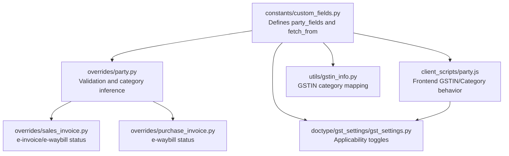
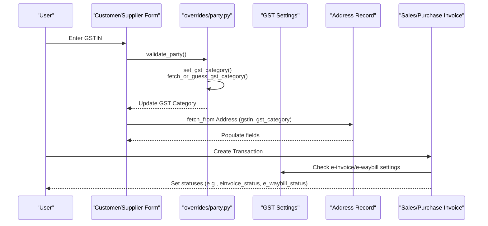
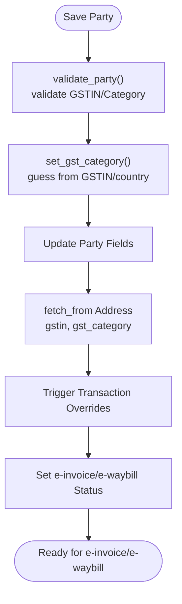
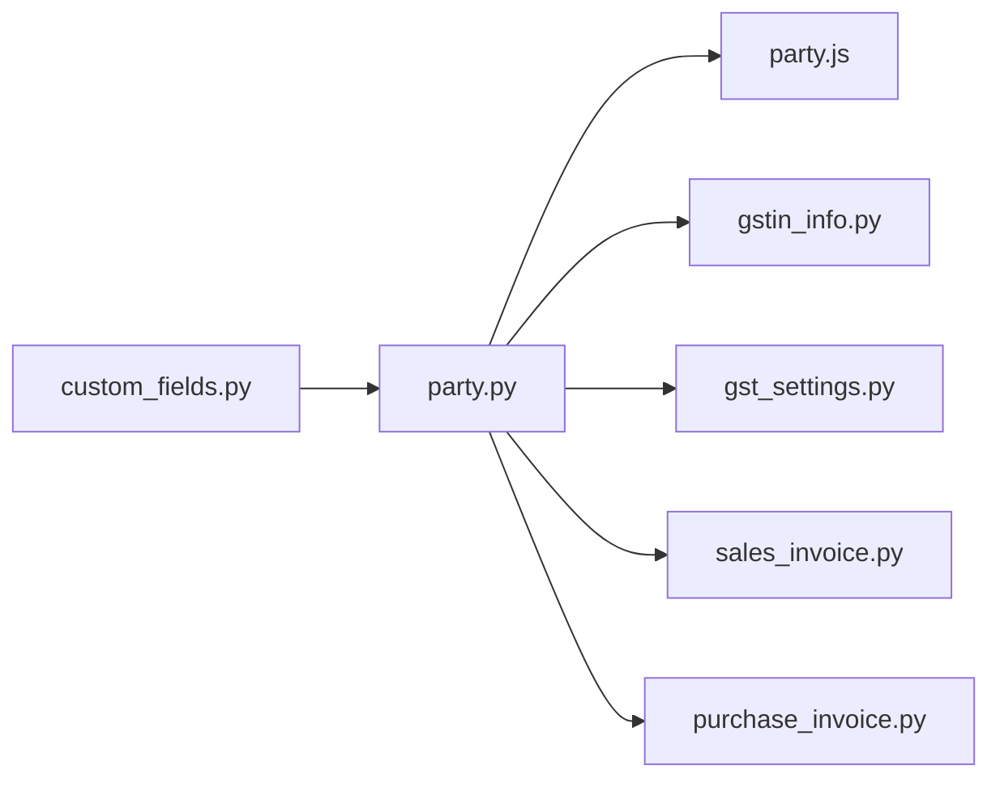

# Party Fields System

<cite>
**Referenced Files in This Document**
- [custom_fields.py](file://india_compliance/gst_india/constants/custom_fields.py)
- [__init__.py](file://india_compliance/gst_india/constants/__init__.py)
- [party.js](file://india_compliance/gst_india/client_scripts/party.js)
- [party.py](file://india_compliance/gst_india/overrides/party.py)
- [gst_settings.py](file://india_compliance/gst_india/doctype/gst_settings/gst_settings.py)
- [gst_settings.json](file://india_compliance/gst_india/doctype/gst_settings/gst_settings.json)
- [sales_invoice.py](file://india_compliance/gst_india/overrides/sales_invoice.py)
- [purchase_invoice.py](file://india_compliance/gst_india/overrides/purchase_invoice.py)
- [e_waybill.py](file://india_compliance/gst_india/utils/e_waybill.py)
- [gstin_info.py](file://india_compliance/gst_india/utils/gstin_info.py)
</cite>

## Table of Contents
1. [Introduction](#introduction)
2. [Project Structure](#project-structure)
3. [Core Components](#core-components)
4. [Architecture Overview](#architecture-overview)
5. [Detailed Component Analysis](#detailed-component-analysis)
6. [Dependency Analysis](#dependency-analysis)
7. [Performance Considerations](#performance-considerations)
8. [Troubleshooting Guide](#troubleshooting-guide)
9. [Conclusion](#conclusion)

## Introduction
This document explains the Party Fields System responsible for managing GSTIN and GST category fields for Customers and Suppliers. It covers the party_fields array structure, field positioning via insert_after and Column Breaks, fetch_from mechanisms linking to Address records, defaults and validation, and how these fields integrate with GST Settings and transaction documents for e-invoice and e-waybill workflows.

## Project Structure
The Party Fields System spans several modules:
- Constants define the base field definitions and options.
- Overrides enforce validation and category inference.
- Client scripts provide frontend behavior for GSTIN/Category updates and autofill.
- GST Settings govern e-invoice/e-waybill applicability and related validations.
- Transaction overrides tie party fields into invoicing workflows.

**Diagram sources**
- [custom_fields.py](file://india_compliance/gst_india/constants/custom_fields.py#L19-L48)
- [party.py](file://india_compliance/gst_india/overrides/party.py#L17-L58)
- [party.js](file://india_compliance/gst_india/client_scripts/party.js#L1-L173)
- [gst_settings.py](file://india_compliance/gst_india/doctype/gst_settings/gst_settings.py#L40-L191)
- [gstin_info.py](file://india_compliance/gst_india/utils/gstin_info.py#L23-L34)
- [sales_invoice.py](file://india_compliance/gst_india/overrides/sales_invoice.py#L70-L83)
- [purchase_invoice.py](file://india_compliance/gst_india/overrides/purchase_invoice.py#L18-L41)

**Section sources**
- [custom_fields.py](file://india_compliance/gst_india/constants/custom_fields.py#L19-L48)
- [party.py](file://india_compliance/gst_india/overrides/party.py#L17-L58)
- [party.js](file://india_compliance/gst_india/client_scripts/party.js#L1-L173)
- [gst_settings.py](file://india_compliance/gst_india/doctype/gst_settings/gst_settings.py#L40-L191)

## Core Components
- party_fields array defines the Tax Details section, GSTIN field, Column Break, and GST Category field for Customer and Supplier forms.
- insert_after positions fields relative to existing UI elements.
- fetch_from links party fields to Address record values for automatic population.
- default_gst_category and state_options provide sensible defaults and options.
- Overrides and client scripts enforce validation, infer GST Category from GSTIN, and manage cross-document updates.

Key elements:
- Tax Details Section Break
- GSTIN Autocomplete field
- Column Break for layout
- GST Category Select field with default and mandatory flag

**Section sources**
- [custom_fields.py](file://india_compliance/gst_india/constants/custom_fields.py#L19-L48)
- [custom_fields.py](file://india_compliance/gst_india/constants/custom_fields.py#L11-L13)
- [__init__.py](file://india_compliance/gst_india/constants/__init__.py#L28-L39)

## Architecture Overview
The Party Fields System integrates with:
- Party creation/editing forms (Customer, Supplier)
- Address records (for fetch_from linkage)
- GST Settings (for e-invoice/e-waybill applicability)
- Transaction documents (Sales/Purchase Invoices) for downstream validations and statuses

**Diagram sources**
- [party.py](file://india_compliance/gst_india/overrides/party.py#L17-L58)
- [party.js](file://india_compliance/gst_india/client_scripts/party.js#L48-L82)
- [custom_fields.py](file://india_compliance/gst_india/constants/custom_fields.py#L436-L481)
- [sales_invoice.py](file://india_compliance/gst_india/overrides/sales_invoice.py#L70-L83)
- [gst_settings.py](file://india_compliance/gst_india/doctype/gst_settings/gst_settings.py#L40-L191)

## Detailed Component Analysis

### Party Fields Array Definition
The party_fields structure organizes the Tax Details UI and fields:
- tax_details_section: Section Break placed after a tab.
- gstin: Autocomplete field for GSTIN/UIN input.
- tax_details_column_break: Column Break positioned after PAN.
- gst_category: Select field with options from GST categories, default set to Unregistered, and marked mandatory.

Positioning uses insert_after to maintain logical grouping with existing fields.

**Section sources**
- [custom_fields.py](file://india_compliance/gst_india/constants/custom_fields.py#L19-L48)
- [custom_fields.py](file://india_compliance/gst_india/constants/custom_fields.py#L11-L13)
- [__init__.py](file://india_compliance/gst_india/constants/__init__.py#L28-L39)

### Layout Organization with insert_after and Column Break
- The Tax Details Section Break is inserted after a named tab.
- GSTIN follows immediately after the section.
- A Column Break separates GSTIN from GST Category for two-column layout.
- The GST Category field is placed after the Column Break and is mandatory.

This ensures clean, readable layouts on Customer and Supplier forms.

**Section sources**
- [custom_fields.py](file://india_compliance/gst_india/constants/custom_fields.py#L24-L47)

### Fetch_from Mechanisms from Address Records
Party fields on Customer and Supplier forms fetch values from Address records:
- Customer GSTIN and Category: fetched from customer_address.gstin and customer_address.gst_category.
- Supplier GSTIN and Category: fetched from supplier_address.gstin and supplier_address.gst_category.
- Place of Supply is derived from options and not fetched directly.

These fetch_from links ensure consistency between party and address data.

**Section sources**
- [custom_fields.py](file://india_compliance/gst_india/constants/custom_fields.py#L559-L596)
- [custom_fields.py](file://india_compliance/gst_india/constants/custom_fields.py#L436-L481)

### Default GST Category and State Options
- default_gst_category is set to Unregistered.
- state_options provides selectable Indian states for related fields.
- GST categories are mapped to standardized categories for e-invoice reporting.

These defaults streamline onboarding and ensure compliance-ready values.

**Section sources**
- [custom_fields.py](file://india_compliance/gst_india/constants/custom_fields.py#L11-L13)
- [__init__.py](file://india_compliance/gst_india/constants/__init__.py#L28-L39)

### Field Inheritance Patterns Across Customer and Supplier
- Both Customer and Supplier inherit the same party_fields structure.
- Transaction documents mirror this pattern by adding supplier/customer GSTIN and Category fields that fetch from the respective address fields.
- Payment Entry also mirrors party fields for Customer-side GST details.

This uniformity reduces configuration overhead and ensures consistent behavior across doctypes.

**Section sources**
- [custom_fields.py](file://india_compliance/gst_india/constants/custom_fields.py#L434-L434)
- [custom_fields.py](file://india_compliance/gst_india/constants/custom_fields.py#L559-L596)
- [custom_fields.py](file://india_compliance/gst_india/constants/custom_fields.py#L1122-L1196)

### Relationship with GST Settings and Transaction Documents
- GST Settings controls whether e-invoice and e-waybill features are enabled and applicable.
- Transaction overrides set statuses (e.g., einvoice_status, e_waybill_status) based on settings and document state.
- Party fields influence applicability and validations for e-invoice and e-waybill generation.

**Diagram sources**
- [party.py](file://india_compliance/gst_india/overrides/party.py#L17-L58)
- [party.js](file://india_compliance/gst_india/client_scripts/party.js#L153-L162)
- [sales_invoice.py](file://india_compliance/gst_india/overrides/sales_invoice.py#L70-L83)
- [gst_settings.py](file://india_compliance/gst_india/doctype/gst_settings/gst_settings.py#L40-L191)

**Section sources**
- [gst_settings.py](file://india_compliance/gst_india/doctype/gst_settings/gst_settings.py#L40-L191)
- [sales_invoice.py](file://india_compliance/gst_india/overrides/sales_invoice.py#L70-L83)
- [purchase_invoice.py](file://india_compliance/gst_india/overrides/purchase_invoice.py#L18-L41)

### Validation Rules and Mandatory Field Requirements
- GSTIN must be validated for length/format; frontend enforces 15-character limit and calls validation utilities.
- PAN is extracted from GSTIN when valid and triggers party type inference.
- GST Category is mandatory for parties and defaults to Unregistered when not provided.
- Transaction-level validations require customer_address for e-invoice applicability and enforce HSN/SAC rules.

**Section sources**
- [party.js](file://india_compliance/gst_india/client_scripts/party.js#L48-L82)
- [party.py](file://india_compliance/gst_india/overrides/party.py#L17-L58)
- [sales_invoice.py](file://india_compliance/gst_india/overrides/sales_invoice.py#L95-L130)

### Impact on e-Invoice and e-Waybill Generation
- e-invoice status is set based on GST Settings and document conditions.
- e-waybill fields and statuses are populated for applicable transactions.
- Transporter details and vehicle info are required for e-waybill generation.

**Section sources**
- [sales_invoice.py](file://india_compliance/gst_india/overrides/sales_invoice.py#L46-L83)
- [purchase_invoice.py](file://india_compliance/gst_india/overrides/purchase_invoice.py#L18-L41)
- [e_waybill.py](file://india_compliance/gst_india/utils/e_waybill.py#L1278-L1310)

## Dependency Analysis
- Party Fields rely on:
  - constants/custom_fields.py for field definitions and options
  - overrides/party.py for validation and category inference
  - client_scripts/party.js for frontend behavior and autofill
  - utils/gstin_info.py for mapping GSTIN categories
  - GST Settings for feature toggles affecting e-invoice/e-waybill

**Diagram sources**
- [custom_fields.py](file://india_compliance/gst_india/constants/custom_fields.py#L19-L48)
- [party.py](file://india_compliance/gst_india/overrides/party.py#L17-L58)
- [party.js](file://india_compliance/gst_india/client_scripts/party.js#L1-L173)
- [gstin_info.py](file://india_compliance/gst_india/utils/gstin_info.py#L23-L34)
- [gst_settings.py](file://india_compliance/gst_india/doctype/gst_settings/gst_settings.py#L40-L191)
- [sales_invoice.py](file://india_compliance/gst_india/overrides/sales_invoice.py#L70-L83)
- [purchase_invoice.py](file://india_compliance/gst_india/overrides/purchase_invoice.py#L18-L41)

**Section sources**
- [custom_fields.py](file://india_compliance/gst_india/constants/custom_fields.py#L19-L48)
- [party.py](file://india_compliance/gst_india/overrides/party.py#L17-L58)
- [party.js](file://india_compliance/gst_india/client_scripts/party.js#L1-L173)
- [gstin_info.py](file://india_compliance/gst_india/utils/gstin_info.py#L23-L34)
- [gst_settings.py](file://india_compliance/gst_india/doctype/gst_settings/gst_settings.py#L40-L191)
- [sales_invoice.py](file://india_compliance/gst_india/overrides/sales_invoice.py#L70-L83)
- [purchase_invoice.py](file://india_compliance/gst_india/overrides/purchase_invoice.py#L18-L41)

## Performance Considerations
- Using fetch_from minimizes redundant data entry and avoids duplication.
- Default values reduce user input errors and speed up onboarding.
- Client-side validation prevents unnecessary server calls for invalid GSTIN lengths.
- GSTIN category inference leverages cached or archived data to avoid repeated API calls.

[No sources needed since this section provides general guidance]

## Troubleshooting Guide
Common issues and resolutions:
- Invalid GSTIN format: Ensure 15-character GSTIN; frontend validation throws an error for invalid lengths.
- Missing GST Category: The field is mandatory; default is Unregistered if not provided.
- Party type mismatch: PAN-derived party type inference requires valid PAN; ensure PAN is correctly set.
- e-invoice/e-waybill not generating: Verify GST Settings toggles and that required fields (customer_address for e-invoice) are present.

**Section sources**
- [party.js](file://india_compliance/gst_india/client_scripts/party.js#L48-L82)
- [party.py](file://india_compliance/gst_india/overrides/party.py#L17-L58)
- [sales_invoice.py](file://india_compliance/gst_india/overrides/sales_invoice.py#L95-L130)
- [gst_settings.json](file://india_compliance/gst_india/doctype/gst_settings/gst_settings.json#L1-L745)

## Conclusion
The Party Fields System provides a robust, configurable foundation for managing GSTIN and GST Category across parties and transactions. Its design emphasizes consistent layout, automatic population via fetch_from, intelligent defaults, and seamless integration with GST Settings for e-invoice and e-waybill workflows. By adhering to the field definitions and validation rules outlined here, organizations can ensure compliance-ready data entry and streamlined tax reporting.