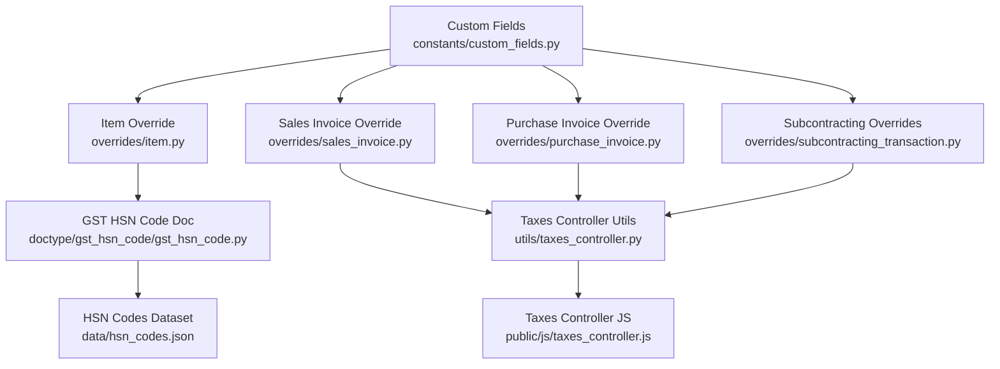
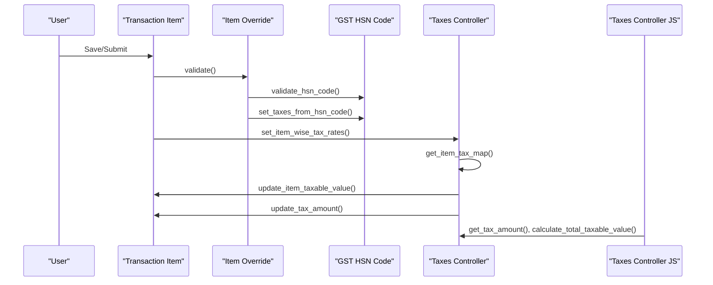
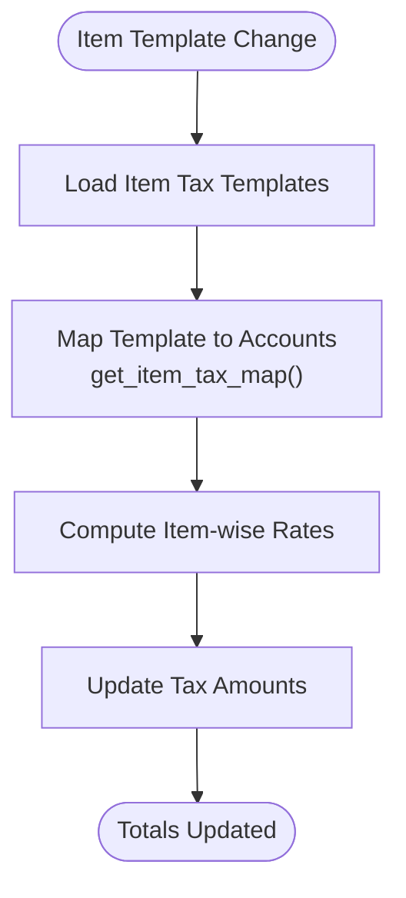
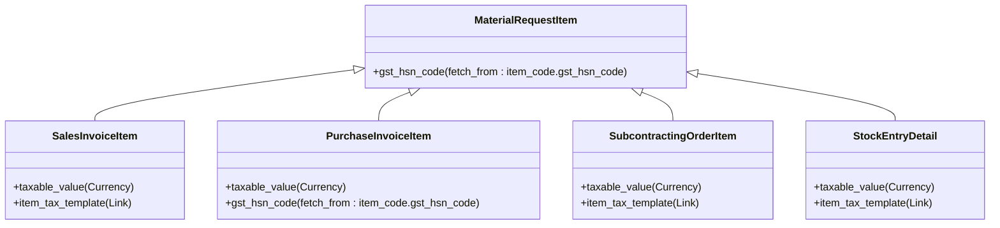
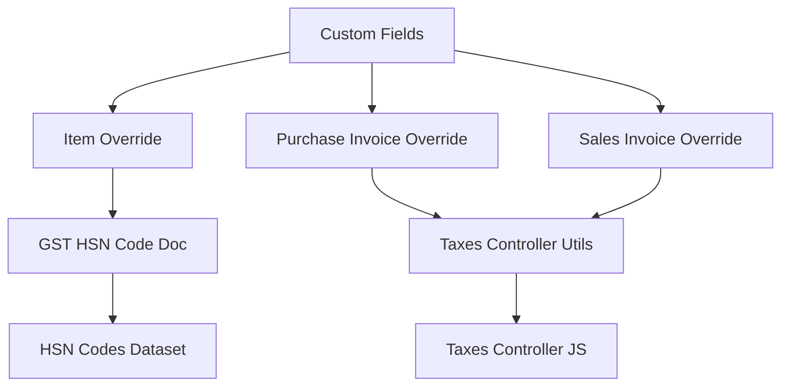

# Transaction Item Fields

<cite>
**Referenced Files in This Document**
- [custom_fields.py](file://india_compliance/gst_india/constants/custom_fields.py)
- [taxes_controller.py](file://india_compliance/gst_india/utils/taxes_controller.py)
- [item_tax_template.py](file://india_compliance/gst_india/overrides/item_tax_template.py)
- [purchase_invoice.py](file://india_compliance/gst_india/overrides/purchase_invoice.py)
- [sales_invoice.py](file://india_compliance/gst_india/overrides/sales_invoice.py)
- [subcontracting_transaction.py](file://india_compliance/gst_india/overrides/subcontracting_transaction.py)
- [item.py](file://india_compliance/gst_india/overrides/item.py)
- [gst_hsn_code.py](file://india_compliance/gst_india/doctype/gst_hsn_code/gst_hsn_code.py)
- [hsn_codes.json](file://india_compliance/gst_india/data/hsn_codes.json)
- [taxes_controller.js](file://india_compliance/public/js/taxes_controller.js)
- [purchase_invoice.js](file://india_compliance/gst_india/client_scripts/purchase_invoice.js)
- [sales_invoice.js](file://india_compliance/gst_india/client_scripts/sales_invoice.js)
- [update_hsn_code.py](file://india_compliance/patches/post_install/update_hsn_code.py)
</cite>

## Table of Contents
1. [Introduction](#introduction)
2. [Project Structure](#project-structure)
3. [Core Components](#core-components)
4. [Architecture Overview](#architecture-overview)
5. [Detailed Component Analysis](#detailed-component-analysis)
6. [Dependency Analysis](#dependency-analysis)
7. [Performance Considerations](#performance-considerations)
8. [Troubleshooting Guide](#troubleshooting-guide)
9. [Conclusion](#conclusion)

## Introduction
This document explains the transaction item fields that handle HSN codes, taxable values, and tax calculations across Indian GST-enabled transactions. It focuses on:
- HSN_CODE_FIELD definition and its integration with item_code.gst_hsn_code via fetch_from
- Taxable value field implementation across Sales Invoice Item, Purchase Invoice Item, Subcontracting items, and Stock Entry
- Field positioning and currency formatting options
- Relationship between item_tax_template and tax calculation processes
- Examples of field inheritance patterns across related doctypes
- Impact on GST reporting requirements
- Data integrity controls such as no_copy and hidden field configurations

## Project Structure
The relevant implementation spans constants, overrides, utilities, and client scripts:
- Constants define custom fields for HSN and taxable value across item doctypes
- Overrides enforce validations and ITC classification
- Utilities compute tax amounts and manage item-wise tax rates
- Client scripts provide UI behaviors and warnings
- HSN code master and JSON dataset support validation and lookup

**Diagram sources**
- [custom_fields.py](file://india_compliance/gst_india/constants/custom_fields.py#L690-L800)
- [item.py](file://india_compliance/gst_india/overrides/item.py#L1-L49)
- [sales_invoice.py](file://india_compliance/gst_india/overrides/sales_invoice.py#L70-L123)
- [purchase_invoice.py](file://india_compliance/gst_india/overrides/purchase_invoice.py#L43-L58)
- [subcontracting_transaction.py](file://india_compliance/gst_india/overrides/subcontracting_transaction.py#L180-L204)
- [taxes_controller.py](file://india_compliance/gst_india/utils/taxes_controller.py#L104-L183)
- [taxes_controller.js](file://india_compliance/public/js/taxes_controller.js#L192-L269)
- [gst_hsn_code.py](file://india_compliance/gst_india/doctype/gst_hsn_code/gst_hsn_code.py#L15-L135)
- [hsn_codes.json](file://india_compliance/gst_india/data/hsn_codes.json#L1-L800)

**Section sources**
- [custom_fields.py](file://india_compliance/gst_india/constants/custom_fields.py#L690-L800)
- [taxes_controller.py](file://india_compliance/gst_india/utils/taxes_controller.py#L104-L183)

## Core Components
- HSN_CODE_FIELD definition and fetch_from integration:
  - HSN field is defined for Material Request Item and inherited by most transaction item doctypes
  - Fetches gst_hsn_code from item_code.gst_hsn_code
  - Enforced for e-invoice and overseas purchase invoices
- Taxable value field:
  - Present on Sales/Purchase/Delivery/Stock/Subcontracting items
  - Currency options bound to company default currency
  - Read-only and marked no_copy to prevent copying across documents
- Item tax template:
  - Linked to items for per-item tax rate resolution
  - Used to compute item-wise tax rates in taxes table
- Tax calculation pipeline:
  - Computes total taxable value per item
  - Builds item-wise tax rates from item_tax_template and tax accounts
  - Aggregates tax amounts and totals

**Section sources**
- [custom_fields.py](file://india_compliance/gst_india/constants/custom_fields.py#L690-L800)
- [taxes_controller.py](file://india_compliance/gst_india/utils/taxes_controller.py#L155-L183)
- [item_tax_template.py](file://india_compliance/gst_india/overrides/item_tax_template.py#L9-L32)

## Architecture Overview
The system integrates HSN and tax fields across item doctypes and computes taxes using item-wise rates derived from item_tax_template and tax accounts.

**Diagram sources**
- [item.py](file://india_compliance/gst_india/overrides/item.py#L8-L49)
- [gst_hsn_code.py](file://india_compliance/gst_india/doctype/gst_hsn_code/gst_hsn_code.py#L15-L135)
- [taxes_controller.py](file://india_compliance/gst_india/utils/taxes_controller.py#L124-L183)
- [taxes_controller.js](file://india_compliance/public/js/taxes_controller.js#L192-L269)

## Detailed Component Analysis

### HSN Code Field Definition and Integration
- HSN_CODE_FIELD is defined in constants and applied to Material Request Item and several other doctypes
- The field uses fetch_from to populate item_code.gst_hsn_code
- Validation ensures HSN length conforms to configured settings; enforced for e-invoice and overseas purchase invoices
- Patch logic normalizes HSN codes and rebuilds search indices

Key behaviors:
- Fetch mechanism: item_code.gst_hsn_code
- Validation: enforced for e-invoice and overseas purchase invoices
- Data integrity: no_copy and hidden attributes prevent unintended propagation

**Section sources**
- [custom_fields.py](file://india_compliance/gst_india/constants/custom_fields.py#L690-L703)
- [sales_invoice.py](file://india_compliance/gst_india/overrides/sales_invoice.py#L118-L122)
- [purchase_invoice.py](file://india_compliance/gst_india/overrides/purchase_invoice.py#L257-L267)
- [item.py](file://india_compliance/gst_india/overrides/item.py#L25-L30)
- [update_hsn_code.py](file://india_compliance/patches/post_install/update_hsn_code.py#L1-L83)

### Taxable Value Field Implementation
- Defined for Sales/Purchase/Delivery/Stock/Subcontracting items
- Currency options bound to Company:company:default_currency
- Read-only and marked no_copy to preserve integrity across copies
- Automatically set from item.amount during tax computation

Field positioning and formatting:
- Inserted after base_net_amount for transaction items
- Options specify company currency for consistent reporting

**Section sources**
- [custom_fields.py](file://india_compliance/gst_india/constants/custom_fields.py#L704-L784)
- [taxes_controller.py](file://india_compliance/gst_india/utils/taxes_controller.py#L155-L157)

### Item Tax Template and Tax Calculation
- item_tax_template is defined for Subcontracting items and Stock Entry
- Taxes controller resolves item-wise tax rates using item_tax_template and tax accounts
- Client-side events trigger updates on item selection, quantity changes, and template changes
- Validation ensures tax rates align with GST rate and account types

**Diagram sources**
- [taxes_controller.py](file://india_compliance/gst_india/utils/taxes_controller.py#L184-L215)
- [taxes_controller.js](file://india_compliance/public/js/taxes_controller.js#L235-L256)

**Section sources**
- [custom_fields.py](file://india_compliance/gst_india/constants/custom_fields.py#L771-L784)
- [taxes_controller.py](file://india_compliance/gst_india/utils/taxes_controller.py#L124-L153)
- [taxes_controller.js](file://india_compliance/public/js/taxes_controller.js#L235-L256)
- [item_tax_template.py](file://india_compliance/gst_india/overrides/item_tax_template.py#L9-L32)

### Field Positioning and Currency Formatting
- HSN field positioned after description for Material Request Item
- Taxable value positioned after base_net_amount for transaction items
- Currency options: Company:company:default_currency for consistency with company currency
- Hidden and print_hide flags applied for internal use

**Section sources**
- [custom_fields.py](file://india_compliance/gst_india/constants/custom_fields.py#L690-L784)

### Relationship Between Item Doctypes and Inheritance Patterns
- HSN field is defined for Material Request Item and inherited by Sales/Purchase/Delivery/Stock/Subcontracting items
- Subcontracting items also include item_tax_template field
- Purchase Invoice sets ITC classification based on gst_category and gst_hsn_code
- Sales Invoice enforces HSN validation for e-invoice eligibility

**Diagram sources**
- [custom_fields.py](file://india_compliance/gst_india/constants/custom_fields.py#L690-L784)

**Section sources**
- [custom_fields.py](file://india_compliance/gst_india/constants/custom_fields.py#L690-L784)
- [purchase_invoice.py](file://india_compliance/gst_india/overrides/purchase_invoice.py#L96-L113)
- [sales_invoice.py](file://india_compliance/gst_india/overrides/sales_invoice.py#L118-L122)

### GST Reporting Impacts and Data Integrity Controls
- HSN validation enforced for e-invoice and overseas purchase invoices
- ITC classification determined by gst_category and gst_hsn_code
- no_copy prevents copying taxable_value across documents, ensuring accurate reporting
- Hidden fields reduce noise in forms while preserving data integrity

**Section sources**
- [sales_invoice.py](file://india_compliance/gst_india/overrides/sales_invoice.py#L118-L122)
- [purchase_invoice.py](file://india_compliance/gst_india/overrides/purchase_invoice.py#L96-L113)
- [custom_fields.py](file://india_compliance/gst_india/constants/custom_fields.py#L704-L784)

## Dependency Analysis
The following diagram shows dependencies among key modules involved in HSN and tax computations:

**Diagram sources**
- [custom_fields.py](file://india_compliance/gst_india/constants/custom_fields.py#L690-L800)
- [item.py](file://india_compliance/gst_india/overrides/item.py#L1-L49)
- [purchase_invoice.py](file://india_compliance/gst_india/overrides/purchase_invoice.py#L43-L58)
- [sales_invoice.py](file://india_compliance/gst_india/overrides/sales_invoice.py#L70-L123)
- [taxes_controller.py](file://india_compliance/gst_india/utils/taxes_controller.py#L104-L183)
- [taxes_controller.js](file://india_compliance/public/js/taxes_controller.js#L192-L269)
- [gst_hsn_code.py](file://india_compliance/gst_india/doctype/gst_hsn_code/gst_hsn_code.py#L15-L135)
- [hsn_codes.json](file://india_compliance/gst_india/data/hsn_codes.json#L1-L800)

**Section sources**
- [custom_fields.py](file://india_compliance/gst_india/constants/custom_fields.py#L690-L800)
- [taxes_controller.py](file://india_compliance/gst_india/utils/taxes_controller.py#L104-L183)

## Performance Considerations
- Bulk operations for HSN code updates and item tax synchronization use bulk_insert to minimize database overhead
- Item-wise tax rate mapping leverages filtered queries on Item Tax Template Details to avoid redundant computations
- Client-side tax computation aggregates per item, reducing server load during interactive edits

[No sources needed since this section provides general guidance]

## Troubleshooting Guide
Common issues and resolutions:
- HSN validation failures for e-invoice or overseas purchase invoices:
  - Ensure gst_hsn_code meets configured length requirements
  - Use patch logic to normalize HSN codes if necessary
- Incorrect tax amounts:
  - Verify item_tax_template alignment with tax accounts
  - Confirm charge_type and rate consistency in taxes table
- ITC classification mismatches:
  - Review gst_category and gst_hsn_code logic in purchase invoice override
- Client-side tax updates not reflecting:
  - Trigger item_tax_template change or qty change events to recalculate

**Section sources**
- [sales_invoice.py](file://india_compliance/gst_india/overrides/sales_invoice.py#L118-L122)
- [purchase_invoice.py](file://india_compliance/gst_india/overrides/purchase_invoice.py#L257-L267)
- [item_tax_template.py](file://india_compliance/gst_india/overrides/item_tax_template.py#L9-L32)
- [taxes_controller.js](file://india_compliance/public/js/taxes_controller.js#L235-L256)

## Conclusion
The transaction item fields for HSN codes, taxable values, and tax calculations are consistently defined across item doctypes with robust validation and inheritance patterns. The integration of item_tax_template with taxes controller enables precise, item-wise tax computation aligned with GST requirements. Data integrity is maintained through no_copy, hidden fields, and strict validation rules tailored for e-invoice and overseas transactions.