# Data Management & Configuration

<cite>
**Referenced Files in This Document**
- [gst_settings.py](file://india_compliance/gst_india/doctype/gst_settings/gst_settings.py)
- [gst_hsn_code.py](file://india_compliance/gst_india/doctype/gst_hsn_code/gst_hsn_code.py)
- [custom_fields.py](file://india_compliance/gst_india/constants/custom_fields.py)
- [item.py](file://india_compliance/gst_india/overrides/item.py)
- [company.py](file://india_compliance/gst_india/overrides/company.py)
- [gstr_1_data.py](file://india_compliance/gst_india/utils/gstr_1/gstr_1_data.py)
- [gstr_1.py](file://india_compliance/gst_india/doctype/gstr_1/gstr_1.py)
- [gstr_3b_report.py](file://india_compliance/gst_india/doctype/gstr_3b_report/gstr_3b_report.py)
- [exporter.py](file://india_compliance/gst_india/utils/exporter.py)
- [gstr_import_log.py](file://india_compliance/gst_india/doctype/gstr_import_log/gstr_import_log.py)
- [gstr.py](file://india_compliance/gst_india/utils/gstr_2/gstr.py)
- [hsn_codes.json](file://india_compliance/gst_india/data/hsn_codes.json)
- [tax_defaults.json](file://india_compliance/gst_india/data/tax_defaults.json)
</cite>

## Table of Contents
1. [Introduction](#introduction)
2. [Project Structure](#project-structure)
3. [Core Components](#core-components)
4. [Architecture Overview](#architecture-overview)
5. [Detailed Component Analysis](#detailed-component-analysis)
6. [Dependency Analysis](#dependency-analysis)
7. [Performance Considerations](#performance-considerations)
8. [Troubleshooting Guide](#troubleshooting-guide)
9. [Conclusion](#conclusion)
10. [Appendices](#appendices)

## Introduction
This document explains the data management and configuration systems for India Compliance’s GST module. It covers:
- Custom field management extending ERPNext document structures for GST compliance
- Static data management for HSN codes and tax defaults
- Dynamic transaction data processing for GSTR-1 and GSTR-3B
- Import/export workflows, including Excel templates and bulk operations
- Validation rules, business logic integration, and error handling
- Configuration of GST settings, company-specific parameters, and regional variations
- Data migration, backup, and integrity checks
- Relationship between static HSN/tax data and dynamic transaction records
- Export capabilities for government filings and compliance reporting

## Project Structure
The GST module is organized around:
- Doctypes for GST configuration and compliance (e.g., GST Settings, GST HSN Code, GSTR-1, GSTR-3B)
- Overrides for standard ERPNext doctypes to enforce GST behavior
- Utilities for data processing, mapping, and exporting
- Static datasets for HSN codes and tax defaults
- Import logging and reconciliation utilities for GSTR-2A/2B

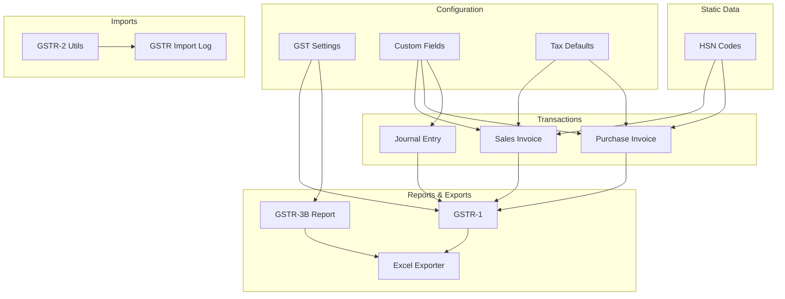

**Diagram sources**
- [gst_settings.py](file://india_compliance/gst_india/doctype/gst_settings/gst_settings.py#L40-L595)
- [custom_fields.py](file://india_compliance/gst_india/constants/custom_fields.py#L1-L800)
- [tax_defaults.json](file://india_compliance/gst_india/data/tax_defaults.json#L1-L800)
- [hsn_codes.json](file://india_compliance/gst_india/data/hsn_codes.json#L1-L800)
- [gstr_1_data.py](file://india_compliance/gst_india/utils/gstr_1/gstr_1_data.py#L64-L677)
- [gstr_1.py](file://india_compliance/gst_india/doctype/gstr_1/gstr_1.py#L29-L509)
- [gstr_3b_report.py](file://india_compliance/gst_india/doctype/gstr_3b_report/gstr_3b_report.py#L41-L800)
- [exporter.py](file://india_compliance/gst_india/utils/exporter.py#L12-L373)
- [gstr_import_log.py](file://india_compliance/gst_india/doctype/gstr_import_log/gstr_import_log.py#L9-L85)
- [gstr.py](file://india_compliance/gst_india/utils/gstr_2/gstr.py#L13-L148)

**Section sources**
- [gst_settings.py](file://india_compliance/gst_india/doctype/gst_settings/gst_settings.py#L40-L595)
- [custom_fields.py](file://india_compliance/gst_india/constants/custom_fields.py#L1-L800)
- [tax_defaults.json](file://india_compliance/gst_india/data/tax_defaults.json#L1-L800)
- [hsn_codes.json](file://india_compliance/gst_india/data/hsn_codes.json#L1-L800)
- [gstr_1_data.py](file://india_compliance/gst_india/utils/gstr_1/gstr_1_data.py#L64-L677)
- [gstr_1.py](file://india_compliance/gst_india/doctype/gstr_1/gstr_1.py#L29-L509)
- [gstr_3b_report.py](file://india_compliance/gst_india/doctype/gstr_3b_report/gstr_3b_report.py#L41-L800)
- [exporter.py](file://india_compliance/gst_india/utils/exporter.py#L12-L373)
- [gstr_import_log.py](file://india_compliance/gst_india/doctype/gstr_import_log/gstr_import_log.py#L9-L85)
- [gstr.py](file://india_compliance/gst_india/utils/gstr_2/gstr.py#L13-L148)

## Core Components
- GST Settings: Central configuration for e-invoice/e-waybill, credentials, filing preferences, and API toggles.
- Custom Fields: Extends ERPNext doctypes with GST fields (e.g., GSTIN, Place of Supply, HSN/SAC, Tax Category).
- GST HSN Code: Manages HSN/SAC codes, validates length/format, and bulk updates Item taxes.
- Tax Defaults: Defines default tax categories/templates and modifies rates per company default GST rate.
- GSTR-1 Engine: Builds item-wise and HSN-wise summaries, applies categorization/business logic, and supports export.
- GSTR-3B Report: Aggregates outward/inward supplies, ITC, and generates JSON/Excel for filing.
- Import Utilities: Maps GSTR-2A/2B APIs to ERPNext inward supplies and logs import progress.
- Exporter: Provides Excel templating and formatting for reports and filings.

**Section sources**
- [gst_settings.py](file://india_compliance/gst_india/doctype/gst_settings/gst_settings.py#L40-L595)
- [custom_fields.py](file://india_compliance/gst_india/constants/custom_fields.py#L19-L800)
- [gst_hsn_code.py](file://india_compliance/gst_india/doctype/gst_hsn_code/gst_hsn_code.py#L15-L135)
- [company.py](file://india_compliance/gst_india/overrides/company.py#L65-L101)
- [gstr_1_data.py](file://india_compliance/gst_india/utils/gstr_1/gstr_1_data.py#L64-L677)
- [gstr_3b_report.py](file://india_compliance/gst_india/doctype/gstr_3b_report/gstr_3b_report.py#L41-L800)
- [gstr.py](file://india_compliance/gst_india/utils/gstr_2/gstr.py#L13-L148)
- [exporter.py](file://india_compliance/gst_india/utils/exporter.py#L12-L373)

## Architecture Overview
The system integrates static data (HSN/tax defaults) with dynamic transaction data (invoices, journals) to produce standardized GSTR reports and exports. Configuration resides in GST Settings and Company fixtures, while runtime logic is enforced via overrides and utilities.

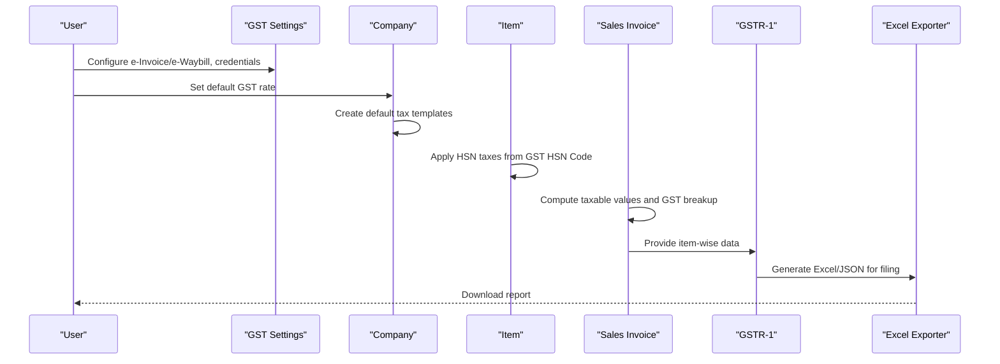

**Diagram sources**
- [gst_settings.py](file://india_compliance/gst_india/doctype/gst_settings/gst_settings.py#L40-L595)
- [company.py](file://india_compliance/gst_india/overrides/company.py#L65-L101)
- [item.py](file://india_compliance/gst_india/overrides/item.py#L8-L50)
- [gstr_1_data.py](file://india_compliance/gst_india/utils/gstr_1/gstr_1_data.py#L437-L551)
- [exporter.py](file://india_compliance/gst_india/utils/exporter.py#L12-L373)

## Detailed Component Analysis

### Custom Field Management System
- Extends ERPNext doctypes with GST fields (Party, Transactions, Items).
- Conditional visibility and dependencies based on settings (e.g., e-Waybill applicability).
- Enforced via toggle_custom_fields on GST Settings updates.

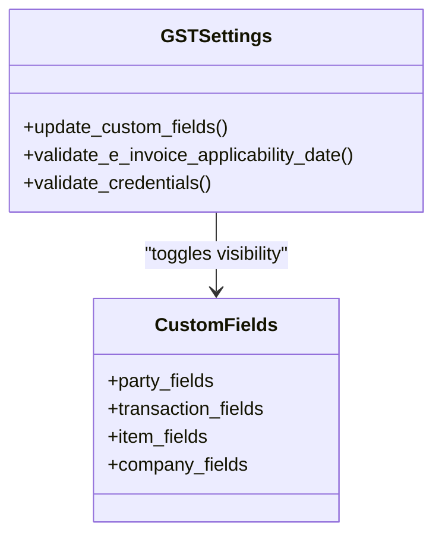

**Diagram sources**
- [gst_settings.py](file://india_compliance/gst_india/doctype/gst_settings/gst_settings.py#L180-L191)
- [custom_fields.py](file://india_compliance/gst_india/constants/custom_fields.py#L19-L800)

**Section sources**
- [gst_settings.py](file://india_compliance/gst_india/doctype/gst_settings/gst_settings.py#L180-L191)
- [custom_fields.py](file://india_compliance/gst_india/constants/custom_fields.py#L19-L800)

### HSN Code Management and Tax Rate Mappings
- Validates HSN length/format based on settings.
- Bulk updates Item taxes from GST HSN Code.
- Integrates with Item master to auto-fill taxes.

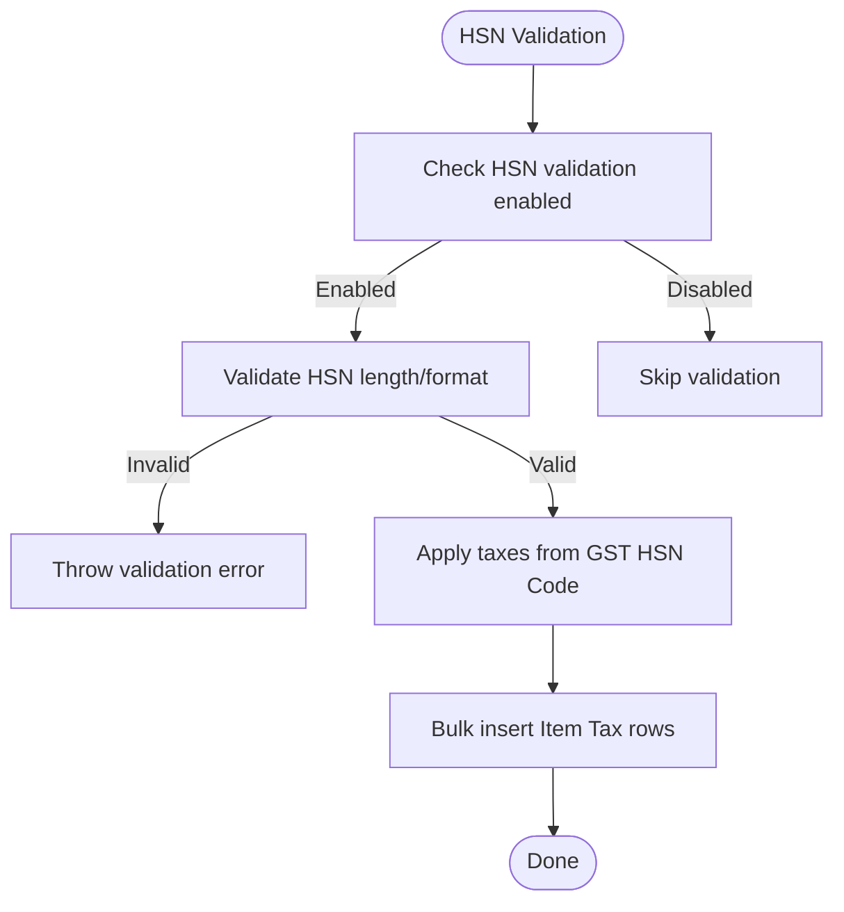

**Diagram sources**
- [gst_hsn_code.py](file://india_compliance/gst_india/doctype/gst_hsn_code/gst_hsn_code.py#L16-L135)
- [item.py](file://india_compliance/gst_india/overrides/item.py#L25-L50)

**Section sources**
- [gst_hsn_code.py](file://india_compliance/gst_india/doctype/gst_hsn_code/gst_hsn_code.py#L16-L135)
- [item.py](file://india_compliance/gst_india/overrides/item.py#L25-L50)
- [hsn_codes.json](file://india_compliance/gst_india/data/hsn_codes.json#L1-L800)

### Tax Defaults and Company-Specific Parameters
- Generates default tax templates based on Company default GST rate.
- Modifies default rates proportionally (CGST/SGST vs IGST).
- Updates GST Settings with company-specific GST accounts.

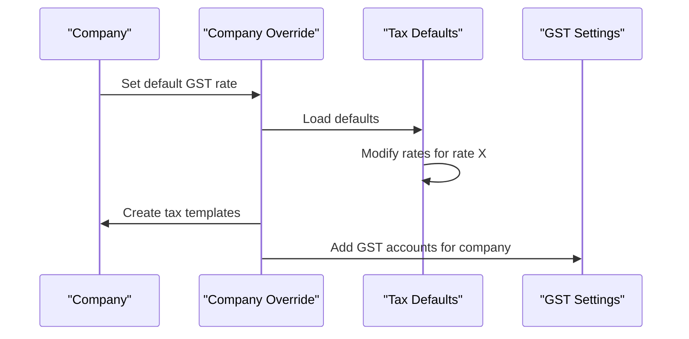

**Diagram sources**
- [company.py](file://india_compliance/gst_india/overrides/company.py#L65-L101)
- [company.py](file://india_compliance/gst_india/overrides/company.py#L104-L180)
- [tax_defaults.json](file://india_compliance/gst_india/data/tax_defaults.json#L1-L800)

**Section sources**
- [company.py](file://india_compliance/gst_india/overrides/company.py#L65-L101)
- [company.py](file://india_compliance/gst_india/overrides/company.py#L104-L180)
- [tax_defaults.json](file://india_compliance/gst_india/data/tax_defaults.json#L1-L800)

### GSTR-1 Data Processing and Validation
- Builds base queries joining invoices/items/taxes.
- Applies categorization (B2B/B2CL/EXP/NIL/CDNR/CDNUR/SUPECOM).
- Processes HSN bifurcation and UOM normalization.
- Supports filtering and overview summaries.

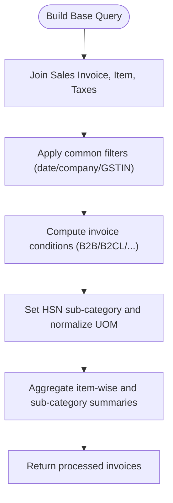

**Diagram sources**
- [gstr_1_data.py](file://india_compliance/gst_india/utils/gstr_1/gstr_1_data.py#L75-L182)
- [gstr_1_data.py](file://india_compliance/gst_india/utils/gstr_1/gstr_1_data.py#L227-L478)
- [gstr_1_data.py](file://india_compliance/gst_india/utils/gstr_1/gstr_1_data.py#L437-L551)

**Section sources**
- [gstr_1_data.py](file://india_compliance/gst_india/utils/gstr_1/gstr_1_data.py#L64-L677)
- [gstr_1.py](file://india_compliance/gst_india/doctype/gstr_1/gstr_1.py#L29-L192)

### GSTR-3B Report Generation and Export
- Aggregates outward supplies, reverse charge supplies, and inward nil/exempt.
- Computes ITC, reversals, and reclaim adjustments.
- Generates JSON and Excel using official template.

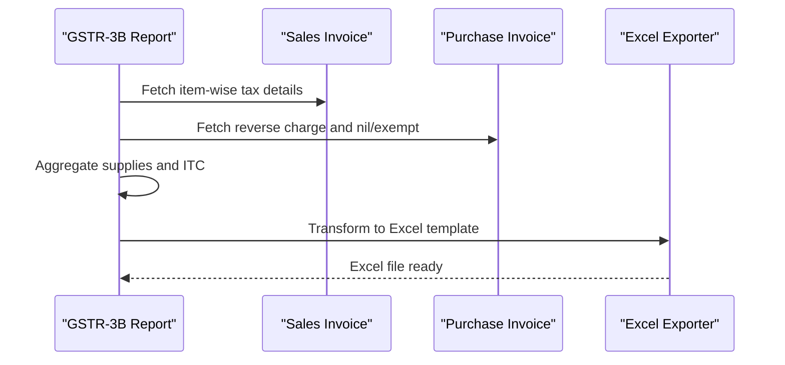

**Diagram sources**
- [gstr_3b_report.py](file://india_compliance/gst_india/doctype/gstr_3b_report/gstr_3b_report.py#L41-L800)
- [exporter.py](file://india_compliance/gst_india/utils/exporter.py#L12-L373)

**Section sources**
- [gstr_3b_report.py](file://india_compliance/gst_india/doctype/gstr_3b_report/gstr_3b_report.py#L41-L800)
- [exporter.py](file://india_compliance/gst_india/utils/exporter.py#L12-L373)

### Import Utilities and Logging (GSTR-2A/2B)
- Maps API keys/values to ERPNext inward supply fields.
- Handles supplier-wise transactions, totals, and progress publishing.
- Logs import attempts and schedules jobs.

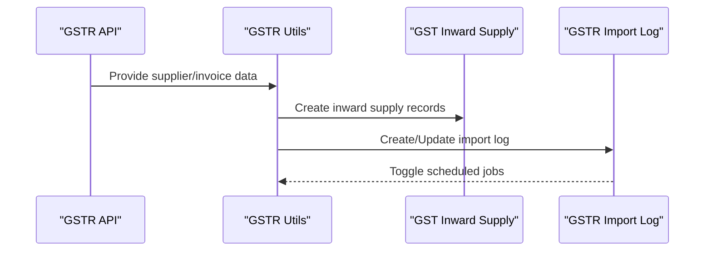

**Diagram sources**
- [gstr.py](file://india_compliance/gst_india/utils/gstr_2/gstr.py#L13-L148)
- [gstr_import_log.py](file://india_compliance/gst_india/doctype/gstr_import_log/gstr_import_log.py#L13-L85)

**Section sources**
- [gstr.py](file://india_compliance/gst_india/utils/gstr_2/gstr.py#L13-L148)
- [gstr_import_log.py](file://india_compliance/gst_india/doctype/gstr_import_log/gstr_import_log.py#L13-L85)

### Data Validation Rules and Business Logic Integration
- Validates HSN code length/format based on settings.
- Enforces e-Invoice applicability dates and company selection.
- Restricts modifications after GSTR-1 filing cutoff.
- Computes GST breakup and taxable values in transactions.

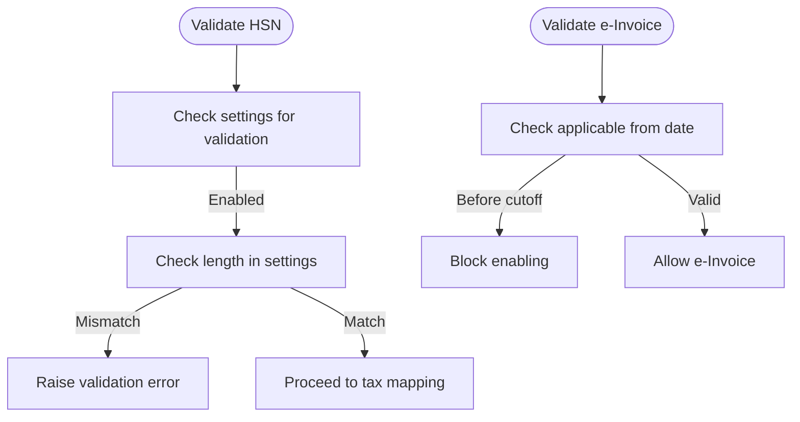

**Diagram sources**
- [gst_hsn_code.py](file://india_compliance/gst_india/doctype/gst_hsn_code/gst_hsn_code.py#L115-L135)
- [gst_settings.py](file://india_compliance/gst_india/doctype/gst_settings/gst_settings.py#L192-L214)
- [gstr_1.py](file://india_compliance/gst_india/doctype/gstr_1/gstr_1.py#L558-L595)

**Section sources**
- [gst_hsn_code.py](file://india_compliance/gst_india/doctype/gst_hsn_code/gst_hsn_code.py#L115-L135)
- [gst_settings.py](file://india_compliance/gst_india/doctype/gst_settings/gst_settings.py#L192-L214)
- [gstr_1.py](file://india_compliance/gst_india/doctype/gstr_1/gstr_1.py#L558-L595)

### Configuration of GST Settings, Companies, and Regional Variations
- Centralizes API credentials, filing preferences, and e-invoice applicability.
- Regional variations handled via Place of Supply options and state codes.
- Company fixtures create default tax templates and GST accounts.

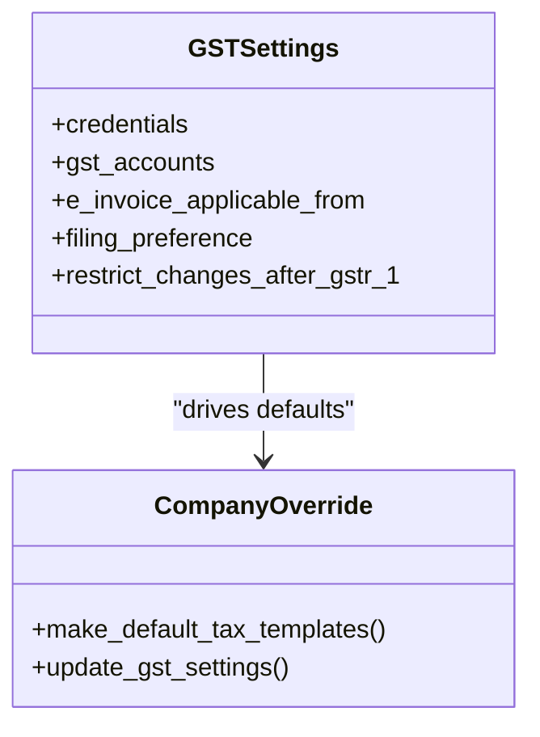

**Diagram sources**
- [gst_settings.py](file://india_compliance/gst_india/doctype/gst_settings/gst_settings.py#L40-L595)
- [company.py](file://india_compliance/gst_india/overrides/company.py#L65-L180)

**Section sources**
- [gst_settings.py](file://india_compliance/gst_india/doctype/gst_settings/gst_settings.py#L40-L595)
- [company.py](file://india_compliance/gst_india/overrides/company.py#L65-L180)

### Data Migration, Backup, and Integrity Checks
- Post-install patches update legacy fields and migrate data.
- Import logs track retries and prevent redownloads until allowed.
- Integrity checks surface missing field invoices in GSTR-3B.

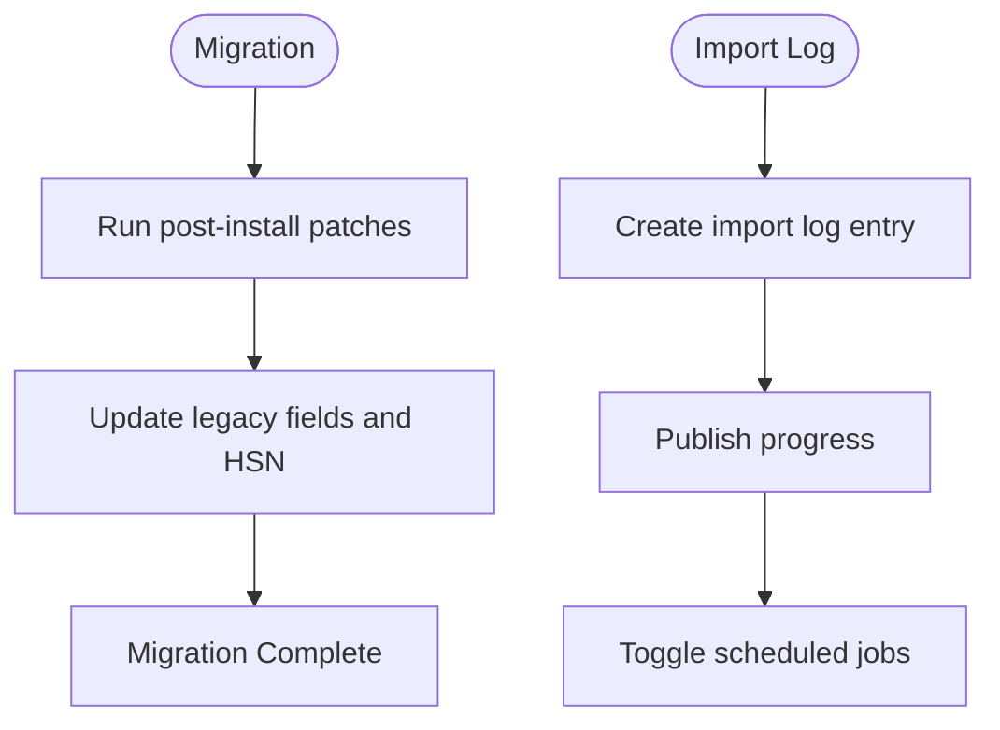

**Diagram sources**
- [gstr_import_log.py](file://india_compliance/gst_india/doctype/gstr_import_log/gstr_import_log.py#L13-L85)
- [gstr_3b_report.py](file://india_compliance/gst_india/doctype/gstr_3b_report/gstr_3b_report.py#L680-L709)

**Section sources**
- [gstr_import_log.py](file://india_compliance/gst_india/doctype/gstr_import_log/gstr_import_log.py#L13-L85)
- [gstr_3b_report.py](file://india_compliance/gst_india/doctype/gstr_3b_report/gstr_3b_report.py#L680-L709)

### Relationship Between Static Data (HSN/Tax) and Dynamic Transactions
- Static HSN codes define tax templates applied to items.
- Dynamic transactions compute taxable values and GST breakup using item taxes and tax templates.
- GSTR-1 and GSTR-3B rely on these computed values for filing.

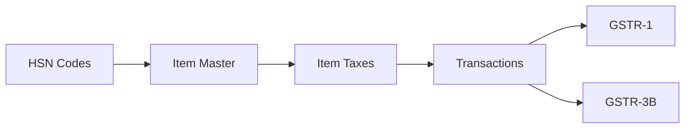

**Diagram sources**
- [gst_hsn_code.py](file://india_compliance/gst_india/doctype/gst_hsn_code/gst_hsn_code.py#L28-L70)
- [item.py](file://india_compliance/gst_india/overrides/item.py#L33-L50)
- [gstr_1_data.py](file://india_compliance/gst_india/utils/gstr_1/gstr_1_data.py#L437-L551)

**Section sources**
- [gst_hsn_code.py](file://india_compliance/gst_india/doctype/gst_hsn_code/gst_hsn_code.py#L28-L70)
- [item.py](file://india_compliance/gst_india/overrides/item.py#L33-L50)
- [gstr_1_data.py](file://india_compliance/gst_india/utils/gstr_1/gstr_1_data.py#L437-L551)

### Export Capabilities for Government Filings and Compliance Reporting
- GSTR-1: Generates item-wise and HSN-wise summaries; supports books-only and portal sync.
- GSTR-3B: Produces JSON and Excel using official template; includes ITC and reversals.
- Excel Exporter: Formats worksheets, merges headers, and applies conditional formatting.

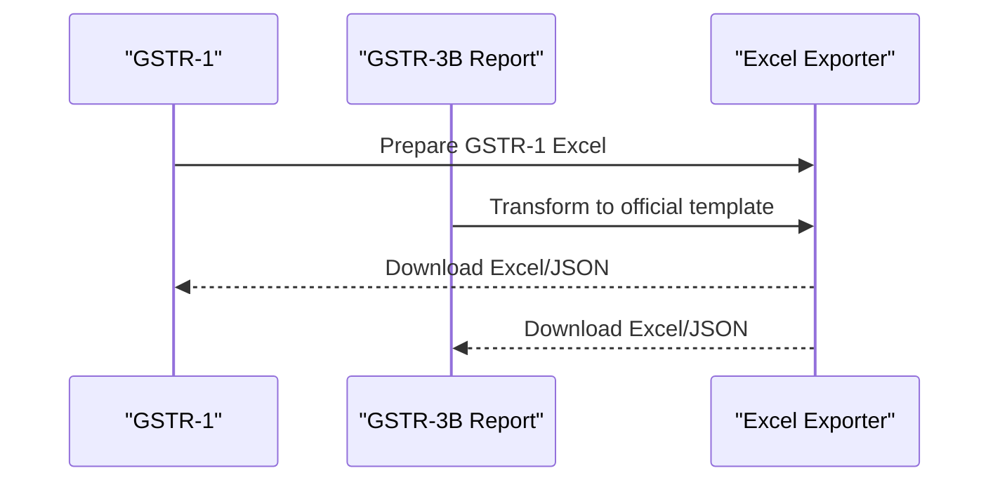

**Diagram sources**
- [gstr_1.py](file://india_compliance/gst_india/doctype/gstr_1/gstr_1.py#L29-L192)
- [gstr_3b_report.py](file://india_compliance/gst_india/doctype/gstr_3b_report/gstr_3b_report.py#L762-L774)
- [exporter.py](file://india_compliance/gst_india/utils/exporter.py#L12-L373)

**Section sources**
- [gstr_1.py](file://india_compliance/gst_india/doctype/gstr_1/gstr_1.py#L29-L192)
- [gstr_3b_report.py](file://india_compliance/gst_india/doctype/gstr_3b_report/gstr_3b_report.py#L762-L774)
- [exporter.py](file://india_compliance/gst_india/utils/exporter.py#L12-L373)

## Dependency Analysis
Key dependencies:
- GST Settings drives custom fields, e-invoice applicability, and API toggles.
- Company fixtures depend on tax defaults and populate GST accounts.
- Item overrides depend on HSN codes and tax templates.
- GSTR-1 and GSTR-3B depend on transaction data and tax computations.

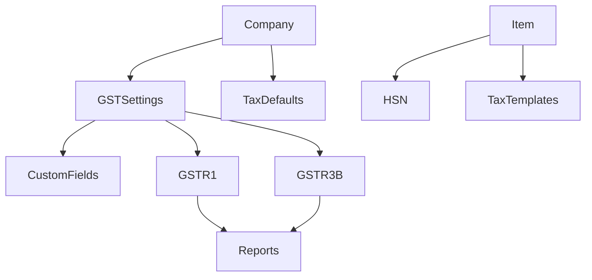

**Diagram sources**
- [gst_settings.py](file://india_compliance/gst_india/doctype/gst_settings/gst_settings.py#L40-L595)
- [custom_fields.py](file://india_compliance/gst_india/constants/custom_fields.py#L19-L800)
- [company.py](file://india_compliance/gst_india/overrides/company.py#L65-L180)
- [gst_hsn_code.py](file://india_compliance/gst_india/doctype/gst_hsn_code/gst_hsn_code.py#L16-L135)
- [gstr_1_data.py](file://india_compliance/gst_india/utils/gstr_1/gstr_1_data.py#L64-L677)
- [gstr_3b_report.py](file://india_compliance/gst_india/doctype/gstr_3b_report/gstr_3b_report.py#L41-L800)

**Section sources**
- [gst_settings.py](file://india_compliance/gst_india/doctype/gst_settings/gst_settings.py#L40-L595)
- [custom_fields.py](file://india_compliance/gst_india/constants/custom_fields.py#L19-L800)
- [company.py](file://india_compliance/gst_india/overrides/company.py#L65-L180)
- [gst_hsn_code.py](file://india_compliance/gst_india/doctype/gst_hsn_code/gst_hsn_code.py#L16-L135)
- [gstr_1_data.py](file://india_compliance/gst_india/utils/gstr_1/gstr_1_data.py#L64-L677)
- [gstr_3b_report.py](file://india_compliance/gst_india/doctype/gstr_3b_report/gstr_3b_report.py#L41-L800)

## Performance Considerations
- Bulk inserts for Item Tax updates reduce database overhead.
- QueryBuilder-based GSTR-1 queries optimize joins and grouping.
- Scheduled jobs for retries and auto-refresh minimize user wait.
- Excel export leverages openpyxl with conditional formatting for large datasets.

[No sources needed since this section provides general guidance]

## Troubleshooting Guide
Common issues and resolutions:
- Missing HSN validation: Ensure HSN validation is enabled and HSN length matches configured lengths.
- E-invoice applicability errors: Verify applicable-from date and company selection.
- Import failures: Check credentials, API limits, and import log entries for retry timing.
- GSTR-1 restrictions: Modifications blocked after GSTR-1 cutoff; adjust settings or roles accordingly.
- ITC mismatches: Review GSTR-3B missing field invoices and reconcile journal entries.

**Section sources**
- [gst_hsn_code.py](file://india_compliance/gst_india/doctype/gst_hsn_code/gst_hsn_code.py#L115-L135)
- [gst_settings.py](file://india_compliance/gst_india/doctype/gst_settings/gst_settings.py#L192-L214)
- [gstr_import_log.py](file://india_compliance/gst_india/doctype/gstr_import_log/gstr_import_log.py#L13-L85)
- [gstr_1.py](file://india_compliance/gst_india/doctype/gstr_1/gstr_1.py#L558-L595)
- [gstr_3b_report.py](file://india_compliance/gst_india/doctype/gstr_3b_report/gstr_3b_report.py#L680-L709)

## Conclusion
The India Compliance GST module integrates static HSN/tax data with dynamic transaction processing to support accurate, compliant filings. Configuration is centralized in GST Settings and Company fixtures, while robust utilities manage imports, exports, validations, and reporting. This architecture ensures scalability, regional flexibility, and adherence to government filing requirements.

[No sources needed since this section summarizes without analyzing specific files]

## Appendices
- Templates and datasets used for exports and defaults are embedded in the repository under data and utils directories.

[No sources needed since this section provides general guidance]