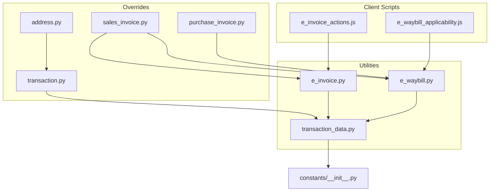
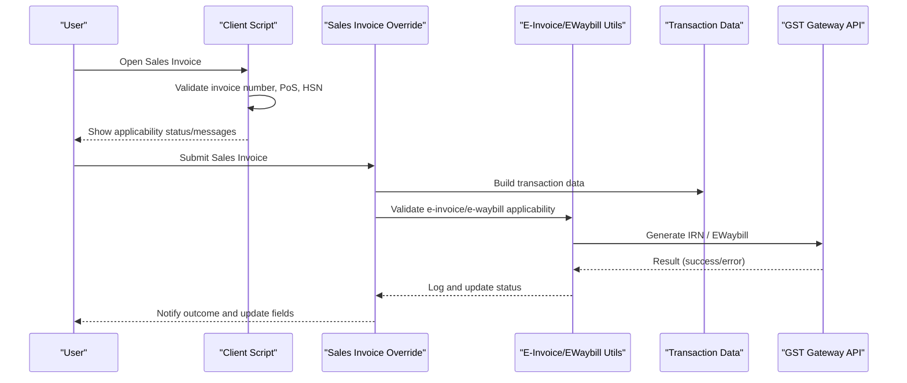
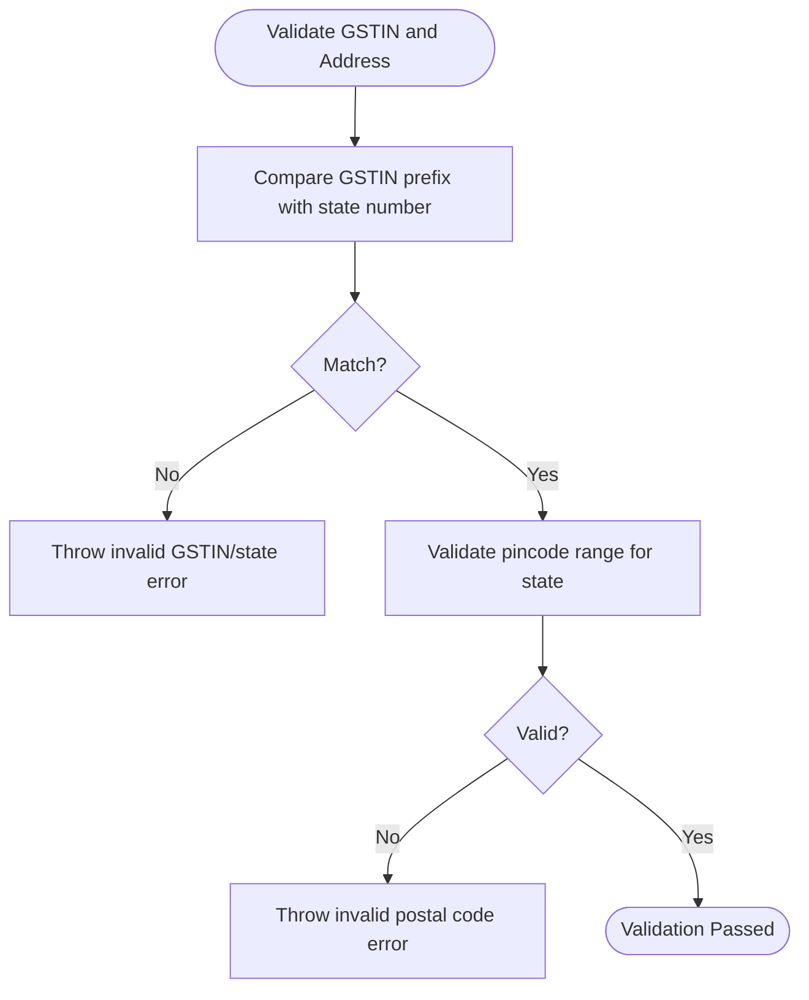
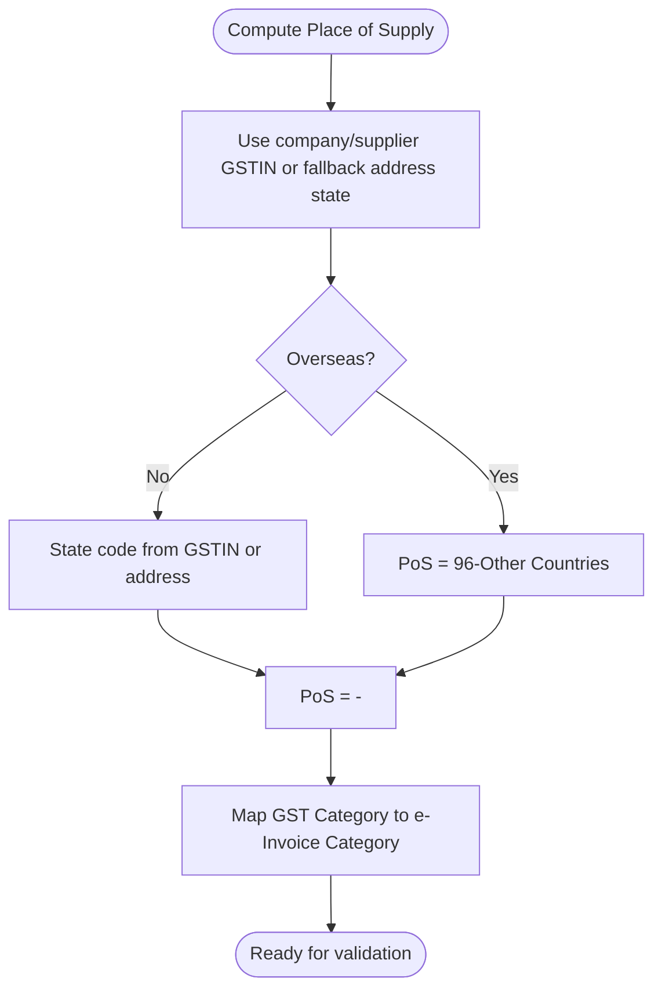
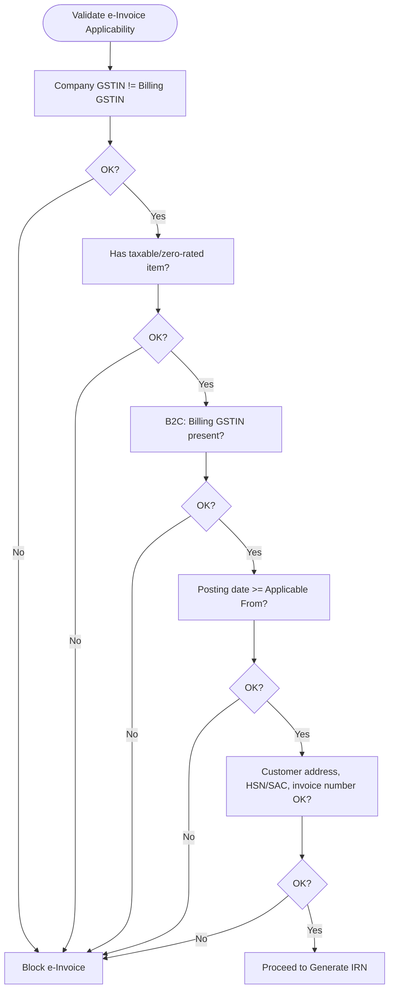
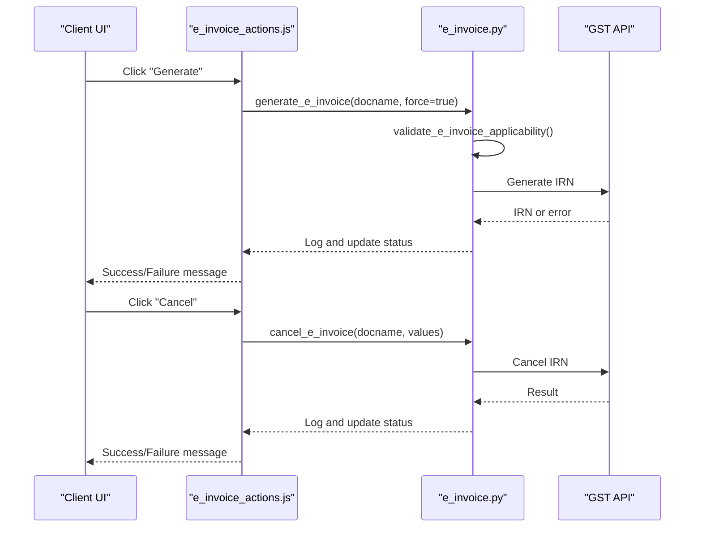
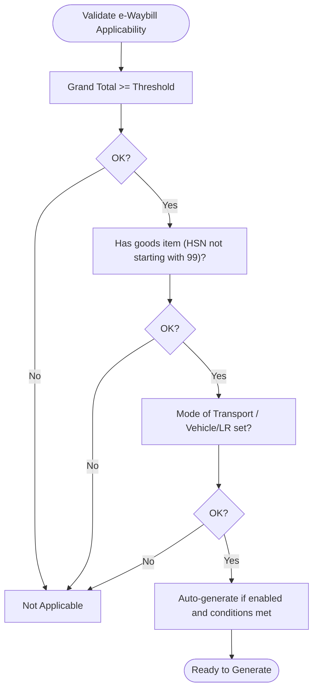
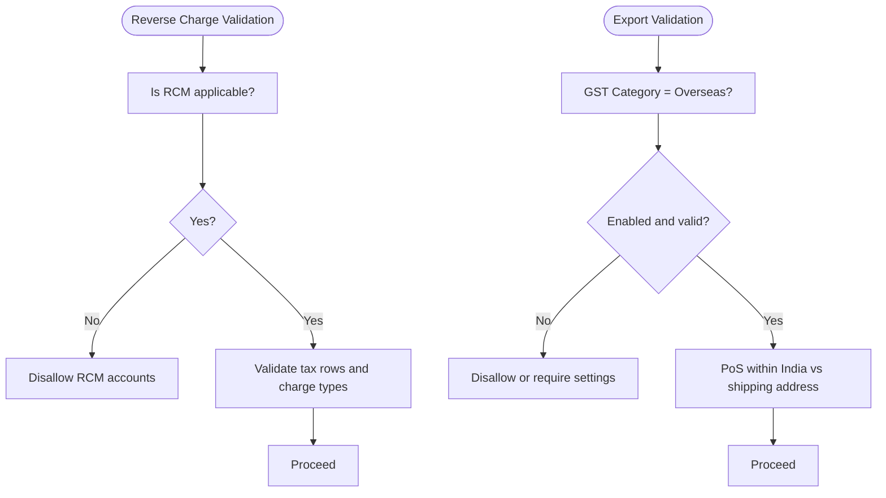
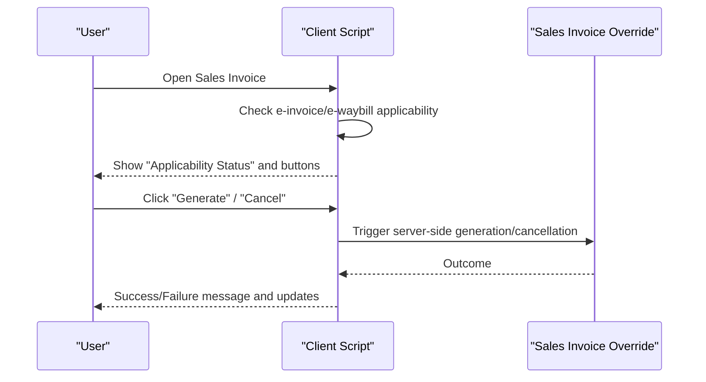
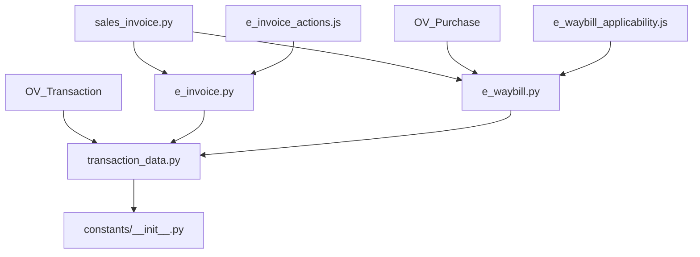

# Data Validation & Business Rules

<cite>
**Referenced Files in This Document**
- [e_invoice.py](file://india_compliance/gst_india/utils/e_invoice.py)
- [e_waybill.py](file://india_compliance/gst_india/utils/e_waybill.py)
- [sales_invoice.py](file://india_compliance/gst_india/overrides/sales_invoice.py)
- [purchase_invoice.py](file://india_compliance/gst_india/overrides/purchase_invoice.py)
- [transaction.py](file://india_compliance/gst_india/overrides/transaction.py)
- [transaction_data.py](file://india_compliance/gst_india/utils/transaction_data.py)
- [e_invoice_actions.js](file://india_compliance/gst_india/client_scripts/e_invoice_actions.js)
- [e_waybill_applicability.js](file://india_compliance/gst_india/client_scripts/e_waybill_applicability.js)
- [address.py](file://india_compliance/gst_india/overrides/address.py)
- [__init__.py](file://india_compliance/gst_india/constants/__init__.py)
- [test_transaction.py](file://india_compliance/gst_india/overrides/test_transaction.py)
</cite>

## Table of Contents
1. [Introduction](#introduction)
2. [Project Structure](#project-structure)
3. [Core Components](#core-components)
4. [Architecture Overview](#architecture-overview)
5. [Detailed Component Analysis](#detailed-component-analysis)
6. [Dependency Analysis](#dependency-analysis)
7. [Performance Considerations](#performance-considerations)
8. [Troubleshooting Guide](#troubleshooting-guide)
9. [Conclusion](#conclusion)

## Introduction
This document explains the data validation rules and business logic enforcement for GST-enabled document creation and modifications in the India Compliance module. It covers:
- GSTIN format validation and state alignment checks
- Place of supply determination and tax category classification
- e-invoice and e-waybill applicability thresholds, amount limits, and compliance requirements
- Validation logic for reverse charge, exports, and interstate supplies
- Error handling, validation messages, and user feedback
- Integration between client-side validation and server-side processing
- Alignment with government compliance requirements

## Project Structure
The validation and business logic span several modules:
- Overrides for Sales/Purchase transactions enforce GST-specific validations during save/submit/cancel
- Utilities generate e-invoices/e-waybills and apply strict validation rules
- Client scripts provide user-facing applicability checks and feedback
- Constants define GST categories, tax types, and state mappings used across validations

**Diagram sources**
- [e_invoice_actions.js](file://india_compliance/gst_india/client_scripts/e_invoice_actions.js#L1-L422)
- [e_waybill_applicability.js](file://india_compliance/gst_india/client_scripts/e_waybill_applicability.js#L1-L141)
- [sales_invoice.py](file://india_compliance/gst_india/overrides/sales_invoice.py#L1-L383)
- [purchase_invoice.py](file://india_compliance/gst_india/overrides/purchase_invoice.py#L1-L268)
- [transaction.py](file://india_compliance/gst_india/overrides/transaction.py#L1-L800)
- [address.py](file://india_compliance/gst_india/overrides/address.py#L96-L105)
- [transaction_data.py](file://india_compliance/gst_india/utils/transaction_data.py#L1-L704)
- [e_invoice.py](file://india_compliance/gst_india/utils/e_invoice.py#L1-L800)
- [e_waybill.py](file://india_compliance/gst_india/utils/e_waybill.py#L1-L800)
- [__init__.py](file://india_compliance/gst_india/constants/__init__.py#L1-L800)

**Section sources**
- [e_invoice_actions.js](file://india_compliance/gst_india/client_scripts/e_invoice_actions.js#L1-L422)
- [e_waybill_applicability.js](file://india_compliance/gst_india/client_scripts/e_waybill_applicability.js#L1-L141)
- [sales_invoice.py](file://india_compliance/gst_india/overrides/sales_invoice.py#L1-L383)
- [purchase_invoice.py](file://india_compliance/gst_india/overrides/purchase_invoice.py#L1-L268)
- [transaction.py](file://india_compliance/gst_india/overrides/transaction.py#L1-L800)
- [address.py](file://india_compliance/gst_india/overrides/address.py#L96-L105)
- [transaction_data.py](file://india_compliance/gst_india/utils/transaction_data.py#L1-L704)
- [e_invoice.py](file://india_compliance/gst_india/utils/e_invoice.py#L1-L800)
- [e_waybill.py](file://india_compliance/gst_india/utils/e_waybill.py#L1-L800)
- [__init__.py](file://india_compliance/gst_india/constants/__init__.py#L1-L800)

## Core Components
- GSTIN validation and state alignment: Ensures GSTIN prefix matches the state number and validates postal code ranges per state.
- Place of supply and tax category classification: Determines PoS based on party and address fields and maps GST categories to e-Invoice classifications.
- e-Invoice applicability: Thresholds, mandatory fields, item taxability, and date gating.
- e-waybill applicability: Thresholds, goods presence, and transport-related validations.
- Reverse charge and export validations: Prevents invalid account usage and enforces export rules.
- Client-server integration: Client-side checks surface applicability and validation messages; server-side processing enforces strict rules and logs outcomes.

**Section sources**
- [address.py](file://india_compliance/gst_india/overrides/address.py#L96-L105)
- [transaction.py](file://india_compliance/gst_india/overrides/transaction.py#L581-L613)
- [__init__.py](file://india_compliance/gst_india/constants/__init__.py#L28-L63)
- [e_invoice.py](file://india_compliance/gst_india/utils/e_invoice.py#L553-L604)
- [e_waybill.py](file://india_compliance/gst_india/utils/e_waybill.py#L166-L332)
- [sales_invoice.py](file://india_compliance/gst_india/overrides/sales_invoice.py#L263-L273)
- [transaction.py](file://india_compliance/gst_india/overrides/transaction.py#L381-L410)

## Architecture Overview
End-to-end flow for e-invoice and e-waybill generation with validation:

**Diagram sources**
- [e_invoice_actions.js](file://india_compliance/gst_india/client_scripts/e_invoice_actions.js#L325-L421)
- [sales_invoice.py](file://india_compliance/gst_india/overrides/sales_invoice.py#L70-L108)
- [e_invoice.py](file://india_compliance/gst_india/utils/e_invoice.py#L119-L267)
- [e_waybill.py](file://india_compliance/gst_india/utils/e_waybill.py#L154-L332)
- [transaction_data.py](file://india_compliance/gst_india/utils/transaction_data.py#L280-L316)

## Detailed Component Analysis

### GSTIN Validation and State Alignment
- GSTIN prefix must match the state number derived from the address.
- Postal code must align with state’s first three-digit pincode range; otherwise, a validation error is raised with a link to master codes.

**Diagram sources**
- [address.py](file://india_compliance/gst_india/overrides/address.py#L96-L105)
- [transaction_data.py](file://india_compliance/gst_india/utils/transaction_data.py#L268-L296)

**Section sources**
- [address.py](file://india_compliance/gst_india/overrides/address.py#L96-L105)
- [transaction_data.py](file://india_compliance/gst_india/utils/transaction_data.py#L268-L296)

### Place of Supply and Tax Category Classification
- Place of supply is determined based on party details and doctype-specific logic.
- GST categories map to e-Invoice classification codes (B2B, B2C, EXP, SEZ, etc.).

**Diagram sources**
- [transaction.py](file://india_compliance/gst_india/overrides/transaction.py#L402-L410)
- [__init__.py](file://india_compliance/gst_india/constants/__init__.py#L28-L39)

**Section sources**
- [transaction.py](file://india_compliance/gst_india/overrides/transaction.py#L402-L410)
- [__init__.py](file://india_compliance/gst_india/constants/__init__.py#L28-L39)

### e-Invoice Validation Rules
- Applicability checks:
  - Company and billing GSTIN must differ
  - At least one taxable or zero-rated item required
  - B2C invoices require billing GSTIN; exports allowed without payment of GST
  - Applicability date gating enforced via settings
- Additional validations:
  - Customer address mandatory for e-Invoice
  - Item count limit enforced
  - HSN/SAC mandatory and length validated
  - Invoice number validation performed

**Diagram sources**
- [e_invoice.py](file://india_compliance/gst_india/utils/e_invoice.py#L553-L604)
- [sales_invoice.py](file://india_compliance/gst_india/overrides/sales_invoice.py#L95-L130)
- [transaction_data.py](file://india_compliance/gst_india/utils/transaction_data.py#L280-L316)

**Section sources**
- [e_invoice.py](file://india_compliance/gst_india/utils/e_invoice.py#L553-L604)
- [sales_invoice.py](file://india_compliance/gst_india/overrides/sales_invoice.py#L95-L130)
- [transaction_data.py](file://india_compliance/gst_india/utils/transaction_data.py#L280-L316)

### e-Invoice Generation and Cancellation Flow

**Diagram sources**
- [e_invoice_actions.js](file://india_compliance/gst_india/client_scripts/e_invoice_actions.js#L42-L99)
- [e_invoice.py](file://india_compliance/gst_india/utils/e_invoice.py#L119-L267)

**Section sources**
- [e_invoice_actions.js](file://india_compliance/gst_india/client_scripts/e_invoice_actions.js#L1-L422)
- [e_invoice.py](file://india_compliance/gst_india/utils/e_invoice.py#L119-L267)

### e-Waybill Validation Rules and Auto-Generation
- Applicability threshold: Grand total must exceed the configured e-waybill threshold.
- Must include at least one non-service item (HSN not starting with 99).
- Transporter details required depending on mode of transport.
- Auto-generation conditions: enabled in settings, not a return/debit note, and applicable.

**Diagram sources**
- [sales_invoice.py](file://india_compliance/gst_india/overrides/sales_invoice.py#L263-L273)
- [transaction_data.py](file://india_compliance/gst_india/utils/transaction_data.py#L192-L231)
- [e_waybill.py](file://india_compliance/gst_india/utils/e_waybill.py#L166-L332)

**Section sources**
- [sales_invoice.py](file://india_compliance/gst_india/overrides/sales_invoice.py#L263-L273)
- [transaction_data.py](file://india_compliance/gst_india/utils/transaction_data.py#L192-L231)
- [e_waybill.py](file://india_compliance/gst_india/utils/e_waybill.py#L166-L332)

### Reverse Charge and Export Validation
- Reverse charge:
  - Prevents using RCM accounts when not applicable
  - Validates tax rows and ensures correct charge types
- Export:
  - Overseas transactions require appropriate settings and shipping address rules
  - Export without payment of GST disallows charging GST in specific validations

**Diagram sources**
- [transaction.py](file://india_compliance/gst_india/overrides/transaction.py#L366-L410)
- [transaction.py](file://india_compliance/gst_india/overrides/transaction.py#L381-L410)
- [test_transaction.py](file://india_compliance/gst_india/overrides/test_transaction.py#L577-L602)

**Section sources**
- [transaction.py](file://india_compliance/gst_india/overrides/transaction.py#L366-L410)
- [transaction.py](file://india_compliance/gst_india/overrides/transaction.py#L381-L410)
- [test_transaction.py](file://india_compliance/gst_india/overrides/test_transaction.py#L577-L602)

### Client-Side Validation and User Feedback
- Client scripts provide applicability checks and messages before submission.
- Buttons appear conditionally based on applicability and status.
- Dialogs guide users through manual updates for IRN/e-Waybill and cancellation reasons.

**Diagram sources**
- [e_invoice_actions.js](file://india_compliance/gst_india/client_scripts/e_invoice_actions.js#L1-L154)
- [e_waybill_applicability.js](file://india_compliance/gst_india/client_scripts/e_waybill_applicability.js#L1-L141)
- [sales_invoice.py](file://india_compliance/gst_india/overrides/sales_invoice.py#L70-L108)

**Section sources**
- [e_invoice_actions.js](file://india_compliance/gst_india/client_scripts/e_invoice_actions.js#L1-L154)
- [e_waybill_applicability.js](file://india_compliance/gst_india/client_scripts/e_waybill_applicability.js#L1-L141)
- [sales_invoice.py](file://india_compliance/gst_india/overrides/sales_invoice.py#L70-L108)

## Dependency Analysis
Key dependencies and relationships:
- Overrides depend on transaction data utilities for building transaction payloads and validating fields.
- e-Invoice and e-Waybill utilities depend on constants for GST categories, tax types, and state mappings.
- Client scripts trigger server-side utilities and display user feedback.

**Diagram sources**
- [sales_invoice.py](file://india_compliance/gst_india/overrides/sales_invoice.py#L1-L383)
- [purchase_invoice.py](file://india_compliance/gst_india/overrides/purchase_invoice.py#L1-L268)
- [transaction.py](file://india_compliance/gst_india/overrides/transaction.py#L1-L800)
- [transaction_data.py](file://india_compliance/gst_india/utils/transaction_data.py#L1-L704)
- [e_invoice.py](file://india_compliance/gst_india/utils/e_invoice.py#L1-L800)
- [e_waybill.py](file://india_compliance/gst_india/utils/e_waybill.py#L1-L800)
- [__init__.py](file://india_compliance/gst_india/constants/__init__.py#L1-L800)
- [e_invoice_actions.js](file://india_compliance/gst_india/client_scripts/e_invoice_actions.js#L1-L422)
- [e_waybill_applicability.js](file://india_compliance/gst_india/client_scripts/e_waybill_applicability.js#L1-L141)

**Section sources**
- [sales_invoice.py](file://india_compliance/gst_india/overrides/sales_invoice.py#L1-L383)
- [purchase_invoice.py](file://india_compliance/gst_india/overrides/purchase_invoice.py#L1-L268)
- [transaction.py](file://india_compliance/gst_india/overrides/transaction.py#L1-L800)
- [transaction_data.py](file://india_compliance/gst_india/utils/transaction_data.py#L1-L704)
- [e_invoice.py](file://india_compliance/gst_india/utils/e_invoice.py#L1-L800)
- [e_waybill.py](file://india_compliance/gst_india/utils/e_waybill.py#L1-L800)
- [__init__.py](file://india_compliance/gst_india/constants/__init__.py#L1-L800)
- [e_invoice_actions.js](file://india_compliance/gst_india/client_scripts/e_invoice_actions.js#L1-L422)
- [e_waybill_applicability.js](file://india_compliance/gst_india/client_scripts/e_waybill_applicability.js#L1-L141)

## Performance Considerations
- Batch operations for e-invoice/e-waybill generation use job queues with timeouts proportional to document counts.
- Validation functions short-circuit on failure to minimize unnecessary processing.
- Logging and status updates are asynchronous to avoid blocking UI.

[No sources needed since this section provides general guidance]

## Troubleshooting Guide
Common validation failures and resolutions:
- Duplicate IRN with mismatched buyer GSTIN or invoice amount:
  - System compares previous IRN details and throws a structured error with corrective steps.
- Invalid GSTIN or inactive status:
  - System syncs GSTIN status and retries generation if status is active.
- Item-level HSN/SAC errors:
  - Missing or invalid lengths trigger targeted messages; fix per valid lengths and re-save.
- Place of supply or overseas category mismatch:
  - Ensure shipping address and category align with rules; update address or category accordingly.
- Reverse charge misuse:
  - Remove RCM accounts when not applicable; ensure correct charge types for cess accounts.
- e-Waybill transport details:
  - Set vehicle/LR details as required by mode of transport; ensure distance constraints.

Resolution procedures:
- Fix validation messages indicated by the system and re-run validation.
- For duplicate IRN, follow corrective steps to generate a new invoice or reconcile IRN details.
- For API errors, review GST portal status and retry after corrections.

**Section sources**
- [e_invoice.py](file://india_compliance/gst_india/utils/e_invoice.py#L270-L375)
- [e_invoice.py](file://india_compliance/gst_india/utils/e_invoice.py#L166-L191)
- [transaction_data.py](file://india_compliance/gst_india/utils/transaction_data.py#L689-L704)
- [transaction.py](file://india_compliance/gst_india/overrides/transaction.py#L691-L747)
- [e_waybill.py](file://india_compliance/gst_india/utils/e_waybill.py#L203-L232)

## Conclusion
The India Compliance module enforces robust GST validation and business rules across document lifecycle events. Client-side applicability checks improve user experience, while server-side utilities ensure strict compliance with e-Invoice/e-Waybill requirements and government mandates. Clear error messaging and logging facilitate troubleshooting and maintain audit trails.