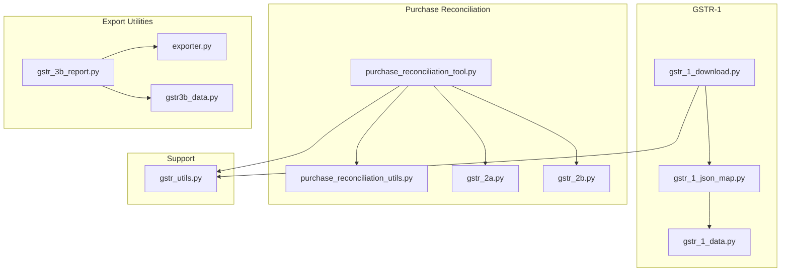
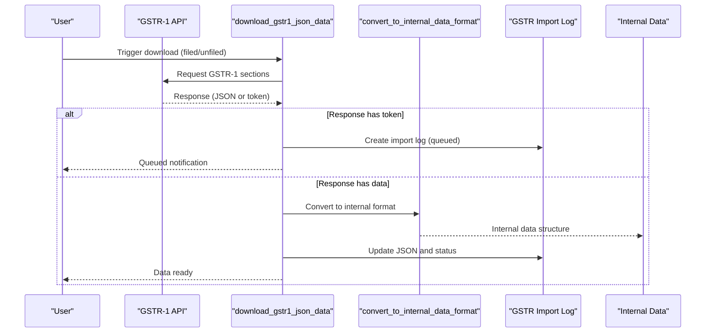
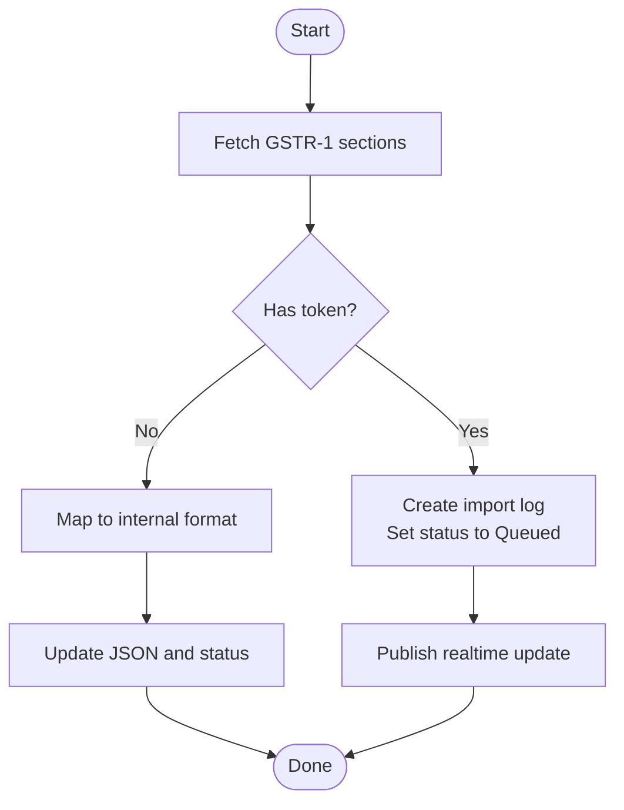
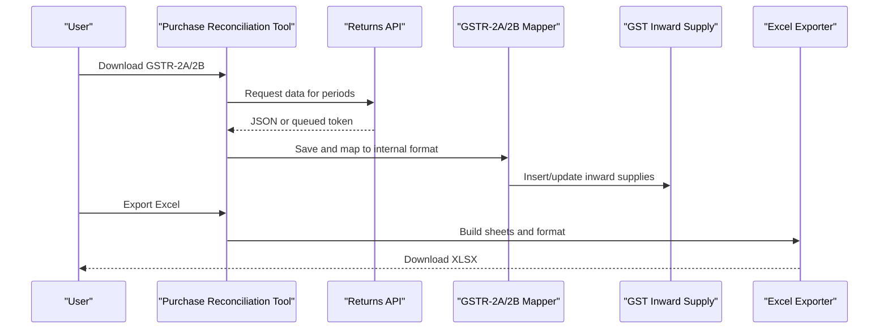
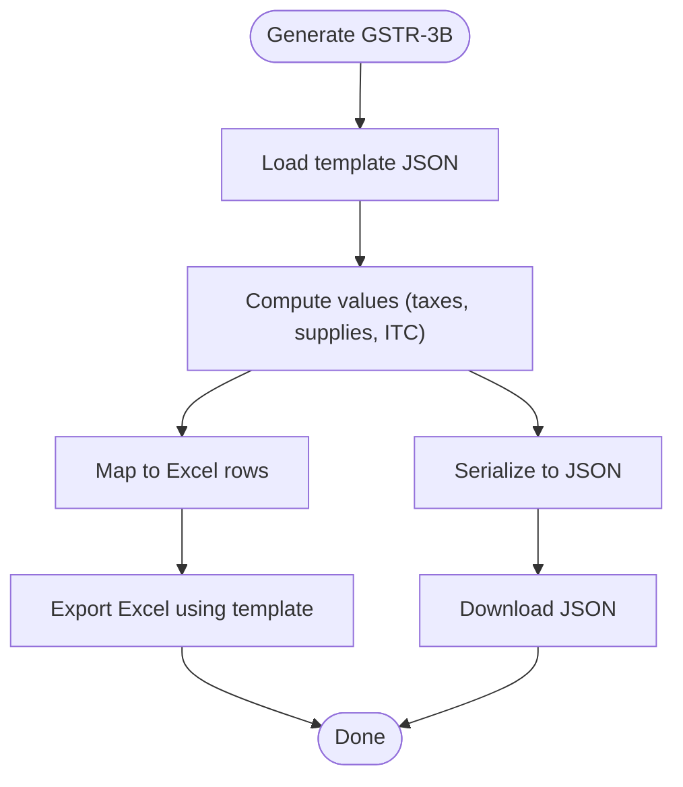
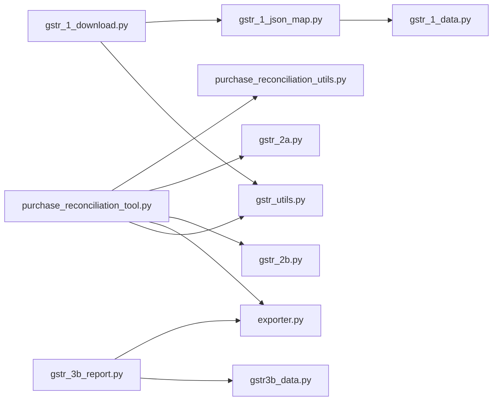

# Import & Export Operations

<cite>
**Referenced Files in This Document**
- [gstr_1_data.py](file://india_compliance/gst_india/utils/gstr_1/gstr_1_data.py)
- [gstr_1_download.py](file://india_compliance/gst_india/utils/gstr_1/gstr_1_download.py)
- [gstr_1_json_map.py](file://india_compliance/gst_india/utils/gstr_1/gstr_1_json_map.py)
- [purchase_reconciliation_tool.py](file://india_compliance/gst_india/doctype/purchase_reconciliation_tool/purchase_reconciliation_tool.py)
- [purchase_reconciliation_utils.py](file://india_compliance/gst_india/doctype/purchase_reconciliation_tool/purchase_reconciliation_utils.py)
- [gstr_2a.py](file://india_compliance/gst_india/utils/gstr_2/gstr_2a.py)
- [gstr_2b.py](file://india_compliance/gst_india/utils/gstr_2/gstr_2b.py)
- [exporter.py](file://india_compliance/gst_india/utils/exporter.py)
- [gstr_3b_report.py](file://india_compliance/gst_india/doctype/gstr_3b_report/gstr_3b_report.py)
- [gstr3b_data.py](file://india_compliance/gst_india/utils/gstr3b/gstr3b_data.py)
- [gstr_utils.py](file://india_compliance/gst_india/utils/gstr_utils.py)
</cite>

## Table of Contents
1. [Introduction](#introduction)
2. [Project Structure](#project-structure)
3. [Core Components](#core-components)
4. [Architecture Overview](#architecture-overview)
5. [Detailed Component Analysis](#detailed-component-analysis)
6. [Dependency Analysis](#dependency-analysis)
7. [Performance Considerations](#performance-considerations)
8. [Troubleshooting Guide](#troubleshooting-guide)
9. [Conclusion](#conclusion)
10. [Appendices](#appendices)

## Introduction
This document explains import and export operations for GST compliance within the application, focusing on:
- GSTR-1 import/export via government APIs and internal data mapping
- Excel templates for GSTR-1 and GSTR-3B data import/export
- Purchase reconciliation import from GSTR-2A/2B and supplier invoices
- Data validation rules, column mappings, and error handling during bulk operations
- Export functionality for government filings (JSON and Excel)
- Data transformation processes, currency handling, and tax calculation validation
- Examples of bulk operations, error recovery, and audit trails

## Project Structure
The import/export functionality spans several modules:
- GSTR-1 import/download and JSON-to-internal mapping
- Purchase reconciliation tool for GSTR-2A/2B and supplier invoices
- Export utilities for Excel and JSON
- GSTR-3B report generation and export

**Diagram sources**
- [gstr_1_download.py](file://india_compliance/gst_india/utils/gstr_1/gstr_1_download.py#L30-L93)
- [gstr_1_json_map.py](file://india_compliance/gst_india/utils/gstr_1/gstr_1_json_map.py#L43-L125)
- [gstr_1_data.py](file://india_compliance/gst_india/utils/gstr_1/gstr_1_data.py#L64-L163)
- [purchase_reconciliation_tool.py](file://india_compliance/gst_india/doctype/purchase_reconciliation_tool/purchase_reconciliation_tool.py#L96-L124)
- [purchase_reconciliation_utils.py](file://india_compliance/gst_india/doctype/purchase_reconciliation_tool/purchase_reconciliation_utils.py#L9-L43)
- [gstr_2a.py](file://india_compliance/gst_india/utils/gstr_2/gstr_2a.py#L15-L159)
- [gstr_2b.py](file://india_compliance/gst_india/utils/gstr_2/gstr_2b.py#L7-L86)
- [exporter.py](file://india_compliance/gst_india/utils/exporter.py#L12-L82)
- [gstr_3b_report.py](file://india_compliance/gst_india/doctype/gstr_3b_report/gstr_3b_report.py#L41-L115)
- [gstr3b_data.py](file://india_compliance/gst_india/utils/gstr3b/gstr3b_data.py#L132-L304)
- [gstr_utils.py](file://india_compliance/gst_india/utils/gstr_utils.py#L55-L128)

**Section sources**
- [gstr_1_download.py](file://india_compliance/gst_india/utils/gstr_1/gstr_1_download.py#L30-L93)
- [purchase_reconciliation_tool.py](file://india_compliance/gst_india/doctype/purchase_reconciliation_tool/purchase_reconciliation_tool.py#L96-L124)
- [gstr_3b_report.py](file://india_compliance/gst_india/doctype/gstr_3b_report/gstr_3b_report.py#L41-L115)

## Core Components
- GSTR-1 import/download and mapping:
  - Downloads GSTR-1 (filed/unfiled) from the GST portal, queues requests when needed, and converts government JSON to internal format.
  - Provides invoice categorization, subcategory assignment, and HSN bifurcation logic.
- Purchase reconciliation:
  - Imports GSTR-2A/2B via background jobs, reconciles with purchase invoices and bills of entry, and supports Excel export of match summaries and invoice details.
- Export utilities:
  - Generic Excel exporter with formatting, totals, and conditional formatting.
  - GSTR-3B report generator and Excel exporter using the official template.
- Data validation and error handling:
  - Validation of dates, GSTIN presence, and tax fields.
  - Queuing and retry mechanisms for queued downloads.
  - Audit trail via import logs and notifications.

**Section sources**
- [gstr_1_download.py](file://india_compliance/gst_india/utils/gstr_1/gstr_1_download.py#L30-L93)
- [gstr_1_json_map.py](file://india_compliance/gst_india/utils/gstr_1/gstr_1_json_map.py#L43-L125)
- [gstr_1_data.py](file://india_compliance/gst_india/utils/gstr_1/gstr_1_data.py#L437-L551)
- [purchase_reconciliation_tool.py](file://india_compliance/gst_india/doctype/purchase_reconciliation_tool/purchase_reconciliation_tool.py#L96-L124)
- [purchase_reconciliation_utils.py](file://india_compliance/gst_india/doctype/purchase_reconciliation_tool/purchase_reconciliation_utils.py#L9-L43)
- [exporter.py](file://india_compliance/gst_india/utils/exporter.py#L12-L82)
- [gstr_3b_report.py](file://india_compliance/gst_india/doctype/gstr_3b_report/gstr_3b_report.py#L762-L774)

## Architecture Overview
End-to-end flow for GSTR-1 import and export:

**Diagram sources**
- [gstr_1_download.py](file://india_compliance/gst_india/utils/gstr_1/gstr_1_download.py#L30-L93)
- [gstr_1_json_map.py](file://india_compliance/gst_india/utils/gstr_1/gstr_1_json_map.py#L116-L125)

## Detailed Component Analysis

### GSTR-1 Import/Export and Data Mapping
- Download and queue:
  - Iterates over sections to download; creates import log entries when the portal responds with a token (queued).
  - Updates filing status and marks NIL indicator.
- Internal mapping:
  - Converts government JSON to internal invoice/subcategory structure with standardized keys and value formatters.
  - Handles date conversions, UOM normalization, and item-level totals aggregation.
- Categorization and subcategories:
  - Assigns categories (B2B/B2CL/B2CS/CDNR/CDNUR/Exports/Nil-Exempt/ECOM) and subcategories with invoice types and place-of-supply mapping.
  - Supports HSN bifurcation based on date thresholds.

**Diagram sources**
- [gstr_1_download.py](file://india_compliance/gst_india/utils/gstr_1/gstr_1_download.py#L30-L93)
- [gstr_1_json_map.py](file://india_compliance/gst_india/utils/gstr_1/gstr_1_json_map.py#L116-L125)

**Section sources**
- [gstr_1_download.py](file://india_compliance/gst_india/utils/gstr_1/gstr_1_download.py#L30-L93)
- [gstr_1_json_map.py](file://india_compliance/gst_india/utils/gstr_1/gstr_1_json_map.py#L137-L296)
- [gstr_1_data.py](file://india_compliance/gst_india/utils/gstr_1/gstr_1_data.py#L437-L551)

### Purchase Reconciliation Import (GSTR-2A/2B) and Supplier Invoices
- Background download orchestration:
  - Enqueues downloads for GSTR-2A/2B with deduplication and timeout handling.
  - Filters periods to avoid unnecessary redownloads for GSTR-2B.
- Data ingestion:
  - Maps supplier, invoice, and item details to internal structures with classification and ITC availability.
  - Handles missing transactions by deletion for GSTR-2A and clearing return periods for GSTR-2B.
- Linking and reconciliation:
  - Links purchase invoices and bills of entry to inward supplies, updates reconciliation status, and supports unlinking with action revert.
- Excel export:
  - Generates Excel with match summary, supplier data, and invoice details, including merged headers and conditional formatting.

**Diagram sources**
- [purchase_reconciliation_tool.py](file://india_compliance/gst_india/doctype/purchase_reconciliation_tool/purchase_reconciliation_tool.py#L126-L161)
- [gstr_2a.py](file://india_compliance/gst_india/utils/gstr_2/gstr_2a.py#L15-L159)
- [gstr_2b.py](file://india_compliance/gst_india/utils/gstr_2/gstr_2b.py#L7-L86)
- [exporter.py](file://india_compliance/gst_india/utils/exporter.py#L12-L82)

**Section sources**
- [purchase_reconciliation_tool.py](file://india_compliance/gst_india/doctype/purchase_reconciliation_tool/purchase_reconciliation_tool.py#L126-L161)
- [purchase_reconciliation_utils.py](file://india_compliance/gst_india/doctype/purchase_reconciliation_tool/purchase_reconciliation_utils.py#L9-L43)
- [gstr_2a.py](file://india_compliance/gst_india/utils/gstr_2/gstr_2a.py#L15-L159)
- [gstr_2b.py](file://india_compliance/gst_india/utils/gstr_2/gstr_2b.py#L7-L86)
- [exporter.py](file://india_compliance/gst_india/utils/exporter.py#L12-L82)

### GSTR-3B Export (JSON and Excel)
- JSON export:
  - Builds a structured JSON aligned with the official template, computes values, and exposes a download endpoint.
- Excel export:
  - Uses an official template and maps JSON fields to Excel rows consistently.
- Data sources:
  - Aggregates outward supplies, reverse charge supplies, advances, ITC details, and inward nil/exempt supplies.

**Diagram sources**
- [gstr_3b_report.py](file://india_compliance/gst_india/doctype/gstr_3b_report/gstr_3b_report.py#L54-L115)
- [gstr_3b_report.py](file://india_compliance/gst_india/doctype/gstr_3b_report/gstr_3b_report.py#L762-L774)
- [gstr3b_data.py](file://india_compliance/gst_india/utils/gstr3b/gstr3b_data.py#L132-L304)

**Section sources**
- [gstr_3b_report.py](file://india_compliance/gst_india/doctype/gstr_3b_report/gstr_3b_report.py#L54-L115)
- [gstr3b_data.py](file://india_compliance/gst_india/utils/gstr3b/gstr3b_data.py#L132-L304)

### Data Validation, Transformation, and Tax Calculation
- Validation:
  - Ensures company/company_gstin filters, date ranges, and presence of required fields (e.g., place_of_supply).
  - Detects missing fields and lists affected invoices.
- Transformation:
  - Normalizes UOMs to GST equivalents, formats dates, and aggregates item-level totals.
  - Applies category/subcategory rules and invoice type mapping for exports.
- Tax calculation:
  - Computes IGST/CGST/SGST/Cess totals per item and invoice.
  - Validates totals against government mappings and discards zero-value fields when appropriate.

**Section sources**
- [gstr_1_data.py](file://india_compliance/gst_india/utils/gstr_1/gstr_1_data.py#L437-L551)
- [gstr_1_json_map.py](file://india_compliance/gst_india/utils/gstr_1/gstr_1_json_map.py#L59-L77)
- [gstr3b_data.py](file://india_compliance/gst_india/utils/gstr3b/gstr3b_data.py#L324-L328)

### Bulk Operations, Error Recovery, and Audit Trails
- Queued downloads:
  - When the portal responds with a token, import logs are created and scheduled jobs poll for completion.
- Retry and partial success:
  - Queued requests are retried; notifications are published for success, partial success, or errors.
- Audit trail:
  - Import logs track request IDs, return periods, classifications, and timestamps.
  - Notifications are created for download actions.

**Section sources**
- [gstr_utils.py](file://india_compliance/gst_india/utils/gstr_utils.py#L55-L128)
- [gstr_1_download.py](file://india_compliance/gst_india/utils/gstr_1/gstr_1_download.py#L30-L93)

## Dependency Analysis
Key dependencies and relationships:
- GSTR-1 download depends on the returns API and import log persistence.
- JSON mapping depends on government data mappers and internal field definitions.
- Purchase reconciliation depends on GSTR-2A/2B mappers and Excel exporter.
- GSTR-3B export depends on template JSON and Excel exporter.

**Diagram sources**
- [gstr_1_download.py](file://india_compliance/gst_india/utils/gstr_1/gstr_1_download.py#L30-L93)
- [gstr_1_json_map.py](file://india_compliance/gst_india/utils/gstr_1/gstr_1_json_map.py#L43-L125)
- [gstr_1_data.py](file://india_compliance/gst_india/utils/gstr_1/gstr_1_data.py#L64-L163)
- [purchase_reconciliation_tool.py](file://india_compliance/gst_india/doctype/purchase_reconciliation_tool/purchase_reconciliation_tool.py#L96-L124)
- [purchase_reconciliation_utils.py](file://india_compliance/gst_india/doctype/purchase_reconciliation_tool/purchase_reconciliation_utils.py#L9-L43)
- [gstr_2a.py](file://india_compliance/gst_india/utils/gstr_2/gstr_2a.py#L15-L159)
- [gstr_2b.py](file://india_compliance/gst_india/utils/gstr_2/gstr_2b.py#L7-L86)
- [exporter.py](file://india_compliance/gst_india/utils/exporter.py#L12-L82)
- [gstr_3b_report.py](file://india_compliance/gst_india/doctype/gstr_3b_report/gstr_3b_report.py#L762-L774)
- [gstr3b_data.py](file://india_compliance/gst_india/utils/gstr3b/gstr3b_data.py#L132-L304)
- [gstr_utils.py](file://india_compliance/gst_india/utils/gstr_utils.py#L55-L128)

**Section sources**
- [gstr_1_download.py](file://india_compliance/gst_india/utils/gstr_1/gstr_1_download.py#L30-L93)
- [purchase_reconciliation_tool.py](file://india_compliance/gst_india/doctype/purchase_reconciliation_tool/purchase_reconciliation_tool.py#L96-L124)
- [gstr_3b_report.py](file://india_compliance/gst_india/doctype/gstr_3b_report/gstr_3b_report.py#L762-L774)

## Performance Considerations
- Use background jobs for long-running downloads (GSTR-2A/2B, GSTR-1) to prevent timeouts.
- Batch and group queries for inward supplies and purchase invoices to minimize database round trips.
- Apply filters early (company, company_gstin, date ranges) to reduce result sets.
- Prefer grouped aggregations for totals and summaries to avoid heavy post-processing.

## Troubleshooting Guide
- Queued downloads:
  - If a token is returned, verify import log entries and scheduled job status; retry polling until completion.
- Invalid responses:
  - For GSTR-1, invalid responses trigger user-facing errors; reattempt download or contact support.
- Missing inward supplies:
  - For GSTR-2B, missing or rejected transactions are handled by clearing return periods and deleting rejected records.
- Excel export issues:
  - Ensure required filters and data are populated; verify merged headers and conditional formatting rules.
- Notification and audit:
  - Check import logs for request IDs, timestamps, and statuses; review notifications for partial or failed actions.

**Section sources**
- [gstr_utils.py](file://india_compliance/gst_india/utils/gstr_utils.py#L55-L128)
- [gstr_1_download.py](file://india_compliance/gst_india/utils/gstr_1/gstr_1_download.py#L30-L93)
- [gstr_2b.py](file://india_compliance/gst_india/utils/gstr_2/gstr_2b.py#L24-L59)
- [exporter.py](file://india_compliance/gst_india/utils/exporter.py#L12-L82)

## Conclusion
The import/export pipeline integrates seamlessly with government APIs and ERP data, ensuring accurate mapping, robust validation, and reliable audit trails. GSTR-1 and GSTR-3B operations leverage standardized templates and background processing, while purchase reconciliation automates supplier invoice alignment with portal data and provides actionable Excel exports.

## Appendices
- Example workflows:
  - GSTR-1 download: Trigger download → handle queued token → map JSON → update import log → notify user.
  - Purchase reconciliation: Enqueue 2A/2B → map inward supplies → reconcile with purchase invoices → export Excel.
  - GSTR-3B export: Aggregate data → compute values → export JSON and Excel using template.

[No sources needed since this section provides general guidance]