# Static Data Configuration

<cite>
**Referenced Files in This Document**
- [hsn_codes.json](file://india_compliance/gst_india/data/hsn_codes.json)
- [tax_defaults.json](file://india_compliance/gst_india/data/tax_defaults.json)
- [e_invoice.py](file://india_compliance/gst_india/constants/e_invoice.py)
- [e_waybill.py](file://india_compliance/gst_india/constants/e_waybill.py)
- [custom_fields.py](file://india_compliance/gst_india/constants/custom_fields.py)
- [__init__.py](file://india_compliance/gst_india/constants/__init__.py)
- [__init__.py](file://india_compliance/gst_india/utils/__init__.py)
- [test_gstr_2b_v4_0.json](file://india_compliance/gst_india/data/test_gstr_2b_v4_0.json)
- [test_ims.json](file://india_compliance/gst_india/data/test_ims.json)
- [install.py](file://india_compliance/install.py)
- [setup.py](file://india_compliance/setup.py)
</cite>

## Table of Contents
1. [Introduction](#introduction)
2. [Project Structure](#project-structure)
3. [Core Components](#core-components)
4. [Architecture Overview](#architecture-overview)
5. [Detailed Component Analysis](#detailed-component-analysis)
6. [Dependency Analysis](#dependency-analysis)
7. [Performance Considerations](#performance-considerations)
8. [Troubleshooting Guide](#troubleshooting-guide)
9. [Conclusion](#conclusion)

## Introduction
This document explains the static data configuration systems used in India Compliance for GST compliance. It covers:
- HSN/SAC code management (JSON structure, validation rules, and mapping to items)
- Tax rate defaults and state-wise tax rate mappings
- e-invoice and e-waybill configuration constants (applicability thresholds, limits, and operational codes)
- GST category definitions, place-of-supply options, and state code mappings
- Data loading procedures during installation and updates
- Relationship between static data and dynamic transaction processing
- Validation rules, lookup mechanisms, and error handling for invalid data entries
- Government portal URL configuration, sandbox mode, and API credential handling

## Project Structure
Static data is primarily stored under the `gst_india/data` directory and referenced by constants and utilities under `gst_india/constants` and `gst_india/utils`. The installation process loads these static datasets into the system.

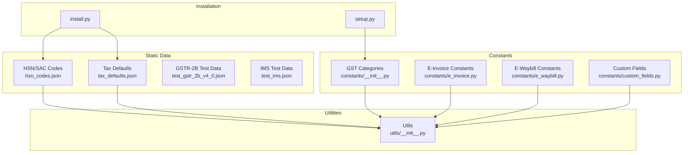

**Diagram sources**
- [hsn_codes.json](file://india_compliance/gst_india/data/hsn_codes.json#L1-L50)
- [tax_defaults.json](file://india_compliance/gst_india/data/tax_defaults.json#L1-L50)
- [__init__.py](file://india_compliance/gst_india/constants/__init__.py#L28-L105)
- [e_invoice.py](file://india_compliance/gst_india/constants/e_invoice.py#L1-L9)
- [e_waybill.py](file://india_compliance/gst_india/constants/e_waybill.py#L1-L99)
- [custom_fields.py](file://india_compliance/gst_india/constants/custom_fields.py#L1-L80)
- [__init__.py](file://india_compliance/gst_india/utils/__init__.py#L338-L340)
- [install.py](file://india_compliance/install.py#L1-L50)
- [setup.py](file://india_compliance/setup.py#L1-L50)

**Section sources**
- [hsn_codes.json](file://india_compliance/gst_india/data/hsn_codes.json#L1-L50)
- [tax_defaults.json](file://india_compliance/gst_india/data/tax_defaults.json#L1-L50)
- [__init__.py](file://india_compliance/gst_india/constants/__init__.py#L28-L105)
- [e_invoice.py](file://india_compliance/gst_india/constants/e_invoice.py#L1-L9)
- [e_waybill.py](file://india_compliance/gst_india/constants/e_waybill.py#L1-L99)
- [custom_fields.py](file://india_compliance/gst_india/constants/custom_fields.py#L1-L80)
- [__init__.py](file://india_compliance/gst_india/utils/__init__.py#L338-L340)
- [install.py](file://india_compliance/install.py#L1-L50)
- [setup.py](file://india_compliance/setup.py#L1-L50)

## Core Components
- HSN/SAC code catalog: JSON array of HSN entries with standardized fields for code and description.
- Tax defaults: JSON defining GST tax categories, rates, and chart-of-accounts mappings.
- E-invoice constants: Reason codes and item limit for e-invoice generation.
- E-waybill constants: Address mapping, reason codes, document types, supply types, transport modes, and item limit.
- GST categories and state mappings: Enumerations and mappings used for transaction categorization and place-of-supply determination.
- Custom fields: Dynamic field definitions for parties and transactions, including HSN/SAC and taxable value fields.
- Utilities: Functions to load static data files, compute place-of-supply, validate GSTIN and PIN code, and manage API enablement.

**Section sources**
- [hsn_codes.json](file://india_compliance/gst_india/data/hsn_codes.json#L1-L50)
- [tax_defaults.json](file://india_compliance/gst_india/data/tax_defaults.json#L1-L50)
- [e_invoice.py](file://india_compliance/gst_india/constants/e_invoice.py#L1-L9)
- [e_waybill.py](file://india_compliance/gst_india/constants/e_waybill.py#L1-L99)
- [__init__.py](file://india_compliance/gst_india/constants/__init__.py#L28-L105)
- [custom_fields.py](file://india_compliance/gst_india/constants/custom_fields.py#L690-L784)
- [__init__.py](file://india_compliance/gst_india/utils/__init__.py#L338-L340)

## Architecture Overview
Static data configuration integrates with runtime utilities and constants to support transaction processing. The flow below illustrates how static data influences dynamic operations.

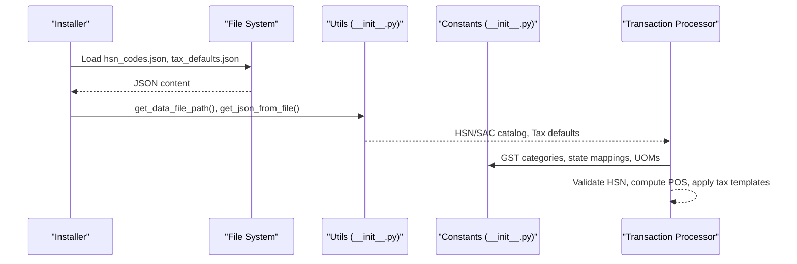

**Diagram sources**
- [__init__.py](file://india_compliance/gst_india/utils/__init__.py#L338-L340)
- [__init__.py](file://india_compliance/gst_india/constants/__init__.py#L28-L105)
- [hsn_codes.json](file://india_compliance/gst_india/data/hsn_codes.json#L1-L50)
- [tax_defaults.json](file://india_compliance/gst_india/data/tax_defaults.json#L1-L50)

## Detailed Component Analysis

### HSN/SAC Code Management
- JSON structure: Array of entries with fields for code and description.
- Validation rules:
  - Minimum digits configurable via GST Settings.
  - Valid lengths determined by configured minimum digits.
- Mapping to items:
  - Items fetch HSN/SAC from item master; UI fields expose HSN/SAC on transaction line items.
- Lookup mechanism:
  - Utilities provide HSN settings retrieval to enforce validation during transaction processing.

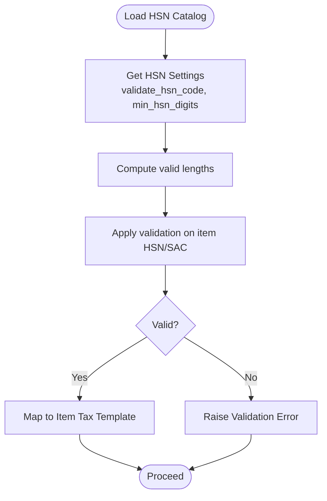

**Diagram sources**
- [__init__.py](file://india_compliance/gst_india/utils/__init__.py#L386-L399)
- [custom_fields.py](file://india_compliance/gst_india/constants/custom_fields.py#L690-L702)

**Section sources**
- [hsn_codes.json](file://india_compliance/gst_india/data/hsn_codes.json#L1-L50)
- [__init__.py](file://india_compliance/gst_india/utils/__init__.py#L386-L399)
- [custom_fields.py](file://india_compliance/gst_india/constants/custom_fields.py#L690-L702)

### Tax Rate Defaults and State-wise Tax Rate Mappings
- Tax categories: In-state/out-state, reverse charge variants, composition, and chart of accounts mapping.
- Default tax templates: Per GST rate with CGST/SGST/IGST split and refund/reverse charge variants.
- State-wise mapping:
  - State numbers and Indian states mapping used for place-of-supply computation.
  - PIN code validation leverages state-to-PIN code ranges.

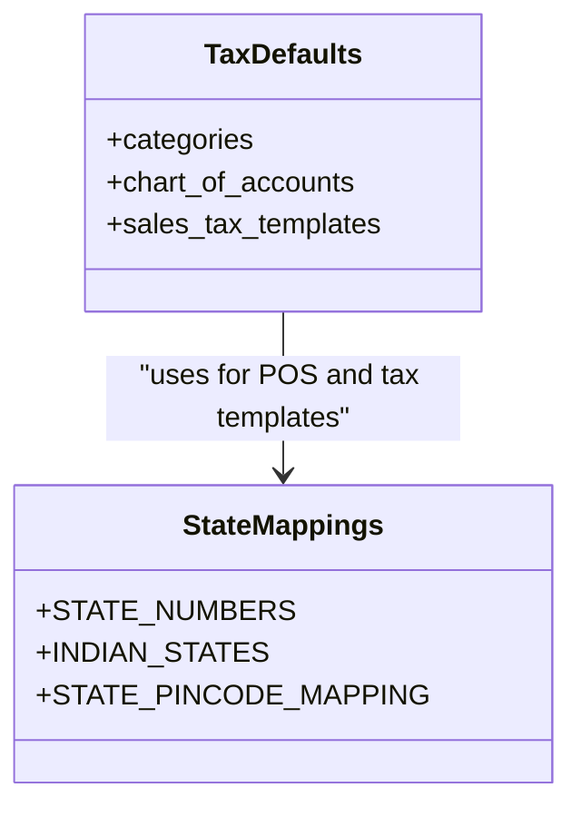

**Diagram sources**
- [tax_defaults.json](file://india_compliance/gst_india/data/tax_defaults.json#L1-L80)
- [__init__.py](file://india_compliance/gst_india/constants/__init__.py#L66-L105)
- [__init__.py](file://india_compliance/gst_india/constants/__init__.py#L167-L202)

**Section sources**
- [tax_defaults.json](file://india_compliance/gst_india/data/tax_defaults.json#L1-L80)
- [__init__.py](file://india_compliance/gst_india/constants/__init__.py#L66-L105)
- [__init__.py](file://india_compliance/gst_india/constants/__init__.py#L167-L202)

### E-Invoice and E-Waybill Configuration Constants
- E-Invoice:
  - Reason codes for cancellation mapped to numeric codes.
  - Item limit enforced for invoice line items.
- E-Waybill:
  - Address mapping for different doctypes (sales, purchase, delivery, receipts, stock entry, subcontracting).
  - Reason codes for cancellation, vehicle update, and validity extension.
  - Document types, supply types, sub-supply types, transport modes, and item limit.

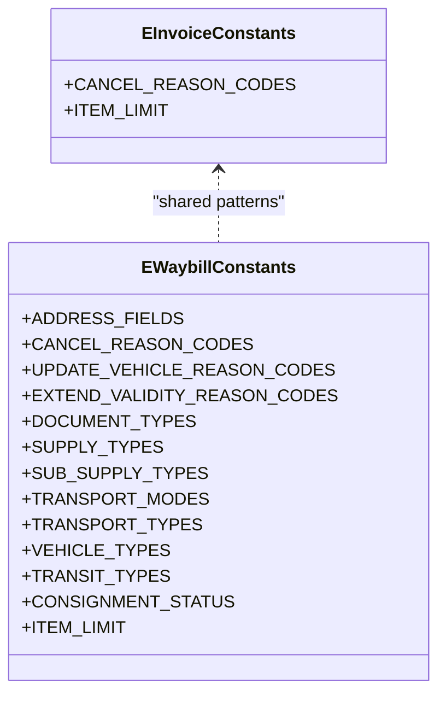

**Diagram sources**
- [e_invoice.py](file://india_compliance/gst_india/constants/e_invoice.py#L1-L9)
- [e_waybill.py](file://india_compliance/gst_india/constants/e_waybill.py#L1-L99)

**Section sources**
- [e_invoice.py](file://india_compliance/gst_india/constants/e_invoice.py#L1-L9)
- [e_waybill.py](file://india_compliance/gst_india/constants/e_waybill.py#L1-L99)

### GST Category Definitions, Place of Supply Options, and State Code Mappings
- GST categories: Mapping from party categories to e-Invoice supply types.
- Place of supply options: Autocomplete options built from state numbers and names.
- State code mappings: Used for POS computation and PIN code validation.

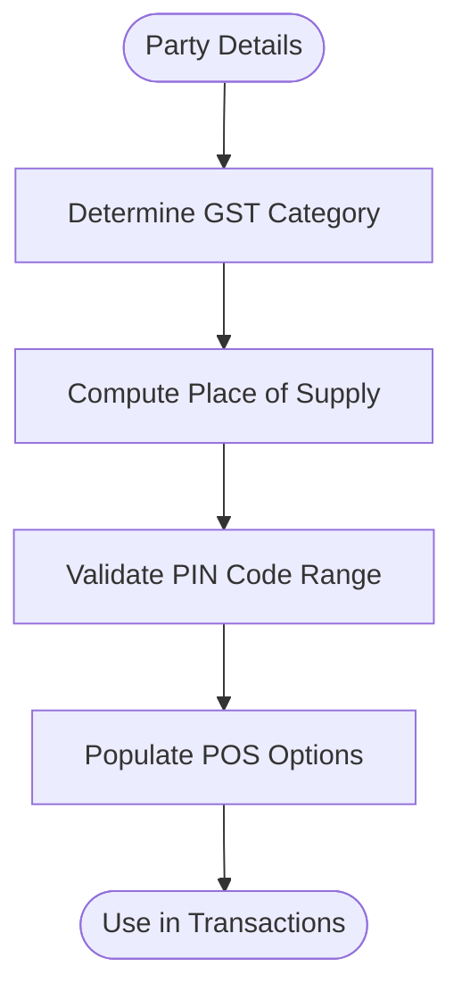

**Diagram sources**
- [__init__.py](file://india_compliance/gst_india/constants/__init__.py#L28-L39)
- [__init__.py](file://india_compliance/gst_india/utils/__init__.py#L783-L792)
- [__init__.py](file://india_compliance/gst_india/utils/__init__.py#L402-L484)
- [__init__.py](file://india_compliance/gst_india/utils/__init__.py#L245-L295)

**Section sources**
- [__init__.py](file://india_compliance/gst_india/constants/__init__.py#L28-L39)
- [__init__.py](file://india_compliance/gst_india/utils/__init__.py#L783-L792)
- [__init__.py](file://india_compliance/gst_india/utils/__init__.py#L402-L484)
- [__init__.py](file://india_compliance/gst_india/utils/__init__.py#L245-L295)

### Data Loading Procedures During Installation and Updates
- Static data loading:
  - Utilities provide functions to locate and load JSON data files.
- Installation and setup:
  - Installation scripts and setup routines load HSN/SAC and tax defaults into the system.
- Test data:
  - Sample JSON files included for testing GSTR-2B and IMS integrations.

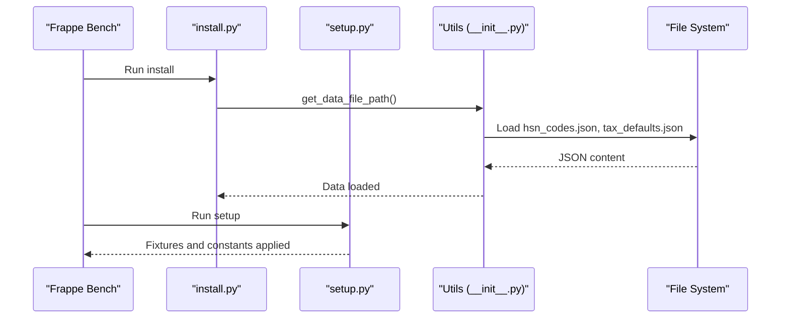

**Diagram sources**
- [__init__.py](file://india_compliance/gst_india/utils/__init__.py#L338-L340)
- [install.py](file://india_compliance/install.py#L1-L50)
- [setup.py](file://india_compliance/setup.py#L1-L50)

**Section sources**
- [__init__.py](file://india_compliance/gst_india/utils/__init__.py#L338-L340)
- [install.py](file://india_compliance/install.py#L1-L50)
- [setup.py](file://india_compliance/setup.py#L1-L50)

### Relationship Between Static Data and Dynamic Transaction Processing
- HSN/SAC validation ensures line items conform to configured minimum digits and lengths.
- Tax defaults drive tax template selection and account mapping based on category and inter-state/out-state logic.
- Place-of-supply computation uses state mappings and party details to determine applicable tax rates.
- E-invoice and e-waybill constants govern applicability thresholds, item limits, and operational codes.

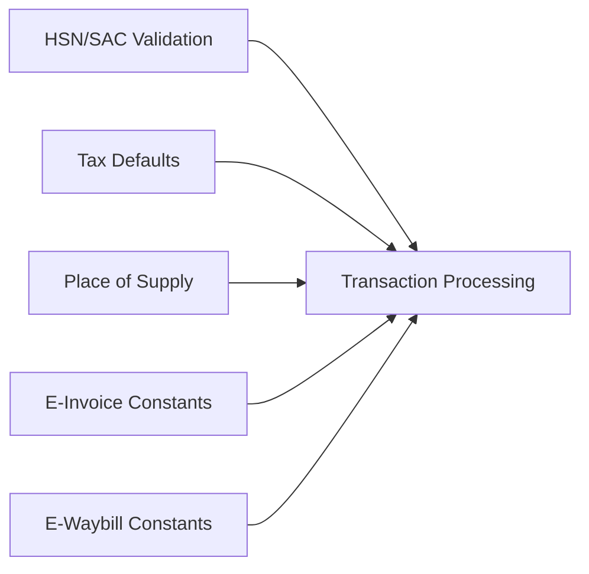

**Diagram sources**
- [__init__.py](file://india_compliance/gst_india/utils/__init__.py#L386-L399)
- [__init__.py](file://india_compliance/gst_india/utils/__init__.py#L402-L484)
- [e_invoice.py](file://india_compliance/gst_india/constants/e_invoice.py#L1-L9)
- [e_waybill.py](file://india_compliance/gst_india/constants/e_waybill.py#L1-L99)

**Section sources**
- [__init__.py](file://india_compliance/gst_india/utils/__init__.py#L386-L399)
- [__init__.py](file://india_compliance/gst_india/utils/__init__.py#L402-L484)
- [e_invoice.py](file://india_compliance/gst_india/constants/e_invoice.py#L1-L9)
- [e_waybill.py](file://india_compliance/gst_india/constants/e_waybill.py#L1-L99)

### Data Validation Rules, Lookup Mechanisms, and Error Handling
- HSN validation:
  - Enforces minimum digits and valid lengths from GST Settings.
- GSTIN validation:
  - Checks length, optional transporter ID validation, and TCS-specific format.
- PIN code validation:
  - Validates format and ensures first three digits fall within state-specific ranges.
- Error handling:
  - Throws descriptive errors for invalid data entries with actionable messages.

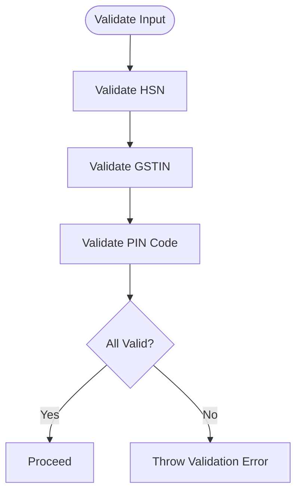

**Diagram sources**
- [__init__.py](file://india_compliance/gst_india/utils/__init__.py#L163-L198)
- [__init__.py](file://india_compliance/gst_india/utils/__init__.py#L245-L295)
- [__init__.py](file://india_compliance/gst_india/utils/__init__.py#L386-L399)

**Section sources**
- [__init__.py](file://india_compliance/gst_india/utils/__init__.py#L163-L198)
- [__init__.py](file://india_compliance/gst_india/utils/__init__.py#L245-L295)
- [__init__.py](file://india_compliance/gst_india/utils/__init__.py#L386-L399)

### Configuration of Government Portal URLs, Sandbox Modes, and API Credentials
- API enablement:
  - Determined by settings and presence of API secret.
- Sandbox mode:
  - Controls production vs sandbox behavior for APIs.
- Party info autofill:
  - Enabled when production APIs are enabled and setting is turned on.

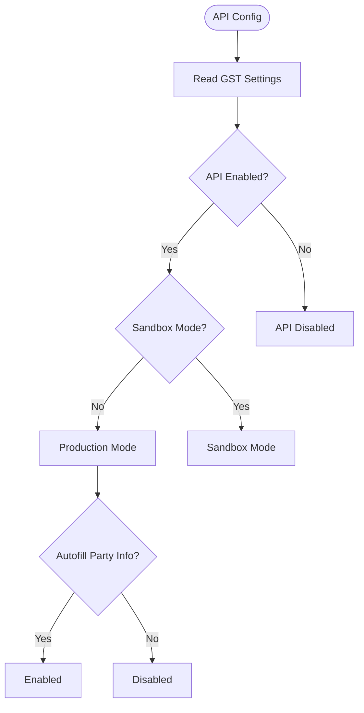

**Diagram sources**
- [__init__.py](file://india_compliance/gst_india/utils/__init__.py#L735-L761)

**Section sources**
- [__init__.py](file://india_compliance/gst_india/utils/__init__.py#L735-L761)

## Dependency Analysis
Static data dependencies and relationships:

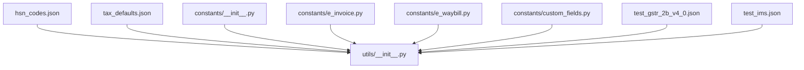

**Diagram sources**
- [hsn_codes.json](file://india_compliance/gst_india/data/hsn_codes.json#L1-L50)
- [tax_defaults.json](file://india_compliance/gst_india/data/tax_defaults.json#L1-L50)
- [__init__.py](file://india_compliance/gst_india/constants/__init__.py#L28-L105)
- [e_invoice.py](file://india_compliance/gst_india/constants/e_invoice.py#L1-L9)
- [e_waybill.py](file://india_compliance/gst_india/constants/e_waybill.py#L1-L99)
- [custom_fields.py](file://india_compliance/gst_india/constants/custom_fields.py#L1-L80)
- [__init__.py](file://india_compliance/gst_india/utils/__init__.py#L338-L340)
- [test_gstr_2b_v4_0.json](file://india_compliance/gst_india/data/test_gstr_2b_v4_0.json#L1-L50)
- [test_ims.json](file://india_compliance/gst_india/data/test_ims.json#L1-L50)

**Section sources**
- [hsn_codes.json](file://india_compliance/gst_india/data/hsn_codes.json#L1-L50)
- [tax_defaults.json](file://india_compliance/gst_india/data/tax_defaults.json#L1-L50)
- [__init__.py](file://india_compliance/gst_india/constants/__init__.py#L28-L105)
- [e_invoice.py](file://india_compliance/gst_india/constants/e_invoice.py#L1-L9)
- [e_waybill.py](file://india_compliance/gst_india/constants/e_waybill.py#L1-L99)
- [custom_fields.py](file://india_compliance/gst_india/constants/custom_fields.py#L1-L80)
- [__init__.py](file://india_compliance/gst_india/utils/__init__.py#L338-L340)
- [test_gstr_2b_v4_0.json](file://india_compliance/gst_india/data/test_gstr_2b_v4_0.json#L1-L50)
- [test_ims.json](file://india_compliance/gst_india/data/test_ims.json#L1-L50)

## Performance Considerations
- Static data is loaded once and cached via request cache for options and lookups.
- JSON parsing is centralized to avoid repeated disk I/O.
- Place-of-supply computation relies on fast state-number lookups.

[No sources needed since this section provides general guidance]

## Troubleshooting Guide
Common issues and resolutions:
- Invalid HSN/SAC:
  - Ensure HSN meets minimum digits and valid length; check GST Settings.
- Invalid GSTIN:
  - Verify length, format, and check digit; confirm category matches format.
- Invalid PIN code:
  - Confirm format and that first three digits fall within the state’s range.
- API configuration:
  - Ensure API is enabled and sandbox mode is correctly set; verify API secret presence.

**Section sources**
- [__init__.py](file://india_compliance/gst_india/utils/__init__.py#L163-L198)
- [__init__.py](file://india_compliance/gst_india/utils/__init__.py#L245-L295)
- [__init__.py](file://india_compliance/gst_india/utils/__init__.py#L735-L761)

## Conclusion
The static data configuration system in India Compliance provides robust, validated, and reusable data for GST compliance. It supports HSN/SAC validation, tax defaults, e-invoice/e-waybill constants, GST categories, place-of-supply computation, and API configuration. Installation and updates ensure these datasets are consistently loaded and integrated with dynamic transaction processing.