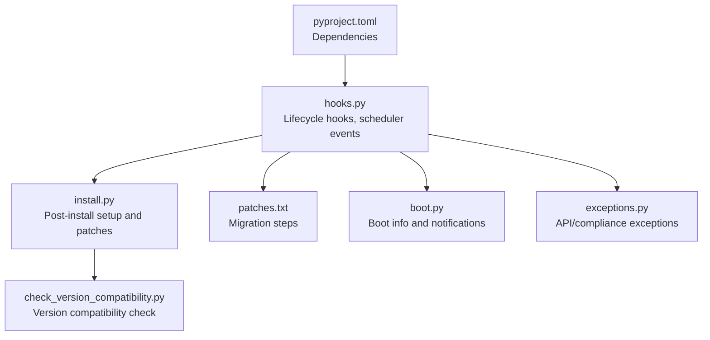
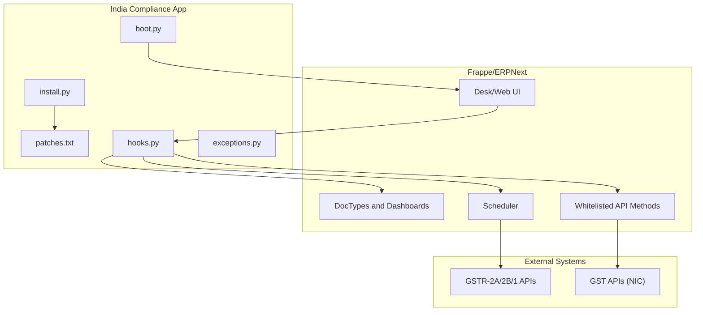
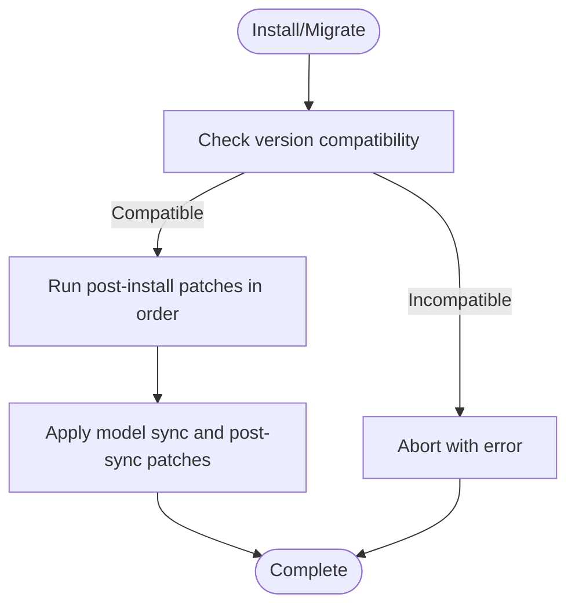
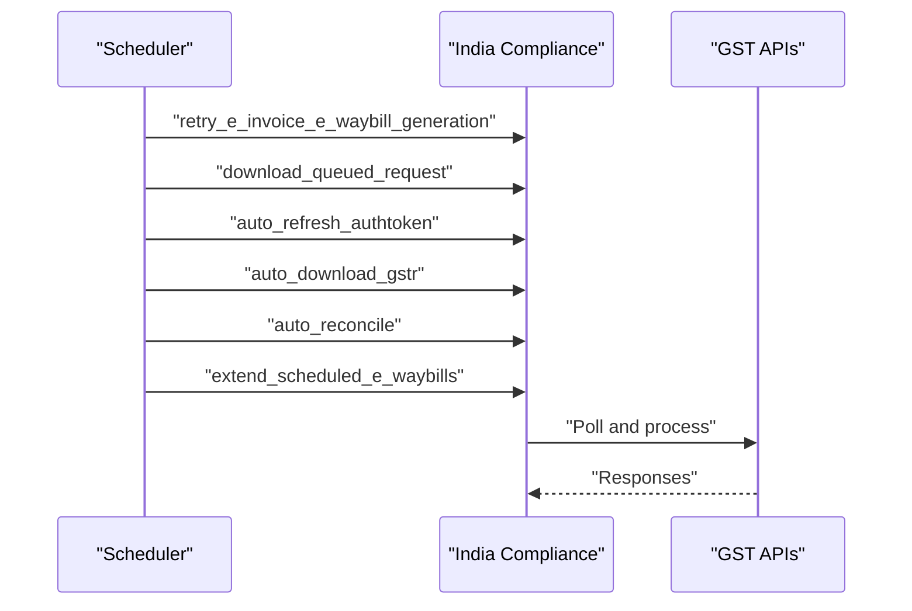
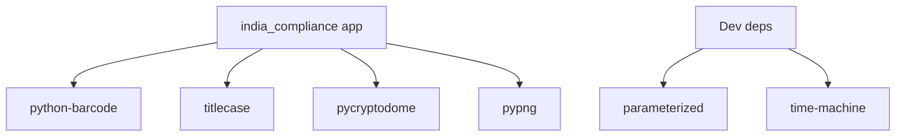

# Deployment & Maintenance

<cite>
**Referenced Files in This Document**
- [README.md](file://README.md)
- [hooks.py](file://india_compliance/hooks.py)
- [install.py](file://india_compliance/install.py)
- [check_version_compatibility.py](file://india_compliance/patches/check_version_compatibility.py)
- [patches.txt](file://india_compliance/patches.txt)
- [uninstall.py](file://india_compliance/uninstall.py)
- [boot.py](file://india_compliance/boot.py)
- [exceptions.py](file://india_compliance/exceptions.py)
- [pyproject.toml](file://pyproject.toml)
</cite>

## Table of Contents
1. [Introduction](#introduction)
2. [Project Structure](#project-structure)
3. [Core Components](#core-components)
4. [Architecture Overview](#architecture-overview)
5. [Detailed Component Analysis](#detailed-component-analysis)
6. [Dependency Analysis](#dependency-analysis)
7. [Performance Considerations](#performance-considerations)
8. [Troubleshooting Guide](#troubleshooting-guide)
9. [Conclusion](#conclusion)
10. [Appendices](#appendices)

## Introduction
This document provides comprehensive guidance for deploying and maintaining the India Compliance application in production. It covers server configuration, environment variables, dependency management, patch management for upgrades and migrations, scheduler configuration for background jobs and API polling, monitoring setup for API usage and error tracking, backup and restore procedures, maintenance tasks such as log rotation and cleanup, and troubleshooting steps for common deployment and compliance issues. Upgrade and rollback strategies are included to ensure safe transitions across versions.

## Project Structure
India Compliance is an ERPNext app built on the Frappe Framework. The repository includes:
- Application hooks and lifecycle hooks for installation, migration, and uninstallation
- Post-install and version-specific patches for data migration and compatibility
- Scheduler event definitions for recurring tasks
- Boot-time configuration and notifications
- Exception definitions for API and compliance errors
- Python package metadata and dependencies

**Diagram sources**
- [hooks.py](file://india_compliance/hooks.py#L1-L684)
- [install.py](file://india_compliance/install.py#L1-L119)
- [check_version_compatibility.py](file://india_compliance/patches/check_version_compatibility.py#L1-L66)
- [patches.txt](file://india_compliance/patches.txt#L1-L80)
- [boot.py](file://india_compliance/boot.py#L1-L76)
- [exceptions.py](file://india_compliance/exceptions.py#L1-L50)
- [pyproject.toml](file://pyproject.toml#L1-L32)

**Section sources**
- [README.md](file://README.md#L1-L99)
- [hooks.py](file://india_compliance/hooks.py#L1-L684)
- [install.py](file://india_compliance/install.py#L1-L119)
- [check_version_compatibility.py](file://india_compliance/patches/check_version_compatibility.py#L1-L66)
- [patches.txt](file://india_compliance/patches.txt#L1-L80)
- [boot.py](file://india_compliance/boot.py#L1-L76)
- [exceptions.py](file://india_compliance/exceptions.py#L1-L50)
- [pyproject.toml](file://pyproject.toml#L1-L32)

## Core Components
- Lifecycle hooks: Define pre/post install, migrate, and uninstall behaviors, and register scheduler events.
- Post-install setup: Creates fixtures, sets up GST and Income Tax configurations, runs ordered patches.
- Version compatibility: Validates major/minor versions of Frappe, ERPNext, and India Compliance.
- Scheduler events: Periodic tasks for retrying e-invoice/e-waybill generation, downloading GSTR data, reconciliations, and extending scheduled e-waybills.
- Boot-time configuration: Provides client-side boot info and triggers notifications for audit trail and tax template updates.
- Exceptions: Centralized exception types for GSP/GST server errors, rate limits, timeouts, OTP, auth tokens, and applicability errors.
- Dependencies: Declares runtime and dev dependencies via Python packaging configuration.

**Section sources**
- [hooks.py](file://india_compliance/hooks.py#L23-L31)
- [hooks.py](file://india_compliance/hooks.py#L473-L492)
- [install.py](file://india_compliance/install.py#L55-L81)
- [install.py](file://india_compliance/install.py#L83-L95)
- [check_version_compatibility.py](file://india_compliance/patches/check_version_compatibility.py#L26-L61)
- [boot.py](file://india_compliance/boot.py#L13-L32)
- [exceptions.py](file://india_compliance/exceptions.py#L4-L50)
- [pyproject.toml](file://pyproject.toml#L9-L16)

## Architecture Overview
The deployment architecture integrates with ERPNext/Frappe and external GST APIs. The app registers scheduler events for background jobs and exposes whitelisted API methods for payment reconciliation. Boot-time configuration ensures client-side readiness and notification triggers.

**Diagram sources**
- [hooks.py](file://india_compliance/hooks.py#L473-L492)
- [hooks.py](file://india_compliance/hooks.py#L636-L640)
- [install.py](file://india_compliance/install.py#L55-L81)
- [patches.txt](file://india_compliance/patches.txt#L1-L80)
- [boot.py](file://india_compliance/boot.py#L13-L32)
- [exceptions.py](file://india_compliance/exceptions.py#L4-L50)

## Detailed Component Analysis

### Production Deployment Requirements
- Server prerequisites
  - ERPNext and Frappe versions must match major versions; minor version thresholds are enforced for compatibility branches.
  - Ensure Python 3.10+ and pip are installed.
- Environment variables
  - Configure frappe.conf with required keys for API access and optional flags (e.g., ic_api_secret).
  - Ensure database credentials and Redis connections are configured per Frappe/ERPNext standards.
- Application installation
  - Install the app in a Frappe bench environment targeting the correct ERPNext branch.
  - After installation, post-install patches are executed to set up custom fields, roles, and data migrations.

**Section sources**
- [check_version_compatibility.py](file://india_compliance/patches/check_version_compatibility.py#L12-L23)
- [check_version_compatibility.py](file://india_compliance/patches/check_version_compatibility.py#L44-L61)
- [install.py](file://india_compliance/install.py#L55-L81)

### Patch Management System
- Purpose
  - Ensures safe upgrades by applying ordered migrations and data fixes during install and migrate.
- Execution order
  - Post-install patches are applied in a predefined sequence to avoid conflicts.
  - Migration scripts are defined in patches.txt for model sync and post-sync steps.
- Backward compatibility
  - Version compatibility checks prevent mismatched major versions.
  - Patches handle field renames, merges, and defaults across versions.

**Diagram sources**
- [check_version_compatibility.py](file://india_compliance/patches/check_version_compatibility.py#L26-L61)
- [install.py](file://india_compliance/install.py#L83-L95)
- [patches.txt](file://india_compliance/patches.txt#L1-L80)

**Section sources**
- [install.py](file://india_compliance/install.py#L16-L52)
- [install.py](file://india_compliance/install.py#L83-L95)
- [patches.txt](file://india_compliance/patches.txt#L1-L80)
- [check_version_compatibility.py](file://india_compliance/patches/check_version_compatibility.py#L26-L61)

### Scheduler Configuration
- Background jobs
  - Retry e-invoice/e-waybill generation every 5 minutes.
  - Refresh auth tokens every 10 minutes.
  - Download GSTR data daily at 2 AM.
  - Auto reconcile purchases daily at 4 AM.
  - Extend scheduled e-waybills daily at 1 AM.
- API polling
  - GSTR download and reconciliation tasks poll external APIs periodically.
- Compliance reminders
  - Notifications are triggered via boot info for audit trail and tax template updates.

**Diagram sources**
- [hooks.py](file://india_compliance/hooks.py#L473-L492)

**Section sources**
- [hooks.py](file://india_compliance/hooks.py#L473-L492)
- [boot.py](file://india_compliance/boot.py#L47-L76)

### Monitoring Setup
- API usage reporting
  - Use the “India Compliance API Usage” report to monitor API calls and statuses.
- Error tracking
  - Centralized exceptions for GSP/GST server errors, rate limits, timeouts, OTP, and invalid auth tokens.
- Performance metrics
  - Monitor scheduler job durations and external API response times.
  - Track reconciliation and GSTR download completion rates.

**Section sources**
- [exceptions.py](file://india_compliance/exceptions.py#L4-L50)

### Backup and Restore Procedures
- Compliance data
  - Back up DocTypes related to GST settings, e-invoice logs, e-waybill logs, purchase reconciliation tool, and audit trail records.
- System configuration
  - Back up GST Settings, company fixtures, custom fields, and property setters.
- Restore strategy
  - Restore database backups and re-run post-install patches if necessary.
  - Verify GST credentials and sandbox mode settings after restore.

**Section sources**
- [hooks.py](file://india_compliance/hooks.py#L438-L441)

### Maintenance Tasks
- Log rotation
  - Configure system log rotation for Frappe/ERPNext logs to manage disk usage.
- Cleanup jobs
  - Remove legacy report fixtures and unused entries as part of version-specific patches.
- System health checks
  - Verify scheduler jobs are running, API credentials are valid, and reconciliation tasks are completing.

**Section sources**
- [patches.txt](file://india_compliance/patches.txt#L77-L80)

### Troubleshooting Guide
- Common deployment issues
  - Version mismatch: Resolve by aligning Frappe/ERPNext with the required major version and meeting minor version thresholds.
  - Installation failure: Review post-install patch logs and re-run installation after resolving dependency issues.
- API connectivity problems
  - GSP/GST server errors: Check service availability and rate limits; handle OTP requests and invalid auth tokens.
  - Timeouts: Increase timeout thresholds or retry policies in client scripts.
- Compliance failures
  - e-Invoice/e-Waybill not applicable: Validate document type and GST details.
  - Reconciliation mismatches: Manually trigger auto-download and reconcile tasks.

**Section sources**
- [check_version_compatibility.py](file://india_compliance/patches/check_version_compatibility.py#L31-L61)
- [exceptions.py](file://india_compliance/exceptions.py#L4-L50)
- [hooks.py](file://india_compliance/hooks.py#L473-L492)

### Upgrade and Rollback Strategies
- Upgrades
  - Ensure Frappe/ERPNext major versions match India Compliance major version.
  - Run bench update to apply latest patches; verify scheduler jobs and API credentials post-upgrade.
- Rollbacks
  - Revert to previous app version and re-run earlier patches if necessary.
  - Restore database from pre-upgrade backup if data inconsistencies arise.

**Section sources**
- [check_version_compatibility.py](file://india_compliance/patches/check_version_compatibility.py#L31-L61)
- [patches.txt](file://india_compliance/patches.txt#L1-L80)

## Dependency Analysis
Runtime dependencies include cryptography libraries and QR/barcode generation packages. Dev dependencies support testing and development workflows.

**Diagram sources**
- [pyproject.toml](file://pyproject.toml#L9-L16)
- [pyproject.toml](file://pyproject.toml#L29-L32)

**Section sources**
- [pyproject.toml](file://pyproject.toml#L9-L16)
- [pyproject.toml](file://pyproject.toml#L29-L32)

## Performance Considerations
- Scheduler intervals are optimized for periodic tasks; adjust cron schedules cautiously to avoid API throttling.
- Batch reconciliation and GSTR downloads should be monitored for long-running tasks.
- Use whitelisted API methods judiciously to minimize overhead.

## Conclusion
India Compliance integrates tightly with ERPNext/Frappe and external GST APIs. Proper version alignment, scheduled maintenance, robust monitoring, and adherence to patch sequences ensure reliable operation. Follow the upgrade and rollback strategies to maintain system stability during transitions.

## Appendices
- Environment variables to configure in frappe.conf:
  - ic_api_secret (optional): Controls access to specific pages.
  - Database and Redis credentials.
- Key DocTypes to include in backups:
  - GST Settings, GST Account, GST Credential, e-Invoice Log, e-Waybill Log, Purchase Reconciliation Tool, Audit Trail records.