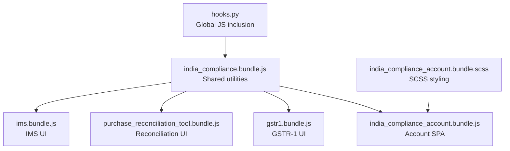
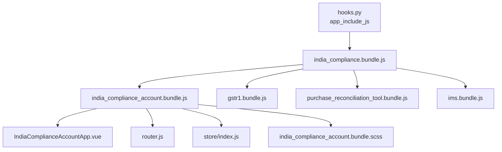
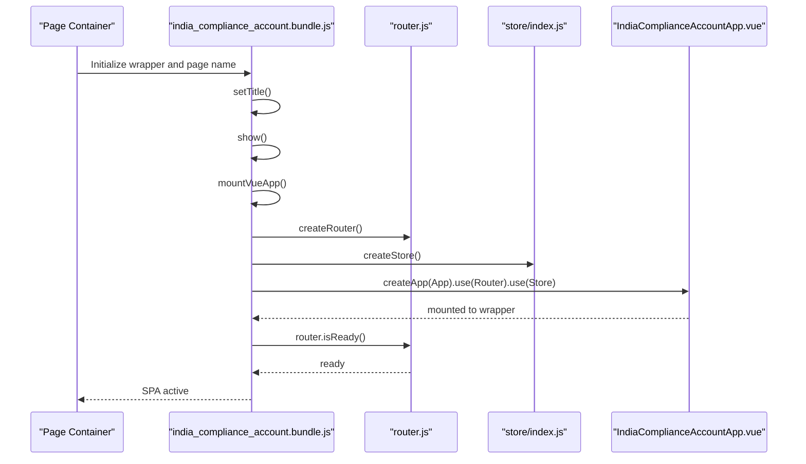
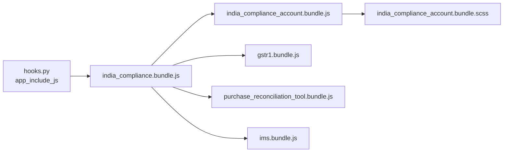

# Build Bundles & Asset Management

<cite>
**Referenced Files in This Document**
- [hooks.py](file://india_compliance/hooks.py)
- [india_compliance_account.bundle.js](file://india_compliance/public/js/india_compliance_account/india_compliance_account.bundle.js)
- [gstr1.bundle.js](file://india_compliance/public/js/gstr1.bundle.js)
- [purchase_reconciliation_tool.bundle.js](file://india_compliance/public/js/purchase_reconciliation_tool.bundle.js)
- [ims.bundle.js](file://india_compliance/public/js/ims.bundle.js)
- [india_compliance_account.bundle.scss](file://india_compliance/public/scss/india_compliance_account.bundle.scss)
- [IndiaComplianceAccountApp.vue](file://india_compliance/public/js/india_compliance_account/IndiaComplianceAccountApp.vue)
- [router.js](file://india_compliance/public/js/india_compliance_account/router.js)
- [index.js](file://india_compliance/public/js/india_compliance_account/store/index.js)
- [india_compliance.bundle.js](file://india_compliance/public/js/india_compliance.bundle.js)
</cite>

## Table of Contents
1. [Introduction](#introduction)
2. [Project Structure](#project-structure)
3. [Core Components](#core-components)
4. [Architecture Overview](#architecture-overview)
5. [Detailed Component Analysis](#detailed-component-analysis)
6. [Dependency Analysis](#dependency-analysis)
7. [Performance Considerations](#performance-considerations)
8. [Troubleshooting Guide](#troubleshooting-guide)
9. [Conclusion](#conclusion)
10. [Appendices](#appendices)

## Introduction
This document explains the frontend build bundles and asset management strategy for the India Compliance application. It focuses on how module-specific bundles are structured, how assets are compiled and loaded, and how to optimize and debug builds. The covered modules include the India Compliance Account, Purchase Reconciliation Tool, GSTR-1, and IMS. It also documents SCSS compilation and styling bundling, asset loading patterns, lazy-loading strategies, customization examples, performance optimization, browser compatibility, caching, CDN integration, and the development workflow for building and deploying frontend assets.

## Project Structure
The frontend assets are organized under the app’s public directory with separate bundles per module and shared utilities. Key locations:
- Shared JS bundle: india_compliance/public/js/india_compliance.bundle.js
- Module bundles:
  - India Compliance Account: india_compliance/public/js/india_compliance_account/india_compliance_account.bundle.js
  - GSTR-1: india_compliance/public/js/gstr1.bundle.js
  - Purchase Reconciliation Tool: india_compliance/public/js/purchase_reconciliation_tool.bundle.js
  - IMS: india_compliance/public/js/ims.bundle.js
- SCSS styling bundle: india_compliance/public/scss/india_compliance_account.bundle.scss

The app includes the shared JS bundle globally via hooks, and module bundles are imported within their respective pages or components.

**Diagram sources**
- [hooks.py](file://india_compliance/hooks.py#L41-L41)
- [india_compliance.bundle.js](file://india_compliance/public/js/india_compliance.bundle.js#L1-L14)
- [india_compliance_account.bundle.js](file://india_compliance/public/js/india_compliance_account/india_compliance_account.bundle.js#L1-L125)
- [gstr1.bundle.js](file://india_compliance/public/js/gstr1.bundle.js#L1-L4)
- [purchase_reconciliation_tool.bundle.js](file://india_compliance/public/js/purchase_reconciliation_tool.bundle.js#L1-L6)
- [ims.bundle.js](file://india_compliance/public/js/ims.bundle.js#L1-L6)
- [india_compliance_account.bundle.scss](file://india_compliance/public/scss/india_compliance_account.bundle.scss#L1-L125)

**Section sources**
- [hooks.py](file://india_compliance/hooks.py#L41-L41)
- [india_compliance.bundle.js](file://india_compliance/public/js/india_compliance.bundle.js#L1-L14)
- [india_compliance_account.bundle.js](file://india_compliance/public/js/india_compliance_account/india_compliance_account.bundle.js#L1-L125)
- [gstr1.bundle.js](file://india_compliance/public/js/gstr1.bundle.js#L1-L4)
- [purchase_reconciliation_tool.bundle.js](file://india_compliance/public/js/purchase_reconciliation_tool.bundle.js#L1-L6)
- [ims.bundle.js](file://india_compliance/public/js/ims.bundle.js#L1-L6)
- [india_compliance_account.bundle.scss](file://india_compliance/public/scss/india_compliance_account.bundle.scss#L1-L125)

## Core Components
- Global shared bundle: india_compliance/public/js/india_compliance.bundle.js
  - Purpose: Aggregates shared utilities and reusable modules used across the app.
  - Imports: Utilities, API handler, notifications, controllers, and common components.
- Module bundles:
  - India Compliance Account: india_compliance/public/js/india_compliance_account/india_compliance_account.bundle.js
    - Purpose: Bootstraps a Vue single-page application for the Account module.
    - Imports: Router, store, and the root Vue component.
  - GSTR-1: india_compliance/public/js/gstr1.bundle.js
    - Purpose: Loads GSTR-1 UI components and managers.
  - Purchase Reconciliation Tool: india_compliance/public/js/purchase_reconciliation_tool.bundle.js
    - Purpose: Loads reconciliation utilities and components.
  - IMS: india_compliance/public/js/ims.bundle.js
    - Purpose: Loads IMS-related components and actions.
- SCSS bundle:
  - india_compliance/public/scss/india_compliance_account.bundle.scss
    - Purpose: Styles for the Account module with responsive breakpoints and transitions.

**Section sources**
- [india_compliance.bundle.js](file://india_compliance/public/js/india_compliance.bundle.js#L1-L14)
- [india_compliance_account.bundle.js](file://india_compliance/public/js/india_compliance_account/india_compliance_account.bundle.js#L1-L125)
- [gstr1.bundle.js](file://india_compliance/public/js/gstr1.bundle.js#L1-L4)
- [purchase_reconciliation_tool.bundle.js](file://india_compliance/public/js/purchase_reconciliation_tool.bundle.js#L1-L6)
- [ims.bundle.js](file://india_compliance/public/js/ims.bundle.js#L1-L6)
- [india_compliance_account.bundle.scss](file://india_compliance/public/scss/india_compliance_account.bundle.scss#L1-L125)

## Architecture Overview
The frontend architecture follows a modular bundle pattern:
- Global inclusion via hooks includes the shared bundle for all pages.
- Module-specific bundles are imported inside their respective pages or components.
- Vue-based SPA for the Account module integrates routing, Vuex store, and lazy-loaded route components.
- SCSS is bundled per module to scope styles and minimize global conflicts.

**Diagram sources**
- [hooks.py](file://india_compliance/hooks.py#L41-L41)
- [india_compliance.bundle.js](file://india_compliance/public/js/india_compliance.bundle.js#L1-L14)
- [india_compliance_account.bundle.js](file://india_compliance/public/js/india_compliance_account/india_compliance_account.bundle.js#L1-L125)
- [IndiaComplianceAccountApp.vue](file://india_compliance/public/js/india_compliance_account/IndiaComplianceAccountApp.vue#L1-L82)
- [router.js](file://india_compliance/public/js/india_compliance_account/router.js#L1-L37)
- [index.js](file://india_compliance/public/js/india_compliance_account/store/index.js#L1-L11)
- [india_compliance_account.bundle.scss](file://india_compliance/public/scss/india_compliance_account.bundle.scss#L1-L125)

## Detailed Component Analysis

### India Compliance Account Bundle
The Account module is a Vue SPA with routing and a centralized store. The bundle initializes the router, mounts the root component, and manages navigation and authentication.

**Diagram sources**
- [india_compliance_account.bundle.js](file://india_compliance/public/js/india_compliance_account/india_compliance_account.bundle.js#L8-L53)
- [router.js](file://india_compliance/public/js/india_compliance_account/router.js#L1-L37)
- [index.js](file://india_compliance/public/js/india_compliance_account/store/index.js#L1-L11)
- [IndiaComplianceAccountApp.vue](file://india_compliance/public/js/india_compliance_account/IndiaComplianceAccountApp.vue#L1-L82)

Key characteristics:
- Router history configured with the page route.
- Vue app mounts only after router readiness.
- Authentication and route guards orchestrated via the store and router.

**Section sources**
- [india_compliance_account.bundle.js](file://india_compliance/public/js/india_compliance_account/india_compliance_account.bundle.js#L8-L53)
- [router.js](file://india_compliance/public/js/india_compliance_account/router.js#L1-L37)
- [index.js](file://india_compliance/public/js/india_compliance_account/store/index.js#L1-L11)
- [IndiaComplianceAccountApp.vue](file://india_compliance/public/js/india_compliance_account/IndiaComplianceAccountApp.vue#L1-L82)

### GSTR-1 Bundle
Purpose:
- Aggregates GSTR-1 UI components and managers.

Implementation highlights:
- Imports filter group, data table manager, and view group components.

Optimization note:
- Keep imports minimal to reduce initial load.
- Consider lazy-loading heavy components on demand.

**Section sources**
- [gstr1.bundle.js](file://india_compliance/public/js/gstr1.bundle.js#L1-L4)

### Purchase Reconciliation Tool Bundle
Purpose:
- Provides reconciliation tool UI and utilities.

Implementation highlights:
- Imports GSTR-2B data handler, data table manager, filter group, number card, and reconciliation actions.

Optimization note:
- Lazy-load reconciliation actions and heavy datasets until needed.

**Section sources**
- [purchase_reconciliation_tool.bundle.js](file://india_compliance/public/js/purchase_reconciliation_tool.bundle.js#L1-L6)

### IMS Bundle
Purpose:
- Supports IMS-related UI components and actions.

Implementation highlights:
- Imports data table manager, number card, GSTIN options, filter group, and reconciliation actions.

Optimization note:
- Defer non-critical components to reduce initial payload.

**Section sources**
- [ims.bundle.js](file://india_compliance/public/js/ims.bundle.js#L1-L6)

### SCSS Compilation and Styling Bundling
Scope and structure:
- Styles scoped to the Account module page route.
- Responsive breakpoints and Vue transition classes included.

Compilation strategy:
- Bundle compiled SCSS is included per module to avoid global style conflicts.
- Use of CSS custom properties for theming and maintainability.

Best practices:
- Keep selectors scoped to module containers.
- Prefer CSS custom properties for theme tokens.
- Split large SCSS into smaller partials and import selectively.

**Section sources**
- [india_compliance_account.bundle.scss](file://india_compliance/public/scss/india_compliance_account.bundle.scss#L1-L125)

### Asset Loading Patterns and Lazy Loading Strategies
Current patterns:
- Shared bundle loaded globally via hooks.
- Module bundles imported within their pages/components.
- Vue components are lazy-loaded via route resolution.

Recommended lazy-loading strategies:
- Dynamic import route components for the Account module.
- Lazy-load heavy third-party libraries and analytics scripts.
- Split vendor and application code for cache efficiency.

[No sources needed since this section provides general guidance]

### Bundle Customization Examples
- Add a new module bundle:
  - Create a new entry file under public/js/<module>.bundle.js.
  - Import required components and managers.
  - Include the bundle in the relevant page or component.
- Customize shared bundle:
  - Add/remove imports in india_compliance/public/js/india_compliance.bundle.js.
  - Ensure backward compatibility and avoid breaking existing modules.
- Adjust SCSS scope:
  - Wrap styles in a module-specific container selector.
  - Use CSS custom properties for consistent theming.

[No sources needed since this section provides general guidance]

## Dependency Analysis
The global inclusion of the shared bundle ensures all modules share common utilities. Module bundles depend on the shared bundle for common APIs and helpers.

**Diagram sources**
- [hooks.py](file://india_compliance/hooks.py#L41-L41)
- [india_compliance.bundle.js](file://india_compliance/public/js/india_compliance.bundle.js#L1-L14)
- [india_compliance_account.bundle.js](file://india_compliance/public/js/india_compliance_account/india_compliance_account.bundle.js#L1-L125)
- [gstr1.bundle.js](file://india_compliance/public/js/gstr1.bundle.js#L1-L4)
- [purchase_reconciliation_tool.bundle.js](file://india_compliance/public/js/purchase_reconciliation_tool.bundle.js#L1-L6)
- [ims.bundle.js](file://india_compliance/public/js/ims.bundle.js#L1-L6)
- [india_compliance_account.bundle.scss](file://india_compliance/public/scss/india_compliance_account.bundle.scss#L1-L125)

**Section sources**
- [hooks.py](file://india_compliance/hooks.py#L41-L41)
- [india_compliance.bundle.js](file://india_compliance/public/js/india_compliance.bundle.js#L1-L14)

## Performance Considerations
- Minimize shared bundle size by removing unused imports.
- Split module bundles to enable parallel loading and reduce initial payload.
- Use dynamic imports for non-critical features.
- Enable gzip/Brotli compression on the server.
- Configure long-term caching for static assets with fingerprinted filenames.
- Use a CDN for static assets to improve global delivery latency.
- Monitor bundle sizes with profiling tools and set budgets.

[No sources needed since this section provides general guidance]

## Troubleshooting Guide
Common issues and resolutions:
- Module not rendering:
  - Verify the module bundle is imported in the page/component.
  - Confirm router initialization and route guards.
- Styles missing:
  - Ensure the module SCSS bundle is included for the page.
  - Check for conflicting global styles.
- API errors:
  - Inspect network tab for failed requests.
  - Validate API keys and CORS settings.
- Build errors:
  - Validate import paths and file existence.
  - Check for circular dependencies among modules.

[No sources needed since this section provides general guidance]

## Conclusion
The India Compliance frontend uses a modular bundle architecture with a shared global bundle and per-module bundles. The Account module is a Vue SPA with routing and a store, while other modules focus on specific UI tasks. SCSS is bundled per module for scoped styling. Following the recommended optimization and debugging practices will improve performance, maintainability, and developer experience.

[No sources needed since this section summarizes without analyzing specific files]

## Appendices

### Development Workflow for Building and Deploying Frontend Assets
- Local development:
  - Run the app locally to test bundle loading and module behavior.
  - Use browser devtools to inspect network requests and console logs.
- Build and deployment:
  - Ensure all imports resolve correctly.
  - Compress assets and configure caching headers.
  - Serve assets via a CDN for improved performance.
  - Validate bundle integrity and monitor load times.

[No sources needed since this section provides general guidance]