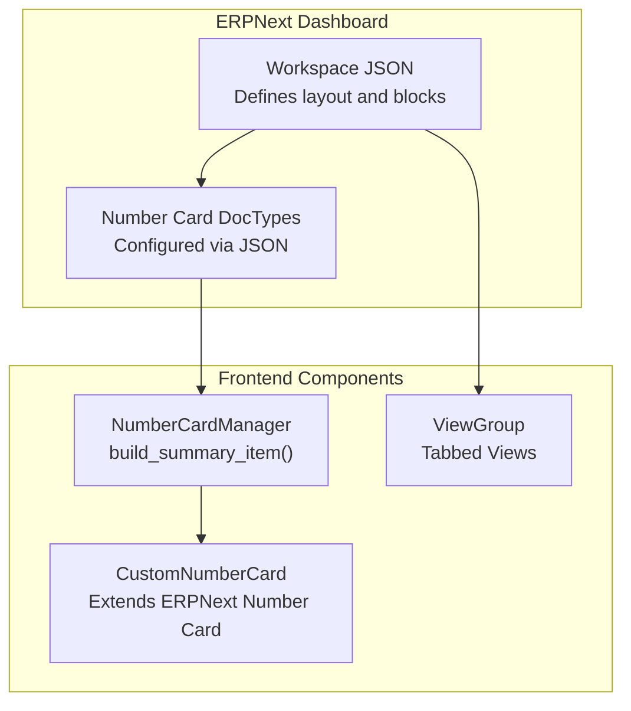
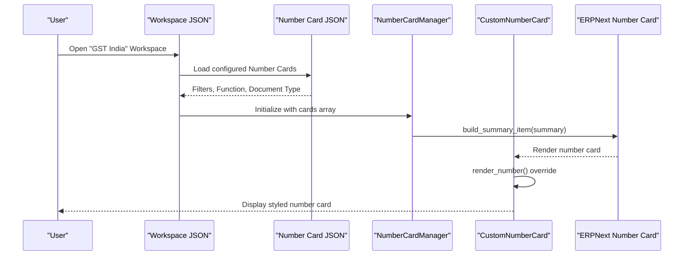
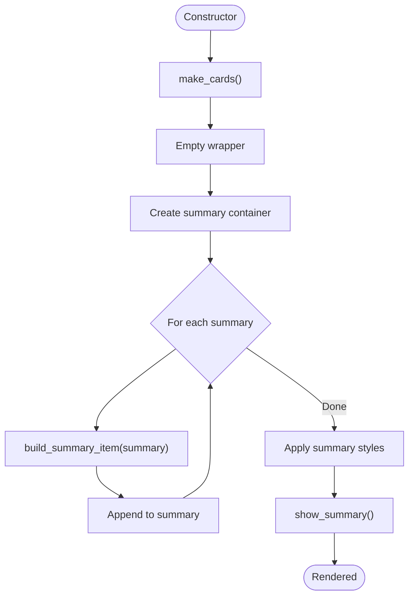
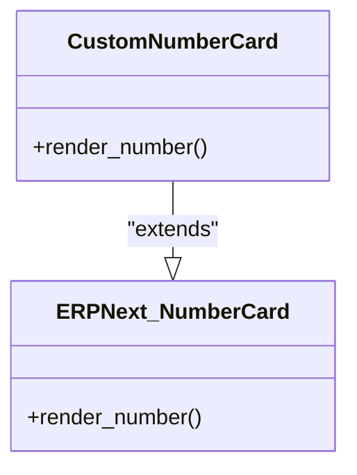
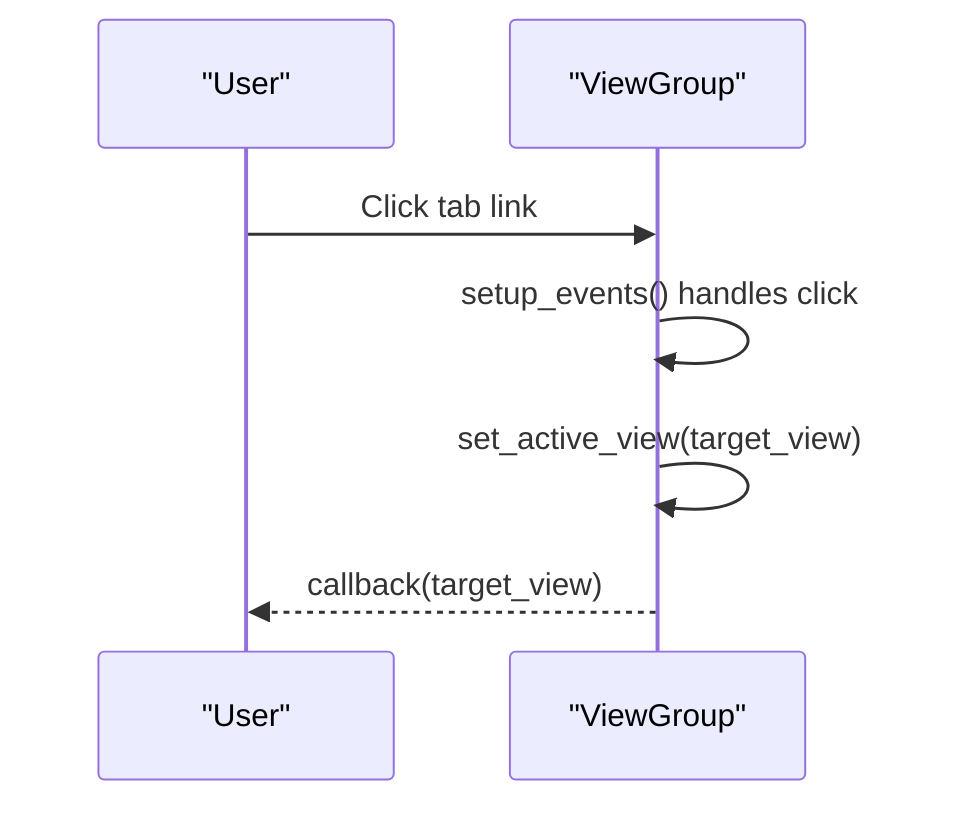
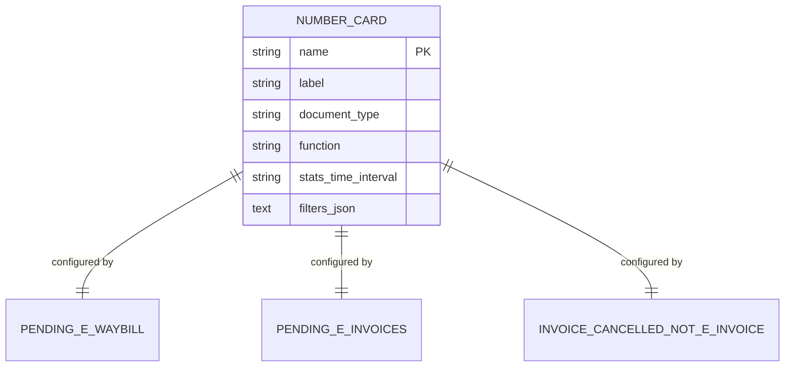
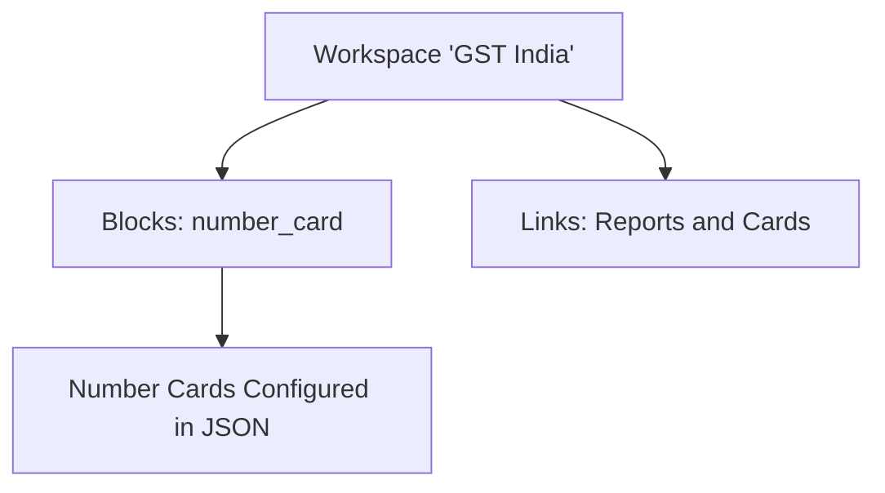
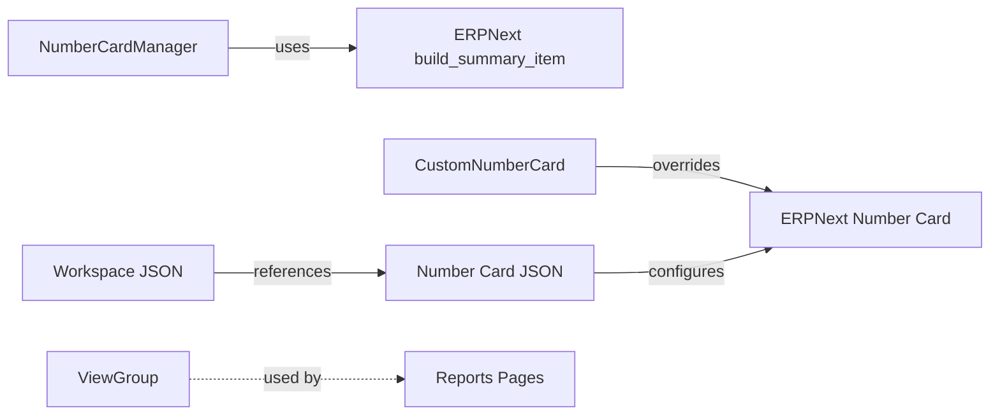

# Dashboard Widgets & Number Cards

<cite>
**Referenced Files in This Document**
- [number_card.js](file://india_compliance/public/js/components/number_card.js)
- [custom_number_card.js](file://india_compliance/public/js/custom_number_card.js)
- [view_group.js](file://india_compliance/public/js/components/view_group.js)
- [pending_e_waybill.json](file://india_compliance/gst_india/number_card/pending_e_waybill/pending_e_waybill.json)
- [pending_e_invoices.json](file://india_compliance/gst_india/number_card/pending_e_invoices/pending_e_invoices.json)
- [invoice_cancelled_but_not_e_invoice.json](file://india_compliance/gst_india/number_card/invoice_cancelled_but_not_e_invoice/invoice_cancelled_but_not_e_invoice.json)
- [gst_india_workspace.json](file://india_compliance/gst_india/workspace/gst_india/gst_india.json)
- [gst_india_sidebar.json](file://india_compliance/workspace_sidebar/gst_india.json)
</cite>

## Table of Contents
1. [Introduction](#introduction)
2. [Project Structure](#project-structure)
3. [Core Components](#core-components)
4. [Architecture Overview](#architecture-overview)
5. [Detailed Component Analysis](#detailed-component-analysis)
6. [Dependency Analysis](#dependency-analysis)
7. [Performance Considerations](#performance-considerations)
8. [Troubleshooting Guide](#troubleshooting-guide)
9. [Conclusion](#conclusion)
10. [Appendices](#appendices)

## Introduction
This document explains the dashboard widgets and number cards used for compliance monitoring and reporting within the India Compliance module. It covers the custom number card system for tracking compliance metrics such as pending e-invoices, cancelled invoices, and e-waybills, along with the ViewGroup component for organizing dashboard layouts. It also documents integration with ERPNext’s dashboard framework, customization options, and practical guidance for creating new number cards, configuring data sources, enabling real-time updates, optimizing performance, and implementing alert systems.

## Project Structure
The dashboard widgets and number cards are implemented using a combination of:
- ERPNext Number Cards configured via JSON fixtures
- A lightweight JavaScript NumberCardManager for rendering summaries
- A custom Number Card widget extension for special styling
- A ViewGroup component for tabbed views in reports
- Workspace JSON that defines dashboard layout and number card blocks

**Diagram sources**
- [gst_india_workspace.json](file://india_compliance/gst_india/workspace/gst_india/gst_india.json#L4-L295)
- [pending_e_waybill.json](file://india_compliance/gst_india/number_card/pending_e_waybill/pending_e_waybill.json#L1-L27)
- [pending_e_invoices.json](file://india_compliance/gst_india/number_card/pending_e_invoices/pending_e_invoices.json#L1-L29)
- [invoice_cancelled_but_not_e_invoice.json](file://india_compliance/gst_india/number_card/invoice_cancelled_but_not_e_invoice/invoice_cancelled_but_not_e_invoice.json#L1-L28)
- [number_card.js](file://india_compliance/public/js/components/number_card.js#L1-L35)
- [custom_number_card.js](file://india_compliance/public/js/custom_number_card.js#L1-L20)
- [view_group.js](file://india_compliance/public/js/components/view_group.js#L1-L81)

**Section sources**
- [gst_india_workspace.json](file://india_compliance/gst_india/workspace/gst_india/gst_india.json#L4-L295)
- [number_card.js](file://india_compliance/public/js/components/number_card.js#L1-L35)
- [custom_number_card.js](file://india_compliance/public/js/custom_number_card.js#L1-L20)
- [view_group.js](file://india_compliance/public/js/components/view_group.js#L1-L81)

## Core Components
- NumberCardManager: Builds and renders a summary row of number cards using ERPNext’s build_summary_item utility.
- CustomNumberCard: Extends the default ERPNext Number Card widget to adjust rendering for specific compliance metrics.
- ViewGroup: Provides a tabbed interface for switching between views in reports and dashboards.
- Number Card JSON fixtures: Define filters, aggregation functions, and display attributes for each metric.

Key responsibilities:
- Rendering: NumberCardManager constructs number cards and appends them to a summary container.
- Styling: CustomNumberCard overrides render_number to suppress color for specific cards when formatted_number is not available.
- Layout: ViewGroup manages tab navigation and view activation callbacks.
- Configuration: Number card JSON fixtures define data sources and filters for ERPNext’s Number Card doctype.

**Section sources**
- [number_card.js](file://india_compliance/public/js/components/number_card.js#L3-L34)
- [custom_number_card.js](file://india_compliance/public/js/custom_number_card.js#L3-L19)
- [view_group.js](file://india_compliance/public/js/components/view_group.js#L3-L81)

## Architecture Overview
The dashboard architecture integrates ERPNext’s Number Card framework with custom frontend components:

**Diagram sources**
- [gst_india_workspace.json](file://india_compliance/gst_india/workspace/gst_india/gst_india.json#L4-L295)
- [pending_e_waybill.json](file://india_compliance/gst_india/number_card/pending_e_waybill/pending_e_waybill.json#L1-L27)
- [pending_e_invoices.json](file://india_compliance/gst_india/number_card/pending_e_invoices/pending_e_invoices.json#L1-L29)
- [invoice_cancelled_but_not_e_invoice.json](file://india_compliance/gst_india/number_card/invoice_cancelled_but_not_e_invoice/invoice_cancelled_but_not_e_invoice.json#L1-L28)
- [number_card.js](file://india_compliance/public/js/components/number_card.js#L10-L29)
- [custom_number_card.js](file://india_compliance/public/js/custom_number_card.js#L4-L16)

## Detailed Component Analysis

### NumberCardManager
Purpose:
- Accepts a wrapper and an array of card summaries.
- Empties the wrapper, builds a summary container, and appends individual number cards.
- Applies minimal styling to the summary container.

Rendering pattern:
- Uses ERPNext utility to build each summary item.
- Appends to a shared summary container and toggles visibility based on presence of cards.

**Diagram sources**
- [number_card.js](file://india_compliance/public/js/components/number_card.js#L10-L33)

**Section sources**
- [number_card.js](file://india_compliance/public/js/components/number_card.js#L3-L34)

### CustomNumberCard
Purpose:
- Extends ERPNext’s Number Card widget to handle special rendering for compliance metrics.
- Suppresses color for specific cards when formatted_number is not available.

Behavior:
- Overrides render_number to conditionally clear color for cards named Pending e-Waybill, Pending e-Invoices, and Invoice Cancelled But Not e-Invoice.
- Delegates to super.render_number() otherwise.

**Diagram sources**
- [custom_number_card.js](file://india_compliance/public/js/custom_number_card.js#L3-L19)

**Section sources**
- [custom_number_card.js](file://india_compliance/public/js/custom_number_card.js#L1-L20)

### ViewGroup
Purpose:
- Provides a tabbed interface for switching between views.
- Manages view creation, event binding, and enabling/disabling views.

Key methods:
- set_active_view: Activates a given view programmatically.
- make_views: Creates tab links from view names.
- setup_events: Binds click events to switch views and invoke callback.
- disable_view/enable_view: Toggle disabled state and tooltip.

**Diagram sources**
- [view_group.js](file://india_compliance/public/js/components/view_group.js#L59-L70)

**Section sources**
- [view_group.js](file://india_compliance/public/js/components/view_group.js#L3-L81)

### Number Card JSON Fixtures
These JSON files define the configuration for each compliance metric:

- Pending e-Waybills
  - Document Type: Sales Invoice
  - Filters: e_waybill_status = Pending, docstatus = 1
  - Aggregation: Count
  - Label: Pending e-Waybills

- Pending e-Invoices
  - Document Type: Sales Invoice
  - Filters: einvoice_status = Pending, docstatus = 1
  - Aggregation: Count
  - Label: Pending e-Invoices

- Invoice Cancelled, e-Invoice Active
  - Document Type: Sales Invoice
  - Filters: einvoice_status = Pending Cancellation, docstatus = 2, irn is set
  - Aggregation: Count
  - Label: Invoice Cancelled, e-Invoice Active

**Diagram sources**
- [pending_e_waybill.json](file://india_compliance/gst_india/number_card/pending_e_waybill/pending_e_waybill.json#L1-L27)
- [pending_e_invoices.json](file://india_compliance/gst_india/number_card/pending_e_invoices/pending_e_invoices.json#L1-L29)
- [invoice_cancelled_but_not_e_invoice.json](file://india_compliance/gst_india/number_card/invoice_cancelled_but_not_e_invoice/invoice_cancelled_but_not_e_invoice.json#L1-L28)

**Section sources**
- [pending_e_waybill.json](file://india_compliance/gst_india/number_card/pending_e_waybill/pending_e_waybill.json#L1-L27)
- [pending_e_invoices.json](file://india_compliance/gst_india/number_card/pending_e_invoices/pending_e_invoices.json#L1-L29)
- [invoice_cancelled_but_not_e_invoice.json](file://india_compliance/gst_india/number_card/invoice_cancelled_but_not_e_invoice/invoice_cancelled_but_not_e_invoice.json#L1-L28)

### Workspace Integration
The Workspace JSON defines:
- Dashboard blocks: number_card blocks referencing the configured number cards
- Content layout: grid columns and block ordering
- Links and cards: report and doctype links included in the workspace

**Diagram sources**
- [gst_india_workspace.json](file://india_compliance/gst_india/workspace/gst_india/gst_india.json#L4-L295)

**Section sources**
- [gst_india_workspace.json](file://india_compliance/gst_india/workspace/gst_india/gst_india.json#L4-L295)

## Dependency Analysis
- NumberCardManager depends on ERPNext’s build_summary_item utility to render individual cards.
- CustomNumberCard depends on ERPNext’s Number Card widget factory and overrides render_number.
- ViewGroup is independent and can be reused across pages for tabbed views.
- Number card JSON fixtures are consumed by ERPNext’s Number Card doctype and rendered within the Workspace.

**Diagram sources**
- [number_card.js](file://india_compliance/public/js/components/number_card.js#L18-L18)
- [custom_number_card.js](file://india_compliance/public/js/custom_number_card.js#L1-L1)
- [gst_india_workspace.json](file://india_compliance/gst_india/workspace/gst_india/gst_india.json#L4-L295)

**Section sources**
- [number_card.js](file://india_compliance/public/js/components/number_card.js#L1-L35)
- [custom_number_card.js](file://india_compliance/public/js/custom_number_card.js#L1-L20)
- [gst_india_workspace.json](file://india_compliance/gst_india/workspace/gst_india/gst_india.json#L4-L295)

## Performance Considerations
- Minimize DOM operations: NumberCardManager empties the wrapper once and appends all cards to a single summary container.
- Batch rendering: Use a single loop to create and append cards to reduce reflows.
- Conditional styling: CustomNumberCard avoids unnecessary color computations by checking formatted_number.
- Workspace layout: Keep number card blocks grouped and avoid excessive nesting in the Workspace JSON to reduce render overhead.
- Data refresh: Prefer server-side aggregation via Number Card filters and ERPNext’s built-in refresh mechanisms rather than client-side polling.

[No sources needed since this section provides general guidance]

## Troubleshooting Guide
Common issues and resolutions:
- Number card not displaying:
  - Verify the Number Card JSON fixture exists and is valid.
  - Confirm the Workspace references the correct number card name.
- Incorrect counts:
  - Review filters_json in the Number Card JSON to ensure correct field conditions.
  - Ensure document_type matches the doctype being queried.
- Styling anomalies:
  - Check CustomNumberCard override for specific card names and formatted_number availability.
- Tabs not switching:
  - Ensure ViewGroup is initialized with correct view names and callback is provided.
  - Verify event bindings are not overwritten elsewhere.

**Section sources**
- [pending_e_waybill.json](file://india_compliance/gst_india/number_card/pending_e_waybill/pending_e_waybill.json#L9-L9)
- [pending_e_invoices.json](file://india_compliance/gst_india/number_card/pending_e_invoices/pending_e_invoices.json#L10-L10)
- [invoice_cancelled_but_not_e_invoice.json](file://india_compliance/gst_india/number_card/invoice_cancelled_but_not_e_invoice/invoice_cancelled_but_not_e_invoice.json#L9-L9)
- [custom_number_card.js](file://india_compliance/public/js/custom_number_card.js#L5-L13)
- [view_group.js](file://india_compliance/public/js/components/view_group.js#L59-L70)

## Conclusion
The dashboard widgets and number cards system leverages ERPNext’s Number Card framework with small, focused customizations. NumberCardManager streamlines rendering, CustomNumberCard ensures appropriate styling for compliance metrics, and ViewGroup enables flexible tabbed layouts. The Workspace JSON ties everything together, while the Number Card JSON fixtures define precise data sources and filters. Together, they provide a maintainable and extensible foundation for compliance monitoring and reporting.

[No sources needed since this section summarizes without analyzing specific files]

## Appendices

### Creating a New Number Card
Steps:
1. Define a new Number Card JSON fixture under gst_india/number_card with:
   - document_type matching the target doctype
   - filters_json specifying conditions
   - function as Count or Sum
   - label and name for display and reference
2. Add a number_card block to the Workspace JSON content referencing the new card name.
3. Optionally, rely on CustomNumberCard for styling or create a separate widget if advanced behavior is needed.

References:
- [gst_india_workspace.json](file://india_compliance/gst_india/workspace/gst_india/gst_india.json#L4-L295)
- [pending_e_waybill.json](file://india_compliance/gst_india/number_card/pending_e_waybill/pending_e_waybill.json#L1-L27)

**Section sources**
- [gst_india_workspace.json](file://india_compliance/gst_india/workspace/gst_india/gst_india.json#L4-L295)
- [pending_e_waybill.json](file://india_compliance/gst_india/number_card/pending_e_waybill/pending_e_waybill.json#L1-L27)

### Configuring Data Sources
- Filters: Use filters_json to constrain results by status, docstatus, and related fields.
- Aggregation: Choose Count or Sum based on whether you need totals or counts.
- Time intervals: stats_time_interval controls periodic aggregation (e.g., Daily).

References:
- [pending_e_invoices.json](file://india_compliance/gst_india/number_card/pending_e_invoices/pending_e_invoices.json#L9-L10)
- [invoice_cancelled_but_not_e_invoice.json](file://india_compliance/gst_india/number_card/invoice_cancelled_but_not_e_invoice/invoice_cancelled_but_not_e_invoice.json#L9-L9)

**Section sources**
- [pending_e_invoices.json](file://india_compliance/gst_india/number_card/pending_e_invoices/pending_e_invoices.json#L9-L10)
- [invoice_cancelled_but_not_e_invoice.json](file://india_compliance/gst_india/number_card/invoice_cancelled_but_not_e_invoice/invoice_cancelled_but_not_e_invoice.json#L9-L9)

### Real-Time Updates
- Use ERPNext’s built-in refresh mechanisms for Number Cards.
- For dynamic reports, integrate with ViewGroup callbacks to trigger data reloads.
- Avoid client-side polling; prefer server-driven updates via filters and scheduled jobs.

[No sources needed since this section provides general guidance]

### Compliance Metrics Tracking and Alerts
- Track metrics via Number Cards with appropriate filters (e.g., Pending e-Invoices, Pending e-Waybills).
- Surface alerts by integrating status descriptions and refresh buttons in forms or reports.
- Use Workspace roles to limit access to sensitive compliance dashboards.

References:
- [gst_india_sidebar.json](file://india_compliance/workspace_sidebar/gst_india.json#L285-L289)

**Section sources**
- [gst_india_sidebar.json](file://india_compliance/workspace_sidebar/gst_india.json#L285-L289)