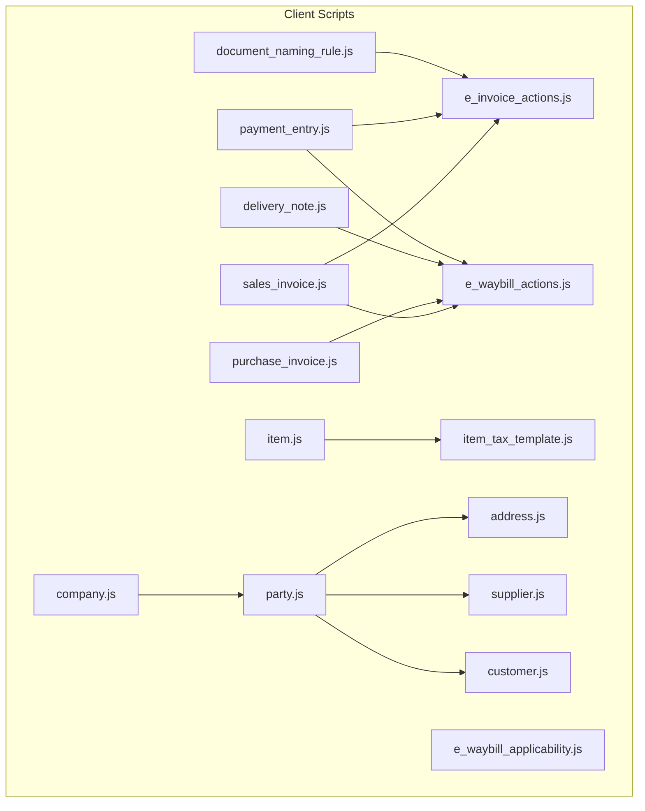
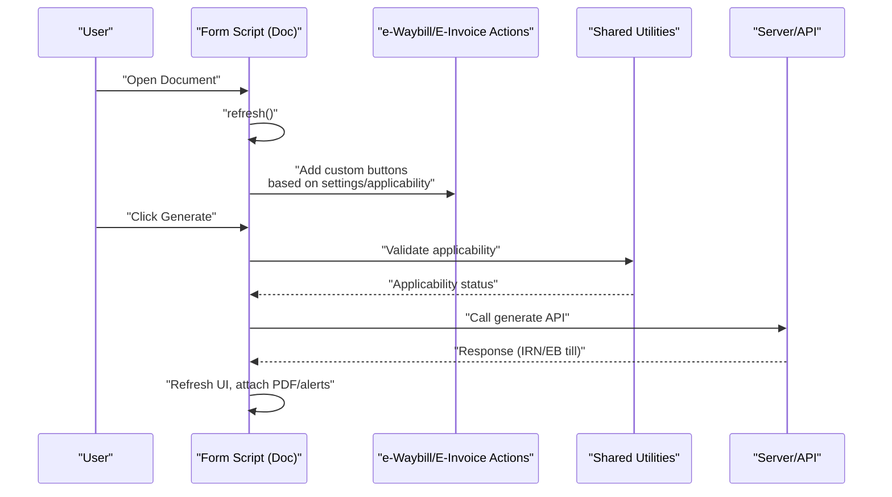
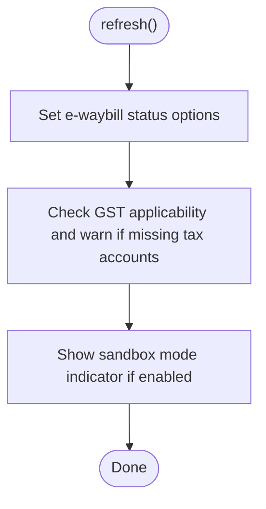
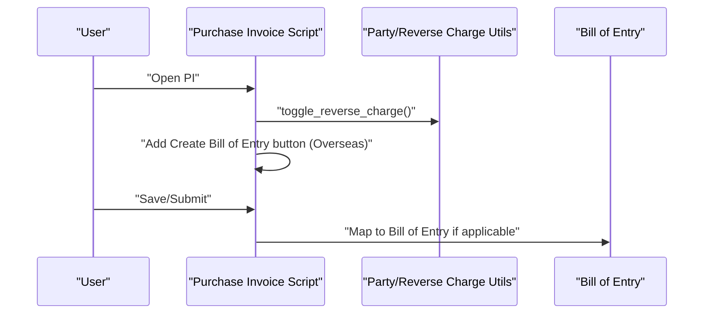
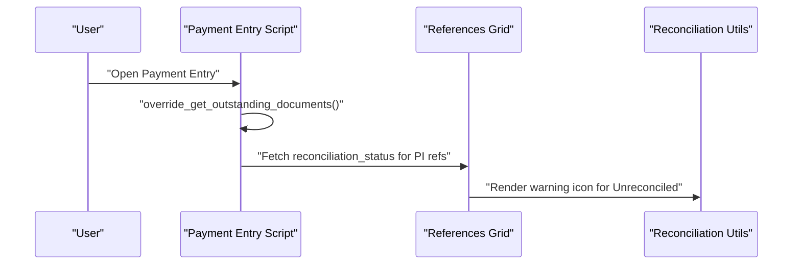
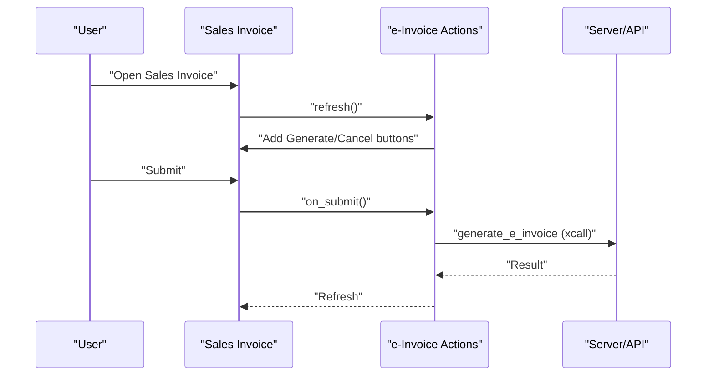
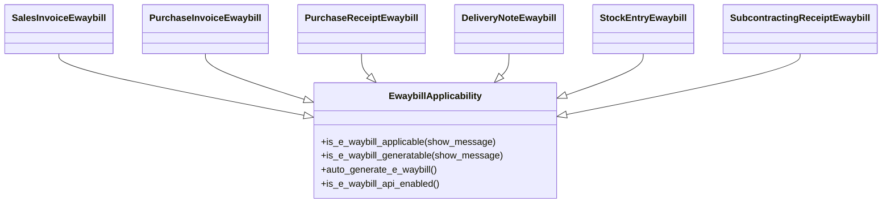
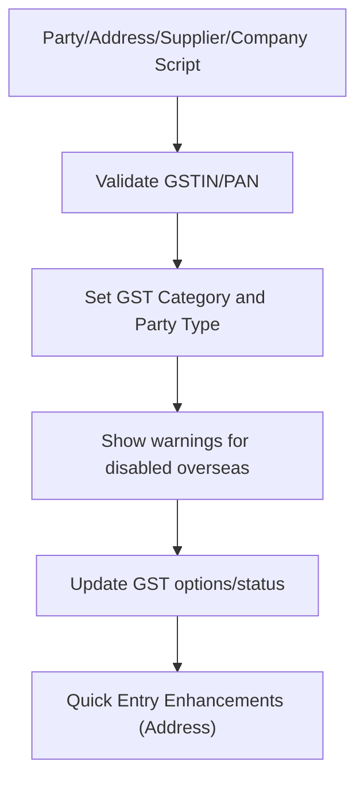
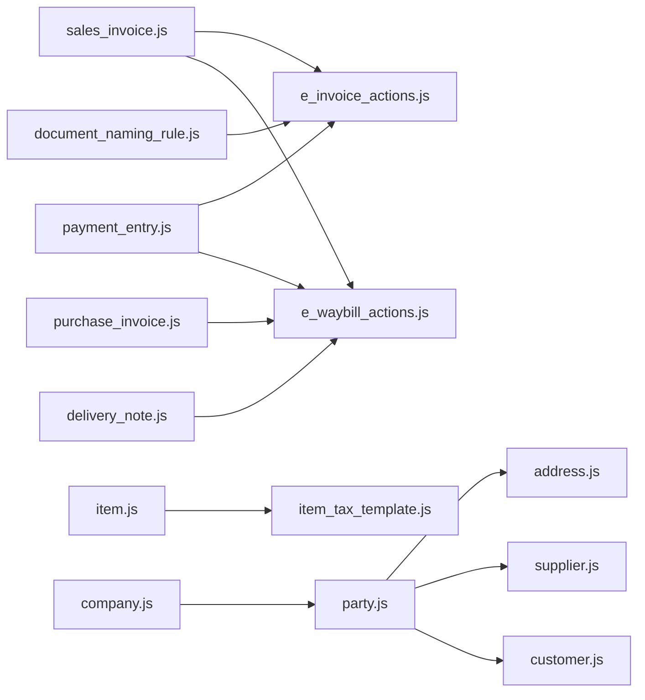

# ERPNext Client Scripts & Document Automation

<cite>
**Referenced Files in This Document**
- [sales_invoice.js](file://india_compliance/gst_india/client_scripts/sales_invoice.js)
- [purchase_invoice.js](file://india_compliance/gst_india/client_scripts/purchase_invoice.js)
- [delivery_note.js](file://india_compliance/gst_india/client_scripts/delivery_note.js)
- [company.js](file://india_compliance/gst_india/client_scripts/company.js)
- [customer.js](file://india_compliance/gst_india/client_scripts/customer.js)
- [item.js](file://india_compliance/gst_india/client_scripts/item.js)
- [party.js](file://india_compliance/gst_india/client_scripts/party.js)
- [payment_entry.js](file://india_compliance/gst_india/client_scripts/payment_entry.js)
- [e_invoice_actions.js](file://india_compliance/gst_india/client_scripts/e_invoice_actions.js)
- [e_waybill_actions.js](file://india_compliance/gst_india/client_scripts/e_waybill_actions.js)
- [address.js](file://india_compliance/gst_india/client_scripts/address.js)
- [supplier.js](file://india_compliance/gst_india/client_scripts/supplier.js)
- [item_tax_template.js](file://india_compliance/gst_india/client_scripts/item_tax_template.js)
- [document_naming_rule.js](file://india_compliance/gst_india/client_scripts/document_naming_rule.js)
- [e_waybill_applicability.js](file://india_compliance/gst_india/client_scripts/e_waybill_applicability.js)
</cite>

## Table of Contents
1. [Introduction](#introduction)
2. [Project Structure](#project-structure)
3. [Core Components](#core-components)
4. [Architecture Overview](#architecture-overview)
5. [Detailed Component Analysis](#detailed-component-analysis)
6. [Dependency Analysis](#dependency-analysis)
7. [Performance Considerations](#performance-considerations)
8. [Troubleshooting Guide](#troubleshooting-guide)
9. [Conclusion](#conclusion)
10. [Appendices](#appendices)

## Introduction
This document explains the ERPNext client scripts that automate document interactions and validations for Indian compliance workflows. It focuses on:
- Client script architecture and execution patterns
- Transaction automation for Sales Invoice, Purchase Invoice, Delivery Note, and related documents
- Setup wizard automation, quick entry enhancements, and popover utilities
- Client script lifecycle, event handlers, and data manipulation patterns
- Examples of field validation, dynamic calculations, and UI enhancements
- Debugging, error handling, and performance considerations
- Integration with ERPNext’s client script framework and best practices

## Project Structure
The client scripts are organized by document type under the gst_india client_scripts folder. Each script binds to specific form events and integrates with shared utilities for GST applicability, e-waybill/e-invoice actions, and party/address validations.

**Diagram sources**
- [sales_invoice.js](file://india_compliance/gst_india/client_scripts/sales_invoice.js#L1-L97)
- [purchase_invoice.js](file://india_compliance/gst_india/client_scripts/purchase_invoice.js#L1-L131)
- [delivery_note.js](file://india_compliance/gst_india/client_scripts/delivery_note.js#L1-L29)
- [payment_entry.js](file://india_compliance/gst_india/client_scripts/payment_entry.js#L1-L169)
- [e_invoice_actions.js](file://india_compliance/gst_india/client_scripts/e_invoice_actions.js#L1-L422)
- [e_waybill_actions.js](file://india_compliance/gst_india/client_scripts/e_waybill_actions.js#L1-L800)
- [e_waybill_applicability.js](file://india_compliance/gst_india/client_scripts/e_waybill_applicability.js#L1-L364)
- [item.js](file://india_compliance/gst_india/client_scripts/item.js#L1-L20)
- [item_tax_template.js](file://india_compliance/gst_india/client_scripts/item_tax_template.js#L1-L99)
- [party.js](file://india_compliance/gst_india/client_scripts/party.js#L1-L173)
- [address.js](file://india_compliance/gst_india/client_scripts/address.js#L1-L84)
- [supplier.js](file://india_compliance/gst_india/client_scripts/supplier.js#L1-L28)
- [company.js](file://india_compliance/gst_india/client_scripts/company.js#L1-L56)
- [customer.js](file://india_compliance/gst_india/client_scripts/customer.js#L1-L10)
- [document_naming_rule.js](file://india_compliance/gst_india/client_scripts/document_naming_rule.js#L1-L8)

**Section sources**
- [sales_invoice.js](file://india_compliance/gst_india/client_scripts/sales_invoice.js#L1-L97)
- [purchase_invoice.js](file://india_compliance/gst_india/client_scripts/purchase_invoice.js#L1-L131)
- [delivery_note.js](file://india_compliance/gst_india/client_scripts/delivery_note.js#L1-L29)
- [company.js](file://india_compliance/gst_india/client_scripts/company.js#L1-L56)
- [customer.js](file://india_compliance/gst_india/client_scripts/customer.js#L1-L10)
- [item.js](file://india_compliance/gst_india/client_scripts/item.js#L1-L20)
- [party.js](file://india_compliance/gst_india/client_scripts/party.js#L1-L173)
- [payment_entry.js](file://india_compliance/gst_india/client_scripts/payment_entry.js#L1-L169)
- [e_invoice_actions.js](file://india_compliance/gst_india/client_scripts/e_invoice_actions.js#L1-L422)
- [e_waybill_actions.js](file://india_compliance/gst_india/client_scripts/e_waybill_actions.js#L1-L800)
- [address.js](file://india_compliance/gst_india/client_scripts/address.js#L1-L84)
- [supplier.js](file://india_compliance/gst_india/client_scripts/supplier.js#L1-L28)
- [item_tax_template.js](file://india_compliance/gst_india/client_scripts/item_tax_template.js#L1-L99)
- [document_naming_rule.js](file://india_compliance/gst_india/client_scripts/document_naming_rule.js#L1-L8)
- [e_waybill_applicability.js](file://india_compliance/gst_india/client_scripts/e_waybill_applicability.js#L1-L364)

## Core Components
- Event-driven client scripts bound via frappe.ui.form.on for each doctype
- Shared utilities for GST applicability checks, e-waybill/e-invoice actions, and party/address validations
- Dynamic UI updates: custom buttons, alerts, dashboards, and field options
- Automated workflows: auto-generation triggers, reverse charge toggles, and reconciliation indicators

Key capabilities:
- Validation and warnings for GST applicability and missing fields
- Auto-generation of e-waybills/e-invoices based on settings and applicability
- Reverse charge toggling for overseas suppliers
- Quick entry enhancements for Address and Item Tax Template
- Reconciliation status indicators for Payment Entry outstanding documents

**Section sources**
- [sales_invoice.js](file://india_compliance/gst_india/client_scripts/sales_invoice.js#L4-L57)
- [purchase_invoice.js](file://india_compliance/gst_india/client_scripts/purchase_invoice.js#L4-L92)
- [delivery_note.js](file://india_compliance/gst_india/client_scripts/delivery_note.js#L4-L28)
- [payment_entry.js](file://india_compliance/gst_india/client_scripts/payment_entry.js#L11-L57)
- [e_invoice_actions.js](file://india_compliance/gst_india/client_scripts/e_invoice_actions.js#L1-L154)
- [e_waybill_actions.js](file://india_compliance/gst_india/client_scripts/e_waybill_actions.js#L10-L242)
- [party.js](file://india_compliance/gst_india/client_scripts/party.js#L3-L173)
- [item.js](file://india_compliance/gst_india/client_scripts/item.js#L1-L20)
- [item_tax_template.js](file://india_compliance/gst_india/client_scripts/item_tax_template.js#L1-L99)
- [address.js](file://india_compliance/gst_india/client_scripts/address.js#L1-L84)
- [supplier.js](file://india_compliance/gst_india/client_scripts/supplier.js#L1-L28)
- [company.js](file://india_compliance/gst_india/client_scripts/company.js#L1-L56)
- [customer.js](file://india_compliance/gst_india/client_scripts/customer.js#L1-L10)
- [document_naming_rule.js](file://india_compliance/gst_india/client_scripts/document_naming_rule.js#L1-L8)

## Architecture Overview
The client scripts follow a layered pattern:
- Document-specific scripts bind to form events and orchestrate UI and workflow actions
- Shared applicability and action modules encapsulate reusable logic for e-waybill/e-invoice
- Party/address scripts centralize GST validation and category inference
- Utilities integrate with backend APIs for real-time updates and validations

**Diagram sources**
- [e_waybill_actions.js](file://india_compliance/gst_india/client_scripts/e_waybill_actions.js#L32-L192)
- [e_invoice_actions.js](file://india_compliance/gst_india/client_scripts/e_invoice_actions.js#L1-L81)
- [sales_invoice.js](file://india_compliance/gst_india/client_scripts/sales_invoice.js#L31-L57)

## Detailed Component Analysis

### Sales Invoice Client Script
Responsibilities:
- Bind transport queries and sandbox mode indicator
- Warn when GST is applicable but no tax accounts are charged
- Manage e-waybill status options and thresholds
- Show alerts for missing billing address during save

**Diagram sources**
- [sales_invoice.js](file://india_compliance/gst_india/client_scripts/sales_invoice.js#L31-L80)

**Section sources**
- [sales_invoice.js](file://india_compliance/gst_india/client_scripts/sales_invoice.js#L1-L97)

### Purchase Invoice Client Script
Responsibilities:
- Transport queries and reverse charge toggling based on GST category
- HSN code validation for overseas purchases
- Reconciliation status integration and “Bill of Entry” button for overseas
- Auto-linking after submit for inward supplies

**Diagram sources**
- [purchase_invoice.js](file://india_compliance/gst_india/client_scripts/purchase_invoice.js#L21-L68)
- [party.js](file://india_compliance/gst_india/client_scripts/party.js#L101-L118)

**Section sources**
- [purchase_invoice.js](file://india_compliance/gst_india/client_scripts/purchase_invoice.js#L1-L131)
- [party.js](file://india_compliance/gst_india/client_scripts/party.js#L101-L118)

### Delivery Note Client Script
Responsibilities:
- Port address query and sandbox indicator for e-waybill
- Alert for missing billing address when e-waybill is not generatable

**Section sources**
- [delivery_note.js](file://india_compliance/gst_india/client_scripts/delivery_note.js#L1-L29)

### Payment Entry Client Script
Responsibilities:
- Override outstanding documents to inject reconciliation status
- Add warning icons for unreconciled Purchase Invoice references
- Fetch company address and update GST details for parties

**Diagram sources**
- [payment_entry.js](file://india_compliance/gst_india/client_scripts/payment_entry.js#L59-L142)

**Section sources**
- [payment_entry.js](file://india_compliance/gst_india/client_scripts/payment_entry.js#L1-L169)

### e-Invoice Actions
Responsibilities:
- Add custom buttons for e-invoice: Applicability Status, Generate, Mark as Generated, Cancel
- Auto-generate e-invoice on submit based on settings
- Validate cancellation conditions and handle sandbox/manual flows

**Diagram sources**
- [e_invoice_actions.js](file://india_compliance/gst_india/client_scripts/e_invoice_actions.js#L1-L154)

**Section sources**
- [e_invoice_actions.js](file://india_compliance/gst_india/client_scripts/e_invoice_actions.js#L1-L422)

### e-Waybill Actions
Responsibilities:
- Centralized e-waybill UI and actions for multiple doctypes
- Generatable status, auto-generate on submit, update vehicle info, extend validity, cancel
- Real-time PDF attachment notifications and dashboard comments

**Diagram sources**
- [e_waybill_applicability.js](file://india_compliance/gst_india/client_scripts/e_waybill_applicability.js#L1-L364)
- [e_waybill_actions.js](file://india_compliance/gst_india/client_scripts/e_waybill_actions.js#L10-L242)

**Section sources**
- [e_waybill_actions.js](file://india_compliance/gst_india/client_scripts/e_waybill_actions.js#L1-L800)
- [e_waybill_applicability.js](file://india_compliance/gst_india/client_scripts/e_waybill_applicability.js#L1-L364)

### Party, Address, Supplier, Customer, Company Scripts
Responsibilities:
- GSTIN/PAN validation and deduplication
- GST category inference and party type mapping
- GST options/status display and overseas transaction warnings
- Address defaulting from linked parties and quick entry enhancements
- Supplier transporter ID auto-fill and validation

**Diagram sources**
- [party.js](file://india_compliance/gst_india/client_scripts/party.js#L3-L173)
- [address.js](file://india_compliance/gst_india/client_scripts/address.js#L1-L84)
- [supplier.js](file://india_compliance/gst_india/client_scripts/supplier.js#L1-L28)
- [company.js](file://india_compliance/gst_india/client_scripts/company.js#L1-L56)
- [customer.js](file://india_compliance/gst_india/client_scripts/customer.js#L1-L10)

**Section sources**
- [party.js](file://india_compliance/gst_india/client_scripts/party.js#L1-L173)
- [address.js](file://india_compliance/gst_india/client_scripts/address.js#L1-L84)
- [supplier.js](file://india_compliance/gst_india/client_scripts/supplier.js#L1-L28)
- [company.js](file://india_compliance/gst_india/client_scripts/company.js#L1-L56)
- [customer.js](file://india_compliance/gst_india/client_scripts/customer.js#L1-L10)

### Item and Item Tax Template Scripts
Responsibilities:
- Auto-fill taxes from HSN code if missing
- Dynamic tax rate calculation based on GST accounts and rates
- Banner for missing GST accounts and one-click fetch/update

**Section sources**
- [item.js](file://india_compliance/gst_india/client_scripts/item.js#L1-L20)
- [item_tax_template.js](file://india_compliance/gst_india/client_scripts/item_tax_template.js#L1-L99)

### Document Naming Rule Script
Responsibilities:
- Load transaction.js and show GST invoice number banner for naming rules

**Section sources**
- [document_naming_rule.js](file://india_compliance/gst_india/client_scripts/document_naming_rule.js#L1-L8)

## Dependency Analysis
- Document scripts depend on shared applicability and action modules
- Party/address scripts are reused across doctypes for validation and inference
- Payment Entry integrates with reconciliation utilities to enrich UI
- e-Waybill/e-Invoice actions rely on backend APIs and server-side utilities

**Diagram sources**
- [sales_invoice.js](file://india_compliance/gst_india/client_scripts/sales_invoice.js#L1-L97)
- [purchase_invoice.js](file://india_compliance/gst_india/client_scripts/purchase_invoice.js#L1-L131)
- [delivery_note.js](file://india_compliance/gst_india/client_scripts/delivery_note.js#L1-L29)
- [payment_entry.js](file://india_compliance/gst_india/client_scripts/payment_entry.js#L1-L169)
- [e_invoice_actions.js](file://india_compliance/gst_india/client_scripts/e_invoice_actions.js#L1-L422)
- [e_waybill_actions.js](file://india_compliance/gst_india/client_scripts/e_waybill_actions.js#L1-L800)
- [item.js](file://india_compliance/gst_india/client_scripts/item.js#L1-L20)
- [item_tax_template.js](file://india_compliance/gst_india/client_scripts/item_tax_template.js#L1-L99)
- [party.js](file://india_compliance/gst_india/client_scripts/party.js#L1-L173)
- [address.js](file://india_compliance/gst_india/client_scripts/address.js#L1-L84)
- [supplier.js](file://india_compliance/gst_india/client_scripts/supplier.js#L1-L28)
- [customer.js](file://india_compliance/gst_india/client_scripts/customer.js#L1-L10)
- [company.js](file://india_compliance/gst_india/client_scripts/company.js#L1-L56)
- [document_naming_rule.js](file://india_compliance/gst_india/client_scripts/document_naming_rule.js#L1-L8)

**Section sources**
- [e_waybill_actions.js](file://india_compliance/gst_india/client_scripts/e_waybill_actions.js#L1-L800)
- [e_invoice_actions.js](file://india_compliance/gst_india/client_scripts/e_invoice_actions.js#L1-L422)
- [party.js](file://india_compliance/gst_india/client_scripts/party.js#L1-L173)
- [payment_entry.js](file://india_compliance/gst_india/client_scripts/payment_entry.js#L1-L169)

## Performance Considerations
- Debounce or batch UI updates when validating multiple fields (e.g., HSN code and taxes)
- Use caching for company GST accounts to avoid repeated server calls
- Avoid heavy DOM manipulations in refresh handlers; prefer targeted updates
- Limit frequent AJAX calls by leveraging ERPNext’s last_response and after_ajax hooks
- Use async/await to prevent blocking UI while waiting for server responses

[No sources needed since this section provides general guidance]

## Troubleshooting Guide
Common issues and resolutions:
- e-Invoice generation blocked by applicability checks: review company GSTIN, billing address GSTIN, item tax treatments, and invoice number validation
- e-Waybill not generating: confirm party addresses, GSTIN differences, threshold limits, and applicability dates
- Payment Entry reconciliation warnings: ensure outstanding documents are reconciled; unresolved entries show warning icons
- Party validation errors: verify GSTIN length/format and PAN validity; ensure overseas transactions are enabled in settings
- Address quick entry: use the “Update Address” button to sync GST fields from linked parties

**Section sources**
- [e_invoice_actions.js](file://india_compliance/gst_india/client_scripts/e_invoice_actions.js#L325-L421)
- [e_waybill_actions.js](file://india_compliance/gst_india/client_scripts/e_waybill_actions.js#L254-L349)
- [payment_entry.js](file://india_compliance/gst_india/client_scripts/payment_entry.js#L116-L142)
- [party.js](file://india_compliance/gst_india/client_scripts/party.js#L48-L99)
- [address.js](file://india_compliance/gst_india/client_scripts/address.js#L55-L83)

## Conclusion
ERPNext client scripts in this module provide a robust, event-driven automation layer for Indian compliance workflows. By centralizing applicability checks, e-waybill/e-invoice actions, and party/address validations, the scripts streamline document creation, reduce manual errors, and enhance user productivity. Following the best practices outlined here ensures maintainable, performant, and user-friendly extensions.

[No sources needed since this section summarizes without analyzing specific files]

## Appendices

### Client Script Lifecycle and Event Handlers
- setup: initialize queries and runtime settings
- refresh: update UI, add custom buttons, and dashboard comments
- before_save/onload: pre-save adjustments and initializations
- after_save: post-save alerts and cross-document updates
- on_submit/before_cancel: auto-generation and controlled cancellations

**Section sources**
- [sales_invoice.js](file://india_compliance/gst_india/client_scripts/sales_invoice.js#L4-L57)
- [purchase_invoice.js](file://india_compliance/gst_india/client_scripts/purchase_invoice.js#L4-L92)
- [e_invoice_actions.js](file://india_compliance/gst_india/client_scripts/e_invoice_actions.js#L82-L153)
- [e_waybill_actions.js](file://india_compliance/gst_india/client_scripts/e_waybill_actions.js#L193-L241)

### Data Manipulation Patterns
- Dynamic field options and statuses (e.g., e-waybill status)
- Conditional read-only toggles (reverse charge)
- Auto-fill from master data (HSN taxes, GST options)
- Dashboard comments and alerts for warnings

**Section sources**
- [sales_invoice.js](file://india_compliance/gst_india/client_scripts/sales_invoice.js#L74-L80)
- [purchase_invoice.js](file://india_compliance/gst_india/client_scripts/purchase_invoice.js#L105-L118)
- [item.js](file://india_compliance/gst_india/client_scripts/item.js#L6-L18)
- [party.js](file://india_compliance/gst_india/client_scripts/party.js#L143-L151)

### Integration Best Practices
- Keep shared logic in dedicated modules (applicability, actions, validations)
- Use ERPNext’s form handlers and event hooks consistently
- Leverage server-side utilities for validations and auto-generation
- Provide clear user feedback via dialogs, alerts, and dashboard comments

[No sources needed since this section provides general guidance]