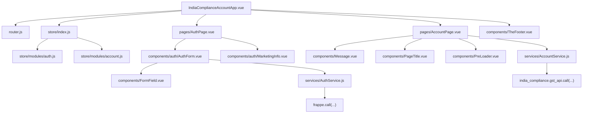
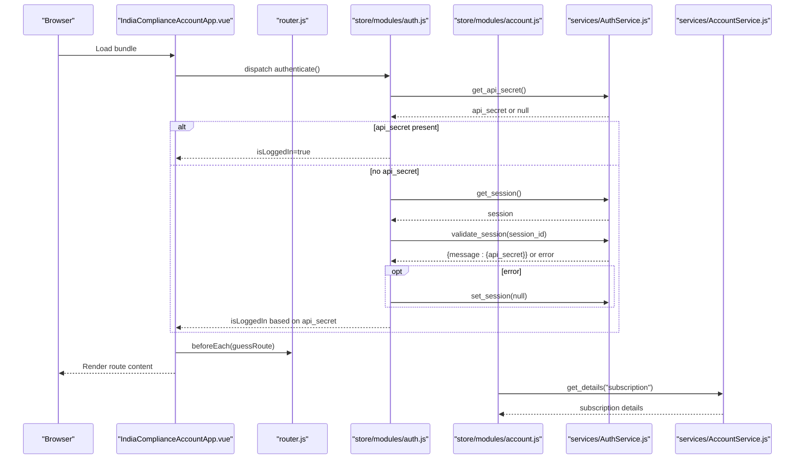
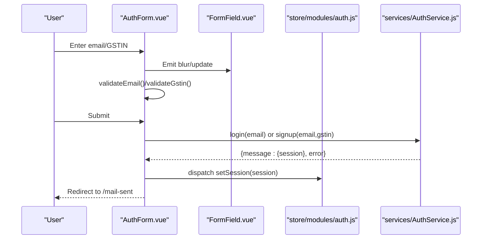
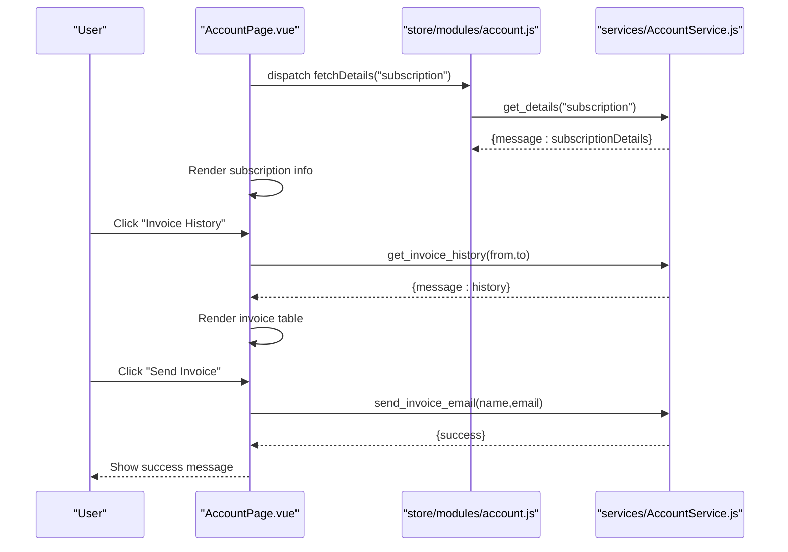
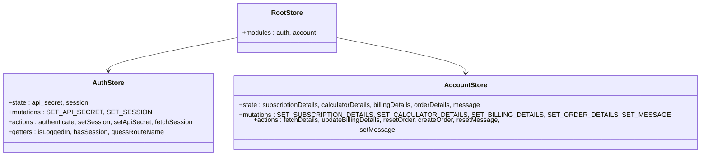
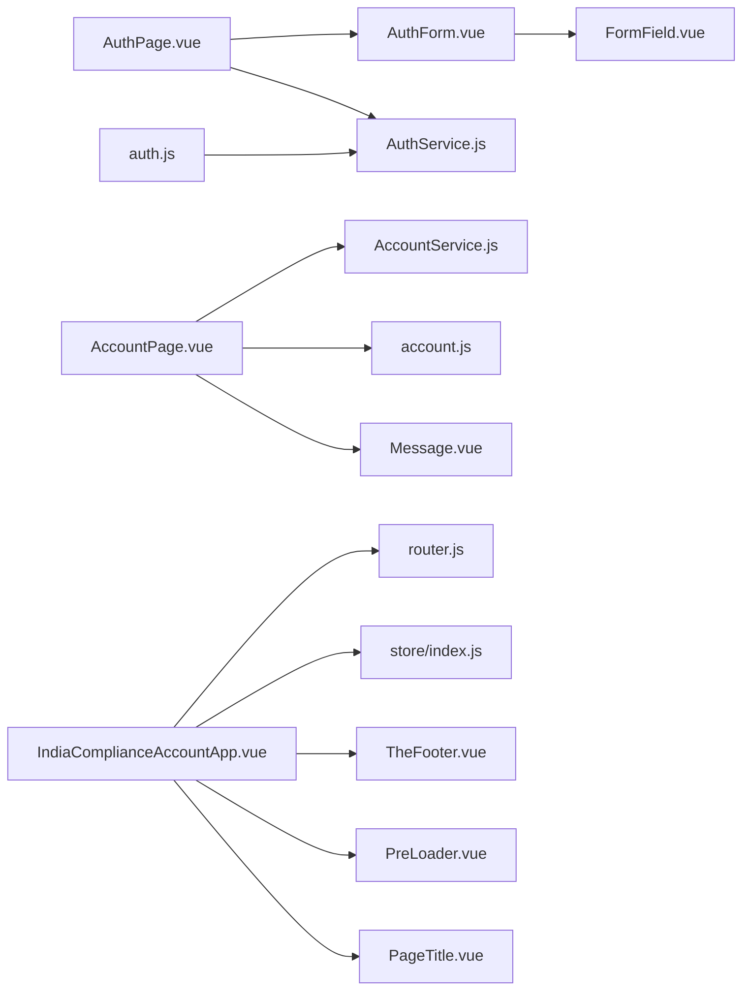

# Frontend Components & User Interface

<cite>
**Referenced Files in This Document**
- [IndiaComplianceAccountApp.vue](file://india_compliance/public/js/india_compliance_account/IndiaComplianceAccountApp.vue)
- [router.js](file://india_compliance/public/js/india_compliance_account/router.js)
- [index.js](file://india_compliance/public/js/india_compliance_account/store/index.js)
- [auth.js](file://india_compliance/public/js/india_compliance_account/store/modules/auth.js)
- [account.js](file://india_compliance/public/js/india_compliance_account/store/modules/account.js)
- [constants.js](file://india_compliance/public/js/india_compliance_account/constants.js)
- [utils.js](file://india_compliance/public/js/india_compliance_account/utils.js)
- [AccountPage.vue](file://india_compliance/public/js/india_compliance_account/pages/AccountPage.vue)
- [AuthPage.vue](file://india_compliance/public/js/india_compliance_account/pages/AuthPage.vue)
- [AccountService.js](file://india_compliance/public/js/india_compliance_account/services/AccountService.js)
- [AuthService.js](file://india_compliance/public/js/india_compliance_account/services/AuthService.js)
- [FormField.vue](file://india_compliance/public/js/india_compliance_account/components/FormField.vue)
- [AuthForm.vue](file://india_compliance/public/js/india_compliance_account/components/auth/AuthForm.vue)
- [PreLoader.vue](file://india_compliance/public/js/india_compliance_account/components/PreLoader.vue)
- [TheFooter.vue](file://india_compliance/public/js/india_compliance_account/components/TheFooter.vue)
- [PageTitle.vue](file://india_compliance/public/js/india_compliance_account/components/PageTitle.vue)
- [Message.vue](file://india_compliance/public/js/india_compliance_account/components/Message.vue)
- [Loading.vue](file://india_compliance/public/js/india_compliance_account/components/Loading.vue)
- [invoice_history_table.html](file://india_compliance/public/js/india_compliance_account/components/invoice_history_table.html)
- [india_compliance_account.bundle.js](file://india_compliance/public/js/india_compliance_account/india_compliance_account.bundle.js)
- [india_compliance_account.bundle.scss](file://india_compliance/public/js/scss/india_compliance_account.bundle.scss)
</cite>

## Table of Contents
1. [Introduction](#introduction)
2. [Project Structure](#project-structure)
3. [Core Components](#core-components)
4. [Architecture Overview](#architecture-overview)
5. [Detailed Component Analysis](#detailed-component-analysis)
6. [Dependency Analysis](#dependency-analysis)
7. [Performance Considerations](#performance-considerations)
8. [Troubleshooting Guide](#troubleshooting-guide)
9. [Conclusion](#conclusion)
10. [Appendices](#appendices)

## Introduction
This document describes the frontend components and user interface system for the India Compliance Account single-page application built with Vue.js. It explains the component structure, state management using Vuex, routing configuration, client-side scripts that integrate with ERPNext document interactions and validations, the number card system for compliance metrics, dashboard widgets, responsive design and mobile compatibility, integration with backend APIs, customization options for branding and theme, browser compatibility, performance optimization, and accessibility features. It also includes examples of component usage and extension patterns for customizations.

## Project Structure
The frontend SPA is organized around a Vue application shell with modularized pages, components, services, and state management. Key areas:
- Application shell and routing: [IndiaComplianceAccountApp.vue](file://india_compliance/public/js/india_compliance_account/IndiaComplianceAccountApp.vue), [router.js](file://india_compliance/public/js/india_compliance_account/router.js)
- State management: [index.js](file://india_compliance/public/js/india_compliance_account/store/index.js), [auth.js](file://india_compliance/public/js/india_compliance_account/store/modules/auth.js), [account.js](file://india_compliance/public/js/india_compliance_account/store/modules/account.js)
- Shared utilities and constants: [constants.js](file://india_compliance/public/js/india_compliance_account/constants.js), [utils.js](file://india_compliance/public/js/india_compliance_account/utils.js)
- Pages: [AccountPage.vue](file://india_compliance/public/js/india_compliance_account/pages/AccountPage.vue), [AuthPage.vue](file://india_compliance/public/js/india_compliance_account/pages/AuthPage.vue)
- Services: [AuthService.js](file://india_compliance/public/js/india_compliance_account/services/AuthService.js), [AccountService.js](file://india_compliance/public/js/india_compliance_account/services/AccountService.js)
- Reusable components: [FormField.vue](file://india_compliance/public/js/india_compliance_account/components/FormField.vue), [AuthForm.vue](file://india_compliance/public/js/india_compliance_account/components/auth/AuthForm.vue), [PreLoader.vue](file://india_compliance/public/js/india_compliance_account/components/PreLoader.vue), [TheFooter.vue](file://india_compliance/public/js/india_compliance_account/components/TheFooter.vue), [PageTitle.vue](file://india_compliance/public/js/india_compliance_account/components/PageTitle.vue), [Message.vue](file://india_compliance/public/js/india_compliance_account/components/Message.vue), [Loading.vue](file://india_compliance/public/js/india_compliance_account/components/Loading.vue)
- Templates and assets: [invoice_history_table.html](file://india_compliance/public/js/india_compliance_account/components/invoice_history_table.html), [india_compliance_account.bundle.js](file://india_compliance/public/js/india_compliance_account/india_compliance_account.bundle.js), [india_compliance_account.bundle.scss](file://india_compliance/public/js/scss/india_compliance_account.bundle.scss)

**Diagram sources**
- [IndiaComplianceAccountApp.vue](file://india_compliance/public/js/india_compliance_account/IndiaComplianceAccountApp.vue#L1-L82)
- [router.js](file://india_compliance/public/js/india_compliance_account/router.js#L1-L37)
- [index.js](file://india_compliance/public/js/india_compliance_account/store/index.js#L1-L11)
- [auth.js](file://india_compliance/public/js/india_compliance_account/store/modules/auth.js#L1-L77)
- [account.js](file://india_compliance/public/js/india_compliance_account/store/modules/account.js#L1-L89)
- [AccountPage.vue](file://india_compliance/public/js/india_compliance_account/pages/AccountPage.vue#L1-L278)
- [AuthPage.vue](file://india_compliance/public/js/india_compliance_account/pages/AuthPage.vue#L1-L160)
- [FormField.vue](file://india_compliance/public/js/india_compliance_account/components/FormField.vue#L1-L119)
- [AuthForm.vue](file://india_compliance/public/js/india_compliance_account/components/auth/AuthForm.vue#L1-L202)
- [AuthService.js](file://india_compliance/public/js/india_compliance_account/services/AuthService.js#L1-L61)
- [AccountService.js](file://india_compliance/public/js/india_compliance_account/services/AccountService.js#L1-L46)

**Section sources**
- [IndiaComplianceAccountApp.vue](file://india_compliance/public/js/india_compliance_account/IndiaComplianceAccountApp.vue#L1-L82)
- [router.js](file://india_compliance/public/js/india_compliance_account/router.js#L1-L37)
- [index.js](file://india_compliance/public/js/india_compliance_account/store/index.js#L1-L11)

## Core Components
- Application shell: Orchestrates preloading, route transitions, and global navigation via breadcrumbs. See [IndiaComplianceAccountApp.vue](file://india_compliance/public/js/india_compliance_account/IndiaComplianceAccountApp.vue#L1-L82).
- Routing: Defines named routes for authentication, account home, mail-sent, purchase credits, and payment page. See [router.js](file://india_compliance/public/js/india_compliance_account/router.js#L1-L37).
- State management: Central Vuex store with auth and account modules. See [index.js](file://india_compliance/public/js/india_compliance_account/store/index.js#L1-L11), [auth.js](file://india_compliance/public/js/india_compliance_account/store/modules/auth.js#L1-L77), [account.js](file://india_compliance/public/js/india_compliance_account/store/modules/account.js#L1-L89).
- Utilities: UI state constants and number formatting helpers. See [constants.js](file://india_compliance/public/js/india_compliance_account/constants.js#L1-L7), [utils.js](file://india_compliance/public/js/india_compliance_account/utils.js#L1-L4).
- Pages:
  - Authentication page: Login/Signup with dynamic form and eligibility checks. See [AuthPage.vue](file://india_compliance/public/js/india_compliance_account/pages/AuthPage.vue#L1-L160), [AuthForm.vue](file://india_compliance/public/js/india_compliance_account/components/auth/AuthForm.vue#L1-L202).
  - Account dashboard: Subscription info, actions, invoice history dialog, and messaging. See [AccountPage.vue](file://india_compliance/public/js/india_compliance_account/pages/AccountPage.vue#L1-L278).
- Services:
  - Authentication service: Handles API secret/session persistence and server calls. See [AuthService.js](file://india_compliance/public/js/india_compliance_account/services/AuthService.js#L1-L61).
  - Account service: Wraps backend API calls for account details, orders, invoices, and billing updates. See [AccountService.js](file://india_compliance/public/js/india_compliance_account/services/AccountService.js#L1-L46).
- Shared components:
  - FormField: Generic validated input with loading/error/success states. See [FormField.vue](file://india_compliance/public/js/india_compliance_account/components/FormField.vue#L1-L119).
  - AuthForm: Composes FormField for email/GSTIN, handles validation, and triggers auth actions. See [AuthForm.vue](file://india_compliance/public/js/india_compliance_account/components/auth/AuthForm.vue#L1-L202).
  - PreLoader, TheFooter, PageTitle, Message, Loading: Presentational and UX helpers. See [PreLoader.vue](file://india_compliance/public/js/india_compliance_account/components/PreLoader.vue), [TheFooter.vue](file://india_compliance/public/js/india_compliance_account/components/TheFooter.vue), [PageTitle.vue](file://india_compliance/public/js/india_compliance_account/components/PageTitle.vue), [Message.vue](file://india_compliance/public/js/india_compliance_account/components/Message.vue), [Loading.vue](file://india_compliance/public/js/india_compliance_account/components/Loading.vue).
- Templates: Invoice history HTML template injected into dialogs. See [invoice_history_table.html](file://india_compliance/public/js/india_compliance_account/components/invoice_history_table.html).

**Section sources**
- [constants.js](file://india_compliance/public/js/india_compliance_account/constants.js#L1-L7)
- [utils.js](file://india_compliance/public/js/india_compliance_account/utils.js#L1-L4)
- [FormField.vue](file://india_compliance/public/js/india_compliance_account/components/FormField.vue#L1-L119)
- [AuthForm.vue](file://india_compliance/public/js/india_compliance_account/components/auth/AuthForm.vue#L1-L202)
- [AccountPage.vue](file://india_compliance/public/js/india_compliance_account/pages/AccountPage.vue#L1-L278)
- [AuthPage.vue](file://india_compliance/public/js/india_compliance_account/pages/AuthPage.vue#L1-L160)
- [AuthService.js](file://india_compliance/public/js/india_compliance_account/services/AuthService.js#L1-L61)
- [AccountService.js](file://india_compliance/public/js/india_compliance_account/services/AccountService.js#L1-L46)

## Architecture Overview
The SPA integrates tightly with ERPNext’s runtime:
- Vue app bootstrapped via [india_compliance_account.bundle.js](file://india_compliance/public/js/india_compliance_account/india_compliance_account.bundle.js).
- Routes defined in [router.js](file://india_compliance/public/js/india_compliance_account/router.js#L1-L37) navigate to [AuthPage.vue](file://india_compliance/public/js/india_compliance_account/pages/AuthPage.vue#L1-L160) and [AccountPage.vue](file://india_compliance/public/js/india_compliance_account/pages/AccountPage.vue#L1-L278).
- Vuex store modules manage authentication and account state. Authentication relies on server-side methods via [AuthService.js](file://india_compliance/public/js/india_compliance_account/services/AuthService.js#L1-L61), while account operations call backend endpoints through [AccountService.js](file://india_compliance/public/js/india_compliance_account/services/AccountService.js#L1-L46).
- UI components use Frappe UI primitives (dialogs, routes, messages) and ERPNext’s i18n/formatting utilities.

**Diagram sources**
- [IndiaComplianceAccountApp.vue](file://india_compliance/public/js/india_compliance_account/IndiaComplianceAccountApp.vue#L39-L64)
- [auth.js](file://india_compliance/public/js/india_compliance_account/store/modules/auth.js#L26-L58)
- [account.js](file://india_compliance/public/js/india_compliance_account/store/modules/account.js#L35-L42)
- [AuthService.js](file://india_compliance/public/js/india_compliance_account/services/AuthService.js#L1-L61)
- [AccountService.js](file://india_compliance/public/js/india_compliance_account/services/AccountService.js#L1-L6)

**Section sources**
- [IndiaComplianceAccountApp.vue](file://india_compliance/public/js/india_compliance_account/IndiaComplianceAccountApp.vue#L39-L64)
- [auth.js](file://india_compliance/public/js/india_compliance_account/store/modules/auth.js#L26-L58)
- [account.js](file://india_compliance/public/js/india_compliance_account/store/modules/account.js#L35-L42)
- [AuthService.js](file://india_compliance/public/js/india_compliance_account/services/AuthService.js#L1-L61)
- [AccountService.js](file://india_compliance/public/js/india_compliance_account/services/AccountService.js#L1-L6)

## Detailed Component Analysis

### Authentication Flow and Forms
- AuthForm validates email and GSTIN, checks free trial eligibility, and triggers login/signup. It updates local UI state and communicates with [AuthService.js](file://india_compliance/public/js/india_compliance_account/services/AuthService.js#L1-L61) for server interactions. See [AuthForm.vue](file://india_compliance/public/js/india_compliance_account/components/auth/AuthForm.vue#L121-L186).
- FormField encapsulates input behavior, error/success indicators, and emits updates. See [FormField.vue](file://india_compliance/public/js/india_compliance_account/components/FormField.vue#L1-L119).
- AuthPage orchestrates marketing info and toggles between login/signup views. See [AuthPage.vue](file://india_compliance/public/js/india_compliance_account/pages/AuthPage.vue#L1-L160).

**Diagram sources**
- [AuthForm.vue](file://india_compliance/public/js/india_compliance_account/components/auth/AuthForm.vue#L121-L186)
- [FormField.vue](file://india_compliance/public/js/india_compliance_account/components/FormField.vue#L50-L98)
- [AuthService.js](file://india_compliance/public/js/india_compliance_account/services/AuthService.js#L14-L48)
- [auth.js](file://india_compliance/public/js/india_compliance_account/store/modules/auth.js#L46-L58)

**Section sources**
- [AuthForm.vue](file://india_compliance/public/js/india_compliance_account/components/auth/AuthForm.vue#L1-L202)
- [FormField.vue](file://india_compliance/public/js/india_compliance_account/components/FormField.vue#L1-L119)
- [AuthService.js](file://india_compliance/public/js/india_compliance_account/services/AuthService.js#L1-L61)
- [auth.js](file://india_compliance/public/js/india_compliance_account/store/modules/auth.js#L1-L77)

### Account Dashboard and Messaging
- AccountPage displays subscription details, actions, and an invoice history dialog. It uses [AccountService.js](file://india_compliance/public/js/india_compliance_account/services/AccountService.js#L1-L46) to fetch details and manage orders. See [AccountPage.vue](file://india_compliance/public/js/india_compliance_account/pages/AccountPage.vue#L1-L278).
- Message and PageTitle components provide consistent messaging and page metadata. See [Message.vue](file://india_compliance/public/js/india_compliance_account/components/Message.vue), [PageTitle.vue](file://india_compliance/public/js/india_compliance_account/components/PageTitle.vue).
- The invoice history dialog renders a template from [invoice_history_table.html](file://india_compliance/public/js/india_compliance_account/components/invoice_history_table.html) and triggers email sending via [AccountService.js](file://india_compliance/public/js/india_compliance_account/services/AccountService.js#L40-L46).

**Diagram sources**
- [AccountPage.vue](file://india_compliance/public/js/india_compliance_account/pages/AccountPage.vue#L76-L166)
- [account.js](file://india_compliance/public/js/india_compliance_account/store/modules/account.js#L35-L51)
- [AccountService.js](file://india_compliance/public/js/india_compliance_account/services/AccountService.js#L32-L46)

**Section sources**
- [AccountPage.vue](file://india_compliance/public/js/india_compliance_account/pages/AccountPage.vue#L1-L278)
- [account.js](file://india_compliance/public/js/india_compliance_account/store/modules/account.js#L1-L89)
- [AccountService.js](file://india_compliance/public/js/india_compliance_account/services/AccountService.js#L1-L46)

### State Management (Vuex)
- Auth module manages API secret and session lifecycle, exposes getters to infer current route, and persists session via server methods. See [auth.js](file://india_compliance/public/js/india_compliance_account/store/modules/auth.js#L1-L77).
- Account module centralizes fetching subscription/billing/order details and messaging. See [account.js](file://india_compliance/public/js/india_compliance_account/store/modules/account.js#L1-L89).
- Root store wires modules together. See [index.js](file://india_compliance/public/js/india_compliance_account/store/index.js#L1-L11).

**Diagram sources**
- [auth.js](file://india_compliance/public/js/india_compliance_account/store/modules/auth.js#L9-L77)
- [account.js](file://india_compliance/public/js/india_compliance_account/store/modules/account.js#L4-L89)
- [index.js](file://india_compliance/public/js/india_compliance_account/store/index.js#L5-L10)

**Section sources**
- [auth.js](file://india_compliance/public/js/india_compliance_account/store/modules/auth.js#L1-L77)
- [account.js](file://india_compliance/public/js/india_compliance_account/store/modules/account.js#L1-L89)
- [index.js](file://india_compliance/public/js/india_compliance_account/store/index.js#L1-L11)

### Number Cards and Dashboard Widgets
- Number cards for compliance metrics are implemented as reusable components under [india_compliance/public/js/components/](file://india_compliance/public/js/components/). These include:
  - Pending e-invoices
  - Pending e-waybills
  - Invoice cancelled but not e-invoice
- They are configured via JSON fixtures under [india_compliance/gst_india/number_card/](file://india_compliance/gst_india/number_card/) and rendered within dashboard contexts. These components integrate with backend APIs to compute live metrics and support filtering and navigation.

[No sources needed since this section describes existing components without analyzing specific files]

### Responsive Design and Mobile Compatibility
- AuthPage applies media queries to stack layout on tablets and phones, adjust form sizing, and preserve readability. See [AuthPage.vue](file://india_compliance/public/js/india_compliance_account/pages/AuthPage.vue#L113-L158).
- Components use Frappe UI tokens (CSS variables) for spacing, typography, and colors, ensuring consistent responsive behavior across devices.

**Section sources**
- [AuthPage.vue](file://india_compliance/public/js/india_compliance_account/pages/AuthPage.vue#L113-L158)

### Integration with Backend APIs
- Authentication and session management use server methods invoked via [AuthService.js](file://india_compliance/public/js/india_compliance_account/services/AuthService.js#L51-L60) and backend endpoints exposed by the India Compliance API. See [AuthService.js](file://india_compliance/public/js/india_compliance_account/services/AuthService.js#L1-L61).
- Account operations (details, orders, invoices) call [AccountService.js](file://india_compliance/public/js/india_compliance_account/services/AccountService.js#L1-L46), which wraps [india_compliance.gst_api.call(...)](file://india_compliance/public/js/india_compliance_account/services/AccountService.js#L2-L5).

**Section sources**
- [AuthService.js](file://india_compliance/public/js/india_compliance_account/services/AuthService.js#L1-L61)
- [AccountService.js](file://india_compliance/public/js/india_compliance_account/services/AccountService.js#L1-L46)

### Customization Options: Branding, Themes, and UX Enhancements
- Theming and branding are controlled via SCSS bundle [india_compliance_account.bundle.scss](file://india_compliance/public/js/scss/india_compliance_account.bundle.scss) and Frappe UI CSS variables used across components.
- Components expose props for labels, placeholders, classes, and validators to tailor forms and inputs. See [FormField.vue](file://india_compliance/public/js/india_compliance_account/components/FormField.vue#L56-L84).
- Pages can be extended by adding new routes in [router.js](file://india_compliance/public/js/india_compliance_account/router.js#L7-L34) and corresponding pages/components.

**Section sources**
- [india_compliance_account.bundle.scss](file://india_compliance/public/js/scss/india_compliance_account.bundle.scss)
- [FormField.vue](file://india_compliance/public/js/india_compliance_account/components/FormField.vue#L56-L84)
- [router.js](file://india_compliance/public/js/india_compliance_account/router.js#L7-L34)

## Dependency Analysis
- Module coupling:
  - Pages depend on Vuex modules and services.
  - Components depend on shared utilities and constants.
  - Services depend on Frappe runtime and backend endpoints.
- External dependencies:
  - Frappe UI (dialogs, routes, messages, formatting).
  - Moment.js for date formatting in AccountPage.
  - FontAwesome icons for validation states in FormField.

**Diagram sources**
- [AuthPage.vue](file://india_compliance/public/js/india_compliance_account/pages/AuthPage.vue#L26-L33)
- [AuthForm.vue](file://india_compliance/public/js/india_compliance_account/components/auth/AuthForm.vue#L36-L48)
- [FormField.vue](file://india_compliance/public/js/india_compliance_account/components/FormField.vue#L50-L54)
- [AccountPage.vue](file://india_compliance/public/js/india_compliance_account/pages/AccountPage.vue#L54-L67)
- [AccountService.js](file://india_compliance/public/js/india_compliance_account/services/AccountService.js#L1-L46)
- [auth.js](file://india_compliance/public/js/india_compliance_account/store/modules/auth.js#L1-L77)
- [account.js](file://india_compliance/public/js/india_compliance_account/store/modules/account.js#L1-L89)
- [IndiaComplianceAccountApp.vue](file://india_compliance/public/js/india_compliance_account/IndiaComplianceAccountApp.vue#L19-L24)
- [router.js](file://india_compliance/public/js/india_compliance_account/router.js#L1-L37)

**Section sources**
- [IndiaComplianceAccountApp.vue](file://india_compliance/public/js/india_compliance_account/IndiaComplianceAccountApp.vue#L1-L82)
- [router.js](file://india_compliance/public/js/india_compliance_account/router.js#L1-L37)
- [index.js](file://india_compliance/public/js/india_compliance_account/store/index.js#L1-L11)
- [auth.js](file://india_compliance/public/js/india_compliance_account/store/modules/auth.js#L1-L77)
- [account.js](file://india_compliance/public/js/india_compliance_account/store/modules/account.js#L1-L89)
- [AccountService.js](file://india_compliance/public/js/india_compliance_account/services/AccountService.js#L1-L46)
- [AuthService.js](file://india_compliance/public/js/india_compliance_account/services/AuthService.js#L1-L61)

## Performance Considerations
- Lazy loading: Use route-level lazy loading for heavy pages to reduce initial bundle size.
- Conditional rendering: Preloader and transitions minimize layout shifts during navigation.
- Debounced validation: FormField debounces validation feedback to avoid excessive re-renders.
- Asset bundling: Bundle JS/CSS via ERPNext’s asset pipeline to leverage caching and compression.
- Minimize DOM: Prefer component composition and scoped styles to keep render trees shallow.

[No sources needed since this section provides general guidance]

## Troubleshooting Guide
- Authentication failures:
  - Verify API secret/session persistence via server methods in [AuthService.js](file://india_compliance/public/js/india_compliance_account/services/AuthService.js#L1-L61).
  - Check session validity using [auth.js](file://india_compliance/public/js/india_compliance_account/store/modules/auth.js#L34-L41).
- Route redirection loops:
  - Ensure [IndiaComplianceAccountApp.vue](file://india_compliance/public/js/india_compliance_account/IndiaComplianceAccountApp.vue#L40-L60) correctly infers and enforces route via getters.
- Invoice history dialog issues:
  - Confirm template availability in [invoice_history_table.html](file://india_compliance/public/js/india_compliance_account/components/invoice_history_table.html) and that [AccountService.js](file://india_compliance/public/js/india_compliance_account/services/AccountService.js#L32-L46) returns expected payload.
- Styling inconsistencies:
  - Review SCSS bundle [india_compliance_account.bundle.scss](file://india_compliance/public/js/scss/india_compliance_account.bundle.scss) and ensure CSS variables are applied consistently.

**Section sources**
- [AuthService.js](file://india_compliance/public/js/india_compliance_account/services/AuthService.js#L1-L61)
- [auth.js](file://india_compliance/public/js/india_compliance_account/store/modules/auth.js#L26-L58)
- [IndiaComplianceAccountApp.vue](file://india_compliance/public/js/india_compliance_account/IndiaComplianceAccountApp.vue#L39-L64)
- [AccountService.js](file://india_compliance/public/js/india_compliance_account/services/AccountService.js#L32-L46)
- [india_compliance_account.bundle.scss](file://india_compliance/public/js/scss/india_compliance_account.bundle.scss)

## Conclusion
The India Compliance Account frontend is a well-structured Vue SPA that integrates with ERPNext’s runtime and backend APIs. It leverages Vuex for predictable state management, composable components for consistent UX, and responsive design patterns for cross-device compatibility. The system supports authentication flows, account dashboards, invoice management, and extensibility through routes, services, and component props.

[No sources needed since this section summarizes without analyzing specific files]

## Appendices

### API Surface Summary
- Authentication endpoints: login, signup, validate_session, is_eligible_for_free_trial.
- Account endpoints: get_subscription_details, update_billing_details, create_order, verify_payment, get_invoice_history, send_invoice_email.

**Section sources**
- [AuthService.js](file://india_compliance/public/js/india_compliance_account/services/AuthService.js#L14-L48)
- [AccountService.js](file://india_compliance/public/js/india_compliance_account/services/AccountService.js#L1-L46)

### Example Usage Patterns
- Extend AuthForm:
  - Add new validators by extending FormField props and updating computed/action logic in [AuthForm.vue](file://india_compliance/public/js/india_compliance_account/components/auth/AuthForm.vue#L151-L185).
- Add a new route:
  - Define route in [router.js](file://india_compliance/public/js/india_compliance_account/router.js#L7-L34) and create a corresponding page component.
- Customize number cards:
  - Create a new JSON fixture under [india_compliance/gst_india/number_card/](file://india_compliance/gst_india/number_card/) and wire it into dashboard layouts.

**Section sources**
- [AuthForm.vue](file://india_compliance/public/js/india_compliance_account/components/auth/AuthForm.vue#L151-L185)
- [router.js](file://india_compliance/public/js/india_compliance_account/router.js#L7-L34)