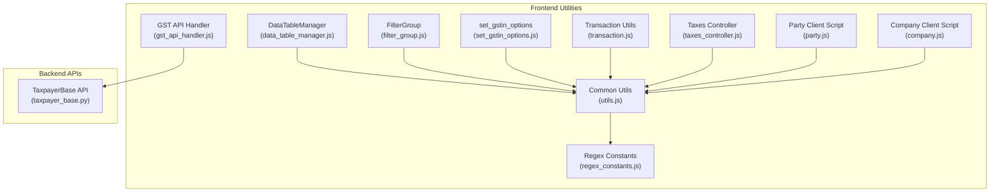
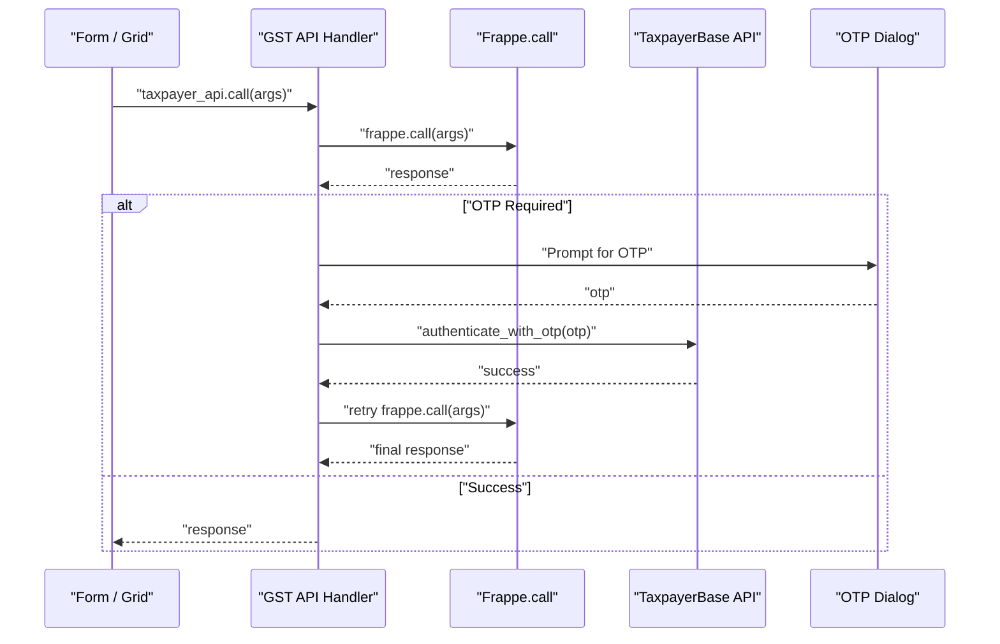
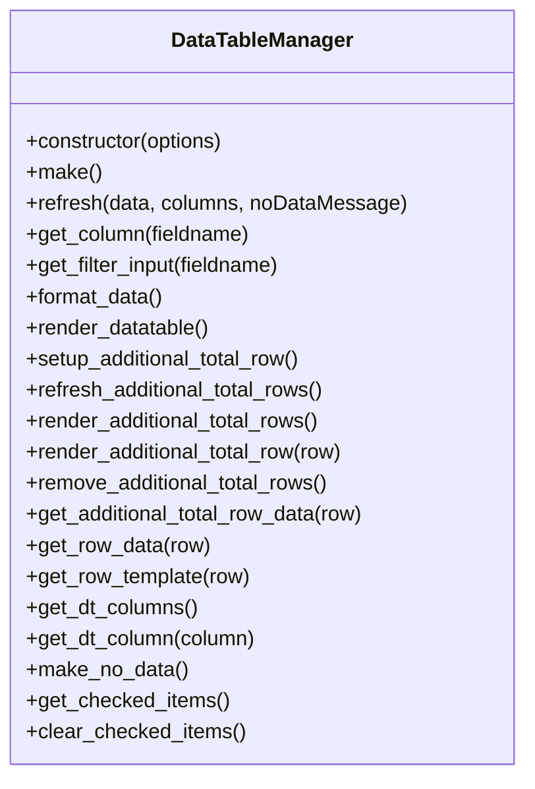
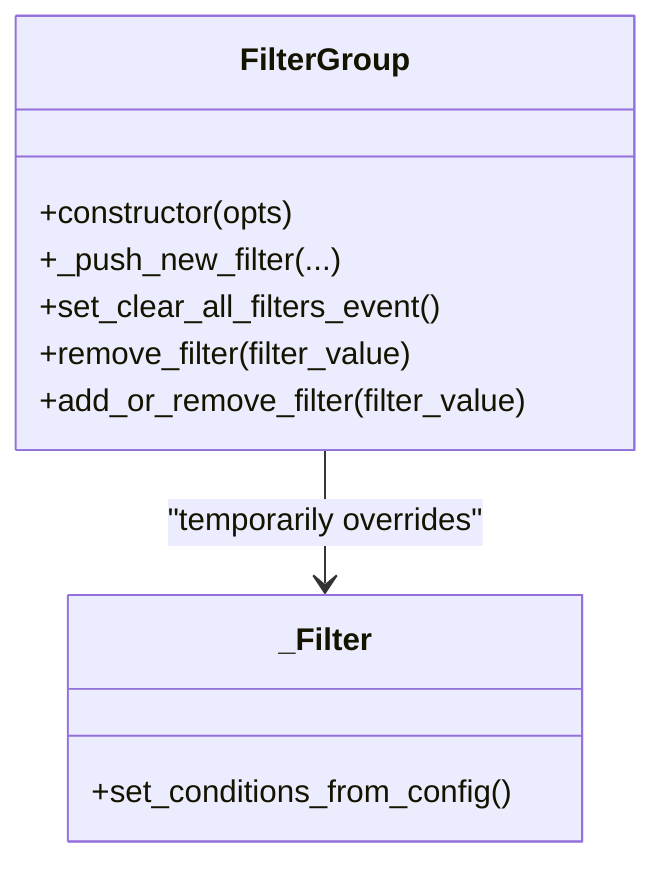
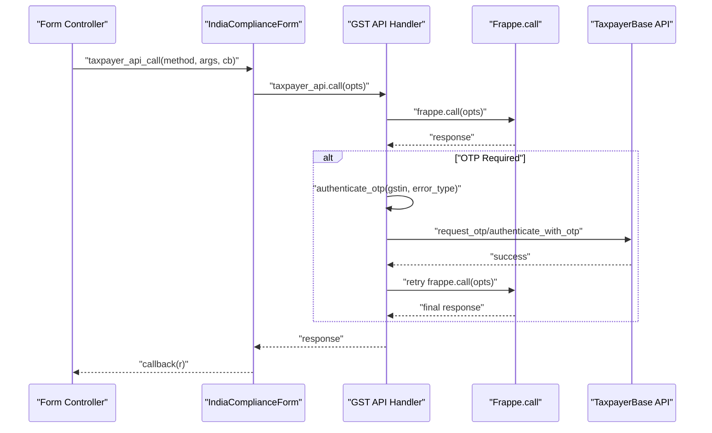
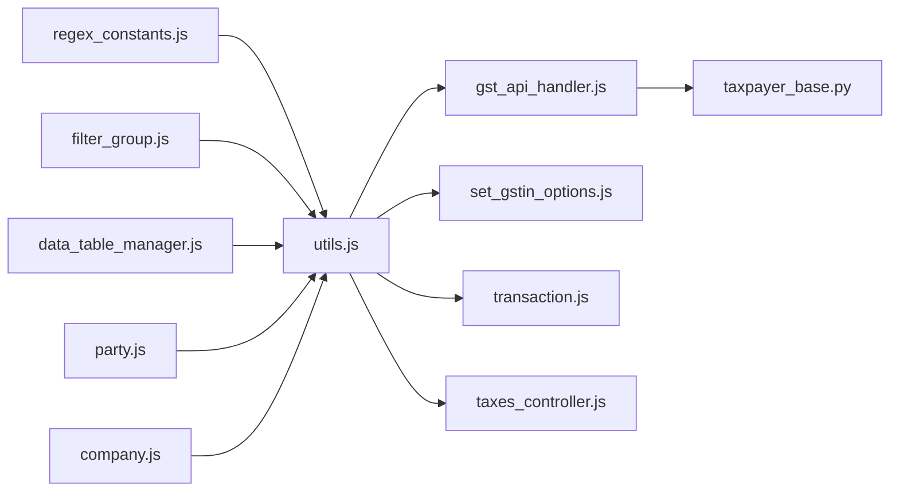

# Utility Components & Helper Scripts

<cite>
**Referenced Files in This Document**
- [data_table_manager.js](file://india_compliance/public/js/components/data_table_manager.js)
- [filter_group.js](file://india_compliance/public/js/components/filter_group.js)
- [set_gstin_options.js](file://india_compliance/public/js/components/set_gstin_options.js)
- [gst_api_handler.js](file://india_compliance/public/js/gst_api_handler.js)
- [regex_constants.js](file://india_compliance/public/js/regex_constants.js)
- [utils.js](file://india_compliance/public/js/utils.js)
- [party.js](file://india_compliance/gst_india/client_scripts/party.js)
- [company.js](file://india_compliance/gst_india/client_scripts/company.js)
- [transaction.js](file://india_compliance/public/js/transaction.js)
- [taxes_controller.js](file://india_compliance/public/js/taxes_controller.js)
- [taxpayer_base.py](file://india_compliance/gst_india/api_classes/taxpayer_base.py)
</cite>

## Table of Contents
1. [Introduction](#introduction)
2. [Project Structure](#project-structure)
3. [Core Components](#core-components)
4. [Architecture Overview](#architecture-overview)
5. [Detailed Component Analysis](#detailed-component-analysis)
6. [Dependency Analysis](#dependency-analysis)
7. [Performance Considerations](#performance-considerations)
8. [Troubleshooting Guide](#troubleshooting-guide)
9. [Conclusion](#conclusion)
10. [Appendices](#appendices)

## Introduction
This document explains the utility components and helper scripts that power common functionality across the frontend system. It focuses on:
- Data table manager for grid operations
- Filter group for search and filtering
- GSTIN options management
- GST API handler for government portal communication
- Regex constants for validation patterns
- Common helper functions for validation, formatting, and integration
It also covers usage examples, configuration options, error handling, data validation, performance optimization, and extension points for adding new utility components consistently.

## Project Structure
The utility ecosystem spans several JavaScript modules and Python backend APIs:
- Frontend components: data table manager, filter group, GSTIN options, GST API handler, regex constants, and general utilities
- Client scripts: party and company forms integrate validation and options
- Transaction utilities: centralized logic for GST details and validations
- Taxes controller: item-wise tax calculations and updates
- Backend API classes: OTP handling and authentication flows for GST returns

**Diagram sources**
- [data_table_manager.js](file://india_compliance/public/js/components/data_table_manager.js#L1-L265)
- [filter_group.js](file://india_compliance/public/js/components/filter_group.js#L1-L139)
- [set_gstin_options.js](file://india_compliance/public/js/components/set_gstin_options.js#L1-L25)
- [gst_api_handler.js](file://india_compliance/public/js/gst_api_handler.js#L1-L137)
- [regex_constants.js](file://india_compliance/public/js/regex_constants.js#L1-L22)
- [utils.js](file://india_compliance/public/js/utils.js#L1-L630)
- [taxes_controller.js](file://india_compliance/public/js/taxes_controller.js#L1-L288)
- [transaction.js](file://india_compliance/public/js/transaction.js#L1-L444)
- [party.js](file://india_compliance/gst_india/client_scripts/party.js#L1-L173)
- [company.js](file://india_compliance/gst_india/client_scripts/company.js#L1-L56)
- [taxpayer_base.py](file://india_compliance/gst_india/api_classes/taxpayer_base.py#L103-L186)

**Section sources**
- [data_table_manager.js](file://india_compliance/public/js/components/data_table_manager.js#L1-L265)
- [filter_group.js](file://india_compliance/public/js/components/filter_group.js#L1-L139)
- [set_gstin_options.js](file://india_compliance/public/js/components/set_gstin_options.js#L1-L25)
- [gst_api_handler.js](file://india_compliance/public/js/gst_api_handler.js#L1-L137)
- [regex_constants.js](file://india_compliance/public/js/regex_constants.js#L1-L22)
- [utils.js](file://india_compliance/public/js/utils.js#L1-L630)
- [taxes_controller.js](file://india_compliance/public/js/taxes_controller.js#L1-L288)
- [transaction.js](file://india_compliance/public/js/transaction.js#L1-L444)
- [party.js](file://india_compliance/gst_india/client_scripts/party.js#L1-L173)
- [company.js](file://india_compliance/gst_india/client_scripts/company.js#L1-L56)
- [taxpayer_base.py](file://india_compliance/gst_india/api_classes/taxpayer_base.py#L103-L186)

## Core Components
- Data Table Manager: Provides a robust grid with filtering, totals, and row selection.
- Filter Group: Extends Frappe’s filter UI with custom operators and convenient controls.
- GSTIN Options Management: Fetches and sets GSTIN options for forms and validates statuses.
- GST API Handler: Handles OTP-based authentication and retries for government portal calls.
- Regex Constants: Centralized validation patterns for GSTIN, PAN, and invoice number formats.
- Common Utils: Validation helpers, formatting utilities, status descriptions, and integration helpers.
- Taxes Controller: Manages item-wise tax rates, tax amounts, and totals during form edits.
- Transaction Utils: Centralized logic for fetching and validating GST details across transaction types.
- Client Scripts: Integrate validation, GSTIN options, and category inference in party/company forms.

**Section sources**
- [data_table_manager.js](file://india_compliance/public/js/components/data_table_manager.js#L3-L265)
- [filter_group.js](file://india_compliance/public/js/components/filter_group.js#L66-L126)
- [set_gstin_options.js](file://india_compliance/public/js/components/set_gstin_options.js#L3-L24)
- [gst_api_handler.js](file://india_compliance/public/js/gst_api_handler.js#L4-L137)
- [regex_constants.js](file://india_compliance/public/js/regex_constants.js#L3-L22)
- [utils.js](file://india_compliance/public/js/utils.js#L16-L585)
- [taxes_controller.js](file://india_compliance/public/js/taxes_controller.js#L4-L233)
- [transaction.js](file://india_compliance/public/js/transaction.js#L41-L183)
- [party.js](file://india_compliance/gst_india/client_scripts/party.js#L48-L151)
- [company.js](file://india_compliance/gst_india/client_scripts/company.js#L3-L8)

## Architecture Overview
The frontend utilities coordinate with Frappe’s form framework and backend APIs to provide seamless GST-related operations. The GST API handler intercepts failed OTP requests and re-prompts users, while the backend API classes manage OTP lifecycle and error mapping.

**Diagram sources**
- [gst_api_handler.js](file://india_compliance/public/js/gst_api_handler.js#L4-L12)
- [gst_api_handler.js](file://india_compliance/public/js/gst_api_handler.js#L58-L82)
- [taxpayer_base.py](file://india_compliance/gst_india/api_classes/taxpayer_base.py#L144-L186)

**Section sources**
- [gst_api_handler.js](file://india_compliance/public/js/gst_api_handler.js#L4-L12)
- [gst_api_handler.js](file://india_compliance/public/js/gst_api_handler.js#L58-L82)
- [taxpayer_base.py](file://india_compliance/gst_india/api_classes/taxpayer_base.py#L144-L186)

## Detailed Component Analysis

### Data Table Manager
The DataTableManager wraps Frappe’s DataTable to provide:
- Column configuration with custom compare functions (e.g., Date)
- Row formatting and post-format hooks
- Inline filtering via filter inputs per column
- Additional total rows rendering with conditional visibility and styles
- Checked items retrieval and clearing selections

Key behaviors:
- Converts data to array if needed and applies optional row formatting
- Builds DataTable columns from a flexible column spec
- Supports additional total rows appended to footer with per-column value resolution
- Exposes helpers to get column/filter references by fieldname

Usage example paths:
- Initialize with wrapper, columns, and data
- Refresh with new data and optional no-data message
- Access filter inputs for downstream filtering logic

**Section sources**
- [data_table_manager.js](file://india_compliance/public/js/components/data_table_manager.js#L3-L265)

**Diagram sources**
- [data_table_manager.js](file://india_compliance/public/js/components/data_table_manager.js#L3-L265)

### Filter Group
The FilterGroup enhances Frappe’s filter UI with:
- Custom operators (comparison, like/not like, in/not in, is)
- A dedicated filter button and clear-all button
- Overridable filter creation to enforce supported operators
- Event wiring for clear-all and dynamic add/remove filters

Integration highlights:
- Overrides internal filter creation temporarily to apply custom operators
- Adds convenience button to clear all filters and trigger change callbacks

Usage example paths:
- Construct with parent wrapper and options
- Add or remove filters programmatically
- Clear all filters via the dedicated button

**Section sources**
- [filter_group.js](file://india_compliance/public/js/components/filter_group.js#L66-L126)

**Diagram sources**
- [filter_group.js](file://india_compliance/public/js/components/filter_group.js#L49-L126)

### GSTIN Options Management
The set_gstin_options function:
- Builds a query to fetch GSTIN options for a given company
- Calls backend to retrieve options
- Optionally prepends “All” and sets autocomplete options
- Returns the option list for further use

Related utilities:
- get_gstin_query builds the query and params
- get_gstin_options fetches options asynchronously
- set_gstin_status displays status and refresh button
- validate_gstin and validate_pan provide validation and formatting

Usage example paths:
- Call set_gstin_options in form refresh or field change handlers
- Use get_gstin_options to populate dropdowns dynamically

**Section sources**
- [set_gstin_options.js](file://india_compliance/public/js/components/set_gstin_options.js#L3-L24)
- [utils.js](file://india_compliance/public/js/utils.js#L93-L115)
- [utils.js](file://india_compliance/public/js/utils.js#L133-L156)
- [utils.js](file://india_compliance/public/js/utils.js#L329-L353)
- [utils.js](file://india_compliance/public/js/utils.js#L313-L327)

### GST API Handler
The GST API handler centralizes OTP-based authentication:
- taxpayer_api.call intercepts responses and triggers OTP flow when required
- get_gstin_otp prompts the user for OTP and supports resending
- authenticate_otp loops until successful authentication
- generate_evc_otp exposes EVC OTP generation for specific use cases
- Extends Form class to wrap API calls and refresh fields on success

Backend integration:
- Backend API classes map error codes to OTP-required scenarios
- On success, tokens are cached and reused for subsequent calls

Usage example paths:
- Wrap API calls with taxpayer_api.call
- Use authenticate_otp for manual flows
- Extend Form to ensure UI refresh after API calls

**Section sources**
- [gst_api_handler.js](file://india_compliance/public/js/gst_api_handler.js#L4-L12)
- [gst_api_handler.js](file://india_compliance/public/js/gst_api_handler.js#L58-L82)
- [gst_api_handler.js](file://india_compliance/public/js/gst_api_handler.js#L84-L94)
- [gst_api_handler.js](file://india_compliance/public/js/gst_api_handler.js#L96-L137)
- [taxpayer_base.py](file://india_compliance/gst_india/api_classes/taxpayer_base.py#L110-L186)

**Diagram sources**
- [gst_api_handler.js](file://india_compliance/public/js/gst_api_handler.js#L96-L137)
- [gst_api_handler.js](file://india_compliance/public/js/gst_api_handler.js#L4-L12)
- [gst_api_handler.js](file://india_compliance/public/js/gst_api_handler.js#L58-L82)
- [taxpayer_base.py](file://india_compliance/gst_india/api_classes/taxpayer_base.py#L127-L186)

### Regex Constants
Regex constants define validation patterns for:
- GSTIN variants (normal, government department, NRI, OIDAR, UIN, TDS, TCS)
- PAN
- GST invoice number format

Usage example paths:
- validate_gstin uses GSTIN_REGEX and check-digit logic
- validate_pan uses PAN_REGEX
- validate_invoice_number uses GST_INVOICE_NUMBER_FORMAT

**Section sources**
- [regex_constants.js](file://india_compliance/public/js/regex_constants.js#L3-L22)
- [utils.js](file://india_compliance/public/js/utils.js#L329-L353)
- [utils.js](file://india_compliance/public/js/utils.js#L313-L327)
- [utils.js](file://india_compliance/public/js/utils.js#L398-L414)

### Common Helper Functions
Utilities include:
- Period helpers (month/year parsing, quarter mapping)
- Duplicate checks for GSTIN/PAN
- GSTIN status display and refresh buttons
- PAN status display and refresh
- State options population
- API enablement checks
- e-invoice/e-waybill applicability helpers
- Invoice number validation
- File download helper
- Alert and button manipulation helpers
- GST category guessing from GSTIN patterns

Usage example paths:
- get_gstin_status_desc and get_status_refresh_button
- validate_gstin and validate_pan
- guess_gst_category
- validate_invoice_number
- trigger_file_download

**Section sources**
- [utils.js](file://india_compliance/public/js/utils.js#L16-L585)

### Taxes Controller
The TaxesController manages:
- Round-off account discovery
- Queries for item tax templates and account heads
- Updating item-wise tax rates and tax amounts
- Calculating total taxes and base grand total
- Handling charge types and rounding behavior

Usage example paths:
- Initialize with form and optional field mapping
- Update tax amounts after item or tax changes
- Set item-wise tax rates from server

**Section sources**
- [taxes_controller.js](file://india_compliance/public/js/taxes_controller.js#L4-L233)
- [taxes_controller.js](file://india_compliance/public/js/taxes_controller.js#L235-L287)

### Transaction Utilities
Centralized logic for:
- Fetching GST details on field changes
- Validating overseas GST categories
- Setting and validating GSTIN status
- Handling ecommerce supply type
- Toggle link validation for party details

Usage example paths:
- fetch_and_update_gst_details
- validate_gstin_status
- _set_e_commerce_ecommerce_supply_type

**Section sources**
- [transaction.js](file://india_compliance/public/js/transaction.js#L41-L183)
- [transaction.js](file://india_compliance/public/js/transaction.js#L226-L337)
- [transaction.js](file://india_compliance/public/js/transaction.js#L366-L392)

### Client Scripts Integration
Party and Company client scripts:
- Validate PAN/GSTIN and infer GST category
- Populate GSTIN options and set GSTIN status
- Warn on disabled overseas transactions
- Update related documents when GSTIN changes

Usage example paths:
- validate_gstin and validate_pan
- set_gstin_options_and_status
- show_overseas_disabled_warning

**Section sources**
- [party.js](file://india_compliance/gst_india/client_scripts/party.js#L48-L151)
- [company.js](file://india_compliance/gst_india/client_scripts/company.js#L3-L8)

## Dependency Analysis
The following diagram shows key dependencies among components:

**Diagram sources**
- [regex_constants.js](file://india_compliance/public/js/regex_constants.js#L1-L22)
- [utils.js](file://india_compliance/public/js/utils.js#L1-L630)
- [gst_api_handler.js](file://india_compliance/public/js/gst_api_handler.js#L1-L137)
- [set_gstin_options.js](file://india_compliance/public/js/components/set_gstin_options.js#L1-L25)
- [transaction.js](file://india_compliance/public/js/transaction.js#L1-L444)
- [taxes_controller.js](file://india_compliance/public/js/taxes_controller.js#L1-L288)
- [taxpayer_base.py](file://india_compliance/gst_india/api_classes/taxpayer_base.py#L103-L186)
- [filter_group.js](file://india_compliance/public/js/components/filter_group.js#L1-L139)
- [data_table_manager.js](file://india_compliance/public/js/components/data_table_manager.js#L1-L265)
- [party.js](file://india_compliance/gst_india/client_scripts/party.js#L1-L173)
- [company.js](file://india_compliance/gst_india/client_scripts/company.js#L1-L56)

**Section sources**
- [utils.js](file://india_compliance/public/js/utils.js#L1-L630)
- [gst_api_handler.js](file://india_compliance/public/js/gst_api_handler.js#L1-L137)
- [regex_constants.js](file://india_compliance/public/js/regex_constants.js#L1-L22)
- [transaction.js](file://india_compliance/public/js/transaction.js#L1-L444)
- [taxes_controller.js](file://india_compliance/public/js/taxes_controller.js#L1-L288)
- [party.js](file://india_compliance/gst_india/client_scripts/party.js#L1-L173)
- [company.js](file://india_compliance/gst_india/client_scripts/company.js#L1-L56)

## Performance Considerations
- Defer heavy operations: Use async patterns for API calls and avoid blocking UI threads.
- Minimize repeated computations: Cache GSTIN status and computed values per form instance.
- Batch updates: Use refresh_fields and set_value strategically to reduce reflows.
- Optimize grids: Prefer virtualization and minimal DOM updates; leverage DataTableManager’s built-in options.
- Debounce frequent filters: Apply debounce on filter input handlers to avoid excessive refreshes.
- Avoid redundant validations: Validate lengths and formats before invoking backend checks.

[No sources needed since this section provides general guidance]

## Troubleshooting Guide
Common issues and resolutions:
- OTP Authentication Failures
  - Symptom: Requests fail with OTP required errors.
  - Resolution: Use the OTP dialog to submit OTP; the handler retries automatically.
  - Related code: OTP handling and retry logic.

- Invalid GSTIN/PAN
  - Symptom: Validation errors on save.
  - Resolution: Ensure correct length/format; use provided validators and regex constants.

- GSTIN Status Validation
  - Symptom: Transaction date conflicts with GSTIN registration/cancellation dates.
  - Resolution: Adjust transaction date or update GSTIN status; the validator enforces constraints.

- Missing Filters or No Data
  - Symptom: Filters not applied or empty state not shown.
  - Resolution: Ensure DataTableManager is initialized with proper columns and data; verify filter inputs are accessible.

- Taxes Calculation Discrepancies
  - Symptom: Tax totals not updating after item changes.
  - Resolution: Trigger tax amount updates and ensure item-wise tax rates are set.

**Section sources**
- [gst_api_handler.js](file://india_compliance/public/js/gst_api_handler.js#L4-L12)
- [gst_api_handler.js](file://india_compliance/public/js/gst_api_handler.js#L58-L82)
- [utils.js](file://india_compliance/public/js/utils.js#L329-L353)
- [utils.js](file://india_compliance/public/js/utils.js#L313-L327)
- [utils.js](file://india_compliance/public/js/utils.js#L289-L337)
- [data_table_manager.js](file://india_compliance/public/js/components/data_table_manager.js#L44-L52)
- [taxes_controller.js](file://india_compliance/public/js/taxes_controller.js#L149-L173)

## Conclusion
The utility components and helper scripts provide a cohesive foundation for grid operations, filtering, GSTIN management, OTP-enabled API communication, and validation across the frontend. By leveraging shared helpers, consistent patterns, and robust error handling, developers can extend functionality reliably while maintaining uniform behavior across the application.

[No sources needed since this section summarizes without analyzing specific files]

## Appendices

### Extension Points and Best Practices
- Adding a new grid component
  - Use DataTableManager for consistent filtering and totals.
  - Provide column specs with optional compare functions and formatting hooks.
  - Expose helpers to access filter inputs and selected rows.

- Extending Filter Group
  - Register new operators in FILTER_OPERATORS.
  - Override push/remove logic if custom filter semantics are needed.

- Integrating New Validation Patterns
  - Add regex constants and validators in utils.js.
  - Wire into client scripts and forms for real-time feedback.

- Adding New API Handlers
  - Wrap calls with taxpayer_api.call to handle OTP flows.
  - Extend Form class if UI refresh is required after API calls.

- Maintaining Consistency
  - Centralize shared logic in utils.js and regex_constants.js.
  - Keep UI updates minimal and reactive.
  - Use standardized status descriptions and refresh buttons.

[No sources needed since this section provides general guidance]