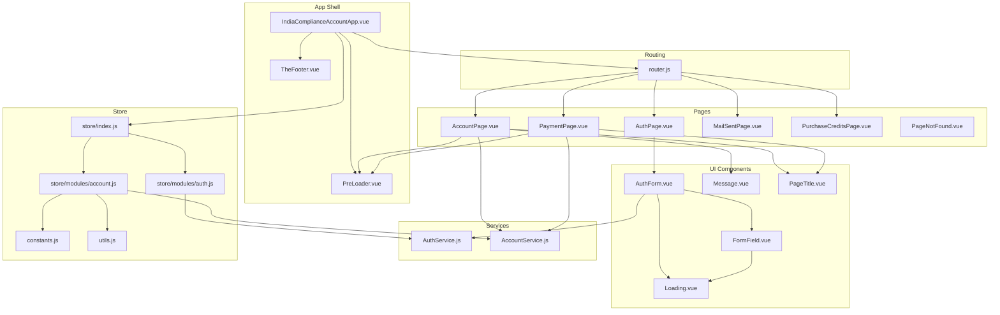
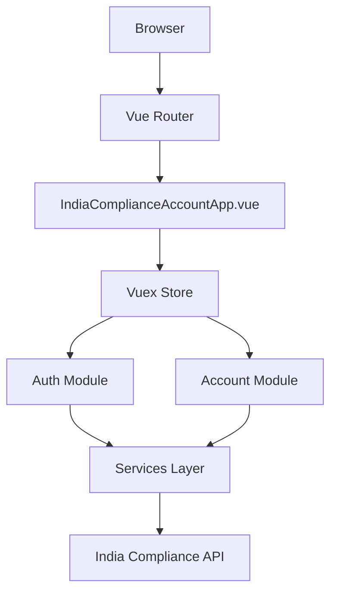
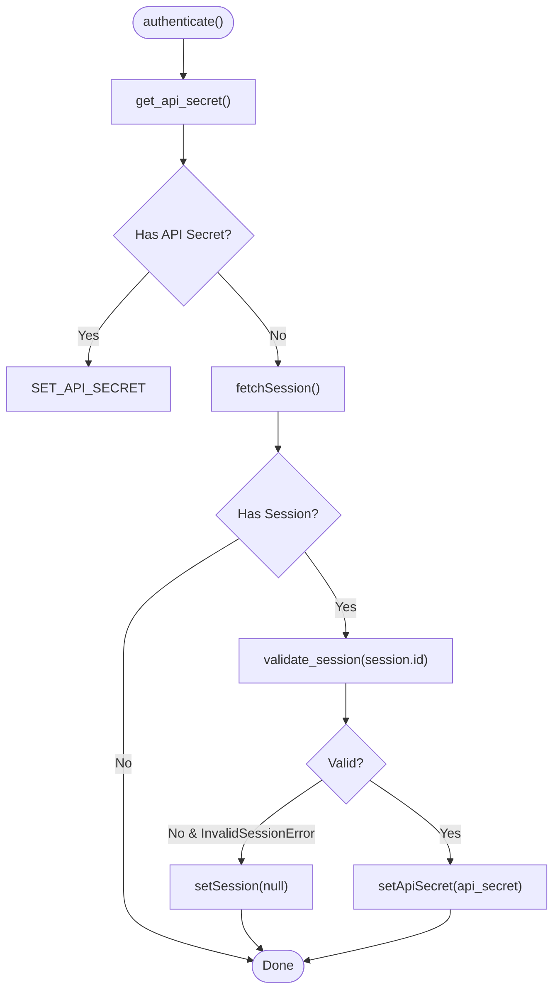
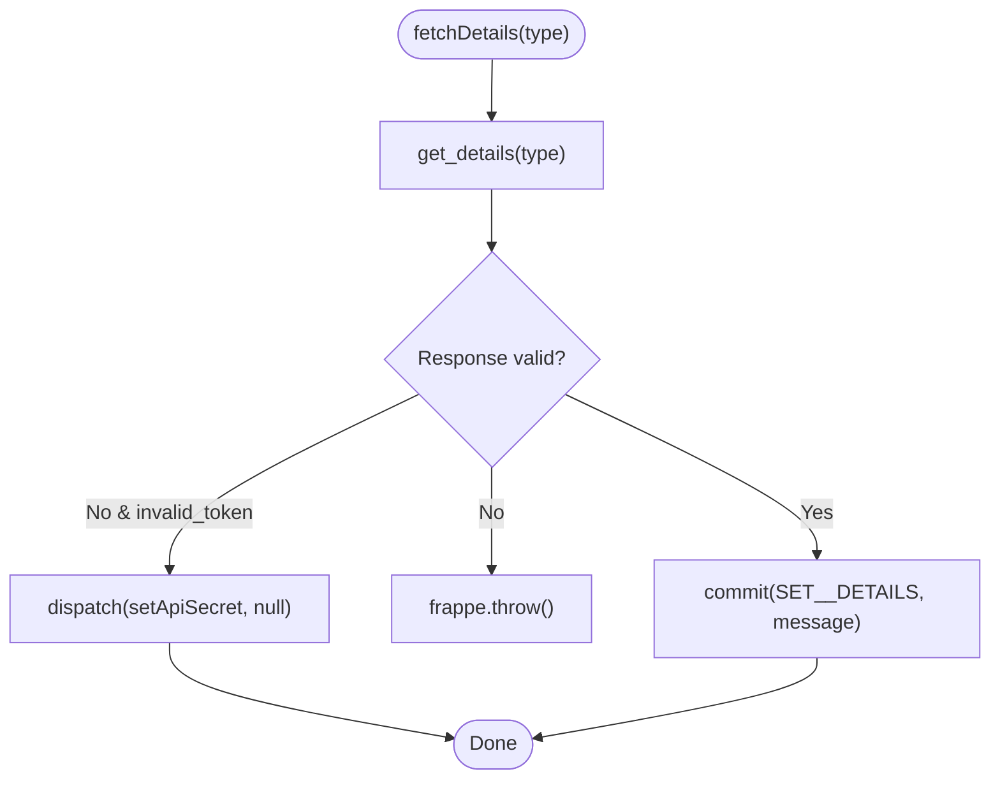
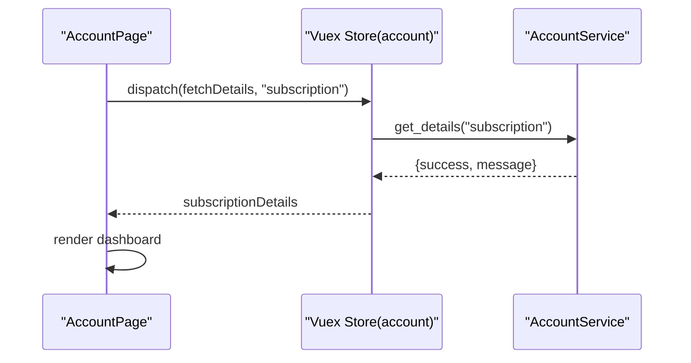
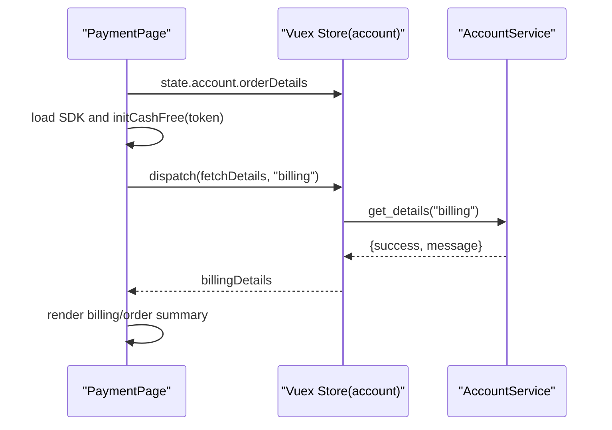
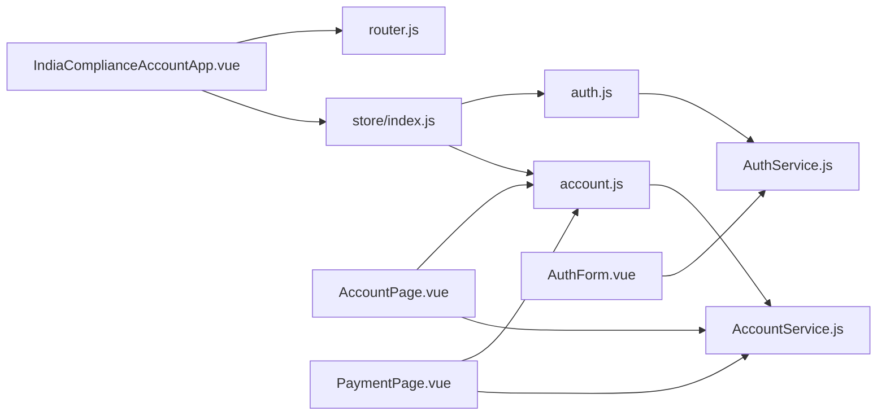

# Vue.js Single Page Application Components

<cite>
**Referenced Files in This Document**
- [IndiaComplianceAccountApp.vue](file://india_compliance/public/js/india_compliance_account/IndiaComplianceAccountApp.vue)
- [router.js](file://india_compliance/public/js/india_compliance_account/router.js)
- [index.js](file://india_compliance/public/js/india_compliance_account/store/index.js)
- [auth.js](file://india_compliance/public/js/india_compliance_account/store/modules/auth.js)
- [account.js](file://india_compliance/public/js/india_compliance_account/store/modules/account.js)
- [constants.js](file://india_compliance/public/js/india_compliance_account/constants.js)
- [utils.js](file://india_compliance/public/js/india_compliance_account/utils.js)
- [AccountPage.vue](file://india_compliance/public/js/india_compliance_account/pages/AccountPage.vue)
- [AuthPage.vue](file://india_compliance/public/js/india_compliance_account/pages/AuthPage.vue)
- [PaymentPage.vue](file://india_compliance/public/js/india_compliance_account/pages/PaymentPage.vue)
- [AuthForm.vue](file://india_compliance/public/js/india_compliance_account/components/auth/AuthForm.vue)
- [FormField.vue](file://india_compliance/public/js/india_compliance_account/components/FormField.vue)
- [Loading.vue](file://india_compliance/public/js/india_compliance_account/components/Loading.vue)
- [Message.vue](file://india_compliance/public/js/india_compliance_account/components/Message.vue)
- [AccountService.js](file://india_compliance/public/js/india_compliance_account/services/AccountService.js)
- [AuthService.js](file://india_compliance/public/js/india_compliance_account/services/AuthService.js)
</cite>

## Table of Contents
1. [Introduction](#introduction)
2. [Project Structure](#project-structure)
3. [Core Components](#core-components)
4. [Architecture Overview](#architecture-overview)
5. [Detailed Component Analysis](#detailed-component-analysis)
6. [Dependency Analysis](#dependency-analysis)
7. [Performance Considerations](#performance-considerations)
8. [Troubleshooting Guide](#troubleshooting-guide)
9. [Conclusion](#conclusion)

## Introduction
This document describes the Vue.js single-page application powering the India Compliance Account interface. It covers the main application shell, page components, reusable UI components, Vuex store architecture, routing and navigation, component props/events/lifecycle, backend integration, state persistence, error handling, user sessions, and authentication flows.

## Project Structure
The application is organized around a Vue app shell, page components, reusable UI components, a Vuex store with modularized auth and account modules, routing configuration, and service modules for backend communication.

**Diagram sources**
- [IndiaComplianceAccountApp.vue](file://india_compliance/public/js/india_compliance_account/IndiaComplianceAccountApp.vue#L1-L82)
- [router.js](file://india_compliance/public/js/india_compliance_account/router.js#L1-L37)
- [index.js](file://india_compliance/public/js/india_compliance_account/store/index.js#L1-L11)
- [auth.js](file://india_compliance/public/js/india_compliance_account/store/modules/auth.js#L1-L77)
- [account.js](file://india_compliance/public/js/india_compliance_account/store/modules/account.js#L1-L89)
- [constants.js](file://india_compliance/public/js/india_compliance_account/constants.js#L1-L7)
- [utils.js](file://india_compliance/public/js/india_compliance_account/utils.js#L1-L4)
- [AuthPage.vue](file://india_compliance/public/js/india_compliance_account/pages/AuthPage.vue#L1-L160)
- [AccountPage.vue](file://india_compliance/public/js/india_compliance_account/pages/AccountPage.vue#L1-L278)
- [PaymentPage.vue](file://india_compliance/public/js/india_compliance_account/pages/PaymentPage.vue#L1-L357)
- [AuthForm.vue](file://india_compliance/public/js/india_compliance_account/components/auth/AuthForm.vue#L1-L202)
- [FormField.vue](file://india_compliance/public/js/india_compliance_account/components/FormField.vue#L1-L119)
- [Loading.vue](file://india_compliance/public/js/india_compliance_account/components/Loading.vue#L1-L57)
- [Message.vue](file://india_compliance/public/js/india_compliance_account/components/Message.vue#L1-L32)
- [AuthService.js](file://india_compliance/public/js/india_compliance_account/services/AuthService.js#L1-L61)
- [AccountService.js](file://india_compliance/public/js/india_compliance_account/services/AccountService.js#L1-L46)

**Section sources**
- [IndiaComplianceAccountApp.vue](file://india_compliance/public/js/india_compliance_account/IndiaComplianceAccountApp.vue#L1-L82)
- [router.js](file://india_compliance/public/js/india_compliance_account/router.js#L1-L37)
- [index.js](file://india_compliance/public/js/india_compliance_account/store/index.js#L1-L11)

## Core Components
- Main application shell initializes preloading, sets up route guards, and renders the active page via router-view.
- Pages:
  - AuthPage: Registration/login form with view switching.
  - AccountPage: Dashboard displaying subscription/billing info, actions, and invoice history.
  - PaymentPage: Payment gateway integration with billing details editing and order verification.
- Reusable UI:
  - AuthForm: Email/GSTIN input with live validation and server-side eligibility checks.
  - FormField: Generic input with state indicators (initial/loading/success/error).
  - Loading: Animated spinner with configurable radius/stroke/color.
  - Message: Dismissible message with color-coded feedback.

**Section sources**
- [IndiaComplianceAccountApp.vue](file://india_compliance/public/js/india_compliance_account/IndiaComplianceAccountApp.vue#L18-L65)
- [AuthPage.vue](file://india_compliance/public/js/india_compliance_account/pages/AuthPage.vue#L1-L160)
- [AccountPage.vue](file://india_compliance/public/js/india_compliance_account/pages/AccountPage.vue#L1-L278)
- [PaymentPage.vue](file://india_compliance/public/js/india_compliance_account/pages/PaymentPage.vue#L1-L357)
- [AuthForm.vue](file://india_compliance/public/js/india_compliance_account/components/auth/AuthForm.vue#L1-L202)
- [FormField.vue](file://india_compliance/public/js/india_compliance_account/components/FormField.vue#L1-L119)
- [Loading.vue](file://india_compliance/public/js/india_compliance_account/components/Loading.vue#L1-L57)
- [Message.vue](file://india_compliance/public/js/india_compliance_account/components/Message.vue#L1-L32)

## Architecture Overview
The app uses Vue Router for navigation and Vuex for centralized state. Services encapsulate backend calls through a Frappe-based API wrapper. Authentication state is persisted via server-side methods and validated against the backend.

**Diagram sources**
- [IndiaComplianceAccountApp.vue](file://india_compliance/public/js/india_compliance_account/IndiaComplianceAccountApp.vue#L39-L64)
- [index.js](file://india_compliance/public/js/india_compliance_account/store/index.js#L5-L10)
- [auth.js](file://india_compliance/public/js/india_compliance_account/store/modules/auth.js#L26-L59)
- [account.js](file://india_compliance/public/js/india_compliance_account/store/modules/account.js#L35-L84)
- [AuthService.js](file://india_compliance/public/js/india_compliance_account/services/AuthService.js#L1-L61)
- [AccountService.js](file://india_compliance/public/js/india_compliance_account/services/AccountService.js#L1-L46)

## Detailed Component Analysis

### Main Application Shell
- Responsibilities:
  - Initialize preloader state.
  - On creation, authenticate via store, guess correct route, register a router beforeEach guard, and finalize loading.
  - Watch route changes to update breadcrumbs.
- Lifecycle:
  - created(): performs authentication, sets up route guard, and redirects if needed.
  - watch $route(): updates Frappe breadcrumbs on navigation.
- Integration:
  - Uses AUTH_ROUTES constant to decide redirection logic.

**Section sources**
- [IndiaComplianceAccountApp.vue](file://india_compliance/public/js/india_compliance_account/IndiaComplianceAccountApp.vue#L32-L64)
- [router.js](file://india_compliance/public/js/india_compliance_account/router.js#L36-L37)

### Routing Configuration and Navigation Patterns
- Routes:
  - Authentication: /authentication (AuthPage)
  - Mail Sent: /mail-sent (MailSentPage)
  - Purchase Credits: /purchase-credits (PurchaseCreditsPage)
  - Payment: /payment-page (PaymentPage)
  - Home: / (AccountPage), alias /account
- Navigation:
  - Programmatic navigation via router-link and router.push.
  - Route guard ensures user is directed to the correct page based on auth/session state.

**Section sources**
- [router.js](file://india_compliance/public/js/india_compliance_account/router.js#L7-L34)

### Vuex Store Architecture

#### Store Initialization
- Modules:
  - auth: manages API secret and session state.
  - account: manages subscription/billing/order/message state and exposes actions to fetch/update data and create orders.

**Section sources**
- [index.js](file://india_compliance/public/js/india_compliance_account/store/index.js#L5-L10)
- [auth.js](file://india_compliance/public/js/india_compliance_account/store/modules/auth.js#L9-L24)
- [account.js](file://india_compliance/public/js/india_compliance_account/store/modules/account.js#L4-L33)

#### Auth Module
- State:
  - api_secret: stored API secret for authenticated requests.
  - session: session metadata.
- Mutations:
  - SET_API_SECRET: clears session when API secret is set.
  - SET_SESSION: stores session.
- Actions:
  - authenticate: retrieves API secret, fetches session if missing, validates session, and sets API secret.
  - setSession/setApiSecret: persist state via server methods.
  - fetchSession: reads session from server.
- Getters:
  - isLoggedIn: true when API secret exists.
  - hasSession: true when session exists.
  - guessRouteName: resolves route based on state.

**Diagram sources**
- [auth.js](file://india_compliance/public/js/india_compliance_account/store/modules/auth.js#L26-L59)
- [AuthService.js](file://india_compliance/public/js/india_compliance_account/services/AuthService.js#L1-L61)

**Section sources**
- [auth.js](file://india_compliance/public/js/india_compliance_account/store/modules/auth.js#L9-L77)
- [AuthService.js](file://india_compliance/public/js/india_compliance_account/services/AuthService.js#L1-L61)

#### Account Module
- State:
  - subscriptionDetails, calculatorDetails, billingDetails, orderDetails, message.
- Mutations:
  - SET_*: setters for each state field.
- Actions:
  - fetchDetails: fetches subscription/billing/calculator details; resets API secret on invalid token.
  - updateBillingDetails: updates billing details; resets API secret on invalid token.
  - resetOrder/createOrder: manage order lifecycle and token assignment; resets API secret on invalid token.
  - resetMessage/ setMessage: manage transient messages.
- Getters:
  - None defined.

**Diagram sources**
- [account.js](file://india_compliance/public/js/india_compliance_account/store/modules/account.js#L35-L42)
- [AccountService.js](file://india_compliance/public/js/india_compliance_account/services/AccountService.js#L1-L6)

**Section sources**
- [account.js](file://india_compliance/public/js/india_compliance_account/store/modules/account.js#L4-L89)
- [AccountService.js](file://india_compliance/public/js/india_compliance_account/services/AccountService.js#L1-L46)

### Page Components

#### AuthPage
- Purpose: Hosts AuthForm and MarketingInfo, toggles between login/signup views.
- Props: None.
- Events: None.
- Lifecycle: created() sets initial view state.

**Section sources**
- [AuthPage.vue](file://india_compliance/public/js/india_compliance_account/pages/AuthPage.vue#L29-L54)

#### AccountPage
- Purpose: Displays subscription details, actions, invoice history dialog, and logout.
- Props: None.
- Events: None.
- Lifecycle:
  - created(): fetches subscription details, hides preloader, and initializes message from store.
- Computed:
  - last_synced_on, subscriptionDetails, is_unlimited_account, used_credits, balance_credits, valid_upto.

**Diagram sources**
- [AccountPage.vue](file://india_compliance/public/js/india_compliance_account/pages/AccountPage.vue#L200-L206)
- [account.js](file://india_compliance/public/js/india_compliance_account/store/modules/account.js#L35-L42)
- [AccountService.js](file://india_compliance/public/js/india_compliance_account/services/AccountService.js#L1-L6)

**Section sources**
- [AccountPage.vue](file://india_compliance/public/js/india_compliance_account/pages/AccountPage.vue#L62-L206)

#### PaymentPage
- Purpose: Renders billing details, order summary, and integrates CashFree payment drop-in.
- Props: None.
- Events: None.
- Lifecycle:
  - created(): loads order from store, validates token, injects CashFree SDK, initializes drop-in, fetches billing details.
- Methods:
  - editAddress(): opens a dialog to update billing details and persists via store action.
  - redirectToHome(): sets message and navigates to home.
  - initCashFree(): configures CashFree with theme and callbacks.

**Diagram sources**
- [PaymentPage.vue](file://india_compliance/public/js/india_compliance_account/pages/PaymentPage.vue#L287-L307)
- [account.js](file://india_compliance/public/js/india_compliance_account/store/modules/account.js#L35-L42)
- [AccountService.js](file://india_compliance/public/js/india_compliance_account/services/AccountService.js#L1-L6)

**Section sources**
- [PaymentPage.vue](file://india_compliance/public/js/india_compliance_account/pages/PaymentPage.vue#L78-L307)

### Reusable UI Components

#### AuthForm
- Purpose: Unified authentication form with email/GSTIN validation and free trial eligibility check.
- Props:
  - isAccountRegistered: Boolean.
- Events:
  - Emits nothing; uses router and store internally.
- Validation:
  - Live validation for email and GSTIN.
  - Eligibility check determines button label ("Start Free Trial" vs "Signup").
- Actions:
  - submitAuthForm(): handles login/signup, sets session, navigates to mailSent.

**Section sources**
- [AuthForm.vue](file://india_compliance/public/js/india_compliance_account/components/auth/AuthForm.vue#L45-L187)

#### FormField
- Purpose: Generic input with state-driven icons and error rendering.
- Props:
  - modelValue, inputType, name, required, label, placeholder, inputClass, error, rows, options, validator, state.
- Events:
  - update:modelValue, blur.
- Computed:
  - isLoading, hasError, isValid.

**Section sources**
- [FormField.vue](file://india_compliance/public/js/india_compliance_account/components/FormField.vue#L50-L98)

#### Loading
- Purpose: Animated spinner with configurable radius, stroke, and color.
- Props:
  - radius, stroke, color.

**Section sources**
- [Loading.vue](file://india_compliance/public/js/india_compliance_account/components/Loading.vue#L8-L30)

#### Message
- Purpose: Transient message with close action.
- Props:
  - message, color.
- Events:
  - dismiss.

**Section sources**
- [Message.vue](file://india_compliance/public/js/india_compliance_account/components/Message.vue#L10-L25)

### Services Layer
- AuthService:
  - Provides get/set API secret, login/signup, session retrieval/validation, and eligibility checks via server methods.
- AccountService:
  - Provides get_details, update_billing_details, create_order, verify_payment, get_invoice_history, send_invoice_email.

**Section sources**
- [AuthService.js](file://india_compliance/public/js/india_compliance_account/services/AuthService.js#L1-L61)
- [AccountService.js](file://india_compliance/public/js/india_compliance_account/services/AccountService.js#L1-L46)

## Dependency Analysis
- App shell depends on router and store initialization.
- Pages depend on store modules and services.
- UI components depend on constants and store for state.
- Services depend on Frappe’s call mechanism and the backend API.

**Diagram sources**
- [IndiaComplianceAccountApp.vue](file://india_compliance/public/js/india_compliance_account/IndiaComplianceAccountApp.vue#L18-L21)
- [index.js](file://india_compliance/public/js/india_compliance_account/store/index.js#L1-L11)
- [auth.js](file://india_compliance/public/js/india_compliance_account/store/modules/auth.js#L1-L77)
- [account.js](file://india_compliance/public/js/india_compliance_account/store/modules/account.js#L1-L89)
- [AuthService.js](file://india_compliance/public/js/india_compliance_account/services/AuthService.js#L1-L61)
- [AccountService.js](file://india_compliance/public/js/india_compliance_account/services/AccountService.js#L1-L46)

**Section sources**
- [IndiaComplianceAccountApp.vue](file://india_compliance/public/js/india_compliance_account/IndiaComplianceAccountApp.vue#L18-L21)
- [index.js](file://india_compliance/public/js/india_compliance_account/store/index.js#L1-L11)

## Performance Considerations
- Prefer fetching only necessary details (e.g., subscription details on AccountPage) to minimize network overhead.
- Debounce or throttle real-time validations in forms to reduce unnecessary backend calls.
- Use computed properties for derived UI values to avoid recomputation.
- Lazy-load heavy dialogs and modals to defer resource usage until needed.

## Troubleshooting Guide
- Authentication failures:
  - Invalid session triggers clearing of session and redirect to auth.
  - Invalid token during account actions resets API secret and prevents further protected calls.
- Payment failures:
  - Failure callback displays error messages; ensure order token validity and network connectivity.
- UI state:
  - FormField state transitions (initial/loading/success/error) drive icon rendering; ensure state updates on input and validation.

**Section sources**
- [auth.js](file://india_compliance/public/js/india_compliance_account/store/modules/auth.js#L34-L43)
- [account.js](file://india_compliance/public/js/india_compliance_account/store/modules/account.js#L38-L50)
- [PaymentPage.vue](file://india_compliance/public/js/india_compliance_account/pages/PaymentPage.vue#L258-L268)

## Conclusion
The India Compliance Account SPA follows a clean separation of concerns: Vue Router for navigation, Vuex for state, and dedicated services for backend integration. The authentication flow leverages server-side session persistence and backend validation, while reusable UI components provide consistent UX patterns. Pages integrate with the store and services to deliver a responsive, stateful experience for account management and payments.