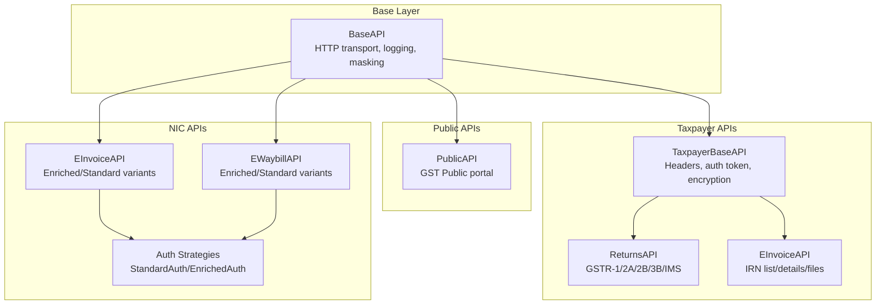
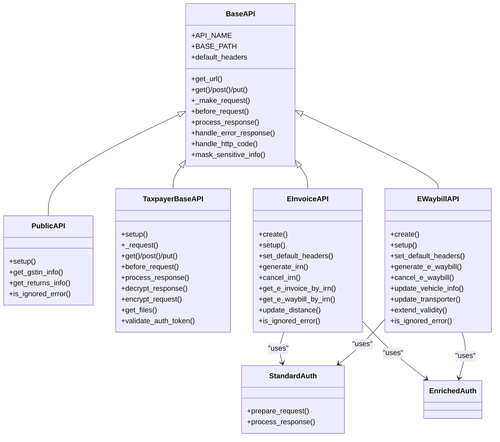
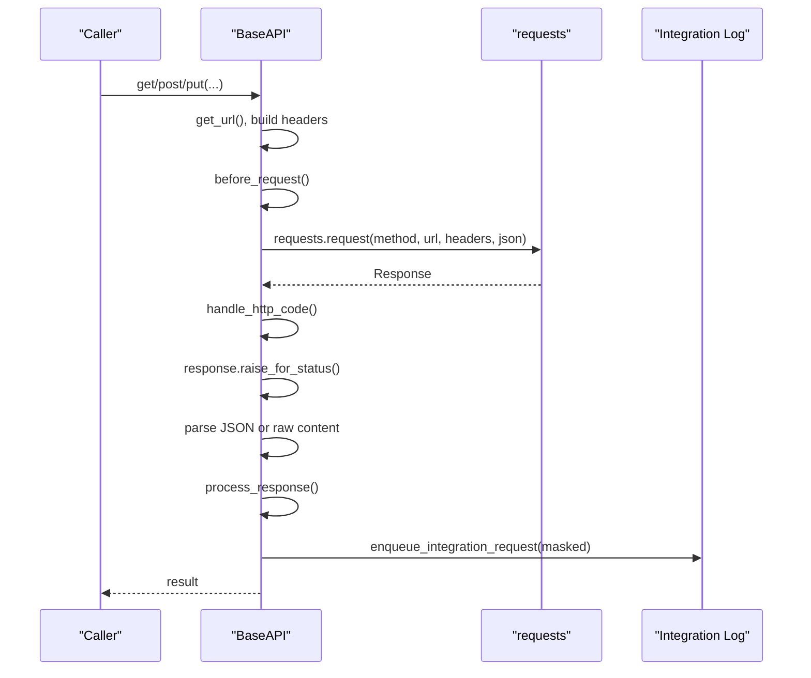
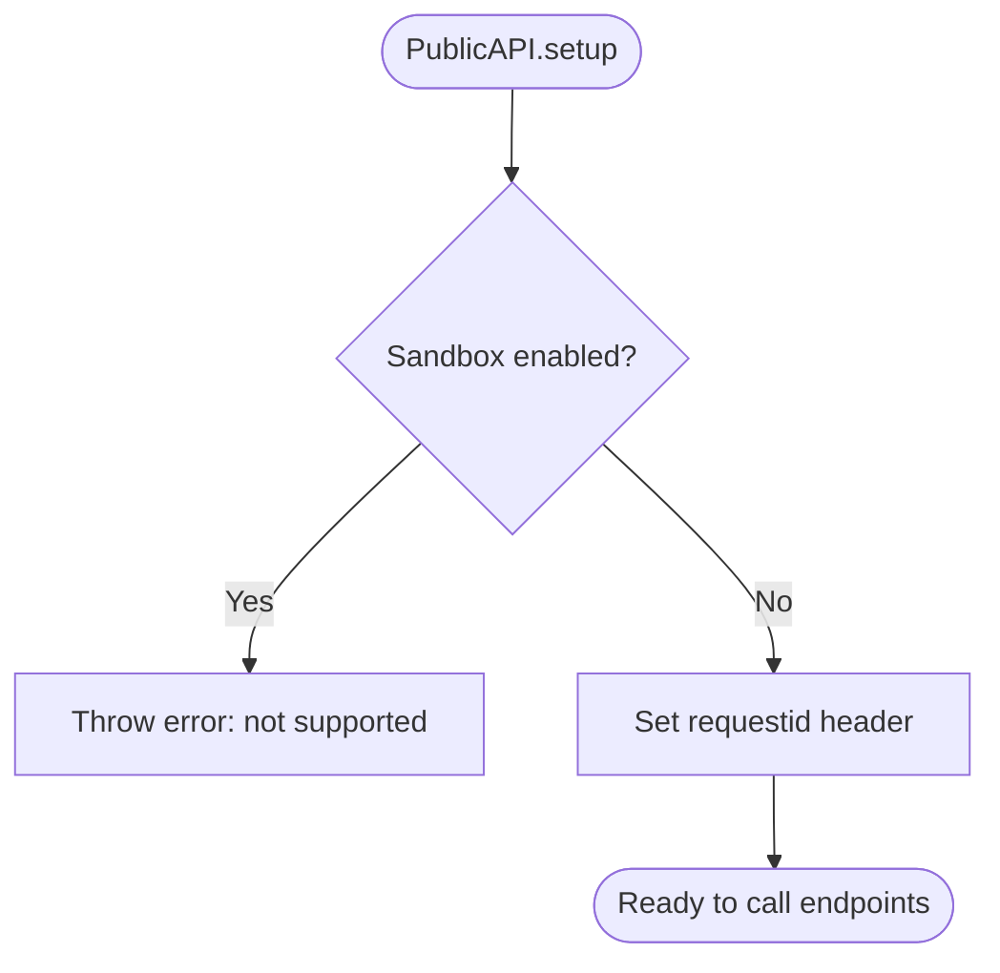
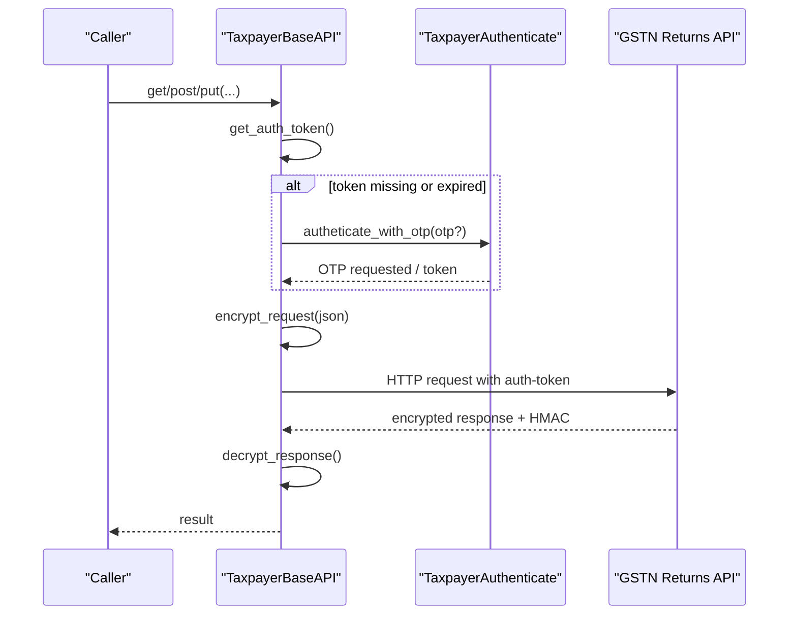
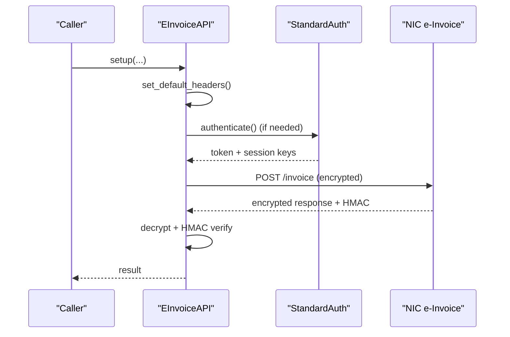
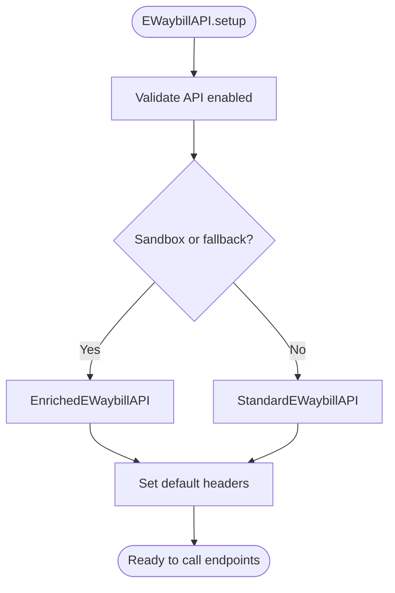
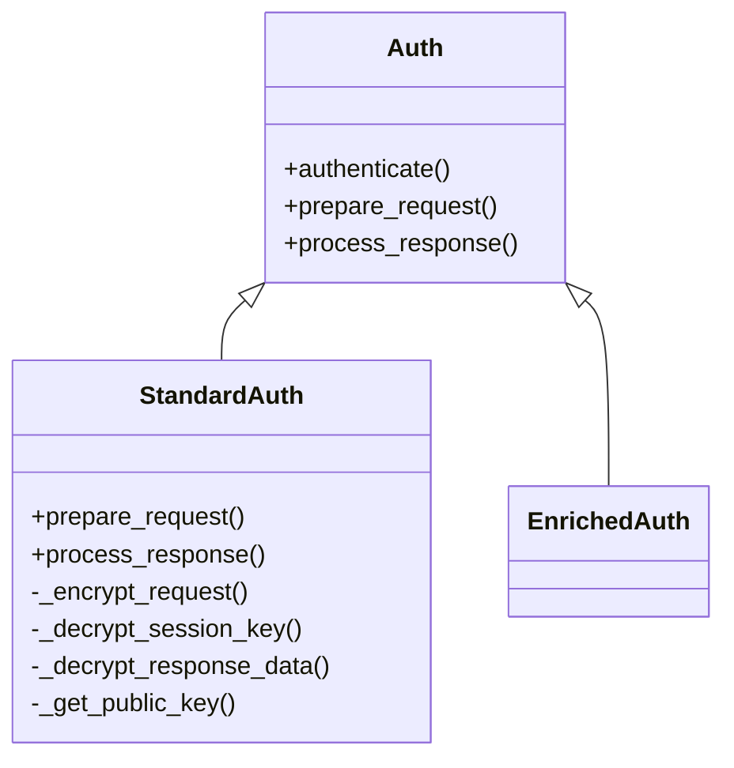
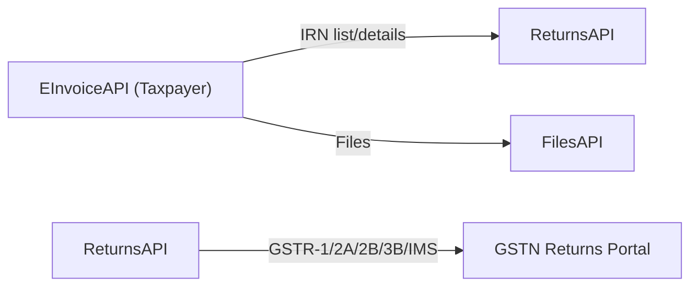
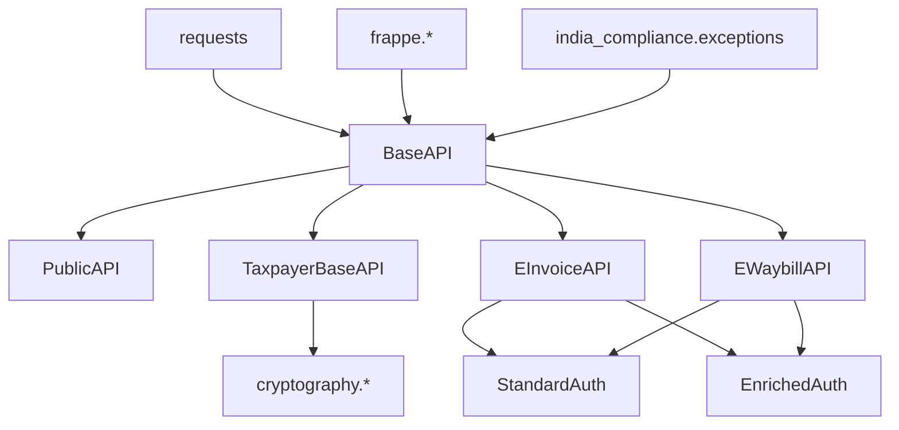

# API Integration Layer

<cite>
**Referenced Files in This Document**
- [base.py](file://india_compliance/gst_india/api_classes/base.py)
- [public.py](file://india_compliance/gst_india/api_classes/public.py)
- [taxpayer_base.py](file://india_compliance/gst_india/api_classes/taxpayer_base.py)
- [e_invoice.py](file://india_compliance/gst_india/api_classes/nic/e_invoice.py)
- [e_waybill.py](file://india_compliance/gst_india/api_classes/nic/e_waybill.py)
- [auth.py](file://india_compliance/gst_india/api_classes/nic/auth.py)
- [e_waybill_errors.py](file://india_compliance/gst_india/api_classes/nic/e_waybill_errors.py)
- [taxpayer_e_invoice.py](file://india_compliance/gst_india/api_classes/taxpayer_e_invoice.py)
- [taxpayer_returns.py](file://india_compliance/gst_india/api_classes/taxpayer_returns.py)
- [test_mask_sensitive_info.py](file://india_compliance/gst_india/api_classes/test_mask_sensitive_info.py)
- [test_auth.py](file://india_compliance/gst_india/api_classes/nic/test_auth.py)
</cite>

## Table of Contents
1. [Introduction](#introduction)
2. [Project Structure](#project-structure)
3. [Core Components](#core-components)
4. [Architecture Overview](#architecture-overview)
5. [Detailed Component Analysis](#detailed-component-analysis)
6. [Dependency Analysis](#dependency-analysis)
7. [Performance Considerations](#performance-considerations)
8. [Troubleshooting Guide](#troubleshooting-guide)
9. [Conclusion](#conclusion)
10. [Appendices](#appendices)

## Introduction
This document describes the API Integration Layer responsible for communicating with government portals and third-party services in the India Compliance application. It covers:
- Government portal communication via standardized base classes
- Authentication management and token lifecycle
- Secure communication protocols and encryption/decryption strategies
- Error handling, retry logic, and recovery procedures
- Practical usage patterns for public APIs, taxpayer APIs, and NIC-integrated e-Invoice/e-Waybill APIs

## Project Structure
The API layer is organized around reusable base classes and specialized subclasses for different integrations:
- Base API class for HTTP transport, logging, and error handling
- Public API for GST Public portal endpoints
- Taxpayer APIs for Returns/GSTR APIs
- NIC-integrated APIs for e-Invoice and e-Waybill with two authentication modes

**Diagram sources**
- [base.py](file://india_compliance/gst_india/api_classes/base.py#L23-L413)
- [public.py](file://india_compliance/gst_india/api_classes/public.py#L7-L65)
- [taxpayer_base.py](file://india_compliance/gst_india/api_classes/taxpayer_base.py#L321-L527)
- [taxpayer_returns.py](file://india_compliance/gst_india/api_classes/taxpayer_returns.py#L10-L395)
- [taxpayer_e_invoice.py](file://india_compliance/gst_india/api_classes/taxpayer_e_invoice.py#L7-L69)
- [e_invoice.py](file://india_compliance/gst_india/api_classes/nic/e_invoice.py#L12-L271)
- [e_waybill.py](file://india_compliance/gst_india/api_classes/nic/e_waybill.py#L17-L259)
- [auth.py](file://india_compliance/gst_india/api_classes/nic/auth.py#L27-L195)

**Section sources**
- [base.py](file://india_compliance/gst_india/api_classes/base.py#L23-L413)
- [public.py](file://india_compliance/gst_india/api_classes/public.py#L7-L65)
- [taxpayer_base.py](file://india_compliance/gst_india/api_classes/taxpayer_base.py#L321-L527)
- [e_invoice.py](file://india_compliance/gst_india/api_classes/nic/e_invoice.py#L12-L271)
- [e_waybill.py](file://india_compliance/gst_india/api_classes/nic/e_waybill.py#L17-L259)
- [auth.py](file://india_compliance/gst_india/api_classes/nic/auth.py#L27-L195)

## Core Components
- BaseAPI: Centralized HTTP request orchestration, response processing, error handling, and secure logging with sensitive data masking.
- PublicAPI: Stateless access to GST Public portal endpoints for party info and returns tracking.
- TaxpayerBaseAPI: Adds authentication token handling, request/response encryption/decryption, and OTP flows for Returns/GSTR APIs.
- EInvoiceAPI and EWaybillAPI: Two variants (Enriched and Standard) with distinct authentication and encryption strategies for NIC integration.
- Auth strategies: StandardAuth (encryption/decryption, HMAC validation) and EnrichedAuth (no encryption).

Key capabilities:
- URL construction with sandbox mode and base path routing
- Request/response logging with masking of sensitive fields
- Robust error classification and throwing of domain-specific exceptions
- Automatic token refresh and OTP handling for taxpayer APIs
- Hash/HMAC validation for downloaded files

**Section sources**
- [base.py](file://india_compliance/gst_india/api_classes/base.py#L23-L413)
- [public.py](file://india_compliance/gst_india/api_classes/public.py#L7-L65)
- [taxpayer_base.py](file://india_compliance/gst_india/api_classes/taxpayer_base.py#L110-L527)
- [e_invoice.py](file://india_compliance/gst_india/api_classes/nic/e_invoice.py#L12-L271)
- [e_waybill.py](file://india_compliance/gst_india/api_classes/nic/e_waybill.py#L17-L259)
- [auth.py](file://india_compliance/gst_india/api_classes/nic/auth.py#L27-L195)

## Architecture Overview
The system separates concerns across layers:
- BaseAPI handles transport, logging, and masking
- PublicAPI extends BaseAPI for public endpoints
- TaxpayerBaseAPI extends BaseAPI and adds authentication and encryption
- NIC APIs (e-Invoice/e-Waybill) choose between EnrichedAuth and StandardAuth depending on settings and sandbox mode

**Diagram sources**
- [base.py](file://india_compliance/gst_india/api_classes/base.py#L23-L413)
- [public.py](file://india_compliance/gst_india/api_classes/public.py#L7-L65)
- [taxpayer_base.py](file://india_compliance/gst_india/api_classes/taxpayer_base.py#L321-L527)
- [e_invoice.py](file://india_compliance/gst_india/api_classes/nic/e_invoice.py#L12-L271)
- [e_waybill.py](file://india_compliance/gst_india/api_classes/nic/e_waybill.py#L17-L259)
- [auth.py](file://india_compliance/gst_india/api_classes/nic/auth.py#L27-L195)

## Detailed Component Analysis

### BaseAPI: HTTP Transport, Logging, and Masking
- Responsibilities:
  - Build URLs with sandbox mode and base path
  - Perform GET/POST/PUT requests via requests library
  - Parse JSON responses and raise HTTP errors
  - Handle special HTTP codes (e.g., 401/403/429/504)
  - Enqueue integration logs with masked sensitive data
  - Support optional auth strategy hook before/after request
- Security:
  - Masks sensitive headers (x-api-key, auth-token), response fields, request data/body
  - Provides override mechanism for subclass-specific masks
- Error handling:
  - Converts server-side error messages to domain exceptions
  - Ignores whitelisted error codes/messages when appropriate

**Diagram sources**
- [base.py](file://india_compliance/gst_india/api_classes/base.py#L124-L220)

**Section sources**
- [base.py](file://india_compliance/gst_india/api_classes/base.py#L23-L413)
- [test_mask_sensitive_info.py](file://india_compliance/gst_india/api_classes/test_mask_sensitive_info.py#L1-L176)

### PublicAPI: GST Public Portal Access
- Purpose: Party information lookup and returns tracking for any GSTIN
- Behavior:
  - Disables sandbox mode for autofill features
  - Generates request ID for tracing
  - Handles ignored error codes gracefully (e.g., no documents found)
- Typical usage:
  - Lookup GSTIN details
  - Track returns filing status

**Diagram sources**
- [public.py](file://india_compliance/gst_india/api_classes/public.py#L15-L30)

**Section sources**
- [public.py](file://india_compliance/gst_india/api_classes/public.py#L7-L65)

### TaxpayerBaseAPI: Returns/GSTR APIs with Authentication and Encryption
- Purpose: Communicate with Returns/GSTR APIs requiring authentication tokens and encrypted payloads
- Key features:
  - OTP request and validation
  - Refresh auth token automatically
  - Encrypt request bodies and validate HMAC on responses
  - Download and decrypt files with hash verification
  - Ignore specific error codes and surface actionable error types
- Headers and tokens:
  - gstin, username, txn, ip-usr, auth-token
  - Session IP fetched from public endpoint
- Error handling:
  - Whitelist of ignored error codes
  - Throws descriptive errors for authorization failures and invalid public keys

**Diagram sources**
- [taxpayer_base.py](file://india_compliance/gst_india/api_classes/taxpayer_base.py#L347-L425)

**Section sources**
- [taxpayer_base.py](file://india_compliance/gst_india/api_classes/taxpayer_base.py#L110-L527)

### EInvoiceAPI: NIC e-Invoice Integration
- Variants:
  - EnrichedEInvoiceAPI: Uses EnrichedAuth (no encryption/decryption)
  - StandardEInvoiceAPI: Uses StandardAuth (public key encryption, session key encryption, HMAC)
- Setup:
  - Validates API enablement and scheduler status
  - Chooses variant based on sandbox mode and fallback settings
  - Sets default headers (gstin, user_name, password, requestid)
- Methods:
  - generate_irn, cancel_irn, get_e_invoice_by_irn, get_e_waybill_by_irn
  - update_distance using response info
- Error handling:
  - Whitelist of ignored error codes/messages
  - Duplicate IRN resolution
  - Invalid token triggers token refresh and retry

**Diagram sources**
- [e_invoice.py](file://india_compliance/gst_india/api_classes/nic/e_invoice.py#L149-L271)
- [auth.py](file://india_compliance/gst_india/api_classes/nic/auth.py#L53-L195)

**Section sources**
- [e_invoice.py](file://india_compliance/gst_india/api_classes/nic/e_invoice.py#L12-L271)
- [auth.py](file://india_compliance/gst_india/api_classes/nic/auth.py#L27-L195)

### EWaybillAPI: NIC e-Waybill Integration
- Variants:
  - EnrichedEWaybillAPI: Uses EnrichedAuth
  - StandardEWaybillAPI: Uses StandardAuth
- Setup:
  - Validates API enablement and scheduler status
  - Chooses variant based on sandbox mode and fallback settings
  - Sets default headers (gstin, username, password, requestid)
- Methods:
  - generate_e_waybill, cancel_e_waybill, update_vehicle_info, update_transporter, extend_validity
  - get_e_waybill, get_e_waybills_by_date
  - update_distance using alert text
- Error handling:
  - Whitelist of ignored error codes/messages
  - Invalid token triggers token refresh and retry
  - Maps error codes to human-readable messages

**Diagram sources**
- [e_waybill.py](file://india_compliance/gst_india/api_classes/nic/e_waybill.py#L40-L83)

**Section sources**
- [e_waybill.py](file://india_compliance/gst_india/api_classes/nic/e_waybill.py#L17-L259)
- [e_waybill_errors.py](file://india_compliance/gst_india/api_classes/nic/e_waybill_errors.py#L1-L337)

### Authentication Strategies: StandardAuth vs EnrichedAuth
- StandardAuth:
  - Encrypts request JSON using public key for auth requests and session key for others
  - Decrypts responses, stores auth-token, session key, expiry
  - Validates HMAC for decrypted data
- EnrichedAuth:
  - No encryption/decryption; GSP handles it
- Both strategies integrate via BaseAPI’s auth_strategy hook

**Diagram sources**
- [auth.py](file://india_compliance/gst_india/api_classes/nic/auth.py#L27-L195)

**Section sources**
- [auth.py](file://india_compliance/gst_india/api_classes/nic/auth.py#L27-L195)

### Taxpayer e-Invoice and Returns APIs
- EInvoiceAPI (Taxpayer):
  - IRN list and details retrieval
  - File downloads for e-Invoice
  - Ignores specific error codes (e.g., no docs found, queued)
- ReturnsAPI (Taxpayer):
  - GSTR-1, GSTR-2A, GSTR-2B, GSTR-3B, IMS operations
  - File downloads for returns
  - OTP handling and authorization checks

**Diagram sources**
- [taxpayer_e_invoice.py](file://india_compliance/gst_india/api_classes/taxpayer_e_invoice.py#L7-L69)
- [taxpayer_returns.py](file://india_compliance/gst_india/api_classes/taxpayer_returns.py#L10-L395)

**Section sources**
- [taxpayer_e_invoice.py](file://india_compliance/gst_india/api_classes/taxpayer_e_invoice.py#L7-L69)
- [taxpayer_returns.py](file://india_compliance/gst_india/api_classes/taxpayer_returns.py#L10-L395)

## Dependency Analysis
- BaseAPI depends on:
  - requests for HTTP transport
  - frappe utilities for logging, JSON, scheduler checks
  - india_compliance.exceptions for domain errors
- PublicAPI depends on BaseAPI
- TaxpayerBaseAPI depends on BaseAPI and cryptographic utilities
- EInvoiceAPI/EWaybillAPI depend on BaseAPI and Auth strategies
- Auth strategies depend on cryptography libraries and GST Settings for certificates

**Diagram sources**
- [base.py](file://india_compliance/gst_india/api_classes/base.py#L1-L18)
- [taxpayer_base.py](file://india_compliance/gst_india/api_classes/taxpayer_base.py#L1-L27)
- [e_invoice.py](file://india_compliance/gst_india/api_classes/nic/e_invoice.py#L1-L10)
- [e_waybill.py](file://india_compliance/gst_india/api_classes/nic/e_waybill.py#L1-L15)
- [auth.py](file://india_compliance/gst_india/api_classes/nic/auth.py#L1-L16)

**Section sources**
- [base.py](file://india_compliance/gst_india/api_classes/base.py#L1-L18)
- [taxpayer_base.py](file://india_compliance/gst_india/api_classes/taxpayer_base.py#L1-L27)
- [e_invoice.py](file://india_compliance/gst_india/api_classes/nic/e_invoice.py#L1-L10)
- [e_waybill.py](file://india_compliance/gst_india/api_classes/nic/e_waybill.py#L1-L15)
- [auth.py](file://india_compliance/gst_india/api_classes/nic/auth.py#L1-L16)

## Performance Considerations
- Minimize redundant authentication attempts by caching tokens and validating expiry
- Use sandbox mode only for development to avoid unnecessary overhead
- Batch file downloads and process in-memory to reduce I/O
- Avoid logging sensitive data by relying on built-in masking
- Prefer EnrichedAuth for NIC APIs when fallback is enabled to reduce encryption/decryption overhead

## Troubleshooting Guide
Common issues and resolutions:
- Authentication failures:
  - Verify credentials in GST Settings and ensure API is enabled
  - For taxpayer APIs, ensure OTP is requested and accepted; session IP is set
  - For NIC APIs, confirm public certificates are up to date
- Rate limiting and API credits exhausted:
  - Monitor integration logs and reduce request frequency
  - Upgrade plan or wait until next billing cycle
- Connectivity and timeouts:
  - Retry logic is implicit in BaseAPI; ensure network stability
  - For 504 gateway timeout, retry with exponential backoff
- Invalid tokens:
  - StandardEInvoiceAPI/EWaybillAPI automatically refresh tokens and retry
- HMAC mismatches:
  - Indicates tampered or corrupted data; re-download and retry
- Ignored errors:
  - Some error codes are intentionally ignored; verify business outcome

Operational tips:
- Use sandbox mode for testing; disable for production
- Enable integration logging to capture masked request/response details
- Validate scheduler status for e-Invoice/e-Waybill features

**Section sources**
- [base.py](file://india_compliance/gst_india/api_classes/base.py#L282-L312)
- [e_invoice.py](file://india_compliance/gst_india/api_classes/nic/e_invoice.py#L194-L204)
- [e_waybill.py](file://india_compliance/gst_india/api_classes/nic/e_waybill.py#L168-L181)
- [taxpayer_base.py](file://india_compliance/gst_india/api_classes/taxpayer_base.py#L443-L477)

## Conclusion
The API Integration Layer provides a robust, secure, and extensible foundation for interacting with government portals and NIC services. By centralizing HTTP transport, authentication, encryption, and error handling, it ensures predictable behavior, strong security, and maintainable code. Adopting the recommended practices and troubleshooting steps will help achieve reliable integrations with minimal operational overhead.

## Appendices

### Practical Usage Examples (paths only)
- Public API
  - Lookup GSTIN info: [get_gstin_info](file://india_compliance/gst_india/api_classes/public.py#L31-L42)
  - Returns info: [get_returns_info](file://india_compliance/gst_india/api_classes/public.py#L44-L47)
- Taxpayer e-Invoice
  - IRN list: [get_irn_list](file://india_compliance/gst_india/api_classes/taxpayer_e_invoice.py#L41-L53)
  - IRN details: [get_irn_details](file://india_compliance/gst_india/api_classes/taxpayer_e_invoice.py#L55-L63)
  - Download files: [download_files](file://india_compliance/gst_india/api_classes/taxpayer_e_invoice.py#L65-L69)
- Taxpayer Returns
  - GSTR-1 summary: [get_gstr_1_data](file://india_compliance/gst_india/api_classes/taxpayer_returns.py#L131-L140)
  - Save GSTR-1: [save_gstr_1_data](file://india_compliance/gst_india/api_classes/taxpayer_returns.py#L150-L157)
  - File GSTR-3B: [file_gstr_3b](file://india_compliance/gst_india/api_classes/taxpayer_returns.py#L230-L241)
- e-Invoice (NIC)
  - Generate IRN: [generate_irn](file://india_compliance/gst_india/api_classes/nic/e_invoice.py#L102-L109)
  - Cancel IRN: [cancel_irn](file://india_compliance/gst_india/api_classes/nic/e_invoice.py#L115-L117)
  - Get e-Waybill by IRN: [get_e_waybill_by_irn](file://india_compliance/gst_india/api_classes/nic/e_invoice.py#L99-L100)
- e-Waybill (NIC)
  - Generate: [generate_e_waybill](file://india_compliance/gst_india/api_classes/nic/e_waybill.py#L104-L107)
  - Cancel: [cancel_e_waybill](file://india_compliance/gst_india/api_classes/nic/e_waybill.py#L109-L111)
  - Update transporter: [update_transporter](file://india_compliance/gst_india/api_classes/nic/e_waybill.py#L115-L116)
  - Extend validity: [extend_validity](file://india_compliance/gst_india/api_classes/nic/e_waybill.py#L118-L119)

### Tests and Validation
- Authentication and encryption/decryption round-trips:
  - [test_auth.py](file://india_compliance/gst_india/api_classes/nic/test_auth.py#L103-L301)
- Sensitive info masking:
  - [test_mask_sensitive_info.py](file://india_compliance/gst_india/api_classes/test_mask_sensitive_info.py#L1-L176)