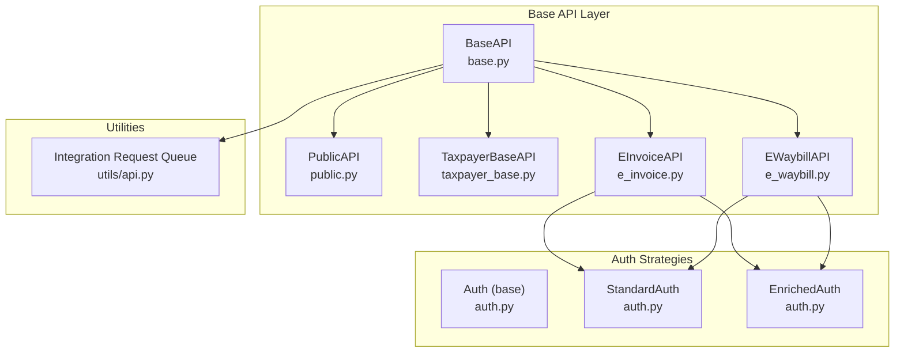
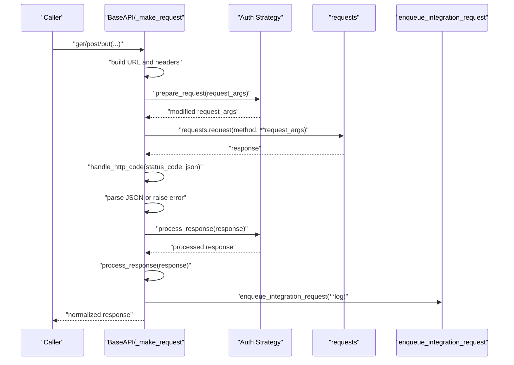
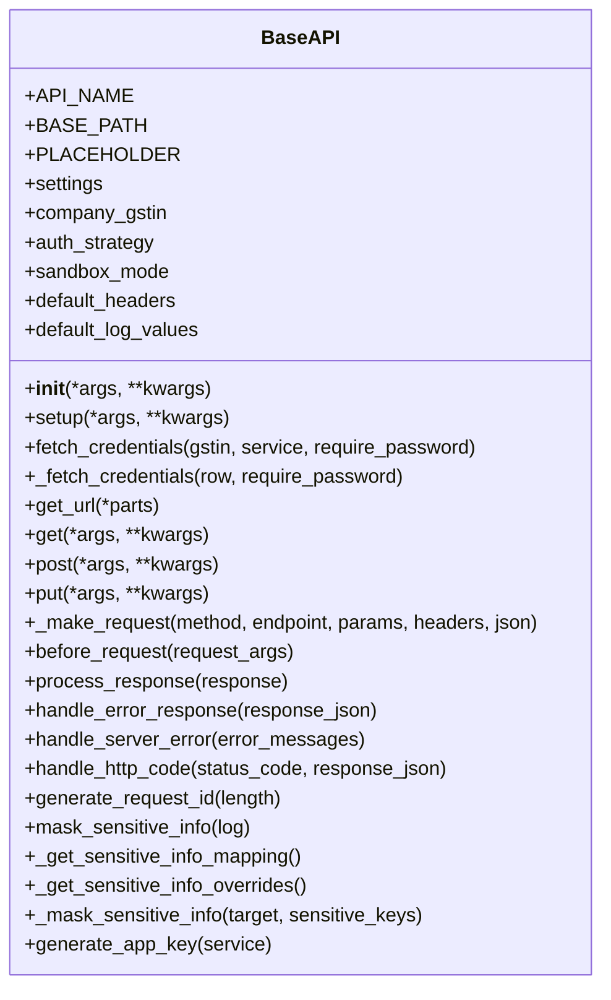
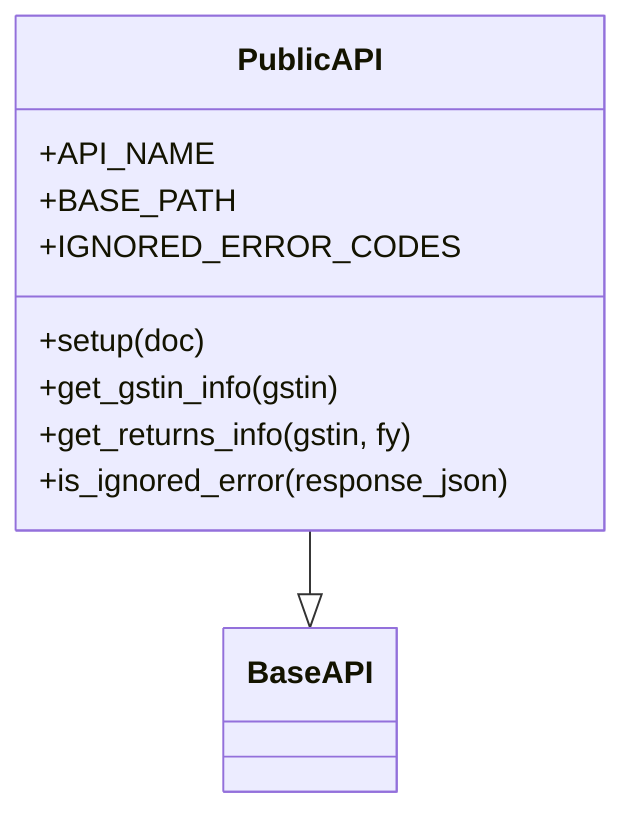
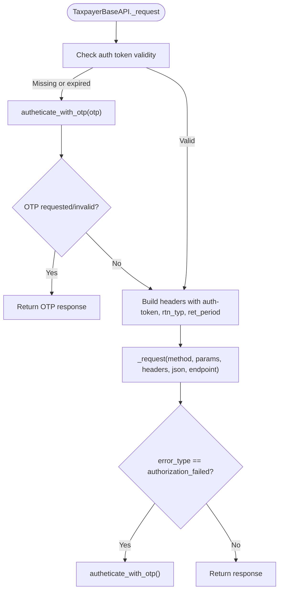
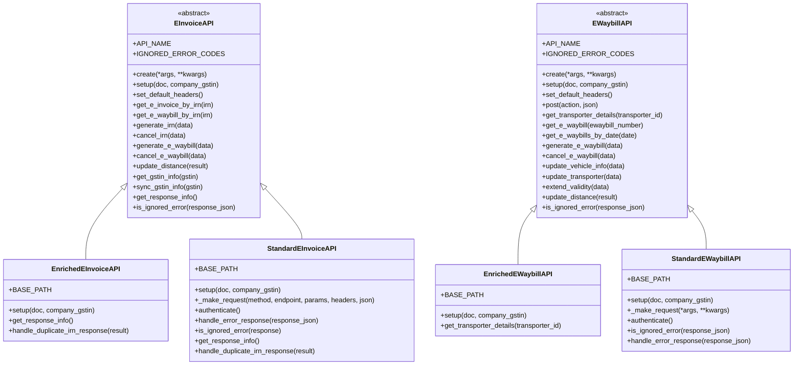
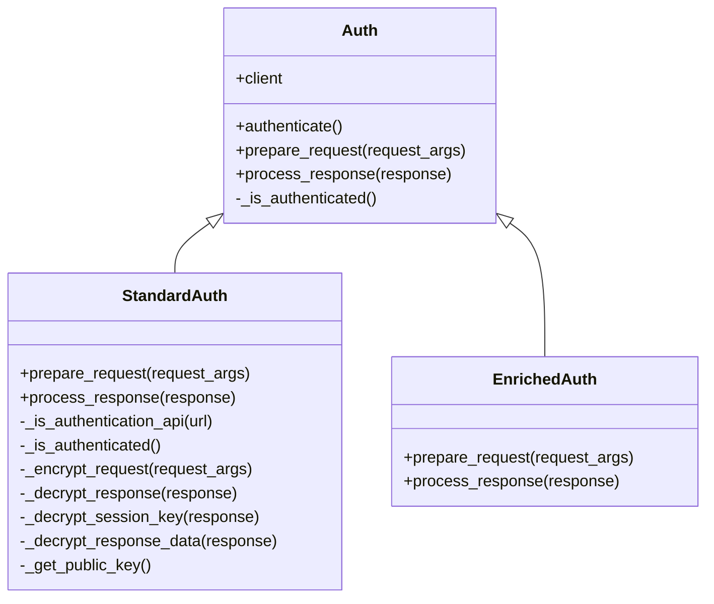
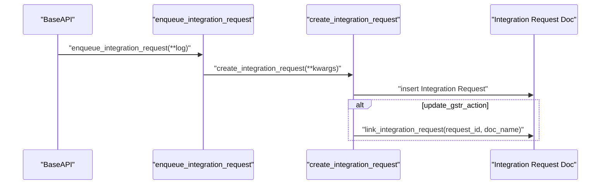
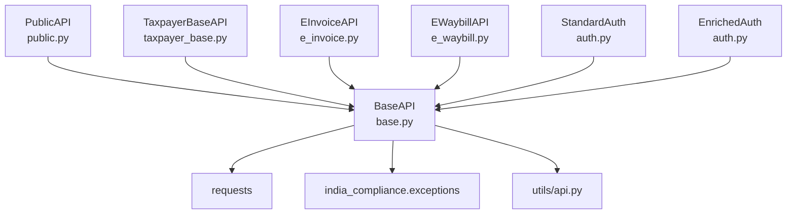

# Base API Architecture

<cite>
**Referenced Files in This Document**
- [base.py](file://india_compliance/gst_india/api_classes/base.py)
- [public.py](file://india_compliance/gst_india/api_classes/public.py)
- [taxpayer_base.py](file://india_compliance/gst_india/api_classes/taxpayer_base.py)
- [e_invoice.py](file://india_compliance/gst_india/api_classes/nic/e_invoice.py)
- [e_waybill.py](file://india_compliance/gst_india/api_classes/nic/e_waybill.py)
- [auth.py](file://india_compliance/gst_india/api_classes/nic/auth.py)
- [api.py](file://india_compliance/gst_india/utils/api.py)
- [test_mask_sensitive_info.py](file://india_compliance/gst_india/api_classes/test_mask_sensitive_info.py)
- [test_auth.py](file://india_compliance/gst_india/api_classes/nic/test_auth.py)
</cite>

## Table of Contents
1. [Introduction](#introduction)
2. [Project Structure](#project-structure)
3. [Core Components](#core-components)
4. [Architecture Overview](#architecture-overview)
5. [Detailed Component Analysis](#detailed-component-analysis)
6. [Dependency Analysis](#dependency-analysis)
7. [Performance Considerations](#performance-considerations)
8. [Troubleshooting Guide](#troubleshooting-guide)
9. [Conclusion](#conclusion)
10. [Appendices](#appendices)

## Introduction
This document explains the Base API Architecture used across the India Compliance application for interacting with external GST APIs. It covers the foundational BaseAPI class design, request and response lifecycle, authentication strategy pattern, sandbox mode, secure communications, sensitive data masking, and integration request queuing. Practical examples show how to extend BaseAPI, implement custom authentication strategies, and handle various response types. The document also outlines error handling, logging, and scheduler dependency requirements.

## Project Structure
The Base API Architecture spans several modules:
- Base API foundation and shared utilities
- Public API for GST Public endpoints
- Taxpayer APIs for Returns and standard e-Invoice/e-Waybill flows
- Authentication strategies for NIC and enriched flows
- Integration request queuing and logging

**Diagram sources**
- [base.py](file://india_compliance/gst_india/api_classes/base.py#L23-L413)
- [public.py](file://india_compliance/gst_india/api_classes/public.py#L7-L65)
- [taxpayer_base.py](file://india_compliance/gst_india/api_classes/taxpayer_base.py#L321-L527)
- [e_invoice.py](file://india_compliance/gst_india/api_classes/nic/e_invoice.py#L12-L271)
- [e_waybill.py](file://india_compliance/gst_india/api_classes/nic/e_waybill.py#L17-L259)
- [auth.py](file://india_compliance/gst_india/api_classes/nic/auth.py#L27-L195)
- [api.py](file://india_compliance/gst_india/utils/api.py#L4-L57)

**Section sources**
- [base.py](file://india_compliance/gst_india/api_classes/base.py#L1-L413)
- [public.py](file://india_compliance/gst_india/api_classes/public.py#L1-L65)
- [taxpayer_base.py](file://india_compliance/gst_india/api_classes/taxpayer_base.py#L1-L527)
- [e_invoice.py](file://india_compliance/gst_india/api_classes/nic/e_invoice.py#L1-L271)
- [e_waybill.py](file://india_compliance/gst_india/api_classes/nic/e_waybill.py#L1-L259)
- [auth.py](file://india_compliance/gst_india/api_classes/nic/auth.py#L1-L195)
- [api.py](file://india_compliance/gst_india/utils/api.py#L1-L57)

## Core Components
- BaseAPI: Central class providing initialization, credential management, URL construction, HTTP method dispatch, request lifecycle, error handling, response processing, and sensitive data masking.
- PublicAPI: Extends BaseAPI for GST Public endpoints with sandbox restrictions and specific helpers.
- TaxpayerBaseAPI: Adds Returns API authentication and encryption/decryption for standard taxpayer flows.
- EInvoiceAPI and EWaybillAPI: Implement e-Invoice and e-Waybill integrations with dual modes (Standard vs Enriched) and authentication strategies.
- Auth strategies: StandardAuth and EnrichedAuth define encryption/decryption and token handling for NIC and enriched flows.
- Integration Request Queue: Asynchronous logging of API calls via enqueue and create_integration_request.

Key responsibilities:
- Initialization and settings validation
- Credential fetching and session management
- URL composition with sandbox mode
- HTTP request lifecycle and response normalization
- Error classification and throwing
- Secure request/response handling and HMAC verification
- Sensitive data masking across logs
- Integration request logging and linking

**Section sources**
- [base.py](file://india_compliance/gst_india/api_classes/base.py#L23-L413)
- [public.py](file://india_compliance/gst_india/api_classes/public.py#L7-L65)
- [taxpayer_base.py](file://india_compliance/gst_india/api_classes/taxpayer_base.py#L321-L527)
- [e_invoice.py](file://india_compliance/gst_india/api_classes/nic/e_invoice.py#L12-L271)
- [e_waybill.py](file://india_compliance/gst_india/api_classes/nic/e_waybill.py#L17-L259)
- [auth.py](file://india_compliance/gst_india/api_classes/nic/auth.py#L27-L195)
- [api.py](file://india_compliance/gst_india/utils/api.py#L4-L57)

## Architecture Overview
The Base API Architecture follows a layered design:
- BaseAPI orchestrates request lifecycle and security
- Subclasses specialize for domain (Public, Taxpayer, e-Invoice, e-Waybill)
- Authentication strategies encapsulate encryption/decryption and token management
- Integration queue persists API logs asynchronously

**Diagram sources**
- [base.py](file://india_compliance/gst_india/api_classes/base.py#L124-L228)
- [auth.py](file://india_compliance/gst_india/api_classes/nic/auth.py#L43-L66)
- [api.py](file://india_compliance/gst_india/utils/api.py#L4-L57)

## Detailed Component Analysis

### BaseAPI: Foundation and Lifecycle
- Initialization and settings:
  - Validates API enablement and raises if disabled
  - Loads GST Settings, sandbox mode, and default headers (including x-api-key)
- Credential management:
  - fetch_credentials retrieves credentials by GSTIN and service
  - _fetch_credentials loads password, session key, expiry, auth token, and session IP
- URL construction:
  - get_url builds absolute URLs with BASE_PATH and sandbox prefix
- HTTP method handling:
  - get, post, put delegate to _make_request
  - _make_request validates method, merges headers, logs request, executes request, parses JSON, handles HTTP codes, normalizes response, and enqueues integration logs
- Authentication strategy:
  - before_request delegates to auth_strategy.prepare_request if present
  - process_response delegates to auth_strategy.process_response if present
- Error handling:
  - handle_error_response checks success flag and throws if not successful
  - handle_server_error maps known error patterns to exceptions
  - handle_http_code maps HTTP status codes to specific errors
- Response processing:
  - Ensures JSON response; supports binary for tar.gz
  - Normalizes result via response.get("result", response)
- Sensitive data masking:
  - mask_sensitive_info applies masks across headers, output, data, and body based on a configurable mapping
  - _get_sensitive_info_mapping merges defaults with subclass overrides
- Scheduler requirement:
  - check_scheduler_status ensures scheduler is enabled for certain flows

**Diagram sources**
- [base.py](file://india_compliance/gst_india/api_classes/base.py#L23-L413)

**Section sources**
- [base.py](file://india_compliance/gst_india/api_classes/base.py#L23-L413)

### PublicAPI: Sandbox Restrictions and Helpers
- Extends BaseAPI with API_NAME "GST Public" and BASE_PATH "commonapi"
- setup enforces sandbox restrictions for party autofill and attaches reference metadata to logs
- Provides helpers:
  - get_gstin_info: fetches GSTIN details with sandbox augmentation
  - get_returns_info: fetches return filing information
- Error handling:
  - is_ignored_error maps specific error codes to ignored errors and updates response metadata

**Diagram sources**
- [public.py](file://india_compliance/gst_india/api_classes/public.py#L7-L65)
- [base.py](file://india_compliance/gst_india/api_classes/base.py#L23-L413)

**Section sources**
- [public.py](file://india_compliance/gst_india/api_classes/public.py#L7-L65)

### TaxpayerBaseAPI: Returns Authentication and Encryption
- Extends TaxpayerAuthenticate and integrates with BaseAPI
- setup enforces sandbox mode restriction for Returns and sets headers including gstin, state-cd, username, txn, ip-usr
- _request coordinates OTP-based authentication and forwards requests with action parameters
- before_request and process_response integrate encryption/decryption for request/response
- decrypt_response handles auth token/session key updates and HMAC verification
- encrypt_request manages app_key and otp encryption and HMAC/signature computation
- handle_error_response maps error codes and triggers certificate refresh on invalid public key
- is_ignored_error maps specific error codes to controlled outcomes (otp_requested, invalid_otp, etc.)
- get_files supports queued file retrieval and decryption

**Diagram sources**
- [taxpayer_base.py](file://india_compliance/gst_india/api_classes/taxpayer_base.py#L347-L383)
- [taxpayer_base.py](file://india_compliance/gst_india/api_classes/taxpayer_base.py#L397-L403)

**Section sources**
- [taxpayer_base.py](file://india_compliance/gst_india/api_classes/taxpayer_base.py#L321-L527)

### EInvoiceAPI and EWaybillAPI: Dual Modes and Strategies
- Factory-like creation:
  - EInvoiceAPI.create selects EnrichedEInvoiceAPI in sandbox/use_fallback, otherwise StandardEInvoiceAPI
  - EWaybillAPI.create selects EnrichedEWaybillAPI in sandbox/use_fallback, otherwise StandardEWaybillAPI
- Setup:
  - Validates API enablement and scheduler status
  - Attaches reference metadata to logs
- Headers:
  - set_default_headers adds gstin, user_name/password, requestid
- StandardEInvoiceAPI:
  - Uses StandardAuth; authenticates via POST to auth endpoint
  - Handles duplicate IRN responses and distance extraction
  - Overrides error handling to parse ErrorDetails and map server errors
- EnrichedEInvoiceAPI:
  - Uses EnrichedAuth; simpler flow without encryption/decryption
  - Handles duplicate IRN differently and extracts info from response
- StandardEWaybillAPI:
  - Uses StandardAuth; authenticates via POST to auth endpoint
  - Implements action-based POST helpers and error extraction/formatting
- EnrichedEWaybillAPI:
  - Uses EnrichedAuth; simplified flow with sandbox credentials

**Diagram sources**
- [e_invoice.py](file://india_compliance/gst_india/api_classes/nic/e_invoice.py#L12-L271)
- [e_waybill.py](file://india_compliance/gst_india/api_classes/nic/e_waybill.py#L17-L259)

**Section sources**
- [e_invoice.py](file://india_compliance/gst_india/api_classes/nic/e_invoice.py#L12-L271)
- [e_waybill.py](file://india_compliance/gst_india/api_classes/nic/e_waybill.py#L17-L259)

### Authentication Strategy Pattern
- Auth (base): Defines interface for prepare_request and process_response
- StandardAuth:
  - Encrypts request data using public key for auth API and session key for others
  - Injects auth-token header for non-auth requests
  - Decrypts responses, updates session keys and tokens, verifies HMAC
- EnrichedAuth:
  - Minimal/no encryption/decryption; relies on GSP-managed security

**Diagram sources**
- [auth.py](file://india_compliance/gst_india/api_classes/nic/auth.py#L27-L195)

**Section sources**
- [auth.py](file://india_compliance/gst_india/api_classes/nic/auth.py#L27-L195)

### Integration Request Queuing and Logging
- enqueue_integration_request enqueues create_integration_request with request metadata
- create_integration_request inserts Integration Request with masked headers/data/output/error
- link_integration_request links integration request to GSTR Action by request_id

**Diagram sources**
- [api.py](file://india_compliance/gst_india/utils/api.py#L4-L57)
- [base.py](file://india_compliance/gst_india/api_classes/base.py#L208-L228)

**Section sources**
- [api.py](file://india_compliance/gst_india/utils/api.py#L4-L57)
- [base.py](file://india_compliance/gst_india/api_classes/base.py#L208-L228)

## Dependency Analysis
- BaseAPI depends on:
  - frappe settings and scheduler utilities
  - requests library for HTTP
  - india_compliance.exceptions for specialized errors
  - utils.api for integration request queuing
- PublicAPI depends on BaseAPI
- TaxpayerBaseAPI depends on BaseAPI and cryptography utilities
- EInvoiceAPI/EWaybillAPI depend on BaseAPI and Auth strategies
- Auth strategies depend on cryptography utilities and BaseAPI subclasses

**Diagram sources**
- [base.py](file://india_compliance/gst_india/api_classes/base.py#L1-L413)
- [public.py](file://india_compliance/gst_india/api_classes/public.py#L1-L65)
- [taxpayer_base.py](file://india_compliance/gst_india/api_classes/taxpayer_base.py#L1-L527)
- [e_invoice.py](file://india_compliance/gst_india/api_classes/nic/e_invoice.py#L1-L271)
- [e_waybill.py](file://india_compliance/gst_india/api_classes/nic/e_waybill.py#L1-L259)
- [auth.py](file://india_compliance/gst_india/api_classes/nic/auth.py#L1-L195)
- [api.py](file://india_compliance/gst_india/utils/api.py#L1-L57)

**Section sources**
- [base.py](file://india_compliance/gst_india/api_classes/base.py#L1-L413)
- [api.py](file://india_compliance/gst_india/utils/api.py#L1-L57)

## Performance Considerations
- Asynchronous logging: Integration requests are enqueued to avoid blocking API calls.
- Conditional encryption/decryption: Only applied for StandardAuth flows; EnrichedAuth avoids cryptographic overhead.
- Response normalization: Ensures consistent result extraction to minimize downstream processing.
- Scheduler dependency: Certain flows require scheduler to be enabled to prevent stale tokens and ensure reliability.

## Troubleshooting Guide
Common issues and resolutions:
- API disabled: BaseAPI initialization throws if API is disabled in settings.
- Credentials unavailable: fetch_credentials raises if no matching GSTIN/service credentials are found.
- Sandbox mode restrictions: PublicAPI disallows certain features in sandbox; TaxpayerBaseAPI forbids sandbox for Returns.
- HTTP errors:
  - 401/403 access_denied: Indicates GSP connectivity issues; contact support.
  - 429: API credits exhausted; purchase more credits.
  - 403: Invalid API key; verify configuration.
  - 504: Gateway timeout; retry later.
- Error responses: handle_error_response inspects success flag and throws with message or JSON payload.
- Server errors: handle_server_error maps known patterns to specialized exceptions (e.g., GSP server errors, limit exceeded).
- HMAC mismatch: StandardAuth verifies HMAC during response decryption; mismatches raise validation errors.
- Scheduler disabled: check_scheduler_status throws if scheduler is disabled for flows requiring it.

**Section sources**
- [base.py](file://india_compliance/gst_india/api_classes/base.py#L50-L56)
- [base.py](file://india_compliance/gst_india/api_classes/base.py#L75-L87)
- [base.py](file://india_compliance/gst_india/api_classes/base.py#L282-L312)
- [base.py](file://india_compliance/gst_india/api_classes/base.py#L241-L257)
- [base.py](file://india_compliance/gst_india/api_classes/base.py#L268-L277)
- [auth.py](file://india_compliance/gst_india/api_classes/nic/auth.py#L174-L180)
- [taxpayer_base.py](file://india_compliance/gst_india/api_classes/taxpayer_base.py#L377-L383)

## Conclusion
The Base API Architecture provides a robust, extensible foundation for integrating with GST APIs. It centralizes security, error handling, and logging while enabling domain-specific extensions and authentication strategies. By leveraging asynchronous integration logging and strict sandbox controls, the system maintains reliability and compliance. Developers can extend BaseAPI, implement custom strategies, and handle diverse response types with confidence.

## Appendices

### Practical Examples

- Extending BaseAPI:
  - Create a subclass with API_NAME and BASE_PATH, override setup and any helpers.
  - Example reference: [public.py](file://india_compliance/gst_india/api_classes/public.py#L7-L65)

- Implementing custom authentication strategies:
  - Subclass Auth and implement prepare_request and process_response.
  - Example reference: [auth.py](file://india_compliance/gst_india/api_classes/nic/auth.py#L27-L66)

- Handling different response types:
  - StandardAuth decrypts and validates HMAC; EnrichedAuth passes through.
  - Example reference: [auth.py](file://india_compliance/gst_india/api_classes/nic/auth.py#L107-L184)

- Sensitive data masking:
  - Use mask_sensitive_info to redact headers, output, data, and body.
  - Example reference: [test_mask_sensitive_info.py](file://india_compliance/gst_india/api_classes/test_mask_sensitive_info.py#L1-L176)

- Scheduler dependency:
  - Certain flows call check_scheduler_status to ensure scheduler is enabled.
  - Example reference: [e_invoice.py](file://india_compliance/gst_india/api_classes/nic/e_invoice.py#L58-L58), [e_waybill.py](file://india_compliance/gst_india/api_classes/nic/e_waybill.py#L54-L54)

- Integration request queuing:
  - enqueue_integration_request logs requests asynchronously.
  - Example reference: [api.py](file://india_compliance/gst_india/utils/api.py#L4-L57)

### Security Mechanisms Summary
- Encryption/decryption:
  - Public key encryption for auth requests; session key for regular requests.
  - HMAC verification for response integrity.
- Token management:
  - Session keys and auth tokens refreshed and stored securely.
- Masking:
  - Configurable sensitive info mapping across headers, output, data, and body.
- Sandbox mode:
  - Restricts certain features and injects test credentials for development.

**Section sources**
- [auth.py](file://india_compliance/gst_india/api_classes/nic/auth.py#L80-L106)
- [auth.py](file://india_compliance/gst_india/api_classes/nic/auth.py#L157-L184)
- [base.py](file://india_compliance/gst_india/api_classes/base.py#L316-L355)
- [public.py](file://india_compliance/gst_india/api_classes/public.py#L16-L21)
- [e_invoice.py](file://india_compliance/gst_india/api_classes/nic/e_invoice.py#L155-L160)
- [e_waybill.py](file://india_compliance/gst_india/api_classes/nic/e_waybill.py#L136-L142)