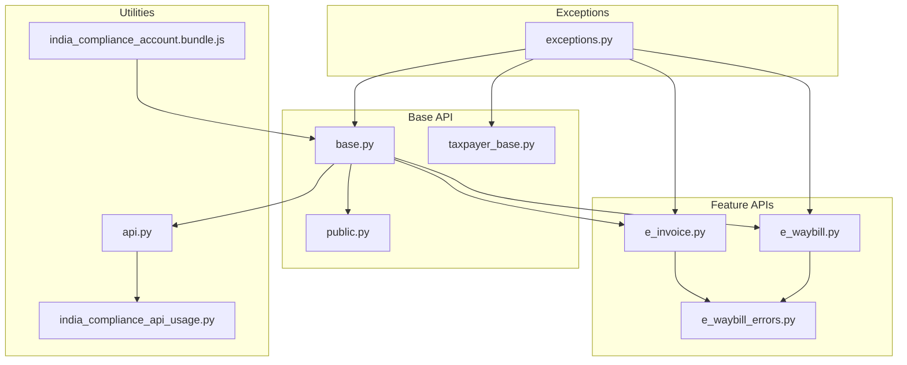
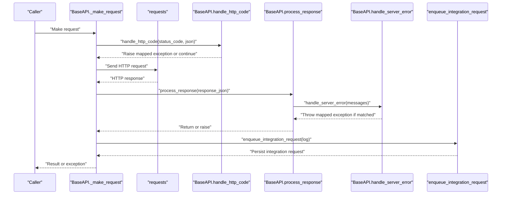
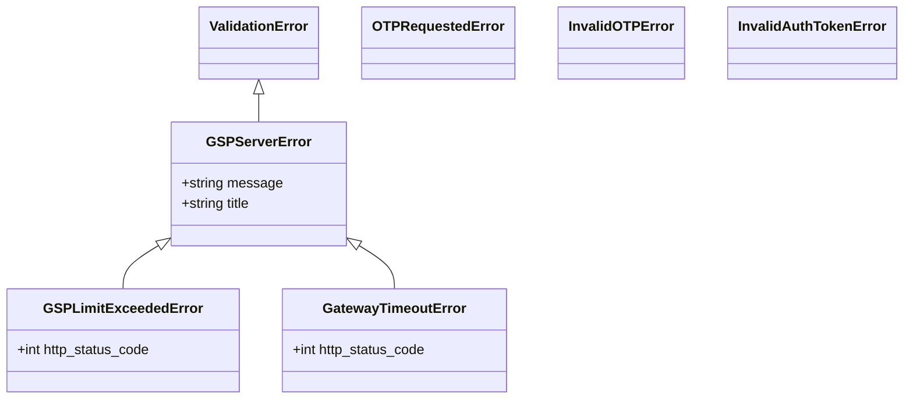
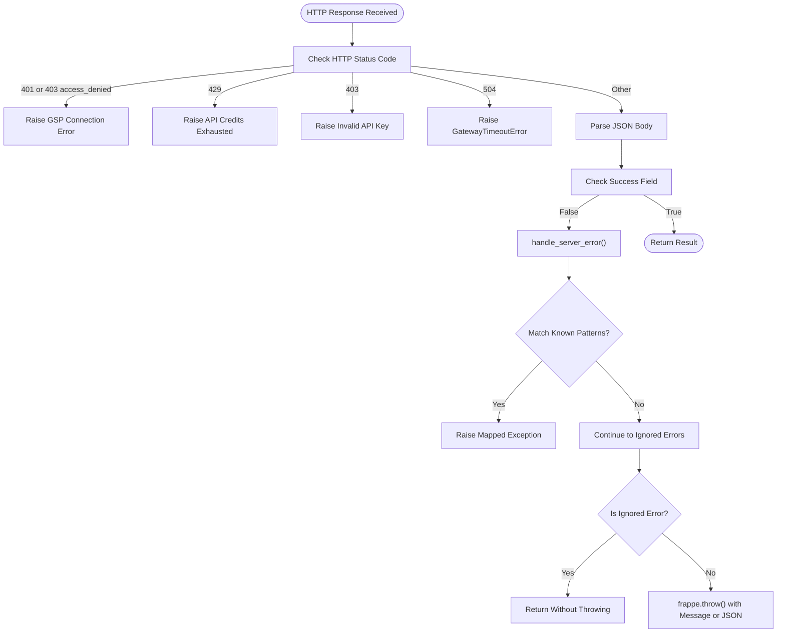
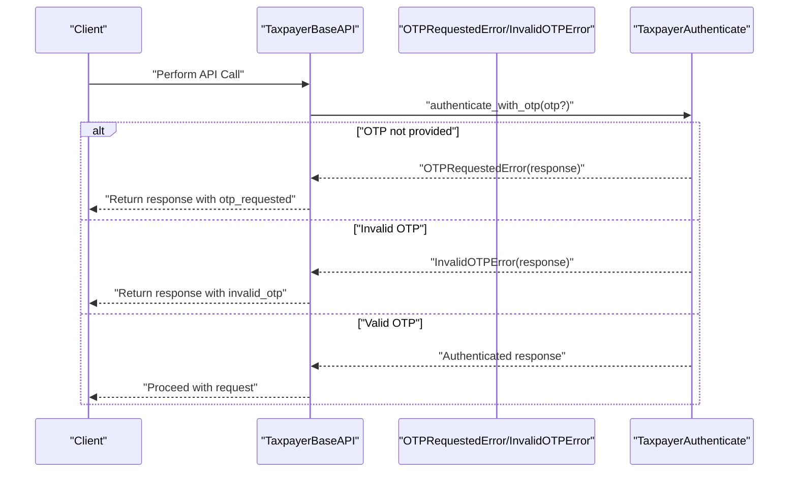
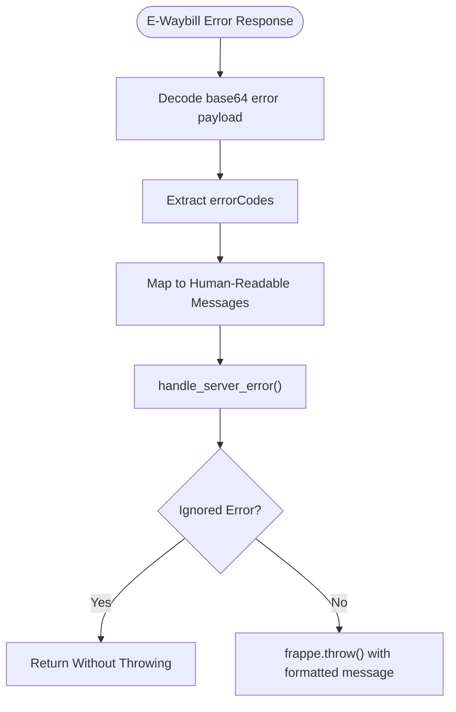
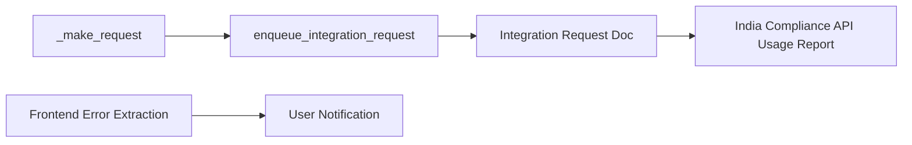
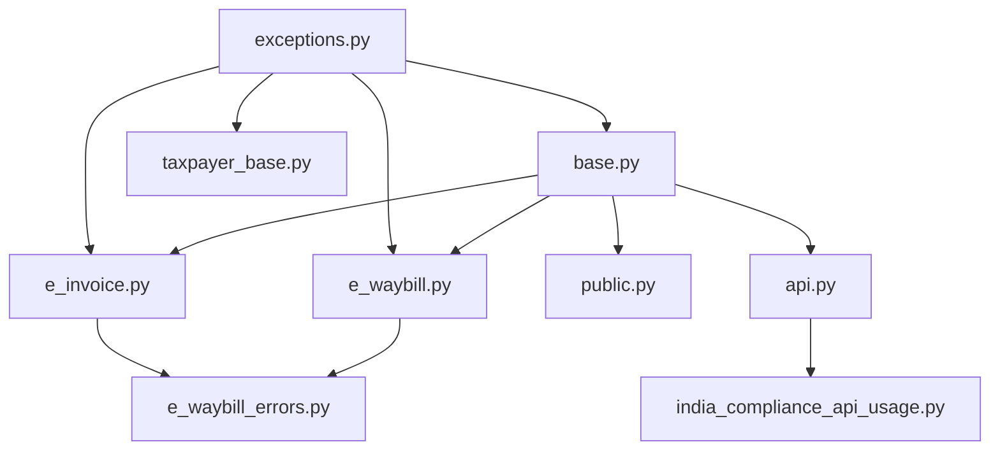

# Error Handling & Retry Mechanisms

<cite>
**Referenced Files in This Document**
- [exceptions.py](file://india_compliance/exceptions.py)
- [base.py](file://india_compliance/gst_india/api_classes/base.py)
- [taxpayer_base.py](file://india_compliance/gst_india/api_classes/taxpayer_base.py)
- [public.py](file://india_compliance/gst_india/api_classes/public.py)
- [e_waybill.py](file://india_compliance/gst_india/api_classes/nic/e_waybill.py)
- [e_invoice.py](file://india_compliance/gst_india/api_classes/nic/e_invoice.py)
- [e_waybill_errors.py](file://india_compliance/gst_india/api_classes/nic/e_waybill_errors.py)
- [api.py](file://india_compliance/gst_india/utils/api.py)
- [india_compliance_api_usage.py](file://india_compliance/gst_india/report/india_compliance_api_usage/india_compliance_api_usage.py)
- [india_compliance_account.bundle.js](file://india_compliance/public/js/india_compliance_account/india_compliance_account.bundle.js)
</cite>

## Table of Contents
1. [Introduction](#introduction)
2. [Project Structure](#project-structure)
3. [Core Components](#core-components)
4. [Architecture Overview](#architecture-overview)
5. [Detailed Component Analysis](#detailed-component-analysis)
6. [Dependency Analysis](#dependency-analysis)
7. [Performance Considerations](#performance-considerations)
8. [Troubleshooting Guide](#troubleshooting-guide)
9. [Conclusion](#conclusion)
10. [Appendices](#appendices)

## Introduction
This document explains the API error handling and retry mechanisms implemented in the India Compliance module. It covers:
- Exception hierarchy and classification
- Recovery strategies and fault tolerance patterns
- HTTP error mapping and response processing
- Practical examples for custom error handlers and monitoring
- Guidance for implementing retries, exponential backoff, and circuit breaker patterns
- Logging and monitoring capabilities for API error tracking

## Project Structure
The error handling and retry logic spans several modules:
- Exception definitions for GSP server errors, rate limits, gateway timeouts, and OTP-related flows
- Base API class orchestrating HTTP requests, response processing, and error classification
- Feature-specific APIs for e-Invoice, e-Waybill, and Public APIs with tailored error handling
- Utilities for logging integration requests and reporting API usage
- Frontend utilities for extracting and displaying error messages

**Diagram sources**
- [exceptions.py](file://india_compliance/exceptions.py#L1-L50)
- [base.py](file://india_compliance/gst_india/api_classes/base.py#L1-L413)
- [taxpayer_base.py](file://india_compliance/gst_india/api_classes/taxpayer_base.py#L1-L527)
- [public.py](file://india_compliance/gst_india/api_classes/public.py#L1-L65)
- [e_invoice.py](file://india_compliance/gst_india/api_classes/nic/e_invoice.py#L1-L271)
- [e_waybill.py](file://india_compliance/gst_india/api_classes/nic/e_waybill.py#L1-L259)
- [e_waybill_errors.py](file://india_compliance/gst_india/api_classes/nic/e_waybill_errors.py#L1-L35)
- [api.py](file://india_compliance/gst_india/utils/api.py#L1-L57)
- [india_compliance_api_usage.py](file://india_compliance/gst_india/report/india_compliance_api_usage/india_compliance_api_usage.py#L1-L157)
- [india_compliance_account.bundle.js](file://india_compliance/public/js/india_compliance_account/india_compliance_account.bundle.js#L88-L124)

**Section sources**
- [base.py](file://india_compliance/gst_india/api_classes/base.py#L1-L413)
- [exceptions.py](file://india_compliance/exceptions.py#L1-L50)

## Core Components
- Exception hierarchy:
  - GSPServerError: generic server-side error
  - GSPLimitExceededError: rate limit exceeded (HTTP 429)
  - GatewayTimeoutError: gateway timeout (HTTP 504)
  - OTPRequestedError, InvalidOTPError, InvalidAuthTokenError: authentication flows
- Base API:
  - Centralized request lifecycle, response processing, and error classification
  - HTTP code mapping and special-case handling
  - Sensitive data masking and integration request logging
- Feature APIs:
  - E-Invoice and E-Waybill APIs implement specialized error extraction and ignored-error handling
  - Public API handles specific error codes for GST Public endpoints
  - Taxpayer API manages OTP handling and token refresh flows

**Section sources**
- [exceptions.py](file://india_compliance/exceptions.py#L1-L50)
- [base.py](file://india_compliance/gst_india/api_classes/base.py#L124-L320)
- [e_invoice.py](file://india_compliance/gst_india/api_classes/nic/e_invoice.py#L12-L271)
- [e_waybill.py](file://india_compliance/gst_india/api_classes/nic/e_waybill.py#L17-L259)
- [public.py](file://india_compliance/gst_india/api_classes/public.py#L7-L65)
- [taxpayer_base.py](file://india_compliance/gst_india/api_classes/taxpayer_base.py#L29-L477)

## Architecture Overview
The error handling pipeline follows a layered approach:
- HTTP response is parsed and validated
- HTTP status codes are mapped to domain-specific exceptions
- Response-level success checks trigger server error classification
- Ignored error lists prevent unnecessary user-visible errors
- Special flows (e.g., OTP, token refresh) are surfaced via exceptions
- Integration logs are persisted for observability

**Diagram sources**
- [base.py](file://india_compliance/gst_india/api_classes/base.py#L124-L320)

## Detailed Component Analysis

### Exception Hierarchy and Classification
- GSPServerError: generic server error with localized title and message
- GSPLimitExceededError: inherits from GSPServerError and carries HTTP 429 semantics
- GatewayTimeoutError: inherits from GSPServerError and maps to HTTP 504
- OTPRequestedError, InvalidOTPError, InvalidAuthTokenError: used to signal interactive authentication flows and token issues

**Diagram sources**
- [exceptions.py](file://india_compliance/exceptions.py#L1-L50)

**Section sources**
- [exceptions.py](file://india_compliance/exceptions.py#L1-L50)

### HTTP Error Mapping and Response Processing
- HTTP 401 and specific 403 access_denied responses trigger a GSP connection error
- HTTP 429 triggers API credits exhausted
- HTTP 403 triggers invalid API key
- HTTP 504 raises GatewayTimeoutError
- Response-level success checks:
  - Base API: "success" field determines success
  - Taxpayer API: "status_cd" field determines success
  - E-Invoice/E-Waybill APIs: "Status"/"status" fields determine success
- Server error classification:
  - Base API matches error messages against predefined patterns to raise GSPServerError or GSPLimitExceededError
  - E-Waybill API decodes base64-encoded error payload and maps error codes to human-readable messages

**Diagram sources**
- [base.py](file://india_compliance/gst_india/api_classes/base.py#L282-L312)
- [base.py](file://india_compliance/gst_india/api_classes/base.py#L241-L280)
- [e_waybill.py](file://india_compliance/gst_india/api_classes/nic/e_waybill.py#L211-L241)
- [taxpayer_base.py](file://india_compliance/gst_india/api_classes/taxpayer_base.py#L443-L477)

**Section sources**
- [base.py](file://india_compliance/gst_india/api_classes/base.py#L282-L312)
- [base.py](file://india_compliance/gst_india/api_classes/base.py#L241-L280)
- [e_waybill.py](file://india_compliance/gst_india/api_classes/nic/e_waybill.py#L211-L241)
- [taxpayer_base.py](file://india_compliance/gst_india/api_classes/taxpayer_base.py#L443-L477)

### Authentication and OTP Handling
- OTP handling decorator captures OTPRequestedError and InvalidOTPError and returns the response for interactive handling
- Taxpayer API manages OTP request, authentication with OTP, and token refresh
- On invalid tokens, feature APIs trigger token refresh and retry

**Diagram sources**
- [taxpayer_base.py](file://india_compliance/gst_india/api_classes/taxpayer_base.py#L29-L45)
- [taxpayer_base.py](file://india_compliance/gst_india/api_classes/taxpayer_base.py#L127-L188)

**Section sources**
- [taxpayer_base.py](file://india_compliance/gst_india/api_classes/taxpayer_base.py#L29-L45)
- [taxpayer_base.py](file://india_compliance/gst_india/api_classes/taxpayer_base.py#L127-L188)

### E-Waybill Error Handling and Mapping
- Decodes base64-encoded error payload and extracts error codes
- Maps numeric error codes to human-readable messages using ERRORS_MAP
- Uses ignored error lists to suppress non-fatal conditions

**Diagram sources**
- [e_waybill.py](file://india_compliance/gst_india/api_classes/nic/e_waybill.py#L211-L258)
- [e_waybill_errors.py](file://india_compliance/gst_india/api_classes/nic/e_waybill_errors.py#L1-L35)

**Section sources**
- [e_waybill.py](file://india_compliance/gst_india/api_classes/nic/e_waybill.py#L211-L258)
- [e_waybill_errors.py](file://india_compliance/gst_india/api_classes/nic/e_waybill_errors.py#L1-L35)

### E-Invoice Error Handling
- Extracts error details and maps to human-readable messages
- Handles duplicate IRN scenarios and distance updates
- Uses ignored error lists for specific non-fatal conditions

**Section sources**
- [e_invoice.py](file://india_compliance/gst_india/api_classes/nic/e_invoice.py#L215-L241)
- [e_invoice.py](file://india_compliance/gst_india/api_classes/nic/e_invoice.py#L243-L257)

### Public API Error Handling
- Handles specific error codes (e.g., FO8000) and marks them as ignored
- Updates response metadata for downstream handling

**Section sources**
- [public.py](file://india_compliance/gst_india/api_classes/public.py#L49-L64)

### Logging and Monitoring
- Integration requests are enqueued and persisted with request/response logs
- Reports aggregate API usage by endpoint, date, and linked documents
- Frontend utilities extract error messages from server responses for display

**Diagram sources**
- [base.py](file://india_compliance/gst_india/api_classes/base.py#L208-L220)
- [api.py](file://india_compliance/gst_india/utils/api.py#L4-L57)
- [india_compliance_api_usage.py](file://india_compliance/gst_india/report/india_compliance_api_usage/india_compliance_api_usage.py#L105-L156)
- [india_compliance_account.bundle.js](file://india_compliance/public/js/india_compliance_account/india_compliance_account.bundle.js#L88-L124)

**Section sources**
- [api.py](file://india_compliance/gst_india/utils/api.py#L4-L57)
- [india_compliance_api_usage.py](file://india_compliance/gst_india/report/india_compliance_api_usage/india_compliance_api_usage.py#L105-L156)
- [india_compliance_account.bundle.js](file://india_compliance/public/js/india_compliance_account/india_compliance_account.bundle.js#L88-L124)

## Dependency Analysis
- BaseAPI depends on exceptions for raising domain-specific errors
- Feature APIs inherit from BaseAPI and override error handling and ignored error lists
- Taxpayer API adds OTP handling and token refresh flows
- Public API adds specific ignored error handling for GST Public endpoints
- Utilities persist logs and expose reports for monitoring

**Diagram sources**
- [exceptions.py](file://india_compliance/exceptions.py#L1-L50)
- [base.py](file://india_compliance/gst_india/api_classes/base.py#L12-L18)
- [taxpayer_base.py](file://india_compliance/gst_india/api_classes/taxpayer_base.py#L13-L17)
- [e_invoice.py](file://india_compliance/gst_india/api_classes/nic/e_invoice.py#L7-L8)
- [e_waybill.py](file://india_compliance/gst_india/api_classes/nic/e_waybill.py#L7-L13)
- [public.py](file://india_compliance/gst_india/api_classes/public.py#L4)
- [api.py](file://india_compliance/gst_india/utils/api.py#L1-L57)
- [india_compliance_api_usage.py](file://india_compliance/gst_india/report/india_compliance_api_usage/india_compliance_api_usage.py#L1-L157)

**Section sources**
- [base.py](file://india_compliance/gst_india/api_classes/base.py#L12-L18)
- [taxpayer_base.py](file://india_compliance/gst_india/api_classes/taxpayer_base.py#L13-L17)
- [e_invoice.py](file://india_compliance/gst_india/api_classes/nic/e_invoice.py#L7-L8)
- [e_waybill.py](file://india_compliance/gst_india/api_classes/nic/e_waybill.py#L7-L13)
- [public.py](file://india_compliance/gst_india/api_classes/public.py#L4)
- [api.py](file://india_compliance/gst_india/utils/api.py#L1-L57)
- [india_compliance_api_usage.py](file://india_compliance/gst_india/report/india_compliance_api_usage/india_compliance_api_usage.py#L1-L157)

## Performance Considerations
- Minimize repeated token refreshes by caching valid sessions and reusing auth tokens
- Batch and coalesce API calls where feasible to reduce overhead
- Use ignored error lists to avoid unnecessary retries for benign conditions
- Monitor API usage via reports to identify hotspots and optimize retry strategies

[No sources needed since this section provides general guidance]

## Troubleshooting Guide
Common scenarios and resolutions:
- Network timeouts (HTTP 504): Trigger retry with exponential backoff; surface GatewayTimeoutError to callers
- Authentication failures (HTTP 401/403): Re-request OTP or refresh tokens; handle InvalidAuthTokenError gracefully
- Rate limits (HTTP 429): Stop retries temporarily; alert administrators; resume after quota resets
- Service unavailability (GSP server down): Surface GSPServerError; implement circuit breaker to avoid thundering herd
- Duplicate IRN or already-generated e-Waybill: Use ignored error handling to avoid user-facing errors; surface actionable messages

Practical steps:
- Implement retry with exponential backoff for transient errors (timeouts, rate limits)
- Add circuit breaker to temporarily halt requests when GSPServerError occurs frequently
- Configure ignored error lists per API to suppress non-actionable messages
- Use integration request logs and API usage reports to diagnose recurring issues

**Section sources**
- [base.py](file://india_compliance/gst_india/api_classes/base.py#L282-L312)
- [taxpayer_base.py](file://india_compliance/gst_india/api_classes/taxpayer_base.py#L127-L188)
- [e_waybill.py](file://india_compliance/gst_india/api_classes/nic/e_waybill.py#L211-L241)
- [e_invoice.py](file://india_compliance/gst_india/api_classes/nic/e_invoice.py#L215-L241)

## Conclusion
The system provides a robust, layered error handling framework:
- Clear exception hierarchy for server errors, rate limits, and timeouts
- HTTP status mapping and response-level success checks
- Feature-specific error extraction and ignored error handling
- Comprehensive logging and reporting for observability
- Practical patterns for retries, exponential backoff, and circuit breakers

These patterns enable resilient integrations with external APIs while maintaining clear user feedback and operational insights.

[No sources needed since this section summarizes without analyzing specific files]

## Appendices

### Implementing Custom Error Handlers
- Extend ignored error lists in feature APIs to suppress non-fatal conditions
- Add new patterns to ERROR_MESSAGES in BaseAPI for new server error classifications
- Introduce new exceptions in exceptions.py and map them in handle_http_code or handle_server_error

**Section sources**
- [base.py](file://india_compliance/gst_india/api_classes/base.py#L258-L280)
- [e_waybill.py](file://india_compliance/gst_india/api_classes/nic/e_waybill.py#L197-L209)
- [e_invoice.py](file://india_compliance/gst_india/api_classes/nic/e_invoice.py#L243-L257)
- [public.py](file://india_compliance/gst_india/api_classes/public.py#L49-L64)

### Configuring Retry Parameters
- Define max attempts and base delay for exponential backoff
- Use jitter to randomize delays and avoid synchronized retries
- Respect HTTP-specified retry-after headers when present
- Apply circuit breaker thresholds to pause retries after consecutive failures

[No sources needed since this section provides general guidance]

### Monitoring API Health
- Use Integration Request logs to track request/response outcomes
- Leverage the India Compliance API Usage Report to monitor endpoint trends and failures
- Alert on spikes in GatewayTimeoutError or GSPLimitExceededError

**Section sources**
- [api.py](file://india_compliance/gst_india/utils/api.py#L4-L57)
- [india_compliance_api_usage.py](file://india_compliance/gst_india/report/india_compliance_api_usage/india_compliance_api_usage.py#L105-L156)