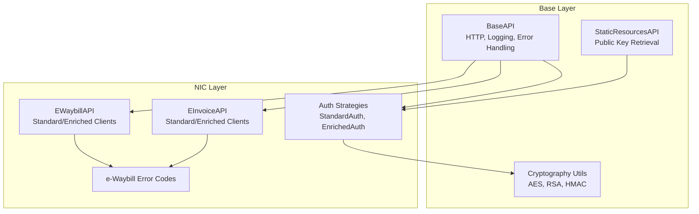
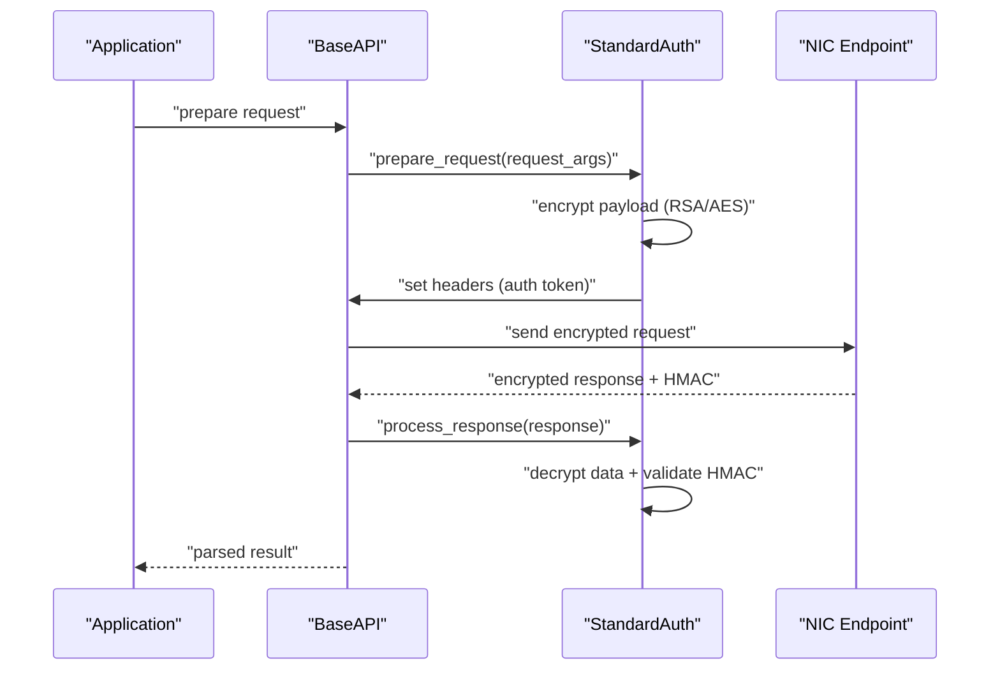
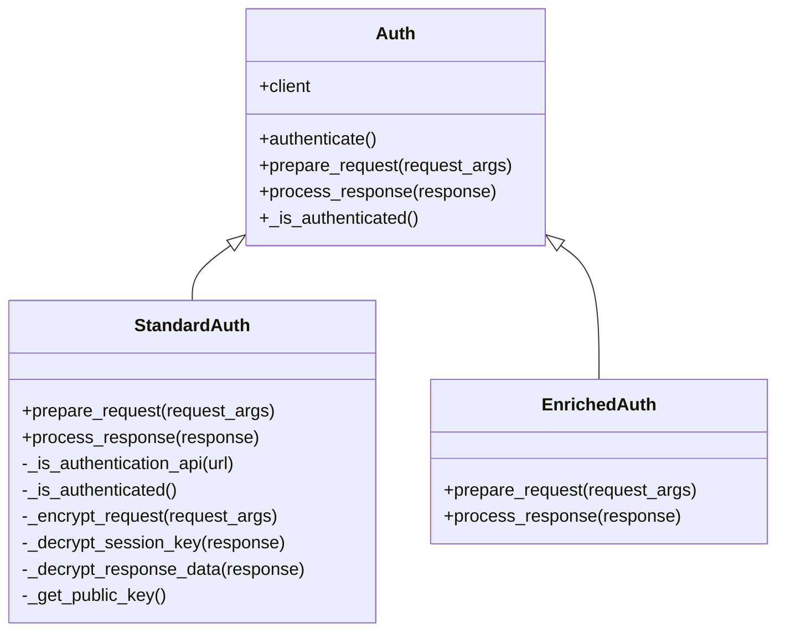
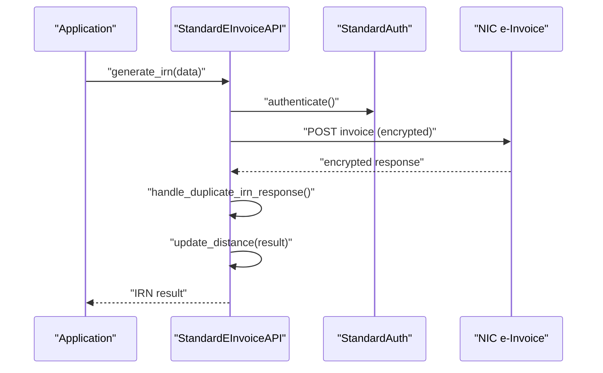
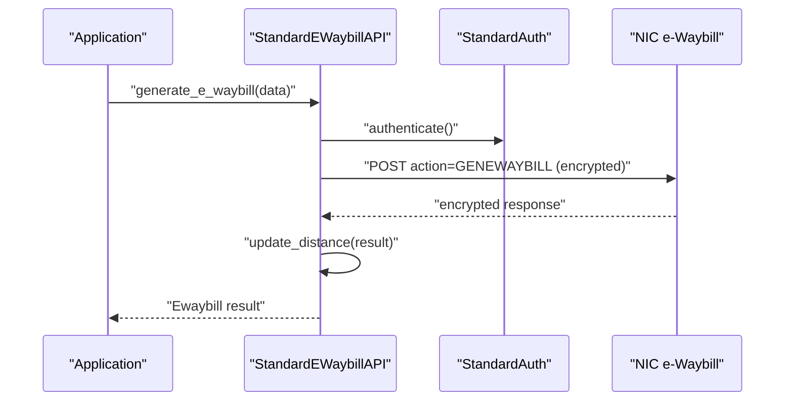
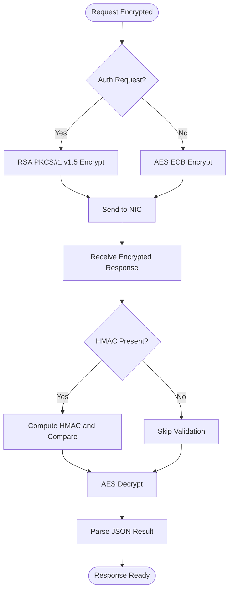
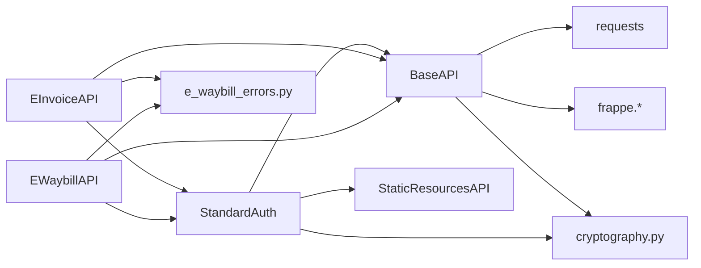

# NIC Portal Integration

<cite>
**Referenced Files in This Document**
- [auth.py](file://india_compliance/gst_india/api_classes/nic/auth.py)
- [e_invoice.py](file://india_compliance/gst_india/api_classes/nic/e_invoice.py)
- [e_waybill.py](file://india_compliance/gst_india/api_classes/nic/e_waybill.py)
- [e_waybill_errors.py](file://india_compliance/gst_india/api_classes/nic/e_waybill_errors.py)
- [base.py](file://india_compliance/gst_india/api_classes/base.py)
- [taxpayer_base.py](file://india_compliance/gst_india/api_classes/taxpayer_base.py)
- [cryptography.py](file://india_compliance/gst_india/utils/cryptography.py)
- [e_invoice.py](file://india_compliance/gst_india/constants/e_invoice.py)
- [e_waybill.py](file://india_compliance/gst_india/constants/e_waybill.py)
- [test_auth.py](file://india_compliance/gst_india/api_classes/nic/test_auth.py)
- [test_e_invoice.json](file://india_compliance/gst_india/data/test_e_invoice.json)
- [test_e_waybill.json](file://india_compliance/gst_india/data/test_e_waybill.json)
</cite>

## Table of Contents
1. [Introduction](#introduction)
2. [Project Structure](#project-structure)
3. [Core Components](#core-components)
4. [Architecture Overview](#architecture-overview)
5. [Detailed Component Analysis](#detailed-component-analysis)
6. [Dependency Analysis](#dependency-analysis)
7. [Performance Considerations](#performance-considerations)
8. [Troubleshooting Guide](#troubleshooting-guide)
9. [Conclusion](#conclusion)
10. [Appendices](#appendices)

## Introduction
This document explains the NIC (National Informatics Centre) portal integration for government GST APIs, focusing on authentication, session key management, encryption/decryption, and the e-invoice and e-waybill workflows. It covers:
- Authentication mechanisms and session lifecycle
- Encryption/decryption strategies for secure communication
- API endpoints and request/response formats
- Error handling, timeouts, and rate limiting
- Sandbox mode and testing procedures
- Practical usage patterns and common integration pitfalls

## Project Structure
The NIC integration is implemented under the GST India module with modular components:
- Base API infrastructure for HTTP requests, logging, and error handling
- NIC-specific authentication and encryption utilities
- e-Invoice and e-Waybill API clients with sandbox-aware behavior
- Cryptographic helpers for AES, RSA, and HMAC operations
- Constants and test fixtures for request/response validation

**Diagram sources**
- [base.py](file://india_compliance/gst_india/api_classes/base.py#L23-L413)
- [auth.py](file://india_compliance/gst_india/api_classes/nic/auth.py#L27-L195)
- [e_invoice.py](file://india_compliance/gst_india/api_classes/nic/e_invoice.py#L12-L271)
- [e_waybill.py](file://india_compliance/gst_india/api_classes/nic/e_waybill.py#L17-L259)
- [e_waybill_errors.py](file://india_compliance/gst_india/api_classes/nic/e_waybill_errors.py#L1-L337)
- [taxpayer_base.py](file://india_compliance/gst_india/api_classes/taxpayer_base.py#L47-L68)
- [cryptography.py](file://india_compliance/gst_india/utils/cryptography.py#L19-L76)

**Section sources**
- [base.py](file://india_compliance/gst_india/api_classes/base.py#L23-L413)
- [auth.py](file://india_compliance/gst_india/api_classes/nic/auth.py#L27-L195)
- [e_invoice.py](file://india_compliance/gst_india/api_classes/nic/e_invoice.py#L12-L271)
- [e_waybill.py](file://india_compliance/gst_india/api_classes/nic/e_waybill.py#L17-L259)
- [e_waybill_errors.py](file://india_compliance/gst_india/api_classes/nic/e_waybill_errors.py#L1-L337)
- [taxpayer_base.py](file://india_compliance/gst_india/api_classes/taxpayer_base.py#L47-L68)
- [cryptography.py](file://india_compliance/gst_india/utils/cryptography.py#L19-L76)

## Core Components
- BaseAPI: Centralized HTTP client with request/response lifecycle, masking, and integration logging.
- Auth strategies: StandardAuth (AES + RSA encryption) and EnrichedAuth (GSP-managed encryption).
- EInvoiceAPI and EWaybillAPI: Feature-specific clients with sandbox-aware routing and error handling.
- Cryptography utilities: AES ECB, RSA PKCS#1 v1.5, HMAC-SHA256 helpers.
- Error mapping: Comprehensive e-waybill error code catalog.

**Section sources**
- [base.py](file://india_compliance/gst_india/api_classes/base.py#L23-L413)
- [auth.py](file://india_compliance/gst_india/api_classes/nic/auth.py#L27-L195)
- [e_invoice.py](file://india_compliance/gst_india/api_classes/nic/e_invoice.py#L12-L271)
- [e_waybill.py](file://india_compliance/gst_india/api_classes/nic/e_waybill.py#L17-L259)
- [cryptography.py](file://india_compliance/gst_india/utils/cryptography.py#L19-L76)
- [e_waybill_errors.py](file://india_compliance/gst_india/api_classes/nic/e_waybill_errors.py#L1-L337)

## Architecture Overview
The integration follows a layered design:
- Application constructs requests with headers and JSON bodies.
- BaseAPI prepares URLs, masks sensitive data, and enforces API availability checks.
- Auth strategy encrypts request payloads and manages session tokens.
- NIC endpoints receive encrypted payloads and respond with encrypted data and optional HMAC.
- BaseAPI decrypts responses, validates HMAC, and exposes structured results.

**Diagram sources**
- [base.py](file://india_compliance/gst_india/api_classes/base.py#L124-L239)
- [auth.py](file://india_compliance/gst_india/api_classes/nic/auth.py#L53-L195)
- [e_invoice.py](file://india_compliance/gst_india/api_classes/nic/e_invoice.py#L178-L271)
- [e_waybill.py](file://india_compliance/gst_india/api_classes/nic/e_waybill.py#L152-L259)

## Detailed Component Analysis

### Authentication and Session Management
- StandardAuth handles:
  - Public key encryption for authentication requests
  - Session key encryption for subsequent requests
  - Decryption of auth responses to extract AuthToken and SessionKey
  - HMAC validation for response integrity
- Session lifecycle:
  - Session expiry stored and checked before reuse
  - Automatic re-authentication on token invalidation
- EnrichedAuth delegates encryption/decryption to GSP.

**Diagram sources**
- [auth.py](file://india_compliance/gst_india/api_classes/nic/auth.py#L27-L195)

**Section sources**
- [auth.py](file://india_compliance/gst_india/api_classes/nic/auth.py#L53-L195)
- [base.py](file://india_compliance/gst_india/api_classes/base.py#L75-L100)

### e-Invoice API Implementation
- Client selection:
  - StandardEInvoiceAPI: Uses StandardAuth and AES-encrypted requests
  - EnrichedEInvoiceAPI: Uses EnrichedAuth (GSP-managed encryption)
- Endpoints:
  - Generate IRN: POST invoice
  - Get IRN: GET invoice/irn
  - Get e-Waybill by IRN: GET ewaybill/irn
  - Cancel IRN: POST invoice/cancel
  - Master data: GET master/gstin, GET master/syncgstin
- Error handling:
  - Ignores predefined error codes (e.g., duplicate IRN)
  - Parses InfoDtls for alerts and updates distance if present
- Sandbox mode:
  - Overrides credentials with test values when enabled

**Diagram sources**
- [e_invoice.py](file://india_compliance/gst_india/api_classes/nic/e_invoice.py#L102-L117)
- [e_invoice.py](file://india_compliance/gst_india/api_classes/nic/e_invoice.py#L178-L271)
- [auth.py](file://india_compliance/gst_india/api_classes/nic/auth.py#L193-L204)

**Section sources**
- [e_invoice.py](file://india_compliance/gst_india/api_classes/nic/e_invoice.py#L12-L271)
- [e_invoice.py](file://india_compliance/gst_india/constants/e_invoice.py#L1-L9)
- [test_e_invoice.json](file://india_compliance/gst_india/data/test_e_invoice.json#L1-L1006)

### e-Waybill API Implementation
- Client selection:
  - StandardEWaybillAPI: Uses StandardAuth and AES-encrypted requests
  - EnrichedEWaybillAPI: Uses EnrichedAuth (GSP-managed encryption)
- Endpoints:
  - Generate: POST action=GENEWAYBILL
  - Update transporter: POST action=UPDATETRANSPORTER
  - Update vehicle info: POST action=VEHEWB
  - Extend validity: POST action=EXTENDVALIDITY
  - Cancel: POST action=CANEWB
  - Get e-waybill: GET GetEwayBill (live) vs getewaybill (sandbox)
  - Get transporters: GET GetTransporterDetails (master path override)
- Error handling:
  - Extracts error codes from base64-encoded error payloads
  - Maps NIC error codes to human-readable messages
  - Ignores predefined error codes (e.g., invalid auth token)
- Sandbox mode:
  - Overrides credentials with test values when enabled

**Diagram sources**
- [e_waybill.py](file://india_compliance/gst_india/api_classes/nic/e_waybill.py#L104-L111)
- [e_waybill.py](file://india_compliance/gst_india/api_classes/nic/e_waybill.py#L152-L259)
- [e_waybill_errors.py](file://india_compliance/gst_india/api_classes/nic/e_waybill_errors.py#L1-L337)

**Section sources**
- [e_waybill.py](file://india_compliance/gst_india/api_classes/nic/e_waybill.py#L17-L259)
- [e_waybill.py](file://india_compliance/gst_india/constants/e_waybill.py#L1-L99)
- [e_waybill_errors.py](file://india_compliance/gst_india/api_classes/nic/e_waybill_errors.py#L1-L337)
- [test_e_waybill.json](file://india_compliance/gst_india/data/test_e_waybill.json#L1-L1433)

### Cryptographic Operations
- AES encryption/decryption (ECB mode) for session-bound data
- RSA PKCS#1 v1.5 encryption for public key-protected auth requests
- HMAC-SHA256 validation for response integrity
- Utilities for hashing and certificate handling

**Diagram sources**
- [auth.py](file://india_compliance/gst_india/api_classes/nic/auth.py#L80-L124)
- [cryptography.py](file://india_compliance/gst_india/utils/cryptography.py#L19-L76)

**Section sources**
- [cryptography.py](file://india_compliance/gst_india/utils/cryptography.py#L19-L76)
- [auth.py](file://india_compliance/gst_india/api_classes/nic/auth.py#L80-L195)

## Dependency Analysis
- BaseAPI depends on:
  - Requests library for HTTP
  - Frappe framework for settings, credentials, and logging
  - Cryptographic utilities for encryption/decryption
- StandardAuth depends on:
  - NIC public key retrieval via StaticResourcesAPI
  - AES and RSA utilities
  - HMAC validation
- EInvoiceAPI/EWaybillAPI depend on:
  - BaseAPI for HTTP transport
  - Auth strategies for encryption and token management
  - Error catalogs for mapping NIC error codes

**Diagram sources**
- [base.py](file://india_compliance/gst_india/api_classes/base.py#L1-L413)
- [auth.py](file://india_compliance/gst_india/api_classes/nic/auth.py#L1-L195)
- [taxpayer_base.py](file://india_compliance/gst_india/api_classes/taxpayer_base.py#L47-L68)
- [e_waybill_errors.py](file://india_compliance/gst_india/api_classes/nic/e_waybill_errors.py#L1-L337)

**Section sources**
- [base.py](file://india_compliance/gst_india/api_classes/base.py#L1-L413)
- [auth.py](file://india_compliance/gst_india/api_classes/nic/auth.py#L1-L195)
- [taxpayer_base.py](file://india_compliance/gst_india/api_classes/taxpayer_base.py#L47-L68)
- [e_waybill_errors.py](file://india_compliance/gst_india/api_classes/nic/e_waybill_errors.py#L1-L337)

## Performance Considerations
- Encryption overhead: RSA encryption for auth requests and AES for subsequent requests adds CPU cost; reuse sessions and avoid unnecessary re-authentication.
- Response decryption: Decrypt and HMAC validation occur per request; batch operations where feasible.
- Network latency: Configure retry/backoff for transient failures; monitor gateway timeouts and rate limits.
- Logging: Sensitive data is masked automatically; avoid logging raw encrypted payloads.

[No sources needed since this section provides general guidance]

## Troubleshooting Guide
Common issues and resolutions:
- Session expiration:
  - Symptom: "Invalid Token" errors
  - Resolution: Clear cached tokens and re-authenticate; the client auto-retries on token invalidation
- Authentication failures:
  - Symptom: "Invalid Username/Password" or "Invalid Token"
  - Resolution: Verify credentials in GST Settings; ensure app_key and session_key are valid
- HMAC mismatch:
  - Symptom: Validation error during response decryption
  - Resolution: Confirm shared session key and proper decryption flow
- Rate limiting:
  - Symptom: "GEN5005" or similar rate limit indicators
  - Resolution: Reduce request frequency; implement exponential backoff
- Connectivity and timeouts:
  - Symptom: Gateway timeout or HTTP 429/403
  - Resolution: Retry with backoff; verify API key validity and network health
- Sandbox mode:
  - Symptom: Unexpected test credentials or responses
  - Resolution: Disable sandbox mode for production; ensure correct credentials are configured

**Section sources**
- [base.py](file://india_compliance/gst_india/api_classes/base.py#L258-L312)
- [e_invoice.py](file://india_compliance/gst_india/api_classes/nic/e_invoice.py#L215-L242)
- [e_waybill.py](file://india_compliance/gst_india/api_classes/nic/e_waybill.py#L211-L241)
- [auth.py](file://india_compliance/gst_india/api_classes/nic/auth.py#L174-L181)

## Conclusion
The NIC portal integration provides robust, secure communication for e-invoice and e-waybill operations. By leveraging standardized authentication, encryption, and error handling, applications can reliably integrate with NIC APIs. Proper session management, sandbox testing, and adherence to rate limits ensure smooth operations in production environments.

[No sources needed since this section summarizes without analyzing specific files]

## Appendices

### Practical Usage Examples
- e-Invoice generation:
  - Use StandardEInvoiceAPI or EnrichedEInvoiceAPI depending on sandbox/fallback settings
  - Submit invoice data; handle duplicate IRN and distance updates
- e-Waybill generation:
  - Use StandardEWaybillAPI or EnrichedEWaybillAPI
  - Provide transporter, vehicle, and item details; update or cancel as needed
- Testing:
  - Enable sandbox mode to use test credentials and endpoints
  - Validate against test fixtures for request/response shapes

**Section sources**
- [e_invoice.py](file://india_compliance/gst_india/api_classes/nic/e_invoice.py#L44-L54)
- [e_waybill.py](file://india_compliance/gst_india/api_classes/nic/e_waybill.py#L40-L50)
- [test_auth.py](file://india_compliance/gst_india/api_classes/nic/test_auth.py#L524-L724)
- [test_e_invoice.json](file://india_compliance/gst_india/data/test_e_invoice.json#L1-L1006)
- [test_e_waybill.json](file://india_compliance/gst_india/data/test_e_waybill.json#L1-L1433)