# Taxpayer Portal Communication

<cite>
**Referenced Files in This Document**
- [base.py](file://india_compliance/gst_india/api_classes/base.py)
- [public.py](file://india_compliance/gst_india/api_classes/public.py)
- [taxpayer_base.py](file://india_compliance/gst_india/api_classes/taxpayer_base.py)
- [taxpayer_e_invoice.py](file://india_compliance/gst_india/api_classes/taxpayer_e_invoice.py)
- [taxpayer_returns.py](file://india_compliance/gst_india/api_classes/taxpayer_returns.py)
- [auth.py](file://india_compliance/gst_india/api_classes/nic/auth.py)
- [e_invoice.py](file://india_compliance/gst_india/api_classes/nic/e_invoice.py)
- [e_waybill.py](file://india_compliance/gst_india/api_classes/nic/e_waybill.py)
- [e_waybill_errors.py](file://india_compliance/gst_india/api_classes/nic/e_waybill_errors.py)
- [india_compliance_api_usage.py](file://india_compliance/gst_india/report/india_compliance_api_usage/india_compliance_api_usage.py)
- [india_compliance_api_usage.js](file://india_compliance/gst_india/report/india_compliance_api_usage/india_compliance_api_usage.js)
- [gstr_action.py](file://india_compliance/gst_india/doctype/gstr_action/gstr_action.py)
</cite>

## Table of Contents
1. [Introduction](#introduction)
2. [Project Structure](#project-structure)
3. [Core Components](#core-components)
4. [Architecture Overview](#architecture-overview)
5. [Detailed Component Analysis](#detailed-component-analysis)
6. [Dependency Analysis](#dependency-analysis)
7. [Performance Considerations](#performance-considerations)
8. [Troubleshooting Guide](#troubleshooting-guide)
9. [Conclusion](#conclusion)
10. [Appendices](#appendices)

## Introduction
This document explains taxpayer portal communication patterns implemented in the codebase, focusing on:
- Direct taxpayer portal integration via authenticated sessions and encryption
- Public API access for autofill and return tracking
- Authentication mechanisms, API key management, and secure communication protocols
- Differences between taxpayer portal and NIC portal integration patterns
- Public API endpoints, whitelisting, and external system integration
- Practical usage examples, response handling, and error recovery
- Security considerations, rate limiting, and API usage monitoring

## Project Structure
The taxpayer portal communication is implemented across several API classes:
- Base HTTP client and shared utilities
- Public API for autofill and return tracking
- Taxpayer portal APIs for returns and e-invoice/e-waybill downloads
- NIC portal APIs for e-invoice and e-waybill with dual authentication modes

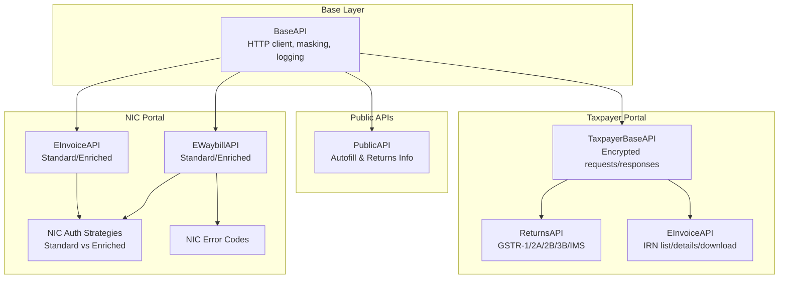

**Diagram sources**
- [base.py](file://india_compliance/gst_india/api_classes/base.py#L23-L413)
- [public.py](file://india_compliance/gst_india/api_classes/public.py#L7-L65)
- [taxpayer_base.py](file://india_compliance/gst_india/api_classes/taxpayer_base.py#L321-L527)
- [taxpayer_returns.py](file://india_compliance/gst_india/api_classes/taxpayer_returns.py#L10-L395)
- [taxpayer_e_invoice.py](file://india_compliance/gst_india/api_classes/taxpayer_e_invoice.py#L7-L69)
- [auth.py](file://india_compliance/gst_india/api_classes/nic/auth.py#L27-L195)
- [e_invoice.py](file://india_compliance/gst_india/api_classes/nic/e_invoice.py#L12-L271)
- [e_waybill.py](file://india_compliance/gst_india/api_classes/nic/e_waybill.py#L17-L259)
- [e_waybill_errors.py](file://india_compliance/gst_india/api_classes/nic/e_waybill_errors.py#L1-L337)

**Section sources**
- [base.py](file://india_compliance/gst_india/api_classes/base.py#L23-L413)
- [public.py](file://india_compliance/gst_india/api_classes/public.py#L7-L65)
- [taxpayer_base.py](file://india_compliance/gst_india/api_classes/taxpayer_base.py#L321-L527)
- [taxpayer_returns.py](file://india_compliance/gst_india/api_classes/taxpayer_returns.py#L10-L395)
- [taxpayer_e_invoice.py](file://india_compliance/gst_india/api_classes/taxpayer_e_invoice.py#L7-L69)
- [auth.py](file://india_compliance/gst_india/api_classes/nic/auth.py#L27-L195)
- [e_invoice.py](file://india_compliance/gst_india/api_classes/nic/e_invoice.py#L12-L271)
- [e_waybill.py](file://india_compliance/gst_india/api_classes/nic/e_waybill.py#L17-L259)
- [e_waybill_errors.py](file://india_compliance/gst_india/api_classes/nic/e_waybill_errors.py#L1-L337)

## Core Components
- BaseAPI: Shared HTTP client with request/response lifecycle, error handling, masking, and integration logging.
- PublicAPI: Stateless public endpoints for autofill and return tracking.
- TaxpayerBaseAPI: Encrypted request/response pipeline for taxpayer portal returns and downloads.
- NIC APIs: Dual-mode e-invoice and e-waybill APIs supporting both Standard (client-side encryption) and Enriched (GSP-managed) authentication.
- Error mapping: Comprehensive error code mapping for NIC e-waybill.

**Section sources**
- [base.py](file://india_compliance/gst_india/api_classes/base.py#L23-L413)
- [public.py](file://india_compliance/gst_india/api_classes/public.py#L7-L65)
- [taxpayer_base.py](file://india_compliance/gst_india/api_classes/taxpayer_base.py#L321-L527)
- [e_invoice.py](file://india_compliance/gst_india/api_classes/nic/e_invoice.py#L12-L271)
- [e_waybill.py](file://india_compliance/gst_india/api_classes/nic/e_waybill.py#L17-L259)
- [e_waybill_errors.py](file://india_compliance/gst_india/api_classes/nic/e_waybill_errors.py#L1-L337)

## Architecture Overview
The system supports two primary integration patterns:
- Taxpayer portal integration: Requires authenticated sessions, encryption/decryption, and HMAC validation for secure data exchange.
- NIC portal integration: Supports Standard (client-side encryption) and Enriched (GSP-managed) authentication modes.

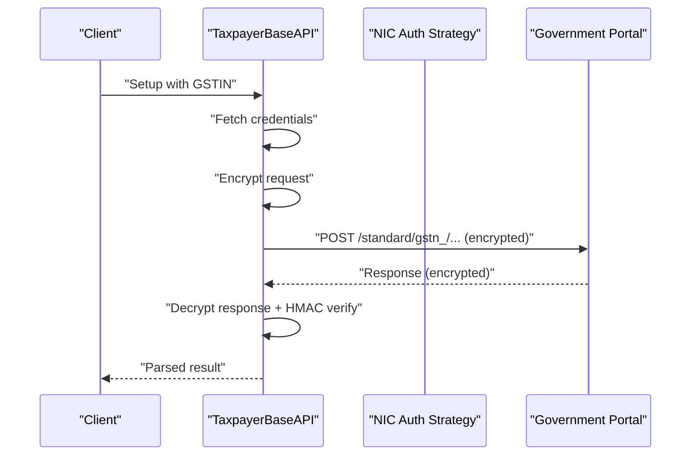

**Diagram sources**
- [taxpayer_base.py](file://india_compliance/gst_india/api_classes/taxpayer_base.py#L321-L527)
- [auth.py](file://india_compliance/gst_india/api_classes/nic/auth.py#L27-L195)

## Detailed Component Analysis

### Public API Access (Autofill and Returns Tracking)
PublicAPI exposes:
- Autofill party information by GSTIN
- Returns tracking by GSTIN and financial year

Key behaviors:
- Enforces sandbox restrictions for autofill
- Generates request IDs for traceability
- Ignores specific “no documents found” error codes

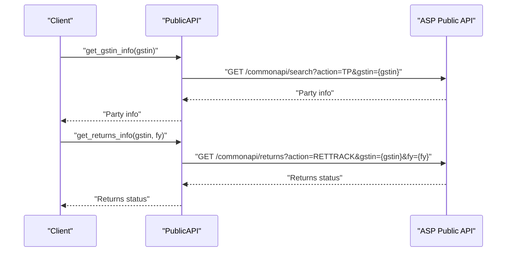

**Diagram sources**
- [public.py](file://india_compliance/gst_india/api_classes/public.py#L31-L65)

**Section sources**
- [public.py](file://india_compliance/gst_india/api_classes/public.py#L7-L65)

### Taxpayer Portal Integration (Returns and Downloads)
TaxpayerBaseAPI implements:
- Encrypted request preparation and HMAC-verified responses
- Session-based authentication with OTP handling
- Download pipeline for return-related files

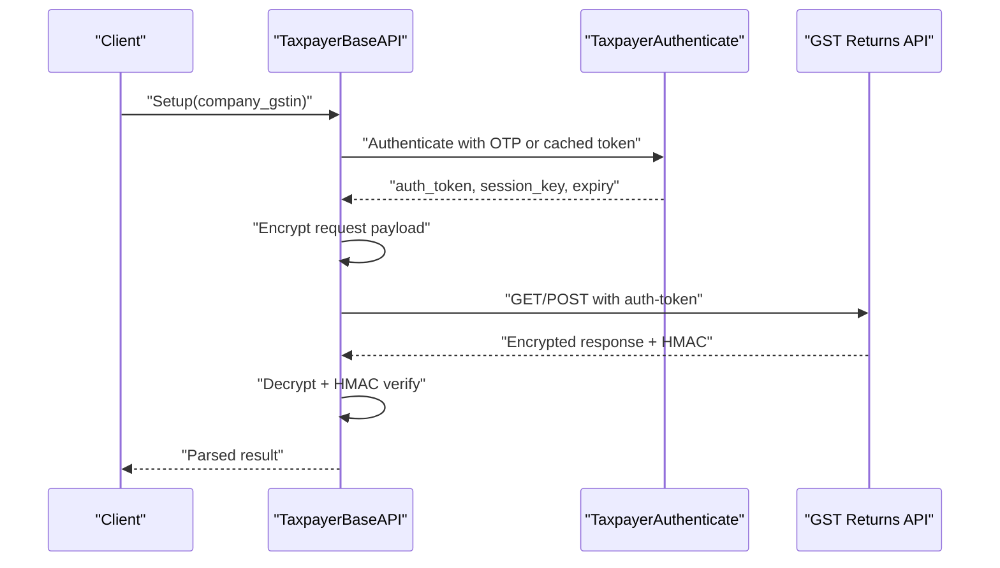

**Diagram sources**
- [taxpayer_base.py](file://india_compliance/gst_india/api_classes/taxpayer_base.py#L321-L527)
- [taxpayer_base.py](file://india_compliance/gst_india/api_classes/taxpayer_base.py#L110-L320)

**Section sources**
- [taxpayer_base.py](file://india_compliance/gst_india/api_classes/taxpayer_base.py#L110-L320)
- [taxpayer_base.py](file://india_compliance/gst_india/api_classes/taxpayer_base.py#L321-L527)

### Returns APIs (GSTR-1/2A/2B/3B/IMS)
ReturnsAPI and specialized classes expose:
- GSTR-1 summary and e-invoice data
- GSTR-2A/2B retrieval and regeneration
- GSTR-3B data, offsets, interest, and filing
- IMS data retrieval and save/reset

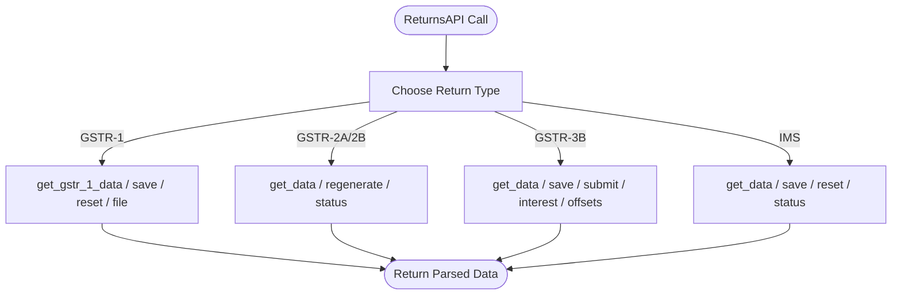

**Diagram sources**
- [taxpayer_returns.py](file://india_compliance/gst_india/api_classes/taxpayer_returns.py#L10-L395)

**Section sources**
- [taxpayer_returns.py](file://india_compliance/gst_india/api_classes/taxpayer_returns.py#L10-L395)

### e-Invoice Taxpayer Integration
EInvoiceAPI provides:
- IRN list filtering by period, supplier/recipient GSTIN
- IRN details lookup
- File downloads for e-invoice batches

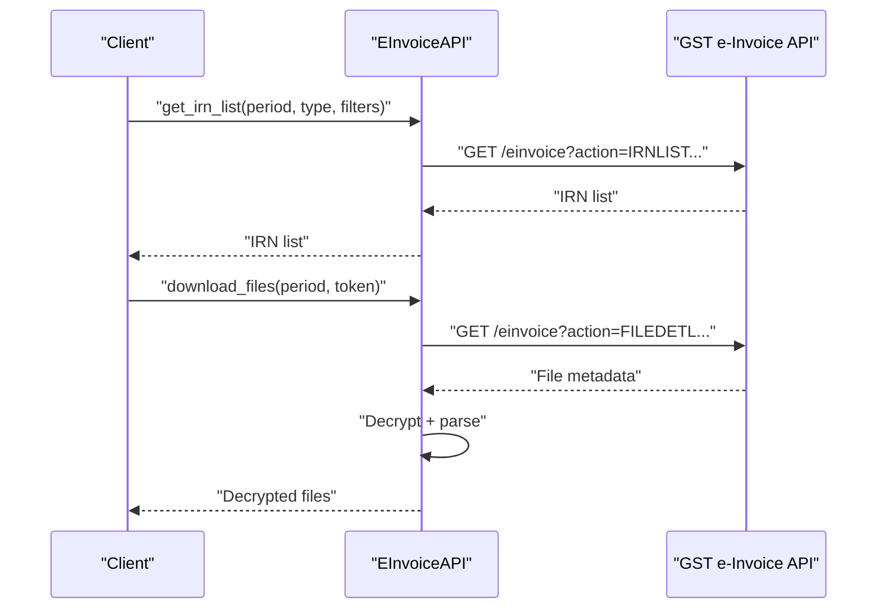

**Diagram sources**
- [taxpayer_e_invoice.py](file://india_compliance/gst_india/api_classes/taxpayer_e_invoice.py#L34-L69)
- [taxpayer_base.py](file://india_compliance/gst_india/api_classes/taxpayer_base.py#L479-L491)

**Section sources**
- [taxpayer_e_invoice.py](file://india_compliance/gst_india/api_classes/taxpayer_e_invoice.py#L7-L69)
- [taxpayer_base.py](file://india_compliance/gst_india/api_classes/taxpayer_base.py#L479-L491)

### NIC Portal Integration (e-Invoice and e-Waybill)
Dual authentication modes:
- Standard: Client-side encryption/decryption and HMAC verification
- Enriched: GSP manages encryption/decryption

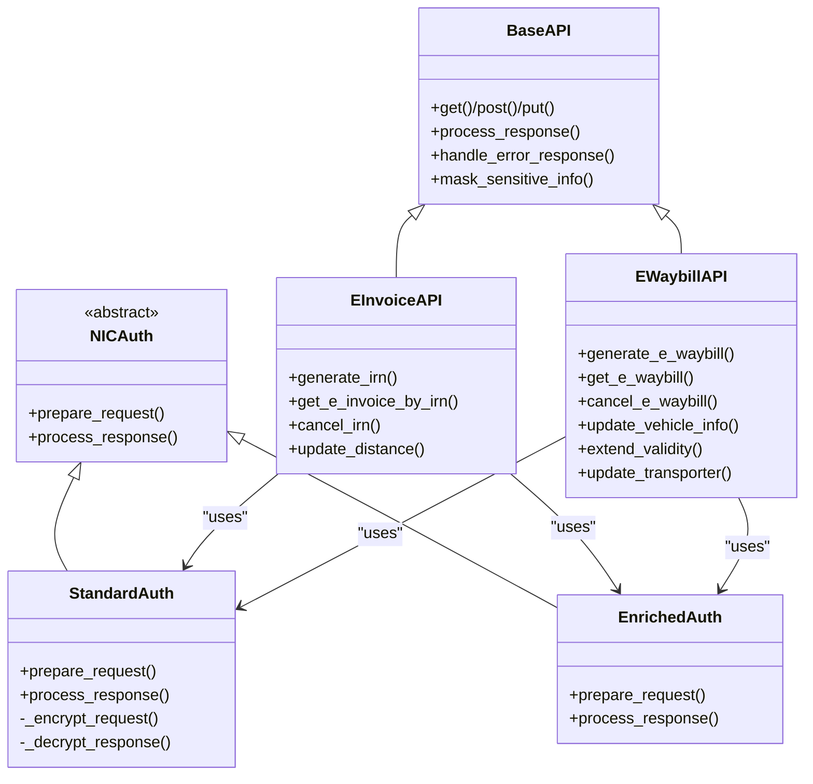

**Diagram sources**
- [base.py](file://india_compliance/gst_india/api_classes/base.py#L23-L413)
- [auth.py](file://india_compliance/gst_india/api_classes/nic/auth.py#L27-L195)
- [e_invoice.py](file://india_compliance/gst_india/api_classes/nic/e_invoice.py#L12-L271)
- [e_waybill.py](file://india_compliance/gst_india/api_classes/nic/e_waybill.py#L17-L259)

**Section sources**
- [auth.py](file://india_compliance/gst_india/api_classes/nic/auth.py#L27-L195)
- [e_invoice.py](file://india_compliance/gst_india/api_classes/nic/e_invoice.py#L12-L271)
- [e_waybill.py](file://india_compliance/gst_india/api_classes/nic/e_waybill.py#L17-L259)

### Error Handling and Recovery
- BaseAPI handles HTTP codes and raises domain-specific exceptions.
- TaxpayerBaseAPI and NIC APIs implement error code mapping and ignored-error handling.
- OTP handling for taxpayer portal authentication.

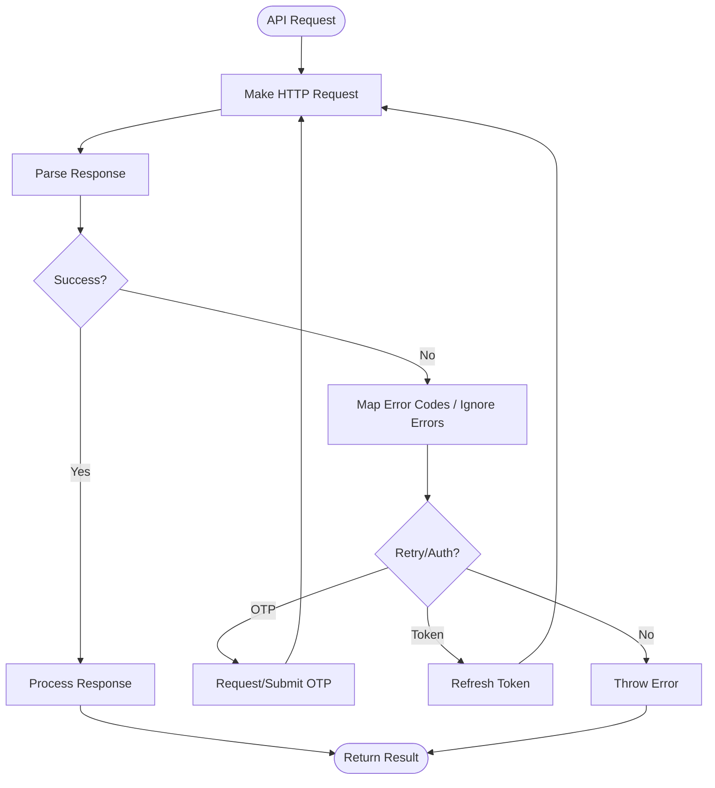

**Diagram sources**
- [base.py](file://india_compliance/gst_india/api_classes/base.py#L124-L220)
- [taxpayer_base.py](file://india_compliance/gst_india/api_classes/taxpayer_base.py#L443-L477)
- [e_waybill.py](file://india_compliance/gst_india/api_classes/nic/e_waybill.py#L211-L259)

**Section sources**
- [base.py](file://india_compliance/gst_india/api_classes/base.py#L124-L220)
- [taxpayer_base.py](file://india_compliance/gst_india/api_classes/taxpayer_base.py#L443-L477)
- [e_waybill.py](file://india_compliance/gst_india/api_classes/nic/e_waybill.py#L211-L259)

## Dependency Analysis
- BaseAPI is the foundation for all API clients and enforces consistent error handling and logging.
- Taxpayer APIs depend on encryption utilities and credential storage.
- NIC APIs depend on authentication strategies and error code mapping.

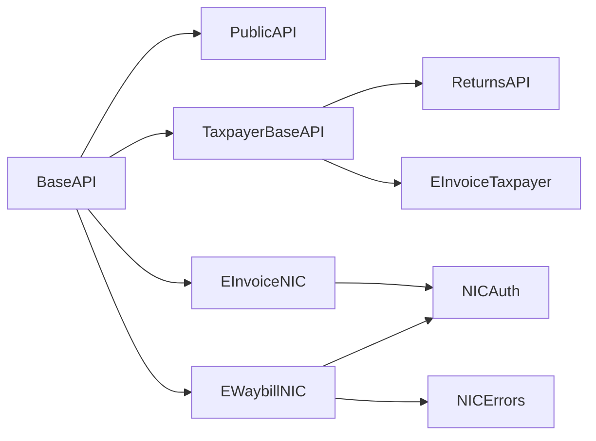

**Diagram sources**
- [base.py](file://india_compliance/gst_india/api_classes/base.py#L23-L413)
- [public.py](file://india_compliance/gst_india/api_classes/public.py#L7-L65)
- [taxpayer_base.py](file://india_compliance/gst_india/api_classes/taxpayer_base.py#L321-L527)
- [taxpayer_returns.py](file://india_compliance/gst_india/api_classes/taxpayer_returns.py#L10-L395)
- [taxpayer_e_invoice.py](file://india_compliance/gst_india/api_classes/taxpayer_e_invoice.py#L7-L69)
- [auth.py](file://india_compliance/gst_india/api_classes/nic/auth.py#L27-L195)
- [e_invoice.py](file://india_compliance/gst_india/api_classes/nic/e_invoice.py#L12-L271)
- [e_waybill.py](file://india_compliance/gst_india/api_classes/nic/e_waybill.py#L17-L259)
- [e_waybill_errors.py](file://india_compliance/gst_india/api_classes/nic/e_waybill_errors.py#L1-L337)

**Section sources**
- [base.py](file://india_compliance/gst_india/api_classes/base.py#L23-L413)
- [taxpayer_base.py](file://india_compliance/gst_india/api_classes/taxpayer_base.py#L321-L527)
- [e_invoice.py](file://india_compliance/gst_india/api_classes/nic/e_invoice.py#L12-L271)
- [e_waybill.py](file://india_compliance/gst_india/api_classes/nic/e_waybill.py#L17-L259)

## Performance Considerations
- Encryption/decryption overhead: Prefer batched downloads and reuse of authenticated sessions.
- Scheduler dependency: e-Invoice/e-Waybill features require the scheduler to be enabled.
- Sandbox mode: Use for development; avoid in production for taxpayer portal APIs.

[No sources needed since this section provides general guidance]

## Troubleshooting Guide
Common issues and recovery steps:
- API key invalid or credits exhausted: Validate API key and ensure sufficient credits.
- Authentication failures: Reset auth token and retry; ensure IP is whitelisted.
- OTP-related errors: Handle OTP requested and invalid OTP scenarios.
- HMAC mismatch: Indicates tampering or decryption key mismatch.
- NIC token invalid: Refresh token and retry request.

**Section sources**
- [base.py](file://india_compliance/gst_india/api_classes/base.py#L282-L312)
- [taxpayer_base.py](file://india_compliance/gst_india/api_classes/taxpayer_base.py#L443-L477)
- [auth.py](file://india_compliance/gst_india/api_classes/nic/auth.py#L174-L183)
- [e_waybill.py](file://india_compliance/gst_india/api_classes/nic/e_waybill.py#L211-L259)

## Conclusion
The codebase implements robust, secure taxpayer portal communication with:
- Encrypted request/response pipelines and HMAC verification
- Dual authentication modes for NIC APIs
- Public APIs for autofill and returns tracking
- Comprehensive error handling and recovery
- Monitoring via integration logs and usage reports

[No sources needed since this section summarizes without analyzing specific files]

## Appendices

### API Usage Monitoring
- India Compliance API Usage report aggregates API requests by endpoint/date/document.

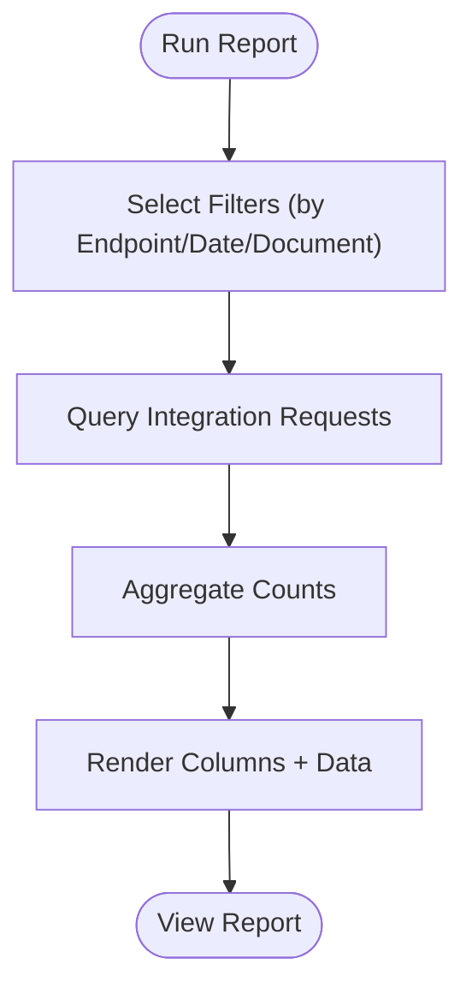

**Diagram sources**
- [india_compliance_api_usage.py](file://india_compliance/gst_india/report/india_compliance_api_usage/india_compliance_api_usage.py#L19-L101)
- [india_compliance_api_usage.js](file://india_compliance/gst_india/report/india_compliance_api_usage/india_compliance_api_usage.js#L4-L42)

**Section sources**
- [india_compliance_api_usage.py](file://india_compliance/gst_india/report/india_compliance_api_usage/india_compliance_api_usage.py#L19-L101)
- [india_compliance_api_usage.js](file://india_compliance/gst_india/report/india_compliance_api_usage/india_compliance_api_usage.js#L4-L42)

### External System Integration and Webhooks
- Government portal callbacks are recorded and linked to documents via GSTR Action records.

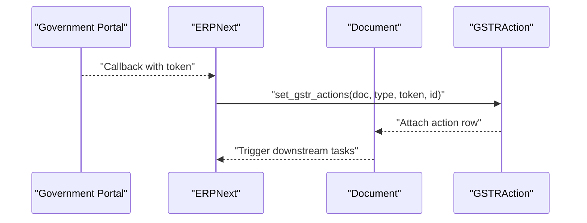

**Diagram sources**
- [gstr_action.py](file://india_compliance/gst_india/doctype/gstr_action/gstr_action.py#L12-L29)

**Section sources**
- [gstr_action.py](file://india_compliance/gst_india/doctype/gstr_action/gstr_action.py#L12-L29)