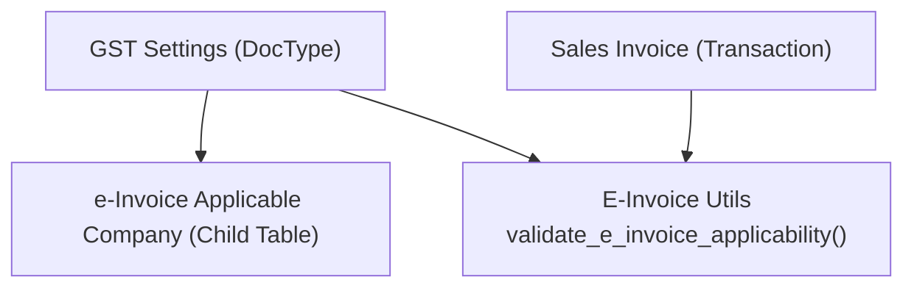
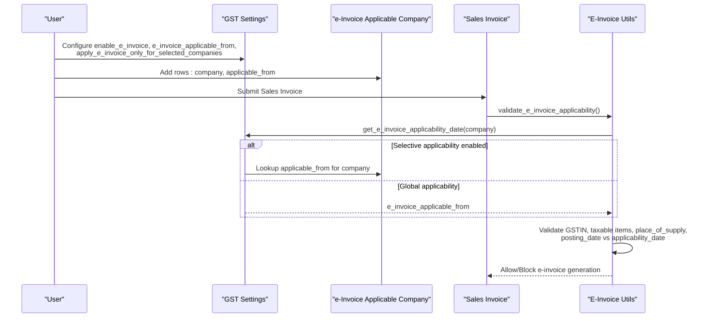
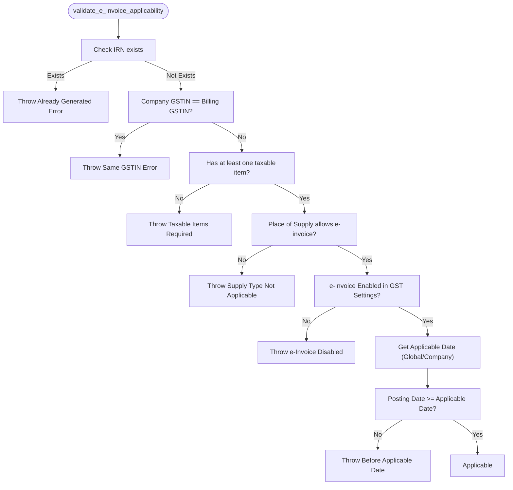
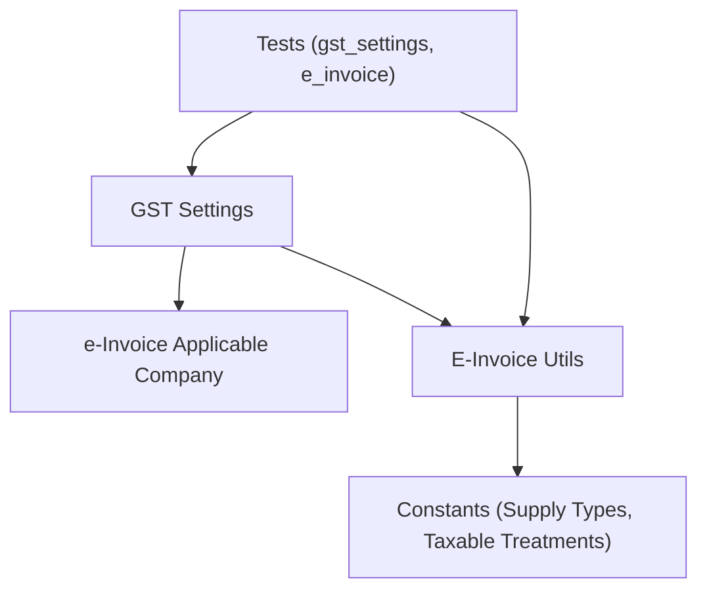

# E-Invoice Applicable Companies

<cite>
**Referenced Files in This Document**
- [e_invoice_applicable_company.json](file://india_compliance/gst_india/doctype/e_invoice_applicable_company/e_invoice_applicable_company.json)
- [e_invoice_applicable_company.py](file://india_compliance/gst_india/doctype/e_invoice_applicable_company/e_invoice_applicable_company.py)
- [gst_settings.json](file://india_compliance/gst_india/doctype/gst_settings/gst_settings.json)
- [gst_settings.py](file://india_compliance/gst_india/doctype/gst_settings/gst_settings.py)
- [e_invoice.py](file://india_compliance/gst_india/utils/e_invoice.py)
- [e_invoice_actions.js](file://india_compliance/gst_india/client_scripts/e_invoice_actions.js)
- [test_gst_settings.py](file://india_compliance/gst_india/doctype/gst_settings/test_gst_settings.py)
- [test_e_invoice.py](file://india_compliance/gst_india/utils/test_e_invoice.py)
- [__init__.py](file://india_compliance/gst_india/constants/__init__.py)
- [e_invoice.py](file://india_compliance/gst_india/constants/e_invoice.py)
</cite>

## Table of Contents
1. [Introduction](#introduction)
2. [Project Structure](#project-structure)
3. [Core Components](#core-components)
4. [Architecture Overview](#architecture-overview)
5. [Detailed Component Analysis](#detailed-component-analysis)
6. [Dependency Analysis](#dependency-analysis)
7. [Performance Considerations](#performance-considerations)
8. [Troubleshooting Guide](#troubleshooting-guide)
9. [Conclusion](#conclusion)

## Introduction
This document explains the E-Invoice Applicable Companies configuration system used to define which companies are required to generate e-invoices based on GST settings. It covers the e_invoice_applicable_company child table, the GST Settings master, applicability criteria (company GSTIN validation, invoice amount thresholds, supply type restrictions, and compliance date requirements), integration with GST Settings, and practical examples for configuring company-specific rules, testing applicability logic, and managing exceptions.

## Project Structure
The E-Invoice Applicable Companies system spans three primary areas:
- Child table definition for company applicability rules
- GST Settings DocType that controls e-invoice applicability globally and per company
- Utilities that enforce applicability rules during invoice creation and validation

**Diagram sources**
- [gst_settings.json](file://india_compliance/gst_india/doctype/gst_settings/gst_settings.json#L1-L745)
- [e_invoice_applicable_company.json](file://india_compliance/gst_india/doctype/e_invoice_applicable_company/e_invoice_applicable_company.json#L1-L43)
- [e_invoice.py](file://india_compliance/gst_india/utils/e_invoice.py#L553-L604)

**Section sources**
- [gst_settings.json](file://india_compliance/gst_india/doctype/gst_settings/gst_settings.json#L1-L745)
- [e_invoice_applicable_company.json](file://india_compliance/gst_india/doctype/e_invoice_applicable_company/e_invoice_applicable_company.json#L1-L43)

## Core Components
- e-Invoice Applicable Company (child table): Defines per-company applicability start date.
- GST Settings (DocType): Controls global e-invoice enablement, applicability date, selective applicability flag, and the list of applicable companies.
- E-Invoice Validation Utilities: Enforce applicability rules at invoice submission/validation time.

Key applicability criteria enforced by the system:
- Company and billing GSTIN must differ
- At least one taxable item must exist
- Place of supply conditions (B2C vs B2B/Overseas)
- Global or company-specific applicability date
- Additional constraints like reporting time limits and item count limits

**Section sources**
- [e_invoice_applicable_company.json](file://india_compliance/gst_india/doctype/e_invoice_applicable_company/e_invoice_applicable_company.json#L1-L43)
- [gst_settings.py](file://india_compliance/gst_india/doctype/gst_settings/gst_settings.py#L48-L61)
- [gst_settings.py](file://india_compliance/gst_india/doctype/gst_settings/gst_settings.py#L192-L218)
- [gst_settings.py](file://india_compliance/gst_india/doctype/gst_settings/gst_settings.py#L293-L328)
- [e_invoice.py](file://india_compliance/gst_india/utils/e_invoice.py#L553-L604)
- [e_invoice.py](file://india_compliance/gst_india/utils/e_invoice.py#L607-L626)
- [e_invoice.py](file://india_compliance/gst_india/utils/e_invoice.py#L118-L149)

## Architecture Overview
The system integrates configuration (GST Settings) with runtime enforcement (E-Invoice Utils). The child table e_invoice_applicable_company stores company-specific applicability dates when selective applicability is enabled.

**Diagram sources**
- [gst_settings.py](file://india_compliance/gst_india/doctype/gst_settings/gst_settings.py#L462-L504)
- [gst_settings.py](file://india_compliance/gst_india/doctype/gst_settings/gst_settings.py#L489-L504)
- [e_invoice.py](file://india_compliance/gst_india/utils/e_invoice.py#L553-L604)

## Detailed Component Analysis

### e-Invoice Applicable Company (Child Table)
- Purpose: Store company-specific applicability start dates when selective applicability is enabled.
- Fields:
  - company: Link to Company
  - applicable_from: Date when e-invoice becomes applicable for the company

Validation rules enforced by GST Settings:
- At least one applicable company must be defined when selective applicability is enabled.
- Each applicable company row requires an applicable_from date.
- applicable_from cannot be earlier than the global start date for e-invoice.
- Duplicate companies in the list are not allowed.

**Section sources**
- [e_invoice_applicable_company.json](file://india_compliance/gst_india/doctype/e_invoice_applicable_company/e_invoice_applicable_company.json#L13-L29)
- [gst_settings.py](file://india_compliance/gst_india/doctype/gst_settings/gst_settings.py#L293-L328)

### GST Settings (Master Configuration)
Key fields impacting e-invoice applicability:
- enable_e_invoice: Enables e-invoice globally
- e_invoice_applicable_from: Global applicability start date (when selective applicability is disabled)
- apply_e_invoice_only_for_selected_companies: Toggle to enable per-company applicability
- e_invoice_applicable_companies: Child table of applicable companies and their dates
- e_invoice_reporting_time_limit_days: Maximum days after posting date for generation
- auto_generate_e_invoice: Optional automation flag

Validation logic:
- Validates mandatory applicability date when e-invoice is enabled.
- Enforces minimum applicability date constraint.
- Enforces validation for child table entries (mandatory applicable_from, min date, uniqueness).
- Triggers background job to update e-invoice statuses when settings change.

**Section sources**
- [gst_settings.json](file://india_compliance/gst_india/doctype/gst_settings/gst_settings.json#L204-L215)
- [gst_settings.json](file://india_compliance/gst_india/doctype/gst_settings/gst_settings.json#L322-L337)
- [gst_settings.py](file://india_compliance/gst_india/doctype/gst_settings/gst_settings.py#L48-L61)
- [gst_settings.py](file://india_compliance/gst_india/doctype/gst_settings/gst_settings.py#L192-L218)
- [gst_settings.py](file://india_compliance/gst_india/doctype/gst_settings/gst_settings.py#L293-L328)
- [gst_settings.py](file://india_compliance/gst_india/doctype/gst_settings/gst_settings.py#L62-L83)

### Applicability Criteria and Enforcement
Runtime validation performed by E-Invoice Utils:
- Prevents generation if IRN already exists
- Blocks if company and billing GSTIN are identical
- Requires at least one taxable item (Taxable or Zero-Rated)
- Allows only B2C invoices with GSTIN or B2B/Overseas invoices
- Requires e-invoice to be enabled in GST Settings
- Checks global or company-specific applicability date
- Enforces reporting time limit (posting date vs applicability date)
- Enforces item count limit

**Diagram sources**
- [e_invoice.py](file://india_compliance/gst_india/utils/e_invoice.py#L553-L604)
- [e_invoice.py](file://india_compliance/gst_india/utils/e_invoice.py#L607-L626)

**Section sources**
- [e_invoice.py](file://india_compliance/gst_india/utils/e_invoice.py#L553-L604)
- [e_invoice.py](file://india_compliance/gst_india/utils/e_invoice.py#L607-L626)
- [e_invoice.py](file://india_compliance/gst_india/utils/e_invoice.py#L118-L149)
- [__init__.py](file://india_compliance/gst_india/constants/__init__.py#L63)

### Frontend Applicability Check
Client-side helper determines whether an invoice’s posting date falls on or after the applicable date for the selected company.

**Section sources**
- [e_invoice_actions.js](file://india_compliance/gst_india/client_scripts/e_invoice_actions.js#L408-L421)

## Dependency Analysis
- GST Settings depends on:
  - e_Invoice Applicable Company child table for per-company applicability
  - E-Invoice Utils for runtime applicability checks
- E-Invoice Utils depends on:
  - GST Settings for applicability date retrieval
  - Constants for supply types and taxable treatments
- Tests validate:
  - Mandatory applicability date constraints
  - Per-company applicability date validation
  - Applicability logic under various scenarios

**Diagram sources**
- [gst_settings.py](file://india_compliance/gst_india/doctype/gst_settings/gst_settings.py#L489-L504)
- [e_invoice.py](file://india_compliance/gst_india/utils/e_invoice.py#L553-L604)
- [__init__.py](file://india_compliance/gst_india/constants/__init__.py#L27-L63)
- [test_gst_settings.py](file://india_compliance/gst_india/doctype/gst_settings/test_gst_settings.py#L58-L82)
- [test_e_invoice.py](file://india_compliance/gst_india/utils/test_e_invoice.py#L763-L854)

**Section sources**
- [gst_settings.py](file://india_compliance/gst_india/doctype/gst_settings/gst_settings.py#L489-L504)
- [e_invoice.py](file://india_compliance/gst_india/utils/e_invoice.py#L553-L604)
- [__init__.py](file://india_compliance/gst_india/constants/__init__.py#L27-L63)
- [test_gst_settings.py](file://india_compliance/gst_india/doctype/gst_settings/test_gst_settings.py#L58-L82)
- [test_e_invoice.py](file://india_compliance/gst_india/utils/test_e_invoice.py#L763-L854)

## Performance Considerations
- Background status updates: When e-invoice settings change, a background job updates pending and not-applicable statuses for applicable companies.
- Query-based status updates: Uses SQL queries to set einvoice_status efficiently for existing invoices meeting criteria.
- Reporting time limit: Prevents generation beyond configured days, reducing unnecessary retries.

**Section sources**
- [gst_settings.py](file://india_compliance/gst_india/doctype/gst_settings/gst_settings.py#L62-L83)
- [gst_settings.py](file://india_compliance/gst_india/doctype/gst_settings/gst_settings.py#L507-L556)

## Troubleshooting Guide
Common validation failures and resolutions:
- “e-Invoice is not applicable for invoices before {date}”: Ensure posting date is on or after the applicable_from date (global or company-specific).
- “e-Invoice is not applicable for company {name}”: The company is not included in the selective applicability list.
- “e-Invoice is not applicable for invoice with only Nil-Rated/Exempted items”: Add at least one Taxable or Zero-Rated item.
- “e-Invoice is not applicable for B2C invoices”: Ensure place_of_supply is not B2C or provide a billing GSTIN.
- “e-Invoice has already been generated”: IRN exists; cannot regenerate.
- “e-Invoice is not enabled in GST Settings”: Enable e-invoice in GST Settings.
- “Row #{0}: applicable_from is mandatory for enabling e-Invoice”: Add applicable_from for each applicable company.
- “Row #{0}: applicable_from date cannot be before {date}”: Adjust applicable_from to be on or after the minimum e-invoice start date.
- “You must select at least one company to which e-Invoice is Applicable”: Add at least one company in the selective applicability list.
- “e-Invoice Reporting Time Limit exceeded”: Post the invoice within the allowed days from the applicable date.

**Section sources**
- [e_invoice.py](file://india_compliance/gst_india/utils/e_invoice.py#L553-L604)
- [e_invoice.py](file://india_compliance/gst_india/utils/e_invoice.py#L607-L626)
- [gst_settings.py](file://india_compliance/gst_india/doctype/gst_settings/gst_settings.py#L192-L218)
- [gst_settings.py](file://india_compliance/gst_india/doctype/gst_settings/gst_settings.py#L293-L328)
- [test_gst_settings.py](file://india_compliance/gst_india/doctype/gst_settings/test_gst_settings.py#L58-L82)
- [test_e_invoice.py](file://india_compliance/gst_india/utils/test_e_invoice.py#L763-L854)

## Conclusion
The E-Invoice Applicable Companies configuration system provides granular control over e-invoice generation by combining global settings with company-specific applicability dates. By enforcing strict validation rules—such as GSTIN differences, taxable item presence, supply type eligibility, applicability dates, and reporting time limits—the system ensures compliance with GST regulations while supporting flexible business scenarios across multiple companies.