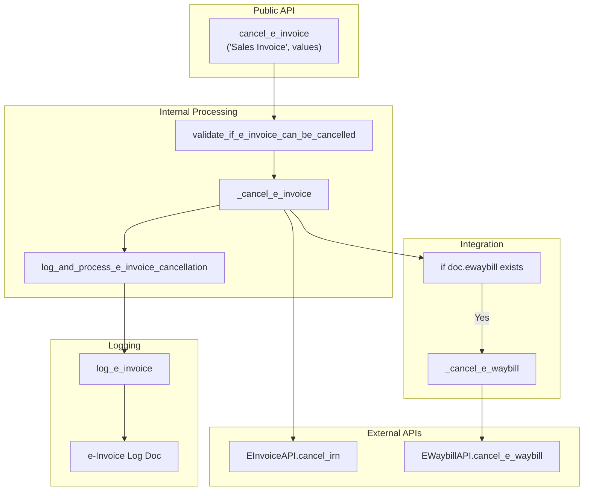
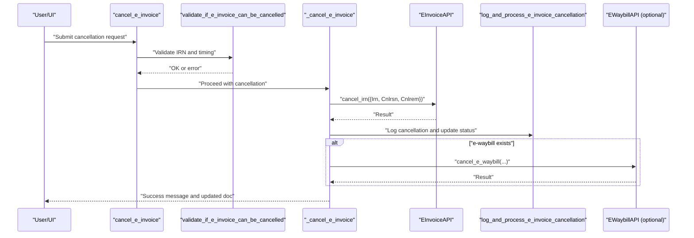
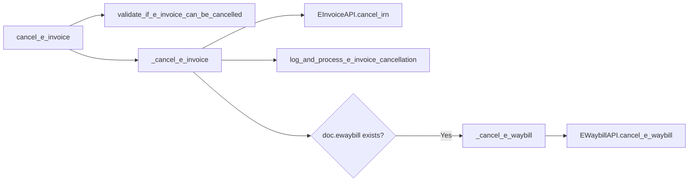

# E-Invoice Cancellation

<cite>
**Referenced Files in This Document**
- [e_invoice.py](file://india_compliance/gst_india/utils/e_invoice.py)
- [e_invoice.py](file://india_compliance/gst_india/api_classes/nic/e_invoice.py)
- [e_waybill.py](file://india_compliance/gst_india/utils/e_waybill.py)
- [e_invoice.py](file://india_compliance/gst_india/constants/e_invoice.py)
- [e_waybill.py](file://india_compliance/gst_india/constants/e_waybill.py)
- [e_invoice_log.py](file://india_compliance/gst_india/doctype/e_invoice_log/e_invoice_log.py)
- [test_e_invoice.py](file://india_compliance/gst_india/utils/test_e_invoice.py)
- [test_e_invoice_e_waybill_workflow.py](file://india_compliance/gst_india/utils/test_e_invoice_e_waybill_workflow.py)
</cite>

## Table of Contents
1. [Introduction](#introduction)
2. [Project Structure](#project-structure)
3. [Core Components](#core-components)
4. [Architecture Overview](#architecture-overview)
5. [Detailed Component Analysis](#detailed-component-analysis)
6. [Dependency Analysis](#dependency-analysis)
7. [Performance Considerations](#performance-considerations)
8. [Troubleshooting Guide](#troubleshooting-guide)
9. [Conclusion](#conclusion)

## Introduction
This document explains the end-to-end E-Invoice Cancellation process in the India Compliance module. It covers the public API for initiating cancellations, internal validation and processing logic, integration with e-waybill cancellation when applicable, and the complete workflow from request to completion with proper logging and notifications.

## Project Structure
The cancellation logic spans several modules:
- Public API entry points for cancellation
- Internal validation and processing functions
- Integration with e-waybill cancellation
- Logging and status updates
- Constants for reason codes and thresholds

**Diagram sources**
- [e_invoice.py](file://india_compliance/gst_india/utils/e_invoice.py#L427-L456)
- [e_invoice.py](file://india_compliance/gst_india/utils/e_invoice.py#L628-L646)
- [e_invoice.py](file://india_compliance/gst_india/utils/e_invoice.py#L437-L456)
- [e_invoice.py](file://india_compliance/gst_india/api_classes/nic/e_invoice.py#L115-L116)
- [e_waybill.py](file://india_compliance/gst_india/utils/e_waybill.py#L385-L411)
- [e_waybill.py](file://india_compliance/gst_india/api_classes/nic/e_waybill.py#L200-L205)

**Section sources**
- [e_invoice.py](file://india_compliance/gst_india/utils/e_invoice.py#L427-L456)
- [e_invoice.py](file://india_compliance/gst_india/utils/e_invoice.py#L628-L646)
- [e_waybill.py](file://india_compliance/gst_india/utils/e_waybill.py#L385-L411)

## Core Components
- Public API: cancel_e_invoice
- Internal processing: _cancel_e_invoice
- Validation: validate_if_e_invoice_can_be_cancelled
- Logging and status updates: log_and_process_e_invoice_cancellation
- Integration: automatic e-waybill cancellation when present
- Reason codes: CANCEL_REASON_CODES constants

**Section sources**
- [e_invoice.py](file://india_compliance/gst_india/utils/e_invoice.py#L427-L456)
- [e_invoice.py](file://india_compliance/gst_india/utils/e_invoice.py#L437-L456)
- [e_invoice.py](file://india_compliance/gst_india/utils/e_invoice.py#L628-L646)
- [e_invoice.py](file://india_compliance/gst_india/constants/e_invoice.py#L1-L6)
- [e_waybill.py](file://india_compliance/gst_india/constants/e_waybill.py#L35-L40)

## Architecture Overview
The cancellation flow begins with a user action or system trigger. The system validates cancellation eligibility, prepares cancellation data, invokes the external e-Invoice API, and optionally cancels the linked e-waybill. All actions are logged and the document’s status is updated accordingly.

**Diagram sources**
- [e_invoice.py](file://india_compliance/gst_india/utils/e_invoice.py#L427-L456)
- [e_invoice.py](file://india_compliance/gst_india/utils/e_invoice.py#L437-L456)
- [e_invoice.py](file://india_compliance/gst_india/utils/e_invoice.py#L628-L646)
- [e_invoice.py](file://india_compliance/gst_india/api_classes/nic/e_invoice.py#L115-L116)
- [e_waybill.py](file://india_compliance/gst_india/utils/e_waybill.py#L385-L411)

## Detailed Component Analysis

### Public API: cancel_e_invoice
- Purpose: Exposed API to cancel an e-Invoice for a Sales Invoice.
- Behavior:
  - Loads the Sales Invoice in cancel state.
  - Parses JSON values containing reason and remark.
  - Delegates to internal processing function.
  - Returns the updated document.

Key validations and behavior:
- Uses load_doc with cancel permission check.
- Delegates to _cancel_e_invoice for processing.

**Section sources**
- [e_invoice.py](file://india_compliance/gst_india/utils/e_invoice.py#L427-L434)

### Internal Processing: _cancel_e_invoice
- Purpose: Orchestrates cancellation, including validation, e-waybill integration, API calls, and logging.
- Steps:
  - validate_if_e_invoice_can_be_cancelled
  - If e-waybill exists, call _cancel_e_waybill
  - Prepare cancellation payload with:
    - Irn
    - Cnlrsn mapped from reason using CANCEL_REASON_CODES
    - Cnlrem from remark or reason
  - Call EInvoiceAPI.create(doc).cancel_irn(payload)
  - Call log_and_process_e_invoice_cancellation to persist logs and update status
  - Commit cancellation by calling doc.cancel()

Cancellation payload construction:
- Reason code mapping uses CANCEL_REASON_CODES from constants.
- Remark defaults to reason if not provided.

Integration with e-waybill:
- If doc.ewaybill is truthy, _cancel_e_waybill is invoked with values.
- _cancel_e_waybill selects the appropriate API (EInvoiceAPI vs EWaybillAPI) depending on sandbox mode and IRN presence.

**Section sources**
- [e_invoice.py](file://india_compliance/gst_india/utils/e_invoice.py#L437-L456)
- [e_invoice.py](file://india_compliance/gst_india/constants/e_invoice.py#L1-L6)
- [e_waybill.py](file://india_compliance/gst_india/utils/e_waybill.py#L385-L411)

### Validation: validate_if_e_invoice_can_be_cancelled
- Purpose: Enforces cancellation timing and IRN existence rules.
- Checks:
  - IRN must exist; otherwise throws “IRN not found”
  - Retrieves acknowledged_on from onload e_invoice_info
  - Ensures cancellation occurs within 24 hours of generation
    - If outside the window, throws “e-Invoice can only be cancelled up to 24 hours after it is generated”

Timing enforcement:
- Uses add_to_date(acknowledged_on, days=1, as_datetime=True) to compute the cutoff.
- If the current time is past the cutoff, cancellation is disallowed.

**Section sources**
- [e_invoice.py](file://india_compliance/gst_india/utils/e_invoice.py#L628-L646)

### Logging and Status Updates: log_and_process_e_invoice_cancellation
- Purpose: Persist cancellation metadata and update document status.
- Actions:
  - Update e-Invoice Log with:
    - is_cancelled = 1
    - cancel_reason_code (mapped from reason)
    - cancel_remark (remark or reason)
    - cancelled_on (fallback to current time if API indicates already cancelled)
  - Update Sales Invoice:
    - einvoice_status = "Cancelled"
    - irn = "" (clear IRN)
  - Notify user with success message

Note: The function does not explicitly cancel the e-waybill; that is handled separately in _cancel_e_invoice when doc.ewaybill exists.

**Section sources**
- [e_invoice.py](file://india_compliance/gst_india/utils/e_invoice.py#L458-L482)
- [e_invoice_log.py](file://india_compliance/gst_india/doctype/e_invoice_log/e_invoice_log.py#L1-L10)

### Integration with e-waybill Cancellation
- Trigger: If Sales Invoice has an e-waybill number (doc.ewaybill), cancellation proceeds to e-waybill.
- Implementation:
  - _cancel_e_waybill constructs cancellation data using EWaybillData and calls EWaybillAPI.cancel_e_waybill.
  - In sandbox mode with IRN present, EInvoiceAPI is used for cancellation.
  - Logs e-waybill cancellation similarly and clears e-waybill number on the document.

**Section sources**
- [e_invoice.py](file://india_compliance/gst_india/utils/e_invoice.py#L440-L441)
- [e_waybill.py](file://india_compliance/gst_india/utils/e_waybill.py#L385-L411)
- [e_waybill.py](file://india_compliance/gst_india/constants/e_waybill.py#L35-L40)

### Reason Codes and Remarks
- Valid reasons for cancellation are mapped to numeric codes:
  - Duplicate -> "1"
  - Order Cancelled -> "3"
  - Data Entry Mistake -> "2"
  - Others -> "4"
- Remark processing:
  - If remark is provided, it is used as cancel_remark
  - If remark is empty, reason is used as cancel_remark

**Section sources**
- [e_invoice.py](file://india_compliance/gst_india/constants/e_invoice.py#L1-L6)
- [e_waybill.py](file://india_compliance/gst_india/constants/e_waybill.py#L35-L40)
- [e_invoice.py](file://india_compliance/gst_india/utils/e_invoice.py#L443-L447)

## Dependency Analysis
- cancel_e_invoice depends on:
  - validate_if_e_invoice_can_be_cancelled
  - _cancel_e_invoice
  - EInvoiceAPI.cancel_irn
  - log_and_process_e_invoice_cancellation
- _cancel_e_invoice depends on:
  - validate_if_e_invoice_can_be_cancelled
  - EInvoiceAPI.cancel_irn
  - log_and_process_e_invoice_cancellation
  - _cancel_e_waybill (when applicable)
- _cancel_e_waybill depends on:
  - EWaybillAPI.cancel_e_waybill or EInvoiceAPI in sandbox mode
  - EWaybillData.get_data_for_cancellation

**Diagram sources**
- [e_invoice.py](file://india_compliance/gst_india/utils/e_invoice.py#L427-L456)
- [e_invoice.py](file://india_compliance/gst_india/utils/e_invoice.py#L437-L456)
- [e_invoice.py](file://india_compliance/gst_india/api_classes/nic/e_invoice.py#L115-L116)
- [e_waybill.py](file://india_compliance/gst_india/utils/e_waybill.py#L385-L411)

**Section sources**
- [e_invoice.py](file://india_compliance/gst_india/utils/e_invoice.py#L427-L456)
- [e_invoice.py](file://india_compliance/gst_india/utils/e_invoice.py#L437-L456)
- [e_waybill.py](file://india_compliance/gst_india/utils/e_waybill.py#L385-L411)

## Performance Considerations
- Cancellation is a synchronous operation that performs:
  - API calls to the e-Invoice and e-waybill systems
  - Database writes for logs and document updates
- Considerations:
  - Network latency to GSP APIs
  - Queueing and retries are not used for cancellation; failures are surfaced immediately
  - Logging is asynchronous via enqueue to reduce UI latency

[No sources needed since this section provides general guidance]

## Troubleshooting Guide

Common error scenarios and resolutions:
- IRN not found
  - Cause: Sales Invoice does not have an IRN
  - Resolution: Ensure e-Invoice was generated before attempting cancellation
- Outside cancellation window (more than 24 hours)
  - Cause: Cancellation attempted after 24 hours of IRN generation
  - Resolution: Cannot cancel via system; contact support or follow manual procedures
- e-waybill exists but cancellation fails
  - Cause: e-waybill API error or mismatched data
  - Resolution: Verify e-waybill status and retry; ensure reason and remark are valid

Validation logic highlights:
- validate_if_e_invoice_can_be_cancelled enforces IRN presence and 24-hour window.
- log_and_process_e_invoice_cancellation sets einvoice_status to “Cancelled” and clears IRN.

**Section sources**
- [e_invoice.py](file://india_compliance/gst_india/utils/e_invoice.py#L628-L646)
- [e_invoice.py](file://india_compliance/gst_india/utils/e_invoice.py#L458-L482)

## Conclusion
The E-Invoice Cancellation process is robust and tightly integrated with validation, logging, and optional e-waybill synchronization. It enforces strict timing constraints, maps standardized reason codes, and ensures consistent status updates and audit trails. When an e-waybill is present, the system automatically attempts to cancel it as well, maintaining data consistency across both documents.