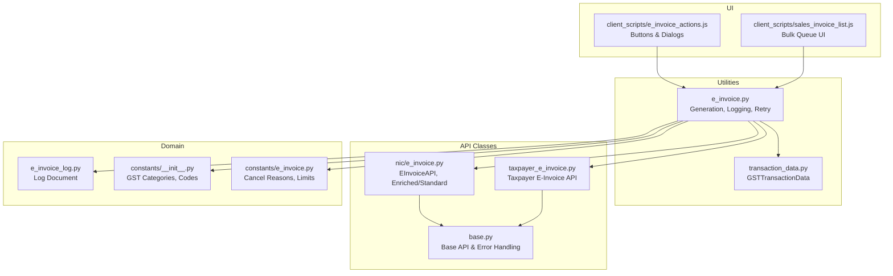
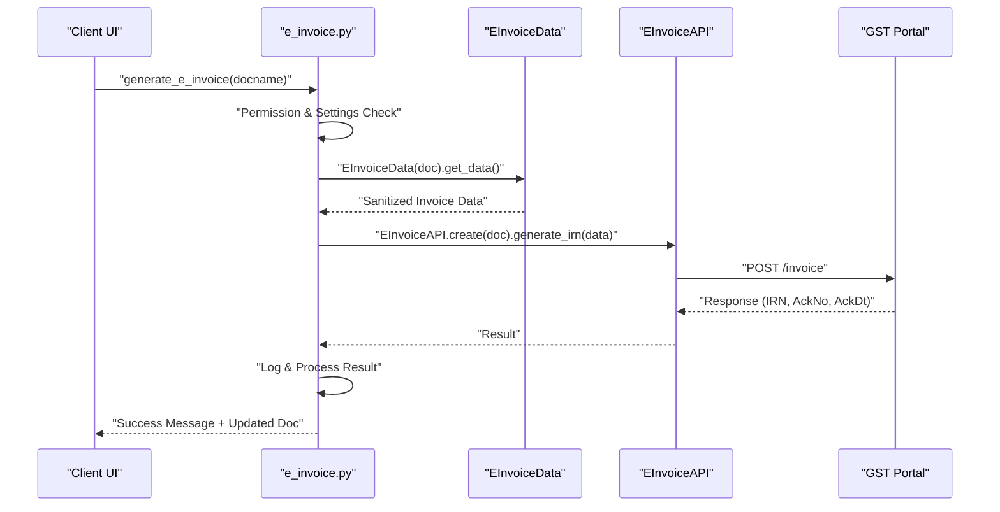
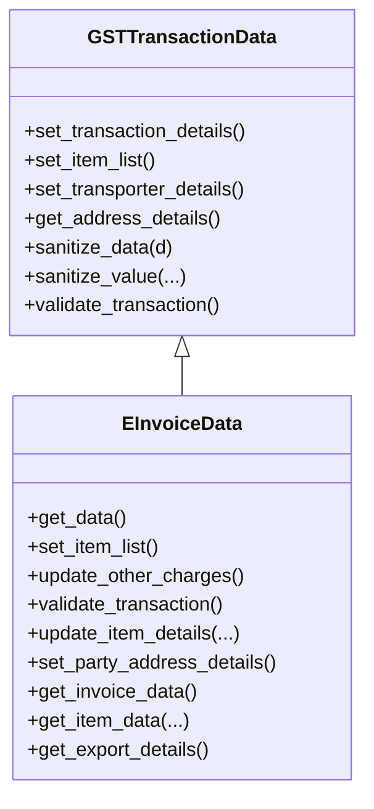
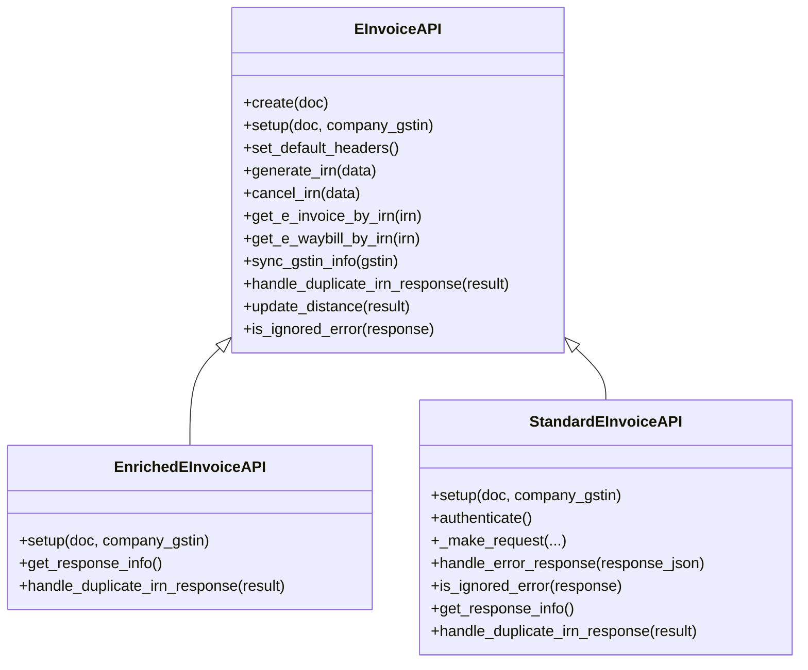
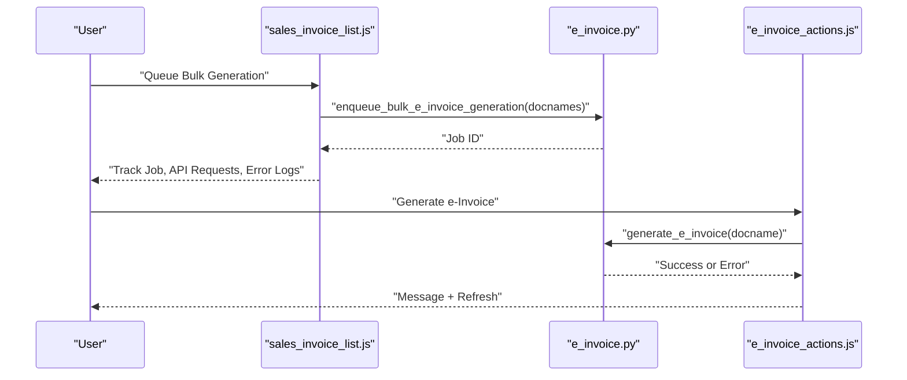
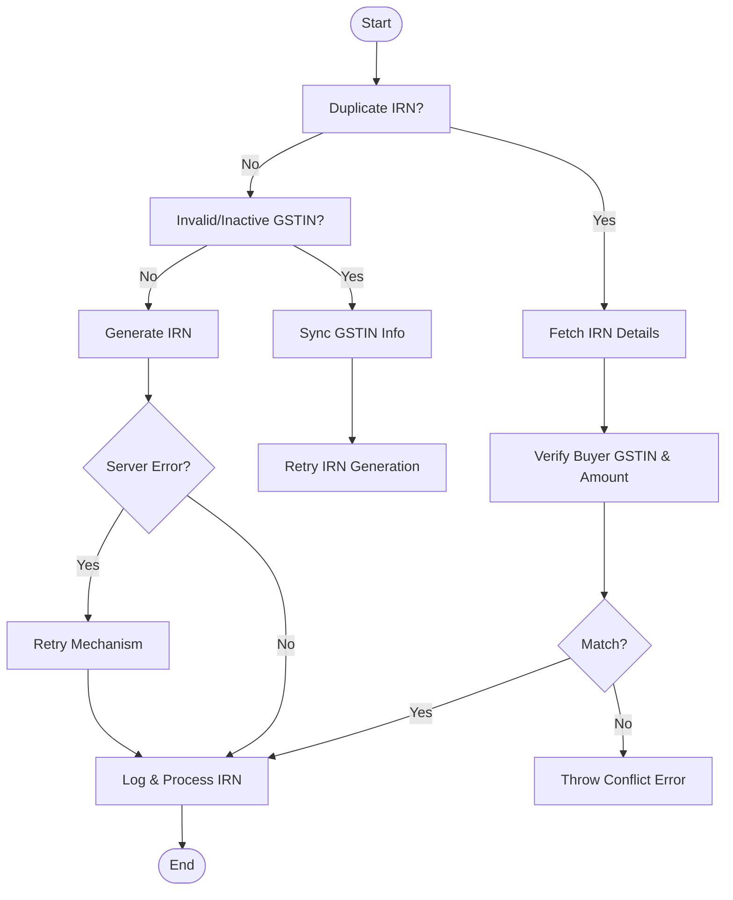
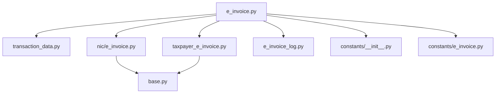

# E-Invoice Generation

<cite>
**Referenced Files in This Document**
- [e_invoice.py](file://india_compliance/gst_india/utils/e_invoice.py)
- [e_invoice.py](file://india_compliance/gst_india/api_classes/nic/e_invoice.py)
- [e_invoice.py](file://india_compliance/gst_india/api_classes/taxpayer_e_invoice.py)
- [transaction_data.py](file://india_compliance/gst_india/utils/transaction_data.py)
- [e_invoice_log.py](file://india_compliance/gst_india/doctype/e_invoice_log/e_invoice_log.py)
- [e_invoice_actions.js](file://india_compliance/gst_india/client_scripts/e_invoice_actions.js)
- [sales_invoice_list.js](file://india_compliance/gst_india/client_scripts/sales_invoice_list.js)
- [__init__.py](file://india_compliance/gst_india/constants/e_invoice.py)
- [__init__.py](file://india_compliance/gst_india/constants/__init__.py)
- [base.py](file://india_compliance/gst_india/api_classes/base.py)
- [exceptions.py](file://india_compliance/exceptions.py)
- [test_e_invoice.py](file://india_compliance/gst_india/utils/test_e_invoice.py)
</cite>

## Table of Contents
1. [Introduction](#introduction)
2. [Project Structure](#project-structure)
3. [Core Components](#core-components)
4. [Architecture Overview](#architecture-overview)
5. [Detailed Component Analysis](#detailed-component-analysis)
6. [Dependency Analysis](#dependency-analysis)
7. [Performance Considerations](#performance-considerations)
8. [Troubleshooting Guide](#troubleshooting-guide)
9. [Conclusion](#conclusion)
10. [Appendices](#appendices)

## Introduction
This document explains the E-Invoice Generation workflow for IRN (Invoice Reference Number) creation in the India Compliance module. It covers:
- The generate_e_invoice function, including permission handling, validation checks, and API integration with the GST portal.
- The EInvoiceData class for preparing transaction data, including item validation, transporter details, and party address processing.
- Bulk generation via enqueue_bulk_e_invoice_generation and generate_e_invoices.
- Error handling mechanisms for duplicate IRNs, invalid GSTIN formats, server errors, and retry logic.
- Practical examples of invoice validation, data sanitization, API authentication, and successful IRN generation with acknowledgment numbers and timestamps.

## Project Structure
The E-Invoice feature spans several modules:
- Utilities for E-Invoice generation and logging
- API classes for NIC and Taxpayer e-Invoice integrations
- Transaction data preparation utilities
- Client scripts for UI actions and applicability checks
- Constants and shared configurations
- Base API and exception handling

**Diagram sources**
- [e_invoice.py](file://india_compliance/gst_india/utils/e_invoice.py#L65-L268)
- [e_invoice.py](file://india_compliance/gst_india/api_classes/nic/e_invoice.py#L12-L271)
- [e_invoice.py](file://india_compliance/gst_india/api_classes/taxpayer_e_invoice.py#L7-L69)
- [transaction_data.py](file://india_compliance/gst_india/utils/transaction_data.py#L34-L704)
- [e_invoice_log.py](file://india_compliance/gst_india/doctype/e_invoice_log/e_invoice_log.py#L8-L9)
- [e_invoice_actions.js](file://india_compliance/gst_india/client_scripts/e_invoice_actions.js#L1-L422)
- [sales_invoice_list.js](file://india_compliance/gst_india/client_scripts/sales_invoice_list.js#L128-L169)
- [__init__.py](file://india_compliance/gst_india/constants/e_invoice.py#L1-L9)
- [__init__.py](file://india_compliance/gst_india/constants/__init__.py#L27-L63)
- [base.py](file://india_compliance/gst_india/api_classes/base.py#L227-L262)

**Section sources**
- [e_invoice.py](file://india_compliance/gst_india/utils/e_invoice.py#L65-L268)
- [e_invoice.py](file://india_compliance/gst_india/api_classes/nic/e_invoice.py#L12-L271)
- [e_invoice.py](file://india_compliance/gst_india/api_classes/taxpayer_e_invoice.py#L7-L69)
- [transaction_data.py](file://india_compliance/gst_india/utils/transaction_data.py#L34-L704)
- [e_invoice_log.py](file://india_compliance/gst_india/doctype/e_invoice_log/e_invoice_log.py#L8-L9)
- [e_invoice_actions.js](file://india_compliance/gst_india/client_scripts/e_invoice_actions.js#L1-L422)
- [sales_invoice_list.js](file://india_compliance/gst_india/client_scripts/sales_invoice_list.js#L128-L169)
- [__init__.py](file://india_compliance/gst_india/constants/e_invoice.py#L1-L9)
- [__init__.py](file://india_compliance/gst_india/constants/__init__.py#L27-L63)
- [base.py](file://india_compliance/gst_india/api_classes/base.py#L227-L262)

## Core Components
- EInvoiceData: Prepares and sanitizes transaction data for IRN generation, validates items and addresses, and constructs the invoice payload.
- EInvoiceAPI (NIC): Handles authentication, request/response processing, duplicate IRN handling, and GSTIN synchronization.
- Taxpayer E-Invoice API: Alternative API for retrieving IRN details and handling specific error codes.
- Utilities: generate_e_invoice, enqueue_bulk_e_invoice_generation, generate_e_invoices, retry logic, and logging.
- Client Scripts: UI actions for generating, marking, canceling, and bulk queuing e-Invoices.

**Section sources**
- [e_invoice.py](file://india_compliance/gst_india/utils/e_invoice.py#L69-L116)
- [e_invoice.py](file://india_compliance/gst_india/utils/e_invoice.py#L119-L268)
- [e_invoice.py](file://india_compliance/gst_india/api_classes/nic/e_invoice.py#L12-L271)
- [e_invoice.py](file://india_compliance/gst_india/api_classes/taxpayer_e_invoice.py#L7-L69)
- [transaction_data.py](file://india_compliance/gst_india/utils/transaction_data.py#L34-L704)
- [e_invoice_actions.js](file://india_compliance/gst_india/client_scripts/e_invoice_actions.js#L1-L422)

## Architecture Overview
The IRN generation pipeline integrates UI actions, validation, data preparation, API authentication, and logging.

**Diagram sources**
- [e_invoice.py](file://india_compliance/gst_india/utils/e_invoice.py#L119-L268)
- [e_invoice.py](file://india_compliance/gst_india/api_classes/nic/e_invoice.py#L102-L117)
- [transaction_data.py](file://india_compliance/gst_india/utils/transaction_data.py#L69-L110)

## Detailed Component Analysis

### EInvoiceData: Transaction Data Preparation
EInvoiceData extends GSTTransactionData to build the invoice payload for IRN generation. It:
- Validates transaction constraints (e.g., item count limit).
- Builds item list with sanitized details (HSN, UOM, tax rates).
- Updates other charges and total values.
- Sets transporter details and party/address details.
- Sanitizes and returns the final invoice data.

**Diagram sources**
- [transaction_data.py](file://india_compliance/gst_india/utils/transaction_data.py#L34-L704)
- [e_invoice.py](file://india_compliance/gst_india/utils/e_invoice.py#L689-L1116)

Key behaviors:
- Item validation and sanitization ensure compliance with GST masters and limits.
- Transporter details are populated based on mode of transport and vehicle details.
- Party and address processing handles foreign transactions and pincode/state adjustments.
- Export details are included for overseas supplies.

**Section sources**
- [e_invoice.py](file://india_compliance/gst_india/utils/e_invoice.py#L689-L1116)
- [transaction_data.py](file://india_compliance/gst_india/utils/transaction_data.py#L34-L704)
- [__init__.py](file://india_compliance/gst_india/constants/e_invoice.py#L8-L9)

### API Integration: EInvoiceAPI (NIC)
EInvoiceAPI encapsulates authentication and request/response handling:
- Factory method creates Enriched or Standard API depending on settings.
- Authentication strategies for Standard API refresh tokens and retries.
- Duplicate IRN handling and distance updates from alerts.
- GSTIN sync and validation for invalid/_inactive GSTIN errors.

**Diagram sources**
- [e_invoice.py](file://india_compliance/gst_india/api_classes/nic/e_invoice.py#L12-L271)

**Section sources**
- [e_invoice.py](file://india_compliance/gst_india/api_classes/nic/e_invoice.py#L12-L271)
- [base.py](file://india_compliance/gst_india/api_classes/base.py#L227-L262)

### Taxpayer E-Invoice API
Used to fetch IRN details when portal data is unavailable or for verification:
- Retrieves IRN list, IRN details, and downloadable files.
- Handles specific ignored error codes for queued/no-docs scenarios.

**Section sources**
- [e_invoice.py](file://india_compliance/gst_india/api_classes/taxpayer_e_invoice.py#L7-L69)

### UI Actions and Bulk Generation
- UI buttons trigger generation, cancellation, and manual updates.
- Bulk queue enqueues jobs and tracks progress via Integration Requests and Error Logs.
- Applies applicability rules and shows status messages.

**Diagram sources**
- [sales_invoice_list.js](file://india_compliance/gst_india/client_scripts/sales_invoice_list.js#L128-L169)
- [e_invoice.py](file://india_compliance/gst_india/utils/e_invoice.py#L65-L85)
- [e_invoice_actions.js](file://india_compliance/gst_india/client_scripts/e_invoice_actions.js#L1-L422)

**Section sources**
- [sales_invoice_list.js](file://india_compliance/gst_india/client_scripts/sales_invoice_list.js#L128-L169)
- [e_invoice_actions.js](file://india_compliance/gst_india/client_scripts/e_invoice_actions.js#L1-L422)
- [e_invoice.py](file://india_compliance/gst_india/utils/e_invoice.py#L65-L85)

### Error Handling and Retry Logic
- Duplicate IRN: Detected and handled by fetching IRN details and verifying buyer GSTIN and invoice amount.
- Invalid/Inactive GSTIN: Syncs GSTIN status and retries generation.
- Server errors: Captured and routed to retry mechanism based on settings.
- Validation failures: Rollback and status updates to “Failed”.
- UI shows actionable messages and allows manual updates.

**Diagram sources**
- [e_invoice.py](file://india_compliance/gst_india/utils/e_invoice.py#L154-L267)
- [e_invoice.py](file://india_compliance/gst_india/api_classes/nic/e_invoice.py#L102-L117)

**Section sources**
- [e_invoice.py](file://india_compliance/gst_india/utils/e_invoice.py#L154-L267)
- [e_invoice.py](file://india_compliance/gst_india/api_classes/nic/e_invoice.py#L102-L117)
- [exceptions.py](file://india_compliance/exceptions.py#L1-L25)

## Dependency Analysis
- EInvoiceData depends on GSTTransactionData for validation and sanitization.
- EInvoiceAPI depends on BaseAPI for error handling and authentication lifecycle.
- Utilities orchestrate API calls, logging, and UI integration.
- Constants define categories, limits, and master codes used during validation.

**Diagram sources**
- [e_invoice.py](file://india_compliance/gst_india/utils/e_invoice.py#L65-L268)
- [transaction_data.py](file://india_compliance/gst_india/utils/transaction_data.py#L34-L704)
- [e_invoice.py](file://india_compliance/gst_india/api_classes/nic/e_invoice.py#L12-L271)
- [e_invoice.py](file://india_compliance/gst_india/api_classes/taxpayer_e_invoice.py#L7-L69)
- [base.py](file://india_compliance/gst_india/api_classes/base.py#L227-L262)
- [e_invoice_log.py](file://india_compliance/gst_india/doctype/e_invoice_log/e_invoice_log.py#L8-L9)
- [__init__.py](file://india_compliance/gst_india/constants/__init__.py#L27-L63)
- [__init__.py](file://india_compliance/gst_india/constants/e_invoice.py#L1-L9)

**Section sources**
- [e_invoice.py](file://india_compliance/gst_india/utils/e_invoice.py#L65-L268)
- [transaction_data.py](file://india_compliance/gst_india/utils/transaction_data.py#L34-L704)
- [e_invoice.py](file://india_compliance/gst_india/api_classes/nic/e_invoice.py#L12-L271)
- [e_invoice.py](file://india_compliance/gst_india/api_classes/taxpayer_e_invoice.py#L7-L69)
- [base.py](file://india_compliance/gst_india/api_classes/base.py#L227-L262)
- [e_invoice_log.py](file://india_compliance/gst_india/doctype/e_invoice_log/e_invoice_log.py#L8-L9)
- [__init__.py](file://india_compliance/gst_india/constants/__init__.py#L27-L63)
- [__init__.py](file://india_compliance/gst_india/constants/e_invoice.py#L1-L9)

## Performance Considerations
- Bulk generation uses queues with timeouts proportional to the number of documents.
- Individual commits per invoice reduce contention and improve reliability.
- Distance updates and GSTIN sync minimize redundant API calls.
- UI actions throttle background job creation and provide tracking links.

[No sources needed since this section provides general guidance]

## Troubleshooting Guide
Common issues and resolutions:
- Duplicate IRN: Use handle_duplicate_irn_error to verify buyer GSTIN and invoice amount; resolve discrepancies before updating IRN.
- Invalid/Inactive GSTIN: Sync GSTIN status and retry; ensure GSTIN is valid and active.
- Server errors: Trigger retry mechanism; monitor scheduled jobs and logs.
- Validation failures: Fix missing mandatory fields (e.g., customer address), ensure item count under limit, and correct tax rates.
- Manual updates: Use UI dialogs to mark IRN as generated or canceled when portal data is unavailable.

**Section sources**
- [e_invoice.py](file://india_compliance/gst_india/utils/e_invoice.py#L154-L267)
- [e_invoice.py](file://india_compliance/gst_india/utils/e_invoice.py#L427-L527)
- [e_invoice_actions.js](file://india_compliance/gst_india/client_scripts/e_invoice_actions.js#L202-L323)
- [test_e_invoice.py](file://india_compliance/gst_india/utils/test_e_invoice.py#L192-L200)

## Conclusion
The E-Invoice Generation system provides a robust, validated pipeline for IRN creation, integrating UI actions, transaction data preparation, API authentication, and comprehensive error handling. It supports bulk generation, retry logic, and manual updates to ensure compliance and operational resilience.

[No sources needed since this section summarizes without analyzing specific files]

## Appendices

### Practical Examples Index
- Invoice validation and item sanitization: [EInvoiceData.get_data](file://india_compliance/gst_india/utils/e_invoice.py#L689-L720)
- Data sanitization and regex enforcement: [GSTTransactionData.sanitize_value](file://india_compliance/gst_india/utils/transaction_data.py#L574-L654)
- API authentication and token refresh: [StandardEInvoiceAPI.authenticate](file://india_compliance/gst_india/api_classes/nic/e_invoice.py#L205-L214)
- Successful IRN generation with acknowledgment: [log_and_process_e_invoice_generation](file://india_compliance/gst_india/utils/e_invoice.py#L377-L424)
- Bulk generation queue and tracking: [enqueue_bulk_e_invoice_generation](file://india_compliance/gst_india/utils/e_invoice.py#L65-L85), [sales_invoice_list.js](file://india_compliance/gst_india/client_scripts/sales_invoice_list.js#L128-L169)
- UI actions for generation and cancellation: [e_invoice_actions.js](file://india_compliance/gst_india/client_scripts/e_invoice_actions.js#L1-L422)

**Section sources**
- [e_invoice.py](file://india_compliance/gst_india/utils/e_invoice.py#L689-L720)
- [transaction_data.py](file://india_compliance/gst_india/utils/transaction_data.py#L574-L654)
- [e_invoice.py](file://india_compliance/gst_india/api_classes/nic/e_invoice.py#L205-L214)
- [e_invoice.py](file://india_compliance/gst_india/utils/e_invoice.py#L377-L424)
- [sales_invoice_list.js](file://india_compliance/gst_india/client_scripts/sales_invoice_list.js#L128-L169)
- [e_invoice_actions.js](file://india_compliance/gst_india/client_scripts/e_invoice_actions.js#L1-L422)