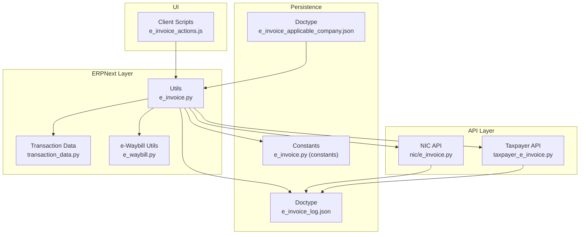
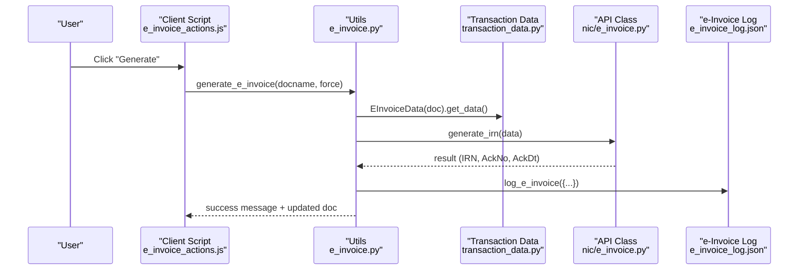
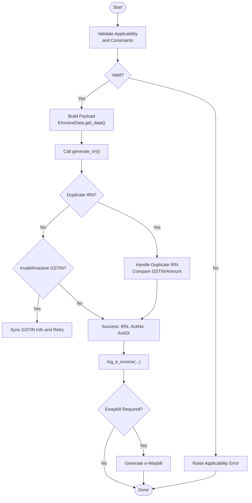
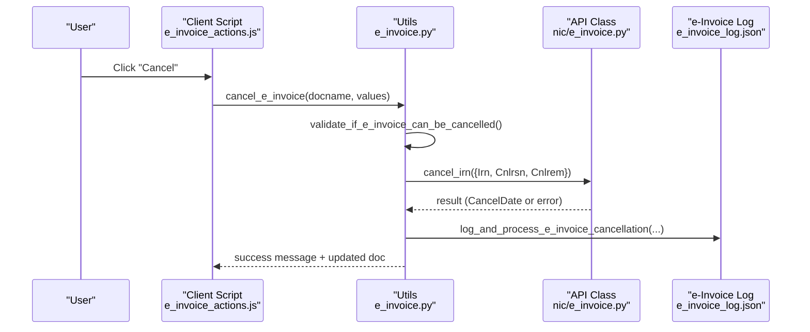
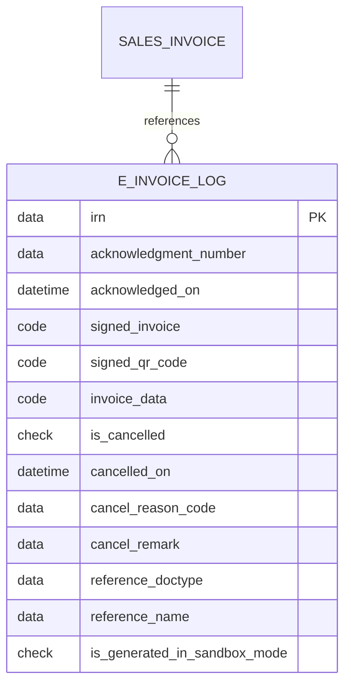
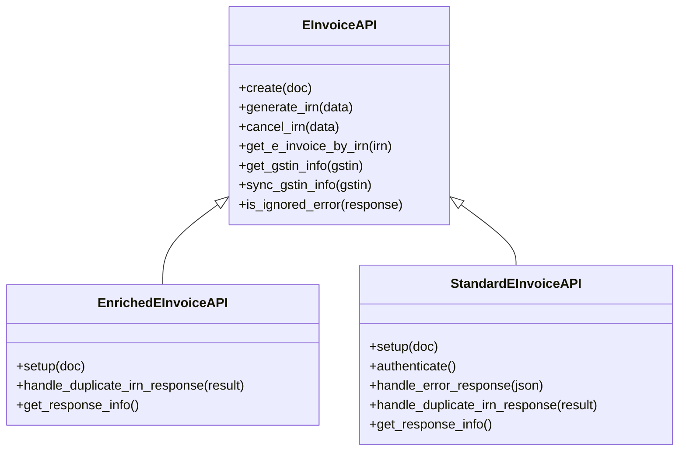
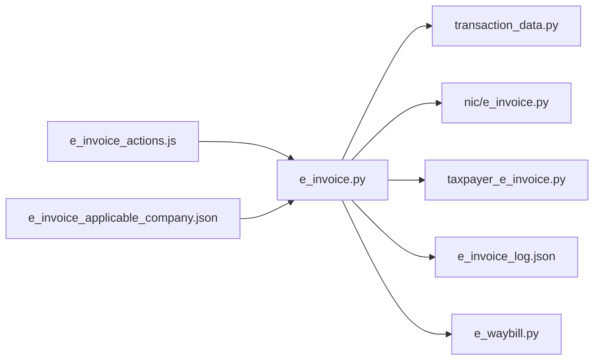

# E-Invoice Management

<cite>
**Referenced Files in This Document**
- [e_invoice.py](file://india_compliance/gst_india/utils/e_invoice.py)
- [nic/e_invoice.py](file://india_compliance/gst_india/api_classes/nic/e_invoice.py)
- [taxpayer_e_invoice.py](file://india_compliance/gst_india/api_classes/taxpayer_e_invoice.py)
- [e_invoice_log.py](file://india_compliance/gst_india/doctype/e_invoice_log/e_invoice_log.py)
- [e_invoice_log.json](file://india_compliance/gst_india/doctype/e_invoice_log/e_invoice_log.json)
- [e_invoice_applicable_company.py](file://india_compliance/gst_india/doctype/e_invoice_applicable_company/e_invoice_applicable_company.py)
- [e_invoice_applicable_company.json](file://india_compliance/gst_india/doctype/e_invoice_applicable_company/e_invoice_applicable_company.json)
- [e_invoice.py (constants)](file://india_compliance/gst_india/constants/e_invoice.py)
- [transaction_data.py](file://india_compliance/gst_india/utils/transaction_data.py)
- [e_waybill.py](file://india_compliance/gst_india/utils/e_waybill.py)
- [e_invoice_actions.js](file://india_compliance/gst_india/client_scripts/e_invoice_actions.js)
- [gst_settings.py](file://india_compliance/gst_india/doctype/gst_settings/gst_settings.py)
- [test_e_invoice.py](file://india_compliance/gst_india/utils/test_e_invoice.py)
- [test_e_invoice.json](file://india_compliance/gst_india/data/test_e_invoice.json)
</cite>

## Table of Contents
1. [Introduction](#introduction)
2. [Project Structure](#project-structure)
3. [Core Components](#core-components)
4. [Architecture Overview](#architecture-overview)
5. [Detailed Component Analysis](#detailed-component-analysis)
6. [Dependency Analysis](#dependency-analysis)
7. [Performance Considerations](#performance-considerations)
8. [Troubleshooting Guide](#troubleshooting-guide)
9. [Conclusion](#conclusion)
10. [Appendices](#appendices)

## Introduction
This document explains the E-Invoice Management system for generating, tracking, and managing Invoice Reference Numbers (IRN) in compliance with India’s e-invoice mandate. It covers:
- IRN generation workflows and validation
- Status tracking via e-Invoice Log
- API integration with the GST Network (NIC) and Taxpayer APIs
- Retry mechanisms for failed generations
- Compliance rules and applicability configuration
- Practical examples and error handling procedures

## Project Structure
The E-Invoice module is organized around:
- Utility functions for IRN generation, cancellation, logging, and retry
- API classes for NIC and Taxpayer e-invoice endpoints
- Doctypes for e-Invoice Log and Applicable Companies
- Constants for cancellation reasons and limits
- Client-side actions for UI-driven generation and cancellation
- Tests validating workflows and error handling

**Diagram sources**
- [e_invoice_actions.js](file://india_compliance/gst_india/client_scripts/e_invoice_actions.js#L1-L200)
- [e_invoice.py](file://india_compliance/gst_india/utils/e_invoice.py#L118-L267)
- [nic/e_invoice.py](file://india_compliance/gst_india/api_classes/nic/e_invoice.py#L12-L147)
- [taxpayer_e_invoice.py](file://india_compliance/gst_india/api_classes/taxpayer_e_invoice.py#L7-L69)
- [e_invoice_log.json](file://india_compliance/gst_india/doctype/e_invoice_log/e_invoice_log.json#L1-L176)
- [e_invoice_applicable_company.json](file://india_compliance/gst_india/doctype/e_invoice_applicable_company/e_invoice_applicable_company.json#L1-L43)
- [e_invoice.py (constants)](file://india_compliance/gst_india/constants/e_invoice.py#L1-L9)
- [transaction_data.py](file://india_compliance/gst_india/utils/transaction_data.py#L34-L146)
- [e_waybill.py](file://india_compliance/gst_india/utils/e_waybill.py#L154-L200)

**Section sources**
- [e_invoice.py](file://india_compliance/gst_india/utils/e_invoice.py#L118-L267)
- [nic/e_invoice.py](file://india_compliance/gst_india/api_classes/nic/e_invoice.py#L12-L147)
- [taxpayer_e_invoice.py](file://india_compliance/gst_india/api_classes/taxpayer_e_invoice.py#L7-L69)
- [e_invoice_log.json](file://india_compliance/gst_india/doctype/e_invoice_log/e_invoice_log.json#L1-L176)
- [e_invoice_applicable_company.json](file://india_compliance/gst_india/doctype/e_invoice_applicable_company/e_invoice_applicable_company.json#L1-L43)
- [e_invoice.py (constants)](file://india_compliance/gst_india/constants/e_invoice.py#L1-L9)
- [transaction_data.py](file://india_compliance/gst_india/utils/transaction_data.py#L34-L146)
- [e_waybill.py](file://india_compliance/gst_india/utils/e_waybill.py#L154-L200)

## Core Components
- E-Invoice Utilities
  - IRN generation, cancellation, and status updates
  - Validation of applicability and invoice constraints
  - Logging and retry mechanisms
- API Classes
  - NIC e-Invoice API (Enriched and Standard variants)
  - Taxpayer e-Invoice API
- Persistence
  - e-Invoice Log (IRN, acknowledgments, signed data, cancellation)
  - Applicable Companies configuration
- Client Actions
  - UI triggers for generation, cancellation, and manual marking
- Transaction Data
  - Structured data builder for e-invoice payloads

**Section sources**
- [e_invoice.py](file://india_compliance/gst_india/utils/e_invoice.py#L118-L267)
- [nic/e_invoice.py](file://india_compliance/gst_india/api_classes/nic/e_invoice.py#L12-L147)
- [taxpayer_e_invoice.py](file://india_compliance/gst_india/api_classes/taxpayer_e_invoice.py#L7-L69)
- [e_invoice_log.py](file://india_compliance/gst_india/doctype/e_invoice_log/e_invoice_log.py#L1-L10)
- [e_invoice_applicable_company.py](file://india_compliance/gst_india/doctype/e_invoice_applicable_company/e_invoice_applicable_company.py#L1-L10)
- [e_invoice_actions.js](file://india_compliance/gst_india/client_scripts/e_invoice_actions.js#L1-L200)
- [transaction_data.py](file://india_compliance/gst_india/utils/transaction_data.py#L34-L146)

## Architecture Overview
End-to-end IRN generation and cancellation flow:

**Diagram sources**
- [e_invoice_actions.js](file://india_compliance/gst_india/client_scripts/e_invoice_actions.js#L38-L78)
- [e_invoice.py](file://india_compliance/gst_india/utils/e_invoice.py#L118-L267)
- [transaction_data.py](file://india_compliance/gst_india/utils/transaction_data.py#L689-L720)
- [nic/e_invoice.py](file://india_compliance/gst_india/api_classes/nic/e_invoice.py#L102-L117)
- [e_invoice_log.json](file://india_compliance/gst_india/doctype/e_invoice_log/e_invoice_log.json#L1-L176)

## Detailed Component Analysis

### IRN Generation Workflow
- Validation
  - Checks for existing IRN, applicability date, company billing GSTIN equality, taxable items presence, B2B vs B2C rules, and API enablement.
- Payload Construction
  - Uses EInvoiceData to sanitize and build invoice payload with items, taxes, and transport details.
- API Call
  - NIC Enriched or Standard API depending on settings; handles duplicate IRN and invalid GSTIN scenarios.
- Logging and Post-processing
  - Logs IRN, ack number/date, signed invoice, QR code, and optionally triggers e-waybill generation.

**Diagram sources**
- [e_invoice.py](file://india_compliance/gst_india/utils/e_invoice.py#L118-L267)
- [e_invoice.py](file://india_compliance/gst_india/utils/e_invoice.py#L270-L337)
- [transaction_data.py](file://india_compliance/gst_india/utils/transaction_data.py#L689-L720)
- [nic/e_invoice.py](file://india_compliance/gst_india/api_classes/nic/e_invoice.py#L102-L117)

**Section sources**
- [e_invoice.py](file://india_compliance/gst_india/utils/e_invoice.py#L118-L267)
- [e_invoice.py](file://india_compliance/gst_india/utils/e_invoice.py#L270-L337)
- [transaction_data.py](file://india_compliance/gst_india/utils/transaction_data.py#L689-L720)
- [nic/e_invoice.py](file://india_compliance/gst_india/api_classes/nic/e_invoice.py#L102-L117)

### IRN Cancellation Workflow
- Pre-cancellation checks
  - Ensures IRN exists and cancellation window (< 24 hrs) is valid.
- Optional e-waybill cancellation
  - If present, cancels e-waybill first.
- API call to cancel IRN with reason code and remark.
- Logging and status updates.

**Diagram sources**
- [e_invoice_actions.js](file://india_compliance/gst_india/client_scripts/e_invoice_actions.js#L167-L200)
- [e_invoice.py](file://india_compliance/gst_india/utils/e_invoice.py#L427-L482)
- [nic/e_invoice.py](file://india_compliance/gst_india/api_classes/nic/e_invoice.py#L115-L117)
- [e_invoice_log.json](file://india_compliance/gst_india/doctype/e_invoice_log/e_invoice_log.json#L1-L176)

**Section sources**
- [e_invoice.py](file://india_compliance/gst_india/utils/e_invoice.py#L427-L482)
- [e_invoice_actions.js](file://india_compliance/gst_india/client_scripts/e_invoice_actions.js#L167-L200)

### e-Invoice Log Doctype
Purpose:
- Track IRN lifecycle: generation, acknowledgments, signed data, QR code, and cancellations.
- Link to Sales Invoice via dynamic link.

Fields:
- IRN, acknowledgment number/date, signed invoice/QR code, cancellation details, sandbox mode flag, and reference to original document.

**Diagram sources**
- [e_invoice_log.json](file://india_compliance/gst_india/doctype/e_invoice_log/e_invoice_log.json#L1-L176)

**Section sources**
- [e_invoice_log.py](file://india_compliance/gst_india/doctype/e_invoice_log/e_invoice_log.py#L1-L10)
- [e_invoice_log.json](file://india_compliance/gst_india/doctype/e_invoice_log/e_invoice_log.json#L1-L176)

### e-Invoice Applicable Company Configuration
Purpose:
- Define applicability date per company for e-invoice generation.

Fields:
- Company, Applicable From Date.

Behavior:
- Used by GST Settings to determine whether e-invoice is applicable for a given company and date.

**Section sources**
- [e_invoice_applicable_company.py](file://india_compliance/gst_india/doctype/e_invoice_applicable_company/e_invoice_applicable_company.py#L1-L10)
- [e_invoice_applicable_company.json](file://india_compliance/gst_india/doctype/e_invoice_applicable_company/e_invoice_applicable_company.json#L1-L43)
- [gst_settings.py](file://india_compliance/gst_india/doctype/gst_settings/gst_settings.py#L489-L504)

### API Integration and Retry Mechanisms
- API Selection
  - NIC Enriched vs Standard API based on sandbox/fallback settings.
- Error Handling
  - Duplicate IRN, invalid/inactive GSTIN, server errors, ignored error codes mapped to user-friendly messages.
- Retry
  - Scheduled retry for pending Auto-Retry invoices and e-waybills when enabled.

**Diagram sources**
- [nic/e_invoice.py](file://india_compliance/gst_india/api_classes/nic/e_invoice.py#L12-L271)

**Section sources**
- [nic/e_invoice.py](file://india_compliance/gst_india/api_classes/nic/e_invoice.py#L12-L147)
- [nic/e_invoice.py](file://india_compliance/gst_india/api_classes/nic/e_invoice.py#L149-L271)
- [e_invoice.py](file://india_compliance/gst_india/utils/e_invoice.py#L648-L678)

### Practical Examples

- Example: Invoice Validation
  - Applicability checks include company billing GSTIN equality, taxable items presence, B2B requirement, and applicability date.
  - See validation logic and tests for applicability scenarios.

- Example: IRN Generation Workflow
  - Build payload via EInvoiceData, call generate_irn, log results, and optionally generate e-waybill.

- Example: Status Monitoring
  - Use e-Invoice Log to track acknowledgments, signed data, and cancellations.

- Example: Error Handling Procedures
  - Duplicate IRN: Compare buyer GSTIN and invoice amount; if mismatch, block updating IRN.
  - Invalid/Inactive GSTIN: Sync GSTIN info and retry; otherwise, show validation error.
  - API timeouts and server errors: handled via retry mechanism and server error handler.

**Section sources**
- [e_invoice.py](file://india_compliance/gst_india/utils/e_invoice.py#L553-L604)
- [e_invoice.py](file://india_compliance/gst_india/utils/e_invoice.py#L118-L267)
- [e_invoice.py](file://india_compliance/gst_india/utils/e_invoice.py#L270-L337)
- [test_e_invoice.py](file://india_compliance/gst_india/utils/test_e_invoice.py#L30-L800)
- [test_e_invoice.json](file://india_compliance/gst_india/data/test_e_invoice.json#L1-L200)

## Dependency Analysis
- Utilities depend on:
  - Transaction data builder for payload construction
  - API classes for NIC/Taxpayer endpoints
  - e-Invoice Log for persistence
  - e-Waybill utilities for optional e-waybill generation
- Client scripts trigger utility functions and display applicability/cancellation dialogs.

**Diagram sources**
- [e_invoice_actions.js](file://india_compliance/gst_india/client_scripts/e_invoice_actions.js#L1-L200)
- [e_invoice.py](file://india_compliance/gst_india/utils/e_invoice.py#L118-L267)
- [transaction_data.py](file://india_compliance/gst_india/utils/transaction_data.py#L34-L146)
- [nic/e_invoice.py](file://india_compliance/gst_india/api_classes/nic/e_invoice.py#L12-L147)
- [taxpayer_e_invoice.py](file://india_compliance/gst_india/api_classes/taxpayer_e_invoice.py#L7-L69)
- [e_invoice_log.json](file://india_compliance/gst_india/doctype/e_invoice_log/e_invoice_log.json#L1-L176)
- [e_invoice_applicable_company.json](file://india_compliance/gst_india/doctype/e_invoice_applicable_company/e_invoice_applicable_company.json#L1-L43)

**Section sources**
- [e_invoice.py](file://india_compliance/gst_india/utils/e_invoice.py#L118-L267)
- [e_invoice_actions.js](file://india_compliance/gst_india/client_scripts/e_invoice_actions.js#L1-L200)

## Performance Considerations
- Bulk generation enqueues jobs with per-item timeouts to prevent worker overload.
- Individual commits per invoice/log entry to reduce contention.
- Retry mechanism avoids repeated failures by queuing pending Auto-Retry invoices and e-waybills.

[No sources needed since this section provides general guidance]

## Troubleshooting Guide
Common issues and resolutions:
- Duplicate IRN
  - Compare buyer GSTIN and invoice amount; if mismatch, do not update IRN and guide corrective steps.
- Invalid/Inactive GSTIN
  - Sync GSTIN info; if inactive, show validation error.
- API Timeouts/Server Errors
  - Utilize retry mechanism and server error handler to recover or escalate.
- Item Limit Exceeded
  - Enforced at 1000 items; split invoices accordingly.
- Cancellation Window Passed
  - Allow cancellation only within 24 hours of generation; otherwise, advise manual exclusion in GSTR-1.

**Section sources**
- [e_invoice.py](file://india_compliance/gst_india/utils/e_invoice.py#L154-L191)
- [e_invoice.py](file://india_compliance/gst_india/utils/e_invoice.py#L270-L337)
- [e_invoice.py](file://india_compliance/gst_india/utils/e_invoice.py#L648-L678)
- [e_invoice.py (constants)](file://india_compliance/gst_india/constants/e_invoice.py#L8-L9)
- [e_invoice.py](file://india_compliance/gst_india/utils/e_invoice.py#L628-L646)

## Conclusion
The E-Invoice Management system provides a robust, compliant, and automated pathway for IRN generation, validation, logging, and cancellation. It integrates seamlessly with ERPNext via client scripts and utilities, supports multiple API modes, and offers retry and error-handling mechanisms to ensure reliability under real-world conditions.

[No sources needed since this section summarizes without analyzing specific files]

## Appendices

### Compliance and Configuration References
- Cancellation reason codes and item limit constants
- Applicable companies configuration for e-invoice applicability dates
- UI applicability checks and manual marking options

**Section sources**
- [e_invoice.py (constants)](file://india_compliance/gst_india/constants/e_invoice.py#L1-L9)
- [e_invoice_applicable_company.json](file://india_compliance/gst_india/doctype/e_invoice_applicable_company/e_invoice_applicable_company.json#L1-L43)
- [e_invoice_actions.js](file://india_compliance/gst_india/client_scripts/e_invoice_actions.js#L325-L363)
- [gst_settings.py](file://india_compliance/gst_india/doctype/gst_settings/gst_settings.py#L489-L504)