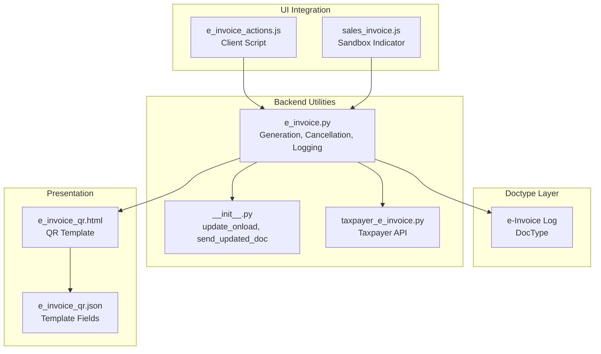
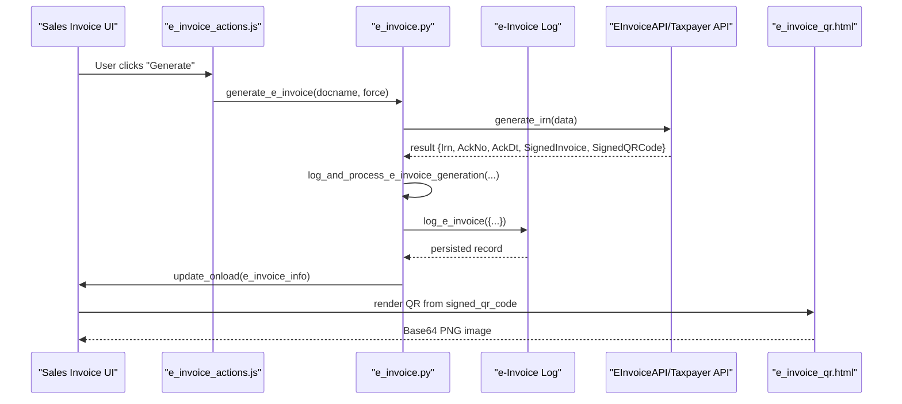
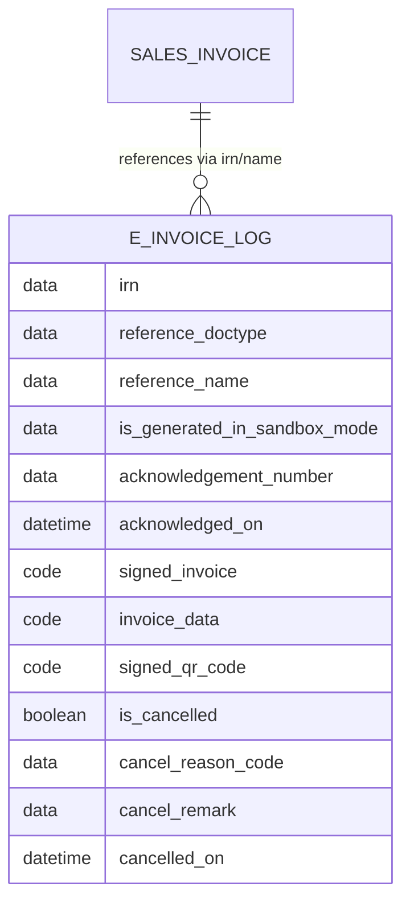
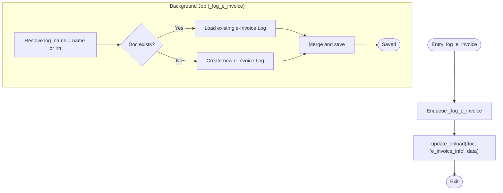
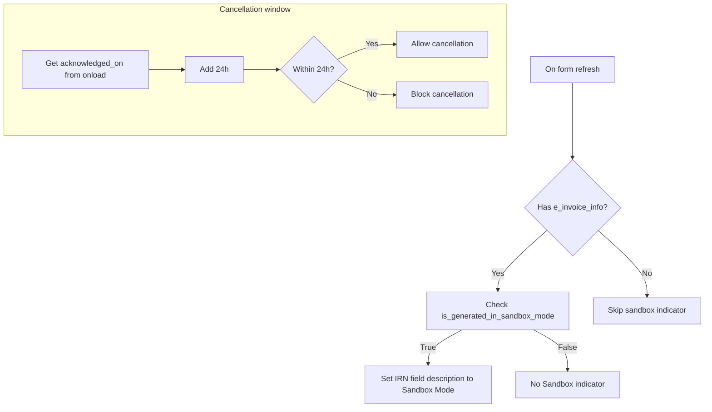
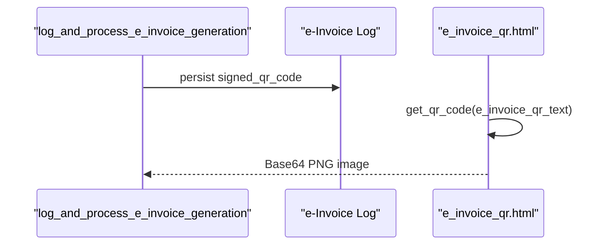
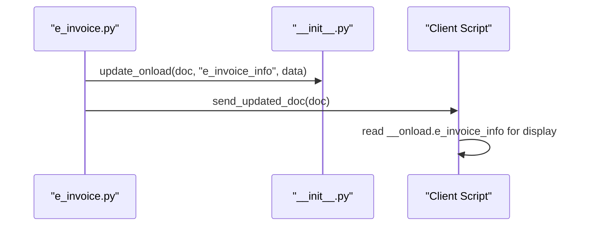
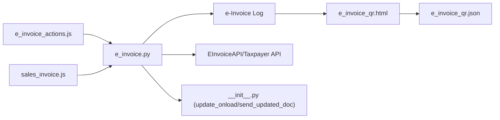

# E-Invoice Status Tracking

<cite>
**Referenced Files in This Document**
- [e_invoice_log.py](file://india_compliance/gst_india/doctype/e_invoice_log/e_invoice_log.py)
- [e_invoice_log.json](file://india_compliance/gst_india/doctype/e_invoice_log/e_invoice_log.json)
- [e_invoice.py](file://india_compliance/gst_india/utils/e_invoice.py)
- [e_invoice_actions.js](file://india_compliance/gst_india/client_scripts/e_invoice_actions.js)
- [sales_invoice.js](file://india_compliance/gst_india/client_scripts/sales_invoice.js)
- [__init__.py](file://india_compliance/gst_india/utils/__init__.py)
- [e_invoice_qr.html](file://india_compliance/gst_india/web_template/e_invoice_qr/e_invoice_qr.html)
- [e_invoice_qr.json](file://india_compliance/gst_india/web_template/e_invoice_qr/e_invoice_qr.json)
- [taxpayer_e_invoice.py](file://india_compliance/gst_india/api_classes/taxpayer_e_invoice.py)
- [test_e_invoice_log.py](file://india_compliance/gst_india/doctype/e_invoice_log/test_e_invoice_log.py)
</cite>

## Table of Contents
1. [Introduction](#introduction)
2. [Project Structure](#project-structure)
3. [Core Components](#core-components)
4. [Architecture Overview](#architecture-overview)
5. [Detailed Component Analysis](#detailed-component-analysis)
6. [Dependency Analysis](#dependency-analysis)
7. [Performance Considerations](#performance-considerations)
8. [Troubleshooting Guide](#troubleshooting-guide)
9. [Conclusion](#conclusion)
10. [Appendices](#appendices)

## Introduction
This document explains the E-Invoice Status Tracking system implemented in the India Compliance app. It focuses on the e-invoice log mechanism that captures IRN generation and cancellation events, tracks sandbox mode, acknowledges timestamps, stores signed invoice data, and exposes QR code generation. It also covers UI integration via onload data, query patterns for logs, failure tracking, retry monitoring, and compliance access to stored signed invoice data.

## Project Structure
The E-Invoice Status Tracking spans a DocType for persistence, backend utilities for generation/cancellation, client scripts for UI integration, and web templates for QR rendering.

**Diagram sources**
- [e_invoice_log.py](file://india_compliance/gst_india/doctype/e_invoice_log/e_invoice_log.py#L8-L9)
- [e_invoice_log.json](file://india_compliance/gst_india/doctype/e_invoice_log/e_invoice_log.json#L1-L176)
- [e_invoice.py](file://india_compliance/gst_india/utils/e_invoice.py#L529-L551)
- [__init__.py](file://india_compliance/gst_india/utils/__init__.py#L69-L80)
- [taxpayer_e_invoice.py](file://india_compliance/gst_india/api_classes/taxpayer_e_invoice.py#L1-L53)
- [e_invoice_actions.js](file://india_compliance/gst_india/client_scripts/e_invoice_actions.js#L1-L154)
- [sales_invoice.js](file://india_compliance/gst_india/client_scripts/sales_invoice.js#L31-L37)
- [e_invoice_qr.html](file://india_compliance/gst_india/web_template/e_invoice_qr/e_invoice_qr.html#L1-L1)
- [e_invoice_qr.json](file://india_compliance/gst_india/web_template/e_invoice_qr/e_invoice_qr.json#L1-L22)

**Section sources**
- [e_invoice_log.py](file://india_compliance/gst_india/doctype/e_invoice_log/e_invoice_log.py#L8-L9)
- [e_invoice_log.json](file://india_compliance/gst_india/doctype/e_invoice_log/e_invoice_log.json#L1-L176)
- [e_invoice.py](file://india_compliance/gst_india/utils/e_invoice.py#L529-L551)
- [e_invoice_actions.js](file://india_compliance/gst_india/client_scripts/e_invoice_actions.js#L1-L154)
- [sales_invoice.js](file://india_compliance/gst_india/client_scripts/sales_invoice.js#L31-L37)
- [e_invoice_qr.html](file://india_compliance/gst_india/web_template/e_invoice_qr/e_invoice_qr.html#L1-L1)
- [e_invoice_qr.json](file://india_compliance/gst_india/web_template/e_invoice_qr/e_invoice_qr.json#L1-L22)

## Core Components
- e-Invoice Log DocType: Stores IRN, acknowledgment metadata, signed invoice payload, QR code, sandbox mode flag, and cancellation details.
- Backend Utilities: Generation and cancellation orchestration, logging, sandbox detection, QR generation, and status updates.
- Client Scripts: UI triggers for generation/cancellation, applicability checks, sandbox mode indicator, and onload-driven UI hints.
- Web Templates: QR rendering for e-invoice data.

Key responsibilities:
- Persist IRN and related metadata upon successful generation.
- Record cancellation events with reason code, remark, and timestamp.
- Track sandbox mode to inform UI and compliance workflows.
- Store signed invoice data for audit/compliance retrieval.
- Provide QR code for printed/electronic display.

**Section sources**
- [e_invoice_log.json](file://india_compliance/gst_india/doctype/e_invoice_log/e_invoice_log.json#L27-L135)
- [e_invoice.py](file://india_compliance/gst_india/utils/e_invoice.py#L377-L424)
- [e_invoice.py](file://india_compliance/gst_india/utils/e_invoice.py#L458-L482)
- [e_invoice_actions.js](file://india_compliance/gst_india/client_scripts/e_invoice_actions.js#L3-L4)
- [e_invoice_qr.html](file://india_compliance/gst_india/web_template/e_invoice_qr/e_invoice_qr.html#L1-L1)

## Architecture Overview
End-to-end flow from UI to persistence and QR rendering.

**Diagram sources**
- [e_invoice_actions.js](file://india_compliance/gst_india/client_scripts/e_invoice_actions.js#L42-L58)
- [e_invoice.py](file://india_compliance/gst_india/utils/e_invoice.py#L119-L267)
- [e_invoice.py](file://india_compliance/gst_india/utils/e_invoice.py#L377-L424)
- [e_invoice.py](file://india_compliance/gst_india/utils/e_invoice.py#L529-L551)
- [e_invoice_qr.html](file://india_compliance/gst_india/web_template/e_invoice_qr/e_invoice_qr.html#L1-L1)

## Detailed Component Analysis

### e-Invoice Log DocType
- Purpose: Centralized audit trail for IRN lifecycle events.
- Naming: Named by IRN to prevent duplicates.
- Key fields:
  - IRN tracking: irn
  - Acknowledgment: acknowledgement_number, acknowledged_on
  - Signed data: signed_invoice (JSON), invoice_data (decoded JSON), signed_qr_code (JSON)
  - Sandbox mode: is_generated_in_sandbox_mode
  - Cancellation: is_cancelled, cancel_reason_code, cancel_remark, cancelled_on
  - References: reference_doctype, reference_name (dynamic link to Sales Invoice)

**Diagram sources**
- [e_invoice_log.json](file://india_compliance/gst_india/doctype/e_invoice_log/e_invoice_log.json#L27-L135)
- [e_invoice_log.json](file://india_compliance/gst_india/doctype/e_invoice_log/e_invoice_log.json#L138-L143)

**Section sources**
- [e_invoice_log.json](file://india_compliance/gst_india/doctype/e_invoice_log/e_invoice_log.json#L1-L176)
- [e_invoice_log.py](file://india_compliance/gst_india/doctype/e_invoice_log/e_invoice_log.py#L8-L9)

### Generation and Cancellation Logging Functions
- log_e_invoice: Enqueues asynchronous logging and updates onload for UI.
- _log_e_invoice: Creates or loads log by IRN, merges data, and saves.
- log_and_process_e_invoice_generation: Updates Sales Invoice with IRN/status, decodes signed invoice, and logs event.
- log_and_process_e_invoice_cancellation: Logs cancellation with reason/remark/timestamp and clears IRN.

**Diagram sources**
- [e_invoice.py](file://india_compliance/gst_india/utils/e_invoice.py#L529-L551)
- [__init__.py](file://india_compliance/gst_india/utils/__init__.py#L69-L80)

**Section sources**
- [e_invoice.py](file://india_compliance/gst_india/utils/e_invoice.py#L529-L551)
- [__init__.py](file://india_compliance/gst_india/utils/__init__.py#L69-L80)

### Status Monitoring and Sandbox Mode Detection
- Sandbox mode detection: surfaced via is_generated_in_sandbox_mode and exposed in UI via onload.
- Acknowledgment timestamp tracking: acknowledged_on is recorded during generation.
- UI indicator: IRN field description updated when sandbox mode is detected.
- Validation: cancellation allowed only within 24 hours of acknowledgment.

**Diagram sources**
- [e_invoice_actions.js](file://india_compliance/gst_india/client_scripts/e_invoice_actions.js#L3-L4)
- [e_invoice_actions.js](file://india_compliance/gst_india/client_scripts/e_invoice_actions.js#L156-L165)
- [e_invoice.py](file://india_compliance/gst_india/utils/e_invoice.py#L628-L646)

**Section sources**
- [e_invoice_actions.js](file://india_compliance/gst_india/client_scripts/e_invoice_actions.js#L3-L4)
- [e_invoice_actions.js](file://india_compliance/gst_india/client_scripts/e_invoice_actions.js#L156-L165)
- [e_invoice.py](file://india_compliance/gst_india/utils/e_invoice.py#L628-L646)

### QR Code Generation
- Stored QR: signed_qr_code is persisted in the log.
- Rendering: e_invoice_qr.html renders a base64 PNG image from e_invoice_qr_text.
- Template fields: e_invoice_qr.json defines the QR text field.

**Diagram sources**
- [e_invoice.py](file://india_compliance/gst_india/utils/e_invoice.py#L398-L411)
- [e_invoice_qr.html](file://india_compliance/gst_india/web_template/e_invoice_qr/e_invoice_qr.html#L1-L1)
- [e_invoice_qr.json](file://india_compliance/gst_india/web_template/e_invoice_qr/e_invoice_qr.json#L5-L11)

**Section sources**
- [e_invoice.py](file://india_compliance/gst_india/utils/e_invoice.py#L398-L411)
- [e_invoice_qr.html](file://india_compliance/gst_india/web_template/e_invoice_qr/e_invoice_qr.html#L1-L1)
- [e_invoice_qr.json](file://india_compliance/gst_india/web_template/e_invoice_qr/e_invoice_qr.json#L1-L22)

### Onload Data Integration for UI
- update_onload: Adds e_invoice_info to __onload for immediate UI access.
- send_updated_doc: Ensures UI receives updated document state after generation/cancellation.

**Diagram sources**
- [e_invoice.py](file://india_compliance/gst_india/utils/e_invoice.py#L529-L537)
- [__init__.py](file://india_compliance/gst_india/utils/__init__.py#L69-L94)
- [e_invoice_actions.js](file://india_compliance/gst_india/client_scripts/e_invoice_actions.js#L3-L4)

**Section sources**
- [e_invoice.py](file://india_compliance/gst_india/utils/e_invoice.py#L529-L537)
- [__init__.py](file://india_compliance/gst_india/utils/__init__.py#L69-L94)
- [e_invoice_actions.js](file://india_compliance/gst_india/client_scripts/e_invoice_actions.js#L3-L4)

### Examples and Queries

- Query invoice logs by IRN:
  - Use the e-Invoice Log DocType with irn as the key.
  - Example path: [e_invoice_log.json](file://india_compliance/gst_india/doctype/e_invoice_log/e_invoice_log.json#L27-L34)

- Track generation failures:
  - Monitor einvoice_status transitions and logged errors during generation.
  - Example path: [e_invoice.py](file://india_compliance/gst_india/utils/e_invoice.py#L227-L265)

- Monitor retry mechanisms:
  - Pending Auto-Retry invoices are generated via scheduled job.
  - Example path: [e_invoice.py](file://india_compliance/gst_india/utils/e_invoice.py#L667-L677)

- Access stored signed invoice data for compliance:
  - Retrieve signed_invoice and invoice_data from e-Invoice Log.
  - Example path: [e_invoice_log.json](file://india_compliance/gst_india/doctype/e_invoice_log/e_invoice_log.json#L44-L55)

**Section sources**
- [e_invoice_log.json](file://india_compliance/gst_india/doctype/e_invoice_log/e_invoice_log.json#L27-L55)
- [e_invoice.py](file://india_compliance/gst_india/utils/e_invoice.py#L227-L265)
- [e_invoice.py](file://india_compliance/gst_india/utils/e_invoice.py#L667-L677)

## Dependency Analysis
- e_invoice.py depends on:
  - EInvoiceAPI/TaxpayerEInvoiceAPI for IRN generation/cancellation.
  - JWT decoding for signed invoice inspection.
  - GST Settings for sandbox mode and applicability rules.
- Client scripts depend on e_invoice.py for actions and rely on onload data.
- Web templates depend on persisted signed_qr_code.

**Diagram sources**
- [e_invoice_actions.js](file://india_compliance/gst_india/client_scripts/e_invoice_actions.js#L1-L154)
- [sales_invoice.js](file://india_compliance/gst_india/client_scripts/sales_invoice.js#L31-L37)
- [e_invoice.py](file://india_compliance/gst_india/utils/e_invoice.py#L529-L551)
- [__init__.py](file://india_compliance/gst_india/utils/__init__.py#L69-L94)
- [e_invoice_qr.html](file://india_compliance/gst_india/web_template/e_invoice_qr/e_invoice_qr.html#L1-L1)
- [e_invoice_qr.json](file://india_compliance/gst_india/web_template/e_invoice_qr/e_invoice_qr.json#L1-L22)

**Section sources**
- [e_invoice.py](file://india_compliance/gst_india/utils/e_invoice.py#L529-L551)
- [taxpayer_e_invoice.py](file://india_compliance/gst_india/api_classes/taxpayer_e_invoice.py#L1-L53)

## Performance Considerations
- Asynchronous logging: log_e_invoice enqueues _log_e_invoice to avoid blocking UI.
- Batch generation: enqueue_bulk_e_invoice_generation uses queues sized for throughput.
- Retry scheduling: Auto-Retry invoices are processed in dedicated jobs to reduce UI latency.

[No sources needed since this section provides general guidance]

## Troubleshooting Guide
- Duplicate IRN handling: If a duplicate IRN is encountered, the system attempts to synchronize GSTIN info and re-generate; otherwise, it surfaces a handled error.
  - Example path: [e_invoice.py](file://india_compliance/gst_india/utils/e_invoice.py#L154-L188)

- Generation failures: Validation and server errors set einvoice_status to Failed and optionally rollback DB state.
  - Example path: [e_invoice.py](file://india_compliance/gst_india/utils/e_invoice.py#L227-L265)

- Sandbox mode limitations: Taxpayer e-Invoice API does not support sandbox mode.
  - Example path: [taxpayer_e_invoice.py](file://india_compliance/gst_india/api_classes/taxpayer_e_invoice.py#L26-L28)

- Cancellation restrictions: IRN can only be cancelled within 24 hours of acknowledgment.
  - Example path: [e_invoice.py](file://india_compliance/gst_india/utils/e_invoice.py#L628-L646)

**Section sources**
- [e_invoice.py](file://india_compliance/gst_india/utils/e_invoice.py#L154-L188)
- [e_invoice.py](file://india_compliance/gst_india/utils/e_invoice.py#L227-L265)
- [taxpayer_e_invoice.py](file://india_compliance/gst_india/api_classes/taxpayer_e_invoice.py#L26-L28)
- [e_invoice.py](file://india_compliance/gst_india/utils/e_invoice.py#L628-L646)

## Conclusion
The E-Invoice Status Tracking system provides a robust, auditable trail of IRN lifecycle events with sandbox-aware generation, acknowledgment timestamps, signed invoice storage, and QR rendering. The UI integrates seamlessly via onload data and client scripts, enabling operators to monitor status, manage retries, and access compliance-grade artifacts.

[No sources needed since this section summarizes without analyzing specific files]

## Appendices

### Appendix A: Sandbox Mode Detection in UI
- The IRN field description is updated to indicate sandbox mode when applicable.
- Example path: [e_invoice_actions.js](file://india_compliance/gst_india/client_scripts/e_invoice_actions.js#L3-L4)

**Section sources**
- [e_invoice_actions.js](file://india_compliance/gst_india/client_scripts/e_invoice_actions.js#L3-L4)

### Appendix B: Test Coverage
- Basic test scaffold for e-Invoice Log exists.
- Example path: [test_e_invoice_log.py](file://india_compliance/gst_india/doctype/e_invoice_log/test_e_invoice_log.py#L8-L9)

**Section sources**
- [test_e_invoice_log.py](file://india_compliance/gst_india/doctype/e_invoice_log/test_e_invoice_log.py#L8-L9)