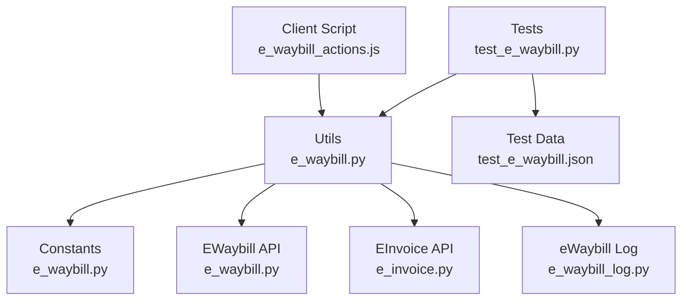
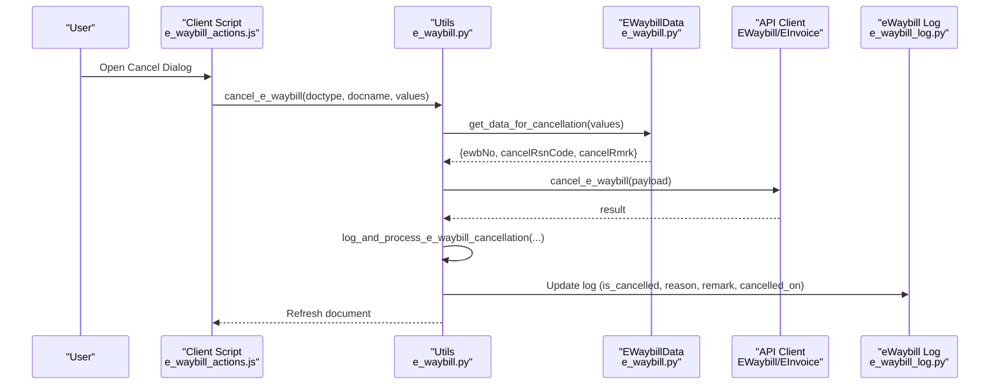
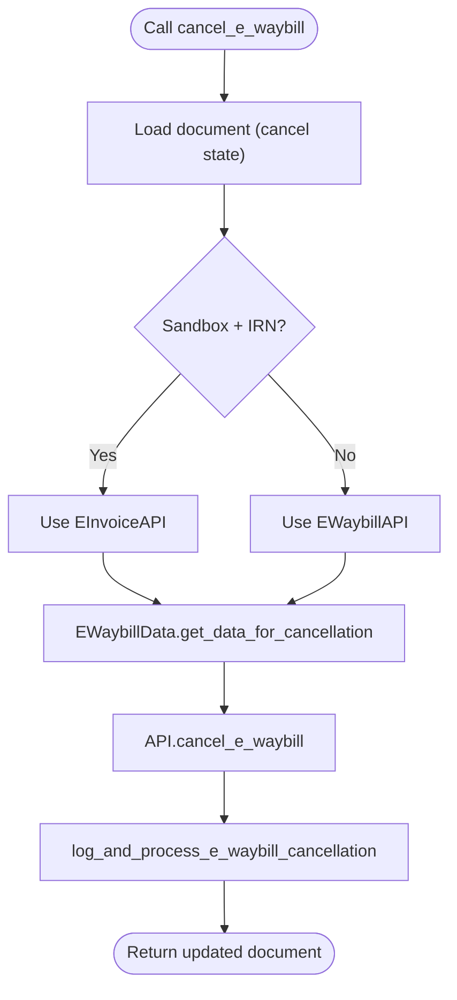
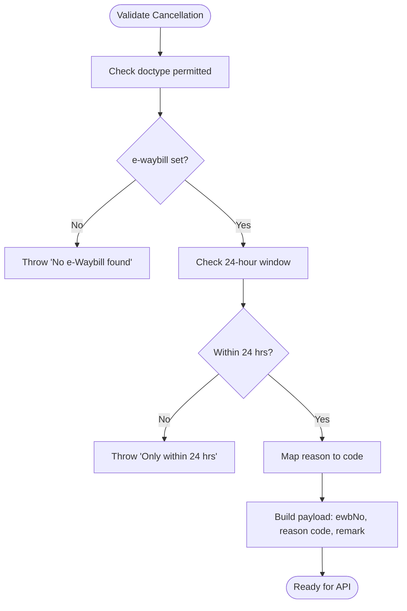
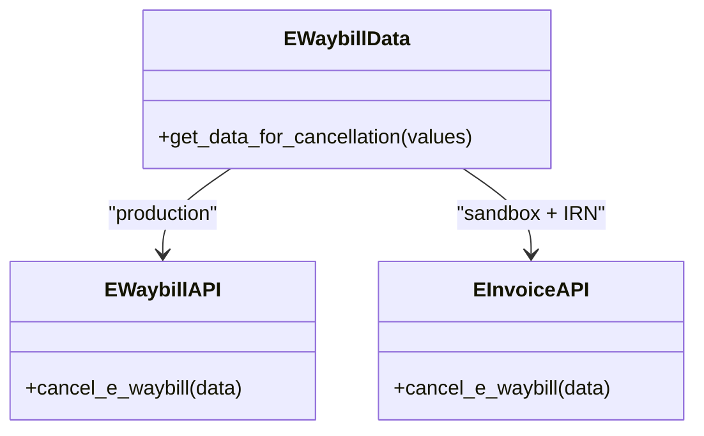
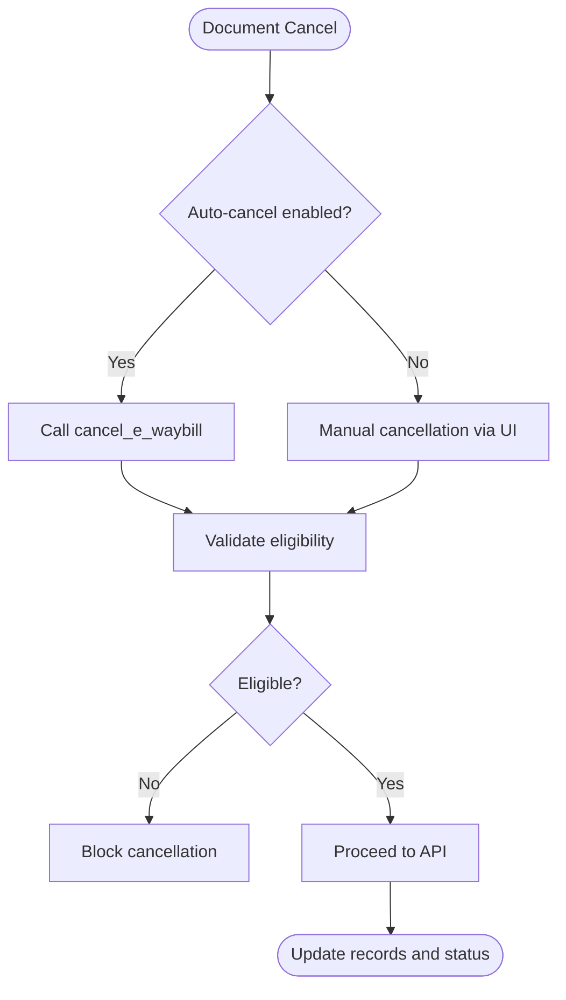
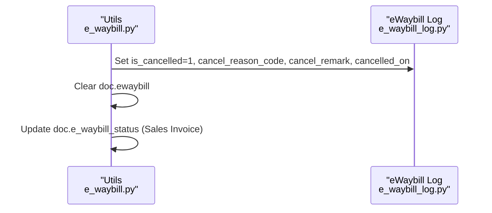
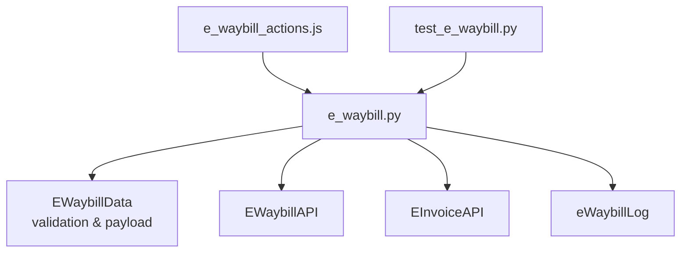

# E-Waybill Cancellation

<cite>
**Referenced Files in This Document**
- [e_waybill.py](file://india_compliance/gst_india/utils/e_waybill.py)
- [e_waybill.py](file://india_compliance/gst_india/api_classes/nic/e_waybill.py)
- [e_invoice.py](file://india_compliance/gst_india/api_classes/nic/e_invoice.py)
- [e_waybill.py](file://india_compliance/gst_india/constants/e_waybill.py)
- [e_waybill_log.py](file://india_compliance/gst_india/doctype/e_waybill_log/e_waybill_log.py)
- [e_waybill_actions.js](file://india_compliance/gst_india/client_scripts/e_waybill_actions.js)
- [test_e_waybill.py](file://india_compliance/gst_india/utils/test_e_waybill.py)
- [test_e_waybill.json](file://india_compliance/gst_india/data/test_e_waybill.json)
</cite>

## Table of Contents
1. [Introduction](#introduction)
2. [Project Structure](#project-structure)
3. [Core Components](#core-components)
4. [Architecture Overview](#architecture-overview)
5. [Detailed Component Analysis](#detailed-component-analysis)
6. [Dependency Analysis](#dependency-analysis)
7. [Performance Considerations](#performance-considerations)
8. [Troubleshooting Guide](#troubleshooting-guide)
9. [Conclusion](#conclusion)

## Introduction
This document explains the e-waybill cancellation functionality in the India Compliance module. It covers the cancel_e_waybill method, validation requirements, reason code selection, cancellation data preparation, the dual API approach (direct e-waybill API vs e-Invoice API in sandbox mode), cancellation workflows for pre-shipment and post-shipment scenarios, system-generated cancellations, and the log_and_process_e_waybill_cancellation function for updating records and status. Practical examples, error handling, and integration with document reversal workflows are included, along with common issues such as invalid reason codes and timing constraints.

## Project Structure
The cancellation feature spans several modules:
- Utilities for e-waybill operations and validation
- API clients for NIC e-waybill and e-invoice
- Constants defining reason codes and supported doctypes
- Frontend dialog for initiating cancellations
- Tests validating cancellation behavior across document types

**Diagram sources**
- [e_waybill_actions.js](file://india_compliance/gst_india/client_scripts/e_waybill_actions.js#L714-L798)
- [e_waybill.py](file://india_compliance/gst_india/utils/e_waybill.py#L375-L411)
- [e_waybill.py](file://india_compliance/gst_india/constants/e_waybill.py#L35-L40)
- [e_waybill.py](file://india_compliance/gst_india/api_classes/nic/e_waybill.py#L109-L110)
- [e_invoice.py](file://india_compliance/gst_india/api_classes/nic/e_invoice.py#L123-L124)
- [e_waybill_log.py](file://india_compliance/gst_india/doctype/e_waybill_log/e_waybill_log.py#L12-L23)
- [test_e_waybill.py](file://india_compliance/gst_india/utils/test_e_waybill.py#L256-L286)
- [test_e_waybill.json](file://india_compliance/gst_india/data/test_e_waybill.json#L1-L200)

**Section sources**
- [e_waybill_actions.js](file://india_compliance/gst_india/client_scripts/e_waybill_actions.js#L714-L798)
- [e_waybill.py](file://india_compliance/gst_india/utils/e_waybill.py#L375-L411)
- [e_waybill.py](file://india_compliance/gst_india/constants/e_waybill.py#L35-L40)
- [e_waybill.py](file://india_compliance/gst_india/api_classes/nic/e_waybill.py#L109-L110)
- [e_invoice.py](file://india_compliance/gst_india/api_classes/nic/e_invoice.py#L123-L124)
- [e_waybill_log.py](file://india_compliance/gst_india/doctype/e_waybill_log/e_waybill_log.py#L12-L23)
- [test_e_waybill.py](file://india_compliance/gst_india/utils/test_e_waybill.py#L256-L286)
- [test_e_waybill.json](file://india_compliance/gst_india/data/test_e_waybill.json#L1-L200)

## Core Components
- cancel_e_waybill: Public whitelisted method to cancel an e-waybill. It loads the document, prepares cancellation data via EWaybillData, selects the appropriate API (EWaybillAPI or EInvoiceAPI in sandbox mode), calls the API, and logs the cancellation.
- EWaybillData.get_data_for_cancellation: Validates that an e-waybill exists and is eligible for cancellation, then constructs the payload with reason code and remark.
- log_and_process_e_waybill_cancellation: Updates the e-waybill log record, sets cancellation metadata, clears the e-waybill number from the document, and updates status for Sales Invoice.
- Dual API approach: Uses EWaybillAPI for production and EInvoiceAPI for sandbox mode when applicable (e-waybill created via IRN).
- Validation requirements: Checks doctype support, presence of e-waybill, and 24-hour cancellation window.
- Reason codes: Defined centrally and mapped to numeric codes for the API.

**Section sources**
- [e_waybill.py](file://india_compliance/gst_india/utils/e_waybill.py#L375-L411)
- [e_waybill.py](file://india_compliance/gst_india/utils/e_waybill.py#L1310-L1318)
- [e_waybill.py](file://india_compliance/gst_india/utils/e_waybill.py#L413-L435)
- [e_waybill.py](file://india_compliance/gst_india/constants/e_waybill.py#L35-L40)
- [e_waybill.py](file://india_compliance/gst_india/api_classes/nic/e_waybill.py#L109-L110)
- [e_invoice.py](file://india_compliance/gst_india/api_classes/nic/e_invoice.py#L123-L124)

## Architecture Overview
The cancellation flow integrates frontend UI, backend utilities, validation, API clients, and logging.

**Diagram sources**
- [e_waybill_actions.js](file://india_compliance/gst_india/client_scripts/e_waybill_actions.js#L714-L738)
- [e_waybill.py](file://india_compliance/gst_india/utils/e_waybill.py#L375-L411)
- [e_waybill.py](file://india_compliance/gst_india/utils/e_waybill.py#L1310-L1318)
- [e_waybill.py](file://india_compliance/gst_india/api_classes/nic/e_waybill.py#L109-L110)
- [e_waybill_log.py](file://india_compliance/gst_india/doctype/e_waybill_log/e_waybill_log.py#L12-L23)

## Detailed Component Analysis

### cancel_e_waybill Method
- Loads the document in cancel state.
- Determines API: EInvoiceAPI in sandbox mode when e-waybill was created via IRN; otherwise EWaybillAPI.
- Prepares cancellation payload via EWaybillData.get_data_for_cancellation.
- Calls API and logs the result.

**Diagram sources**
- [e_waybill.py](file://india_compliance/gst_india/utils/e_waybill.py#L375-L411)
- [e_waybill.py](file://india_compliance/gst_india/utils/e_waybill.py#L1310-L1318)
- [e_waybill.py](file://india_compliance/gst_india/api_classes/nic/e_waybill.py#L109-L110)
- [e_invoice.py](file://india_compliance/gst_india/api_classes/nic/e_invoice.py#L123-L124)

**Section sources**
- [e_waybill.py](file://india_compliance/gst_india/utils/e_waybill.py#L375-L411)

### Validation Requirements and Reason Codes
- Supported doctypes: Sales Invoice, Purchase Invoice, Delivery Note, Purchase Receipt, Stock Entry, Subcontracting Receipt.
- Validation ensures:
  - e-waybill exists on the document.
  - Cancellation window: within 24 hours of generation.
- Reason codes:
  - Duplicate, Order Cancelled, Data Entry Mistake, Others.
  - Mapped to numeric codes for the API.

**Diagram sources**
- [e_waybill.py](file://india_compliance/gst_india/utils/e_waybill.py#L1485-L1493)
- [e_waybill.py](file://india_compliance/gst_india/utils/e_waybill.py#L1495-L1497)
- [e_waybill.py](file://india_compliance/gst_india/utils/e_waybill.py#L1557-L1570)
- [e_waybill.py](file://india_compliance/gst_india/constants/e_waybill.py#L35-L40)
- [e_waybill.py](file://india_compliance/gst_india/utils/e_waybill.py#L1310-L1318)

**Section sources**
- [e_waybill.py](file://india_compliance/gst_india/utils/e_waybill.py#L1485-L1570)
- [e_waybill.py](file://india_compliance/gst_india/constants/e_waybill.py#L35-L40)

### Dual API Approach: Direct vs e-Invoice in Sandbox
- Production: EWaybillAPI is used for cancellation.
- Sandbox: If the e-waybill was created using IRN, EInvoiceAPI is used for cancellation.
- This ensures compatibility with sandbox environments where IRN-driven e-waybills are handled via the e-invoice API.

**Diagram sources**
- [e_waybill.py](file://india_compliance/gst_india/api_classes/nic/e_waybill.py#L109-L110)
- [e_invoice.py](file://india_compliance/gst_india/api_classes/nic/e_invoice.py#L123-L124)
- [e_waybill.py](file://india_compliance/gst_india/utils/e_waybill.py#L389-L399)
- [e_waybill.py](file://india_compliance/gst_india/utils/e_waybill.py#L1310-L1318)

**Section sources**
- [e_waybill.py](file://india_compliance/gst_india/utils/e_waybill.py#L389-L399)
- [e_waybill.py](file://india_compliance/gst_india/api_classes/nic/e_waybill.py#L109-L110)
- [e_invoice.py](file://india_compliance/gst_india/api_classes/nic/e_invoice.py#L123-L124)

### Cancellation Workflows
- Pre-shipment cancellations: Allowed within 24 hours of generation; validated by EWaybillData.validate_if_ewaybill_can_be_cancelled.
- Post-shipment cancellations: Not permitted by policy; attempting to cancel outside the 24-hour window raises an error.
- System-generated cancellations: When auto-cancel is enabled in settings, cancelling the source document triggers cancellation via cancel_e_waybill.

**Diagram sources**
- [e_waybill.py](file://india_compliance/gst_india/utils/e_waybill.py#L375-L411)
- [e_waybill.py](file://india_compliance/gst_india/utils/e_waybill.py#L1557-L1570)
- [test_e_waybill.py](file://india_compliance/gst_india/utils/test_e_waybill.py#L331-L367)

**Section sources**
- [e_waybill.py](file://india_compliance/gst_india/utils/e_waybill.py#L1557-L1570)
- [test_e_waybill.py](file://india_compliance/gst_india/utils/test_e_waybill.py#L331-L367)

### log_and_process_e_waybill_cancellation Function
- Marks the e-waybill log as cancelled.
- Stores cancel reason code and remark.
- Sets cancelled_on timestamp (fallback for already-cancelled scenarios).
- Clears e-waybill number from the document.
- Updates status for Sales Invoice.

**Diagram sources**
- [e_waybill.py](file://india_compliance/gst_india/utils/e_waybill.py#L413-L435)
- [e_waybill_log.py](file://india_compliance/gst_india/doctype/e_waybill_log/e_waybill_log.py#L12-L23)

**Section sources**
- [e_waybill.py](file://india_compliance/gst_india/utils/e_waybill.py#L413-L435)
- [e_waybill_log.py](file://india_compliance/gst_india/doctype/e_waybill_log/e_waybill_log.py#L12-L23)

### Practical Examples
- Manual cancellation via UI dialog:
  - Opens a dialog with reason and remark fields.
  - Calls cancel_e_waybill with selected values.
- Automated cancellation on document cancel:
  - When auto-cancel is enabled, cancelling the document triggers cancel_e_waybill with configured reason.
- Cross-document type support:
  - Tests demonstrate cancellation for Sales Invoice, Delivery Note, Purchase Receipt, and Stock Entry.

**Section sources**
- [e_waybill_actions.js](file://india_compliance/gst_india/client_scripts/e_waybill_actions.js#L714-L798)
- [test_e_waybill.py](file://india_compliance/gst_india/utils/test_e_waybill.py#L256-L286)
- [test_e_waybill.py](file://india_compliance/gst_india/utils/test_e_waybill.py#L331-L367)
- [test_e_waybill.py](file://india_compliance/gst_india/utils/test_e_waybill.py#L446-L449)
- [test_e_waybill.py](file://india_compliance/gst_india/utils/test_e_waybill.py#L560-L566)

### Error Handling and Common Issues
- Already cancelled e-waybill:
  - API error code indicates the e-waybill is not generated by the user or is already cancelled; handled gracefully and surfaced to the user.
- Invalid reason codes:
  - Reason must be one of the predefined options; otherwise validation prevents submission.
- Timing constraints:
  - Cancellation allowed only within 24 hours of generation; attempting later raises an error.
- Sandbox-specific behavior:
  - When using sandbox mode with IRN-created e-waybills, EInvoiceAPI is used for cancellation.

**Section sources**
- [e_waybill.py](file://india_compliance/gst_india/api_classes/nic/e_waybill.py#L20-L28)
- [e_waybill.py](file://india_compliance/gst_india/utils/e_waybill.py#L1557-L1570)
- [e_waybill.py](file://india_compliance/gst_india/constants/e_waybill.py#L35-L40)

## Dependency Analysis
Cancellation depends on:
- EWaybillData for validation and payload construction
- API clients for actual cancellation
- e-waybill log for persistence and status updates
- Frontend dialog for user interaction

**Diagram sources**
- [e_waybill.py](file://india_compliance/gst_india/utils/e_waybill.py#L375-L411)
- [e_waybill.py](file://india_compliance/gst_india/api_classes/nic/e_waybill.py#L109-L110)
- [e_invoice.py](file://india_compliance/gst_india/api_classes/nic/e_invoice.py#L123-L124)
- [e_waybill_log.py](file://india_compliance/gst_india/doctype/e_waybill_log/e_waybill_log.py#L12-L23)
- [e_waybill_actions.js](file://india_compliance/gst_india/client_scripts/e_waybill_actions.js#L714-L738)
- [test_e_waybill.py](file://india_compliance/gst_india/utils/test_e_waybill.py#L256-L286)

**Section sources**
- [e_waybill.py](file://india_compliance/gst_india/utils/e_waybill.py#L375-L411)
- [e_waybill.py](file://india_compliance/gst_india/api_classes/nic/e_waybill.py#L109-L110)
- [e_invoice.py](file://india_compliance/gst_india/api_classes/nic/e_invoice.py#L123-L124)
- [e_waybill_log.py](file://india_compliance/gst_india/doctype/e_waybill_log/e_waybill_log.py#L12-L23)
- [e_waybill_actions.js](file://india_compliance/gst_india/client_scripts/e_waybill_actions.js#L714-L738)
- [test_e_waybill.py](file://india_compliance/gst_india/utils/test_e_waybill.py#L256-L286)

## Performance Considerations
- Cancellation is a single synchronous operation; enqueueing is not used.
- API calls are direct; ensure network reliability and handle retries at the API client level.
- Logging and PDF updates occur asynchronously via enqueue in other flows; cancellation focuses on immediate updates.

## Troubleshooting Guide
- “Only within 24 hrs” error:
  - Confirm the e-waybill creation timestamp and ensure cancellation occurs within the allowed window.
- “No e-Waybill found” error:
  - Verify the document has an e-waybill number set.
- “Already cancelled” error:
  - The e-waybill may have been cancelled externally; reconcile with the portal and update manually if needed.
- Invalid reason code:
  - Choose one of the supported reasons; “Others” requires a remark.
- Sandbox mode:
  - If using sandbox with IRN-created e-waybills, ensure the system routes cancellation through EInvoiceAPI.

**Section sources**
- [e_waybill.py](file://india_compliance/gst_india/utils/e_waybill.py#L1557-L1570)
- [e_waybill.py](file://india_compliance/gst_india/api_classes/nic/e_waybill.py#L20-L28)
- [e_waybill.py](file://india_compliance/gst_india/constants/e_waybill.py#L35-L40)

## Conclusion
The e-waybill cancellation feature provides robust validation, flexible API routing (including sandbox), and comprehensive logging. By enforcing strict timing constraints and reason code mapping, it ensures compliance with portal policies. The integration with document cancellation and frontend dialogs streamlines user workflows across multiple transaction types.