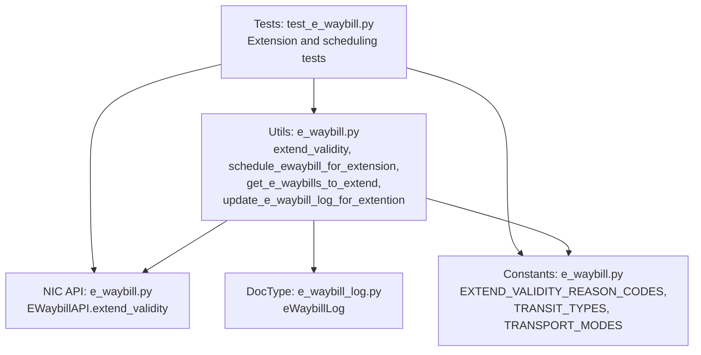
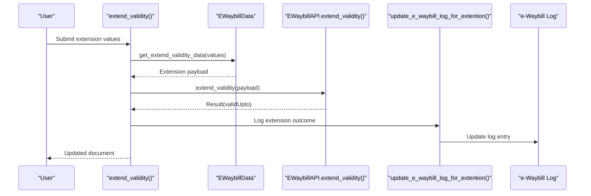
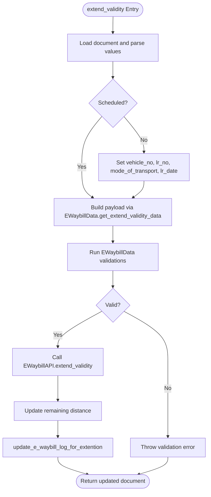
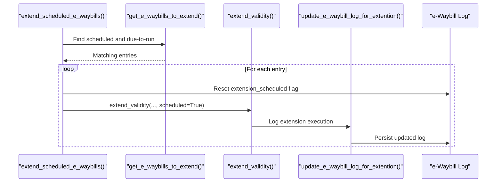
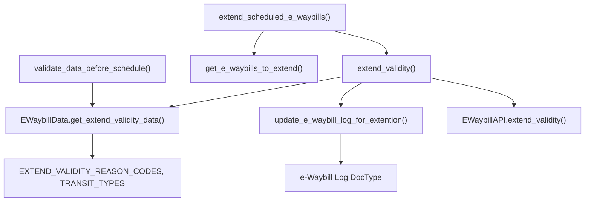

# E-Waybill Extension and Validity

<cite>
**Referenced Files in This Document**
- [e_waybill.py](file://india_compliance/gst_india/utils/e_waybill.py)
- [e_waybill.py](file://india_compliance/gst_india/api_classes/nic/e_waybill.py)
- [e_waybill.py](file://india_compliance/gst_india/constants/e_waybill.py)
- [e_waybill_log.py](file://india_compliance/gst_india/doctype/e_waybill_log/e_waybill_log.py)
- [test_e_waybill.py](file://india_compliance/gst_india/utils/test_e_waybill.py)
- [test_e_waybill.json](file://india_compliance/gst_india/data/test_e_waybill.json)
</cite>

## Table of Contents
1. [Introduction](#introduction)
2. [Project Structure](#project-structure)
3. [Core Components](#core-components)
4. [Architecture Overview](#architecture-overview)
5. [Detailed Component Analysis](#detailed-component-analysis)
6. [Dependency Analysis](#dependency-analysis)
7. [Performance Considerations](#performance-considerations)
8. [Troubleshooting Guide](#troubleshooting-guide)
9. [Conclusion](#conclusion)
10. [Appendices](#appendices)

## Introduction
This document explains the e-waybill extension and validity management capabilities in the India Compliance module. It focuses on:
- The extend_validity method and its validation rules
- Scheduled extension functionality for automatic validity extensions
- Validation helpers for scheduled extensions
- Eligible document identification via get_e_waybills_to_extend
- Logging of extension requests and updates via update_e_waybill_log_for_extention
- Practical workflows, common reasons for extensions, and integration with route planning systems
- Extension limits, validity period calculations, and compliance requirements

## Project Structure
The e-waybill extension logic spans several modules:
- Utilities for e-waybill operations and validations
- API client for NIC e-waybill endpoints
- Constants defining reason codes, transit types, and transport modes
- e-Waybill Log document for storing extension metadata and logs
- Tests validating extension behavior and scheduled extension workflows

**Diagram sources**
- [e_waybill.py](file://india_compliance/gst_india/utils/e_waybill.py#L630-L770)
- [e_waybill.py](file://india_compliance/gst_india/api_classes/nic/e_waybill.py#L118-L120)
- [e_waybill.py](file://india_compliance/gst_india/constants/e_waybill.py#L49-L96)
- [e_waybill_log.py](file://india_compliance/gst_india/doctype/e_waybill_log/e_waybill_log.py#L12-L23)
- [test_e_waybill.py](file://india_compliance/gst_india/utils/test_e_waybill.py#L864-L953)

**Section sources**
- [e_waybill.py](file://india_compliance/gst_india/utils/e_waybill.py#L630-L770)
- [e_waybill.py](file://india_compliance/gst_india/api_classes/nic/e_waybill.py#L118-L120)
- [e_waybill.py](file://india_compliance/gst_india/constants/e_waybill.py#L49-L96)
- [e_waybill_log.py](file://india_compliance/gst_india/doctype/e_waybill_log/e_waybill_log.py#L12-L23)
- [test_e_waybill.py](file://india_compliance/gst_india/utils/test_e_waybill.py#L864-L953)

## Core Components
- extend_validity: Manages manual extension requests, validates inputs, calls the API, and logs outcomes.
- schedule_ewaybill_for_extension: Schedules future extension requests and records them in e-waybill log.
- validate_data_before_schedule: Validates mode of transport, transit type, and remaining distance prior to scheduling.
- get_e_waybills_to_extend: Queries eligible documents whose scheduled extension time window has elapsed.
- extend_scheduled_e_waybills: Executes scheduled extensions by invoking extend_validity.
- update_e_waybill_log_for_extention: Logs extension requests (manual or scheduled) and updates e-waybill log entries.
- EWaybillData: Provides validation helpers and constructs extension payloads, including reason code mapping and transit type normalization.

Key validation rules enforced:
- Validity window: Extensions are allowed between 8 hours before expiry and 8 hours after expiry.
- Transporter assignment: If a transporter is assigned and differs from the company GSTIN, only the transporter can extend.
- Remaining distance: Must be provided and not exceed the original distance recorded at generation.
- Transit type: Must be provided when consignment status is “In Transit”; empty otherwise.

**Section sources**
- [e_waybill.py](file://india_compliance/gst_india/utils/e_waybill.py#L630-L770)
- [e_waybill.py](file://india_compliance/gst_india/utils/e_waybill.py#L1081-L1154)
- [e_waybill.py](file://india_compliance/gst_india/utils/e_waybill.py#L1351-L1391)
- [e_waybill.py](file://india_compliance/gst_india/utils/e_waybill.py#L1507-L1556)
- [e_waybill.py](file://india_compliance/gst_india/constants/e_waybill.py#L49-L96)

## Architecture Overview
The extension lifecycle integrates UI/API actions, validation, scheduled execution, and logging.

**Diagram sources**
- [e_waybill.py](file://india_compliance/gst_india/utils/e_waybill.py#L630-L664)
- [e_waybill.py](file://india_compliance/gst_india/utils/e_waybill.py#L1351-L1391)
- [e_waybill.py](file://india_compliance/gst_india/api_classes/nic/e_waybill.py#L118-L120)
- [e_waybill.py](file://india_compliance/gst_india/utils/e_waybill.py#L1081-L1154)

## Detailed Component Analysis

### extend_validity Method
Purpose:
- Validates extension eligibility and inputs
- Calls NIC API to extend validity
- Updates remaining distance and logs the event

Processing logic:
- Loads document and parses values
- Optionally updates vehicle/LR details if not scheduled
- Builds extension payload via EWaybillData.get_extend_validity_data
- Invokes API and persists new validity timestamp
- Updates remaining distance and logs extension

Validation performed:
- Validity window around expiry
- Transporter ownership constraints
- Mode of transport and transit type
- Remaining distance bounds

**Diagram sources**
- [e_waybill.py](file://india_compliance/gst_india/utils/e_waybill.py#L630-L664)
- [e_waybill.py](file://india_compliance/gst_india/utils/e_waybill.py#L1351-L1391)
- [e_waybill.py](file://india_compliance/gst_india/utils/e_waybill.py#L1507-L1556)

**Section sources**
- [e_waybill.py](file://india_compliance/gst_india/utils/e_waybill.py#L630-L664)
- [e_waybill.py](file://india_compliance/gst_india/utils/e_waybill.py#L1351-L1391)
- [e_waybill.py](file://india_compliance/gst_india/utils/e_waybill.py#L1507-L1556)

### Scheduled Extension Workflow
Purpose:
- Allow future extension requests to be scheduled and executed automatically

Key steps:
- schedule_ewaybill_for_extension: Validates inputs and writes scheduled extension data to e-waybill log
- get_e_waybills_to_extend: Identifies eligible documents whose scheduled time has arrived
- extend_scheduled_e_waybills: Iterates eligible entries, resets flags, and invokes extend_validity
- update_e_waybill_log_for_extention: Records scheduled vs executed extension events

**Diagram sources**
- [e_waybill.py](file://india_compliance/gst_india/utils/e_waybill.py#L691-L720)
- [e_waybill.py](file://india_compliance/gst_india/utils/e_waybill.py#L667-L688)
- [e_waybill.py](file://india_compliance/gst_india/utils/e_waybill.py#L731-L770)
- [e_waybill.py](file://india_compliance/gst_india/utils/e_waybill.py#L1081-L1154)

**Section sources**
- [e_waybill.py](file://india_compliance/gst_india/utils/e_waybill.py#L691-L720)
- [e_waybill.py](file://india_compliance/gst_india/utils/e_waybill.py#L667-L688)
- [e_waybill.py](file://india_compliance/gst_india/utils/e_waybill.py#L731-L770)
- [e_waybill.py](file://india_compliance/gst_india/utils/e_waybill.py#L1081-L1154)

### Validation Helpers for Scheduled Extensions
- validate_data_before_schedule: Runs pre-schedule validations for mode of transport, transit type, and remaining distance
- EWaybillData.validate_if_e_waybill_can_be_extend: Enforces 8-hour-before-to-8-hours-after validity window
- EWaybillData.validate_remaining_distance: Ensures remaining distance is present and within bounds
- EWaybillData.validate_transit_type: Requires transit type when consignment status is “In Transit”

These validations mirror runtime checks in extend_validity to prevent invalid schedules.

**Section sources**
- [e_waybill.py](file://india_compliance/gst_india/utils/e_waybill.py#L721-L728)
- [e_waybill.py](file://india_compliance/gst_india/utils/e_waybill.py#L1507-L1556)

### Eligible Documents Query
- get_e_waybills_to_extend: Filters e-waybill log entries where:
  - Not cancelled
  - Extension is scheduled
  - valid_upto falls within the last 24 hours (window for execution)

Returns reference details and stored extension data for batch processing.

**Section sources**
- [e_waybill.py](file://india_compliance/gst_india/utils/e_waybill.py#L667-L688)

### Logging Extension Requests and Updates
- update_e_waybill_log_for_extention: Creates or updates e-waybill log entries with:
  - Scheduled vs executed status
  - Extension payload (JSON) and reason code
  - Comments summarizing extension details
  - For executed extensions, updates valid_upto and marks log as not latest

**Section sources**
- [e_waybill.py](file://india_compliance/gst_india/utils/e_waybill.py#L1081-L1154)
- [e_waybill_log.py](file://india_compliance/gst_india/doctype/e_waybill_log/e_waybill_log.py#L12-L23)

### Reason Codes, Transit Types, and Transport Modes
- EXTEND_VALIDITY_REASON_CODES: Maps human-readable reasons to numeric codes for API submission
- TRANSIT_TYPES: Normalizes “Road”, “Warehouse”, “Others” for API
- TRANSPORT_MODES: Maps “Road”, “Rail”, “Air”, “Ship”, “In Transit” to numeric codes

These constants ensure consistent encoding across manual and scheduled extensions.

**Section sources**
- [e_waybill.py](file://india_compliance/gst_india/constants/e_waybill.py#L49-L96)

### Practical Examples and Workflows
Common reasons for extensions:
- Natural Calamity
- Law and Order Situation
- Transshipment
- Accident
- Others

Typical workflow:
- Driver reports delay or breakdown; user initiates extension with remaining distance and reason
- System validates inputs and calls NIC API; validity extends and log is updated
- For planned delays, schedule extension near expiry; system executes it automatically

Integration with route planning systems:
- Use remaining distance and current location fields to reflect real-time progress
- Align scheduled extension timing with route ETAs to minimize manual intervention

**Section sources**
- [test_e_waybill.py](file://india_compliance/gst_india/utils/test_e_waybill.py#L864-L953)
- [test_e_waybill.json](file://india_compliance/gst_india/data/test_e_waybill.json#L195-L236)

## Dependency Analysis

**Diagram sources**
- [e_waybill.py](file://india_compliance/gst_india/utils/e_waybill.py#L630-L770)
- [e_waybill.py](file://india_compliance/gst_india/utils/e_waybill.py#L1081-L1154)
- [e_waybill.py](file://india_compliance/gst_india/api_classes/nic/e_waybill.py#L118-L120)
- [e_waybill.py](file://india_compliance/gst_india/constants/e_waybill.py#L49-L96)
- [e_waybill_log.py](file://india_compliance/gst_india/doctype/e_waybill_log/e_waybill_log.py#L12-L23)

**Section sources**
- [e_waybill.py](file://india_compliance/gst_india/utils/e_waybill.py#L630-L770)
- [e_waybill.py](file://india_compliance/gst_india/utils/e_waybill.py#L1081-L1154)
- [e_waybill.py](file://india_compliance/gst_india/api_classes/nic/e_waybill.py#L118-L120)
- [e_waybill.py](file://india_compliance/gst_india/constants/e_waybill.py#L49-L96)
- [e_waybill_log.py](file://india_compliance/gst_india/doctype/e_waybill_log/e_waybill_log.py#L12-L23)

## Performance Considerations
- Batch processing: extend_scheduled_e_waybills iterates eligible entries; ensure appropriate scheduling cadence to avoid frequent scans.
- Logging overhead: Each extension triggers log updates; batching or async processing is already used via enqueue and short queue.
- API calls: Limit retries and handle ignored error codes gracefully to reduce repeated API calls.

## Troubleshooting Guide
Common issues and resolutions:
- Cannot extend outside validity window:
  - Ensure extension occurs between 8 hours before and 8 hours after expiry.
  - Schedule extension instead if outside this window.
- Transporter ownership conflict:
  - If a transporter ID is assigned and differs from company GSTIN, only the transporter can extend.
- Missing or invalid remaining distance:
  - Provide a positive integer not exceeding the original distance.
- Transit type missing for “In Transit”:
  - Select a valid transit type (Road, Warehouse, Others).
- Scheduled extension not executed:
  - Verify valid_upto falls within the 24-hour retrieval window and extension_scheduled flag is set.

**Section sources**
- [e_waybill.py](file://india_compliance/gst_india/utils/e_waybill.py#L1507-L1556)
- [e_waybill.py](file://india_compliance/gst_india/utils/e_waybill.py#L691-L720)
- [e_waybill.py](file://india_compliance/gst_india/utils/e_waybill.py#L667-L688)

## Conclusion
The e-waybill extension and validity management system provides robust controls for timely and compliant extensions. Manual extensions enforce strict validation windows and data integrity, while scheduled extensions automate routine renewals. Centralized logging ensures visibility and auditability. Integrating with route planning systems enables proactive, data-driven extension decisions aligned with actual progress.

## Appendices

### API Definitions and Behavior
- extend_validity:
  - Inputs: doctype, docname, values (vehicle_no, lr_no, lr_date, mode_of_transport, remaining_distance, current_place, current_pincode, current_state, address_line1–3, consignment_status, transit_type, reason, remark, update_e_waybill_data)
  - Outputs: Updated document with new validity timestamp and remaining distance
- schedule_ewaybill_for_extension:
  - Inputs: values identical to extend_validity plus scheduled_time
  - Behavior: Validates and stores extension data; sets extension_scheduled flag
- get_e_waybills_to_extend:
  - Returns: List of eligible e-waybill log entries for execution
- extend_scheduled_e_waybills:
  - Behavior: Resets flags and invokes extend_validity for each eligible entry

**Section sources**
- [e_waybill.py](file://india_compliance/gst_india/utils/e_waybill.py#L630-L770)
- [e_waybill.py](file://india_compliance/gst_india/utils/e_waybill.py#L667-L720)
- [e_waybill.py](file://india_compliance/gst_india/utils/e_waybill.py#L1081-L1154)

### Validation Rules Summary
- Validity window: Between 8 hours before and 8 hours after expiry
- Transporter constraint: Only the company or assigned transporter can extend
- Remaining distance: Mandatory and must not exceed original distance
- Transit type: Required for “In Transit”, empty for “In Movement”
- Mode of transport: Must be set and valid

**Section sources**
- [e_waybill.py](file://india_compliance/gst_india/utils/e_waybill.py#L1507-L1556)