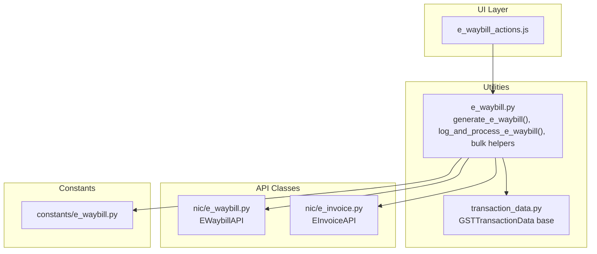
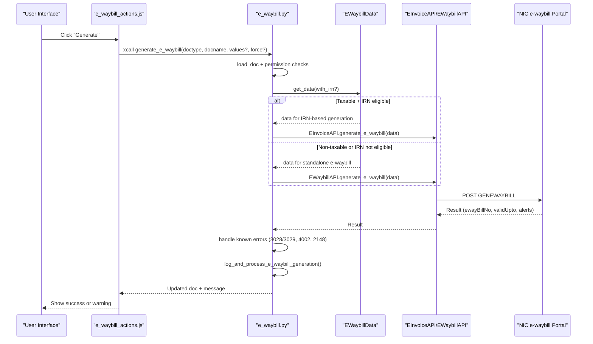
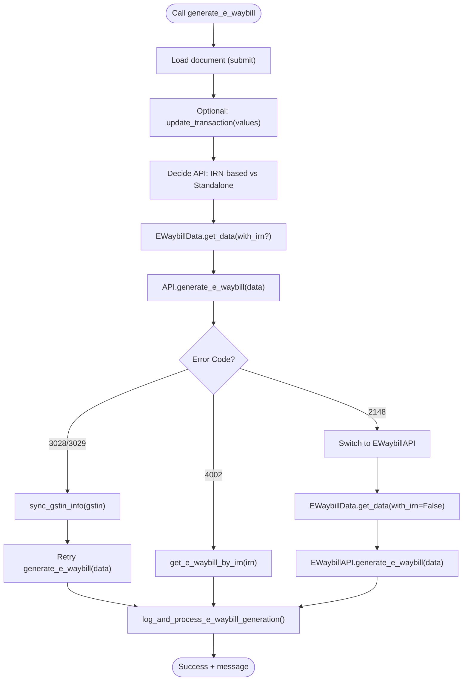
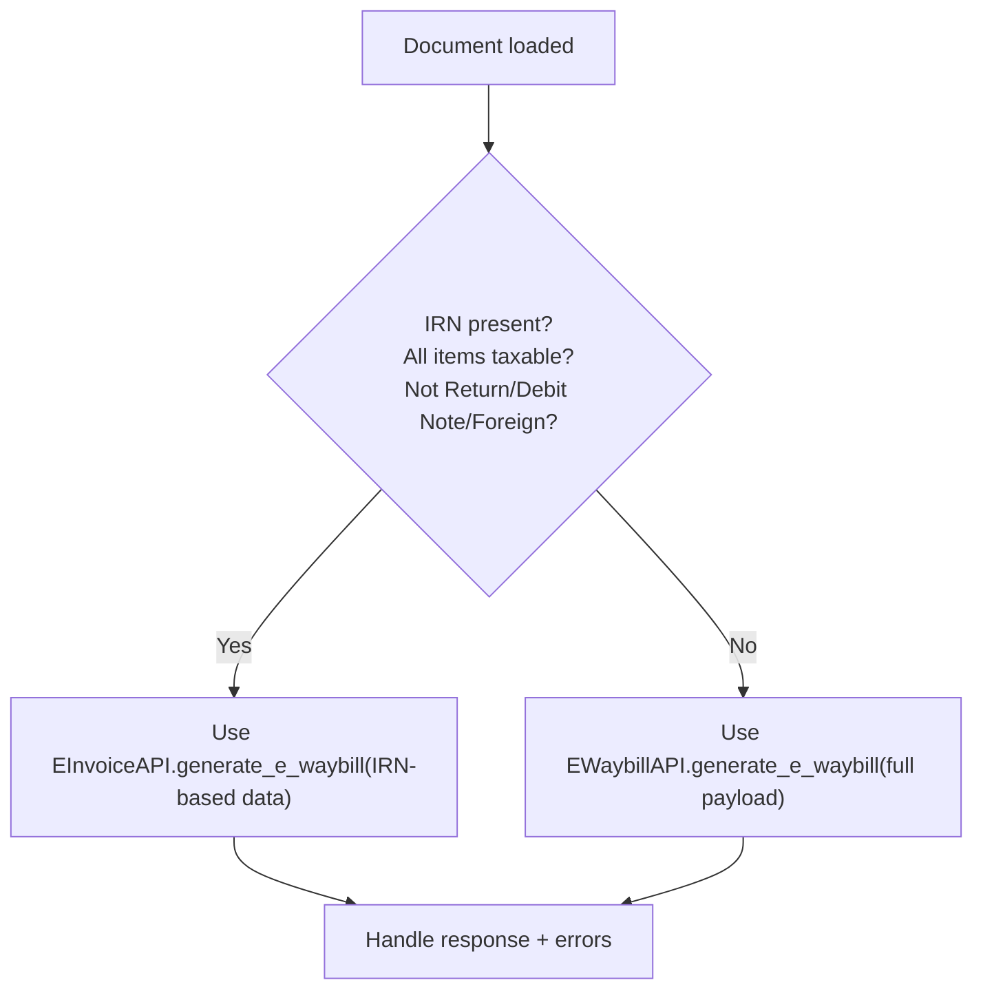
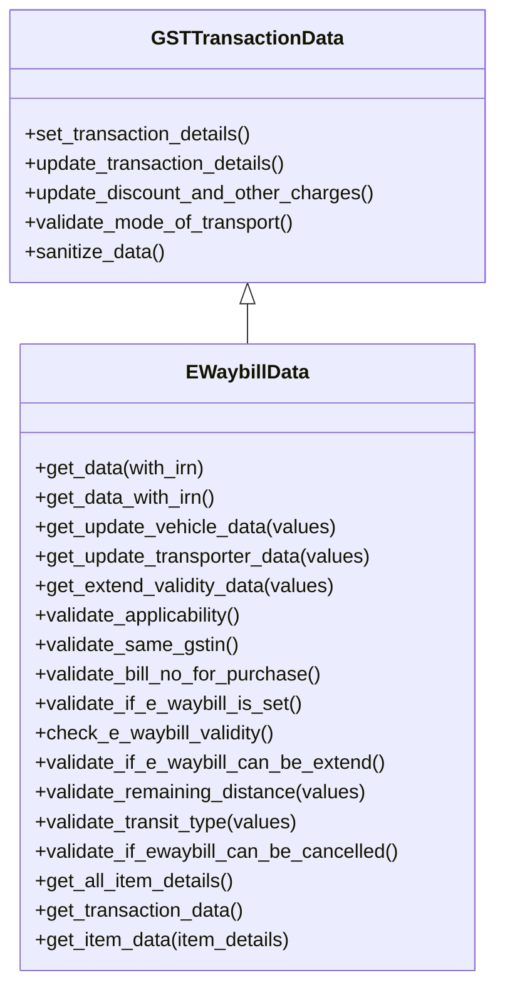
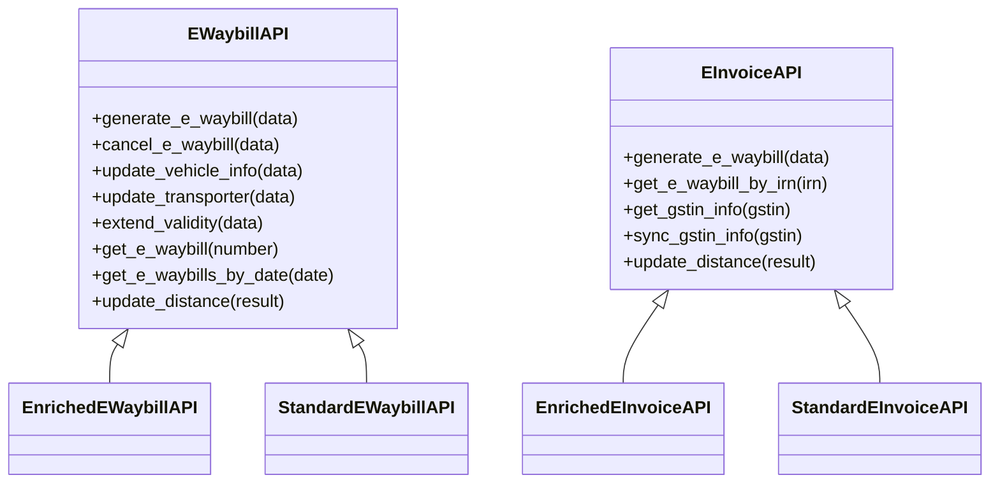
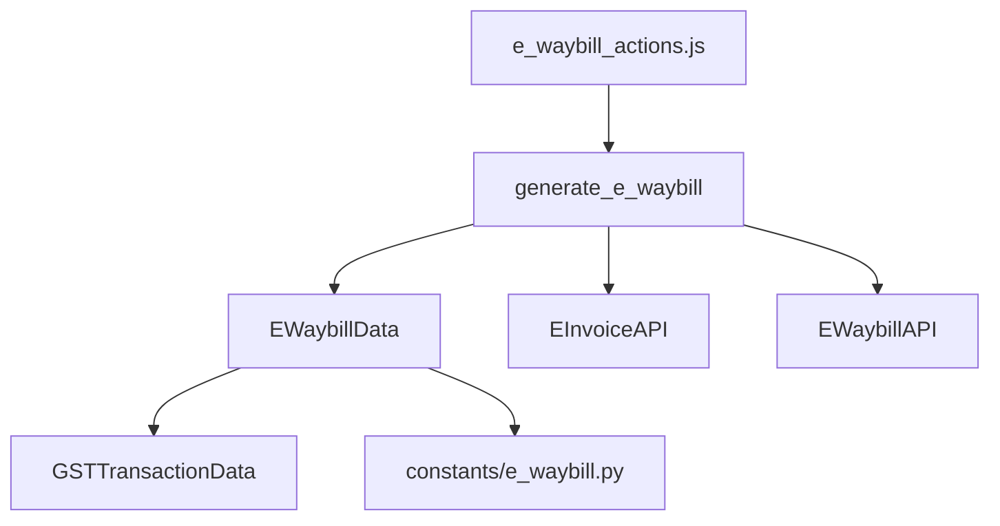

# E-Waybill Generation

<cite>
**Referenced Files in This Document**
- [e_waybill.py](file://india_compliance/gst_india/utils/e_waybill.py)
- [e_waybill.py](file://india_compliance/gst_india/api_classes/nic/e_waybill.py)
- [e_invoice.py](file://india_compliance/gst_india/api_classes/nic/e_invoice.py)
- [e_waybill.py](file://india_compliance/gst_india/constants/e_waybill.py)
- [e_waybill.py](file://india_compliance/gst_india/utils/transaction_data.py)
- [e_waybill_actions.js](file://india_compliance/gst_india/client_scripts/e_waybill_actions.js)
- [e_waybill.py](file://india_compliance/gst_india/data/test_e_waybill.json)
- [e_waybill.py](file://india_compliance/gst_india/utils/test_e_waybill.py)
</cite>

## Table of Contents
1. [Introduction](#introduction)
2. [Project Structure](#project-structure)
3. [Core Components](#core-components)
4. [Architecture Overview](#architecture-overview)
5. [Detailed Component Analysis](#detailed-component-analysis)
6. [Dependency Analysis](#dependency-analysis)
7. [Performance Considerations](#performance-considerations)
8. [Troubleshooting Guide](#troubleshooting-guide)
9. [Conclusion](#conclusion)
10. [Appendices](#appendices)

## Introduction
This document explains the e-waybill generation functionality in the India Compliance module. It focuses on the generate_e_waybill method, the dual-generation approach (via e-Invoice API for taxable transactions and direct e-waybill API for non-taxable items), the EWaybillData class for data preparation and validation, and the end-to-end workflow including API integration with the NIC e-waybill portal, error handling, and retry mechanisms. It also covers bulk generation, force generation options, and integration with document submission workflows.

## Project Structure
The e-waybill generation spans several modules:
- Utilities for generation, logging, and PDF attachment
- API classes for NIC e-waybill and e-invoice integrations
- Constants and enums for e-waybill configuration
- Client-side actions for UI-driven generation and updates
- Tests and fixtures for validation and examples

**Diagram sources**
- [e_waybill.py](file://india_compliance/gst_india/utils/e_waybill.py#L155-L332)
- [e_waybill.py](file://india_compliance/gst_india/api_classes/nic/e_waybill.py#L17-L120)
- [e_invoice.py](file://india_compliance/gst_india/api_classes/nic/e_invoice.py#L12-L121)
- [e_waybill.py](file://india_compliance/gst_india/utils/transaction_data.py#L34-L200)
- [e_waybill.py](file://india_compliance/gst_india/constants/e_waybill.py#L25-L99)
- [e_waybill_actions.js](file://india_compliance/gst_india/client_scripts/e_waybill_actions.js#L10-L242)

**Section sources**
- [e_waybill.py](file://india_compliance/gst_india/utils/e_waybill.py#L1-L120)
- [e_waybill.py](file://india_compliance/gst_india/api_classes/nic/e_waybill.py#L1-L120)
- [e_invoice.py](file://india_compliance/gst_india/api_classes/nic/e_invoice.py#L1-L121)
- [e_waybill.py](file://india_compliance/gst_india/utils/transaction_data.py#L1-L200)
- [e_waybill.py](file://india_compliance/gst_india/constants/e_waybill.py#L1-L99)
- [e_waybill_actions.js](file://india_compliance/gst_india/client_scripts/e_waybill_actions.js#L1-L242)

## Core Components
- generate_e_waybill: The primary whitelisted entry point for single-document generation. It validates state, selects the appropriate API (e-Invoice vs e-waybill), handles known errors, logs results, and updates the document.
- EWaybillData: Prepares and sanitizes the e-waybill payload from ERPNext documents, applies validations, and supports both IRN-based and standalone generation modes.
- API classes: EWaybillAPI and EInvoiceAPI encapsulate NIC integration, authentication, error decoding, and response handling.
- Client-side actions: UI triggers generation, updates, and fetches, and integrates with server-side methods.

**Section sources**
- [e_waybill.py](file://india_compliance/gst_india/utils/e_waybill.py#L155-L332)
- [e_waybill.py](file://india_compliance/gst_india/utils/e_waybill.py#L1268-L1944)
- [e_waybill.py](file://india_compliance/gst_india/api_classes/nic/e_waybill.py#L17-L120)
- [e_invoice.py](file://india_compliance/gst_india/api_classes/nic/e_invoice.py#L12-L121)
- [e_waybill_actions.js](file://india_compliance/gst_india/client_scripts/e_waybill_actions.js#L254-L349)

## Architecture Overview
The generation workflow selects the API based on transaction type and document state, prepares sanitized data, posts to NIC, and persists logs and status.

**Diagram sources**
- [e_waybill.py](file://india_compliance/gst_india/utils/e_waybill.py#L155-L332)
- [e_waybill.py](file://india_compliance/gst_india/utils/e_waybill.py#L1268-L1310)
- [e_invoice.py](file://india_compliance/gst_india/api_classes/nic/e_invoice.py#L118-L121)
- [e_waybill.py](file://india_compliance/gst_india/api_classes/nic/e_waybill.py#L104-L107)

## Detailed Component Analysis

### generate_e_waybill Method
- Loads the document in submit mode, optionally updates transaction fields, and calls the internal generator.
- Internal generator:
  - Prevents duplicate generation.
  - Respects retry gating via settings and pending retries.
  - Determines whether to use e-Invoice API (IRN-based) or e-waybill API (standalone).
  - Builds payload via EWaybillData.
  - Calls the chosen API and processes results.
  - Handles specific error codes:
    - 3028/3029: Sync GSTIN status and retry.
    - 4002: Fetch existing e-waybill by IRN.
    - 2148: Force standalone e-waybill generation.
  - Logs and updates document status and fields.
  - Provides user feedback and returns updated document.

**Diagram sources**
- [e_waybill.py](file://india_compliance/gst_india/utils/e_waybill.py#L155-L332)
- [e_invoice.py](file://india_compliance/gst_india/api_classes/nic/e_invoice.py#L99-L121)
- [e_waybill.py](file://india_compliance/gst_india/api_classes/nic/e_waybill.py#L104-L107)

**Section sources**
- [e_waybill.py](file://india_compliance/gst_india/utils/e_waybill.py#L155-L332)
- [e_invoice.py](file://india_compliance/gst_india/api_classes/nic/e_invoice.py#L99-L121)

### Dual Approach: e-Invoice API vs Direct e-waybill API
- IRN-based generation:
  - Used when IRN exists, all items are taxable, and document is not a return/debit note/foreign transaction.
  - Payload includes IRN and minimal transport details.
- Standalone generation:
  - Used otherwise, building a full e-waybill payload with addresses, items, taxes, and transport details.

**Diagram sources**
- [e_waybill.py](file://india_compliance/gst_india/utils/e_waybill.py#L185-L198)
- [e_waybill.py](file://india_compliance/gst_india/utils/e_waybill.py#L1292-L1310)
- [e_waybill.py](file://india_compliance/gst_india/utils/e_waybill.py#L1284-L1290)

**Section sources**
- [e_waybill.py](file://india_compliance/gst_india/utils/e_waybill.py#L185-L198)
- [e_waybill.py](file://india_compliance/gst_india/utils/e_waybill.py#L1292-L1310)

### EWaybillData Class
Responsibilities:
- Validate applicability and settings.
- Prepare transaction details, item lists, transporter, addresses, and document metadata.
- Support IRN-based payload and standalone payload.
- Apply validations:
  - Same-party GSTIN validation.
  - Required addresses and at least one goods item.
  - Transporter details and vehicle number requirements by mode.
  - Distance constraints for same-pincode scenarios.
  - HSN/SAC limits and item grouping.

**Diagram sources**
- [e_waybill.py](file://india_compliance/gst_india/utils/e_waybill.py#L1268-L1944)
- [e_waybill.py](file://india_compliance/gst_india/utils/transaction_data.py#L34-L200)

**Section sources**
- [e_waybill.py](file://india_compliance/gst_india/utils/e_waybill.py#L1268-L1944)
- [e_waybill.py](file://india_compliance/gst_india/utils/transaction_data.py#L34-L200)

### Validation Rules and Constraints
- Applicability:
  - Required addresses per doctype.
  - At least one goods item (non-service HSN).
  - Transporter details or mode of transport.
  - Same-company GSTIN constraint for certain doctypes.
- Transporter and vehicle:
  - Mode-specific requirements (e.g., vehicle number for Road, LR number for Rail/Air, vehicle+LR for Ship).
- Distance:
  - For same pincode, enforce 1–100 km and default to 1 km if zero.
- Limits:
  - Maximum items grouped by HSN/SAC codes.

**Section sources**
- [e_waybill.py](file://india_compliance/gst_india/utils/e_waybill.py#L1414-L1484)
- [e_waybill.py](file://india_compliance/gst_india/utils/e_waybill.py#L1782-L1804)
- [e_waybill.py](file://india_compliance/gst_india/utils/transaction_data.py#L192-L228)
- [e_waybill.py](file://india_compliance/gst_india/constants/e_waybill.py#L95-L99)

### API Integration and Error Handling
- EWaybillAPI:
  - Supports sandbox/fallback mode and standard authentication.
  - Generates e-waybills, cancels, updates vehicle info, transporters, extends validity.
  - Extracts and normalizes distance alerts.
- EInvoiceAPI:
  - Integrates with e-waybill endpoint under IRN context.
  - Handles known error codes including 3028/3029, 4002, 2148.
- Error mapping:
  - NIC error codes mapped to human-readable messages.

**Diagram sources**
- [e_waybill.py](file://india_compliance/gst_india/api_classes/nic/e_waybill.py#L17-L259)
- [e_invoice.py](file://india_compliance/gst_india/api_classes/nic/e_invoice.py#L12-L271)

**Section sources**
- [e_waybill.py](file://india_compliance/gst_india/api_classes/nic/e_waybill.py#L17-L259)
- [e_invoice.py](file://india_compliance/gst_india/api_classes/nic/e_invoice.py#L12-L271)

### Logging, PDF Attachment, and Document Updates
- log_and_process_e_waybill_generation updates the e-waybill log, sets status, and optionally attaches the printed PDF.
- fetch_e_waybill_data retrieves latest data and updates logs.
- mark_e_waybill_as_generated/cancelled support manual updates.

**Section sources**
- [e_waybill.py](file://india_compliance/gst_india/utils/e_waybill.py#L335-L371)
- [e_waybill.py](file://india_compliance/gst_india/utils/e_waybill.py#L817-L825)
- [e_waybill.py](file://india_compliance/gst_india/utils/e_waybill.py#L864-L897)

### Bulk Generation and Force Options
- Bulk generation enqueues jobs per document and commits per iteration.
- Force flag bypasses certain pre-checks and allows manual override.
- Retry mechanism:
  - Pending retry flag can block generation until resolved.
  - Specific error codes trigger fallback logic (e.g., GSTIN sync).

**Section sources**
- [e_waybill.py](file://india_compliance/gst_india/utils/e_waybill.py#L106-L125)
- [e_waybill.py](file://india_compliance/gst_india/utils/e_waybill.py#L128-L151)
- [e_waybill.py](file://india_compliance/gst_india/utils/e_waybill.py#L178-L183)

### Practical Examples
- Successful generation:
  - Example payload and response for taxable goods and non-taxable goods are validated in tests and fixtures.
- Common error scenarios:
  - 3028/3029: Invalid or inactive GSTIN; handled by syncing GSTIN status and retrying.
  - 4002: E-waybill already generated via IRN; fetch and log.
  - 2148: IRN data not available; switch to standalone generation.
- UI-driven generation:
  - Dialog captures transport details and triggers generation or JSON download.

**Section sources**
- [e_waybill.py](file://india_compliance/gst_india/data/test_e_waybill.json#L72-L141)
- [e_waybill.py](file://india_compliance/gst_india/data/test_e_waybill.json#L2-L71)
- [e_waybill.py](file://india_compliance/gst_india/utils/test_e_waybill.py#L89-L103)
- [e_waybill_actions.js](file://india_compliance/gst_india/client_scripts/e_waybill_actions.js#L254-L349)

## Dependency Analysis
- generate_e_waybill depends on:
  - EWaybillData for payload construction.
  - EInvoiceAPI/EWaybillAPI for NIC integration.
  - Transaction validation and constants.
- EWaybillData inherits from GSTTransactionData and adds e-waybill-specific logic.
- Client-side actions depend on server-side methods for generation and updates.

**Diagram sources**
- [e_waybill.py](file://india_compliance/gst_india/utils/e_waybill.py#L155-L332)
- [e_waybill.py](file://india_compliance/gst_india/utils/e_waybill.py#L1268-L1310)
- [e_waybill.py](file://india_compliance/gst_india/api_classes/nic/e_waybill.py#L17-L120)
- [e_invoice.py](file://india_compliance/gst_india/api_classes/nic/e_invoice.py#L12-L121)
- [e_waybill.py](file://india_compliance/gst_india/utils/transaction_data.py#L34-L200)
- [e_waybill.py](file://india_compliance/gst_india/constants/e_waybill.py#L25-L99)
- [e_waybill_actions.js](file://india_compliance/gst_india/client_scripts/e_waybill_actions.js#L254-L349)

**Section sources**
- [e_waybill.py](file://india_compliance/gst_india/utils/e_waybill.py#L155-L332)
- [e_waybill.py](file://india_compliance/gst_india/utils/e_waybill.py#L1268-L1310)
- [e_waybill.py](file://india_compliance/gst_india/api_classes/nic/e_waybill.py#L17-L120)
- [e_invoice.py](file://india_compliance/gst_india/api_classes/nic/e_invoice.py#L12-L121)
- [e_waybill.py](file://india_compliance/gst_india/utils/transaction_data.py#L34-L200)
- [e_waybill.py](file://india_compliance/gst_india/constants/e_waybill.py#L25-L99)
- [e_waybill_actions.js](file://india_compliance/gst_india/client_scripts/e_waybill_actions.js#L254-L349)

## Performance Considerations
- Bulk generation uses a long queue with per-document timeouts to avoid timeouts.
- Per-document commits ensure resilience and reduce memory footprint.
- Distance extraction from alerts avoids extra API calls when available.
- HSN grouping caps item count to reduce payload size.

[No sources needed since this section provides general guidance]

## Troubleshooting Guide
Common issues and resolutions:
- Duplicate generation:
  - Error: AlreadyGeneratedError raised if e-waybill already exists.
- Invalid or inactive GSTIN (3028/3029):
  - Resolution: Sync GSTIN status and retry generation.
- E-waybill already generated via IRN (4002):
  - Resolution: Fetch e-waybill by IRN and log.
- IRN data not available (2148):
  - Resolution: Switch to standalone e-waybill generation.
- Transporter/GSTIN mismatch or invalid:
  - Resolution: Fix transporter details or GSTIN; ensure mode of transport matches requirements.
- Same-party GSTIN:
  - Resolution: Change party GSTIN or adjust document type.
- Vehicle number/format errors:
  - Resolution: Correct vehicle number format per mode of transport.
- Distance constraints:
  - Resolution: Adjust distance for same-pincode scenarios within 1–100 km.

**Section sources**
- [e_waybill.py](file://india_compliance/gst_india/utils/e_waybill.py#L203-L234)
- [e_waybill.py](file://india_compliance/gst_india/utils/e_waybill.py#L1396-L1402)
- [e_waybill.py](file://india_compliance/gst_india/utils/e_waybill.py#L1454-L1471)
- [e_waybill.py](file://india_compliance/gst_india/utils/transaction_data.py#L192-L228)
- [e_waybill.py](file://india_compliance/gst_india/utils/e_waybill.py#L1782-L1804)

## Conclusion
The e-waybill generation pipeline integrates UI actions, robust data preparation via EWaybillData, and resilient API interactions with NIC. It supports dual-generation modes, comprehensive validation, and strong error handling with retry and fallback logic. Bulk generation and manual override options enable flexible workflows aligned with document submission processes.

[No sources needed since this section summarizes without analyzing specific files]

## Appendices

### API Definitions and Behaviors
- EWaybillAPI.generate_e_waybill:
  - Inputs: Full e-waybill payload.
  - Outputs: e-waybill number, validity window, and optional distance.
- EInvoiceAPI.generate_e_waybill:
  - Inputs: IRN-based payload.
  - Outputs: e-waybill number and validity derived from IRN context.
- Error handling:
  - Known codes normalized and mapped to user-friendly messages.

**Section sources**
- [e_waybill.py](file://india_compliance/gst_india/api_classes/nic/e_waybill.py#L104-L107)
- [e_invoice.py](file://india_compliance/gst_india/api_classes/nic/e_invoice.py#L118-L121)
- [e_waybill.py](file://india_compliance/gst_india/api_classes/nic/e_waybill_errors.py#L1-L337)