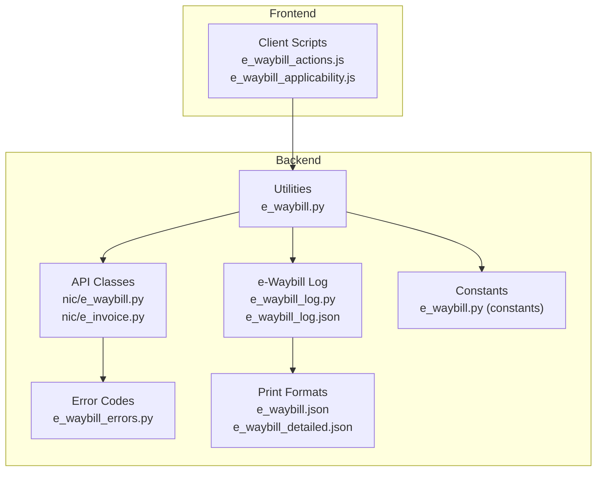
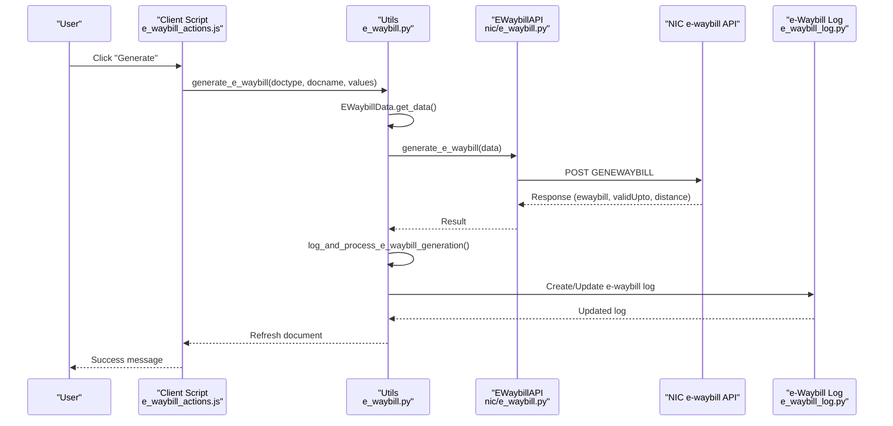
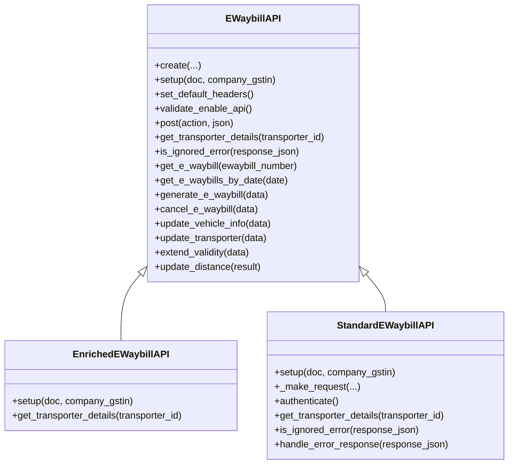
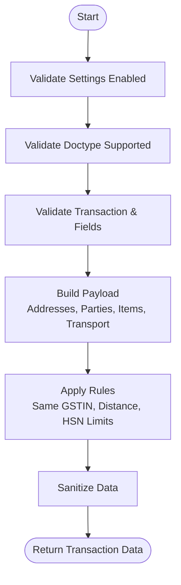
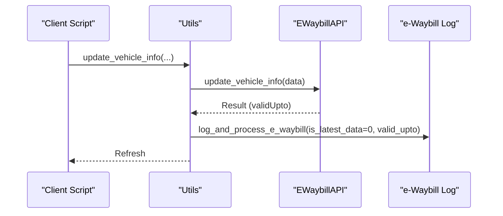
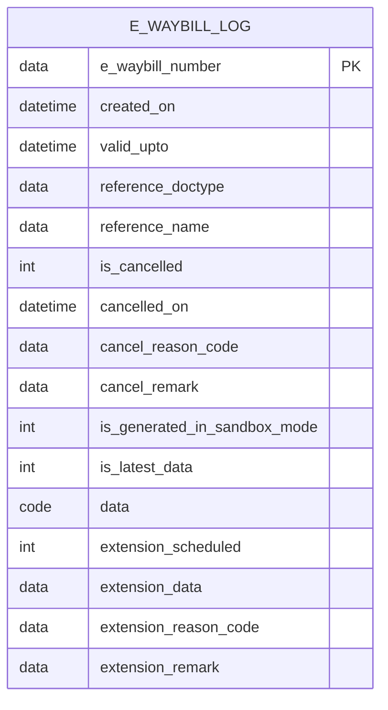
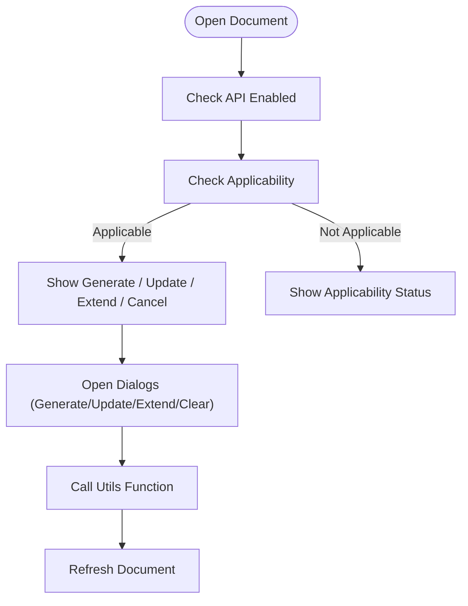
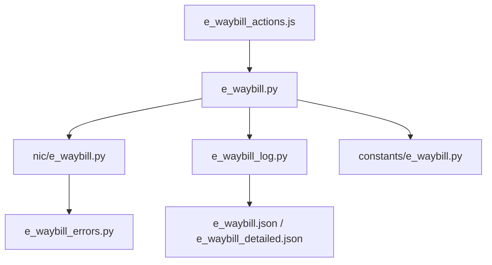

# E-Waybill Management

<cite>
**Referenced Files in This Document**
- [e_waybill.py](file://india_compliance/gst_india/utils/e_waybill.py)
- [e_waybill.py](file://india_compliance/gst_india/api_classes/nic/e_waybill.py)
- [e_waybill.py](file://india_compliance/gst_india/api_classes/nic/e_invoice.py)
- [e_waybill_log.py](file://india_compliance/gst_india/doctype/e_waybill_log/e_waybill_log.py)
- [e_waybill_log.json](file://india_compliance/gst_india/doctype/e_waybill_log/e_waybill_log.json)
- [e_waybill_actions.js](file://india_compliance/gst_india/client_scripts/e_waybill_actions.js)
- [e_waybill_applicability.js](file://india_compliance/gst_india/client_scripts/e_waybill_applicability.js)
- [e_waybill_errors.py](file://india_compliance/gst_india/api_classes/nic/e_waybill_errors.py)
- [e_waybill.py](file://india_compliance/gst_india/constants/e_waybill.py)
- [e_waybill.json](file://india_compliance/gst_india/print_format/e_waybill/e_waybill.json)
- [e_waybill_detailed.json](file://india_compliance/gst_india/print_format/e_waybill_detailed/e_waybill_detailed.json)
</cite>

## Table of Contents
1. [Introduction](#introduction)
2. [Project Structure](#project-structure)
3. [Core Components](#core-components)
4. [Architecture Overview](#architecture-overview)
5. [Detailed Component Analysis](#detailed-component-analysis)
6. [Dependency Analysis](#dependency-analysis)
7. [Performance Considerations](#performance-considerations)
8. [Troubleshooting Guide](#troubleshooting-guide)
9. [Conclusion](#conclusion)
10. [Appendices](#appendices)

## Introduction
This document explains the E-Waybill Management system within the India Compliance module. It covers vehicle movement tracking, transporter management, real-time updates, utility functions, API integration with government portals, and status monitoring. It also documents the e_waybill_log doctype for tracking waybill generation, extensions, cancellations, and real-time status updates, along with applicability rules for e-waybills based on distance, value, and product categories. Practical examples illustrate waybill generation workflows, vehicle details management, and integration with delivery documents. Common issues such as invalid vehicle numbers, distance calculation errors, and timeout scenarios are addressed with actionable solutions.

## Project Structure
The E-Waybill Management system spans Python utilities, API classes, client-side JavaScript, and a dedicated doctype for logging:

- Utilities: e-waybill generation, modification, printing, and logging
- API Classes: Integration with NIC e-waybill APIs (Standard and Enriched modes)
- Client Scripts: UI actions for generation, updates, and validations
- Logging: e-Waybill Log doctype and print formats

**Diagram sources**
- [e_waybill.py](file://india_compliance/gst_india/utils/e_waybill.py#L1-L200)
- [e_waybill.py](file://india_compliance/gst_india/api_classes/nic/e_waybill.py#L1-L120)
- [e_waybill.py](file://india_compliance/gst_india/api_classes/nic/e_invoice.py#L94-L137)
- [e_waybill_log.py](file://india_compliance/gst_india/doctype/e_waybill_log/e_waybill_log.py#L1-L23)
- [e_waybill_log.json](file://india_compliance/gst_india/doctype/e_waybill_log/e_waybill_log.json#L1-L237)
- [e_waybill_actions.js](file://india_compliance/gst_india/client_scripts/e_waybill_actions.js#L1-L120)
- [e_waybill_applicability.js](file://india_compliance/gst_india/client_scripts/e_waybill_applicability.js#L1-L90)
- [e_waybill_errors.py](file://india_compliance/gst_india/api_classes/nic/e_waybill_errors.py#L1-L120)
- [e_waybill.py](file://india_compliance/gst_india/constants/e_waybill.py#L1-L99)
- [e_waybill.json](file://india_compliance/gst_india/print_format/e_waybill/e_waybill.json#L1-L31)
- [e_waybill_detailed.json](file://india_compliance/gst_india/print_format/e_waybill_detailed/e_waybill_detailed.json#L1-L30)

**Section sources**
- [e_waybill.py](file://india_compliance/gst_india/utils/e_waybill.py#L1-L200)
- [e_waybill.py](file://india_compliance/gst_india/api_classes/nic/e_waybill.py#L1-L120)
- [e_waybill_log.json](file://india_compliance/gst_india/doctype/e_waybill_log/e_waybill_log.json#L1-L237)

## Core Components
- EWaybillAPI and subclasses: Handle authentication, API actions (generate, cancel, update vehicle info, update transporter, extend validity), and error handling.
- EWaybillData: Builds transaction data for e-waybill generation, validates applicability, and sanitizes payloads.
- e-waybill utilities: Public whitelisted functions for generation, cancellation, vehicle info updates, transporter updates, validity extensions, fetching data, and logging.
- e-Waybill Log: Tracks creation, cancellation, validity extensions, and real-time data sync.
- Client Scripts: Provide UI actions, dialogs, validations, and auto-generation triggers.
- Error Codes: Centralized mapping of NIC error codes to human-readable messages.

**Section sources**
- [e_waybill.py](file://india_compliance/gst_india/api_classes/nic/e_waybill.py#L17-L128)
- [e_waybill.py](file://india_compliance/gst_india/utils/e_waybill.py#L1268-L1391)
- [e_waybill_log.py](file://india_compliance/gst_india/doctype/e_waybill_log/e_waybill_log.py#L12-L23)
- [e_waybill_actions.js](file://india_compliance/gst_india/client_scripts/e_waybill_actions.js#L1-L120)
- [e_waybill_errors.py](file://india_compliance/gst_india/api_classes/nic/e_waybill_errors.py#L1-L337)

## Architecture Overview
End-to-end flow from UI to Government Portal and back:

**Diagram sources**
- [e_waybill_actions.js](file://india_compliance/gst_india/client_scripts/e_waybill_actions.js#L254-L314)
- [e_waybill.py](file://india_compliance/gst_india/utils/e_waybill.py#L155-L332)
- [e_waybill.py](file://india_compliance/gst_india/api_classes/nic/e_waybill.py#L104-L107)
- [e_waybill_log.py](file://india_compliance/gst_india/doctype/e_waybill_log/e_waybill_log.py#L12-L23)

## Detailed Component Analysis

### EWaybillAPI and API Integration
- Factory pattern selects Enriched vs Standard API based on settings.
- Authentication strategies differ by mode; Standard API handles token refresh and error decoding.
- Actions: generate, cancel, update vehicle info, update transporter, extend validity.
- Distance parsing from alerts and standardized error handling.

**Diagram sources**
- [e_waybill.py](file://india_compliance/gst_india/api_classes/nic/e_waybill.py#L17-L128)
- [e_waybill.py](file://india_compliance/gst_india/api_classes/nic/e_waybill.py#L130-L196)
- [e_waybill.py](file://india_compliance/gst_india/api_classes/nic/e_waybill.py#L152-L259)

**Section sources**
- [e_waybill.py](file://india_compliance/gst_india/api_classes/nic/e_waybill.py#L17-L128)
- [e_waybill.py](file://india_compliance/gst_india/api_classes/nic/e_waybill.py#L152-L259)

### EWaybillData: Transaction Data Builder
- Validates settings, doctype support, and applicability.
- Builds payload for e-waybill generation, including addresses, parties, items, and transport details.
- Applies business rules: same GSTIN validation, distance constraints, HSN limits, and document type mapping.

**Diagram sources**
- [e_waybill.py](file://india_compliance/gst_india/utils/e_waybill.py#L1268-L1310)
- [e_waybill.py](file://india_compliance/gst_india/utils/e_waybill.py#L1393-L1494)

**Section sources**
- [e_waybill.py](file://india_compliance/gst_india/utils/e_waybill.py#L1268-L1310)
- [e_waybill.py](file://india_compliance/gst_india/utils/e_waybill.py#L1393-L1494)

### e-waybill Utilities: Generation, Updates, Extensions
- Generation: Supports IRN-based generation and fallback to e-waybill API; handles retries and server errors.
- Cancellation: Validates cancellation window and logs cancellation details.
- Vehicle Info Update: Updates Part B fields and logs changes with real-time data sync.
- Transporter Update: Updates transporter details and logs.
- Validity Extension: Validates timing, distance, and mode; supports scheduling and real-time extension.
- Fetch and Print: Retrieves latest data and attaches PDF prints.

**Diagram sources**
- [e_waybill_actions.js](file://india_compliance/gst_india/client_scripts/e_waybill_actions.js#L800-L918)
- [e_waybill.py](file://india_compliance/gst_india/utils/e_waybill.py#L437-L508)
- [e_waybill_log.py](file://india_compliance/gst_india/doctype/e_waybill_log/e_waybill_log.py#L12-L23)

**Section sources**
- [e_waybill.py](file://india_compliance/gst_india/utils/e_waybill.py#L155-L332)
- [e_waybill.py](file://india_compliance/gst_india/utils/e_waybill.py#L375-L435)
- [e_waybill.py](file://india_compliance/gst_india/utils/e_waybill.py#L437-L508)
- [e_waybill.py](file://india_compliance/gst_india/utils/e_waybill.py#L628-L664)
- [e_waybill.py](file://india_compliance/gst_india/utils/e_waybill.py#L795-L860)

### e-Waybill Log: Tracking and Real-Time Updates
- Tracks creation, cancellation, validity extensions, and latest data sync.
- Provides print formats for e-waybill printing and detailed views.
- Supports fetching latest data and attaching PDFs.

**Diagram sources**
- [e_waybill_log.json](file://india_compliance/gst_india/doctype/e_waybill_log/e_waybill_log.json#L33-L173)

**Section sources**
- [e_waybill_log.py](file://india_compliance/gst_india/doctype/e_waybill_log/e_waybill_log.py#L12-L23)
- [e_waybill_log.json](file://india_compliance/gst_india/doctype/e_waybill_log/e_waybill_log.json#L1-L237)
- [e_waybill.json](file://india_compliance/gst_india/print_format/e_waybill/e_waybill.json#L1-L31)
- [e_waybill_detailed.json](file://india_compliance/gst_india/print_format/e_waybill_detailed/e_waybill_detailed.json#L1-L30)

### Client Scripts: UI Actions and Validations
- Generates e-waybill dialogs with Part A/Part B options.
- Validates applicability, thresholds, and transport details.
- Provides actions for update vehicle info, update transporter, extend validity, fetch, attach, and cancel.

**Diagram sources**
- [e_waybill_actions.js](file://india_compliance/gst_india/client_scripts/e_waybill_actions.js#L10-L192)
- [e_waybill_applicability.js](file://india_compliance/gst_india/client_scripts/e_waybill_applicability.js#L60-L129)

**Section sources**
- [e_waybill_actions.js](file://india_compliance/gst_india/client_scripts/e_waybill_actions.js#L1-L192)
- [e_waybill_applicability.js](file://india_compliance/gst_india/client_scripts/e_waybill_applicability.js#L1-L129)

### Applicability Rules and Thresholds
- Applicability: Enabled in settings, non-opening entries, at least one goods item, valid addresses, and non-same GSTIN for parties.
- Threshold: Auto-generation requires meeting the configured e-waybill threshold.
- Document types and sub-supply types mapped per doctype and return status.

**Section sources**
- [e_waybill_applicability.js](file://india_compliance/gst_india/client_scripts/e_waybill_applicability.js#L6-L89)
- [e_waybill.py](file://india_compliance/gst_india/utils/e_waybill.py#L1414-L1494)
- [e_waybill.py](file://india_compliance/gst_india/constants/e_waybill.py#L57-L83)

## Dependency Analysis
- Utilities depend on API classes for HTTP actions and on the e-waybill log doctype for persistence.
- Client scripts depend on utilities for backend calls and on applicability logic for enabling/disabling actions.
- API classes depend on error code mapping for user-friendly messages.
- Print formats depend on e-Waybill Log data.

**Diagram sources**
- [e_waybill_actions.js](file://india_compliance/gst_india/client_scripts/e_waybill_actions.js#L1-L120)
- [e_waybill.py](file://india_compliance/gst_india/utils/e_waybill.py#L1-L200)
- [e_waybill.py](file://india_compliance/gst_india/api_classes/nic/e_waybill.py#L1-L120)
- [e_waybill_log.py](file://india_compliance/gst_india/doctype/e_waybill_log/e_waybill_log.py#L1-L23)
- [e_waybill_errors.py](file://india_compliance/gst_india/api_classes/nic/e_waybill_errors.py#L1-L120)
- [e_waybill.py](file://india_compliance/gst_india/constants/e_waybill.py#L1-L99)
- [e_waybill.json](file://india_compliance/gst_india/print_format/e_waybill/e_waybill.json#L1-L31)
- [e_waybill_detailed.json](file://india_compliance/gst_india/print_format/e_waybill_detailed/e_waybill_detailed.json#L1-L30)

**Section sources**
- [e_waybill.py](file://india_compliance/gst_india/utils/e_waybill.py#L1-L200)
- [e_waybill.py](file://india_compliance/gst_india/api_classes/nic/e_waybill.py#L1-L120)
- [e_waybill_log.json](file://india_compliance/gst_india/doctype/e_waybill_log/e_waybill_log.json#L1-L237)

## Performance Considerations
- Batch generation uses job queues to avoid timeouts; adjust per-document time budgets accordingly.
- Distance calculation and alerts are parsed efficiently to avoid repeated network calls.
- Logging and PDF attachment are enqueued to keep UI responsive.
- Use “Fetch Latest Data” sparingly; cache where appropriate.

[No sources needed since this section provides general guidance]

## Troubleshooting Guide
Common issues and resolutions:

- Invalid vehicle number or missing transport details
  - Ensure mode of transport and required fields are set; Road requires vehicle number; Ship requires vehicle and LR; Rail/Air require LR.
  - Verify transporter details if Part B is required.

- Distance calculation errors
  - For same PIN code, distance must be between 1–100 km; system defaults to 1 km if zero.
  - If distance not returned by portal, system parses alert text to extract distance.

- Timeout scenarios
  - Use bulk generation with job queues; monitor job IDs.
  - Retry mechanism for server errors; ensure retry window aligns with GSP availability.

- Cancellation restrictions
  - Cancellations allowed within 24 hours of generation; otherwise, mark as cancelled manually.

- Transporter updates
  - Validity must not be expired; transporter can only be updated under allowed conditions.

- Error code interpretation
  - NIC error codes mapped to user-friendly messages; review error details and take corrective action.

**Section sources**
- [e_waybill.py](file://india_compliance/gst_india/utils/e_waybill.py#L1782-L1804)
- [e_waybill.py](file://india_compliance/gst_india/utils/e_waybill.py#L1500-L1571)
- [e_waybill.py](file://india_compliance/gst_india/utils/e_waybill.py#L1536-L1546)
- [e_waybill.py](file://india_compliance/gst_india/api_classes/nic/e_waybill.py#L121-L128)
- [e_waybill_errors.py](file://india_compliance/gst_india/api_classes/nic/e_waybill_errors.py#L1-L337)

## Conclusion
The E-Waybill Management system integrates seamlessly with ERPNext documents, automates compliance workflows, and maintains a robust audit trail via e-waybill_log. It supports real-time updates, flexible transport configurations, and strict validation rules aligned with NIC requirements. The modular design ensures maintainability, scalability, and ease of troubleshooting.

[No sources needed since this section summarizes without analyzing specific files]

## Appendices

### Practical Examples

- Waybill generation workflow
  - Open a supported document (e.g., Sales Invoice), ensure applicability, and click Generate. If transport details are incomplete, system prompts for Part A/Part B options.

- Vehicle details management
  - Use Update Vehicle Info dialog to change vehicle number, LR details, and reason; system logs changes and optionally fetches latest data.

- Integration with delivery documents
  - Delivery Notes and Stock Entries support e-waybill generation with appropriate sub-supply types and address mapping.

- Scheduling validity extension
  - If outside the 8-hour window, schedule extension; system updates log and executes extension at the scheduled time.

**Section sources**
- [e_waybill_actions.js](file://india_compliance/gst_india/client_scripts/e_waybill_actions.js#L254-L314)
- [e_waybill_actions.js](file://india_compliance/gst_india/client_scripts/e_waybill_actions.js#L800-L918)
- [e_waybill_actions.js](file://india_compliance/gst_india/client_scripts/e_waybill_actions.js#L987-L1180)
- [e_waybill.py](file://india_compliance/gst_india/utils/e_waybill.py#L667-L720)