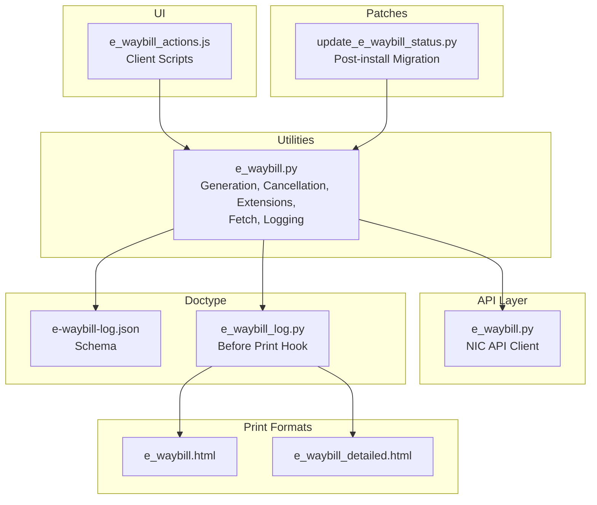
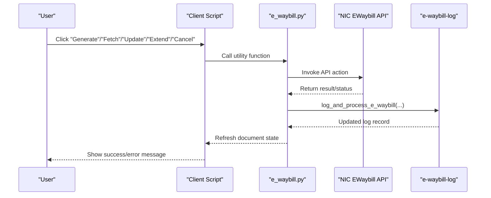
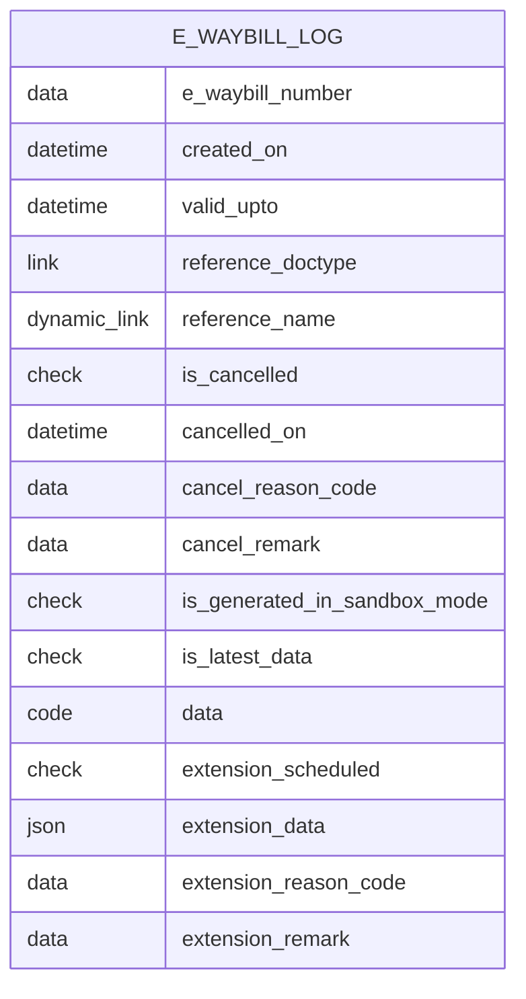
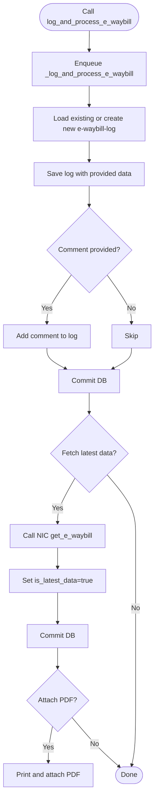
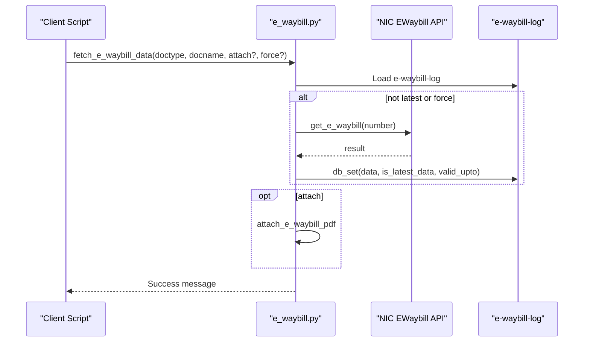
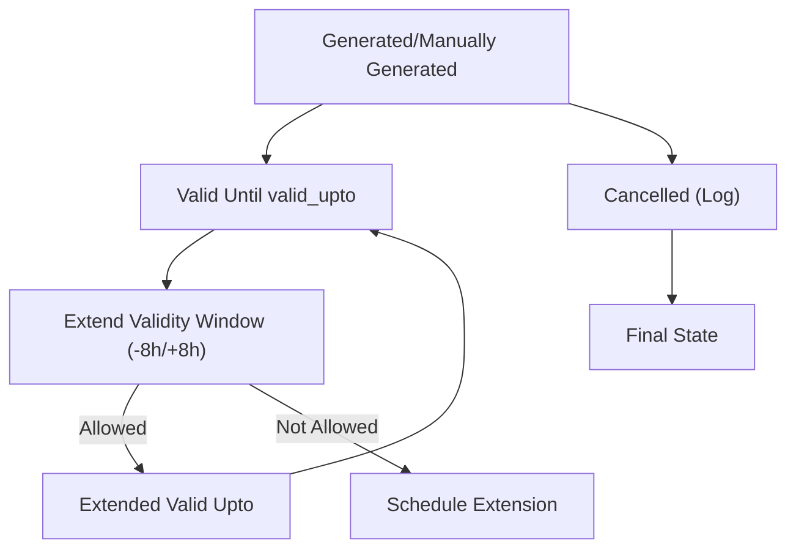
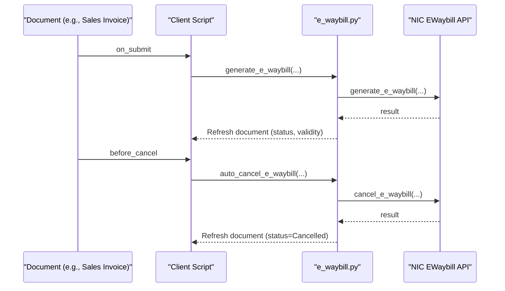
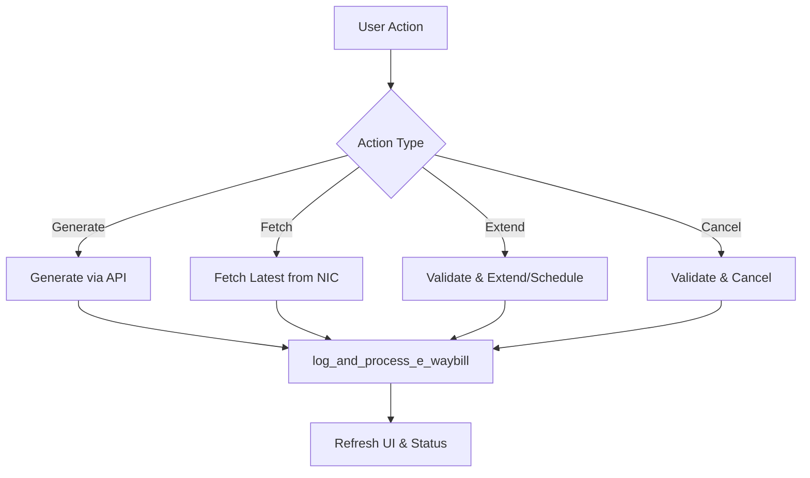
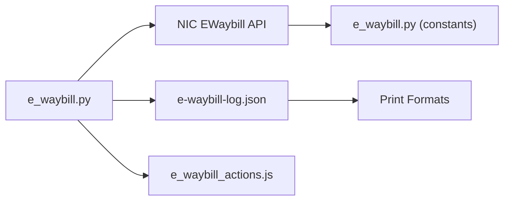

# E-Waybill Status Tracking

<cite>
**Referenced Files in This Document**
- [e_waybill.py](file://india_compliance/gst_india/utils/e_waybill.py)
- [e_waybill.py](file://india_compliance/gst_india/api_classes/nic/e_waybill.py)
- [e_waybill_log.py](file://india_compliance/gst_india/doctype/e_waybill_log/e_waybill_log.py)
- [e_waybill_log.json](file://india_compliance/gst_india/doctype/e_waybill_log/e_waybill_log.json)
- [e_waybill.py](file://india_compliance/gst_india/constants/e_waybill.py)
- [e_waybill_actions.js](file://india_compliance/gst_india/client_scripts/e_waybill_actions.js)
- [update_e_waybill_status.py](file://india_compliance/patches/post_install/update_e_waybill_status.py)
- [e_waybill.html](file://india_compliance/gst_india/print_format/e_waybill/e_waybill.html)
- [e_waybill_detailed.html](file://india_compliance/gst_india/print_format/e_waybill_detailed/e_waybill_detailed.html)
</cite>

## Table of Contents
1. [Introduction](#introduction)
2. [Project Structure](#project-structure)
3. [Core Components](#core-components)
4. [Architecture Overview](#architecture-overview)
5. [Detailed Component Analysis](#detailed-component-analysis)
6. [Dependency Analysis](#dependency-analysis)
7. [Performance Considerations](#performance-considerations)
8. [Troubleshooting Guide](#troubleshooting-guide)
9. [Conclusion](#conclusion)

## Introduction
This document explains the e-waybill status tracking and monitoring system in the India Compliance module. It covers the e-waybill_log doctype structure, the log_and_process_e_waybill function for maintaining audit trails and synchronizing status, the fetch_e_waybill_data mechanism for retrieving current status from government portals, status codes and validity periods, automatic status updates, integration with document workflows, and troubleshooting failed status updates. It also clarifies the relationship between e-waybill status and document states.

## Project Structure
The e-waybill tracking system spans several modules:
- Utilities for e-waybill generation, modification, and synchronization
- API clients for NIC e-waybill endpoints
- e-waybill log doctype and its schema
- Client-side actions and UI integration
- Print formats for e-waybill display
- Post-install migration to populate e-waybill statuses

**Diagram sources**
- [e_waybill.py](file://india_compliance/gst_india/utils/e_waybill.py#L1-L120)
- [e_waybill.py](file://india_compliance/gst_india/api_classes/nic/e_waybill.py#L1-L60)
- [e_waybill_log.json](file://india_compliance/gst_india/doctype/e_waybill_log/e_waybill_log.json#L1-L60)
- [e_waybill_log.py](file://india_compliance/gst_india/doctype/e_waybill_log/e_waybill_log.py#L1-L23)
- [e_waybill_actions.js](file://india_compliance/gst_india/client_scripts/e_waybill_actions.js#L1-L60)
- [update_e_waybill_status.py](file://india_compliance/patches/post_install/update_e_waybill_status.py#L1-L40)
- [e_waybill.html](file://india_compliance/gst_india/print_format/e_waybill/e_waybill.html#L60-L102)
- [e_waybill_detailed.html](file://india_compliance/gst_india/print_format/e_waybill_detailed/e_waybill_detailed.html#L55-L80)

**Section sources**
- [e_waybill.py](file://india_compliance/gst_india/utils/e_waybill.py#L1-L120)
- [e_waybill.py](file://india_compliance/gst_india/api_classes/nic/e_waybill.py#L1-L60)
- [e_waybill_log.json](file://india_compliance/gst_india/doctype/e_waybill_log/e_waybill_log.json#L1-L60)
- [e_waybill_log.py](file://india_compliance/gst_india/doctype/e_waybill_log/e_waybill_log.py#L1-L23)
- [e_waybill_actions.js](file://india_compliance/gst_india/client_scripts/e_waybill_actions.js#L1-L60)
- [update_e_waybill_status.py](file://india_compliance/patches/post_install/update_e_waybill_status.py#L1-L40)
- [e_waybill.html](file://india_compliance/gst_india/print_format/e_waybill/e_waybill.html#L60-L102)
- [e_waybill_detailed.html](file://india_compliance/gst_india/print_format/e_waybill_detailed/e_waybill_detailed.html#L55-L80)

## Core Components
- e-waybill_log doctype: Stores audit trail entries for each e-waybill, including creation time, validity period, cancellation details, extension metadata, and latest data flag.
- log_and_process_e_waybill function: Centralized logging and synchronization routine invoked after generation, cancellation, vehicle/transporter updates, and validity extensions.
- fetch_e_waybill_data: Retrieves current e-waybill status from NIC APIs and updates logs and optionally attaches PDFs.
- API client: NIC e-waybill API wrapper handling authentication, endpoints, and error normalization.
- Client scripts: UI actions for generating, fetching, updating, extending, and cancelling e-waybills; integrates with document workflows.
- Print formats: Render e-waybill details including validity dates and distances.

Key responsibilities:
- Maintain audit trail and synchronize document status with e-waybill lifecycle events
- Retrieve real-time status from government portals and update local logs
- Enforce validity windows and extension rules
- Integrate with document states (Generated, Cancelled, Not Applicable, Failed, Pending)

**Section sources**
- [e_waybill_log.json](file://india_compliance/gst_india/doctype/e_waybill_log/e_waybill_log.json#L33-L173)
- [e_waybill.py](file://india_compliance/gst_india/utils/e_waybill.py#L1022-L1079)
- [e_waybill.py](file://india_compliance/gst_india/utils/e_waybill.py#L795-L826)
- [e_waybill.py](file://india_compliance/gst_india/api_classes/nic/e_waybill.py#L84-L128)
- [e_waybill_actions.js](file://india_compliance/gst_india/client_scripts/e_waybill_actions.js#L10-L192)

## Architecture Overview
End-to-end flow from document actions to government portal and back to local logs:

**Diagram sources**
- [e_waybill_actions.js](file://india_compliance/gst_india/client_scripts/e_waybill_actions.js#L244-L349)
- [e_waybill.py](file://india_compliance/gst_india/utils/e_waybill.py#L1022-L1079)
- [e_waybill.py](file://india_compliance/gst_india/api_classes/nic/e_waybill.py#L84-L128)

## Detailed Component Analysis

### e-waybill_log Doctype Structure
The e-waybill_log doctype captures:
- Identity: e_waybill_number (unique), reference_doctype, reference_name
- Lifecycle: created_on, valid_upto, is_cancelled, cancelled_on, is_generated_in_sandbox_mode
- Cancellation: cancel_reason_code, cancel_remark
- Extension: extension_scheduled, extension_data (JSON), extension_reason_code, extension_remark
- Data sync: is_latest_data, data (JSON)

**Diagram sources**
- [e_waybill_log.json](file://india_compliance/gst_india/doctype/e_waybill_log/e_waybill_log.json#L33-L173)

**Section sources**
- [e_waybill_log.json](file://india_compliance/gst_india/doctype/e_waybill_log/e_waybill_log.json#L33-L173)
- [e_waybill_log.py](file://india_compliance/gst_india/doctype/e_waybill_log/e_waybill_log.py#L12-L23)

### log_and_process_e_waybill Function
Purpose:
- Persist e-waybill lifecycle events (generation, cancellation, updates, extensions)
- Optionally fetch latest data from NIC and attach PDFs
- Update document onload cache for UI rendering

Behavior:
- Enqueues _log_and_process_e_waybill for reliability
- Creates or loads log by e_waybill_number
- Saves log, adds comments if provided, commits DB
- If fetch is enabled, retrieves latest data via NIC API and marks is_latest_data
- Attaches PDF if configured

**Diagram sources**
- [e_waybill.py](file://india_compliance/gst_india/utils/e_waybill.py#L1022-L1079)
- [e_waybill.py](file://india_compliance/gst_india/api_classes/nic/e_waybill.py#L97-L102)

**Section sources**
- [e_waybill.py](file://india_compliance/gst_india/utils/e_waybill.py#L1022-L1079)

### fetch_e_waybill_data Function
Purpose:
- Retrieve current e-waybill status from NIC APIs
- Update e-waybill-log with latest data and validity
- Optionally attach PDF to the document

Behavior:
- Loads document and e-waybill-log
- Calls NIC get_e_waybill if log is not latest or forced
- Updates log fields: data, is_latest_data, valid_upto
- If attach is requested, prints and attaches PDF

**Diagram sources**
- [e_waybill.py](file://india_compliance/gst_india/utils/e_waybill.py#L795-L826)
- [e_waybill.py](file://india_compliance/gst_india/api_classes/nic/e_waybill.py#L97-L102)

**Section sources**
- [e_waybill.py](file://india_compliance/gst_india/utils/e_waybill.py#L795-L826)

### Status Codes, Validity Periods, and Automatic Updates
- Validity window: valid_upto indicates the expiry timestamp; UI enforces extension windows around expiry.
- Status values observed:
  - Generated (auto-generated)
  - Manually Generated
  - Manually Cancelled
  - Cancelled (via log)
  - Not Applicable
  - Failed
  - Pending
- Automatic updates:
  - After generation, log_and_process_e_waybill sets e_waybill_status on Sales Invoice and updates validity.
  - Post-install migration populates statuses based on presence of e-waybill number, cancellation logs, and thresholds.

**Diagram sources**
- [e_waybill.py](file://india_compliance/gst_india/utils/e_waybill.py#L335-L371)
- [e_waybill.py](file://india_compliance/gst_india/utils/e_waybill.py#L1496-L1534)
- [update_e_waybill_status.py](file://india_compliance/patches/post_install/update_e_waybill_status.py#L23-L69)

**Section sources**
- [e_waybill.py](file://india_compliance/gst_india/utils/e_waybill.py#L335-L371)
- [e_waybill.py](file://india_compliance/gst_india/utils/e_waybill.py#L1496-L1534)
- [update_e_waybill_status.py](file://india_compliance/patches/post_install/update_e_waybill_status.py#L23-L69)

### Integration with Document Workflows
- Client scripts add buttons and actions based on document state and API availability.
- Auto-generate on submit triggers generation via xcall.
- Before cancel hook validates cancellation eligibility and auto-cancels if configured.
- Print formats render validity and distance for audit and compliance.

**Diagram sources**
- [e_waybill_actions.js](file://india_compliance/gst_india/client_scripts/e_waybill_actions.js#L193-L241)
- [e_waybill.py](file://india_compliance/gst_india/utils/e_waybill.py#L1951-L1991)

**Section sources**
- [e_waybill_actions.js](file://india_compliance/gst_india/client_scripts/e_waybill_actions.js#L193-L241)
- [e_waybill.py](file://india_compliance/gst_india/utils/e_waybill.py#L1951-L1991)
- [e_waybill.html](file://india_compliance/gst_india/print_format/e_waybill/e_waybill.html#L67-L87)
- [e_waybill_detailed.html](file://india_compliance/gst_india/print_format/e_waybill_detailed/e_waybill_detailed.html#L55-L80)

### Status Monitoring Workflows
Common workflows:
- Generate e-waybill: UI dialog collects transport details; on submit or explicit action, utility generates and logs.
- Fetch latest data: If validity or distance changes, fetch updates log and optionally attaches PDF.
- Extend validity: Validates proximity to expiry and remaining distance; supports immediate extension or scheduling.
- Cancel e-waybill: Validates 24-hour window and reason codes; updates log and document status.

**Diagram sources**
- [e_waybill_actions.js](file://india_compliance/gst_india/client_scripts/e_waybill_actions.js#L244-L349)
- [e_waybill.py](file://india_compliance/gst_india/utils/e_waybill.py#L1022-L1079)

**Section sources**
- [e_waybill_actions.js](file://india_compliance/gst_india/client_scripts/e_waybill_actions.js#L244-L349)
- [e_waybill.py](file://india_compliance/gst_india/utils/e_waybill.py#L1022-L1079)

## Dependency Analysis
- Utilities depend on:
  - NIC API client for HTTP actions
  - e-waybill-log doctype for persistence
  - Client scripts for UI triggers
  - Print formats for presentation
- API client encapsulates:
  - Authentication and base path selection
  - Endpoint dispatch (generate, cancel, update, extend, get)
  - Error normalization and ignored error handling
- Constants define:
  - Reason codes, transit types, supply types, and validation limits

**Diagram sources**
- [e_waybill.py](file://india_compliance/gst_india/utils/e_waybill.py#L1-L120)
- [e_waybill.py](file://india_compliance/gst_india/api_classes/nic/e_waybill.py#L1-L60)
- [e_waybill_log.json](file://india_compliance/gst_india/doctype/e_waybill_log/e_waybill_log.json#L1-L60)
- [e_waybill.py](file://india_compliance/gst_india/constants/e_waybill.py#L35-L55)
- [e_waybill_actions.js](file://india_compliance/gst_india/client_scripts/e_waybill_actions.js#L1-L60)

**Section sources**
- [e_waybill.py](file://india_compliance/gst_india/utils/e_waybill.py#L1-L120)
- [e_waybill.py](file://india_compliance/gst_india/api_classes/nic/e_waybill.py#L1-L60)
- [e_waybill_log.json](file://india_compliance/gst_india/doctype/e_waybill_log/e_waybill_log.json#L1-L60)
- [e_waybill.py](file://india_compliance/gst_india/constants/e_waybill.py#L35-L55)
- [e_waybill_actions.js](file://india_compliance/gst_india/client_scripts/e_waybill_actions.js#L1-L60)

## Performance Considerations
- Asynchronous logging: Uses enqueue to offload log_and_process_e_waybill, preventing UI blocking.
- Batch operations: Bulk generation and extension support batch processing with individual commits.
- Conditional fetch: fetch_e_waybill_data only queries NIC when log is not latest or forced.
- Distance parsing: API client extracts distance from alerts to reduce manual input and improve automation.

[No sources needed since this section provides general guidance]

## Troubleshooting Guide
Common issues and resolutions:
- API errors:
  - NIC returns ignored errors mapped to specific codes; these are normalized and may require manual intervention.
  - Invalid auth token triggers re-authentication and retry.
- Validation failures:
  - Remaining distance must be ≤ original distance; otherwise, adjust or regenerate.
  - Extension allowed only within ±8 hours of expiry; otherwise, schedule extension.
  - Cancellation allowed within 24 hours of generation; otherwise, mark manually.
- Status mismatches:
  - Use “Fetch Latest Data” to reconcile local logs with NIC records.
  - Validate e-waybill number format and numeric length.
- PDF attachment:
  - Ensure print format exists and attachments are enabled in settings.

**Section sources**
- [e_waybill.py](file://india_compliance/gst_india/api_classes/nic/e_waybill.py#L197-L259)
- [e_waybill.py](file://india_compliance/gst_india/utils/e_waybill.py#L1536-L1572)
- [e_waybill.py](file://india_compliance/gst_india/utils/e_waybill.py#L1200-L1209)
- [e_waybill.py](file://india_compliance/gst_india/utils/e_waybill.py#L795-L826)

## Conclusion
The e-waybill status tracking system provides a robust audit trail and real-time synchronization with government portals. The e-waybill_log doctype centralizes lifecycle data, while log_and_process_e_waybill ensures consistent updates across generation, cancellation, updates, and extensions. Client scripts integrate seamlessly with document workflows, and print formats aid compliance reporting. Adhering to validity windows and using scheduled extensions helps maintain continuous compliance.