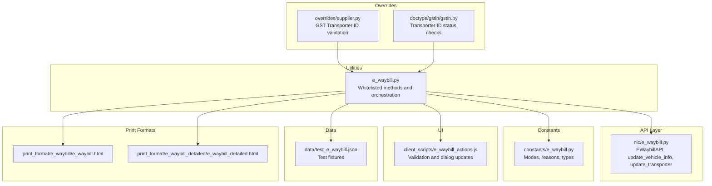
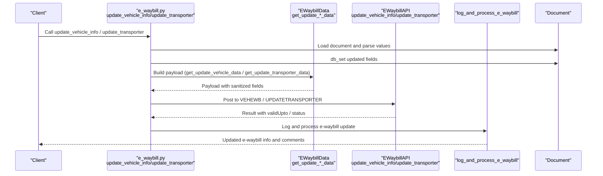
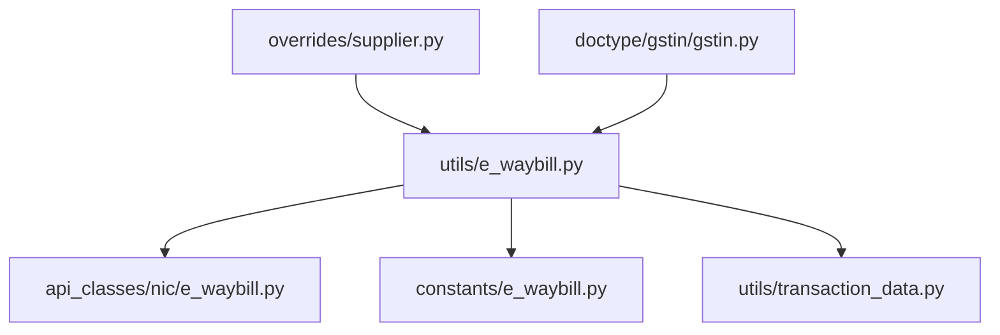

# Vehicle and Transporter Management

<cite>
**Referenced Files in This Document**
- [e_waybill.py](file://india_compliance/gst_india/utils/e_waybill.py)
- [e_waybill.py](file://india_compliance/gst_india/api_classes/nic/e_waybill.py)
- [e_waybill.py](file://india_compliance/gst_india/constants/e_waybill.py)
- [e_waybill_actions.js](file://india_compliance/gst_india/client_scripts/e_waybill_actions.js)
- [gstin.py](file://india_compliance/gst_india/doctype/gstin/gstin.py)
- [supplier.py](file://india_compliance/gst_india/overrides/supplier.py)
- [e_waybill.html](file://india_compliance/gst_india/print_format/e_waybill/e_waybill.html)
- [e_waybill_detailed.html](file://india_compliance/gst_india/print_format/e_waybill_detailed/e_waybill_detailed.html)
- [test_e_waybill.json](file://india_compliance/gst_india/data/test_e_waybill.json)
- [test_e_waybill.py](file://india_compliance/gst_india/utils/test_e_waybill.py)
</cite>

## Table of Contents
1. [Introduction](#introduction)
2. [Project Structure](#project-structure)
3. [Core Components](#core-components)
4. [Architecture Overview](#architecture-overview)
5. [Detailed Component Analysis](#detailed-component-analysis)
6. [Dependency Analysis](#dependency-analysis)
7. [Performance Considerations](#performance-considerations)
8. [Troubleshooting Guide](#troubleshooting-guide)
9. [Conclusion](#conclusion)
10. [Appendices](#appendices)

## Introduction
This document explains vehicle and transporter management within the e-waybill system. It focuses on two core capabilities:
- Updating vehicle details (registration number, transport documents, and transit information) via update_vehicle_info
- Changing transporter details and GST transporter ID via update_transporter

It also covers validation rules for vehicle numbers, transporter ID verification, mode of transport requirements, bulk updates, and integration with logistics workflows. Practical examples and troubleshooting guidance are included to support real-world usage.

## Project Structure
The e-waybill module is organized around:
- Utilities for e-waybill operations (generation, updates, extensions, fetching)
- API clients for NIC and enriched endpoints
- Constants and enums for modes, reasons, and validations
- Client scripts for UI-driven validations and actions
- Print formats for e-waybill display
- Tests and fixtures for validation scenarios

**Diagram sources**
- [e_waybill.py](file://india_compliance/gst_india/utils/e_waybill.py#L437-L624)
- [e_waybill.py](file://india_compliance/gst_india/api_classes/nic/e_waybill.py#L111-L116)
- [e_waybill.py](file://india_compliance/gst_india/constants/e_waybill.py#L86-L96)
- [e_waybill_actions.js](file://india_compliance/gst_india/client_scripts/e_waybill_actions.js#L1308-L1360)
- [test_e_waybill.json](file://india_compliance/gst_india/data/test_e_waybill.json#L142-L194)
- [e_waybill.html](file://india_compliance/gst_india/print_format/e_waybill/e_waybill.html#L196-L231)
- [e_waybill_detailed.html](file://india_compliance/gst_india/print_format/e_waybill_detailed/e_waybill_detailed.html#L271-L305)
- [supplier.py](file://india_compliance/gst_india/overrides/supplier.py#L14-L36)
- [gstin.py](file://india_compliance/gst_india/doctype/gstin/gstin.py#L277-L321)

**Section sources**
- [e_waybill.py](file://india_compliance/gst_india/utils/e_waybill.py#L437-L624)
- [e_waybill.py](file://india_compliance/gst_india/api_classes/nic/e_waybill.py#L111-L116)
- [e_waybill.py](file://india_compliance/gst_india/constants/e_waybill.py#L86-L96)
- [e_waybill_actions.js](file://india_compliance/gst_india/client_scripts/e_waybill_actions.js#L1308-L1360)
- [test_e_waybill.json](file://india_compliance/gst_india/data/test_e_waybill.json#L142-L194)
- [e_waybill.html](file://india_compliance/gst_india/print_format/e_waybill/e_waybill.html#L196-L231)
- [e_waybill_detailed.html](file://india_compliance/gst_india/print_format/e_waybill_detailed/e_waybill_detailed.html#L271-L305)
- [supplier.py](file://india_compliance/gst_india/overrides/supplier.py#L14-L36)
- [gstin.py](file://india_compliance/gst_india/doctype/gstin/gstin.py#L277-L321)

## Core Components
- update_vehicle_info: Updates vehicle registration number, LR details, place/state of change, and mode of transport; triggers API update and logs changes.
- update_transporter: Changes transporter and GST transporter ID; validates e-waybill validity and updates logs.
- EWaybillData: Builds request payloads for vehicle and transporter updates, enforces validations (mode of transport, validity window).
- EWaybillAPI: Calls NIC endpoints for vehicle info update and transporter update.
- Validation utilities: Mode of transport requirement, distance constraints, transporter ID status checks.

Key responsibilities:
- Validate applicability and settings before updates
- Sanitize and map fields to API payload
- Enforce e-waybill validity windows and reason codes
- Log changes and update e-waybill logs

**Section sources**
- [e_waybill.py](file://india_compliance/gst_india/utils/e_waybill.py#L437-L508)
- [e_waybill.py](file://india_compliance/gst_india/utils/e_waybill.py#L570-L624)
- [e_waybill.py](file://india_compliance/gst_india/utils/e_waybill.py#L1321-L1349)
- [e_waybill.py](file://india_compliance/gst_india/api_classes/nic/e_waybill.py#L111-L116)

## Architecture Overview
End-to-end flow for updating vehicle and transporter details:

**Diagram sources**
- [e_waybill.py](file://india_compliance/gst_india/utils/e_waybill.py#L437-L508)
- [e_waybill.py](file://india_compliance/gst_india/utils/e_waybill.py#L570-L624)
- [e_waybill.py](file://india_compliance/gst_india/utils/e_waybill.py#L1321-L1349)
- [e_waybill.py](file://india_compliance/gst_india/api_classes/nic/e_waybill.py#L111-L116)

## Detailed Component Analysis

### update_vehicle_info
Purpose:
- Modify vehicle-related details on an existing e-waybill: vehicle number, LR number/date, mode of transport, GST vehicle type, place/state of change, and reason/remark.
- Persist changes to the document and call the vehicle update API.

Processing logic:
- Loads the document and parses JSON values.
- Writes updated fields to the document (normalizes vehicle number spacing).
- Builds payload using EWaybillData.get_update_vehicle_data, which:
  - Validates e-waybill presence and validity window
  - Validates mode of transport
  - Sets transporter details
  - Sanitizes and maps fields (place, state, reason code, LR doc/date, trans mode, vehicle type)
- Calls EWaybillAPI.update_vehicle_info and updates validity window.
- Logs changes with a change log comment and refreshes e-waybill log.

Validation rules enforced:
- E-waybill must exist and not be expired
- Mode of transport must be set and valid
- Place of change and state mapped to numeric codes
- Reason code mapped from predefined reasons
- LR date handled conditionally when LR number is present

Common errors:
- “No e-Waybill found” if no e-waybill is linked
- “e-Waybill cannot be modified after its validity is over”
- “Mode of Transport is required” if missing
- “Vehicle Number is required” for Road mode

Practical example:
- Update vehicle number from GJ07DL9009 to GJ07DL9001, set LR date to today, reason “Others”, and remark “Vehicle Info added”.

Integration with logistics:
- Updates Part B fields on e-waybill print format and maintains multi-vehicle history.

**Section sources**
- [e_waybill.py](file://india_compliance/gst_india/utils/e_waybill.py#L437-L508)
- [e_waybill.py](file://india_compliance/gst_india/utils/e_waybill.py#L1321-L1340)
- [e_waybill.py](file://india_compliance/gst_india/api_classes/nic/e_waybill.py#L111-L113)
- [e_waybill.html](file://india_compliance/gst_india/print_format/e_waybill/e_waybill.html#L207-L231)
- [e_waybill_detailed.html](file://india_compliance/gst_india/print_format/e_waybill_detailed/e_waybill_detailed.html#L271-L305)
- [test_e_waybill.json](file://india_compliance/gst_india/data/test_e_waybill.json#L162-L194)
- [test_e_waybill.py](file://india_compliance/gst_india/utils/test_e_waybill.py#L104-L165)

### update_transporter
Purpose:
- Change the transporter and GST transporter ID associated with an e-waybill.
- Validates e-waybill validity and updates logs.

Processing logic:
- Loads document and parses values.
- Builds payload using EWaybillData.get_update_transporter_data, which:
  - Validates e-waybill presence and validity window
- Calls EWaybillAPI.update_transporter.
- Persists transporter and GST transporter ID to the document.
- Logs the change with a comment indicating old/new transporter IDs.

Validation rules enforced:
- E-waybill must exist and be within validity window
- GST transporter ID must be valid (via GSTIN status checks)

Practical example:
- Change transporter ID from empty to 05AAACG2140A1ZL on an existing e-waybill.

Integration with logistics:
- Updates Part A fields on e-waybill print format.

**Section sources**
- [e_waybill.py](file://india_compliance/gst_india/utils/e_waybill.py#L570-L624)
- [e_waybill.py](file://india_compliance/gst_india/utils/e_waybill.py#L1342-L1349)
- [e_waybill.py](file://india_compliance/gst_india/api_classes/nic/e_waybill.py#L115-L116)
- [e_waybill.html](file://india_compliance/gst_india/print_format/e_waybill/e_waybill.html#L196-L204)
- [test_e_waybill.json](file://india_compliance/gst_india/data/test_e_waybill.json#L142-L161)
- [test_e_waybill.py](file://india_compliance/gst_india/utils/test_e_waybill.py#L167-L210)

### Validation Rules and Compliance
- Mode of transport requirements:
  - Road requires vehicle number
  - Air/Rail require LR number
  - Ship requires both LR number and vehicle number
- Duplicate vehicle number detection:
  - The system does not enforce duplicate vehicle number checks at the application level; however, API-level constraints may apply. If duplicates occur, consult API responses and logs.
- Transporter ID verification:
  - Validates GST transporter ID via GSTIN status and Transporter ID API; marks as invalid if status is not Active.
- Compliance requirements:
  - Validity window enforcement prevents modifications after expiry
  - Reason codes and remarks are required for vehicle updates
  - LR number/date are conditionally required based on mode of transport

**Section sources**
- [e_waybill_actions.js](file://india_compliance/gst_india/client_scripts/e_waybill_actions.js#L1354-L1360)
- [e_waybill.py](file://india_compliance/gst_india/utils/e_waybill.py#L1496-L1506)
- [gstin.py](file://india_compliance/gst_india/doctype/gstin/gstin.py#L277-L321)
- [supplier.py](file://india_compliance/gst_india/overrides/supplier.py#L14-L36)

### Bulk Update Functionality
While the repository includes a bulk update method for transporter details across multiple documents, it is designed to update records where no e-waybill has been generated yet. It does not process documents that already have an e-waybill.

Highlights:
- Filters documents by docstatus and absence of e-waybill
- Updates transporter, transporter name, GST transporter ID, and transport details
- Provides user feedback for documents that cannot be updated due to e-waybill presence

Note: There is no dedicated bulk vehicle update method in the repository. Use update_vehicle_info for individual documents.

**Section sources**
- [e_waybill.py](file://india_compliance/gst_india/utils/e_waybill.py#L92-L102)
- [e_waybill.py](file://india_compliance/gst_india/utils/e_waybill.py#L510-L567)

## Dependency Analysis
Key dependencies and relationships:
- e_waybill.py orchestrates updates and logging
- EWaybillData depends on constants for modes, reasons, and types
- EWaybillAPI encapsulates NIC endpoints for vehicle and transporter updates
- Overrides and GSTIN doctype validate transporter ID status
- Client scripts enforce UI-level validations for transport details

**Diagram sources**
- [e_waybill.py](file://india_compliance/gst_india/utils/e_waybill.py#L1268-L1349)
- [e_waybill.py](file://india_compliance/gst_india/constants/e_waybill.py#L86-L96)
- [e_waybill.py](file://india_compliance/gst_india/api_classes/nic/e_waybill.py#L111-L116)
- [supplier.py](file://india_compliance/gst_india/overrides/supplier.py#L14-L36)
- [gstin.py](file://india_compliance/gst_india/doctype/gstin/gstin.py#L277-L321)

**Section sources**
- [e_waybill.py](file://india_compliance/gst_india/utils/e_waybill.py#L1268-L1349)
- [e_waybill.py](file://india_compliance/gst_india/constants/e_waybill.py#L86-L96)
- [e_waybill.py](file://india_compliance/gst_india/api_classes/nic/e_waybill.py#L111-L116)
- [supplier.py](file://india_compliance/gst_india/overrides/supplier.py#L14-L36)
- [gstin.py](file://india_compliance/gst_india/doctype/gstin/gstin.py#L277-L321)

## Performance Considerations
- API calls are synchronous; consider batching and async processing for large-scale updates.
- Logging and PDF attachment are handled asynchronously via enqueue in log_and_process_e_waybill.
- Distance and validity updates are lightweight; avoid unnecessary repeated calls.

[No sources needed since this section provides general guidance]

## Troubleshooting Guide
Common validation errors and resolutions:
- “No e-Waybill found”: Ensure an e-waybill exists before attempting updates.
- “e-Waybill cannot be modified after its validity is over”: Perform updates within the validity window or schedule an extension.
- “Mode of Transport is required”: Set mode of transport and provide vehicle/LR details as required.
- “Vehicle Number is required”: Provide a valid vehicle number for Road mode.
- “Transporter details cannot be updated where e-Waybill is already generated”: Use update_transporter only on documents without an e-waybill; otherwise, contact the transporter to update.

Duplicate vehicle number detection:
- If encountering duplicate vehicle number issues, verify uniqueness in your fleet management and review API responses.

Compliance and documentation:
- Ensure LR number/date are provided for non-road modes.
- Use valid reason codes and remarks for vehicle updates.
- Maintain e-waybill logs and comments for audit trails.

**Section sources**
- [e_waybill.py](file://india_compliance/gst_india/utils/e_waybill.py#L1496-L1506)
- [e_waybill.py](file://india_compliance/gst_india/utils/e_waybill.py#L1536-L1545)
- [e_waybill.py](file://india_compliance/gst_india/utils/e_waybill.py#L510-L567)
- [e_waybill_actions.js](file://india_compliance/gst_india/client_scripts/e_waybill_actions.js#L1354-L1360)

## Conclusion
The e-waybill system provides robust mechanisms to update vehicle and transporter details with strict validations and clear audit trails. By leveraging update_vehicle_info and update_transporter, organizations can keep transport documentation accurate and compliant. For multi-document updates, use the bulk transporter update method on eligible documents. Always ensure mode of transport requirements and validity windows are met to avoid errors.

[No sources needed since this section summarizes without analyzing specific files]

## Appendices

### Practical Examples Index
- Vehicle update example: [update_vehicle_info fixture](file://india_compliance/gst_india/data/test_e_waybill.json#L162-L194)
- Transporter update example: [update_transporter fixture](file://india_compliance/gst_india/data/test_e_waybill.json#L142-L161)
- Vehicle update test: [test_update_vehicle_info](file://india_compliance/gst_india/utils/test_e_waybill.py#L104-L165)
- Transporter update test: [test_update_transporter](file://india_compliance/gst_india/utils/test_e_waybill.py#L167-L210)

### Validation Reference
- Modes and types: [constants/e_waybill.py](file://india_compliance/gst_india/constants/e_waybill.py#L86-L96)
- Reason codes: [constants/e_waybill.py](file://india_compliance/gst_india/constants/e_waybill.py#L42-L47)