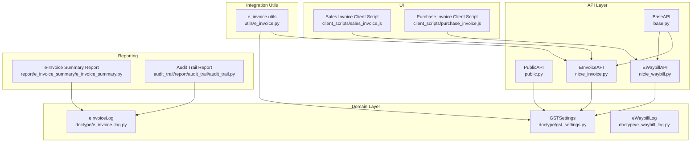
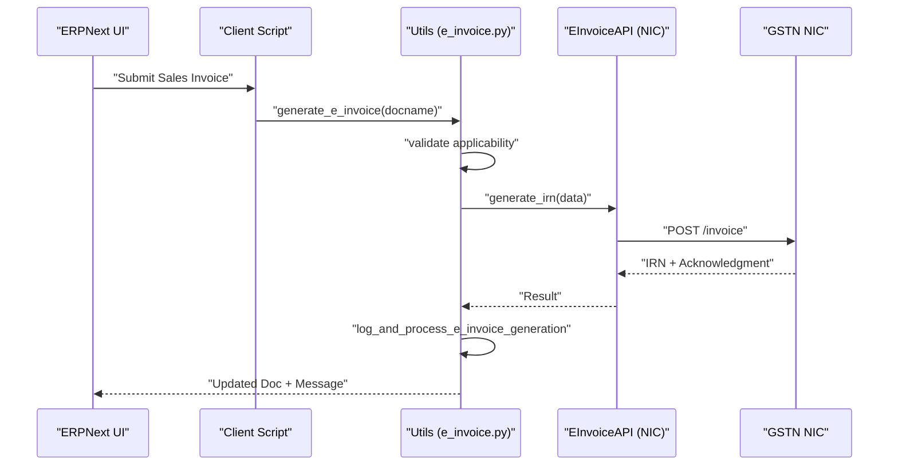
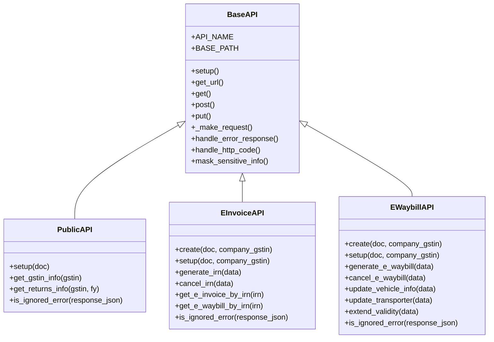
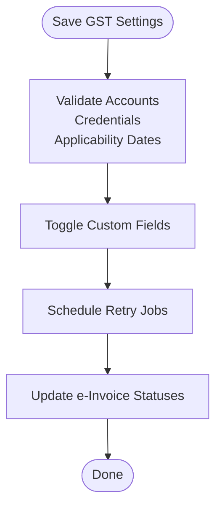
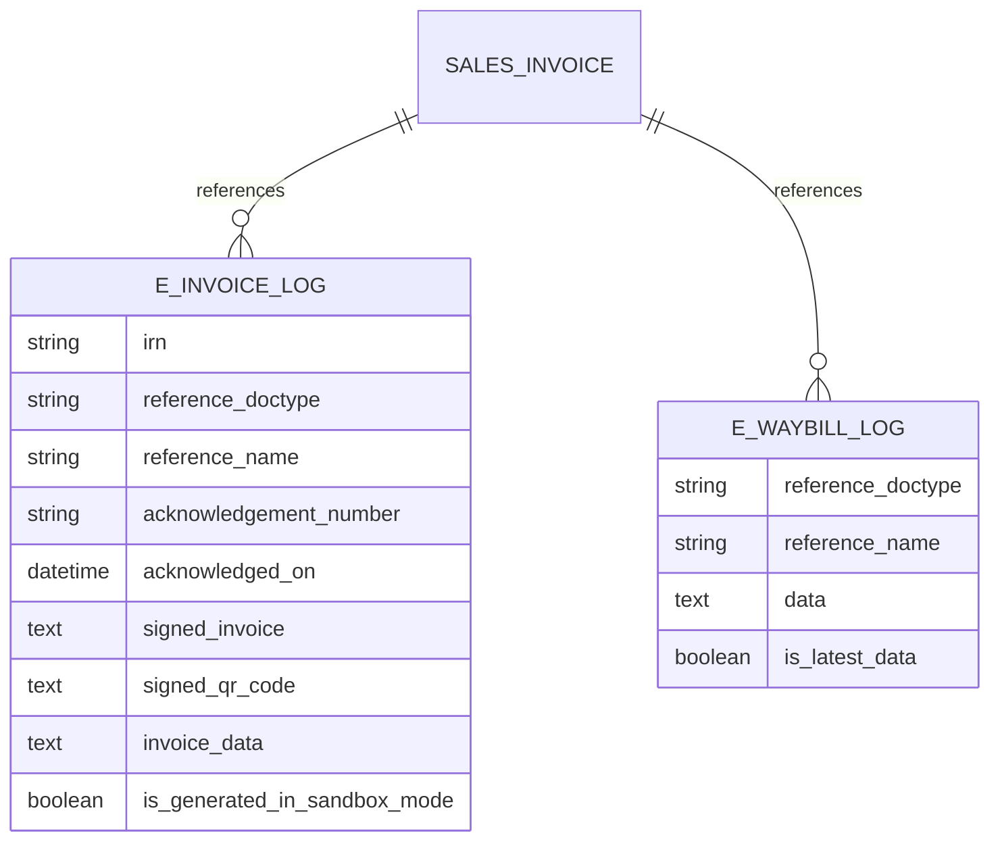
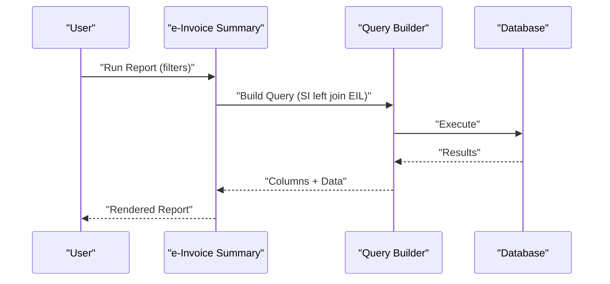
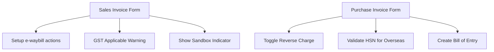
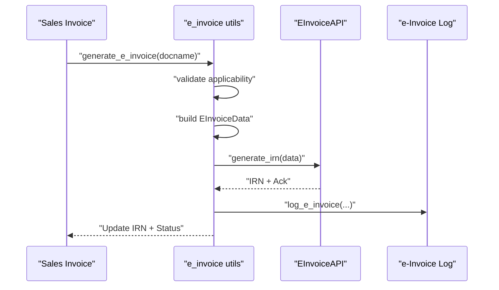
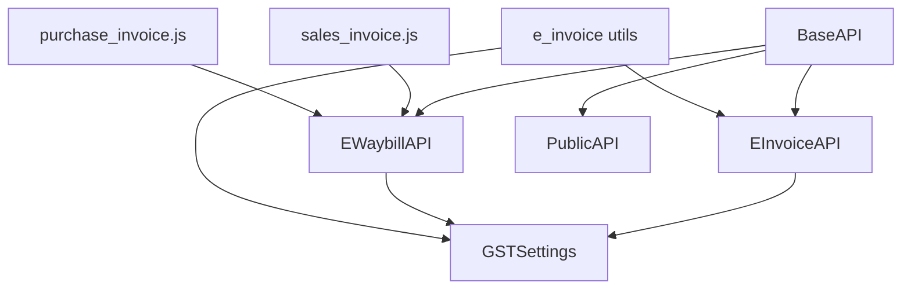

# GST India Module

<cite>
**Referenced Files in This Document**
- [base.py](file://india_compliance/gst_india/api_classes/base.py)
- [public.py](file://india_compliance/gst_india/api_classes/public.py)
- [e_invoice.py](file://india_compliance/gst_india/api_classes/nic/e_invoice.py)
- [e_waybill.py](file://india_compliance/gst_india/api_classes/nic/e_waybill.py)
- [gst_settings.py](file://india_compliance/gst_india/doctype/gst_settings/gst_settings.py)
- [e_invoice_log.py](file://india_compliance/gst_india/doctype/e_invoice_log/e_invoice_log.py)
- [e_waybill_log.py](file://india_compliance/gst_india/doctype/e_waybill_log/e_waybill_log.py)
- [sales_invoice.js](file://india_compliance/gst_india/client_scripts/sales_invoice.js)
- [purchase_invoice.js](file://india_compliance/gst_india/client_scripts/purchase_invoice.js)
- [e_invoice_summary.py](file://india_compliance/gst_india/report/e_invoice_summary/e_invoice_summary.py)
- [e_invoice.py](file://india_compliance/gst_india/utils/e_invoice.py)
- [audit_trail.py](file://india_compliance/audit_trail/report/audit_trail/audit_trail.py)
</cite>

## Table of Contents
1. [Introduction](#introduction)
2. [Project Structure](#project-structure)
3. [Core Components](#core-components)
4. [Architecture Overview](#architecture-overview)
5. [Detailed Component Analysis](#detailed-component-analysis)
6. [Dependency Analysis](#dependency-analysis)
7. [Performance Considerations](#performance-considerations)
8. [Troubleshooting Guide](#troubleshooting-guide)
9. [Conclusion](#conclusion)
10. [Appendices](#appendices)

## Introduction
The GST India module is a core feature of India Compliance that automates Goods and Services Tax (GST) compliance for ERPNext. It integrates with the GST Network (GSTN) via the NIC portal and taxpayer services to streamline:
- e-Invoice generation and lifecycle management
- e-Waybill creation, updates, and cancellation
- Tax calculations aligned with GST rates and categories
- Government return filings (e.g., GSTR-1, GSTR-3B) and reconciliation
- Audit trail and compliance reporting

It provides robust configuration through GST Settings, secure API communication with masking and logging, and client-side UX enhancements for applicable documents.

## Project Structure
The module is organized around:
- API classes for NIC and taxpayer services
- Doctypes for settings, logs, and master data
- Client scripts for form behavior and e-waybill actions
- Reports for e-Invoice summaries and audit trails
- Utilities for data transformation, validations, and integrations

**Diagram sources**
- [base.py](file://india_compliance/gst_india/api_classes/base.py#L23-L413)
- [public.py](file://india_compliance/gst_india/api_classes/public.py#L7-L65)
- [e_invoice.py](file://india_compliance/gst_india/api_classes/nic/e_invoice.py#L12-L271)
- [e_waybill.py](file://india_compliance/gst_india/api_classes/nic/e_waybill.py#L17-L259)
- [gst_settings.py](file://india_compliance/gst_india/doctype/gst_settings/gst_settings.py#L40-L595)
- [e_invoice_log.py](file://india_compliance/gst_india/doctype/e_invoice_log/e_invoice_log.py#L1-L10)
- [e_waybill_log.py](file://india_compliance/gst_india/doctype/e_waybill_log/e_waybill_log.py#L1-L23)
- [e_invoice.py](file://india_compliance/gst_india/utils/e_invoice.py#L1-L1116)
- [sales_invoice.js](file://india_compliance/gst_india/client_scripts/sales_invoice.js#L1-L97)
- [purchase_invoice.js](file://india_compliance/gst_india/client_scripts/purchase_invoice.js#L1-L131)
- [e_invoice_summary.py](file://india_compliance/gst_india/report/e_invoice_summary/e_invoice_summary.py#L1-L172)
- [audit_trail.py](file://india_compliance/audit_trail/report/audit_trail/audit_trail.py)

**Section sources**
- [base.py](file://india_compliance/gst_india/api_classes/base.py#L23-L413)
- [gst_settings.py](file://india_compliance/gst_india/doctype/gst_settings/gst_settings.py#L40-L595)

## Core Components
- Base API framework: Centralized request handling, authentication, error mapping, and integration logging with sensitive data masking.
- NIC e-Invoice and e-Waybill APIs: Factory-style creation of enriched vs. standard implementations, with OTP handling and distance updates.
- GST Settings: Configuration for API enablement, sandbox mode, credentials, e-Invoice applicability dates, and custom field toggles.
- Logs: Dedicated doctypes for e-Invoice and e-Waybill events to track acknowledgments, cancellations, and printed data.
- Client Scripts: UI automation for e-waybill actions, alerts, and warnings on Sales/Purchase Invoices.
- Reports: e-Invoice Summary and Audit Trail reports for compliance visibility.
- Utilities: Transaction data builders, validations, retry mechanisms, and integration helpers.

**Section sources**
- [base.py](file://india_compliance/gst_india/api_classes/base.py#L23-L413)
- [e_invoice.py](file://india_compliance/gst_india/api_classes/nic/e_invoice.py#L12-L271)
- [e_waybill.py](file://india_compliance/gst_india/api_classes/nic/e_waybill.py#L17-L259)
- [gst_settings.py](file://india_compliance/gst_india/doctype/gst_settings/gst_settings.py#L40-L595)
- [e_invoice_log.py](file://india_compliance/gst_india/doctype/e_invoice_log/e_invoice_log.py#L1-L10)
- [e_waybill_log.py](file://india_compliance/gst_india/doctype/e_waybill_log/e_waybill_log.py#L1-L23)
- [sales_invoice.js](file://india_compliance/gst_india/client_scripts/sales_invoice.js#L1-L97)
- [purchase_invoice.js](file://india_compliance/gst_india/client_scripts/purchase_invoice.js#L1-L131)
- [e_invoice_summary.py](file://india_compliance/gst_india/report/e_invoice_summary/e_invoice_summary.py#L1-L172)
- [audit_trail.py](file://india_compliance/audit_trail/report/audit_trail/audit_trail.py)

## Architecture Overview
The module follows a layered architecture:
- API Layer: BaseAPI orchestrates HTTP requests, authentication strategies, and error handling. Subclasses implement NIC and taxpayer-specific flows.
- Domain Layer: GSTSettings centralizes configuration; logs capture lifecycle events.
- Integration Utils: Utilities transform ERPNext documents into GST-compliant payloads and manage retries and OTP flows.
- UI Layer: Client scripts enhance form behavior for e-waybill applicability and warnings.
- Reporting Layer: Reports query logs and transactions for audit and compliance.

**Diagram sources**
- [e_invoice.py](file://india_compliance/gst_india/utils/e_invoice.py#L119-L267)
- [e_invoice.py](file://india_compliance/gst_india/api_classes/nic/e_invoice.py#L102-L116)

## Detailed Component Analysis

### API Layer: BaseAPI and NIC Integrations
- BaseAPI:
  - Centralizes URL construction, default headers, request lifecycle, and response processing.
  - Handles HTTP codes, server errors, and special exceptions mapped to user-friendly messages.
  - Provides sensitive data masking and integration request logging.
  - Enforces scheduler requirement for e-Invoice/e-Waybill features.
- PublicAPI:
  - Implements GST Public API endpoints for GSTIN info and returns tracking.
  - Disables autofill in sandbox mode and masks sensitive fields.
- EInvoiceAPI and EWaybillAPI:
  - Factory-based creation chooses enriched vs. standard implementations depending on sandbox or fallback settings.
  - Implement authentication strategies, error normalization, and distance extraction from alerts.

**Diagram sources**
- [base.py](file://india_compliance/gst_india/api_classes/base.py#L23-L413)
- [public.py](file://india_compliance/gst_india/api_classes/public.py#L7-L65)
- [e_invoice.py](file://india_compliance/gst_india/api_classes/nic/e_invoice.py#L12-L271)
- [e_waybill.py](file://india_compliance/gst_india/api_classes/nic/e_waybill.py#L17-L259)

**Section sources**
- [base.py](file://india_compliance/gst_india/api_classes/base.py#L23-L413)
- [public.py](file://india_compliance/gst_india/api_classes/public.py#L7-L65)
- [e_invoice.py](file://india_compliance/gst_india/api_classes/nic/e_invoice.py#L12-L271)
- [e_waybill.py](file://india_compliance/gst_india/api_classes/nic/e_waybill.py#L17-L259)

### GST Settings and Configuration
- Enables/disables API features, sandbox mode, and e-Invoice/e-Waybill applicability.
- Manages credentials per GSTIN and service, validates account mappings, and toggles custom fields.
- Schedules background jobs for retries and auto-refresh of tokens.
- Restricts modifications after GSTR-1 filing cutoff and updates e-Invoice statuses.

**Diagram sources**
- [gst_settings.py](file://india_compliance/gst_india/doctype/gst_settings/gst_settings.py#L48-L123)

**Section sources**
- [gst_settings.py](file://india_compliance/gst_india/doctype/gst_settings/gst_settings.py#L40-L595)

### Logs and Audit Trail
- e-Invoice Log: Stores acknowledgment numbers, timestamps, signed invoice, QR code, and sandbox mode flag.
- e-Waybill Log: Supports printing and refreshing latest e-Waybill data.
- Audit Trail Report: Provides visibility into compliance-related changes and actions.

**Diagram sources**
- [e_invoice_log.py](file://india_compliance/gst_india/doctype/e_invoice_log/e_invoice_log.py#L1-L10)
- [e_waybill_log.py](file://india_compliance/gst_india/doctype/e_waybill_log/e_waybill_log.py#L1-L23)

**Section sources**
- [e_invoice_log.py](file://india_compliance/gst_india/doctype/e_invoice_log/e_invoice_log.py#L1-L10)
- [e_waybill_log.py](file://india_compliance/gst_india/doctype/e_waybill_log/e_waybill_log.py#L1-L23)
- [audit_trail.py](file://india_compliance/audit_trail/report/audit_trail/audit_trail.py)

### Reports
- e-Invoice Summary: Filters by date range, company, status, and customer; joins Sales Invoice with e-Invoice Log.
- Audit Trail: Tracks changes and actions for compliance oversight.

**Diagram sources**
- [e_invoice_summary.py](file://india_compliance/gst_india/report/e_invoice_summary/e_invoice_summary.py#L10-L172)

**Section sources**
- [e_invoice_summary.py](file://india_compliance/gst_india/report/e_invoice_summary/e_invoice_summary.py#L1-L172)

### Client Scripts and Overrides
- Sales Invoice client script:
  - Sets transporters/drivers, shows e-waybill status options, warns when GST applies but no tax accounts are charged, and displays sandbox indicator.
- Purchase Invoice client script:
  - Toggles reverse charge based on GST category and goods presence, enforces HSN code for overseas purchases, and supports Bill of Entry mapping.

**Diagram sources**
- [sales_invoice.js](file://india_compliance/gst_india/client_scripts/sales_invoice.js#L1-L97)
- [purchase_invoice.js](file://india_compliance/gst_india/client_scripts/purchase_invoice.js#L1-L131)

**Section sources**
- [sales_invoice.js](file://india_compliance/gst_india/client_scripts/sales_invoice.js#L1-L97)
- [purchase_invoice.js](file://india_compliance/gst_india/client_scripts/purchase_invoice.js#L1-L131)

### e-Invoice Generation Workflow
- Validation: Checks applicability, item tax treatments, and posting date limits.
- Data Preparation: Builds invoice payload from ERPNext document using transaction data builder.
- API Call: Generates IRN via EInvoiceAPI; handles duplicates, invalid GSTIN, and OTP flows.
- Logging: Persists acknowledgment, signed invoice, and QR code; optionally auto-generates e-waybill.

**Diagram sources**
- [e_invoice.py](file://india_compliance/gst_india/utils/e_invoice.py#L119-L267)
- [e_invoice.py](file://india_compliance/gst_india/api_classes/nic/e_invoice.py#L102-L116)

**Section sources**
- [e_invoice.py](file://india_compliance/gst_india/utils/e_invoice.py#L119-L267)

## Dependency Analysis
- Coupling:
  - BaseAPI is a shared dependency across all NIC APIs, ensuring consistent error handling and logging.
  - EInvoiceAPI/EWaybillAPI depend on GST Settings for credentials and sandbox mode.
- Cohesion:
  - API classes encapsulate network concerns; utilities encapsulate domain logic; client scripts encapsulate UI behavior.
- External Dependencies:
  - GSTN NIC endpoints, JWT decoding for signed invoice verification, and scheduler for background tasks.

**Diagram sources**
- [base.py](file://india_compliance/gst_india/api_classes/base.py#L23-L413)
- [e_invoice.py](file://india_compliance/gst_india/api_classes/nic/e_invoice.py#L12-L271)
- [e_waybill.py](file://india_compliance/gst_india/api_classes/nic/e_waybill.py#L17-L259)
- [gst_settings.py](file://india_compliance/gst_india/doctype/gst_settings/gst_settings.py#L40-L595)
- [e_invoice.py](file://india_compliance/gst_india/utils/e_invoice.py#L1-L1116)
- [sales_invoice.js](file://india_compliance/gst_india/client_scripts/sales_invoice.js#L1-L97)
- [purchase_invoice.js](file://india_compliance/gst_india/client_scripts/purchase_invoice.js#L1-L131)

**Section sources**
- [base.py](file://india_compliance/gst_india/api_classes/base.py#L23-L413)
- [e_invoice.py](file://india_compliance/gst_india/api_classes/nic/e_invoice.py#L12-L271)
- [e_waybill.py](file://india_compliance/gst_india/api_classes/nic/e_waybill.py#L17-L259)
- [gst_settings.py](file://india_compliance/gst_india/doctype/gst_settings/gst_settings.py#L40-L595)
- [e_invoice.py](file://india_compliance/gst_india/utils/e_invoice.py#L1-L1116)

## Performance Considerations
- Scheduler Requirement: e-Invoice/e-Waybill features require the Frappe scheduler to be enabled; otherwise, operations are blocked.
- Batch Operations: Bulk e-Invoice generation uses queues with timeouts proportional to the number of documents.
- Logging Overhead: Integration logs are enqueued and masked to protect sensitive data.
- Retry Mechanisms: Scheduled jobs retry pending e-Invoice/e-Waybill generations to reduce manual intervention.

[No sources needed since this section provides general guidance]

## Troubleshooting Guide
Common issues and resolutions:
- API Credits Exhausted: 429 responses indicate insufficient credits; top up or switch to sandbox for testing.
- Invalid API Key: 403 responses require valid API credentials; verify keys in GST Settings.
- Gateway Timeout: 504 indicates upstream timeout; retry later or adjust thresholds.
- GSP Server Errors: Mapped exceptions guide corrective actions; check connectivity and credentials.
- Sandbox Mode Limitations: Certain autofill features are disabled in sandbox; use sandbox credentials for testing.
- Scheduler Disabled: Enable scheduler for e-Invoice/e-Waybill features; otherwise, operations will fail.
- Duplicate IRN: System compares buyer GSTIN and invoice amount; correct discrepancies or generate a new invoice.
- Restricted Changes After GSTR-1: Modifications are restricted after the GSTR-1 cutoff; adjust posting dates or roles.

**Section sources**
- [base.py](file://india_compliance/gst_india/api_classes/base.py#L282-L312)
- [gst_settings.py](file://india_compliance/gst_india/doctype/gst_settings/gst_settings.py#L558-L595)

## Conclusion
The GST India module provides a comprehensive, production-ready solution for automating GST compliance in ERPNext. It integrates securely with GSTN NIC, offers robust configuration and logging, and delivers powerful reporting and audit capabilities. By leveraging standardized APIs, utilities, and client-side enhancements, it ensures accurate tax calculations, streamlined e-Invoice/e-Waybill workflows, and seamless government return filings.

[No sources needed since this section summarizes without analyzing specific files]

## Appendices

### Configuration Requirements and Sandbox Mode
- Enable API features and configure credentials in GST Settings.
- Set sandbox mode for testing without affecting live data.
- Configure e-Invoice applicability dates and companies.
- Toggle custom fields for e-Invoice/e-Waybill as needed.

**Section sources**
- [gst_settings.py](file://india_compliance/gst_india/doctype/gst_settings/gst_settings.py#L180-L191)
- [gst_settings.py](file://india_compliance/gst_india/doctype/gst_settings/gst_settings.py#L282-L292)

### Relationship with ERPNext Documents
- Overrides modify standard behavior for transactions, ensuring GST applicability, tax accounts, and reverse charge handling.
- Client scripts automate e-waybill actions and enforce validations on Sales/Purchase Invoices.
- Logs maintain audit trails linking ERPNext documents to GST events.

**Section sources**
- [sales_invoice.js](file://india_compliance/gst_india/client_scripts/sales_invoice.js#L1-L97)
- [purchase_invoice.js](file://india_compliance/gst_india/client_scripts/purchase_invoice.js#L1-L131)
- [e_invoice_log.py](file://india_compliance/gst_india/doctype/e_invoice_log/e_invoice_log.py#L1-L10)
- [e_waybill_log.py](file://india_compliance/gst_india/doctype/e_waybill_log/e_waybill_log.py#L1-L23)