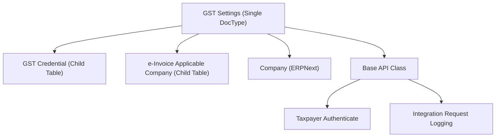
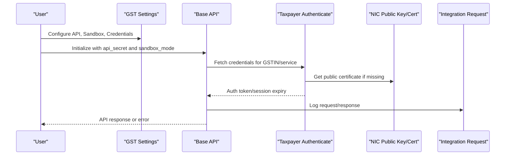
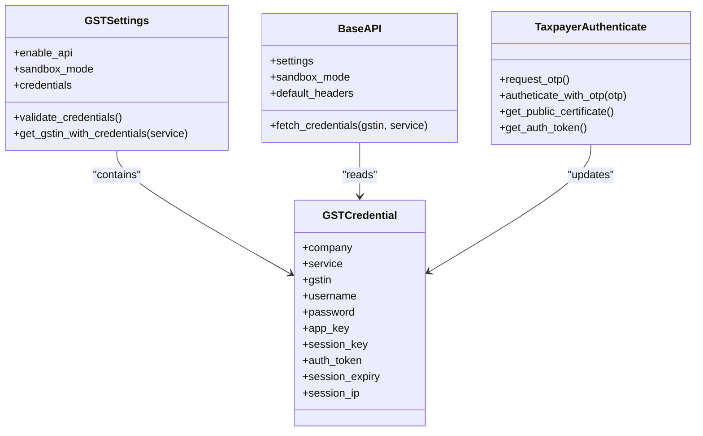
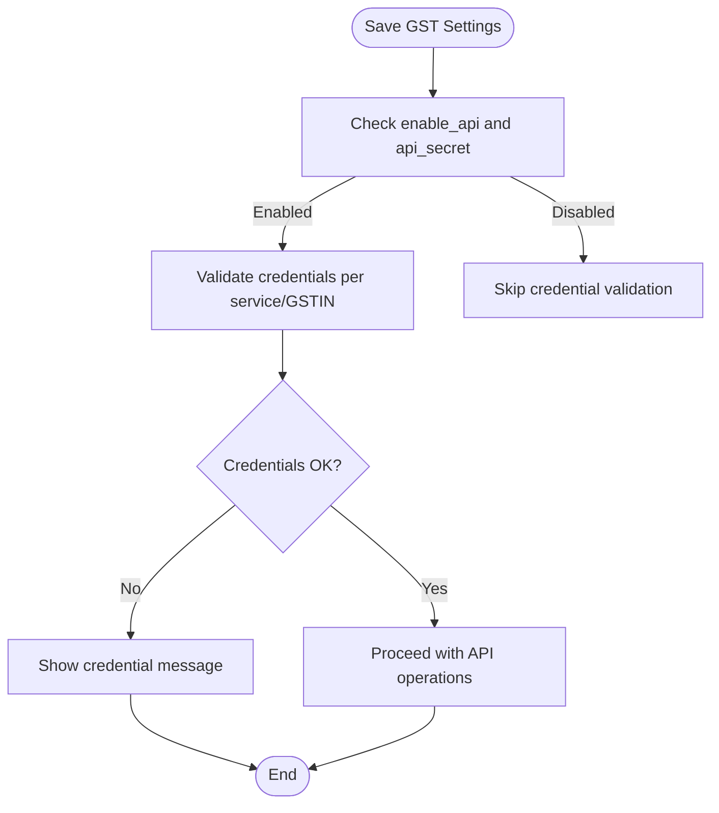
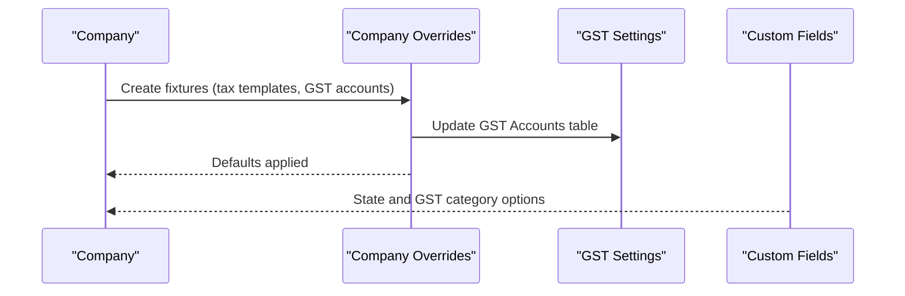
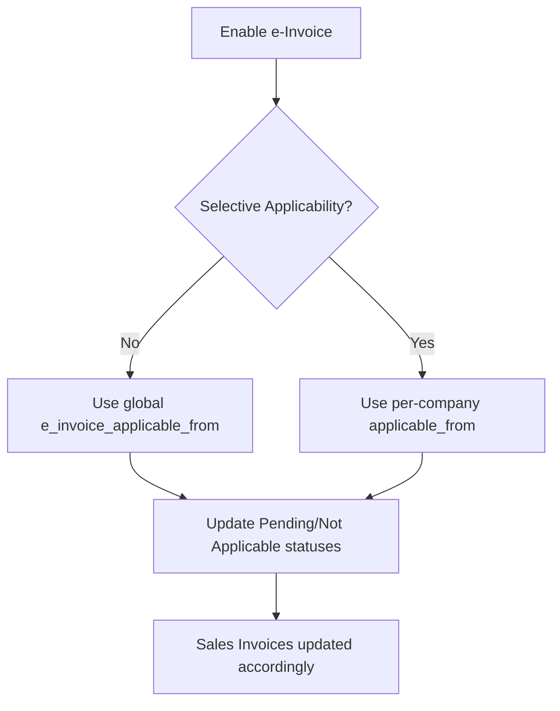
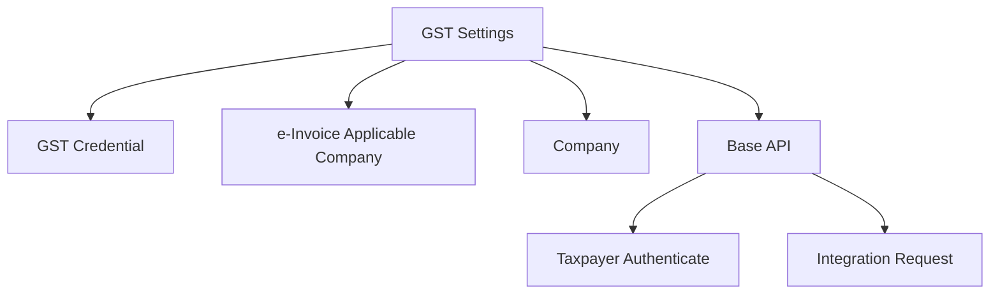

# GST Settings & Configuration

<cite>
**Referenced Files in This Document**
- [gst_settings.py](file://india_compliance/gst_india/doctype/gst_settings/gst_settings.py)
- [gst_settings.json](file://india_compliance/gst_india/doctype/gst_settings/gst_settings.json)
- [test_gst_settings.py](file://india_compliance/gst_india/doctype/gst_settings/test_gst_settings.py)
- [gst_credential.json](file://india_compliance/gst_india/doctype/gst_credential/gst_credential.json)
- [gst_credential.py](file://india_compliance/gst_india/doctype/gst_credential/gst_credential.py)
- [e_invoice_applicable_company.json](file://india_compliance/gst_india/doctype/e_invoice_applicable_company/e_invoice_applicable_company.json)
- [e_invoice_applicable_company.py](file://india_compliance/gst_india/doctype/e_invoice_applicable_company/e_invoice_applicable_company.py)
- [e_invoice.py](file://india_compliance/gst_india/utils/e_invoice.py)
- [base.py](file://india_compliance/gst_india/api_classes/base.py)
- [taxpayer_base.py](file://india_compliance/gst_india/api_classes/taxpayer_base.py)
- [company.py](file://india_compliance/gst_india/overrides/company.py)
- [custom_fields.py](file://india_compliance/gst_india/constants/custom_fields.py)
- [api.py](file://india_compliance/gst_india/utils/api.py)
</cite>

## Table of Contents
1. [Introduction](#introduction)
2. [Project Structure](#project-structure)
3. [Core Components](#core-components)
4. [Architecture Overview](#architecture-overview)
5. [Detailed Component Analysis](#detailed-component-analysis)
6. [Dependency Analysis](#dependency-analysis)
7. [Performance Considerations](#performance-considerations)
8. [Troubleshooting Guide](#troubleshooting-guide)
9. [Conclusion](#conclusion)

## Introduction
This document explains GST Settings and Configuration management in the India Compliance module. It covers the gst_settings doctype structure, configuration parameters, company-specific settings, API credential setup for NIC portal and taxpayer services, sandbox mode configuration, authentication methods, and the relationship between GST settings and company profiles including state-wise configurations and tax rate mappings. Practical examples, validation rules, and troubleshooting procedures for API connectivity are included.

## Project Structure
GST Settings is a single doctype with child tables for credentials and company-specific e-invoice applicability. It integrates with company fixtures, custom fields, and API classes for NIC and taxpayer services.

**Diagram sources**
- [gst_settings.json](file://india_compliance/gst_india/doctype/gst_settings/gst_settings.json#L103-L101)
- [gst_credential.json](file://india_compliance/gst_india/doctype/gst_credential/gst_credential.json#L8-L19)
- [e_invoice_applicable_company.json](file://india_compliance/gst_india/doctype/e_invoice_applicable_company/e_invoice_applicable_company.json#L9-L12)
- [base.py](file://india_compliance/gst_india/api_classes/base.py#L23-L73)
- [taxpayer_base.py](file://india_compliance/gst_india/api_classes/taxpayer_base.py#L110-L142)
- [api.py](file://india_compliance/gst_india/utils/api.py#L4-L46)

**Section sources**
- [gst_settings.json](file://india_compliance/gst_india/doctype/gst_settings/gst_settings.json#L103-L101)

## Core Components
- GST Settings (single doctype): Central configuration for e-waybill/e-invoice, API features, sandbox mode, autofill, GSTIN status validation, purchase reconciliation, and company-specific applicability.
- GST Credential (child table): Stores credentials per GSTIN and service (e-Waybill/e-Invoice, Returns).
- e-Invoice Applicable Company (child table): Defines applicability dates per company when selective applicability is enabled.
- Company fixtures and custom fields: Default tax templates and GST account mappings aligned with company setup.
- API classes: Base API and Taxpayer Authenticate for NIC and taxpayer services, with sandbox mode and fallback support.

Key configuration areas:
- General: HSN validation, rounding, overseas transactions, reverse charge thresholds.
- API: Enable API features, sandbox mode, retry on server errors, autofill party info, GSTIN status refresh.
- e-Waybill: Enable/disable, auto-generate, attach print, thresholds, cancellation reasons.
- e-Invoice: Enable/disable, auto-generate, selective applicability, reporting time limit, cancellation restrictions.
- GSTR-1: Enable API features, restrict changes after filing, role allowed to modify.
- Purchase Reconciliation: Auto reconciliation, inward supply period, days of week, categories.

**Section sources**
- [gst_settings.json](file://india_compliance/gst_india/doctype/gst_settings/gst_settings.json#L103-L707)
- [gst_settings.py](file://india_compliance/gst_india/doctype/gst_settings/gst_settings.py#L48-L122)
- [gst_credential.json](file://india_compliance/gst_india/doctype/gst_credential/gst_credential.json#L8-L92)
- [e_invoice_applicable_company.json](file://india_compliance/gst_india/doctype/e_invoice_applicable_company/e_invoice_applicable_company.json#L9-L29)
- [company.py](file://india_compliance/gst_india/overrides/company.py#L65-L180)
- [custom_fields.py](file://india_compliance/gst_india/constants/custom_fields.py#L19-L48)

## Architecture Overview
The GST Settings configuration orchestrates API interactions via a base API class and specialized authenticators. It validates credentials, manages sessions, and logs integration requests. Company-specific settings are enforced through applicability rules and account mappings.

**Diagram sources**
- [gst_settings.py](file://india_compliance/gst_india/doctype/gst_settings/gst_settings.py#L124-L143)
- [base.py](file://india_compliance/gst_india/api_classes/base.py#L49-L73)
- [taxpayer_base.py](file://india_compliance/gst_india/api_classes/taxpayer_base.py#L110-L142)
- [taxpayer_base.py](file://india_compliance/gst_india/api_classes/taxpayer_base.py#L263-L275)
- [api.py](file://india_compliance/gst_india/utils/api.py#L11-L46)

## Detailed Component Analysis

### GST Settings Doctype Structure
- Tabs and sections:
  - General: HSN validation, rounding, overseas transactions, reverse charge thresholds.
  - API: Enable API, sandbox mode, autofill, GSTIN status refresh, fallback for NIC.
  - e-Waybill: Enable, auto-generate, attach print, thresholds, cancellation reasons.
  - e-Invoice: Enable, auto-generate, selective applicability, reporting time limit, cancellation restrictions.
  - GSTR-1: Enable API, restrict changes after filing, role allowed to modify.
  - Purchase Reconciliation: Auto reconciliation, inward supply period, days and categories.
  - Accounts: GST Accounts table.
  - Credentials: GST Credential table.
- Child tables:
  - GST Accounts: One row per company with CGST/SGST/IGST accounts mapped by type.
  - GST Credential: Credentials per GSTIN and service.
  - e-Invoice Applicable Company: Applicable-from dates per company.

Validation highlights:
- Duplicate accounts and duplicate account types per company are prevented.
- e-Invoice applicability requires a valid date and company list when selective applicability is enabled.
- API enablement requires a configured India Compliance API secret.
- Credentials require passwords for e-Waybill/e-Invoice; Returns service uses app_key.

**Section sources**
- [gst_settings.json](file://india_compliance/gst_india/doctype/gst_settings/gst_settings.json#L103-L707)
- [gst_settings.py](file://india_compliance/gst_india/doctype/gst_settings/gst_settings.py#L144-L342)
- [test_gst_settings.py](file://india_compliance/gst_india/doctype/gst_settings/test_gst_settings.py#L22-L82)

### API Credential Setup for NIC Portal and Taxpayer Services
- GST Credential fields:
  - Company, Service (e-Waybill/e-Invoice, Returns), GSTIN, Username, Password, App Key, Session Key, Auth Token, Session Expiry, Session IP.
- Authentication flow:
  - Base API initializes with api_secret and sandbox_mode.
  - Taxpayer Authenticate handles OTP requests and token refresh, stores session keys and expiry.
  - Public certificate is retrieved and validated; fallback is supported via a toggle.
- Sandbox mode:
  - When enabled, API actions run against sandbox endpoints and a warning is shown once per session.

**Diagram sources**
- [gst_settings.py](file://india_compliance/gst_india/doctype/gst_settings/gst_settings.py#L124-L143)
- [gst_settings.py](file://india_compliance/gst_india/doctype/gst_settings/gst_settings.py#L219-L262)
- [gst_credential.json](file://india_compliance/gst_india/doctype/gst_credential/gst_credential.json#L8-L92)
- [base.py](file://india_compliance/gst_india/api_classes/base.py#L49-L73)
- [taxpayer_base.py](file://india_compliance/gst_india/api_classes/taxpayer_base.py#L110-L142)
- [taxpayer_base.py](file://india_compliance/gst_india/api_classes/taxpayer_base.py#L277-L287)

**Section sources**
- [gst_credential.json](file://india_compliance/gst_india/doctype/gst_credential/gst_credential.json#L8-L92)
- [gst_credential.py](file://india_compliance/gst_india/doctype/gst_credential/gst_credential.py#L8-L9)
- [base.py](file://india_compliance/gst_india/api_classes/base.py#L49-L73)
- [taxpayer_base.py](file://india_compliance/gst_india/api_classes/taxpayer_base.py#L110-L142)
- [taxpayer_base.py](file://india_compliance/gst_india/api_classes/taxpayer_base.py#L277-L287)

### Sandbox Mode Configuration and Authentication Methods
- Sandbox mode:
  - Toggle to run API actions in sandbox without affecting production data.
  - Impacts autofill behavior (not supported in sandbox).
- Authentication:
  - Uses app_key for Returns service; generates a 32-character hash if missing.
  - e-Waybill/e-Invoice requires password per credential row.
  - Session expiry and IP tracking stored in credentials; token reset handled via job context.

**Diagram sources**
- [gst_settings.py](file://india_compliance/gst_india/doctype/gst_settings/gst_settings.py#L268-L291)
- [gst_settings.py](file://india_compliance/gst_india/doctype/gst_settings/gst_settings.py#L219-L262)

**Section sources**
- [gst_settings.py](file://india_compliance/gst_india/doctype/gst_settings/gst_settings.py#L268-L291)
- [gst_settings.py](file://india_compliance/gst_india/doctype/gst_settings/gst_settings.py#L264-L267)

### Relationship Between GST Settings and Company Profiles
- Company fixtures:
  - Default tax templates and GST accounts are created per company during setup or via a utility.
  - GST account mappings (CGST/SGST/IGST) are added to GST Settings for each company.
- State-wise configurations and tax rate mappings:
  - Custom fields define state options and GST categories used across parties and documents.
  - Place of supply options and GST categories influence e-waybill/e-invoice applicability and tax calculations.

**Diagram sources**
- [company.py](file://india_compliance/gst_india/overrides/company.py#L65-L180)
- [custom_fields.py](file://india_compliance/gst_india/constants/custom_fields.py#L11-L16)

**Section sources**
- [company.py](file://india_compliance/gst_india/overrides/company.py#L65-L180)
- [custom_fields.py](file://india_compliance/gst_india/constants/custom_fields.py#L11-L16)

### e-Invoice Applicability and Company-Specific Compliance
- Global vs selective applicability:
  - Global: Single applicable-from date for all companies.
  - Selective: Per-company applicable-from dates via child table.
- Status updates:
  - Background job updates Pending/Not Applicable statuses based on applicability and posting date.
- Validation:
  - Tests enforce mandatory dates and minimum applicability date constraints.

**Diagram sources**
- [gst_settings.py](file://india_compliance/gst_india/doctype/gst_settings/gst_settings.py#L462-L555)
- [gst_settings.py](file://india_compliance/gst_india/doctype/gst_settings/gst_settings.py#L489-L504)
- [test_gst_settings.py](file://india_compliance/gst_india/doctype/gst_settings/test_gst_settings.py#L62-L82)

**Section sources**
- [gst_settings.py](file://india_compliance/gst_india/doctype/gst_settings/gst_settings.py#L462-L555)
- [gst_settings.py](file://india_compliance/gst_india/doctype/gst_settings/gst_settings.py#L489-L504)
- [e_invoice_applicable_company.json](file://india_compliance/gst_india/doctype/e_invoice_applicable_company/e_invoice_applicable_company.json#L9-L29)
- [test_gst_settings.py](file://india_compliance/gst_india/doctype/gst_settings/test_gst_settings.py#L152-L215)

### Practical Examples

- Setting up credentials for NIC portal and taxpayer services:
  - Add a row under GST Settings > Credentials with:
    - Company: Target company
    - Service: e-Waybill / e-Invoice or Returns
    - GSTIN: Valid GSTIN
    - Username: Valid username
    - Password: Required for e-Waybill/e-Invoice
    - App Key: Auto-generated if blank (32 characters) for Returns
  - Save; the system validates presence of password for e-Waybill/e-Invoice credentials and prompts if missing.

- Configuring e-invoice applicability:
  - To apply globally: enable e-Invoice and set e-Invoice Applicable From.
  - To apply selectively: enable Apply e-Invoice for Selected Companies, then add rows in e-Invoice Applicable Companies with applicable_from dates.

- Managing company-specific compliance requirements:
  - Use Company > Make Default Tax Templates to align tax templates with company defaults.
  - Ensure GST Accounts are populated in GST Settings for each company to reflect CGST/SGST/IGST mappings.

- Using sandbox mode:
  - Enable Use API in Sandbox Mode to test API flows without affecting production data.
  - Note: Autofill Party Information based on GSTIN is not supported in sandbox mode.

- Enabling retry on server errors:
  - Enable Enable Retry e-Invoice/e-Waybill Generation to automatically retry on GSP/GST server errors.

**Section sources**
- [gst_settings.json](file://india_compliance/gst_india/doctype/gst_settings/gst_settings.json#L198-L200)
- [gst_settings.json](file://india_compliance/gst_india/doctype/gst_settings/gst_settings.json#L327-L329)
- [gst_settings.json](file://india_compliance/gst_india/doctype/gst_settings/gst_settings.json#L575-L578)
- [gst_settings.py](file://india_compliance/gst_india/doctype/gst_settings/gst_settings.py#L219-L262)
- [company.py](file://india_compliance/gst_india/overrides/company.py#L65-L180)

## Dependency Analysis
- Internal dependencies:
  - GST Settings depends on GST Credential child table for credentials and on e-Invoice Applicable Company for selective applicability.
  - Company fixtures integrate with GST Settings to populate default accounts.
- External dependencies:
  - Base API class depends on api_secret and sandbox_mode.
  - Taxpayer Authenticate depends on public certificates and OTP handling.
  - Integration Request logging captures API calls for audit and debugging.

**Diagram sources**
- [gst_settings.json](file://india_compliance/gst_india/doctype/gst_settings/gst_settings.json#L103-L101)
- [gst_credential.json](file://india_compliance/gst_india/doctype/gst_credential/gst_credential.json#L8-L19)
- [e_invoice_applicable_company.json](file://india_compliance/gst_india/doctype/e_invoice_applicable_company/e_invoice_applicable_company.json#L9-L12)
- [base.py](file://india_compliance/gst_india/api_classes/base.py#L49-L73)
- [taxpayer_base.py](file://india_compliance/gst_india/api_classes/taxpayer_base.py#L110-L142)
- [api.py](file://india_compliance/gst_india/utils/api.py#L11-L46)

**Section sources**
- [gst_settings.py](file://india_compliance/gst_india/doctype/gst_settings/gst_settings.py#L124-L143)
- [base.py](file://india_compliance/gst_india/api_classes/base.py#L49-L73)
- [taxpayer_base.py](file://india_compliance/gst_india/api_classes/taxpayer_base.py#L110-L142)
- [api.py](file://india_compliance/gst_india/utils/api.py#L11-L46)

## Performance Considerations
- Background jobs:
  - e-Invoice status update runs as a long job to avoid blocking UI.
  - Retry job for e-Invoice/e-Waybill generation can be toggled on/off.
- API usage:
  - GSTIN status refresh interval defaults to 15 days when enabled and validated.
  - Autofill party info can archive recent data to minimize API calls.
- Scheduling:
  - Scheduled Job Type entries are stopped or started based on settings toggles.

[No sources needed since this section provides general guidance]

## Troubleshooting Guide
Common configuration issues and resolutions:
- Missing API secret:
  - Enabling API features requires a configured India Compliance API secret; otherwise, saving GST Settings will fail validation.
- Missing credentials:
  - For e-Waybill/e-Invoice, password is mandatory per credential row; for Returns, app_key is required and auto-generated if missing.
- Sandbox mode limitations:
  - Autofill Party Information based on GSTIN is not supported in sandbox mode.
- GSTIN status validation:
  - If GSTIN status refresh interval is below 15 days, it is automatically adjusted upward.
- API connectivity:
  - Integration Requests are logged for all API calls; review logs for error details.
  - Use fallback for NIC if certificate-related errors occur.

Validation rules and tests:
- Duplicate accounts and duplicate account types per company are prevented.
- e-Invoice applicability requires a valid date and company list when selective applicability is enabled.
- Tests cover mandatory applicability dates, company duplication, and minimum applicability date constraints.

**Section sources**
- [gst_settings.py](file://india_compliance/gst_india/doctype/gst_settings/gst_settings.py#L268-L291)
- [gst_settings.py](file://india_compliance/gst_india/doctype/gst_settings/gst_settings.py#L219-L262)
- [gst_settings.py](file://india_compliance/gst_india/doctype/gst_settings/gst_settings.py#L329-L342)
- [test_gst_settings.py](file://india_compliance/gst_india/doctype/gst_settings/test_gst_settings.py#L139-L150)
- [test_gst_settings.py](file://india_compliance/gst_india/doctype/gst_settings/test_gst_settings.py#L152-L215)
- [api.py](file://india_compliance/gst_india/utils/api.py#L11-L46)

## Conclusion
GST Settings centralizes configuration for e-waybill/e-invoice, API features, sandbox mode, and company-specific compliance. Proper credential setup, applicability rules, and validation ensure reliable API connectivity and accurate tax reporting. Use the provided examples and troubleshooting steps to configure and maintain GST Settings effectively.