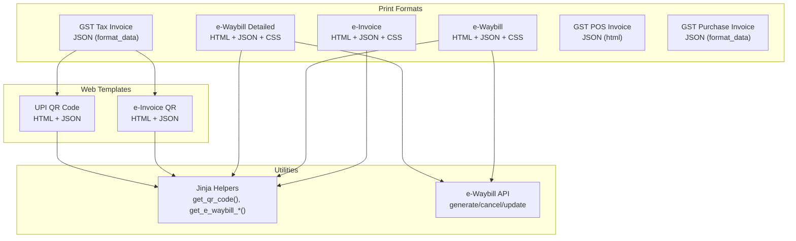
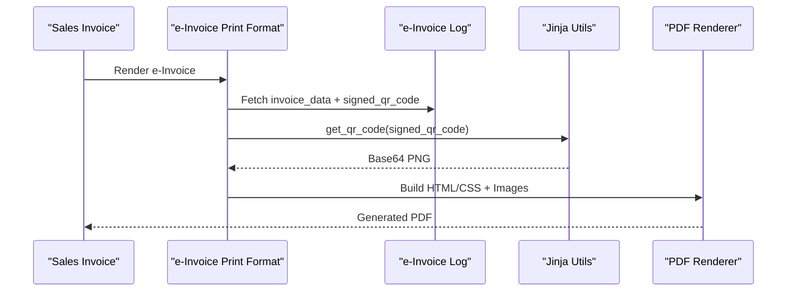
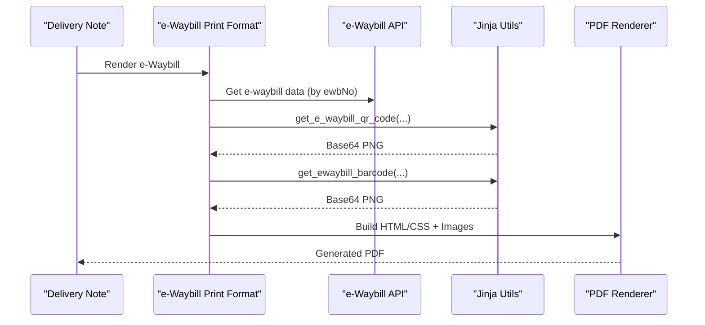
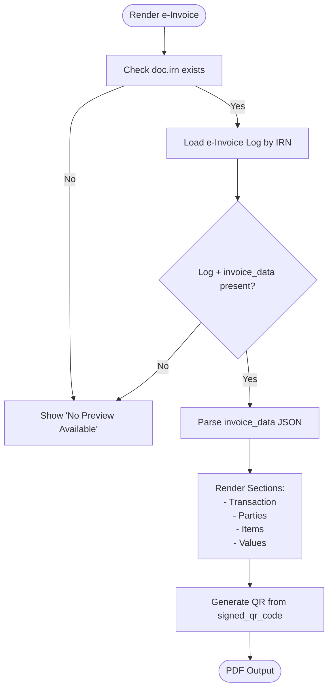
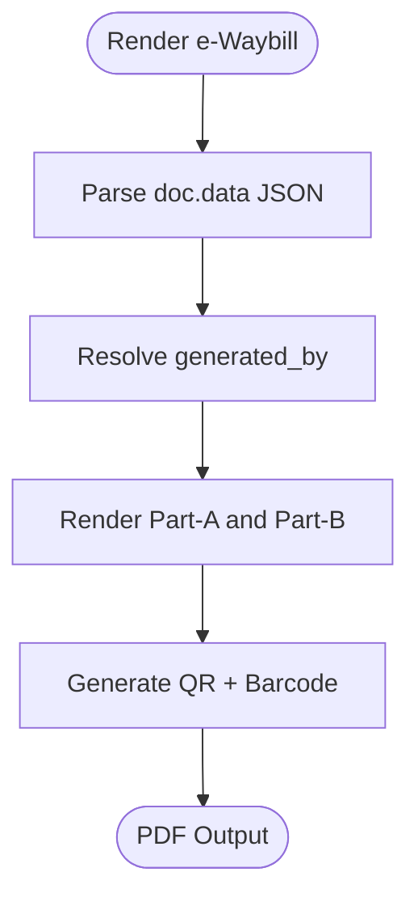
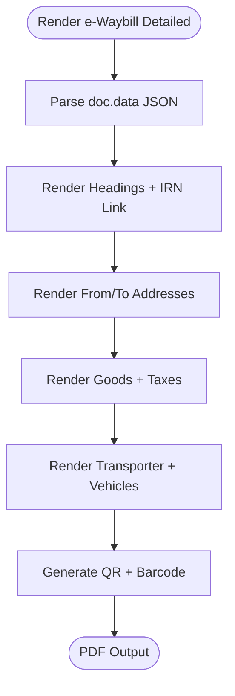
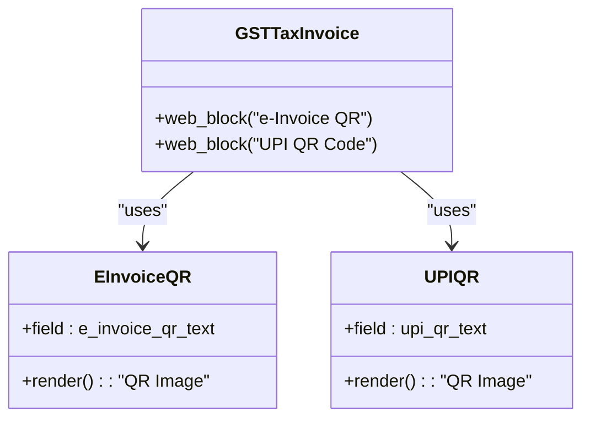
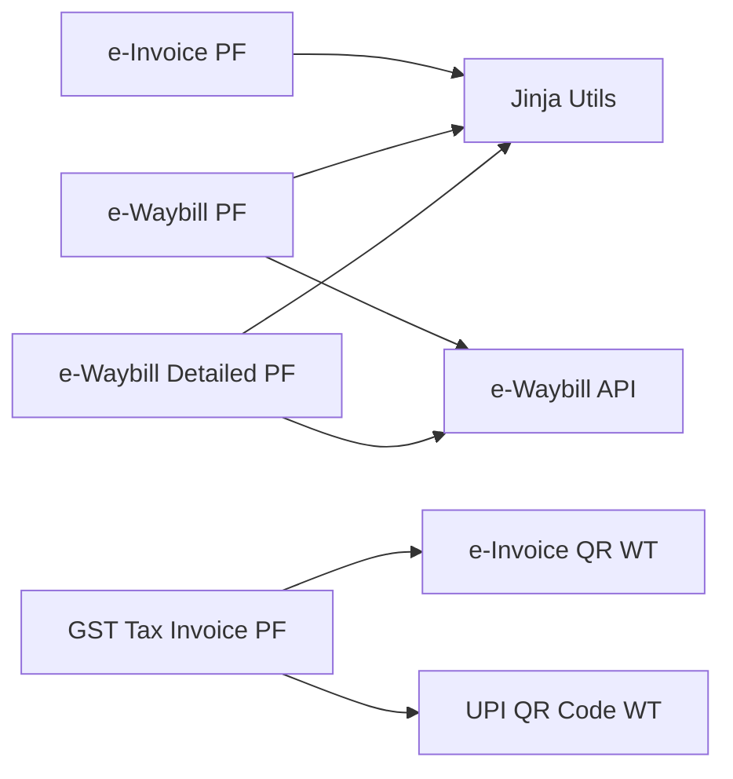

# Print Formats & Templates

<cite>
**Referenced Files in This Document**
- [e_invoice.html](file://india_compliance/gst_india/print_format/e_invoice/e_invoice.html)
- [e_invoice.json](file://india_compliance/gst_india/print_format/e_invoice/e_invoice.json)
- [e_invoice.css](file://india_compliance/gst_india/print_format/e_invoice/e_invoice.css)
- [e_waybill.html](file://india_compliance/gst_india/print_format/e_waybill/e_waybill.html)
- [e_waybill.json](file://india_compliance/gst_india/print_format/e_waybill/e_waybill.json)
- [e_waybill.css](file://india_compliance/gst_india/print_format/e_waybill/e_waybill.css)
- [e_waybill_detailed.html](file://india_compliance/gst_india/print_format/e_waybill_detailed/e_waybill_detailed.html)
- [e_waybill_detailed.json](file://india_compliance/gst_india/print_format/e_waybill_detailed/e_waybill_detailed.json)
- [e_waybill_detailed.css](file://india_compliance/gst_india/print_format/e_waybill_detailed/e_waybill_detailed.css)
- [e_invoice_qr.html](file://india_compliance/gst_india/web_template/e_invoice_qr/e_invoice_qr.html)
- [e_invoice_qr.json](file://india_compliance/gst_india/web_template/e_invoice_qr/e_invoice_qr.json)
- [upi_qr_code.html](file://india_compliance/gst_india/web_template/upi_qr_code/upi_qr_code.html)
- [upi_qr_code.json](file://india_compliance/gst_india/web_template/upi_qr_code/upi_qr_code.json)
- [gst_tax_invoice.json](file://india_compliance/gst_india/print_format/gst_tax_invoice/gst_tax_invoice.json)
- [gst_pos_invoice.json](file://india_compliance/gst_india/print_format/gst_pos_invoice/gst_pos_invoice.json)
- [gst_purchase_invoice.json](file://india_compliance/gst_india/print_format/gst_purchase_invoice/gst_purchase_invoice.json)
- [jinja.py](file://india_compliance/gst_india/utils/jinja.py)
- [e_waybill.py](file://india_compliance/gst_india/api_classes/nic/e_waybill.py)
</cite>

## Table of Contents
1. [Introduction](#introduction)
2. [Project Structure](#project-structure)
3. [Core Components](#core-components)
4. [Architecture Overview](#architecture-overview)
5. [Detailed Component Analysis](#detailed-component-analysis)
6. [Dependency Analysis](#dependency-analysis)
7. [Performance Considerations](#performance-considerations)
8. [Troubleshooting Guide](#troubleshooting-guide)
9. [Conclusion](#conclusion)
10. [Appendices](#appendices)

## Introduction
This document explains the Print Formats and Templates used for e-invoice printing, e-waybill documentation, and QR code generation in the India Compliance module. It covers:
- Standard e-invoice print format and its rendering pipeline
- e-waybill print layouts (compact and detailed)
- Web templates for QR codes and UPI payment links
- Branding and customization options via Print Formats and Web Templates
- Practical configuration examples and document generation workflows
- Troubleshooting common issues such as template rendering problems, QR code generation failures, and format compatibility issues

## Project Structure
The print formats and templates are organized under dedicated folders for e-invoice, e-waybill, and standard GST invoice formats. Web templates provide reusable components for QR code rendering.

**Diagram sources**
- [e_invoice.html](file://india_compliance/gst_india/print_format/e_invoice/e_invoice.html#L1-L210)
- [e_waybill.html](file://india_compliance/gst_india/print_format/e_waybill/e_waybill.html#L1-L277)
- [e_waybill_detailed.html](file://india_compliance/gst_india/print_format/e_waybill_detailed/e_waybill_detailed.html#L1-L348)
- [e_invoice_qr.html](file://india_compliance/gst_india/web_template/e_invoice_qr/e_invoice_qr.html#L1-L1)
- [upi_qr_code.html](file://india_compliance/gst_india/web_template/upi_qr_code/upi_qr_code.html#L1-L1)
- [jinja.py](file://india_compliance/gst_india/utils/jinja.py#L61-L119)
- [e_waybill.py](file://india_compliance/gst_india/api_classes/nic/e_waybill.py#L87-L131)

**Section sources**
- [e_invoice.html](file://india_compliance/gst_india/print_format/e_invoice/e_invoice.html#L1-L210)
- [e_waybill.html](file://india_compliance/gst_india/print_format/e_waybill/e_waybill.html#L1-L277)
- [e_waybill_detailed.html](file://india_compliance/gst_india/print_format/e_waybill_detailed/e_waybill_detailed.html#L1-L348)
- [e_invoice_qr.html](file://india_compliance/gst_india/web_template/e_invoice_qr/e_invoice_qr.html#L1-L1)
- [upi_qr_code.html](file://india_compliance/gst_india/web_template/upi_qr_code/upi_qr_code.html#L1-L1)
- [jinja.py](file://india_compliance/gst_india/utils/jinja.py#L61-L119)
- [e_waybill.py](file://india_compliance/gst_india/api_classes/nic/e_waybill.py#L87-L131)

## Core Components
- e-Invoice Print Format: Renders transaction, party, item, and value details from e-Invoice Log, and displays a QR code generated from signed data.
- e-Waybill Print Format: Compact layout with QR code, barcode, and summarized logistics data.
- e-Waybill Detailed Print Format: Comprehensive layout with detailed addresses, goods, taxes, and vehicle information.
- Web Templates for QR Codes: Reusable components to render e-invoice QR and UPI QR codes.
- Standard GST Invoice Formats: GST Tax Invoice, GST POS Invoice, and GST Purchase Invoice with configurable layouts and branding.

Key capabilities:
- QR code generation via Jinja helpers
- Barcodes for e-waybills
- Dynamic state and transport type resolution
- Multi-language support via Print Format settings
- Branding via company logo and registration details injection

**Section sources**
- [e_invoice.html](file://india_compliance/gst_india/print_format/e_invoice/e_invoice.html#L1-L210)
- [e_waybill.html](file://india_compliance/gst_india/print_format/e_waybill/e_waybill.html#L1-L277)
- [e_waybill_detailed.html](file://india_compliance/gst_india/print_format/e_waybill_detailed/e_waybill_detailed.html#L1-L348)
- [e_invoice_qr.html](file://india_compliance/gst_india/web_template/e_invoice_qr/e_invoice_qr.html#L1-L1)
- [upi_qr_code.html](file://india_compliance/gst_india/web_template/upi_qr_code/upi_qr_code.html#L1-L1)
- [gst_tax_invoice.json](file://india_compliance/gst_india/print_format/gst_tax_invoice/gst_tax_invoice.json#L1-L32)
- [gst_pos_invoice.json](file://india_compliance/gst_india/print_format/gst_pos_invoice/gst_pos_invoice.json#L1-L31)
- [gst_purchase_invoice.json](file://india_compliance/gst_india/print_format/gst_purchase_invoice/gst_purchase_invoice.json#L1-L32)

## Architecture Overview
The document generation pipeline integrates Print Formats, Web Templates, and utility functions to produce printable PDFs and web-rendered components.

**Diagram sources**
- [e_invoice.html](file://india_compliance/gst_india/print_format/e_invoice/e_invoice.html#L15-L94)
- [jinja.py](file://india_compliance/gst_india/utils/jinja.py#L103-L104)

**Diagram sources**
- [e_waybill.html](file://india_compliance/gst_india/print_format/e_waybill/e_waybill.html#L5-L33)
- [e_waybill.py](file://india_compliance/gst_india/api_classes/nic/e_waybill.py#L97-L99)
- [jinja.py](file://india_compliance/gst_india/utils/jinja.py#L91-L119)

## Detailed Component Analysis

### e-Invoice Print Format
- Purpose: Display e-invoice details and embed a QR code derived from signed e-invoice data.
- Rendering logic:
  - Loads e-Invoice Log by IRN to fetch invoice_data and signed_qr_code.
  - Uses a macro to render addresses with state and pin.
  - Builds sections for transaction details, parties, items, and value totals.
  - Generates QR code image from signed_qr_code.
- Customization:
  - Adjust margins, fonts, and section headings via Print Format JSON.
  - Override CSS for branding and layout tweaks.
- Multi-language:
  - default_print_language setting controls locale for date/time formatting.

**Diagram sources**
- [e_invoice.html](file://india_compliance/gst_india/print_format/e_invoice/e_invoice.html#L7-L209)
- [e_invoice.css](file://india_compliance/gst_india/print_format/e_invoice/e_invoice.css#L1-L36)

**Section sources**
- [e_invoice.html](file://india_compliance/gst_india/print_format/e_invoice/e_invoice.html#L1-L210)
- [e_invoice.json](file://india_compliance/gst_india/print_format/e_invoice/e_invoice.json#L1-L32)
- [e_invoice.css](file://india_compliance/gst_india/print_format/e_invoice/e_invoice.css#L1-L36)

### e-Waybill Print Format (Compact)
- Purpose: Compact single-page e-waybill with QR code, barcode, and essential logistics data.
- Rendering logic:
  - Parses JSON stored in e-Waybill Log.
  - Resolves generated_by based on supply type.
  - Renders e-waybill number, validity period, parties, documents, and transporter.
  - Generates QR code and barcode images.
- Customization:
  - Adjust margins and hide/show section headings via Print Format JSON.
  - Modify CSS for spacing and image sizes.

**Diagram sources**
- [e_waybill.html](file://india_compliance/gst_india/print_format/e_waybill/e_waybill.html#L5-L277)
- [e_waybill.css](file://india_compliance/gst_india/print_format/e_waybill/e_waybill.css#L1-L92)

**Section sources**
- [e_waybill.html](file://india_compliance/gst_india/print_format/e_waybill/e_waybill.html#L1-L277)
- [e_waybill.json](file://india_compliance/gst_india/print_format/e_waybill/e_waybill.json#L1-L31)
- [e_waybill.css](file://india_compliance/gst_india/print_format/e_waybill/e_waybill.css#L1-L92)

### e-Waybill Print Format (Detailed)
- Purpose: Comprehensive layout with detailed addresses, goods breakdown, taxes, and vehicle info.
- Rendering logic:
  - Similar parsing from doc.data.
  - Renders headings, address details, goods table, tax summary, transporter, and vehicle details.
  - Includes QR code and barcode.
- Customization:
  - Adjust table widths and spacing via CSS.
  - Control visibility of IRN linkage and additional sections.

**Diagram sources**
- [e_waybill_detailed.html](file://india_compliance/gst_india/print_format/e_waybill_detailed/e_waybill_detailed.html#L1-L348)
- [e_waybill_detailed.css](file://india_compliance/gst_india/print_format/e_waybill_detailed/e_waybill_detailed.css#L1-L126)

**Section sources**
- [e_waybill_detailed.html](file://india_compliance/gst_india/print_format/e_waybill_detailed/e_waybill_detailed.html#L1-L348)
- [e_waybill_detailed.json](file://india_compliance/gst_india/print_format/e_waybill_detailed/e_waybill_detailed.json#L1-L30)
- [e_waybill_detailed.css](file://india_compliance/gst_india/print_format/e_waybill_detailed/e_waybill_detailed.css#L1-L126)

### Web Templates: QR Codes and UPI Links
- e-Invoice QR Web Template:
  - Renders a QR code image from a text field containing signed e-invoice data.
  - Designed as a reusable component injected into other templates.
- UPI QR Code Web Template:
  - Renders a QR code for UPI payments using a dynamically constructed payload.
- Usage:
  - Injected into the GST Tax Invoice Print Format to show e-invoice QR and optional UPI QR.

**Diagram sources**
- [e_invoice_qr.html](file://india_compliance/gst_india/web_template/e_invoice_qr/e_invoice_qr.html#L1-L1)
- [e_invoice_qr.json](file://india_compliance/gst_india/web_template/e_invoice_qr/e_invoice_qr.json#L1-L22)
- [upi_qr_code.html](file://india_compliance/gst_india/web_template/upi_qr_code/upi_qr_code.html#L1-L1)
- [upi_qr_code.json](file://india_compliance/gst_india/web_template/upi_qr_code/upi_qr_code.json#L1-L22)
- [gst_tax_invoice.json](file://india_compliance/gst_india/print_format/gst_tax_invoice/gst_tax_invoice.json#L1-L32)

**Section sources**
- [e_invoice_qr.html](file://india_compliance/gst_india/web_template/e_invoice_qr/e_invoice_qr.html#L1-L1)
- [e_invoice_qr.json](file://india_compliance/gst_india/web_template/e_invoice_qr/e_invoice_qr.json#L1-L22)
- [upi_qr_code.html](file://india_compliance/gst_india/web_template/upi_qr_code/upi_qr_code.html#L1-L1)
- [upi_qr_code.json](file://india_compliance/gst_india/web_template/upi_qr_code/upi_qr_code.json#L1-L22)
- [gst_tax_invoice.json](file://india_compliance/gst_india/print_format/gst_tax_invoice/gst_tax_invoice.json#L1-L32)

### Standard GST Invoice Formats
- GST Tax Invoice:
  - Highly configurable via format_data and CSS.
  - Includes sections for company details, addresses, items, taxes, and registration details.
  - Integrates e-invoice QR and UPI QR web blocks.
- GST POS Invoice:
  - Compact layout optimized for point-of-sale receipts.
  - Includes company address, cashier details, items, taxes, and payment modes.
- GST Purchase Invoice:
  - Builder-style configuration for supplier details, items, taxes, and payments.

Branding and customization:
- Company logo and registration details are injected into the layout.
- Bank and UPI details are rendered conditionally based on company settings.
- Page number placement and margins controlled via Print Format JSON.

**Section sources**
- [gst_tax_invoice.json](file://india_compliance/gst_india/print_format/gst_tax_invoice/gst_tax_invoice.json#L1-L32)
- [gst_pos_invoice.json](file://india_compliance/gst_india/print_format/gst_pos_invoice/gst_pos_invoice.json#L1-L31)
- [gst_purchase_invoice.json](file://india_compliance/gst_india/print_format/gst_purchase_invoice/gst_purchase_invoice.json#L1-L32)

## Dependency Analysis
- Print Formats depend on:
  - Jinja utility functions for QR/barcode generation and data formatting.
  - e-waybill API for retrieving e-waybill data by number.
  - Web Templates for reusable QR rendering.
- Coupling:
  - e-Invoice and e-waybill formats rely on external data sources (logs and APIs).
  - Web Templates decouple QR rendering from invoice templates.
- Cohesion:
  - Each Print Format targets a specific document type with focused sections.

**Diagram sources**
- [e_invoice.html](file://india_compliance/gst_india/print_format/e_invoice/e_invoice.html#L1-L210)
- [e_waybill.html](file://india_compliance/gst_india/print_format/e_waybill/e_waybill.html#L1-L277)
- [e_waybill_detailed.html](file://india_compliance/gst_india/print_format/e_waybill_detailed/e_waybill_detailed.html#L1-L348)
- [e_invoice_qr.html](file://india_compliance/gst_india/web_template/e_invoice_qr/e_invoice_qr.html#L1-L1)
- [upi_qr_code.html](file://india_compliance/gst_india/web_template/upi_qr_code/upi_qr_code.html#L1-L1)
- [jinja.py](file://india_compliance/gst_india/utils/jinja.py#L61-L119)
- [e_waybill.py](file://india_compliance/gst_india/api_classes/nic/e_waybill.py#L87-L131)

**Section sources**
- [jinja.py](file://india_compliance/gst_india/utils/jinja.py#L61-L119)
- [e_waybill.py](file://india_compliance/gst_india/api_classes/nic/e_waybill.py#L87-L131)

## Performance Considerations
- QR and barcode generation:
  - Base64-encoded images are generated per render; cache where feasible in higher-level workflows.
- Large item lists:
  - e-Invoice and e-waybill item tables can increase render time; consider pagination or limiting rows in customizations.
- CSS and media queries:
  - Ensure print-specific styles are minimal to avoid layout recalculations during PDF generation.
- Data fetching:
  - e-Invoice Log retrieval and e-waybill API calls add latency; pre-fetch and reuse data where possible.

## Troubleshooting Guide
Common issues and resolutions:

- Template rendering shows “No Preview Available” for e-Invoice:
  - Cause: IRN missing or e-Invoice Log not found.
  - Resolution: Generate e-invoice first; verify IRN and associated log record exist.

- QR code not visible in e-Invoice or e-waybill:
  - Cause: Missing signed_qr_code or invalid data.
  - Resolution: Confirm e-Invoice Log contains signed_qr_code; regenerate QR via Jinja helper.

- e-waybill data not loading:
  - Cause: Incorrect e-waybill number or API errors.
  - Resolution: Validate e-Waybill number; check API response and sandbox mode settings.

- Print format misalignment or overflow:
  - Cause: Excessive content or insufficient margins.
  - Resolution: Adjust margins and font sizes in Print Format JSON; tweak CSS for tables and images.

- UPI QR not rendering:
  - Cause: UPI ID not configured or outstanding amount out of supported range.
  - Resolution: Configure UPI ID in company settings; ensure amount eligibility for UPI QR.

- Multi-language date formatting:
  - Cause: Locale mismatch in Print Format settings.
  - Resolution: Set default_print_language appropriately; verify date format in System Settings.

**Section sources**
- [e_invoice.html](file://india_compliance/gst_india/print_format/e_invoice/e_invoice.html#L7-L33)
- [e_waybill.html](file://india_compliance/gst_india/print_format/e_waybill/e_waybill.html#L5-L33)
- [jinja.py](file://india_compliance/gst_india/utils/jinja.py#L103-L119)
- [e_waybill.py](file://india_compliance/gst_india/api_classes/nic/e_waybill.py#L97-L99)

## Conclusion
The Print Formats and Templates in India Compliance provide robust, extensible mechanisms for generating e-invoice and e-waybill documents, embedding QR codes and barcodes, and integrating branding and multi-language support. By leveraging Web Templates and utility functions, organizations can tailor layouts to meet compliance and presentation needs while maintaining reliability and performance.

## Appendices

### Practical Configuration Examples
- Customize e-Invoice Print Format:
  - Adjust margins and fonts in Print Format JSON; override CSS for branding.
  - Ensure e-Invoice Log is populated before preview.
- Configure e-Waybill Print Format:
  - Verify e-waybill number and API connectivity; adjust CSS for compactness.
- Add UPI QR to GST Tax Invoice:
  - Ensure company has UPI ID configured; web block will render QR conditionally.

### Document Generation Workflows
- e-Invoice:
  - Trigger e-invoice generation → Store signed_qr_code in e-Invoice Log → Render Print Format → Generate PDF.
- e-Waybill:
  - Generate e-waybill → Retrieve data by number → Render Print Format → Generate PDF.
- GST Tax Invoice:
  - Render with injected web blocks for e-invoice QR and UPI QR.