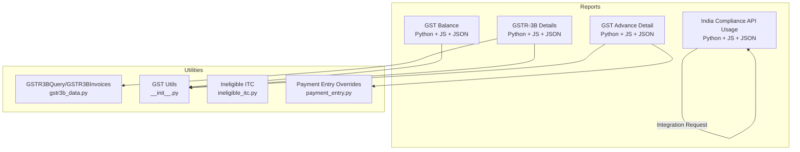
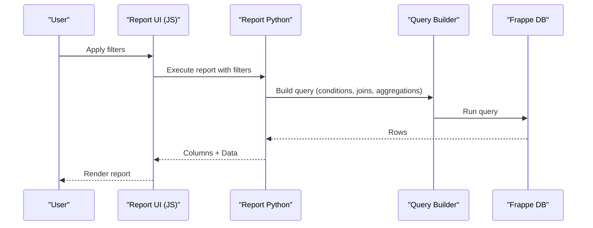
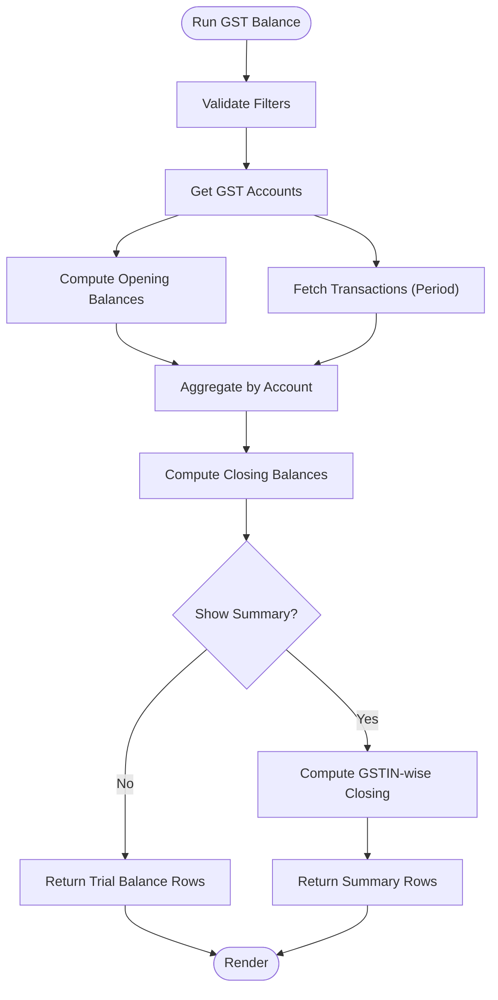
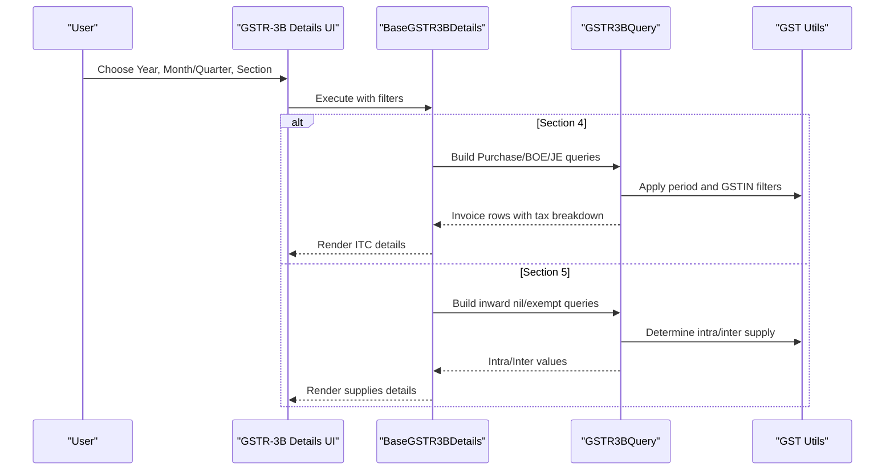
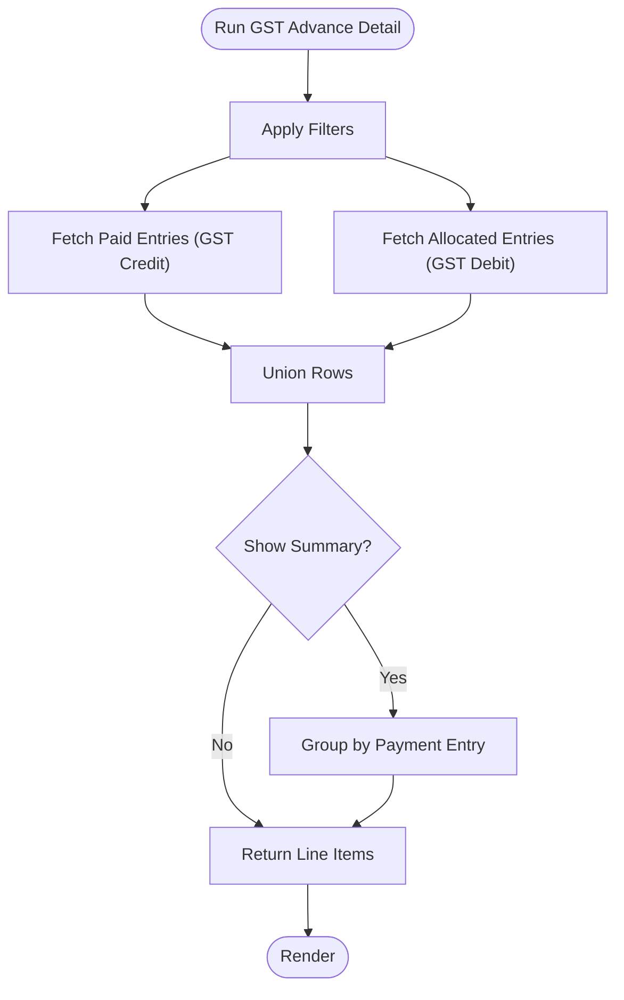
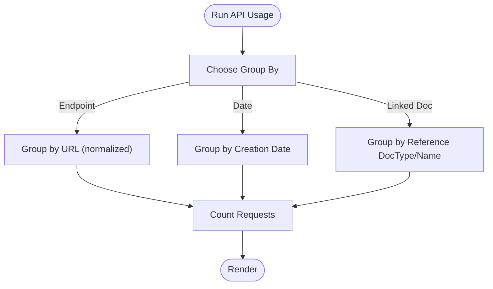
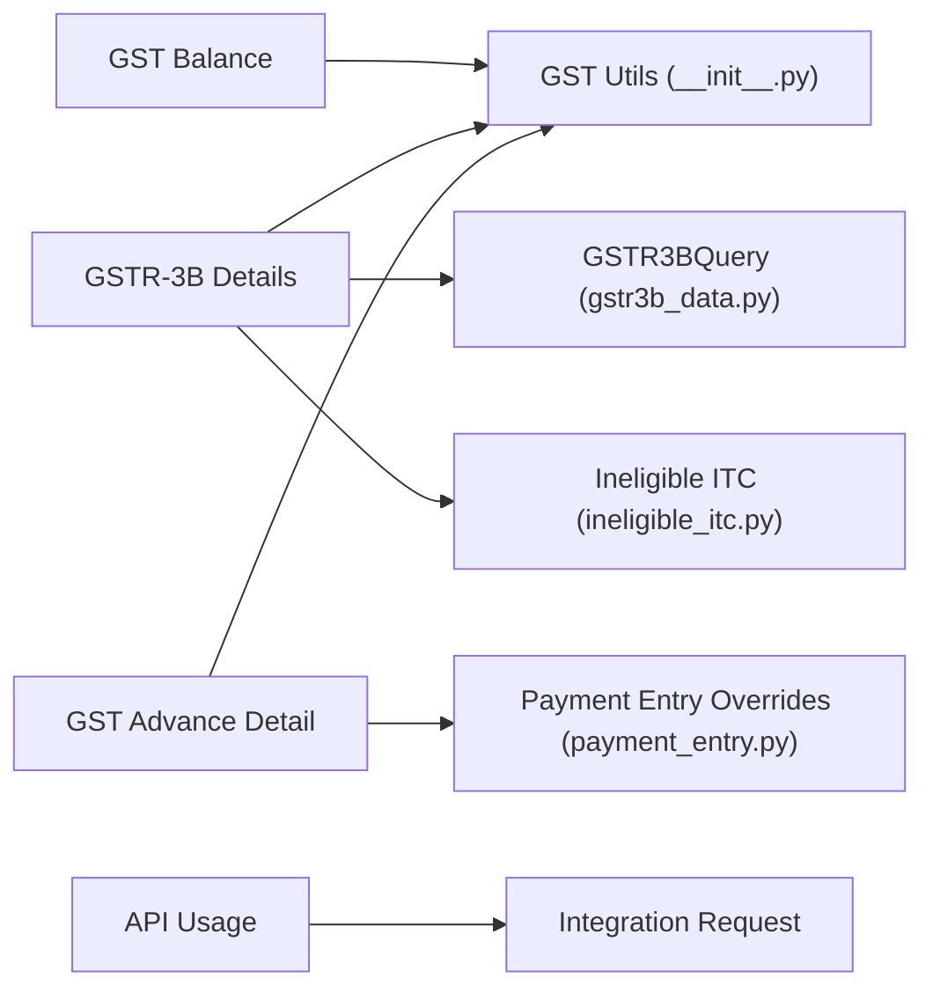

# Balance Reports

<cite>
**Referenced Files in This Document**
- [gst_balance.py](file://india_compliance/gst_india/report/gst_balance/gst_balance.py)
- [gst_balance.json](file://india_compliance/gst_india/report/gst_balance/gst_balance.json)
- [gst_balance.js](file://india_compliance/gst_india/report/gst_balance/gst_balance.js)
- [gstr_3b_details.py](file://india_compliance/gst_india/report/gstr_3b_details/gstr_3b_details.py)
- [gstr_3b_details.json](file://india_compliance/gst_india/report/gstr_3b_details/gstr_3b_details.json)
- [gstr_3b_details.js](file://india_compliance/gst_india/report/gstr_3b_details/gstr_3b_details.js)
- [gst_advance_detail.py](file://india_compliance/gst_india/report/gst_advance_detail/gst_advance_detail.py)
- [gst_advance_detail.json](file://india_compliance/gst_india/report/gst_advance_detail/gst_advance_detail.json)
- [gst_advance_detail.js](file://india_compliance/gst_india/report/gst_advance_detail/gst_advance_detail.js)
- [india_compliance_api_usage.py](file://india_compliance/gst_india/report/india_compliance_api_usage/india_compliance_api_usage.py)
- [india_compliance_api_usage.json](file://india_compliance/gst_india/report/india_compliance_api_usage/india_compliance_api_usage.json)
- [india_compliance_api_usage.js](file://india_compliance/gst_india/report/india_compliance_api_usage/india_compliance_api_usage.js)
- [gstr3b_data.py](file://india_compliance/gst_india/utils/gstr3b/gstr3b_data.py)
- [__init__.py](file://india_compliance/gst_india/utils/__init__.py)
- [ineligible_itc.py](file://india_compliance/gst_india/overrides/ineligible_itc.py)
- [payment_entry.py](file://india_compliance/gst_india/overrides/payment_entry.py)
</cite>

## Table of Contents
1. [Introduction](#introduction)
2. [Project Structure](#project-structure)
3. [Core Components](#core-components)
4. [Architecture Overview](#architecture-overview)
5. [Detailed Component Analysis](#detailed-component-analysis)
6. [Dependency Analysis](#dependency-analysis)
7. [Performance Considerations](#performance-considerations)
8. [Troubleshooting Guide](#troubleshooting-guide)
9. [Conclusion](#conclusion)
10. [Appendices](#appendices)

## Introduction
This document provides comprehensive documentation for balance and usage reports focused on GST financial reporting in India Compliance. It covers:
- GST liability balances via the GST Balance report
- GSTR-3B details including monthly liability breakdown, ITC utilization, and tax payment schedules
- Advance tax payments and reconciliation via the GST Advance Detail report
- API usage tracking via the India Compliance API Usage report

It explains balance calculation methodology, liability computation, payment tracking mechanisms, and practical procedures for generating reports, reconciling balances, and integrating with payment gateway APIs. Performance considerations for historical data analysis and aging calculations are included, along with troubleshooting strategies for common issues.

## Project Structure
The balance and usage reports are implemented as script reports under the GST India module. Each report comprises:
- A Python backend that builds queries, aggregates data, and returns columns and rows
- A JSON metadata file defining roles, reference doctypes, and standard report settings
- A JavaScript frontend that defines filters, default values, and UI behavior

**Diagram sources**
- [gst_balance.py](file://india_compliance/gst_india/report/gst_balance/gst_balance.py#L22-L41)
- [gstr_3b_details.py](file://india_compliance/gst_india/report/gstr_3b_details/gstr_3b_details.py#L14-L26)
- [gst_advance_detail.py](file://india_compliance/gst_india/report/gst_advance_detail/gst_advance_detail.py#L16-L18)
- [india_compliance_api_usage.py](file://india_compliance/gst_india/report/india_compliance_api_usage/india_compliance_api_usage.py#L11-L16)
- [gstr3b_data.py](file://india_compliance/gst_india/utils/gstr3b/gstr3b_data.py#L132-L304)
- [__init__.py](file://india_compliance/gst_india/utils/__init__.py#L627-L646)
- [ineligible_itc.py](file://india_compliance/gst_india/overrides/ineligible_itc.py#L18-L104)
- [payment_entry.py](file://india_compliance/gst_india/overrides/payment_entry.py#L158-L273)

**Section sources**
- [gst_balance.py](file://india_compliance/gst_india/report/gst_balance/gst_balance.py#L22-L41)
- [gstr_3b_details.py](file://india_compliance/gst_india/report/gstr_3b_details/gstr_3b_details.py#L14-L26)
- [gst_advance_detail.py](file://india_compliance/gst_india/report/gst_advance_detail/gst_advance_detail.py#L16-L18)
- [india_compliance_api_usage.py](file://india_compliance/gst_india/report/india_compliance_api_usage/india_compliance_api_usage.py#L11-L16)

## Core Components
- GST Balance Report: Computes trial balance and summary balances for GST accounts across selected dimensions (company, GSTIN, cost center, project). Handles opening/closing balances and supports filtering by date range and accounting dimensions.
- GSTR-3B Details Report: Provides two sections:
  - Section 4: Eligible ITC details by voucher type, including Integrated Tax, Central Tax, State/UT Tax, Cess, and ITC classification
  - Section 5: Inward nil-rated/exempt/non-GST supplies with intra/inter-state breakdown
- GST Advance Detail Report: Tracks GST paid via advance payments, including paid vs allocated amounts, GST paid vs allocated, and linkage to invoices for reconciliation.
- India Compliance API Usage Report: Aggregates API usage by endpoint, date, or linked document to monitor integration activity.

**Section sources**
- [gst_balance.py](file://india_compliance/gst_india/report/gst_balance/gst_balance.py#L108-L189)
- [gstr_3b_details.py](file://india_compliance/gst_india/report/gstr_3b_details/gstr_3b_details.py#L80-L140)
- [gst_advance_detail.py](file://india_compliance/gst_india/report/gst_advance_detail/gst_advance_detail.py#L30-L120)
- [india_compliance_api_usage.py](file://india_compliance/gst_india/report/india_compliance_api_usage/india_compliance_api_usage.py#L25-L94)

## Architecture Overview
The reports follow a layered architecture:
- Filters and UI: Defined in JS files
- Backend logic: Implemented in Python report modules
- Data sources: ERPNext doctypes (GL Entry, Payment Entry, Purchase/Payment documents) and Integration Request logs
- Utilities: Shared GST helpers for account retrieval, period handling, and UOM mapping

**Diagram sources**
- [gst_balance.py](file://india_compliance/gst_india/report/gst_balance/gst_balance.py#L22-L41)
- [gstr_3b_details.py](file://india_compliance/gst_india/report/gstr_3b_details/gstr_3b_details.py#L14-L26)
- [gst_advance_detail.py](file://india_compliance/gst_india/report/gst_advance_detail/gst_advance_detail.py#L16-L18)
- [india_compliance_api_usage.py](file://india_compliance/gst_india/report/india_compliance_api_usage/india_compliance_api_usage.py#L11-L16)

## Detailed Component Analysis

### GST Balance Report
Purpose:
- Compute GST account balances across a period, supporting both trial balance and summary views by GSTIN.

Key logic:
- Validates filters and permissions
- Retrieves all GST accounts for the company
- Builds GL Entry queries for opening, closing, and period transactions
- Aggregates debit/credit per account and computes opening/closing balances
- Supports accounting dimensions (cost center, project) and finance book filters

**Diagram sources**
- [gst_balance.py](file://india_compliance/gst_india/report/gst_balance/gst_balance.py#L61-L321)

Practical usage:
- Select company, optional company GSTIN, date range, and dimensions
- Toggle “Show Summary” to compare balances across GSTINs
- Use “Update GSTIN” button to resolve pending voucher types requiring GSTIN updates

Common issues and resolutions:
- Pending voucher types requiring GSTIN: Use the “Update GSTIN” button to navigate to affected documents and set GSTIN before running the report
- Incorrect balances: Verify date range, ensure no excluded finance books or dimensions, and confirm GST accounts are configured in GST Settings

**Section sources**
- [gst_balance.py](file://india_compliance/gst_india/report/gst_balance/gst_balance.py#L22-L41)
- [gst_balance.py](file://india_compliance/gst_india/report/gst_balance/gst_balance.py#L191-L228)
- [gst_balance.py](file://india_compliance/gst_india/report/gst_balance/gst_balance.py#L230-L244)
- [gst_balance.js](file://india_compliance/gst_india/report/gst_balance/gst_balance.js#L105-L141)
- [gst_balance.json](file://india_compliance/gst_india/report/gst_balance/gst_balance.json#L1-L31)

### GSTR-3B Details Report
Purpose:
- Provide monthly/quarterly GSTR-3B details with:
  - Section 4: Eligible ITC (IGST, CGST, SGST, Cess) and ITC classification
  - Section 5: Inward nil-rated/exempt/non-GST supplies with intra/inter-state split

Methodology:
- Section selection drives report class instantiation
- Builds queries across Purchase Invoice, Bill of Entry, Journal Entry, and ineligible ITC sources
- Uses GSTR3BQuery to unify invoice-level data and categorize by invoice category/subcategory
- Applies period filters and company GSTIN constraints

**Diagram sources**
- [gstr_3b_details.py](file://india_compliance/gst_india/report/gstr_3b_details/gstr_3b_details.py#L14-L26)
- [gstr_3b_details.py](file://india_compliance/gst_india/report/gstr_3b_details/gstr_3b_details.py#L80-L140)
- [gstr3b_data.py](file://india_compliance/gst_india/utils/gstr3b/gstr3b_data.py#L132-L304)

Practical usage:
- Select company, company GSTIN, year, month/quarter, and section
- Review ITC classification and tax breakdown for eligible ITC
- For inward nil/exempt supplies, review intra/inter-state values and nature of supply

Common issues and resolutions:
- Missing ITC: Ensure purchase documents have proper GSTINs and ITC classification; verify ineligible reasons and PoS restrictions
- Intra/inter mismatch: Confirm place of supply and supplier GSTIN mapping

**Section sources**
- [gstr_3b_details.py](file://india_compliance/gst_india/report/gstr_3b_details/gstr_3b_details.py#L14-L26)
- [gstr_3b_details.py](file://india_compliance/gst_india/report/gstr_3b_details/gstr_3b_details.py#L80-L140)
- [gstr3b_data.py](file://india_compliance/gst_india/utils/gstr3b/gstr3b_data.py#L132-L304)

### GST Advance Detail Report
Purpose:
- Track GST paid via advance payments, including paid vs allocated amounts and GST paid vs allocated, with optional summary view.

Key logic:
- Queries GL Entries for Payment Entries with GST accounts
- Distinguishes paid entries (no allocation) and allocated entries (linked via Payment Entry Reference)
- Supports filters for customer, receivable account, date range, and summary mode

**Diagram sources**
- [gst_advance_detail.py](file://india_compliance/gst_india/report/gst_advance_detail/gst_advance_detail.py#L122-L187)

Practical usage:
- Select company, optional customer/account, date range, and summary flag
- Review paid vs allocated amounts and GST paid vs allocated
- Use summary view to consolidate per Payment Entry

Common issues and resolutions:
- Unallocated GST: Verify Payment Entry references and ensure GST accounts are correctly mapped
- Discrepancies: Reconcile against underlying invoices and confirm allocation proportions

**Section sources**
- [gst_advance_detail.py](file://india_compliance/gst_india/report/gst_advance_detail/gst_advance_detail.py#L16-L18)
- [gst_advance_detail.py](file://india_compliance/gst_india/report/gst_advance_detail/gst_advance_detail.py#L122-L187)
- [payment_entry.py](file://india_compliance/gst_india/overrides/payment_entry.py#L158-L273)

### India Compliance API Usage Report
Purpose:
- Monitor API usage by endpoint, date, or linked document to track integration activity.

Key logic:
- Supports grouping by Endpoint, Date, or Linked Document
- Queries Integration Request logs with date range filters
- Normalizes endpoint URLs by removing base URL prefix

**Diagram sources**
- [india_compliance_api_usage.py](file://india_compliance/gst_india/report/india_compliance_api_usage/india_compliance_api_usage.py#L96-L156)

Practical usage:
- Select date range and grouping option
- Review request counts per endpoint/date/document
- Investigate spikes or missing requests for troubleshooting

**Section sources**
- [india_compliance_api_usage.py](file://india_compliance/gst_india/report/india_compliance_api_usage/india_compliance_api_usage.py#L11-L16)
- [india_compliance_api_usage.js](file://india_compliance/gst_india/report/india_compliance_api_usage/india_compliance_api_usage.js#L4-L31)

## Dependency Analysis
- GST Balance depends on:
  - GST account retrieval utilities
  - GL Entry queries with accounting dimensions and finance book filters
- GSTR-3B Details depends on:
  - GSTR3BQuery for unified invoice data
  - GST utils for period and GSTIN handling
  - Ineligible ITC logic for reversing ITC amounts
- GST Advance Detail depends on:
  - GST account retrieval
  - Payment Entry references and GL Entry allocations
- API Usage depends on:
  - Integration Request logs

**Diagram sources**
- [__init__.py](file://india_compliance/gst_india/utils/__init__.py#L627-L646)
- [gstr3b_data.py](file://india_compliance/gst_india/utils/gstr3b/gstr3b_data.py#L132-L304)
- [ineligible_itc.py](file://india_compliance/gst_india/overrides/ineligible_itc.py#L18-L104)
- [payment_entry.py](file://india_compliance/gst_india/overrides/payment_entry.py#L158-L273)
- [india_compliance_api_usage.py](file://india_compliance/gst_india/report/india_compliance_api_usage/india_compliance_api_usage.py#L106-L156)

**Section sources**
- [__init__.py](file://india_compliance/gst_india/utils/__init__.py#L627-L646)
- [gstr3b_data.py](file://india_compliance/gst_india/utils/gstr3b/gstr3b_data.py#L132-L304)
- [ineligible_itc.py](file://india_compliance/gst_india/overrides/ineligible_itc.py#L18-L104)
- [payment_entry.py](file://india_compliance/gst_india/overrides/payment_entry.py#L158-L273)
- [india_compliance_api_usage.py](file://india_compliance/gst_india/report/india_compliance_api_usage/india_compliance_api_usage.py#L106-L156)

## Performance Considerations
- Historical data analysis:
  - Use granular date ranges to limit query scope
  - Prefer grouping by GSTIN or voucher type to reduce row count
- Aging calculations for outstanding liabilities:
  - Combine outstanding receivables/payables with GST account balances
  - Use aging bands (e.g., 0–30, 31–60, 61–90, 90+ days) to classify liabilities
- Query optimization:
  - Ensure appropriate indexes on posting_date, company, company_gstin, and account fields
  - Limit accounting dimensions and finance book filters to necessary values
- API usage monitoring:
  - Aggregate by endpoint/date to avoid large result sets
  - Use date windows aligned to reporting periods

[No sources needed since this section provides general guidance]

## Troubleshooting Guide
Common issues and resolutions:
- Incorrect liability calculations:
  - Verify GST account configuration in GST Settings
  - Confirm period boundaries and opening/closing logic
  - Check for excluded finance books or dimensions
- Missing payment records:
  - Ensure Payment Entry references are linked and not canceled
  - Confirm GST accounts are mapped for tax rows
- Reconciliation discrepancies:
  - Compare allocated vs paid amounts and reconcile differences
  - Validate proportionate tax reversals for advance payments
- GSTR-3B ITC mismatches:
  - Review ineligible reasons and PoS restrictions
  - Confirm BOE and JE ITC classifications and reversals
- API usage anomalies:
  - Check Integration Request logs for failures or missing records
  - Validate date range and grouping selections

**Section sources**
- [payment_entry.py](file://india_compliance/gst_india/overrides/payment_entry.py#L158-L273)
- [ineligible_itc.py](file://india_compliance/gst_india/overrides/ineligible_itc.py#L18-L104)
- [gstr3b_data.py](file://india_compliance/gst_india/utils/gstr3b/gstr3b_data.py#L132-L304)

## Conclusion
The balance and usage reports provide robust capabilities for tracking GST liabilities, ITC utilization, advance tax payments, and API usage. By leveraging structured queries, shared utilities, and clear UI filters, organizations can generate accurate, timely reports for compliance and financial management. Proper configuration of GST accounts, periodic reconciliations, and performance-aware filtering are essential for reliable outcomes.

[No sources needed since this section summarizes without analyzing specific files]

## Appendices

### Practical Examples

- Balance report generation:
  - Open GST Balance, select company and date range, optionally choose “Show Summary”
  - Use “Update GSTIN” if prompted to resolve pending voucher types
- Liability tracking:
  - Use GSTR-3B Details to review monthly ITC and inward supplies
  - Cross-check intra/inter-state splits and ITC classifications
- Payment reconciliation:
  - Use GST Advance Detail to compare paid vs allocated GST amounts
  - Reconcile against underlying invoices and references

[No sources needed since this section provides general guidance]