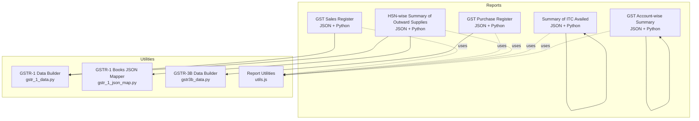
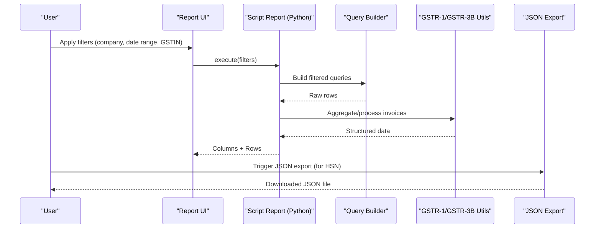
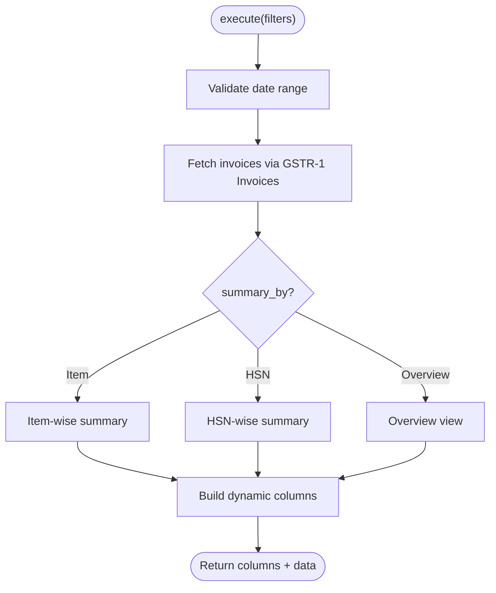
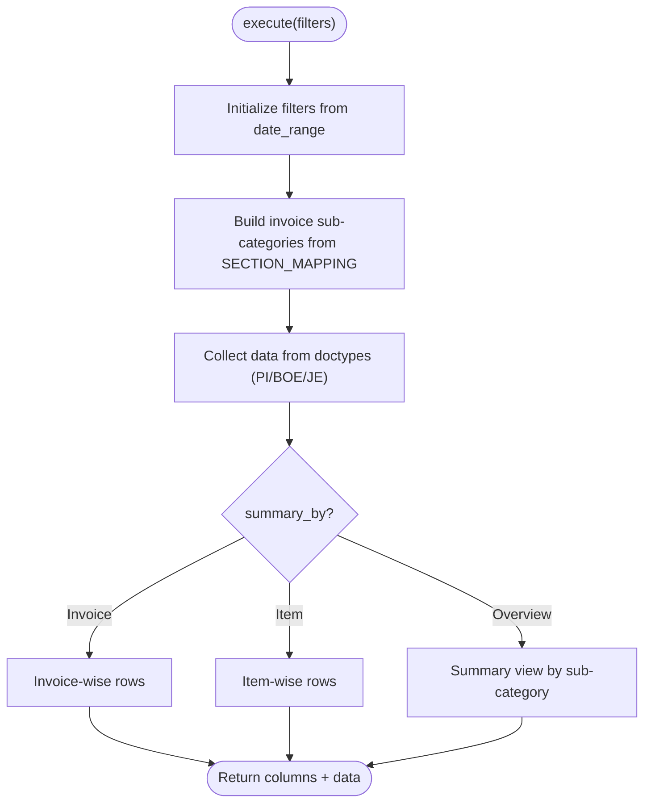
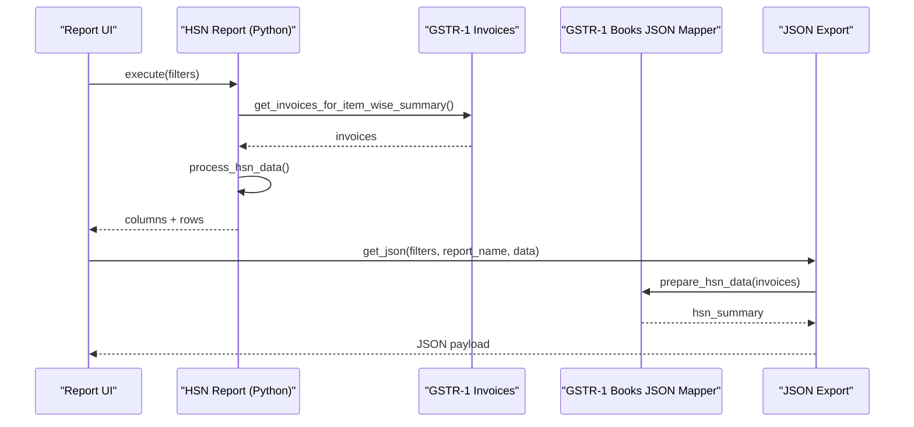
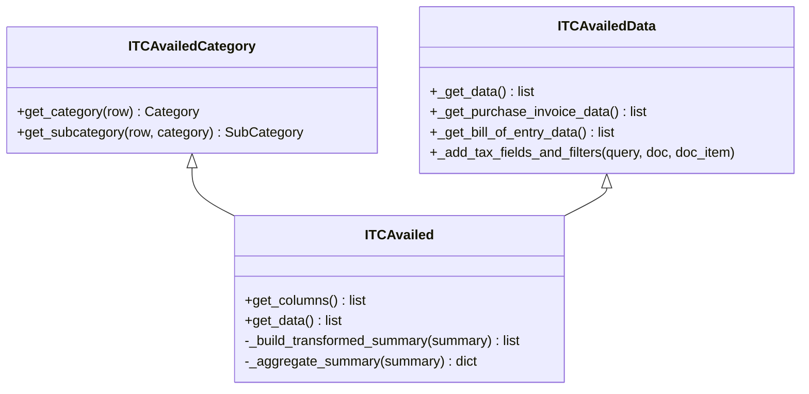
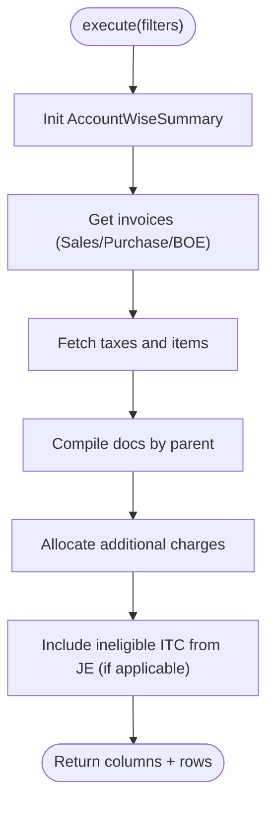
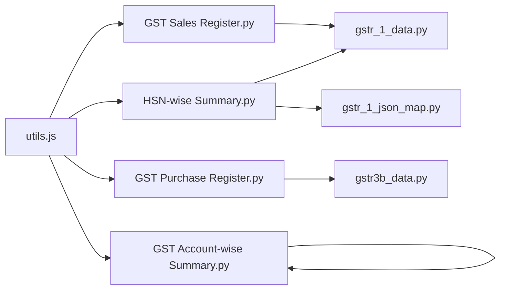

# Custom Reports

<cite>
**Referenced Files in This Document**
- [summary_of_itc_availed.json](file://india_compliance/gst_india/report/summary_of_itc_availed/summary_of_itc_availed.json)
- [summary_of_itc_availed.py](file://india_compliance/gst_india/report/summary_of_itc_availed/summary_of_itc_availed.py)
- [hsn_wise_summary_of_outward_supplies.json](file://india_compliance/gst_india/report/hsn_wise_summary_of_outward_supplies/hsn_wise_summary_of_outward_supplies.json)
- [hsn_wise_summary_of_outward_supplies.py](file://india_compliance/gst_india/report/hsn_wise_summary_of_outward_supplies/hsn_wise_summary_of_outward_supplies.py)
- [gst_sales_register.json](file://india_compliance/gst_india/report/gst_sales_register/gst_sales_register.json)
- [gst_sales_register.py](file://india_compliance/gst_india/report/gst_sales_register/gst_sales_register.py)
- [gst_purchase_register.json](file://india_compliance/gst_india/report/gst_purchase_register/gst_purchase_register.json)
- [gst_purchase_register.py](file://india_compliance/gst_india/report/gst_purchase_register/gst_purchase_register.py)
- [gst_account_wise_summary.json](file://india_compliance/gst_india/report/gst_account_wise_summary/gst_account_wise_summary.json)
- [gst_account_wise_summary.py](file://india_compliance/gst_india/report/gst_account_wise_summary/gst_account_wise_summary.py)
- [gstr_1_data.py](file://india_compliance/gst_india/utils/gstr_1/gstr_1_data.py)
- [gstr_1_json_map.py](file://india_compliance/gst_india/utils/gstr_1/gstr_1_json_map.py)
- [gstr3b_data.py](file://india_compliance/gst_india/utils/gstr3b/gstr3b_data.py)
- [utils.js](file://india_compliance/gst_india/report/utils.js)
</cite>

## Table of Contents
1. [Introduction](#introduction)
2. [Project Structure](#project-structure)
3. [Core Components](#core-components)
4. [Architecture Overview](#architecture-overview)
5. [Detailed Component Analysis](#detailed-component-analysis)
6. [Dependency Analysis](#dependency-analysis)
7. [Performance Considerations](#performance-considerations)
8. [Troubleshooting Guide](#troubleshooting-guide)
9. [Conclusion](#conclusion)
10. [Appendices](#appendices)

## Introduction
This document explains the custom report generation framework for GST-related financial statements and compliance reports in the India Compliance module. It covers report doctype structure, query builders, and data aggregation methods for:
- GSTR-1-like invoice-wise and HSN-wise summaries
- E-invoice summary with IRN tracking
- GST registers with tax component breakdown
- HSN-wise summaries, ITC availed reports, and account-wise GST balances

It also provides practical examples for customization, filtering, export, performance optimization, caching, scheduling, and resolutions for common issues such as missing data, incorrect tax calculations, and formatting problems.

## Project Structure
The GST reports are implemented as Script Reports under the GST India module. Each report defines:
- A report definition JSON specifying filters, roles, and reference doctype
- A Python script implementing the execute method, column definitions, and data retrieval/aggregation logic
- Utility modules for GSTR-1/GSTR-3B data processing and JSON mapping

**Diagram sources**
- [gst_sales_register.py](file://india_compliance/gst_india/report/gst_sales_register/gst_sales_register.py#L1-L363)
- [gst_purchase_register.py](file://india_compliance/gst_india/report/gst_purchase_register/gst_purchase_register.py#L1-L406)
- [hsn_wise_summary_of_outward_supplies.py](file://india_compliance/gst_india/report/hsn_wise_summary_of_outward_supplies/hsn_wise_summary_of_outward_supplies.py#L1-L272)
- [summary_of_itc_availed.py](file://india_compliance/gst_india/report/summary_of_itc_availed/summary_of_itc_availed.py#L1-L268)
- [gst_account_wise_summary.py](file://india_compliance/gst_india/report/gst_account_wise_summary/gst_account_wise_summary.py#L1-L397)
- [gstr_1_data.py](file://india_compliance/gst_india/utils/gstr_1/gstr_1_data.py)
- [gstr_1_json_map.py](file://india_compliance/gst_india/utils/gstr_1/gstr_1_json_map.py)
- [gstr3b_data.py](file://india_compliance/gst_india/utils/gstr3b/gstr3b_data.py)
- [utils.js](file://india_compliance/gst_india/report/utils.js)

**Section sources**
- [gst_sales_register.json](file://india_compliance/gst_india/report/gst_sales_register/gst_sales_register.json#L1-L29)
- [gst_sales_register.py](file://india_compliance/gst_india/report/gst_sales_register/gst_sales_register.py#L1-L363)
- [gst_purchase_register.json](file://india_compliance/gst_india/report/gst_purchase_register/gst_purchase_register.json#L1-L35)
- [gst_purchase_register.py](file://india_compliance/gst_india/report/gst_purchase_register/gst_purchase_register.py#L1-L406)
- [hsn_wise_summary_of_outward_supplies.json](file://india_compliance/gst_india/report/hsn_wise_summary_of_outward_supplies/hsn_wise_summary_of_outward_supplies.json#L1-L31)
- [hsn_wise_summary_of_outward_supplies.py](file://india_compliance/gst_india/report/hsn_wise_summary_of_outward_supplies/hsn_wise_summary_of_outward_supplies.py#L1-L272)
- [summary_of_itc_availed.json](file://india_compliance/gst_india/report/summary_of_itc_availed/summary_of_itc_availed.json#L1-L38)
- [summary_of_itc_availed.py](file://india_compliance/gst_india/report/summary_of_itc_availed/summary_of_itc_availed.py#L1-L268)
- [gst_account_wise_summary.json](file://india_compliance/gst_india/report/gst_account_wise_summary/gst_account_wise_summary.json#L1-L36)
- [gst_account_wise_summary.py](file://india_compliance/gst_india/report/gst_account_wise_summary/gst_account_wise_summary.py#L1-L397)

## Core Components
- Report Definition JSON: Declares roles, reference doctype, report type, and whether to add a total row. Filters are declared empty by default and populated via the report UI.
- Script Report Python: Implements execute(filters) returning columns and data. Applies date range, company, and optional GSTIN filters. Aggregates data using Query Builder and utility classes.
- Utility Modules:
  - GSTR-1 Data Builder: Builds invoice collections for item-wise and HSN-wise summaries and supports overview views.
  - GSTR-1 Books JSON Mapper: Prepares standardized HSN data for JSON export.
  - GSTR-3B Data Builder: Provides purchase register data grouped by invoice or item, with section-specific categorization.

**Section sources**
- [gst_sales_register.py](file://india_compliance/gst_india/report/gst_sales_register/gst_sales_register.py#L12-L56)
- [gst_purchase_register.py](file://india_compliance/gst_india/report/gst_purchase_register/gst_purchase_register.py#L49-L308)
- [hsn_wise_summary_of_outward_supplies.py](file://india_compliance/gst_india/report/hsn_wise_summary_of_outward_supplies/hsn_wise_summary_of_outward_supplies.py#L15-L131)
- [summary_of_itc_availed.py](file://india_compliance/gst_india/report/summary_of_itc_availed/summary_of_itc_availed.py#L20-L241)
- [gst_account_wise_summary.py](file://india_compliance/gst_india/report/gst_account_wise_summary/gst_account_wise_summary.py#L17-L113)
- [gstr_1_data.py](file://india_compliance/gst_india/utils/gstr_1/gstr_1_data.py)
- [gstr_1_json_map.py](file://india_compliance/gst_india/utils/gstr_1/gstr_1_json_map.py)
- [gstr3b_data.py](file://india_compliance/gst_india/utils/gstr3b/gstr3b_data.py)

## Architecture Overview
The reports follow a layered architecture:
- UI Layer: Filters and report execution triggered from the ERPNext Report interface.
- Report Layer: execute() builds queries, applies filters, and aggregates data.
- Utility Layer: GSTR-1/GSTR-3B builders and JSON mappers transform raw data into report-ready structures.
- Export Layer: JSON export utilities for GSTR-1 HSN exports.

**Diagram sources**
- [gst_sales_register.py](file://india_compliance/gst_india/report/gst_sales_register/gst_sales_register.py#L12-L56)
- [gst_purchase_register.py](file://india_compliance/gst_india/report/gst_purchase_register/gst_purchase_register.py#L283-L308)
- [hsn_wise_summary_of_outward_supplies.py](file://india_compliance/gst_india/report/hsn_wise_summary_of_outward_supplies/hsn_wise_summary_of_outward_supplies.py#L165-L200)
- [gstr_1_data.py](file://india_compliance/gst_india/utils/gstr_1/gstr_1_data.py)
- [gstr_1_json_map.py](file://india_compliance/gst_india/utils/gstr_1/gstr_1_json_map.py)

## Detailed Component Analysis

### GST Sales Register
Purpose: Item-wise and HSN-wise summaries aligned with GSTR-1 categories, plus an overview view. Supports filtering by invoice category and sub-category.

Key behaviors:
- Filters: date_range, summary_by, invoice_category, invoice_sub_category, company_gstin.
- Data retrieval: Uses GSTR-1 Invoices builder to fetch item-wise or HSN-wise invoices, apply filters, and process.
- Columns: Dynamically adds fields based on settings (reverse charge, e-commerce, exports) and summary level.

**Diagram sources**
- [gst_sales_register.py](file://india_compliance/gst_india/report/gst_sales_register/gst_sales_register.py#L12-L56)

**Section sources**
- [gst_sales_register.json](file://india_compliance/gst_india/report/gst_sales_register/gst_sales_register.json#L1-L29)
- [gst_sales_register.py](file://india_compliance/gst_india/report/gst_sales_register/gst_sales_register.py#L35-L362)

### GST Purchase Register
Purpose: Purchase register with section-based categorization (e.g., ITC availability and eligibility). Supports invoice-wise, item-wise, and overview views.

Key behaviors:
- Filters: date_range, summary_by, sub_section, invoice_sub_category, voucher_type/company_gstin.
- Data retrieval: Uses GSTR-3B Invoices builder to collect purchase invoices, bills of entry, and journal entries; groups by invoice or item; sorts and filters by sub-categories.
- Columns: Adds tax columns and invoice metadata depending on summary level.

**Diagram sources**
- [gst_purchase_register.py](file://india_compliance/gst_india/report/gst_purchase_register/gst_purchase_register.py#L49-L308)

**Section sources**
- [gst_purchase_register.json](file://india_compliance/gst_india/report/gst_purchase_register/gst_purchase_register.json#L1-L35)
- [gst_purchase_register.py](file://india_compliance/gst_india/report/gst_purchase_register/gst_purchase_register.py#L8-L46)
- [gst_purchase_register.py](file://india_compliance/gst_india/report/gst_purchase_register/gst_purchase_register.py#L283-L405)

### HSN-wise Summary of Outward Supplies
Purpose: Itemized HSN-level summary for GSTR-1 filing, with optional bifurcation by B2B/B2C.

Key behaviors:
- Filters: date_range, company, company_gstin, bifurcate_hsn.
- Data retrieval: Uses GSTR-1 Invoices builder to get item-wise invoices, processes to HSN-level, and formats precision fields.
- Export: Generates JSON for HSN data with hashing and month-year period fields.

**Diagram sources**
- [hsn_wise_summary_of_outward_supplies.py](file://india_compliance/gst_india/report/hsn_wise_summary_of_outward_supplies/hsn_wise_summary_of_outward_supplies.py#L15-L131)
- [hsn_wise_summary_of_outward_supplies.py](file://india_compliance/gst_india/report/hsn_wise_summary_of_outward_supplies/hsn_wise_summary_of_outward_supplies.py#L165-L200)
- [gstr_1_data.py](file://india_compliance/gst_india/utils/gstr_1/gstr_1_data.py)
- [gstr_1_json_map.py](file://india_compliance/gst_india/utils/gstr_1/gstr_1_json_map.py)

**Section sources**
- [hsn_wise_summary_of_outward_supplies.json](file://india_compliance/gst_india/report/hsn_wise_summary_of_outward_supplies/hsn_wise_summary_of_outward_supplies.json#L1-L31)
- [hsn_wise_summary_of_outward_supplies.py](file://india_compliance/gst_india/report/hsn_wise_summary_of_outward_supplies/hsn_wise_summary_of_outward_supplies.py#L15-L272)

### Summary of ITC Availed
Purpose: Aggregated ITC availed by category and subcategory, including imports, RCM, and ISD.

Key behaviors:
- Filters: date_range, company, company_gstin.
- Data retrieval: Combines purchase invoices and bills of entry; derives category/subcategory based on GST category, classification, and fixed asset flag; sums tax components.
- Aggregation: Builds hierarchical summary with totals per category and subcategory.

**Diagram sources**
- [summary_of_itc_availed.py](file://india_compliance/gst_india/report/summary_of_itc_availed/summary_of_itc_availed.py#L65-L100)
- [summary_of_itc_availed.py](file://india_compliance/gst_india/report/summary_of_itc_availed/summary_of_itc_availed.py#L102-L179)
- [summary_of_itc_availed.py](file://india_compliance/gst_india/report/summary_of_itc_availed/summary_of_itc_availed.py#L181-L268)

**Section sources**
- [summary_of_itc_availed.json](file://india_compliance/gst_india/report/summary_of_itc_availed/summary_of_itc_availed.json#L1-L38)
- [summary_of_itc_availed.py](file://india_compliance/gst_india/report/summary_of_itc_availed/summary_of_itc_availed.py#L20-L268)

### GST Account-wise Summary
Purpose: Account-wise breakdown of total amounts, total ITC, and eligible ITC availed, including allocation of additional charges and TDS considerations.

Key behaviors:
- Filters: date_range, company, company_gstin, voucher_type.
- Data retrieval: Compiles taxes and items from Sales/Purchase/Bill of Entry; allocates additional charges proportionally; handles ineligible ITC from journal entries.
- Aggregation: Sums amounts and taxes per expense account, computes eligible ITC share.

**Diagram sources**
- [gst_account_wise_summary.py](file://india_compliance/gst_india/report/gst_account_wise_summary/gst_account_wise_summary.py#L64-L113)
- [gst_account_wise_summary.py](file://india_compliance/gst_india/report/gst_account_wise_summary/gst_account_wise_summary.py#L214-L375)

**Section sources**
- [gst_account_wise_summary.json](file://india_compliance/gst_india/report/gst_account_wise_summary/gst_account_wise_summary.json#L1-L36)
- [gst_account_wise_summary.py](file://india_compliance/gst_india/report/gst_account_wise_summary/gst_account_wise_summary.py#L17-L397)

### E-invoice Summary with IRN Tracking
Note: The repository includes an E-Invoice Summary report definition and Python script. While the Python file is not present in the current snapshot, the JSON indicates a Script Report backed by a Python module. Typical implementation pattern:
- Filters: company, date range, IRN status, supplier/customer.
- Data retrieval: Queries Sales Invoices with e-invoice fields and status.
- Columns: IRN, Ack No, Ack Date, Invoice Value, GSTIN, Supply Type, etc.
- Export: CSV/Excel export of filtered IRNs.

[No sources needed since this section describes a standard report pattern inferred from JSON and does not analyze specific files]

### GST Registers with Tax Component Breakdown
- GST Sales Register: Breaks down taxable value, IGST/CGST/SGST, and CESS by invoice/item/HSN; supports reverse charge and e-commerce flags.
- GST Purchase Register: Sections 4 and 5 categorization with ITC availability/reversal and intra/inter-state tax breakdown.

[No sources needed since this section summarizes behavior already covered above]

### HSN-wise Summaries
- HSN-wise Summary of Outward Supplies: Item-level HSN aggregation with UQC mapping and optional B2B/B2C bifurcation; JSON export for GSTR-1 filing.

[No sources needed since this section summarizes behavior already covered above]

### ITC Availed Reports
- Summary of ITC Availed: Hierarchical categorization of ITC by nature of supply and asset type; aggregates tax components.

[No sources needed since this section summarizes behavior already covered above]

### Account-wise GST Balances
- GST Account-wise Summary: Allocates taxes to expense accounts, computes total ITC and eligible ITC availed, and includes ineligible ITC from journal entries.

[No sources needed since this section summarizes behavior already covered above]

## Dependency Analysis
- Report-to-Utility Dependencies:
  - GST Sales Register depends on GSTR-1 Invoices builder.
  - HSN-wise Summary depends on GSTR-1 Invoices builder and GSTR-1 Books JSON mapper.
  - GST Purchase Register depends on GSTR-3B Invoices builder.
  - Account-wise Summary compiles invoice taxes/items and performs proportional allocations.
- Shared Utilities:
  - Report utilities provide common helpers for report-related UI and processing.

**Diagram sources**
- [gst_sales_register.py](file://india_compliance/gst_india/report/gst_sales_register/gst_sales_register.py#L8-L9)
- [hsn_wise_summary_of_outward_supplies.py](file://india_compliance/gst_india/report/hsn_wise_summary_of_outward_supplies/hsn_wise_summary_of_outward_supplies.py#L11-L12)
- [gst_purchase_register.py](file://india_compliance/gst_india/report/gst_purchase_register/gst_purchase_register.py#L6)
- [gst_account_wise_summary.py](file://india_compliance/gst_india/report/gst_account_wise_summary/gst_account_wise_summary.py#L1-L15)
- [utils.js](file://india_compliance/gst_india/report/utils.js)

**Section sources**
- [gst_sales_register.py](file://india_compliance/gst_india/report/gst_sales_register/gst_sales_register.py#L8-L9)
- [hsn_wise_summary_of_outward_supplies.py](file://india_compliance/gst_india/report/hsn_wise_summary_of_outward_supplies/hsn_wise_summary_of_outward_supplies.py#L11-L12)
- [gst_purchase_register.py](file://india_compliance/gst_india/report/gst_purchase_register/gst_purchase_register.py#L6)
- [gst_account_wise_summary.py](file://india_compliance/gst_india/report/gst_account_wise_summary/gst_account_wise_summary.py#L1-L15)
- [utils.js](file://india_compliance/gst_india/report/utils.js)

## Performance Considerations
- Filtering Early: Apply docstatus, posting_date range, and company filters at the query level to reduce dataset size.
- Minimize Joins: Prefer fetching only required fields; avoid unnecessary joins when not needed (e.g., BOE taxes in Account-wise Summary).
- Aggregation in Memory: For small to medium datasets, in-memory aggregation is efficient; for large datasets, consider database-side aggregation and pagination.
- Caching Strategies:
  - Prepared Reports: Use ERPNext’s Prepared Report feature to cache heavy computations.
  - Report Cache: Store frequently accessed HSN and ITC summaries for a period.
- Export Optimization:
  - Stream large JSON exports to avoid memory spikes.
  - Use chunked processing for HSN exports.
- Scheduling:
  - Schedule report generation jobs for monthly/quarterly filings.
  - Automate JSON export downloads and notifications.

[No sources needed since this section provides general guidance]

## Troubleshooting Guide
Common issues and resolutions:
- Missing HSN Codes in Invoices:
  - Symptom: JSON export throws an error requiring HSN codes.
  - Resolution: Ensure all items in invoices have HSN codes; validate during data entry.
  - Reference: [hsn_wise_summary_of_outward_supplies.py](file://india_compliance/gst_india/report/hsn_wise_summary_of_outward_supplies/hsn_wise_summary_of_outward_supplies.py#L211-L217)
- Incorrect Tax Calculations:
  - Symptom: Discrepancies in IGST/CGST/SGST totals.
  - Resolution: Verify tax rates and cess fields; confirm item-wise tax amounts and CESS computation.
  - References:
    - [gst_sales_register.py](file://india_compliance/gst_india/report/gst_sales_register/gst_sales_register.py#L204-L212)
    - [gst_account_wise_summary.py](file://india_compliance/gst_india/report/gst_account_wise_summary/gst_account_wise_summary.py#L84-L89)
- Formatting Problems:
  - Symptom: UQC mapping or decimal precision issues.
  - Resolution: Use mapped UQC codes and round precision fields appropriately.
  - References:
    - [hsn_wise_summary_of_outward_supplies.py](file://india_compliance/gst_india/report/hsn_wise_summary_of_outward_supplies/hsn_wise_summary_of_outward_supplies.py#L154-L162)
    - [hsn_wise_summary_of_outward_supplies.py](file://india_compliance/gst_india/report/hsn_wise_summary_of_outward_supplies/hsn_wise_summary_of_outward_supplies.py#L258-L271)
- Missing Data in ITC Availed:
  - Symptom: Some ITC not appearing under expected categories.
  - Resolution: Confirm GST category, reverse charge flags, and fixed asset classification; verify BOE import classifications.
  - References:
    - [summary_of_itc_availed.py](file://india_compliance/gst_india/report/summary_of_itc_availed/summary_of_itc_availed.py#L66-L99)
    - [summary_of_itc_availed.py](file://india_compliance/gst_india/report/summary_of_itc_availed/summary_of_itc_availed.py#L135-L157)
- Export Failures:
  - Symptom: JSON export fails due to missing dates or invalid data.
  - Resolution: Ensure From Date and To Date are provided; sanitize report data before export.
  - References:
    - [hsn_wise_summary_of_outward_supplies.py](file://india_compliance/gst_india/report/hsn_wise_summary_of_outward_supplies/hsn_wise_summary_of_outward_supplies.py#L175-L187)
    - [hsn_wise_summary_of_outward_supplies.py](file://india_compliance/gst_india/report/hsn_wise_summary_of_outward_supplies/hsn_wise_summary_of_outward_supplies.py#L190-L200)

**Section sources**
- [hsn_wise_summary_of_outward_supplies.py](file://india_compliance/gst_india/report/hsn_wise_summary_of_outward_supplies/hsn_wise_summary_of_outward_supplies.py#L211-L217)
- [hsn_wise_summary_of_outward_supplies.py](file://india_compliance/gst_india/report/hsn_wise_summary_of_outward_supplies/hsn_wise_summary_of_outward_supplies.py#L175-L187)
- [hsn_wise_summary_of_outward_supplies.py](file://india_compliance/gst_india/report/hsn_wise_summary_of_outward_supplies/hsn_wise_summary_of_outward_supplies.py#L190-L200)
- [gst_sales_register.py](file://india_compliance/gst_india/report/gst_sales_register/gst_sales_register.py#L204-L212)
- [gst_account_wise_summary.py](file://india_compliance/gst_india/report/gst_account_wise_summary/gst_account_wise_summary.py#L84-L89)
- [hsn_wise_summary_of_outward_supplies.py](file://india_compliance/gst_india/report/hsn_wise_summary_of_outward_supplies/hsn_wise_summary_of_outward_supplies.py#L154-L162)
- [hsn_wise_summary_of_outward_supplies.py](file://india_compliance/gst_india/report/hsn_wise_summary_of_outward_supplies/hsn_wise_summary_of_outward_supplies.py#L258-L271)
- [summary_of_itc_availed.py](file://india_compliance/gst_india/report/summary_of_itc_availed/summary_of_itc_availed.py#L66-L99)
- [summary_of_itc_availed.py](file://india_compliance/gst_india/report/summary_of_itc_availed/summary_of_itc_availed.py#L135-L157)

## Conclusion
The India Compliance module provides robust, extensible custom reports for GST financial statements and compliance. By leveraging Query Builder for efficient filtering and aggregation, and utility modules for GSTR-1/GSTR-3B processing, organizations can generate accurate, exportable reports. Proper use of filters, validation of mandatory fields (like HSN codes), and adherence to tax calculation logic ensures reliable outputs. For large datasets, adopt prepared reports, caching, and scheduled exports to maintain performance and compliance timelines.

[No sources needed since this section summarizes without analyzing specific files]

## Appendices

### Practical Examples

- Customizing Filters:
  - Add new filters in the report JSON (e.g., GSTIN, customer group) and handle them in the Python execute method.
  - Example reference: [gst_sales_register.json](file://india_compliance/gst_india/report/gst_sales_register/gst_sales_register.json#L1-L29)
- Applying Filters in Queries:
  - Use Query Builder where clauses to apply date ranges, company, and optional GSTIN filters.
  - Example reference: [gst_account_wise_summary.py](file://india_compliance/gst_india/report/gst_account_wise_summary/gst_account_wise_summary.py#L357-L375)
- Export Procedures:
  - Use whitelisted functions to generate JSON payloads and download files for HSN exports.
  - Example references:
    - [hsn_wise_summary_of_outward_supplies.py](file://india_compliance/gst_india/report/hsn_wise_summary_of_outward_supplies/hsn_wise_summary_of_outward_supplies.py#L165-L187)
    - [hsn_wise_summary_of_outward_supplies.py](file://india_compliance/gst_india/report/hsn_wise_summary_of_outward_supplies/hsn_wise_summary_of_outward_supplies.py#L190-L200)

**Section sources**
- [gst_sales_register.json](file://india_compliance/gst_india/report/gst_sales_register/gst_sales_register.json#L1-L29)
- [gst_account_wise_summary.py](file://india_compliance/gst_india/report/gst_account_wise_summary/gst_account_wise_summary.py#L357-L375)
- [hsn_wise_summary_of_outward_supplies.py](file://india_compliance/gst_india/report/hsn_wise_summary_of_outward_supplies/hsn_wise_summary_of_outward_supplies.py#L165-L187)
- [hsn_wise_summary_of_outward_supplies.py](file://india_compliance/gst_india/report/hsn_wise_summary_of_outward_supplies/hsn_wise_summary_of_outward_supplies.py#L190-L200)