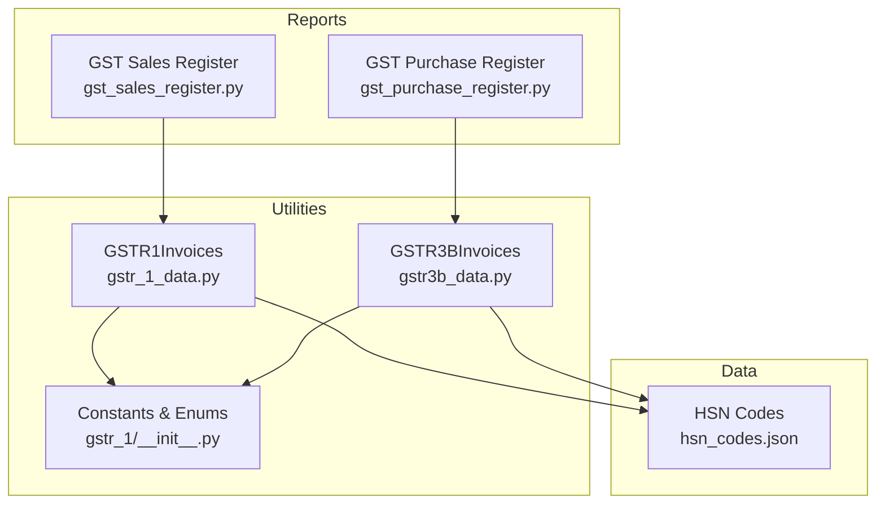
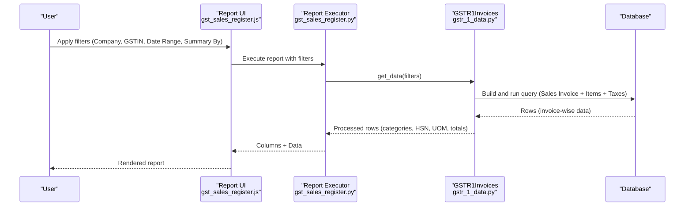
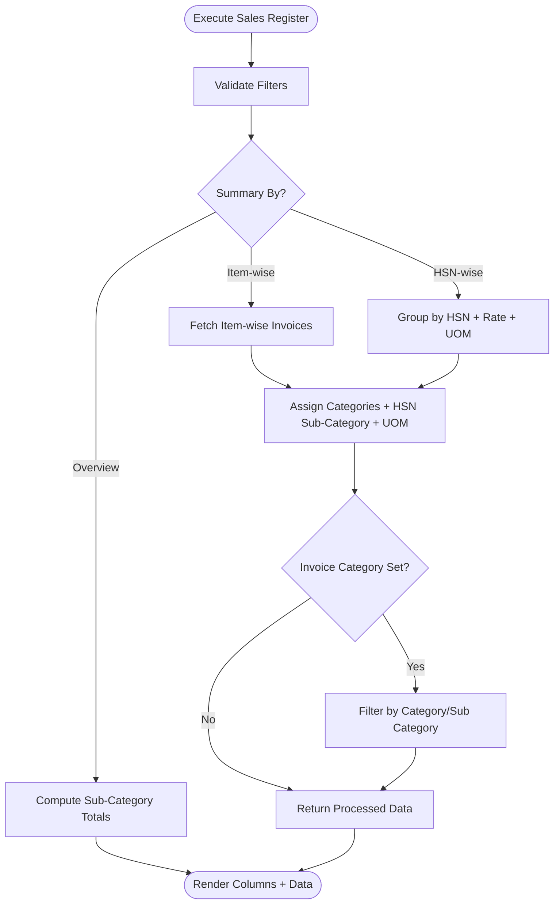
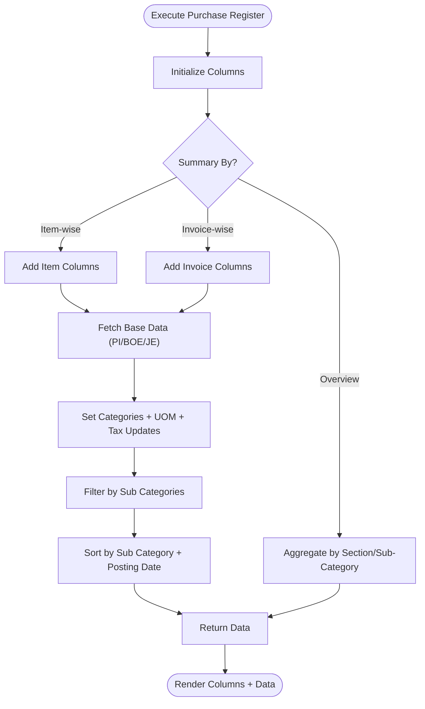
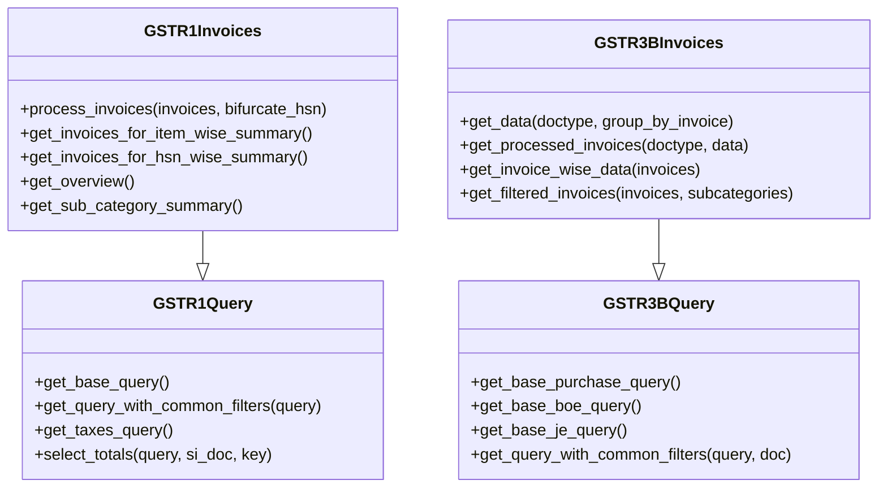
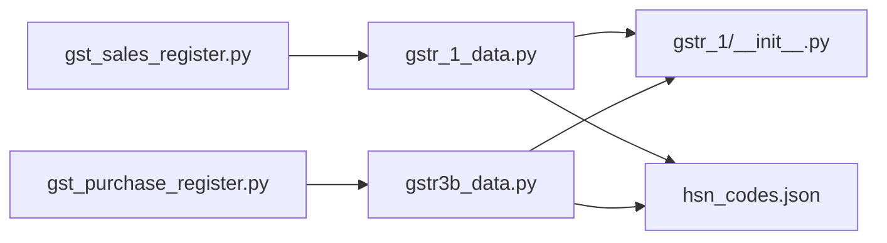

# GST Registers

<cite>
**Referenced Files in This Document**
- [gst_sales_register.py](file://india_compliance/gst_india/report/gst_sales_register/gst_sales_register.py)
- [gst_sales_register.json](file://india_compliance/gst_india/report/gst_sales_register/gst_sales_register.json)
- [gst_sales_register.js](file://india_compliance/gst_india/report/gst_sales_register/gst_sales_register.js)
- [gst_purchase_register.py](file://india_compliance/gst_india/report/gst_purchase_register/gst_purchase_register.py)
- [gst_purchase_register.json](file://india_compliance/gst_india/report/gst_purchase_register/gst_purchase_register.json)
- [gst_purchase_register.js](file://india_compliance/gst_india/report/gst_purchase_register/gst_purchase_register.js)
- [gstr_1_data.py](file://india_compliance/gst_india/utils/gstr_1/gstr_1_data.py)
- [gstr3b_data.py](file://india_compliance/gst_india/utils/gstr3b/gstr3b_data.py)
- [__init__.py](file://india_compliance/gst_india/utils/gstr_1/__init__.py)
- [hsn_codes.json](file://india_compliance/gst_india/data/hsn_codes.json)
</cite>

## Table of Contents
1. [Introduction](#introduction)
2. [Project Structure](#project-structure)
3. [Core Components](#core-components)
4. [Architecture Overview](#architecture-overview)
5. [Detailed Component Analysis](#detailed-component-analysis)
6. [Dependency Analysis](#dependency-analysis)
7. [Performance Considerations](#performance-considerations)
8. [Troubleshooting Guide](#troubleshooting-guide)
9. [Conclusion](#conclusion)
10. [Appendices](#appendices)

## Introduction
This document explains the GST register reports for sales and purchase registers in the India Compliance module. It covers:
- Register doctype structure and report execution pipeline
- Data aggregation and tax component breakdown
- Tax rate classification and invoice categorization
- Differences between standard and beta versions (where applicable)
- Invoice-wise tax computation, HSN code mapping, and supplier/customer categorization
- Practical examples for generating registers, filtering by date ranges and categories, and exporting
- Performance considerations, indexing strategies, and validation rules
- Common issues and resolutions

## Project Structure
The GST registers are implemented as Frappe Script Reports backed by utility classes that construct optimized database queries and compute tax summaries.

**Diagram sources**
- [gst_sales_register.py](file://india_compliance/gst_india/report/gst_sales_register/gst_sales_register.py#L12-L55)
- [gst_purchase_register.py](file://india_compliance/gst_india/report/gst_purchase_register/gst_purchase_register.py#L49-L308)
- [gstr_1_data.py](file://india_compliance/gst_india/utils/gstr_1/gstr_1_data.py#L437-L677)
- [gstr3b_data.py](file://india_compliance/gst_india/utils/gstr3b/gstr3b_data.py#L307-L423)
- [__init__.py](file://india_compliance/gst_india/utils/gstr_1/__init__.py#L6-L96)
- [hsn_codes.json](file://india_compliance/gst_india/data/hsn_codes.json#L1-L200)

**Section sources**
- [gst_sales_register.py](file://india_compliance/gst_india/report/gst_sales_register/gst_sales_register.py#L12-L17)
- [gst_purchase_register.py](file://india_compliance/gst_india/report/gst_purchase_register/gst_purchase_register.py#L49-L55)
- [gstr_1_data.py](file://india_compliance/gst_india/utils/gstr_1/gstr_1_data.py#L64-L163)
- [gstr3b_data.py](file://india_compliance/gst_india/utils/gstr3b/gstr3b_data.py#L132-L304)
- [__init__.py](file://india_compliance/gst_india/utils/gstr_1/__init__.py#L6-L96)

## Core Components
- GST Sales Register
  - Filters: Company, Company GSTIN, Date Range, Summary By, Invoice Category, Invoice Sub Category
  - Data source: GSTR1Invoices for item-wise, HSN-wise, and overview summaries
  - Columns: Customer, GSTIN, Place of Supply, Taxable Values, CGST/SGST/IGST, Cess, Totals, Invoice Type, and optional e-commerce fields
- GST Purchase Register
  - Filters: Company, Company GSTIN, Date Range, Summary By, Sub Section, Invoice Sub Category
  - Data source: GSTR3BInvoices for Purchase Invoice, Bill of Entry, and Journal Entry
  - Columns: Voucher Type/No, Posting Date, Supplier GSTIN, Taxable Values, CGST/SGST/IGST, Cess, Totals, and categorized by ITC sections

**Section sources**
- [gst_sales_register.py](file://india_compliance/gst_india/report/gst_sales_register/gst_sales_register.py#L12-L110)
- [gst_sales_register.js](file://india_compliance/gst_india/report/gst_sales_register/gst_sales_register.js#L26-L96)
- [gst_purchase_register.py](file://india_compliance/gst_india/report/gst_purchase_register/gst_purchase_register.py#L49-L88)
- [gst_purchase_register.js](file://india_compliance/gst_india/report/gst_purchase_register/gst_purchase_register.js#L39-L111)

## Architecture Overview
The register reports follow a layered architecture:
- Report scripts orchestrate filters and render columns
- Utility classes build SQL-like queries via Frappe Query Builder
- Category and sub-category logic classifies invoices according to GSTR-1/GSTR-3B rules
- Constants define categories, sub-categories, and thresholds

**Diagram sources**
- [gst_sales_register.js](file://india_compliance/gst_india/report/gst_sales_register/gst_sales_register.js#L26-L96)
- [gst_sales_register.py](file://india_compliance/gst_india/report/gst_sales_register/gst_sales_register.py#L12-L55)
- [gstr_1_data.py](file://india_compliance/gst_india/utils/gstr_1/gstr_1_data.py#L64-L163)

## Detailed Component Analysis

### GST Sales Register
- Execution flow
  - Filters validated and transformed into from_date/to_date
  - Data retrieval based on Summary By:
    - Item-wise: fetch invoice items
    - HSN-wise: group by invoice_no, HSN, rate, treatment, UOM
    - Overview: compute sub-category totals
  - Optional filtering by Invoice Category/Sub Category
  - Post-processing: assign categories, HSN sub-category, UOM normalization, and e-commerce supply type
- Columns include:
  - Identity: Posting Date, Invoice Number, Customer Name, GST Category, Billing Address GSTIN, Place of Supply
  - Optional flags: Is Reverse Charge, Is Export with GST
  - Transaction details: Is Return, Is Debit Note, Item Code/Qty, HSN Code, UOM, GST Treatment
  - Tax breakdown: Taxable Value, GST Rate, CGST, SGST, IGST, Total Cess, Total Tax, Total Amount
  - Invoice metadata: Returned Invoice Total, Invoice Type, and optional e-commerce fields
- Filtering and totals:
  - Autocomplete options for Invoice Category/Sub Category
  - Custom column totals for Overview summary

**Diagram sources**
- [gst_sales_register.py](file://india_compliance/gst_india/report/gst_sales_register/gst_sales_register.py#L35-L55)
- [gstr_1_data.py](file://india_compliance/gst_india/utils/gstr_1/gstr_1_data.py#L490-L551)

**Section sources**
- [gst_sales_register.py](file://india_compliance/gst_india/report/gst_sales_register/gst_sales_register.py#L12-L110)
- [gst_sales_register.py](file://india_compliance/gst_india/report/gst_sales_register/gst_sales_register.py#L112-L362)
- [gst_sales_register.js](file://india_compliance/gst_india/report/gst_sales_register/gst_sales_register.js#L26-L151)
- [gstr_1_data.py](file://india_compliance/gst_india/utils/gstr_1/gstr_1_data.py#L437-L677)

### GST Purchase Register
- Execution flow
  - Filters: Company, Company GSTIN, Date Range, Summary By, Sub Section, Invoice Sub Category
  - Data sources: Purchase Invoice, Bill of Entry, Journal Entry (based on Sub Section)
  - Overview mode aggregates by ITC sections; otherwise sorts and filters by sub-category
- Columns include:
  - Identity: Voucher Type, Voucher No, Posting Date
  - Supplier details: GSTIN, GST Category, Place of Supply
  - Tax breakdown: Taxable Value, CGST, SGST, IGST, Cess, Total Tax, Total Amount
  - Invoice metadata: Invoice Type, Invoice Sub Category
- Sub-sections:
  - Section 4: Eligible ITC (ITC Available, ITC Reversed, Ineligible ITC)
  - Section 5: Values of exempt, nil-rated, and non-GST inward supplies

**Diagram sources**
- [gst_purchase_register.py](file://india_compliance/gst_india/report/gst_purchase_register/gst_purchase_register.py#L58-L88)
- [gst_purchase_register.py](file://india_compliance/gst_india/report/gst_purchase_register/gst_purchase_register.py#L283-L308)
- [gstr3b_data.py](file://india_compliance/gst_india/utils/gstr3b/gstr3b_data.py#L307-L423)

**Section sources**
- [gst_purchase_register.py](file://india_compliance/gst_india/report/gst_purchase_register/gst_purchase_register.py#L49-L88)
- [gst_purchase_register.py](file://india_compliance/gst_india/report/gst_purchase_register/gst_purchase_register.py#L168-L281)
- [gst_purchase_register.js](file://india_compliance/gst_india/report/gst_purchase_register/gst_purchase_register.js#L39-L154)
- [gstr3b_data.py](file://india_compliance/gst_india/utils/gstr3b/gstr3b_data.py#L132-L423)

### Data Aggregation and Tax Computation
- Sales Register
  - Base query joins Sales Invoice, Sales Invoice Item, and Taxes subquery
  - Totals computed as rounded/base grand total minus refund tax amounts
  - Tax fields aggregated per item; totals derived from taxable value plus GST components and cess
  - HSN sub-category determined by bifurcation date and party category
- Purchase Register
  - Base queries for Purchase Invoice, Bill of Entry, and Journal Entry
  - Tax values updated for exempt/nil/non-GST categories (split into Inter/Intra-state)
  - ITC classification determines sub-categories and eligibility

**Diagram sources**
- [gstr_1_data.py](file://india_compliance/gst_india/utils/gstr_1/gstr_1_data.py#L64-L213)
- [gstr_1_data.py](file://india_compliance/gst_india/utils/gstr_1/gstr_1_data.py#L437-L677)
- [gstr3b_data.py](file://india_compliance/gst_india/utils/gstr3b/gstr3b_data.py#L132-L304)
- [gstr3b_data.py](file://india_compliance/gst_india/utils/gstr3b/gstr3b_data.py#L307-L423)

**Section sources**
- [gstr_1_data.py](file://india_compliance/gst_india/utils/gstr_1/gstr_1_data.py#L64-L213)
- [gstr_1_data.py](file://india_compliance/gst_india/utils/gstr_1/gstr_1_data.py#L437-L677)
- [gstr3b_data.py](file://india_compliance/gst_india/utils/gstr3b/gstr3b_data.py#L132-L304)
- [gstr3b_data.py](file://india_compliance/gst_india/utils/gstr3b/gstr3b_data.py#L307-L423)

### Tax Rate Classification and HSN Mapping
- Tax rate classification
  - Sales Register: GST Rate is sum of CGST/SGST/IGST rates per item
  - Purchase Register: GST Rate computed similarly; Inter/Intra split for exempt/nil/non-GST
- HSN mapping and bifurcation
  - HSN sub-category set based on party category and bifurcation effective date
  - Special handling for HSN codes starting with “99” (UOM normalized to OTHERS, quantity set to zero)
- Constants and enums
  - GSTR1 categories/sub-categories define classification logic and display labels
  - Thresholds and limits (e.g., B2C limit) influence invoice categorization

**Section sources**
- [gstr_1_data.py](file://india_compliance/gst_india/utils/gstr_1/gstr_1_data.py#L426-L470)
- [gstr_1_data.py](file://india_compliance/gst_india/utils/gstr_1/gstr_1_data.py#L667-L677)
- [__init__.py](file://india_compliance/gst_india/utils/gstr_1/__init__.py#L6-L96)
- [gstr3b_data.py](file://india_compliance/gst_india/utils/gstr3b/gstr3b_data.py#L361-L376)

### Supplier/Customer Categorization
- Customer categorization (Sales)
  - GST Category, Place of Supply, Reverse Charge flag, Export flags
  - E-commerce operator GSTIN and supply type for e-commerce transactions
- Supplier categorization (Purchase)
  - GST Category, Place of Supply, Ineligibility reasons, ITC classification
  - Journal Entry reversals and reclaimed ITC mapped to appropriate sub-categories

**Section sources**
- [gstr_1_data.py](file://india_compliance/gst_india/utils/gstr_1/gstr_1_data.py#L88-L138)
- [gstr3b_data.py](file://india_compliance/gst_india/utils/gstr3b/gstr3b_data.py#L147-L189)
- [gstr3b_data.py](file://india_compliance/gst_india/utils/gstr3b/gstr3b_data.py#L107-L130)

### Practical Examples
- Generating a register
  - Open the report, select Company and Date Range, choose Summary By (Item/HSN/Overview)
  - For Sales Register, optionally filter by Invoice Category/Sub Category
  - For Purchase Register, select Sub Section (4 or 5) and Sub Categories
- Filtering by date ranges and tax rates
  - Use Date Range filter; Sales Register supports Invoice Category/Sub Category filters
  - Purchase Register supports MultiSelectList of Sub Categories under current Summary By
- Export procedures
  - Use Frappe’s built-in export to CSV/XLSX from the report interface

**Section sources**
- [gst_sales_register.js](file://india_compliance/gst_india/report/gst_sales_register/gst_sales_register.js#L26-L96)
- [gst_purchase_register.js](file://india_compliance/gst_india/report/gst_purchase_register/gst_purchase_register.js#L39-L111)

## Dependency Analysis
- Report-to-utility dependencies
  - Sales Register depends on GSTR1Invoices for data retrieval and processing
  - Purchase Register depends on GSTR3BInvoices for multi-document aggregation
- Utility-to-constants dependencies
  - Category/sub-category enums and mappings drive classification logic
- Data dependencies
  - HSN codes dataset provides lookup for HSN descriptions and validations

**Diagram sources**
- [gst_sales_register.py](file://india_compliance/gst_india/report/gst_sales_register/gst_sales_register.py#L36-L55)
- [gst_purchase_register.py](file://india_compliance/gst_india/report/gst_purchase_register/gst_purchase_register.py#L285-L298)
- [gstr_1_data.py](file://india_compliance/gst_india/utils/gstr_1/gstr_1_data.py#L437-L677)
- [gstr3b_data.py](file://india_compliance/gst_india/utils/gstr3b/gstr3b_data.py#L307-L423)
- [__init__.py](file://india_compliance/gst_india/utils/gstr_1/__init__.py#L6-L96)
- [hsn_codes.json](file://india_compliance/gst_india/data/hsn_codes.json#L1-L200)

**Section sources**
- [gst_sales_register.py](file://india_compliance/gst_india/report/gst_sales_register/gst_sales_register.py#L36-L55)
- [gst_purchase_register.py](file://india_compliance/gst_india/report/gst_purchase_register/gst_purchase_register.py#L285-L298)
- [gstr_1_data.py](file://india_compliance/gst_india/utils/gstr_1/gstr_1_data.py#L437-L677)
- [gstr3b_data.py](file://india_compliance/gst_india/utils/gstr3b/gstr3b_data.py#L307-L423)

## Performance Considerations
- Query optimization
  - Use of Query Builder with explicit joins and grouping minimizes Python-side aggregation
  - Sorting by posting date, invoice number, and item code ensures deterministic ordering
- Indexing strategies
  - Recommended indexes for high-volume environments:
    - Sales Invoice: company, company_gstin, posting_date, docstatus, is_opening, billing_address_gstin
    - Sales Invoice Item: parent, item_code, gst_hsn_code, uom
    - Purchase/Payment-related documents: company, company_gstin, supplier_gstin, posting_date, docstatus
- Pagination and slicing
  - For large datasets, prefer narrower date ranges and targeted filters
- Caching
  - Reuse computed UOM mappings and category assignments per batch to reduce repeated lookups

[No sources needed since this section provides general guidance]

## Troubleshooting Guide
- Incorrect tax calculations
  - Verify invoice totals computation and refund tax adjustments
  - Ensure HSN bifurcation date logic aligns with reporting period
- Missing invoice details
  - Confirm filters for Company, GSTIN, and Date Range
  - Check for returned invoices and their impact on totals
- Formatting inconsistencies
  - Validate UOM normalization for HSN “99” items
  - Confirm invoice sub-category assignment for e-commerce and export scenarios
- Validation rules
  - Ensure mandatory fields (e.g., GSTIN, Place of Supply) are populated for registered parties
  - Validate B2C thresholds and inter-state logic for B2CL classification

**Section sources**
- [gstr_1_data.py](file://india_compliance/gst_india/utils/gstr_1/gstr_1_data.py#L197-L212)
- [gstr_1_data.py](file://india_compliance/gst_india/utils/gstr_1/gstr_1_data.py#L453-L470)
- [gstr3b_data.py](file://india_compliance/gst_india/utils/gstr3b/gstr3b_data.py#L361-L376)

## Conclusion
The GST Sales and Purchase Registers provide robust, standards-aligned reporting with precise tax breakdowns and flexible filtering. Their architecture leverages reusable utility classes and standardized constants to ensure accuracy and maintainability. For large datasets, careful use of filters, recommended indexes, and batch processing will optimize performance.

## Appendices

### Appendix A: Report Definitions
- GST Sales Register
  - Reference doctype: Sales Invoice
  - Roles: Accounts Manager, Accounts User
- GST Purchase Register
  - Reference doctype: Purchase Invoice
  - Roles: Purchase User, Accounts User, Auditor, Accounts Manager

**Section sources**
- [gst_sales_register.json](file://india_compliance/gst_india/report/gst_sales_register/gst_sales_register.json#L1-L29)
- [gst_purchase_register.json](file://india_compliance/gst_india/report/gst_purchase_register/gst_purchase_register.json#L1-L35)