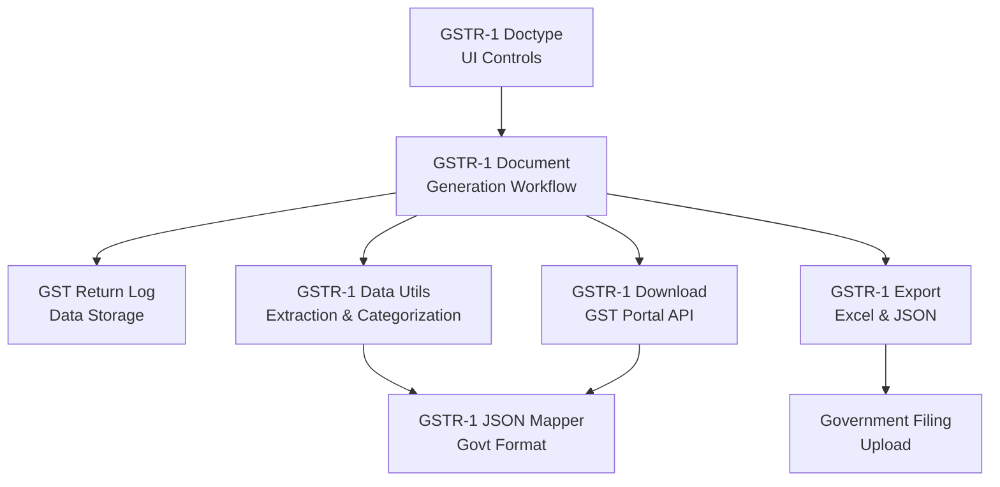
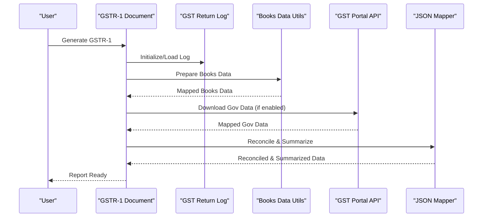
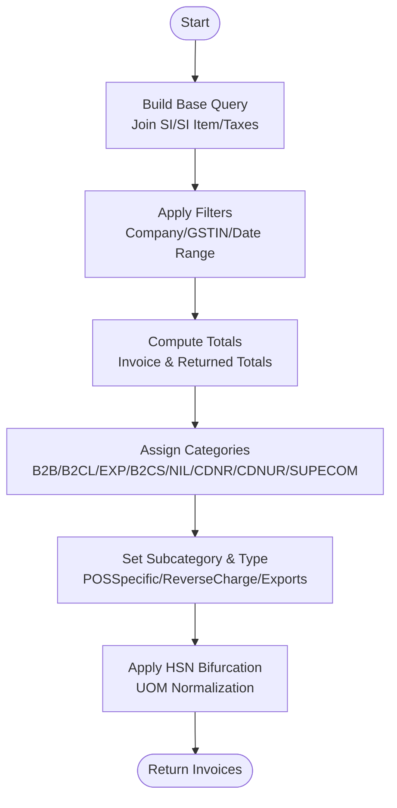
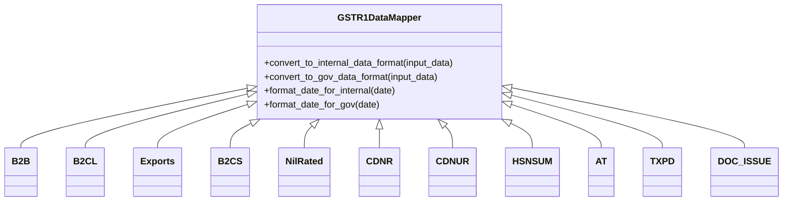
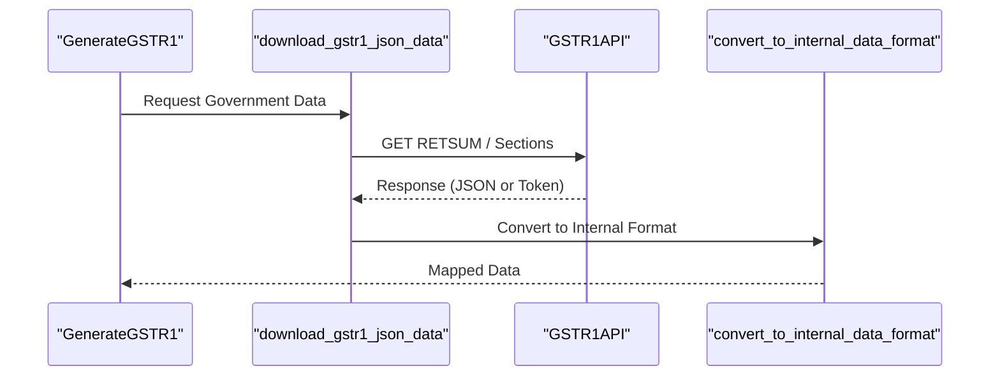
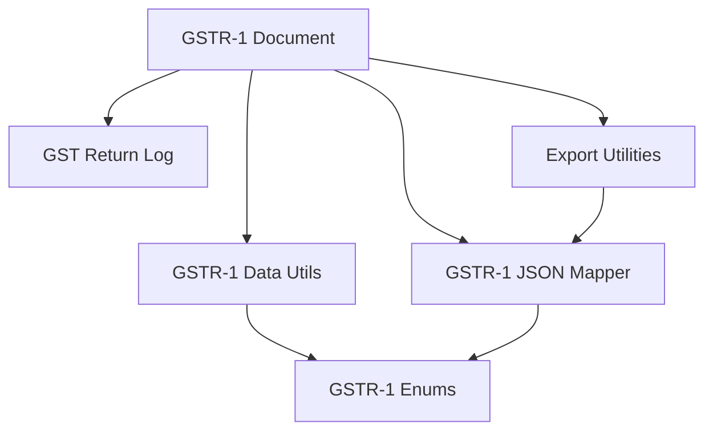

# GSTR-1 Report

<cite>
**Referenced Files in This Document**
- [gstr_1.py](file://india_compliance/gst_india/doctype/gstr_1/gstr_1.py)
- [gstr_1.json](file://india_compliance/gst_india/doctype/gstr_1/gstr_1.json)
- [gstr_1_export.py](file://india_compliance/gst_india/doctype/gstr_1/gstr_1_export.py)
- [generate_gstr_1.py](file://india_compliance/gst_india/doctype/gst_return_log/generate_gstr_1.py)
- [gstr_1_data.py](file://india_compliance/gst_india/utils/gstr_1/gstr_1_data.py)
- [gstr_1_download.py](file://india_compliance/gst_india/utils/gstr_1/gstr_1_download.py)
- [gstr_1_json_map.py](file://india_compliance/gst_india/utils/gstr_1/gstr_1_json_map.py)
- [__init__.py](file://india_compliance/gst_india/utils/gstr_1/__init__.py)
</cite>

## Table of Contents
1. [Introduction](#introduction)
2. [Project Structure](#project-structure)
3. [Core Components](#core-components)
4. [Architecture Overview](#architecture-overview)
5. [Detailed Component Analysis](#detailed-component-analysis)
6. [Dependency Analysis](#dependency-analysis)
7. [Performance Considerations](#performance-considerations)
8. [Troubleshooting Guide](#troubleshooting-guide)
9. [Conclusion](#conclusion)

## Introduction
This document explains the GSTR-1 report functionality in the India Compliance module. It covers invoice-wise data extraction from sales invoices, categorization into GSTR-1 categories, tax component calculations, filing preparation, and integration with the GST portal. It also details the GSTR-1 doctype structure, validation rules, filing status tracking, and practical workflows for report generation, filing, and error handling. Guidance is provided for performance optimization, caching strategies, and common issues such as duplicate invoices, missing GST details, and filing errors.

## Project Structure
The GSTR-1 implementation spans several modules:
- Doctype definition and UI controls for GSTR-1
- Data extraction and categorization utilities
- Government JSON mapping and reconciliation logic
- Download and upload orchestration with the GST portal
- Excel export and JSON generation for filing

**Diagram sources**
- [gstr_1.py](file://india_compliance/gst_india/doctype/gstr_1/gstr_1.py#L71-L192)
- [generate_gstr_1.py](file://india_compliance/gst_india/doctype/gst_return_log/generate_gstr_1.py#L595-L687)
- [gstr_1_data.py](file://india_compliance/gst_india/utils/gstr_1/gstr_1_data.py#L64-L163)
- [gstr_1_download.py](file://india_compliance/gst_india/utils/gstr_1/gstr_1_download.py#L30-L93)
- [gstr_1_export.py](file://india_compliance/gst_india/doctype/gstr_1/gstr_1_export.py#L2120-L2194)

**Section sources**
- [gstr_1.py](file://india_compliance/gst_india/doctype/gstr_1/gstr_1.py#L1-L509)
- [gstr_1.json](file://india_compliance/gst_india/doctype/gstr_1/gstr_1.json#L1-L147)

## Core Components
- GSTR-1 Doctype: Provides filters (company, company GSTIN, year, month/quarter, filing preference) and UI tabs for report display.
- GSTR-1 Document: Orchestrates report generation, downloads government data, reconciles books vs government data, and publishes progress.
- GST Return Log: Stores computed data, statuses, and summary views for books, government, and reconciliation.
- GSTR-1 Data Utils: Builds invoice queries, applies categorization rules, aggregates totals, and handles HSN bifurcation.
- JSON Mapper: Converts internal data to government JSON format and vice versa, including subcategory mapping and field normalization.
- Download/Upload: Interfaces with GST portal APIs to fetch unfiled/filial data and prepare JSON for filing.
- Export Utilities: Generates Excel sheets for government, books, and reconciliation views.

**Section sources**
- [gstr_1.py](file://india_compliance/gst_india/doctype/gstr_1/gstr_1.py#L29-L192)
- [generate_gstr_1.py](file://india_compliance/gst_india/doctype/gst_return_log/generate_gstr_1.py#L567-L740)
- [gstr_1_data.py](file://india_compliance/gst_india/utils/gstr_1/gstr_1_data.py#L437-L677)
- [gstr_1_json_map.py](file://india_compliance/gst_india/utils/gstr_1/gstr_1_json_map.py#L43-L135)
- [gstr_1_download.py](file://india_compliance/gst_india/utils/gstr_1/gstr_1_download.py#L30-L93)
- [gstr_1_export.py](file://india_compliance/gst_india/doctype/gstr_1/gstr_1_export.py#L118-L227)

## Architecture Overview
The GSTR-1 workflow integrates local ERP data with the GST portal:
- Local data extraction via SQL queries and categorization
- Optional government data retrieval and reconciliation
- Summary computation and export for filing

**Diagram sources**
- [gstr_1.py](file://india_compliance/gst_india/doctype/gstr_1/gstr_1.py#L71-L192)
- [generate_gstr_1.py](file://india_compliance/gst_india/doctype/gst_return_log/generate_gstr_1.py#L595-L687)
- [gstr_1_download.py](file://india_compliance/gst_india/utils/gstr_1/gstr_1_download.py#L30-L93)
- [gstr_1_json_map.py](file://india_compliance/gst_india/utils/gstr_1/gstr_1_json_map.py#L43-L135)

## Detailed Component Analysis

### GSTR-1 Doctype and Validation Rules
- Fields: Company, Company GSTIN, Year, Month/Quarter, Filing Preference, Tabs HTML placeholders.
- Validation: Required fields enforced; filing preference defaults to Monthly if not set.
- Actions: Generate, Sync with GSTN, Mark as Filed, Reconcile Books, Net GST Liability, Journal Entry helpers.

Practical usage:
- Generate GSTR-1 for a period; if API credentials are missing, only books data is produced.
- Mark as Filed checks portal status and updates filing status accordingly.

**Section sources**
- [gstr_1.json](file://india_compliance/gst_india/doctype/gstr_1/gstr_1.json#L23-L103)
- [gstr_1.py](file://india_compliance/gst_india/doctype/gstr_1/gstr_1.py#L30-L192)

### Data Extraction and Categorization
- Base query joins Sales Invoice, Sales Invoice Item, and Taxes to extract invoice-level details.
- Conditions:
  - Document status = submitted
  - Not opening entry
  - Billing GSTIN differs from company GSTIN (for outward supplies)
  - Filters by company, company GSTIN, and date range
- Totals: Computes invoice-level totals and returned invoice totals, adjusts for refund taxes.
- Categorization:
  - Uses conditions to classify invoices into B2B, B2CL, EXP, B2CS, NIL_EXEMPT, CDNR, CDNUR, SUPECOM.
  - Subcategory mapping sets invoice type and place-of-supply specifics.
- HSN bifurcation: Applies HSN grouping and UOM normalization based on settings and date thresholds.

**Diagram sources**
- [gstr_1_data.py](file://india_compliance/gst_india/utils/gstr_1/gstr_1_data.py#L75-L163)
- [gstr_1_data.py](file://india_compliance/gst_india/utils/gstr_1/gstr_1_data.py#L227-L478)
- [gstr_1_data.py](file://india_compliance/gst_india/utils/gstr_1/gstr_1_data.py#L437-L551)

**Section sources**
- [gstr_1_data.py](file://india_compliance/gst_india/utils/gstr_1/gstr_1_data.py#L64-L163)
- [gstr_1_data.py](file://india_compliance/gst_india/utils/gstr_1/gstr_1_data.py#L227-L478)
- [gstr_1_data.py](file://india_compliance/gst_india/utils/gstr_1/gstr_1_data.py#L437-L551)
- [__init__.py](file://india_compliance/gst_india/utils/gstr_1/__init__.py#L65-L96)

### Government JSON Mapping and Reconciliation
- Mapper classes convert government JSON to internal format and vice versa for each subcategory (B2B, B2CL, EXP, B2CS, NIL_EXEMPT, CDNR, CDNUR, HSNSUM, AT, TXPD, DOC_ISSUE).
- Field normalization, date conversion, and amount adjustments are handled per category.
- Reconciliation compares books vs government data, computes differences, and marks upload status.

**Diagram sources**
- [gstr_1_json_map.py](file://india_compliance/gst_india/utils/gstr_1/gstr_1_json_map.py#L43-L135)
- [gstr_1_json_map.py](file://india_compliance/gst_india/utils/gstr_1/gstr_1_json_map.py#L137-L287)
- [gstr_1_json_map.py](file://india_compliance/gst_india/utils/gstr_1/gstr_1_json_map.py#L289-L424)
- [gstr_1_json_map.py](file://india_compliance/gst_india/utils/gstr_1/gstr_1_json_map.py#L426-L570)
- [gstr_1_json_map.py](file://india_compliance/gst_india/utils/gstr_1/gstr_1_json_map.py#L572-L772)
- [gstr_1_json_map.py](file://india_compliance/gst_india/utils/gstr_1/gstr_1_json_map.py#L774-L958)
- [gstr_1_json_map.py](file://india_compliance/gst_india/utils/gstr_1/gstr_1_json_map.py#L960-L1110)
- [gstr_1_json_map.py](file://india_compliance/gst_india/utils/gstr_1/gstr_1_json_map.py#L1112-L1294)
- [gstr_1_json_map.py](file://india_compliance/gst_india/utils/gstr_1/gstr_1_json_map.py#L1296-L1466)
- [gstr_1_json_map.py](file://india_compliance/gst_india/utils/gstr_1/gstr_1_json_map.py#L1473-L1599)

**Section sources**
- [gstr_1_json_map.py](file://india_compliance/gst_india/utils/gstr_1/gstr_1_json_map.py#L43-L135)
- [gstr_1_json_map.py](file://india_compliance/gst_india/utils/gstr_1/gstr_1_json_map.py#L137-L287)
- [gstr_1_json_map.py](file://india_compliance/gst_india/utils/gstr_1/gstr_1_json_map.py#L289-L424)
- [gstr_1_json_map.py](file://india_compliance/gst_india/utils/gstr_1/gstr_1_json_map.py#L426-L570)
- [gstr_1_json_map.py](file://india_compliance/gst_india/utils/gstr_1/gstr_1_json_map.py#L572-L772)
- [gstr_1_json_map.py](file://india_compliance/gst_india/utils/gstr_1/gstr_1_json_map.py#L774-L958)
- [gstr_1_json_map.py](file://india_compliance/gst_india/utils/gstr_1/gstr_1_json_map.py#L960-L1110)
- [gstr_1_json_map.py](file://india_compliance/gst_india/utils/gstr_1/gstr_1_json_map.py#L1112-L1294)
- [gstr_1_json_map.py](file://india_compliance/gst_india/utils/gstr_1/gstr_1_json_map.py#L1296-L1466)
- [gstr_1_json_map.py](file://india_compliance/gst_india/utils/gstr_1/gstr_1_json_map.py#L1473-L1599)

### Government Portal Integration
- Download: Retrieves government data for the selected period, determines sections to download, handles queued requests, and maps to internal format.
- Upload: Prepares JSON for filing, validates presence of mandatory HSN codes, and triggers upload actions.

**Diagram sources**
- [generate_gstr_1.py](file://india_compliance/gst_india/doctype/gst_return_log/generate_gstr_1.py#L689-L704)
- [gstr_1_download.py](file://india_compliance/gst_india/utils/gstr_1/gstr_1_download.py#L30-L93)
- [gstr_1_download.py](file://india_compliance/gst_india/utils/gstr_1/gstr_1_download.py#L119-L125)

**Section sources**
- [gstr_1_download.py](file://india_compliance/gst_india/utils/gstr_1/gstr_1_download.py#L30-L93)
- [gstr_1_download.py](file://india_compliance/gst_india/utils/gstr_1/gstr_1_download.py#L96-L125)

### Report Generation and Filing Preparation
- Generation workflow:
  - Validates API availability and filing status
  - Downloads government data (if applicable)
  - Builds books data via GSTR-1 data utils
  - Reconciles and summarizes data
  - Publishes real-time updates
- Export:
  - Government Excel: Matches offline tool format, handles HSN bifurcation versioning
  - Books Excel: Includes invoices and supporting sheets (NIL_EXEMPT, HSN, AT, TXP, DOC_ISSUE)
  - Reconcile Excel: Highlights differences between books and government data
  - JSON for Filing: Validates HSN codes and prepares government-ready JSON

**Section sources**
- [gstr_1.py](file://india_compliance/gst_india/doctype/gstr_1/gstr_1.py#L71-L192)
- [generate_gstr_1.py](file://india_compliance/gst_india/doctype/gst_return_log/generate_gstr_1.py#L595-L687)
- [gstr_1_export.py](file://india_compliance/gst_india/doctype/gstr_1/gstr_1_export.py#L118-L227)
- [gstr_1_export.py](file://india_compliance/gst_india/doctype/gstr_1/gstr_1_export.py#L802-L848)
- [gstr_1_export.py](file://india_compliance/gst_india/doctype/gstr_1/gstr_1_export.py#L1208-L1336)
- [gstr_1_export.py](file://india_compliance/gst_india/doctype/gstr_1/gstr_1_export.py#L2120-L2194)

## Dependency Analysis
Key dependencies and relationships:
- GSTR-1 Document depends on GST Return Log for status and persisted data.
- Data extraction relies on Sales Invoice and Taxes queries.
- JSON mapping depends on category/subcategory enums and field mappings.
- Export utilities depend on mapped data and template versions.

**Diagram sources**
- [gstr_1.py](file://india_compliance/gst_india/doctype/gstr_1/gstr_1.py#L71-L192)
- [gstr_1_data.py](file://india_compliance/gst_india/utils/gstr_1/gstr_1_data.py#L64-L163)
- [__init__.py](file://india_compliance/gst_india/utils/gstr_1/__init__.py#L65-L96)
- [gstr_1_json_map.py](file://india_compliance/gst_india/utils/gstr_1/gstr_1_json_map.py#L43-L135)
- [gstr_1_export.py](file://india_compliance/gst_india/doctype/gstr_1/gstr_1_export.py#L118-L227)

**Section sources**
- [gstr_1.py](file://india_compliance/gst_india/doctype/gstr_1/gstr_1.py#L71-L192)
- [gstr_1_data.py](file://india_compliance/gst_india/utils/gstr_1/gstr_1_data.py#L64-L163)
- [gstr_1_json_map.py](file://india_compliance/gst_india/utils/gstr_1/gstr_1_json_map.py#L43-L135)
- [gstr_1_export.py](file://india_compliance/gst_india/doctype/gstr_1/gstr_1_export.py#L118-L227)

## Performance Considerations
- Query optimization:
  - Use indexed fields (company, company_gstin, posting_date) and appropriate WHERE clauses to minimize dataset size.
  - Group by invoice-level fields to reduce row duplication before summarization.
- Caching:
  - Persist computed books data and summaries in GST Return Log to avoid recomputation until filters or preferences change.
  - Cache category/subcategory mappings and HSN/UOM conversions.
- Batch processing:
  - Enqueue long-running tasks (generate_gstr1) to prevent UI timeouts.
- Data volume:
  - Filter by month/quarter and filing preference to limit scope.
  - Aggregate B2CS, NIL_EXEMPT, AT, TXP, and DOC_ISSUE data to reduce row counts.

[No sources needed since this section provides general guidance]

## Troubleshooting Guide
Common issues and resolutions:
- Duplicate invoices:
  - Use reconciliation to identify mismatches; adjust upload status and review differences.
- Missing GST details:
  - Ensure HSN codes are present for all invoices; filing JSON validation throws an error if missing.
- Filing errors:
  - Verify API credentials and token validity; regenerate token if needed.
  - Check queued downloads; retry after estimated wait time.
- Large datasets:
  - Narrow filters (company, GSTIN, date range); use quarterly/monthly preference appropriately.
- Journal entries for reduced liability:
  - Use helper functions to derive GST output accounts and round-off account; create and submit journal entries as needed.

**Section sources**
- [gstr_1_export.py](file://india_compliance/gst_india/doctype/gstr_1/gstr_1_export.py#L2152-L2157)
- [gstr_1_download.py](file://india_compliance/gst_india/utils/gstr_1/gstr_1_download.py#L61-L92)
- [gstr_1.py](file://india_compliance/gst_india/doctype/gstr_1/gstr_1.py#L271-L416)

## Conclusion
The GSTR-1 report integrates ERP invoice data with government filing requirements through robust categorization, reconciliation, and export mechanisms. By leveraging cached data, batch processing, and structured validation, organizations can reliably generate reports, reconcile discrepancies, and file returns efficiently. Proper handling of edge cases (missing HSN, duplicates, queued downloads) ensures smoother operations and fewer filing errors.