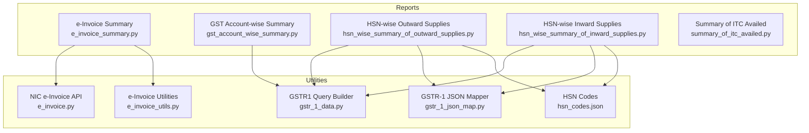
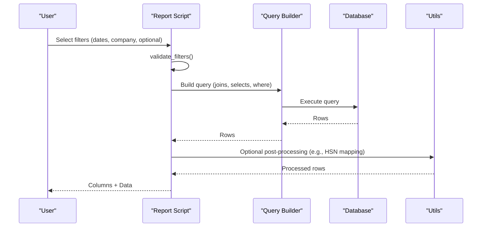
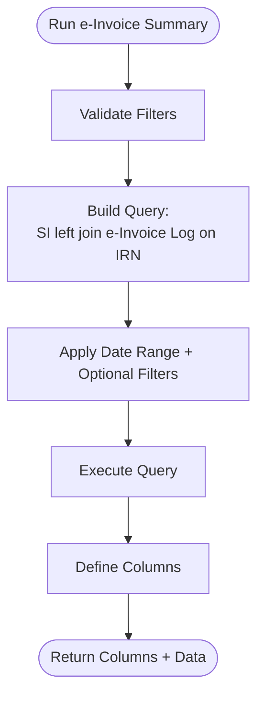
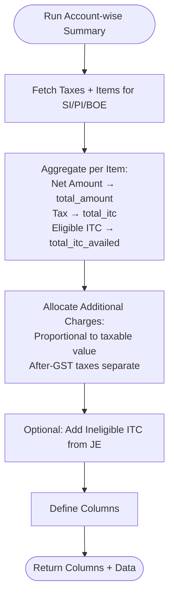
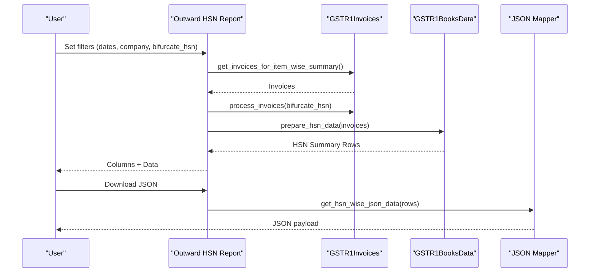
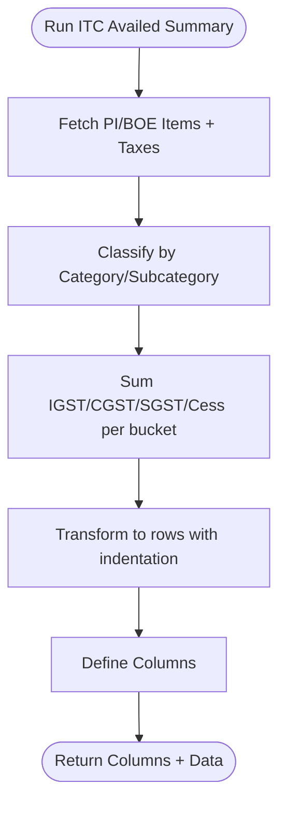
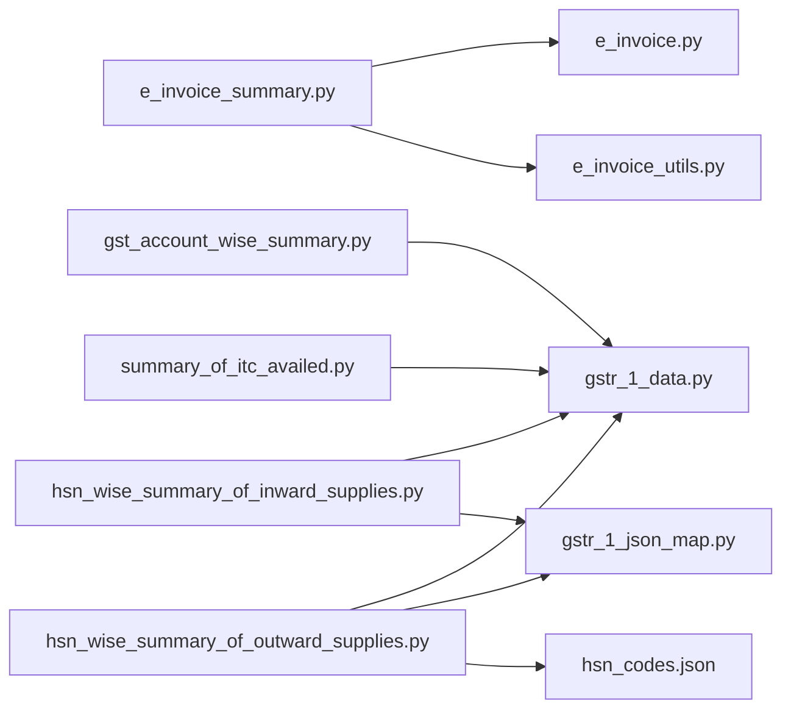

# Summary Reports

<cite>
**Referenced Files in This Document**
- [e_invoice_summary.py](file://india_compliance/gst_india/report/e_invoice_summary/e_invoice_summary.py)
- [e_invoice_summary.json](file://india_compliance/gst_india/report/e_invoice_summary/e_invoice_summary.json)
- [gst_account_wise_summary.py](file://india_compliance/gst_india/report/gst_account_wise_summary/gst_account_wise_summary.py)
- [gst_account_wise_summary.json](file://india_compliance/gst_india/report/gst_account_wise_summary/gst_account_wise_summary.json)
- [hsn_wise_summary_of_outward_supplies.py](file://india_compliance/gst_india/report/hsn_wise_summary_of_outward_supplies/hsn_wise_summary_of_outward_supplies.py)
- [hsn_wise_summary_of_outward_supplies.json](file://india_compliance/gst_india/report/hsn_wise_summary_of_outward_supplies/hsn_wise_summary_of_outward_supplies.json)
- [hsn_wise_summary_of_inward_supplies.py](file://india_compliance/gst_india/report/hsn_wise_summary_of_inward_supplies/hsn_wise_summary_of_inward_supplies.py)
- [summary_of_itc_availed.py](file://india_compliance/gst_india/report/summary_of_itc_availed/summary_of_itc_availed.py)
- [summary_of_itc_availed.json](file://india_compliance/gst_india/report/summary_of_itc_availed/summary_of_itc_availed.json)
- [hsn_codes.json](file://india_compliance/gst_india/data/hsn_codes.json)
- [gstr_1_data.py](file://india_compliance/gst_india/utils/gstr_1/gstr_1_data.py)
- [gstr_1_json_map.py](file://india_compliance/gst_india/utils/gstr_1/gstr_1_json_map.py)
- [e_invoice.py](file://india_compliance/gst_india/api_classes/nic/e_invoice.py)
- [e_invoice_utils.py](file://india_compliance/gst_india/utils/e_invoice.py)
</cite>

## Table of Contents
1. [Introduction](#introduction)
2. [Project Structure](#project-structure)
3. [Core Components](#core-components)
4. [Architecture Overview](#architecture-overview)
5. [Detailed Component Analysis](#detailed-component-analysis)
6. [Dependency Analysis](#dependency-analysis)
7. [Performance Considerations](#performance-considerations)
8. [Troubleshooting Guide](#troubleshooting-guide)
9. [Conclusion](#conclusion)
10. [Appendices](#appendices)

## Introduction
This document explains the summary reports for e-invoice tracking, account-wise GST summaries, HSN-wise outward supplies, and ITC availed summaries. It covers data aggregation logic, IRN tracking, account classification, tax component summarization, HSN product categorization, quantity/value aggregation, filtering, export formats, performance optimization, caching strategies, and data accuracy validation. Practical examples and common issues/solutions are included to guide users and developers.

## Project Structure
The summary reports are implemented as Script Reports under the GST India module. Each report defines:
- A Python script that builds filters, queries, aggregates, and returns columns/data
- A JSON fixture defining roles, report metadata, and permissions
- Shared utilities for GSTR-1/HSN processing and e-invoice APIs

**Diagram sources**
- [e_invoice_summary.py](file://india_compliance/gst_india/report/e_invoice_summary/e_invoice_summary.py#L10-L172)
- [gst_account_wise_summary.py](file://india_compliance/gst_india/report/gst_account_wise_summary/gst_account_wise_summary.py#L17-L397)
- [hsn_wise_summary_of_outward_supplies.py](file://india_compliance/gst_india/report/hsn_wise_summary_of_outward_supplies/hsn_wise_summary_of_outward_supplies.py#L15-L272)
- [hsn_wise_summary_of_inward_supplies.py](file://india_compliance/gst_india/report/hsn_wise_summary_of_inward_supplies/hsn_wise_summary_of_inward_supplies.py#L9-L29)
- [gstr_1_data.py](file://india_compliance/gst_india/utils/gstr_1/gstr_1_data.py#L64-L200)
- [gstr_1_json_map.py](file://india_compliance/gst_india/utils/gstr_1/gstr_1_json_map.py#L1-L200)
- [e_invoice.py](file://india_compliance/gst_india/api_classes/nic/e_invoice.py#L215-L260)
- [e_invoice_utils.py](file://india_compliance/gst_india/utils/e_invoice.py#L474-L535)
- [hsn_codes.json](file://india_compliance/gst_india/data/hsn_codes.json#L1-L800)

**Section sources**
- [e_invoice_summary.py](file://india_compliance/gst_india/report/e_invoice_summary/e_invoice_summary.py#L10-L172)
- [gst_account_wise_summary.py](file://india_compliance/gst_india/report/gst_account_wise_summary/gst_account_wise_summary.py#L17-L397)
- [hsn_wise_summary_of_outward_supplies.py](file://india_compliance/gst_india/report/hsn_wise_summary_of_outward_supplies/hsn_wise_summary_of_outward_supplies.py#L15-L272)
- [hsn_wise_summary_of_inward_supplies.py](file://india_compliance/gst_india/report/hsn_wise_summary_of_inward_supplies/hsn_wise_summary_of_inward_supplies.py#L9-L29)
- [gstr_1_data.py](file://india_compliance/gst_india/utils/gstr_1/gstr_1_data.py#L64-L200)
- [gstr_1_json_map.py](file://india_compliance/gst_india/utils/gstr_1/gstr_1_json_map.py#L1-L200)
- [e_invoice.py](file://india_compliance/gst_india/api_classes/nic/e_invoice.py#L215-L260)
- [e_invoice_utils.py](file://india_compliance/gst_india/utils/e_invoice.py#L474-L535)
- [hsn_codes.json](file://india_compliance/gst_india/data/hsn_codes.json#L1-L800)

## Core Components
- e-Invoice Summary: Tracks IRN, acknowledgment, status, and related Sales Invoices with filters for date range, company, status, and customer.
- GST Account-wise Summary: Aggregates tax components by expense account across Sales/Purchase/Bill of Entry, including ITC eligibility and allocation of charges.
- HSN-wise Outward Supplies: Aggregates item-level data by HSN with quantities, values, and taxes; supports JSON export for GSTR-1.
- HSN-wise Inward Supplies: Aggregates Purchase Invoices and Bill of Entry by HSN for GSTR-3B.
- Summary of ITC Availed: Classifies inward supplies by category/subcategory and sums IGST/CGST/SGST/Cess.

**Section sources**
- [e_invoice_summary.py](file://india_compliance/gst_india/report/e_invoice_summary/e_invoice_summary.py#L10-L172)
- [gst_account_wise_summary.py](file://india_compliance/gst_india/report/gst_account_wise_summary/gst_account_wise_summary.py#L64-L113)
- [hsn_wise_summary_of_outward_supplies.py](file://india_compliance/gst_india/report/hsn_wise_summary_of_outward_supplies/hsn_wise_summary_of_outward_supplies.py#L125-L162)
- [hsn_wise_summary_of_inward_supplies.py](file://india_compliance/gst_india/report/hsn_wise_summary_of_inward_supplies/hsn_wise_summary_of_inward_supplies.py#L21-L28)
- [summary_of_itc_availed.py](file://india_compliance/gst_india/report/summary_of_itc_availed/summary_of_itc_availed.py#L181-L268)

## Architecture Overview
The reports follow a consistent pattern:
- Filters are validated and normalized
- Queries build joins across documents and items/taxes
- Aggregation groups data by required dimensions
- Columns define display fields and widths
- Export formats include CSV/Excel via ERPNext report framework

**Diagram sources**
- [e_invoice_summary.py](file://india_compliance/gst_india/report/e_invoice_summary/e_invoice_summary.py#L19-L88)
- [gst_account_wise_summary.py](file://india_compliance/gst_india/report/gst_account_wise_summary/gst_account_wise_summary.py#L214-L375)
- [hsn_wise_summary_of_outward_supplies.py](file://india_compliance/gst_india/report/hsn_wise_summary_of_outward_supplies/hsn_wise_summary_of_outward_supplies.py#L125-L162)
- [gstr_1_data.py](file://india_compliance/gst_india/utils/gstr_1/gstr_1_data.py#L75-L182)

## Detailed Component Analysis

### e-Invoice Summary
- Purpose: Track e-invoice lifecycle per Sales Invoice (IRN, Acknowledgment, Status, Customer, Return flag, Grand Total, Company, Doc Status).
- Filters: from_date, to_date (mandatory), company, einvoice_status, customer.
- Validation: Ensures e-invoice is enabled and dates are valid.
- Join: Sales Invoice left join e-Invoice Log on IRN.
- Output: Columns include posting date, invoice link, einvoice status, customer, is_return, ack number/datetime, IRN, grand total, and document status.

**Diagram sources**
- [e_invoice_summary.py](file://india_compliance/gst_india/report/e_invoice_summary/e_invoice_summary.py#L19-L88)

**Section sources**
- [e_invoice_summary.py](file://india_compliance/gst_india/report/e_invoice_summary/e_invoice_summary.py#L10-L172)
- [e_invoice_summary.json](file://india_compliance/gst_india/report/e_invoice_summary/e_invoice_summary.json#L1-L31)

Practical example:
- Generate report for a month with filters: company, status “Generated”, customer.
- Export to Excel for review and reconciliation.

Retry and error handling:
- The underlying e-invoice API handles server errors and duplicate IRN scenarios; the summary reflects statuses generated by the system.
- Manual override endpoints exist to mark IRN/cancellation.

**Section sources**
- [e_invoice.py](file://india_compliance/gst_india/api_classes/nic/e_invoice.py#L215-L260)
- [e_invoice_utils.py](file://india_compliance/gst_india/utils/e_invoice.py#L474-L535)

### GST Account-wise Summary
- Purpose: Summarize tax components by account across Sales/Purchase/Bill of Entry, including total amounts, total ITC, and eligible ITC availed.
- Aggregation logic:
  - Net amount per item contributes to total_amount and total_itc.
  - Eligible ITC computed by excluding ineligible items.
  - Additional charges allocated proportionally to taxable values; GST taxes after charges are treated separately.
  - Journal Entries with specific voucher types contribute ineligible ITC.
- Filters: company, company_gstin, date_range, voucher_type (Sales/Purchase).
- Output: Account Name, Total Amount, Total ITC, Eligible ITC Availed.

**Diagram sources**
- [gst_account_wise_summary.py](file://india_compliance/gst_india/report/gst_account_wise_summary/gst_account_wise_summary.py#L64-L113)
- [gst_account_wise_summary.py](file://india_compliance/gst_india/report/gst_account_wise_summary/gst_account_wise_summary.py#L115-L170)
- [gst_account_wise_summary.py](file://india_compliance/gst_india/report/gst_account_wise_summary/gst_account_wise_summary.py#L214-L375)

**Section sources**
- [gst_account_wise_summary.py](file://india_compliance/gst_india/report/gst_account_wise_summary/gst_account_wise_summary.py#L17-L397)
- [gst_account_wise_summary.json](file://india_compliance/gst_india/report/gst_account_wise_summary/gst_account_wise_summary.json#L1-L36)

Practical example:
- Generate monthly ITC summary by selecting company and date range; export to Excel for audit.

### HSN-wise Outward Supplies
- Purpose: Itemized outward supply aggregation by HSN with quantities, UQC, rates, and taxes for GSTR-1 filing.
- Data source: GSTR1Invoices query builder fetches Sales Invoices and items, processes bifurcation (B2B/B2C) if requested.
- Post-processing: prepare_hsn_data aggregates by HSN/UQC; UQC mapped with special handling for service-like codes.
- Export: JSON generator for GSTR-1 upload with required keys.

**Diagram sources**
- [hsn_wise_summary_of_outward_supplies.py](file://india_compliance/gst_india/report/hsn_wise_summary_of_outward_supplies/hsn_wise_summary_of_outward_supplies.py#L125-L162)
- [hsn_wise_summary_of_outward_supplies.py](file://india_compliance/gst_india/report/hsn_wise_summary_of_outward_supplies/hsn_wise_summary_of_outward_supplies.py#L165-L200)
- [gstr_1_data.py](file://india_compliance/gst_india/utils/gstr_1/gstr_1_data.py#L64-L200)
- [gstr_1_json_map.py](file://india_compliance/gst_india/utils/gstr_1/gstr_1_json_map.py#L1-L200)

**Section sources**
- [hsn_wise_summary_of_outward_supplies.py](file://india_compliance/gst_india/report/hsn_wise_summary_of_outward_supplies/hsn_wise_summary_of_outward_supplies.py#L15-L272)
- [hsn_wise_summary_of_outward_supplies.json](file://india_compliance/gst_india/report/hsn_wise_summary_of_outward_supplies/hsn_wise_summary_of_outward_supplies.json#L1-L31)
- [gstr_1_data.py](file://india_compliance/gst_india/utils/gstr_1/gstr_1_data.py#L64-L200)
- [gstr_1_json_map.py](file://india_compliance/gst_india/utils/gstr_1/gstr_1_json_map.py#L1-L200)
- [hsn_codes.json](file://india_compliance/gst_india/data/hsn_codes.json#L1-L800)

Practical example:
- Generate HSN summary for a quarter; optionally bifurcate B2B/B2C; export JSON for GSTR-1.

### HSN-wise Inward Supplies
- Purpose: Provide HSN-wise inward supply data for GSTR-3B using Purchase Invoices and Bill of Entry.
- Approach: Reuses HSN outward processing pipeline with inward-focused data sources.

**Section sources**
- [hsn_wise_summary_of_inward_supplies.py](file://india_compliance/gst_india/report/hsn_wise_summary_of_inward_supplies/hsn_wise_summary_of_inward_supplies.py#L9-L29)

### Summary of ITC Availed
- Purpose: Categorize and sum ITC by nature of supply and asset type.
- Categories:
  - Inward supplies (domestic), Unregistered RCM, Registered RCM, Import Goods, Import Services, ITC from ISD
- Subcategories:
  - Inputs, Capital Goods, Input Services (with special handling for fixed assets and service-like HSN codes)
- Aggregation: Sum IGST/CGST/SGST/Cess per category/subcategory.

**Diagram sources**
- [summary_of_itc_availed.py](file://india_compliance/gst_india/report/summary_of_itc_availed/summary_of_itc_availed.py#L181-L268)

**Section sources**
- [summary_of_itc_availed.py](file://india_compliance/gst_india/report/summary_of_itc_availed/summary_of_itc_availed.py#L20-L268)
- [summary_of_itc_availed.json](file://india_compliance/gst_india/report/summary_of_itc_availed/summary_of_itc_availed.json#L1-L38)

Practical example:
- Generate monthly ITC summary by company and date range; export to Excel for GSTR-3B reconciliation.

## Dependency Analysis
- Report scripts depend on:
  - Query Builder (pypika) for joins and filters
  - Shared GSTR-1 utilities for invoice processing and HSN aggregation
  - HSN master data for descriptions and validation
  - e-Invoice API utilities for status updates and logging
- Coupling:
  - Reports are cohesive around domain-specific aggregations
  - Utilities are reused across reports to minimize duplication
- External integrations:
  - NIC e-Invoice API for error handling and status propagation

**Diagram sources**
- [e_invoice_summary.py](file://india_compliance/gst_india/report/e_invoice_summary/e_invoice_summary.py#L10-L172)
- [gst_account_wise_summary.py](file://india_compliance/gst_india/report/gst_account_wise_summary/gst_account_wise_summary.py#L17-L397)
- [hsn_wise_summary_of_outward_supplies.py](file://india_compliance/gst_india/report/hsn_wise_summary_of_outward_supplies/hsn_wise_summary_of_outward_supplies.py#L15-L272)
- [hsn_wise_summary_of_inward_supplies.py](file://india_compliance/gst_india/report/hsn_wise_summary_of_inward_supplies/hsn_wise_summary_of_inward_supplies.py#L9-L29)
- [summary_of_itc_availed.py](file://india_compliance/gst_india/report/summary_of_itc_availed/summary_of_itc_availed.py#L20-L268)
- [gstr_1_data.py](file://india_compliance/gst_india/utils/gstr_1/gstr_1_data.py#L64-L200)
- [gstr_1_json_map.py](file://india_compliance/gst_india/utils/gstr_1/gstr_1_json_map.py#L1-L200)
- [e_invoice.py](file://india_compliance/gst_india/api_classes/nic/e_invoice.py#L215-L260)
- [e_invoice_utils.py](file://india_compliance/gst_india/utils/e_invoice.py#L474-L535)
- [hsn_codes.json](file://india_compliance/gst_india/data/hsn_codes.json#L1-L800)

**Section sources**
- [e_invoice_summary.py](file://india_compliance/gst_india/report/e_invoice_summary/e_invoice_summary.py#L10-L172)
- [gst_account_wise_summary.py](file://india_compliance/gst_india/report/gst_account_wise_summary/gst_account_wise_summary.py#L17-L397)
- [hsn_wise_summary_of_outward_supplies.py](file://india_compliance/gst_india/report/hsn_wise_summary_of_outward_supplies/hsn_wise_summary_of_outward_supplies.py#L15-L272)
- [hsn_wise_summary_of_inward_supplies.py](file://india_compliance/gst_india/report/hsn_wise_summary_of_inward_supplies/hsn_wise_summary_of_inward_supplies.py#L9-L29)
- [summary_of_itc_availed.py](file://india_compliance/gst_india/report/summary_of_itc_availed/summary_of_itc_availed.py#L20-L268)
- [gstr_1_data.py](file://india_compliance/gst_india/utils/gstr_1/gstr_1_data.py#L64-L200)
- [gstr_1_json_map.py](file://india_compliance/gst_india/utils/gstr_1/gstr_1_json_map.py#L1-L200)
- [e_invoice.py](file://india_compliance/gst_india/api_classes/nic/e_invoice.py#L215-L260)
- [e_invoice_utils.py](file://india_compliance/gst_india/utils/e_invoice.py#L474-L535)
- [hsn_codes.json](file://india_compliance/gst_india/data/hsn_codes.json#L1-L800)

## Performance Considerations
- Query optimization:
  - Use selective joins and where clauses (docstatus, posting_date range, company, GSTIN checks).
  - Avoid unnecessary selects; compute derived fields in query where possible.
- Aggregation efficiency:
  - Group by minimal keys; precompute tax components in query builder.
  - Minimize Python-side loops; leverage database grouping when feasible.
- Large datasets:
  - Pagination and chunked processing for exports.
  - Prefer indexed filters (company, company_gstin, posting_date).
- Caching strategies:
  - Cache HSN descriptions and UQC mappings.
  - Cache frequently accessed company defaults and currency.
  - Cache report results for static periods (subject to refresh policies).
- Export formats:
  - Use built-in ERPNext export; for large JSON exports, stream or chunk to reduce memory footprint.

[No sources needed since this section provides general guidance]

## Troubleshooting Guide
Common issues and resolutions:
- Missing HSN data:
  - Symptom: HSN-wise reports show blank or missing HSN codes.
  - Resolution: Ensure items have HSN codes; sync HSN master data if needed.
- Incorrect aggregations:
  - Symptom: Totals mismatch between report and books.
  - Resolution: Verify date range, company filters, and opening entries exclusion; confirm UQC mapping and bifurcation flags.
- Formatting problems:
  - Symptom: UQC not displaying correctly for services.
  - Resolution: Confirm UQC mapping logic for HSN codes starting with “99”.
- e-Invoice status mismatches:
  - Symptom: IRN present but status shows failed or pending.
  - Resolution: Check API error logs and retry mechanisms; use manual override endpoints if required.
- Data accuracy validation:
  - Validate invoice totals against taxes; reconcile ITC buckets by category/subcategory; compare JSON exports with GSTR-1 expectations.

**Section sources**
- [hsn_wise_summary_of_outward_supplies.py](file://india_compliance/gst_india/report/hsn_wise_summary_of_outward_supplies/hsn_wise_summary_of_outward_supplies.py#L202-L255)
- [e_invoice.py](file://india_compliance/gst_india/api_classes/nic/e_invoice.py#L215-L260)
- [e_invoice_utils.py](file://india_compliance/gst_india/utils/e_invoice.py#L474-L535)

## Conclusion
These summary reports provide robust, standardized views for e-invoice tracking, account-wise GST tax summaries, HSN-wise outward/inward supplies, and ITC availed categorization. By leveraging shared query builders and utilities, they ensure consistent data aggregation, support export formats, and integrate with e-invoice APIs. Following the performance and troubleshooting guidance helps maintain accuracy and reliability for compliance reporting.

[No sources needed since this section summarizes without analyzing specific files]

## Appendices
- Roles and permissions:
  - Reports define roles that can access them (e.g., Accounts Manager, Accounts User, Auditor).
- Filters reference:
  - Date range, company, company_gstin, einvoice_status, customer, voucher_type, bifurcate_hsn.

**Section sources**
- [e_invoice_summary.json](file://india_compliance/gst_india/report/e_invoice_summary/e_invoice_summary.json#L23-L30)
- [gst_account_wise_summary.json](file://india_compliance/gst_india/report/gst_account_wise_summary/gst_account_wise_summary.json#L23-L33)
- [hsn_wise_summary_of_outward_supplies.json](file://india_compliance/gst_india/report/hsn_wise_summary_of_outward_supplies/hsn_wise_summary_of_outward_supplies.json#L20-L30)
- [summary_of_itc_availed.json](file://india_compliance/gst_india/report/summary_of_itc_availed/summary_of_itc_availed.json#L22-L35)