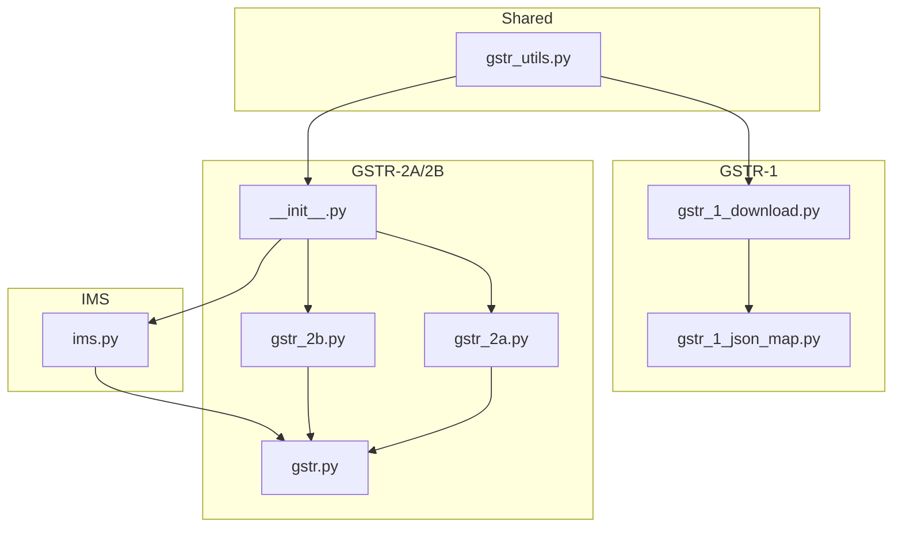
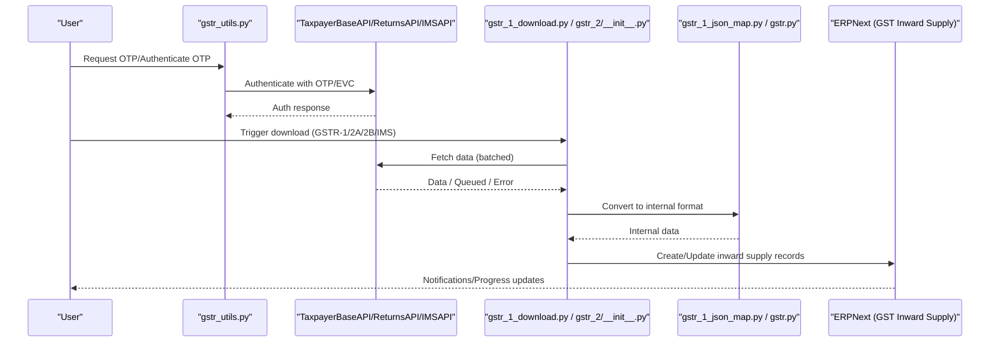
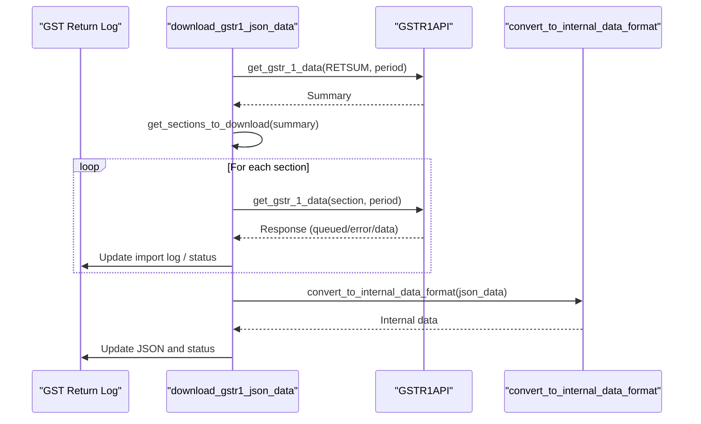
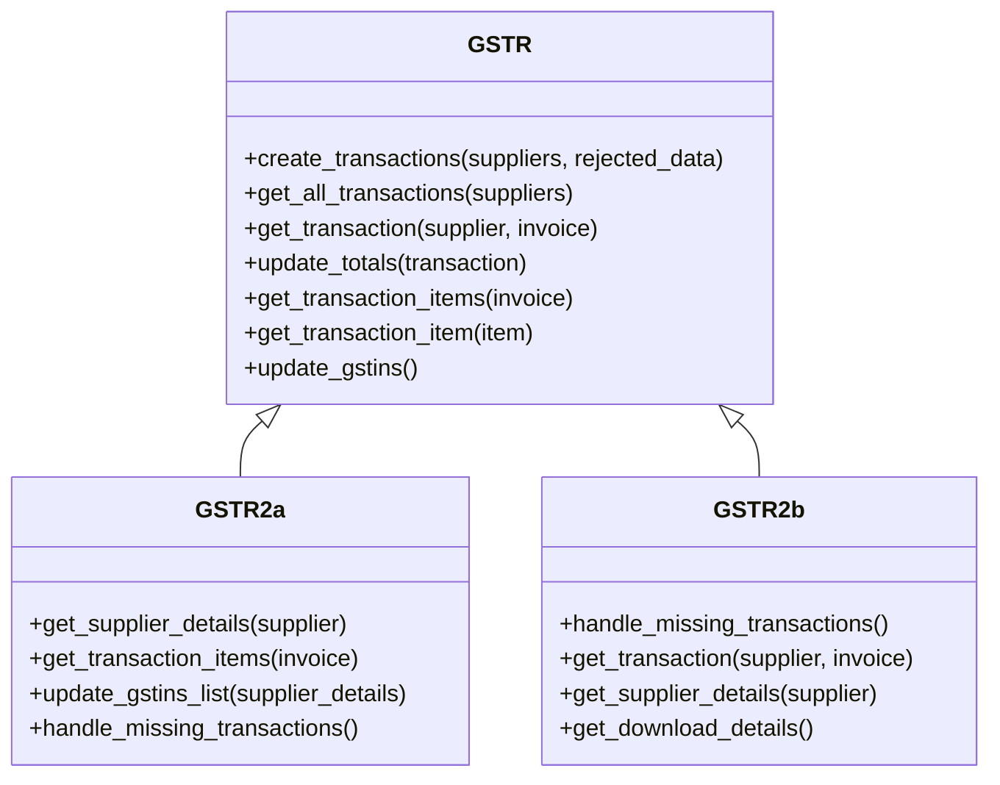
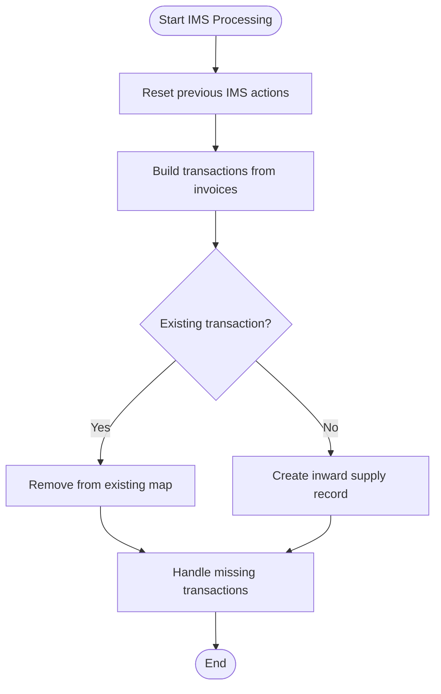
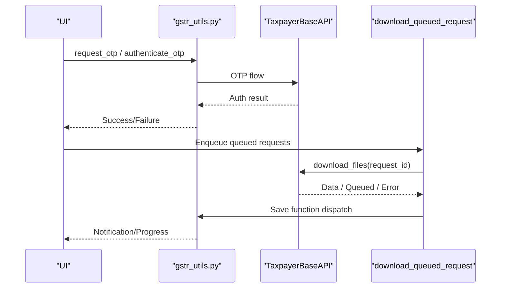
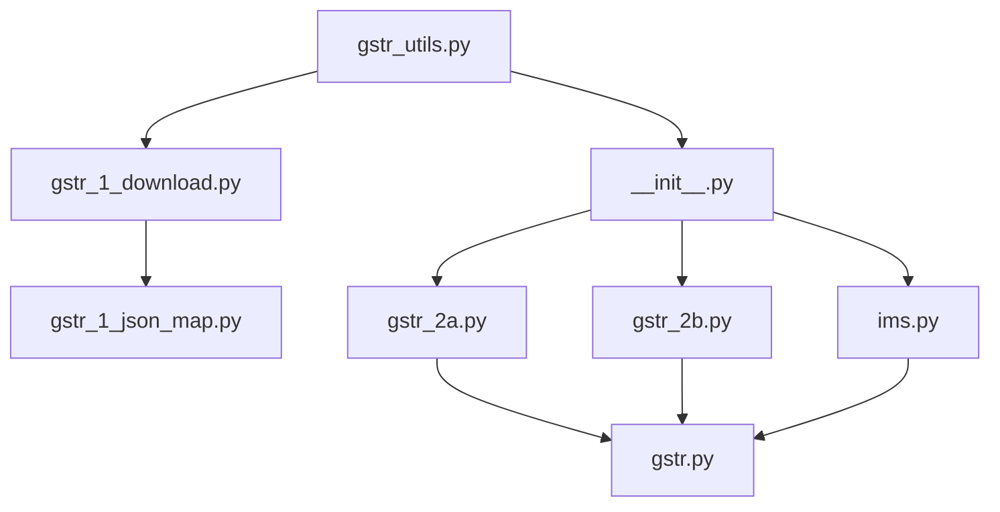

# Data Download Utilities

<cite>
**Referenced Files in This Document**
- [gstr_1_download.py](file://india_compliance/gst_india/utils/gstr_1/gstr_1_download.py)
- [gstr_1_json_map.py](file://india_compliance/gst_india/utils/gstr_1/gstr_1_json_map.py)
- [gstr_utils.py](file://india_compliance/gst_india/utils/gstr_utils.py)
- [gstr.py](file://india_compliance/gst_india/utils/gstr_2/gstr.py)
- [gstr_2a.py](file://india_compliance/gst_india/utils/gstr_2/gstr_2a.py)
- [gstr_2b.py](file://india_compliance/gst_india/utils/gstr_2/gstr_2b.py)
- [ims.py](file://india_compliance/gst_india/utils/gstr_2/ims.py)
- [__init__.py](file://india_compliance/gst_india/utils/gstr_2/__init__.py)
- [test_gstr_2a.py](file://india_compliance/gst_india/utils/gstr_2/test_gstr_2a.py)
- [test_gstr_2b_v4_0.py](file://india_compliance/gst_india/utils/gstr_2/test_gstr_2b_v4_0.py)
- [test_ims.py](file://india_compliance/gst_india/utils/gstr_2/test_ims.py)
- [test_gstr_1_json_map.py](file://india_compliance/gst_india/utils/gstr_1/test_gstr_1_json_map.py)
- [test_gstr_2a.json](file://india_compliance/gst_india/data/test_gstr_2a.json)
- [test_ims.json](file://india_compliance/gst_india/data/test_ims.json)
</cite>

## Table of Contents
1. [Introduction](#introduction)
2. [Project Structure](#project-structure)
3. [Core Components](#core-components)
4. [Architecture Overview](#architecture-overview)
5. [Detailed Component Analysis](#detailed-component-analysis)
6. [Dependency Analysis](#dependency-analysis)
7. [Performance Considerations](#performance-considerations)
8. [Troubleshooting Guide](#troubleshooting-guide)
9. [Conclusion](#conclusion)
10. [Appendices](#appendices)

## Introduction
This document explains the data download utilities for Indian GST systems, focusing on:
- GSTR-1 data extraction and internal mapping
- GSTR-2A/2B import processing and reconciliation
- IMS (Input Service Distributor) data handling and distribution calculations

It covers government portal integration, OTP authentication, batch processing, supplier data matching, invoice validation, reconciliation, and error handling strategies. Practical examples illustrate automated downloads, timeouts, and validation procedures. Utility functions for data transformation, format standardization, and ERPNext integration are documented.

## Project Structure
The utilities are organized under the GST utilities package with clear separation of concerns:
- GSTR-1: download orchestration, JSON-to-internal mapping, and ERPNext updates
- GSTR-2A/2B: generic base classes, category-specific handlers, and save/import flows
- IMS: category-specific handlers and distribution calculations
- Shared utilities: OTP authentication, queued request processing, and notifications

**Diagram sources**
- [gstr_1_download.py](file://india_compliance/gst_india/utils/gstr_1/gstr_1_download.py#L1-L158)
- [gstr_1_json_map.py](file://india_compliance/gst_india/utils/gstr_1/gstr_1_json_map.py#L1-L120)
- [gstr.py](file://india_compliance/gst_india/utils/gstr_2/gstr.py#L1-L148)
- [gstr_2a.py](file://india_compliance/gst_india/utils/gstr_2/gstr_2a.py#L1-L278)
- [gstr_2b.py](file://india_compliance/gst_india/utils/gstr_2/gstr_2b.py#L1-L242)
- [ims.py](file://india_compliance/gst_india/utils/gstr_2/ims.py#L1-L321)
- [__init__.py](file://india_compliance/gst_india/utils/gstr_2/__init__.py#L1-L490)
- [gstr_utils.py](file://india_compliance/gst_india/utils/gstr_utils.py#L1-L156)

**Section sources**
- [gstr_1_download.py](file://india_compliance/gst_india/utils/gstr_1/gstr_1_download.py#L1-L158)
- [gstr_1_json_map.py](file://india_compliance/gst_india/utils/gstr_1/gstr_1_json_map.py#L1-L120)
- [gstr.py](file://india_compliance/gst_india/utils/gstr_2/gstr.py#L1-L148)
- [gstr_2a.py](file://india_compliance/gst_india/utils/gstr_2/gstr_2a.py#L1-L278)
- [gstr_2b.py](file://india_compliance/gst_india/utils/gstr_2/gstr_2b.py#L1-L242)
- [ims.py](file://india_compliance/gst_india/utils/gstr_2/ims.py#L1-L321)
- [__init__.py](file://india_compliance/gst_india/utils/gstr_2/__init__.py#L1-L490)
- [gstr_utils.py](file://india_compliance/gst_india/utils/gstr_utils.py#L1-L156)

## Core Components
- GSTR-1 download orchestrator: fetches GSTR-1 (filed/unfiled) sections, handles queued responses, and persists mapped data
- GSTR-1 JSON mapper: converts government JSON to internal invoice structures and vice versa
- GSTR-2A/2B base and category handlers: transform supplier/invoice data, reconcile missing transactions, and update ERPNext records
- IMS handler: processes supplier return data, maps actions, and calculates distributions
- Shared OTP utilities and queued request processor: manage authentication, portal timeouts, and retries

Key responsibilities:
- Government portal integration via API classes
- Batch processing with progress reporting and notifications
- Supplier matching and invoice validation
- Reconciliation of missing or rejected documents
- Data transformation and format standardization

**Section sources**
- [gstr_1_download.py](file://india_compliance/gst_india/utils/gstr_1/gstr_1_download.py#L30-L93)
- [gstr_1_json_map.py](file://india_compliance/gst_india/utils/gstr_1/gstr_1_json_map.py#L116-L134)
- [gstr.py](file://india_compliance/gst_india/utils/gstr_2/gstr.py#L46-L74)
- [gstr_2a.py](file://india_compliance/gst_india/utils/gstr_2/gstr_2a.py#L15-L128)
- [gstr_2b.py](file://india_compliance/gst_india/utils/gstr_2/gstr_2b.py#L7-L76)
- [ims.py](file://india_compliance/gst_india/utils/gstr_2/ims.py#L28-L125)
- [gstr_utils.py](file://india_compliance/gst_india/utils/gstr_utils.py#L29-L128)

## Architecture Overview
The system integrates with GST APIs, processes data in batches, and updates ERPNext records. It supports:
- OTP-based authentication for sensitive operations
- Queued downloads with retry scheduling
- Category-specific handlers for GSTR-2A/2B and IMS
- Progress reporting and notifications

**Diagram sources**
- [gstr_utils.py](file://india_compliance/gst_india/utils/gstr_utils.py#L29-L53)
- [gstr_1_download.py](file://india_compliance/gst_india/utils/gstr_1/gstr_1_download.py#L30-L93)
- [__init__.py](file://india_compliance/gst_india/utils/gstr_2/__init__.py#L71-L147)
- [gstr_1_json_map.py](file://india_compliance/gst_india/utils/gstr_1/gstr_1_json_map.py#L116-L134)
- [gstr.py](file://india_compliance/gst_india/utils/gstr_2/gstr.py#L96-L114)

## Detailed Component Analysis

### GSTR-1 Data Extraction and Mapping
- Download orchestration:
  - Determines whether to fetch filed or unfiled GSTR-1
  - Builds list of sections to download based on summary and nil indicator
  - Handles queued responses and updates logs
  - Persists mapped data to ERPNext return log
- JSON mapping:
  - Converts government JSON to internal invoice structures
  - Formats dates, totals, and category-specific fields
  - Supports B2B, B2CL, B2CS, Exports, Nil-Rated, CDNR, CDNUR, AT/TXPD, HSNSUM, DOCISS

**Diagram sources**
- [gstr_1_download.py](file://india_compliance/gst_india/utils/gstr_1/gstr_1_download.py#L30-L93)
- [gstr_1_download.py](file://india_compliance/gst_india/utils/gstr_1/gstr_1_download.py#L127-L158)
- [gstr_1_json_map.py](file://india_compliance/gst_india/utils/gstr_1/gstr_1_json_map.py#L116-L134)

Practical example:
- Automated download of GSTR-1 for a filing period with nil indicator detection and selective section retrieval.

Validation and error handling:
- Invalid responses trigger user-friendly error messages
- No-docs scenarios update import logs appropriately
- Queued responses schedule retries and notify users

**Section sources**
- [gstr_1_download.py](file://india_compliance/gst_india/utils/gstr_1/gstr_1_download.py#L30-L93)
- [gstr_1_download.py](file://india_compliance/gst_india/utils/gstr_1/gstr_1_download.py#L127-L158)
- [gstr_1_json_map.py](file://india_compliance/gst_india/utils/gstr_1/gstr_1_json_map.py#L116-L134)
- [test_gstr_1_json_map.py](file://india_compliance/gst_india/utils/gstr_1/test_gstr_1_json_map.py#L285-L291)

### GSTR-2A/2B Import Processing and Reconciliation
- Base framework:
  - Generic class builds transactions from suppliers and invoices
  - Updates totals across items and maintains unique keys for reconciliation
  - Publishes progress during batch creation
- GSTR-2A specifics:
  - Category handlers for B2B/B2BA, CDNR/CDNRA, ISD, IMPG, IMPGSEZ
  - Supplier metadata mapping and GSTIN updates
  - Removes missing transactions on subsequent runs
- GSTR-2B specifics:
  - Handles rejected data and clears return periods for missing transactions
  - Updates generation date and download flags
  - Processes multiple files when applicable

**Diagram sources**
- [gstr.py](file://india_compliance/gst_india/utils/gstr_2/gstr.py#L13-L148)
- [gstr_2a.py](file://india_compliance/gst_india/utils/gstr_2/gstr_2a.py#L15-L128)
- [gstr_2b.py](file://india_compliance/gst_india/utils/gstr_2/gstr_2b.py#L7-L76)

Supplier data matching and reconciliation:
- Unique keys combine supplier GSTIN and bill number to detect duplicates and reconcile missing entries
- Rejected transactions are cleared or deleted based on category rules

**Section sources**
- [gstr.py](file://india_compliance/gst_india/utils/gstr_2/gstr.py#L46-L114)
- [gstr_2a.py](file://india_compliance/gst_india/utils/gstr_2/gstr_2a.py#L38-L128)
- [gstr_2b.py](file://india_compliance/gst_india/utils/gstr_2/gstr_2b.py#L24-L76)
- [test_gstr_2a.py](file://india_compliance/gst_india/utils/gstr_2/test_gstr_2a.py#L87-L321)
- [test_gstr_2b_v4_0.py](file://india_compliance/gst_india/utils/gstr_2/test_gstr_2b_v4_0.py#L30-L270)

### IMS (Input Service Distributor) Data Handling
- Category mapping:
  - B2B/B2BA, CDNR/CDNRA for Debit/Credit Notes
  - Maps supplier return forms, periods, and actions
- Distribution calculations:
  - Calculates IGST/CGST/SGST/CESS totals from items
  - Tracks previous actions and pending action flags
- Data lifecycle:
  - Resets previous actions per category
  - Creates new inward supply records
  - Removes missing transactions based on category filters

**Diagram sources**
- [ims.py](file://india_compliance/gst_india/utils/gstr_2/ims.py#L46-L62)
- [ims.py](file://india_compliance/gst_india/utils/gstr_2/ims.py#L183-L189)
- [ims.py](file://india_compliance/gst_india/utils/gstr_2/ims.py#L301-L320)

Practical example:
- Automated download and processing of IMS invoices for B2B/B2BA categories with action mapping and distribution totals.

**Section sources**
- [ims.py](file://india_compliance/gst_india/utils/gstr_2/ims.py#L28-L125)
- [ims.py](file://india_compliance/gst_india/utils/gstr_2/ims.py#L155-L203)
- [test_ims.py](file://india_compliance/gst_india/utils/gstr_2/test_ims.py#L34-L211)

### OTP Authentication and Batch Processing
- OTP request and authentication:
  - OTP request and authenticate endpoints integrate with taxpayer base API
  - EVC OTP initiation for GSTR-1
- Batch processing:
  - Queued request downloader schedules retries and routes to appropriate save functions
  - Progress updates published to the UI for GSTR-2A/2B and IMS

**Diagram sources**
- [gstr_utils.py](file://india_compliance/gst_india/utils/gstr_utils.py#L29-L53)
- [gstr_utils.py](file://india_compliance/gst_india/utils/gstr_utils.py#L55-L128)

**Section sources**
- [gstr_utils.py](file://india_compliance/gst_india/utils/gstr_utils.py#L29-L53)
- [gstr_utils.py](file://india_compliance/gst_india/utils/gstr_utils.py#L55-L128)

## Dependency Analysis
The modules exhibit clear separation:
- GSTR-1 depends on JSON mapper and return log persistence
- GSTR-2A/2B and IMS depend on shared base classes and category-specific handlers
- Shared utilities coordinate OTP, queued downloads, and notifications

**Diagram sources**
- [gstr_1_download.py](file://india_compliance/gst_india/utils/gstr_1/gstr_1_download.py#L1-L158)
- [gstr_1_json_map.py](file://india_compliance/gst_india/utils/gstr_1/gstr_1_json_map.py#L1-L120)
- [gstr.py](file://india_compliance/gst_india/utils/gstr_2/gstr.py#L1-L148)
- [gstr_2a.py](file://india_compliance/gst_india/utils/gstr_2/gstr_2a.py#L1-L278)
- [gstr_2b.py](file://india_compliance/gst_india/utils/gstr_2/gstr_2b.py#L1-L242)
- [ims.py](file://india_compliance/gst_india/utils/gstr_2/ims.py#L1-L321)
- [__init__.py](file://india_compliance/gst_india/utils/gstr_2/__init__.py#L1-L490)
- [gstr_utils.py](file://india_compliance/gst_india/utils/gstr_utils.py#L1-L156)

**Section sources**
- [gstr_1_download.py](file://india_compliance/gst_india/utils/gstr_1/gstr_1_download.py#L1-L158)
- [gstr_1_json_map.py](file://india_compliance/gst_india/utils/gstr_1/gstr_1_json_map.py#L1-L120)
- [gstr.py](file://india_compliance/gst_india/utils/gstr_2/gstr.py#L1-L148)
- [gstr_2a.py](file://india_compliance/gst_india/utils/gstr_2/gstr_2a.py#L1-L278)
- [gstr_2b.py](file://india_compliance/gst_india/utils/gstr_2/gstr_2b.py#L1-L242)
- [ims.py](file://india_compliance/gst_india/utils/gstr_2/ims.py#L1-L321)
- [__init__.py](file://india_compliance/gst_india/utils/gstr_2/__init__.py#L1-L490)
- [gstr_utils.py](file://india_compliance/gst_india/utils/gstr_utils.py#L1-L156)

## Performance Considerations
- Batched API calls reduce load and enable progress tracking
- Queued downloads prevent timeouts and retry with exponential backoff
- Unique-key reconciliation minimizes duplicate processing overhead
- Totals computed incrementally during item processing to avoid repeated scans

## Troubleshooting Guide
Common issues and resolutions:
- Authentication failures:
  - Verify OTP permissions and re-initiate OTP flow
  - Check EVC OTP initiation for GSTR-1
- Duplicate entries:
  - Unique keys (supplier GSTIN + bill number) prevent duplication; review reconciliation logic if duplicates persist
- Data mapping errors:
  - Validate government JSON against expected schema; use mapper’s conversion functions
  - Check category-specific mappings (e.g., ISD, IMPG) for missing fields
- Portal timeouts and queued downloads:
  - Monitor queued import logs and wait for scheduled retries
  - Use notification endpoints to track progress
- Rejected or missing documents:
  - For GSTR-2B, missing transactions are cleared and rejected ones deleted
  - For GSTR-2A, missing transactions are removed on refresh

**Section sources**
- [gstr_utils.py](file://india_compliance/gst_india/utils/gstr_utils.py#L55-L128)
- [gstr_2a.py](file://india_compliance/gst_india/utils/gstr_2/gstr_2a.py#L38-L51)
- [gstr_2b.py](file://india_compliance/gst_india/utils/gstr_2/gstr_2b.py#L24-L59)
- [test_gstr_2a.py](file://india_compliance/gst_india/utils/gstr_2/test_gstr_2a.py#L87-L321)
- [test_gstr_2b_v4_0.py](file://india_compliance/gst_india/utils/gstr_2/test_gstr_2b_v4_0.py#L30-L270)
- [test_ims.py](file://india_compliance/gst_india/utils/gstr_2/test_ims.py#L34-L211)

## Conclusion
The data download utilities provide a robust, modular pipeline for integrating with GST portals, transforming government data into ERPNext-compatible records, and handling reconciliation and error scenarios. OTP authentication, batch processing, and queued downloads ensure reliability and scalability across GSTR-1, GSTR-2A/2B, and IMS workflows.

## Appendices
- Example datasets:
  - GSTR-2A sample: [test_gstr_2a.json](file://india_compliance/gst_india/data/test_gstr_2a.json#L1-L233)
  - IMS sample: [test_ims.json](file://india_compliance/gst_india/data/test_ims.json#L1-L134)

**Section sources**
- [test_gstr_2a.json](file://india_compliance/gst_india/data/test_gstr_2a.json#L1-L233)
- [test_ims.json](file://india_compliance/gst_india/data/test_ims.json#L1-L134)