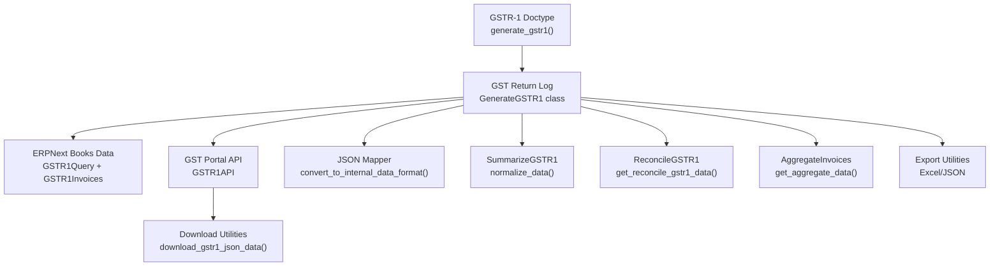
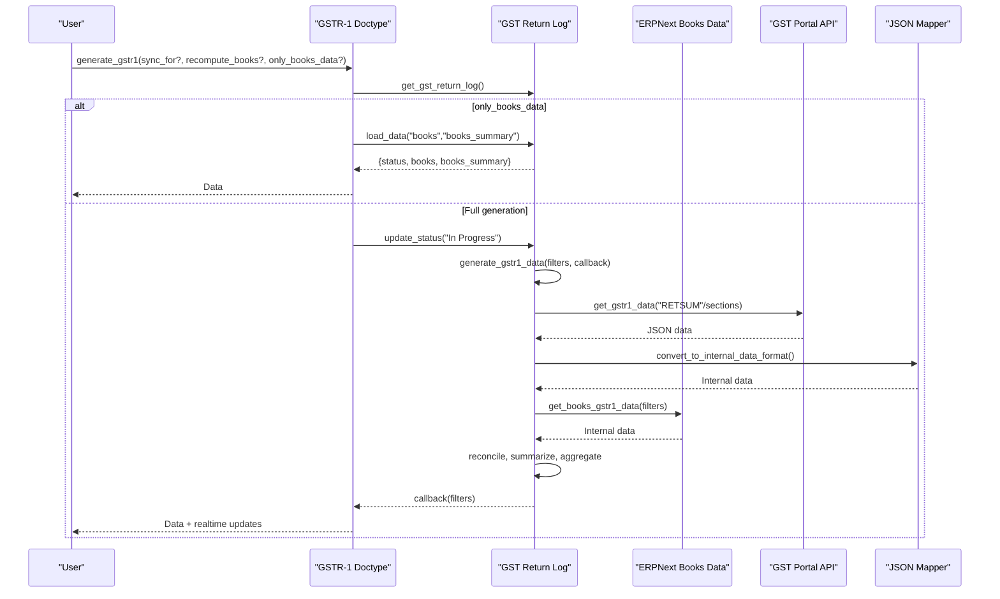
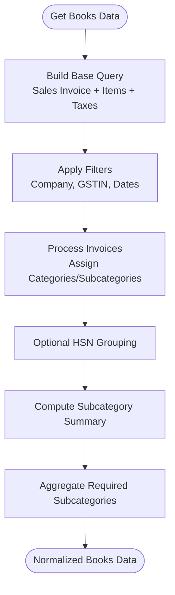
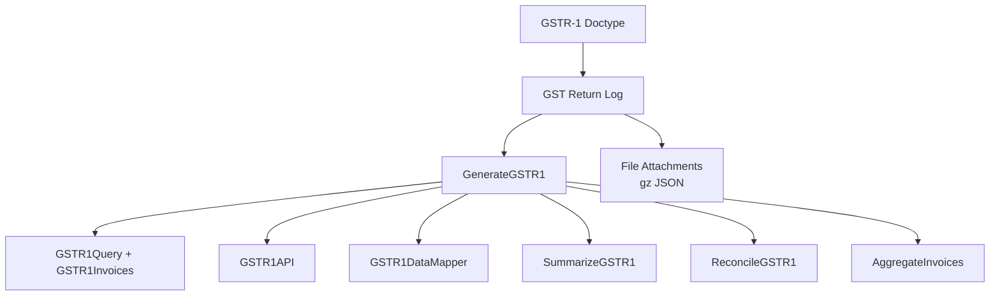

# GSTR-1 Data Generation

<cite>
**Referenced Files in This Document**
- [gstr_1.py](file://india_compliance/gst_india/doctype/gstr_1/gstr_1.py)
- [generate_gstr_1.py](file://india_compliance/gst_india/doctype/gst_return_log/generate_gstr_1.py)
- [gst_return_log.py](file://india_compliance/gst_india/doctype/gst_return_log/gst_return_log.py)
- [gstr_1_data.py](file://india_compliance/gst_india/utils/gstr_1/gstr_1_data.py)
- [gstr_1_download.py](file://india_compliance/gst_india/utils/gstr_1/gstr_1_download.py)
- [gstr_1_json_map.py](file://india_compliance/gst_india/utils/gstr_1/gstr_1_json_map.py)
- [gstr_1_export.py](file://india_compliance/gst_india/doctype/gstr_1/gstr_1_export.py)
</cite>

## Table of Contents
1. [Introduction](#introduction)
2. [Project Structure](#project-structure)
3. [Core Components](#core-components)
4. [Architecture Overview](#architecture-overview)
5. [Detailed Component Analysis](#detailed-component-analysis)
6. [Dependency Analysis](#dependency-analysis)
7. [Performance Considerations](#performance-considerations)
8. [Troubleshooting Guide](#troubleshooting-guide)
9. [Conclusion](#conclusion)

## Introduction
This document explains the GSTR-1 data generation workflow in the India Compliance app. It focuses on the generate_gstr1 method, its parameters (sync_for, recompute_books, only_books_data), the extraction of data from ERPNext books and government APIs, filing preference handling for monthly vs quarterly returns, period calculation logic, data filtering mechanisms, and the relationship between the GSTR-1 doctype and GST Return Log for status tracking and progress monitoring.

## Project Structure
The GSTR-1 generation spans several modules:
- GSTR-1 doctype and controller: orchestrates generation, handles parameters, and triggers background jobs
- GST Return Log: persists intermediate and final data, tracks status, and coordinates API interactions
- Data extraction utilities: queries ERPNext documents and builds internal GSTR-1 data structures
- Government API integration: downloads GSTR-1 JSON from GST portal and maps it to internal format
- Export utilities: produce Excel/JSON exports for books, reconcile, and government views

**Diagram sources**
- [gstr_1.py](file://india_compliance/gst_india/doctype/gstr_1/gstr_1.py#L70-L192)
- [generate_gstr_1.py](file://india_compliance/gst_india/doctype/gst_return_log/generate_gstr_1.py#L595-L740)
- [gst_return_log.py](file://india_compliance/gst_india/doctype/gst_return_log/gst_return_log.py#L26-L172)
- [gstr_1_data.py](file://india_compliance/gst_india/utils/gstr_1/gstr_1_data.py#L64-L163)
- [gstr_1_download.py](file://india_compliance/gst_india/utils/gstr_1/gstr_1_download.py#L30-L93)
- [gstr_1_json_map.py](file://india_compliance/gst_india/utils/gstr_1/gstr_1_json_map.py#L116-L135)

**Section sources**
- [gstr_1.py](file://india_compliance/gst_india/doctype/gstr_1/gstr_1.py#L29-L192)
- [gst_return_log.py](file://india_compliance/gst_india/doctype/gst_return_log/gst_return_log.py#L26-L172)

## Core Components
- GSTR-1 Doctype: exposes generate_gstr1 with parameters for controlling data generation and synchronization
- GST Return Log: central state machine storing books, government, reconcile, and summary data; manages filing status and actions
- Data Extractors: build GSTR-1 data from ERPNext Sales/Purchase/Journal entries and HSN summaries
- Government API Layer: downloads GSTR-1 JSON, maps to internal format, and handles queued requests
- Summarization and Reconciliation: computes category/subcategory summaries and compares books vs government data
- Export Utilities: produce Excel/JSON for books, reconcile, and government-ready formats

**Section sources**
- [gstr_1.py](file://india_compliance/gst_india/doctype/gstr_1/gstr_1.py#L70-L192)
- [generate_gstr_1.py](file://india_compliance/gst_india/doctype/gst_return_log/generate_gstr_1.py#L41-L123)
- [gstr_1_data.py](file://india_compliance/gst_india/utils/gstr_1/gstr_1_data.py#L437-L628)
- [gstr_1_download.py](file://india_compliance/gst_india/utils/gstr_1/gstr_1_download.py#L30-L93)

## Architecture Overview
The generate_gstr1 workflow integrates ERPNext books data with GST portal data, reconciles differences, and produces summaries and exports.

**Diagram sources**
- [gstr_1.py](file://india_compliance/gst_india/doctype/gstr_1/gstr_1.py#L70-L192)
- [generate_gstr_1.py](file://india_compliance/gst_india/doctype/gst_return_log/generate_gstr_1.py#L595-L740)
- [gstr_1_download.py](file://india_compliance/gst_india/utils/gstr_1/gstr_1_download.py#L30-L93)
- [gstr_1_json_map.py](file://india_compliance/gst_india/utils/gstr_1/gstr_1_json_map.py#L116-L135)

## Detailed Component Analysis

### GSTR-1 Doctype: generate_gstr1 Method
- Parameters:
  - sync_for: clears cached data for specific sections before regenerating
  - recompute_books: forces recomputation of books data and resets cached books JSON
  - only_books_data: returns only books data and summary without attempting API download
- Behavior:
  - Validates filing preference and triggers GST Return Log
  - Handles in-progress and queued states
  - Enqueues long-running generation via background job
  - Publishes realtime updates on completion or failure

Practical usage scenarios:
- Sync only specific sections: pass sync_for to regenerate targeted data
- Force recalculation: pass recompute_books to rebuild books data
- Generate offline preview: pass only_books_data to avoid API calls

**Section sources**
- [gstr_1.py](file://india_compliance/gst_india/doctype/gstr_1/gstr_1.py#L70-L192)

### GST Return Log: GenerateGSTR1 Class
- Responsibilities:
  - Load, persist, and normalize JSON data for books, government, reconcile, and summaries
  - Set filing preference and status
  - Generate GSTR-1 data pipeline: API download, books extraction, reconciliation, summarization
  - Manage actions (reset/upload/proceed_to_file/file) and status notifications
- Data lifecycle:
  - Files stored as compressed JSON gz attachments
  - Summary computed and cached separately
  - Actions tracked for reset/upload/proceed/file

**Section sources**
- [generate_gstr_1.py](file://india_compliance/gst_india/doctype/gst_return_log/generate_gstr_1.py#L41-L123)
- [gst_return_log.py](file://india_compliance/gst_india/doctype/gst_return_log/gst_return_log.py#L26-L172)

### Data Extraction from ERPNext Books
- Sales Invoices:
  - Base query joins Sales Invoice, Items, Taxes, and returns
  - Filters include company, GSTIN, posting date range, and non-opening entries
  - Computes totals, tax breakdowns, and invoice-level metadata
- HSN-wise summaries:
  - Groups by invoice_no, HSN, rate, and UOM to compute totals
- Document Issued Summary:
  - Builds document issuance stats across Sales/Purchase/Stock/Subcontracting documents
- Period calculation:
  - Uses get_gstr_1_from_and_to_date to derive from/to dates based on month_or_quarter and filing_preference

**Diagram sources**
- [gstr_1_data.py](file://india_compliance/gst_india/utils/gstr_1/gstr_1_data.py#L64-L163)
- [gstr_1_data.py](file://india_compliance/gst_india/utils/gstr_1/gstr_1_data.py#L437-L628)
- [gstr_1_data.py](file://india_compliance/gst_india/utils/gstr_1/gstr_1_data.py#L679-L700)

**Section sources**
- [gstr_1_data.py](file://india_compliance/gst_india/utils/gstr_1/gstr_1_data.py#L64-L163)
- [gstr_1_data.py](file://india_compliance/gst_india/utils/gstr_1/gstr_1_data.py#L437-L628)
- [gstr_1.py](file://india_compliance/gst_india/doctype/gstr_1/gstr_1.py#L475-L491)

### Government API Integration and Data Mapping
- Download:
  - For Filed returns: fetch RETSUM to determine sections to download
  - For Unfiled returns: download all sections
  - Handles queued responses via import logs
- Mapping:
  - Converts government JSON to internal data format
  - Applies key mappings, formatting, and subcategory assignments
- Storage:
  - Stores mapped data and updates filing status and NIL flag

**Section sources**
- [gstr_1_download.py](file://india_compliance/gst_india/utils/gstr_1/gstr_1_download.py#L30-L93)
- [gstr_1_json_map.py](file://india_compliance/gst_india/utils/gstr_1/gstr_1_json_map.py#L116-L135)

### Reconciliation and Summarization
- Reconciliation:
  - Compares books vs government data per subcategory
  - Computes differences, match status, and upload status for rows
  - Updates books data with upload status for non-filed returns
- Summarization:
  - Aggregates subcategory totals and computes category-level summaries
  - Rounds amounts and excludes non-applicable fields
  - Supports amendment net liability computation for filed returns

**Section sources**
- [generate_gstr_1.py](file://india_compliance/gst_india/doctype/gst_return_log/generate_gstr_1.py#L259-L454)
- [generate_gstr_1.py](file://india_compliance/gst_india/doctype/gst_return_log/generate_gstr_1.py#L41-L123)

### Filing Preference and Period Calculation
- Filing preference:
  - Monthly vs Quarterly preference influences period boundaries
  - For Quarterly: start aligned to quarter start month
- Period calculation:
  - get_gstr_1_from_and_to_date derives from_date and to_date based on month_or_quarter and year
  - Ensures correct date range for both monthly and quarterly periods

**Section sources**
- [gstr_1.py](file://india_compliance/gst_india/doctype/gstr_1/gstr_1.py#L475-L491)

### Data Validation and Filtering Mechanisms
- Validation:
  - Validates invoice numbers and excludes invalid entries
  - Excludes opening entries and same-GSTIN billing entries for document issuance
- Filtering:
  - ERPNext queries filter out opening entries and apply date ranges
  - Government data mapping discards zero-value rows where applicable

**Section sources**
- [gstr_1_data.py](file://india_compliance/gst_india/utils/gstr_1/gstr_1_data.py#L926-L966)
- [gstr_1_data.py](file://india_compliance/gst_india/utils/gstr_1/gstr_1_data.py#L165-L182)

### Relationship Between GSTR-1 Doctype and GST Return Log
- GSTR-1 Doctype creates or retrieves GST Return Log entries keyed by period and GSTIN
- GST Return Log stores:
  - books, filed, unfiled JSON data and summaries
  - filing_status, acknowledgment_number, filing_date
  - actions for reset/upload/proceed/file
- Status tracking:
  - In Progress, Queued, Generated, Failed
  - Realtime updates published to the UI

**Section sources**
- [gstr_1.py](file://india_compliance/gst_india/doctype/gstr_1/gstr_1.py#L79-L131)
- [gst_return_log.py](file://india_compliance/gst_india/doctype/gst_return_log/gst_return_log.py#L26-L172)

### Practical Examples of GSTR-1 Generation Workflows
- Scenario 1: Generate only books data for preview
  - Call generate_gstr1 with only_books_data=True
  - Returns books and books_summary without API calls
- Scenario 2: Recompute books data after settings change
  - Call generate_gstr1 with recompute_books=True
  - Forces regeneration of books data and resets cached JSON
- Scenario 3: Sync specific sections after partial failure
  - Call generate_gstr1 with sync_for="books" or "reconcile"
  - Clears cached data for the specified section and regenerates
- Scenario 4: Full generation with API download
  - Call generate_gstr1 without parameters
  - Triggers API download, reconciliation, summarization, and aggregation

**Section sources**
- [gstr_1.py](file://india_compliance/gst_india/doctype/gstr_1/gstr_1.py#L70-L192)
- [generate_gstr_1.py](file://india_compliance/gst_india/doctype/gst_return_log/generate_gstr_1.py#L595-L740)

## Dependency Analysis

**Diagram sources**
- [gstr_1.py](file://india_compliance/gst_india/doctype/gstr_1/gstr_1.py#L70-L192)
- [generate_gstr_1.py](file://india_compliance/gst_india/doctype/gst_return_log/generate_gstr_1.py#L567-L808)
- [gstr_1_data.py](file://india_compliance/gst_india/utils/gstr_1/gstr_1_data.py#L64-L163)
- [gstr_1_download.py](file://india_compliance/gst_india/utils/gstr_1/gstr_1_download.py#L30-L93)
- [gstr_1_json_map.py](file://india_compliance/gst_india/utils/gstr_1/gstr_1_json_map.py#L116-L135)

**Section sources**
- [gstr_1.py](file://india_compliance/gst_india/doctype/gstr_1/gstr_1.py#L70-L192)
- [generate_gstr_1.py](file://india_compliance/gst_india/doctype/gst_return_log/generate_gstr_1.py#L567-L808)

## Performance Considerations
- Background job execution: generation runs in a long queue to avoid UI timeouts
- Data caching: JSON and summary caches reduce repeated computation
- Conditional API usage: only downloads required sections for filed returns
- Efficient queries: ERPNext queries use joins and grouped aggregations for HSN summaries

[No sources needed since this section provides general guidance]

## Troubleshooting Guide
Common issues and resolutions:
- In Progress or Queued messages:
  - Wait for the process to complete; the doctype checks and informs users accordingly
- API download queued:
  - Import logs track token and estimated time; check import log for retry timing
- Reconciliation mismatches:
  - Review reconcile summary and mismatched rows; adjust books data or government data as needed
- Parameter misuse:
  - Use only_books_data for previews, recompute_books to force regeneration, and sync_for to refresh specific sections

**Section sources**
- [gstr_1.py](file://india_compliance/gst_india/doctype/gstr_1/gstr_1.py#L85-L125)
- [gstr_1_download.py](file://india_compliance/gst_india/utils/gstr_1/gstr_1_download.py#L61-L93)
- [generate_gstr_1.py](file://india_compliance/gst_india/doctype/gst_return_log/generate_gstr_1.py#L832-L1023)

## Conclusion
The GSTR-1 data generation workflow integrates ERPNext books data with GST portal data, enabling reconciliation, summarization, and export. The GSTR-1 doctype and GST Return Log coordinate status tracking, while utilities extract, map, and validate data efficiently. Proper use of parameters ensures flexible, reliable generation for previews, sync, and full reconciliation.