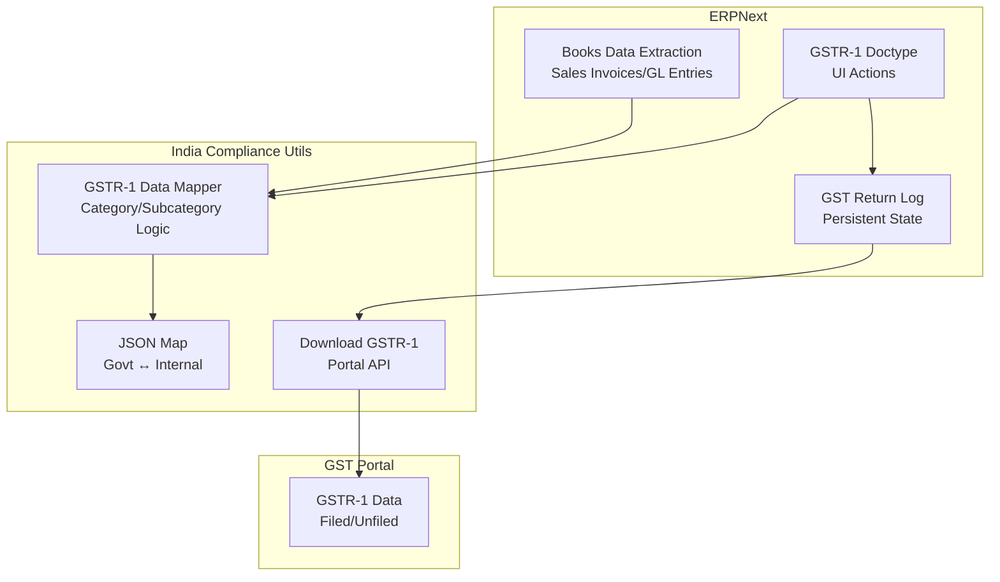
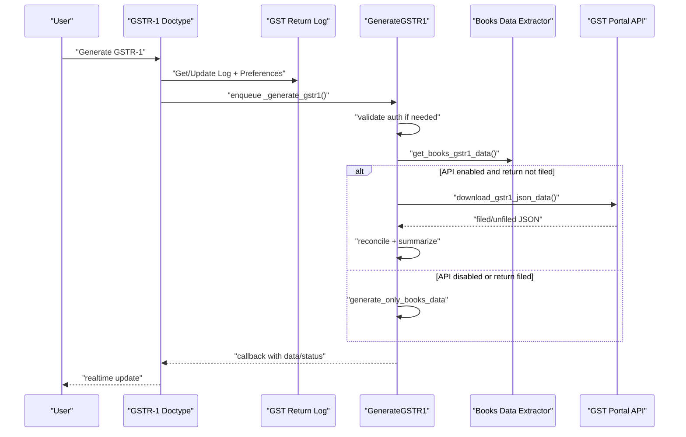
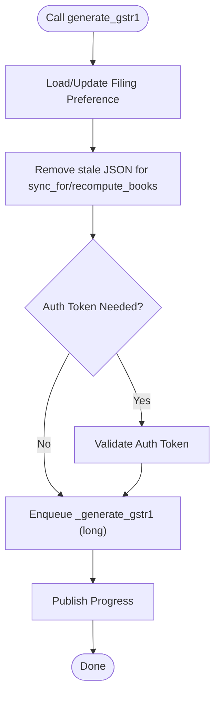
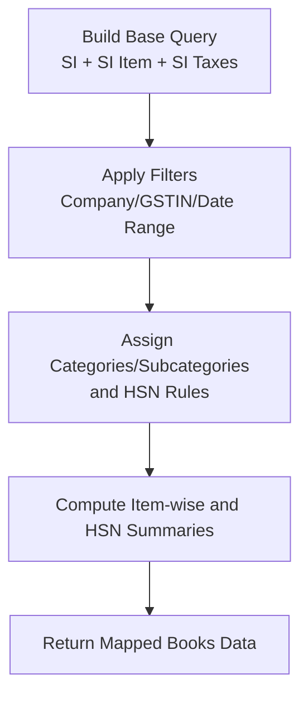
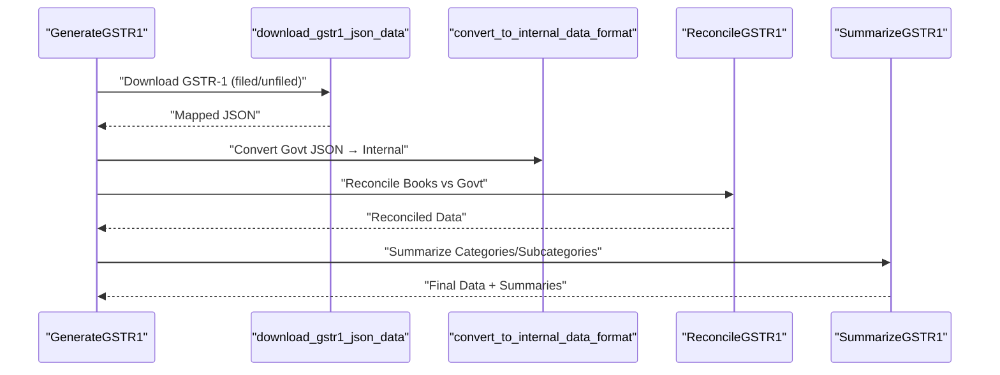
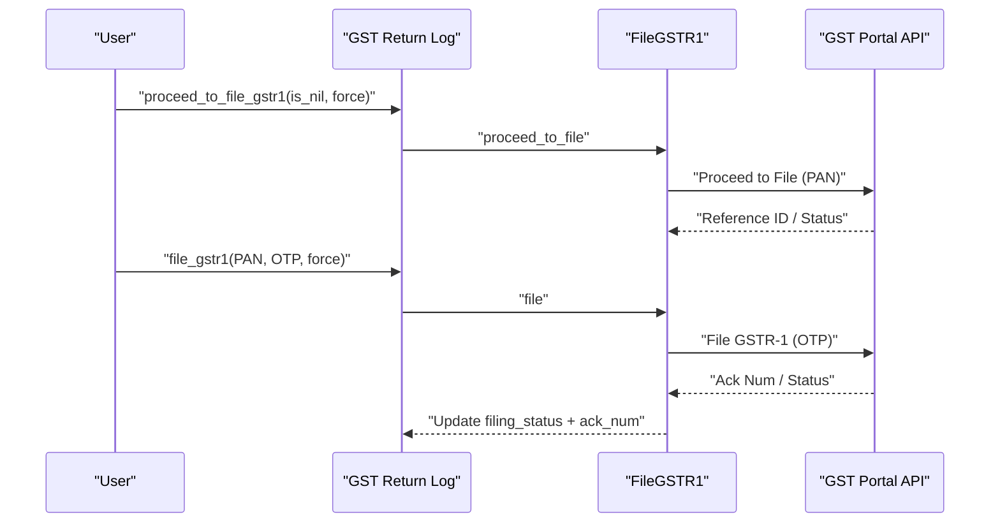
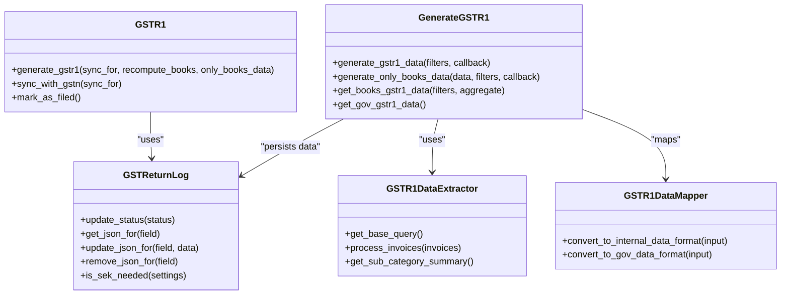

# GSTR-1 Processing

<cite>
**Referenced Files in This Document**
- [gstr_1.py](file://india_compliance/gst_india/doctype/gstr_1/gstr_1.py)
- [generate_gstr_1.py](file://india_compliance/gst_india/doctype/gst_return_log/generate_gstr_1.py)
- [gst_return_log.py](file://india_compliance/gst_india/doctype/gst_return_log/gst_return_log.py)
- [gstr_1_data.py](file://india_compliance/gst_india/utils/gstr_1/gstr_1_data.py)
- [gstr_1_download.py](file://india_compliance/gst_india/utils/gstr_1/gstr_1_download.py)
- [gstr_1_json_map.py](file://india_compliance/gst_india/utils/gstr_1/gstr_1_json_map.py)
- [test_gstr_1_books_data.py](file://india_compliance/gst_india/utils/gstr_1/test_gstr_1_books_data.py)
- [test_gstr_1_json_map.py](file://india_compliance/gst_india/utils/gstr_1/test_gstr_1_json_map.py)
</cite>

## Table of Contents
1. [Introduction](#introduction)
2. [Project Structure](#project-structure)
3. [Core Components](#core-components)
4. [Architecture Overview](#architecture-overview)
5. [Detailed Component Analysis](#detailed-component-analysis)
6. [Dependency Analysis](#dependency-analysis)
7. [Performance Considerations](#performance-considerations)
8. [Troubleshooting Guide](#troubleshooting-guide)
9. [Conclusion](#conclusion)

## Introduction
This document explains the GSTR-1 processing system in the India Compliance module. It covers the GSTR-1 doctype, the generate_gstr1 workflow, data generation from ERPNext books and GL entries, reconciliation with government portal data, filing preferences (monthly vs quarterly), OTP authentication, and status tracking. Practical examples, error handling, and retry mechanisms are included to help operators resolve common issues such as authentication failures, data inconsistencies, and portal connectivity problems.

## Project Structure
The GSTR-1 system spans several modules:
- GSTR-1 doctype and UI actions
- GST Return Log for persistent state and data storage
- Utilities for extracting and mapping ERPNext books data
- Government portal integration for downloads and filings
- Tests validating data extraction and mapping

**Diagram sources**
- [gstr_1.py](file://india_compliance/gst_india/doctype/gstr_1/gstr_1.py#L70-L192)
- [gst_return_log.py](file://india_compliance/gst_india/doctype/gst_return_log/gst_return_log.py#L26-L50)
- [gstr_1_data.py](file://india_compliance/gst_india/utils/gstr_1/gstr_1_data.py#L64-L139)
- [gstr_1_json_map.py](file://india_compliance/gst_india/utils/gstr_1/gstr_1_json_map.py#L43-L125)
- [gstr_1_download.py](file://india_compliance/gst_india/utils/gstr_1/gstr_1_download.py#L30-L93)

**Section sources**
- [gstr_1.py](file://india_compliance/gst_india/doctype/gstr_1/gstr_1.py#L29-L192)
- [gst_return_log.py](file://india_compliance/gst_india/doctype/gst_return_log/gst_return_log.py#L26-L172)

## Core Components
- GSTR-1 doctype: exposes actions to regenerate, sync with GST portal, mark as filed, and compute net GST liability. It orchestrates the generate_gstr1 workflow.
- GST Return Log: stores persisted state, downloaded JSON data (filed/unfiled/books), summaries, and action requests. Provides helpers to manage queued downloads and status.
- Data extraction: builds queries from Sales Invoices and GL Entries to extract invoice-wise and HSN-wise data for GSTR-1 categories.
- Government portal integration: downloads GSTR-1 JSON, maps to internal format, reconciles with books data, and supports upload/filing actions with OTP.
- Tests: validate mapping correctness and rounding adjustments across B2B/B2C/NIL/Exports/CDNR scenarios.

**Section sources**
- [gstr_1.py](file://india_compliance/gst_india/doctype/gstr_1/gstr_1.py#L70-L192)
- [gst_return_log.py](file://india_compliance/gst_india/doctype/gst_return_log/gst_return_log.py#L26-L172)
- [gstr_1_data.py](file://india_compliance/gst_india/utils/gstr_1/gstr_1_data.py#L64-L139)
- [gstr_1_download.py](file://india_compliance/gst_india/utils/gstr_1/gstr_1_download.py#L30-L93)
- [gstr_1_json_map.py](file://india_compliance/gst_india/utils/gstr_1/gstr_1_json_map.py#L43-L125)

## Architecture Overview
The GSTR-1 workflow integrates ERPNext data with the GST portal. At a high level:
- Users trigger generate_gstr1 via the GSTR-1 doctype.
- The system checks GST Return Log status and preferences, validates auth if needed, and enqueues long-running generation.
- Generation retrieves books data, optionally downloads government data, reconciles, summarizes, and publishes results.
- Filing actions (reset/upload/proceed to file/file) are supported with OTP and status tracking.

**Diagram sources**
- [gstr_1.py](file://india_compliance/gst_india/doctype/gstr_1/gstr_1.py#L70-L192)
- [generate_gstr_1.py](file://india_compliance/gst_india/doctype/gst_return_log/generate_gstr_1.py#L595-L662)
- [gstr_1_download.py](file://india_compliance/gst_india/utils/gstr_1/gstr_1_download.py#L30-L93)
- [gst_return_log.py](file://india_compliance/gst_india/doctype/gst_return_log/gst_return_log.py#L26-L50)

## Detailed Component Analysis

### GSTR-1 Doctype and generate_gstr1 Method
The generate_gstr1 method controls the entire lifecycle:
- Parameters:
  - sync_for: restricts removal of cached JSON for specific sections to re-download from the portal.
  - recompute_books: forces recomputation of books data and clears cached books JSON.
  - only_books_data: returns only books data without portal reconciliation.
- Behavior:
  - Validates and persists filing preference.
  - Checks and removes stale JSON for affected sections.
  - Validates auth token if required.
  - Enqueues long-running generation and publishes progress.

**Diagram sources**
- [gstr_1.py](file://india_compliance/gst_india/doctype/gstr_1/gstr_1.py#L70-L147)

**Section sources**
- [gstr_1.py](file://india_compliance/gst_india/doctype/gstr_1/gstr_1.py#L70-L147)

### Data Extraction from ERPNext Books and GL Entries
Books data extraction:
- Builds a comprehensive query from Sales Invoice, Items, and Taxes to compute totals and tax breakdowns.
- Applies filters for company, GSTIN, and date range derived from filing preference.
- Processes invoices to assign categories/subcategories and HSN bifurcation rules.
- Aggregates invoice-level data into item-wise and HSN-wise summaries.

**Diagram sources**
- [gstr_1_data.py](file://india_compliance/gst_india/utils/gstr_1/gstr_1_data.py#L75-L182)
- [gstr_1_data.py](file://india_compliance/gst_india/utils/gstr_1/gstr_1_data.py#L437-L523)

**Section sources**
- [gstr_1_data.py](file://india_compliance/gst_india/utils/gstr_1/gstr_1_data.py#L64-L139)
- [gstr_1_data.py](file://india_compliance/gst_india/utils/gstr_1/gstr_1_data.py#L437-L523)

### Government Portal Integration and Reconciliation
Portal integration:
- Downloads GSTR-1 JSON (filed/unfiled) and maps to internal format.
- Uses section selection logic to avoid downloading empty sections.
- Stores compressed JSON in GST Return Log files and updates status.

Reconciliation:
- Compares books data with government data per subcategory.
- Computes differences, upload status, and mismatch indicators.
- Aggregates data for upload and prepares summaries.

**Diagram sources**
- [gstr_1_download.py](file://india_compliance/gst_india/utils/gstr_1/gstr_1_download.py#L30-L93)
- [gstr_1_json_map.py](file://india_compliance/gst_india/utils/gstr_1/gstr_1_json_map.py#L116-L134)
- [generate_gstr_1.py](file://india_compliance/gst_india/doctype/gst_return_log/generate_gstr_1.py#L259-L359)
- [generate_gstr_1.py](file://india_compliance/gst_india/doctype/gst_return_log/generate_gstr_1.py#L41-L124)

**Section sources**
- [gstr_1_download.py](file://india_compliance/gst_india/utils/gstr_1/gstr_1_download.py#L30-L93)
- [gstr_1_json_map.py](file://india_compliance/gst_india/utils/gstr_1/gstr_1_json_map.py#L116-L134)
- [generate_gstr_1.py](file://india_compliance/gst_india/doctype/gst_return_log/generate_gstr_1.py#L259-L359)

### Filing Preference Handling (Monthly vs Quarterly)
- Filing preference is derived from user input or fetched from GST portal if missing.
- Date range calculation differs for quarterly returns (first month of quarter vs individual month).
- Preference changes trigger recomputation of books data to align periods.

**Section sources**
- [gstr_1.py](file://india_compliance/gst_india/doctype/gstr_1/gstr_1.py#L475-L491)
- [generate_gstr_1.py](file://india_compliance/gst_india/doctype/gst_return_log/generate_gstr_1.py#L664-L674)

### OTP Authentication and Filing Actions
- OTP is required for filing-related actions (proceed to file, file).
- The system validates PAN and OTP against the portal and updates filing status accordingly.
- Actions are tracked via GST Return Log actions and statuses.

**Diagram sources**
- [generate_gstr_1.py](file://india_compliance/gst_india/doctype/gst_return_log/generate_gstr_1.py#L940-L1055)

**Section sources**
- [generate_gstr_1.py](file://india_compliance/gst_india/doctype/gst_return_log/generate_gstr_1.py#L940-L1055)

### Status Tracking and Queuing
- Status transitions: Not Started → In Progress → Generated → Queued → Uploaded → Ready to File → Filed.
- Queued downloads publish notifications and persist import logs for retries.
- Real-time updates inform users about progress and errors.

**Section sources**
- [gst_return_log.py](file://india_compliance/gst_india/doctype/gst_return_log/gst_return_log.py#L26-L50)
- [gstr_1_download.py](file://india_compliance/gst_india/utils/gstr_1/gstr_1_download.py#L62-L93)

### Practical Examples

- Example: Monthly GSTR-1 generation with API enabled
  - Trigger: GSTR-1 generate_gstr1 with defaults.
  - Outcome: Books data computed, government data downloaded, reconciled, summarized, and published.

- Example: Quarterly GSTR-1 with preference change
  - Trigger: Change filing preference to Quarterly; recompute_books=True.
  - Outcome: Books data recomputed for quarter start month, cached books JSON cleared, and regenerated.

- Example: Sync specific sections
  - Trigger: sync_with_gstn(sync_for="B2B").
  - Outcome: Removes cached B2B JSON and re-downloads from portal; leaves other sections intact.

- Example: Generate only books data
  - Trigger: only_books_data=True.
  - Outcome: Returns books summary and status without portal reconciliation.

**Section sources**
- [gstr_1.py](file://india_compliance/gst_india/doctype/gstr_1/gstr_1.py#L38-L76)
- [generate_gstr_1.py](file://india_compliance/gst_india/doctype/gst_return_log/generate_gstr_1.py#L614-L627)

## Dependency Analysis
Key dependencies and relationships:
- GSTR-1 doctype depends on GST Return Log for state and data persistence.
- GenerateGSTR1 composes three behaviors: Summarize, Reconcile, Aggregate.
- Data extraction relies on Sales Invoice and GL Entry queries.
- Portal integration uses GSTR1API and JSON mappers.

**Diagram sources**
- [gstr_1.py](file://india_compliance/gst_india/doctype/gstr_1/gstr_1.py#L70-L192)
- [gst_return_log.py](file://india_compliance/gst_india/doctype/gst_return_log/gst_return_log.py#L26-L172)
- [generate_gstr_1.py](file://india_compliance/gst_india/doctype/gst_return_log/generate_gstr_1.py#L567-L662)
- [gstr_1_data.py](file://india_compliance/gst_india/utils/gstr_1/gstr_1_data.py#L64-L139)
- [gstr_1_json_map.py](file://india_compliance/gst_india/utils/gstr_1/gstr_1_json_map.py#L43-L125)

**Section sources**
- [gstr_1.py](file://india_compliance/gst_india/doctype/gstr_1/gstr_1.py#L70-L192)
- [gst_return_log.py](file://india_compliance/gst_india/doctype/gst_return_log/gst_return_log.py#L26-L172)
- [generate_gstr_1.py](file://india_compliance/gst_india/doctype/gst_return_log/generate_gstr_1.py#L567-L662)

## Performance Considerations
- Long-running tasks are enqueued to prevent UI timeouts.
- Data is cached as compressed JSON in GST Return Log to avoid repeated computation.
- Reconciliation and summarization operate on mapped datasets; ensure date ranges are precise to minimize dataset size.
- HSN bifurcation and aggregation are computed conditionally based on filing period and settings.

[No sources needed since this section provides general guidance]

## Troubleshooting Guide

Common issues and resolutions:
- Authentication failures
  - Symptom: Requests fail due to missing or expired session.
  - Resolution: Validate auth token via the doctype’s OTP handler and ensure credentials are configured in GST Settings.

- Portal connectivity problems
  - Symptom: Download returns queued status or no-docs-found.
  - Resolution: Retry after the estimated delay; verify portal availability and GST Settings API enablement.

- Data inconsistencies
  - Symptom: Reconciliation mismatches or upload errors.
  - Resolution: Review upload error JSON, adjust books data (e.g., reverse charge, exports), and re-run generation.

- OTP errors during filing
  - Symptom: File action fails with OTP/PAN validation.
  - Resolution: Re-enter OTP/PAN; ensure PAN matches last used for the GSTIN.

- Stuck requests
  - Symptom: An action remains “In Progress”.
  - Resolution: Use force flag to ignore in-progress requests and reset action status.

**Section sources**
- [gstr_1.py](file://india_compliance/gst_india/doctype/gstr_1/gstr_1.py#L70-L147)
- [generate_gstr_1.py](file://india_compliance/gst_india/doctype/gst_return_log/generate_gstr_1.py#L832-L938)
- [gstr_1_download.py](file://india_compliance/gst_india/utils/gstr_1/gstr_1_download.py#L62-L93)

## Conclusion
The GSTR-1 processing system integrates ERPNext books data with the GST portal, enabling automated generation, reconciliation, and filing. By leveraging the GSTR-1 doctype, GST Return Log, and robust data extraction and mapping utilities, organizations can reliably prepare GSTR-1 returns, track status, and handle filing with OTP. The modular design supports monthly and quarterly preferences, queued downloads, and comprehensive error handling for smooth operations.